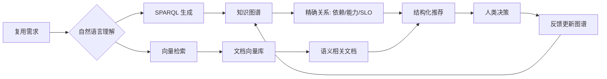

# 知识图谱与架构复用

> **版本**: 2026-07-09
> **定位**: 认知架构层——利用 W3C 语义网标准（RDF/OWL/SPARQL）将分散的架构知识组织为可推理、可复用的知识图谱，降低开发者的检索与理解认知负荷

---

## 1. 概念定义

**定义**：知识图谱（Knowledge Graph, KG）是一种用图结构表示知识的语义网络，节点表示实体（概念、组件、人员、决策），边表示实体间关系。在软件架构复用中，知识图谱将需求、设计模式、组件、接口、约束、历史决策等异构信息统一为可查询、可推理的语义模型。

**语义网技术栈**：

| 标准 | 作用 | 复用场景 |
|------|------|---------|
| **RDF** (Resource Description Framework) | 三元组（subject-predicate-object）数据模型 | 描述组件、接口、依赖关系 |
| **RDFS** (RDF Schema) | 定义类、属性、层级 | 建立组件类型 hierarchy |
| **OWL** (Web Ontology Language) | 表达复杂约束与推理规则 | 检测接口不兼容、推断隐含关系 |
| **SPARQL** | RDF 图查询语言 | 跨资产检索、影响分析、路径发现 |
| **SHACL** | 数据形状约束语言 | 验证知识图谱质量与一致性 |

---

## 2. 知识图谱降低复用认知负荷的机制

### 2.1 从“文档搜索”到“语义导航”

传统复用依赖关键词搜索与人工阅读，开发者需要在多份文档间建立心理模型。知识图谱通过显式关系将相关信息关联，使开发者能够沿着关系链快速定位上下文。

```text
需求 "支付对账"
  → 匹配领域概念 "Reconciliation"
  → 关联组件 "payment-reconciliation-service"
  → 关联接口 "POST /reconcile"
  → 关联 ADR "为什么选择事件溯源"
  → 关联失败案例 "双写导致不一致"
```

### 2.2 三类认知负荷的映射

| 认知负荷类型 | 知识图谱作用 | 示例 |
|-------------|------------|------|
| **外在负荷 ↓** | 减少跨文档切换与记忆负担 | 一次 SPARQL 查询返回组件、示例、风险 |
| **相关负荷 ↑** | 促进模式学习与因果关系理解 | 通过推理展示“使用 A 会导致 B” |
| **内在负荷 →** | 不消除领域复杂度，但显式化依赖 | 用 OWL 约束表达业务规则不变量 |

---

## 3. 架构复用中的知识图谱模式

### 模式 1：组件目录图谱（Component Catalog Graph）

将内部组件、开源包、API 契约建模为 RDF 实体，支持按功能、技术栈、团队、SLA 等多维度检索。

```turtle
@prefix ex: <http://example.org/arch#> .
@prefix rdfs: <http://www.w3.org/2000/01/rdf-schema#> .

ex:payment-gateway a ex:Component ;
    rdfs:label "Payment Gateway" ;
    ex:domain ex:Finance ;
    ex:language ex:Java ;
    ex:provides ex:ChargeService, ex:RefundService ;
    ex:ownedBy ex:PaymentsTeam ;
    ex:slu ex:SLO_999_100ms .
```

### 模式 2：决策血缘图谱（Decision Lineage Graph）

将架构决策记录（ADR）链接到相关组件、人员、假设与后果，支持“为什么这样设计”的追溯。

```turtle
ex:ADR_042 a ex:ArchitectureDecision ;
    ex:decides ex:EventSourcing ;
    ex:context "High-volume payment reconciliation" ;
    ex:consequence ex:ConsistencyDelay ;
    ex:supersedes ex:ADR_031 .
```

### 模式 3：依赖与影响图谱（Dependency & Impact Graph）

将代码依赖、数据流、部署关系建模为图，支持变更影响分析。

```turtle
ex:order-service ex:dependsOn ex:payment-gateway ;
    ex:readsFrom ex:orders-topic ;
    ex:deployedTo ex:k8s-cluster-east .
```

### 模式 4：能力-需求匹配图谱（Capability-Requirement Graph）

将业务需求抽象为能力（Capability），映射到可复用资产，支持从需求到实现的自然语言→SPARQL 转换。

```turtle
ex:Capability_Reconciliation a ex:Capability ;
    ex:matchesPattern ex:SagaPattern ;
    ex:implementedBy ex:payment-reconciliation-service .
```

---

## 4. 正向示例

### 示例 1：语义查询缩短组件发现时间

某金融平台将 200+ 内部组件与 50+ ADR 构建为 RDF 知识图谱。开发者在寻找“支持幂等退款的事件驱动组件”时，使用 SPARQL 查询：

```sparql
SELECT ?component WHERE {
  ?component a ex:Component ;
             ex:provides ex:RefundService ;
             ex:implementsPattern ex:IdempotencyPattern ;
             ex:style ex:EventDriven .
}
```

结果在 3 秒内返回 2 个候选组件，附带接口文档与失败案例。传统关键词搜索平均耗时 15 分钟且遗漏 1 个候选。

### 示例 2：OWL 推理发现隐含依赖冲突

某团队计划复用 `auth-jwt-rs256` 组件，知识图谱通过 OWL 推理发现该组件依赖 `crypto-lib >= 2.0`，而目标服务已锁定 `crypto-lib 1.5`。系统在推荐前自动标记兼容性风险，避免集成后运行时错误。

---

## 5. 反例 / 反模式

### 反例 1：图谱成为“数据垃圾场”

某企业将 CI/CD、日志、Wiki、Jira 全部无差别导入知识图谱，未定义本体与数据质量规则。结果图谱包含数百万低质量三元组，SPARQL 查询返回大量噪声，开发者宁愿回归文档搜索。

**教训**：知识图谱必须配套本体设计、SHACL 约束与治理流程，而非简单堆积数据。

### 反例 2：过度本体化拖慢复用

某团队为组件目录设计了 12 层 OWL 本体，要求每个组件填写 50+ 属性。开发者因填写负担过重而拒绝维护，图谱在三个月后与实际代码脱节，失去可信度。

**教训**：本体设计应遵循“最小可行语义（Minimum Viable Semantics）”，先覆盖高频查询场景，再逐步演进。

### 反例 3：忽视图谱与代码的同步

某平台知识图谱记录了组件版本，但代码仓库已升级多个 major 版本，图谱未同步。AI 助手基于过时图谱推荐废弃 API，导致生产故障。

**教训**：知识图谱必须纳入 CI/CD 流水线，实现代码-文档-图谱的自动同步。

---

## 6. 知识图谱复用的设计原则

| 原则 | 说明 | 落地检查 |
|------|------|---------|
| **语义显式化** | 将隐含关系（如“替代”、“依赖”、“冲突”）建模为 RDF 属性 | 每个核心组件至少有 5 个出边关系 |
| **渐进式本体** | 从 RDFS 开始，必要时引入 OWL | 避免一次性引入复杂推理 |
| **查询驱动设计** | 先定义开发者常用问题，再设计 schema | 用真实查询反推本体 |
| **质量门控** | 用 SHACL 验证数据完整性与一致性 | 每次提交前运行形状检查 |
| **人机协同更新** | 机器自动抽取，人工审核关键关系 | 关键 ADR 与风险必须人工标注 |

---

## 7. 与 RAG/LLM 的协同

知识图谱可作为 RAG 系统的结构化记忆层，弥补向量检索的可解释性不足：

```text
用户查询: "哪个组件适合处理高并发退款？"
  │
  ├── 向量检索: 召回相关文档片段（语义相似）
  │
  └── 图谱检索: 精确匹配 Capability → Component → SLO
       └── 返回: payment-gateway (SLO 999/100ms, EventDriven, Idempotent)
```

LLM 在生成推荐时，可引用图谱中的三元组作为可验证证据，降低幻觉风险。

---

## 8. Mermaid 概念图：知识图谱在复用决策中的位置



---

## 9. 权威来源

> **权威来源**:
>
> - [W3C RDF 1.2 Concepts and Abstract Data Model](https://www.w3.org/TR/rdf12-concepts/) — W3C Candidate Recommendation, 2026-04-07
> - [W3C OWL 2 Web Ontology Language Document Overview (Second Edition)](https://www.w3.org/TR/owl2-overview/) — W3C Recommendation, 2012-12-11
> - [W3C SPARQL 1.1 Query Language](https://www.w3.org/TR/sparql11-query/) — W3C Recommendation, 2013-03-21
> - [W3C SHACL Shapes Constraint Language](https://www.w3.org/TR/shacl/) — W3C Recommendation, 2017-07-20
> - [Linked Data Design Issues](https://www.w3.org/DesignIssues/LinkedData.html) — Tim Berners-Lee, 2006-07-27
> - 核查日期：2026-07-09

### 交叉引用

- 与 [认知负荷理论与架构复用](../03-cognitive-load-theory/cognitive-load-theory.md) 配合：知识图谱通过显式关系降低外在认知负荷。
- 与 [AI 辅助复用决策系统：原型设计](../05-ai-cognitive-augmentation/prototype-design.md) 配合：KG 为 RAG 提供结构化检索与可解释证据。
- 与 [BDI 智能体架构与复用模式](../02-bdi-model/bdi-agent-reuse.md) 关联：图谱中的信念库可作为 BDI Agent 的信念来源。

---

> 最后更新: 2026-07-09