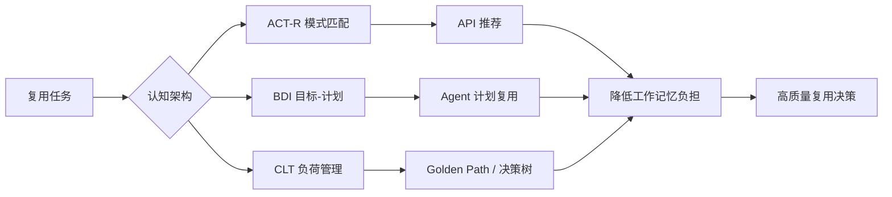

# 08 认知架构与复用决策

> **定位**：软件复用不仅是技术问题，更是认知问题。本主题研究人类开发者在复用决策中的信息处理过程，并据此设计降低认知负荷、提升决策质量的工具与流程。

---

## 1. 概念定义

**认知架构（Cognitive Architecture）** 是对人类或智能体信息处理结构（感知、记忆、决策、学习）的计算模型。在软件复用中，认知架构解释开发者如何搜索、理解、评估和适配可复用资产。

| 模型 | 核心概念 | 在复用中的映射 |
|------|----------|----------------|
| **ACT-R** | 声明性知识 + 产生式规则 + 工作记忆限制 | 开发者在 IDE 中检索与匹配复用模式 |
| **BDI** | 信念 Belief / 愿望 Desire / 意图 Intention | Agent 复用计划与目标驱动决策 |
| **认知负荷理论 CLT** | 内在 / 外在 / 相关认知负荷 | 文档、工具与流程对开发者心智资源的占用 |
| **双系统理论** | 系统 1（直觉）vs 系统 2（理性） | 复用决策中的现状偏差与过度自信 |
| **心智模型** | 人对系统运行方式的内部表征（Johnson-Laird, Norman） | 复用资产是否符合开发者直觉 |
| **分布式认知** | 认知分布于人、工具与环境（Hollan, Hutchins, Kirsh） | 工具链与组织流程对认知的外部支撑 |

**认知负荷守恒原则**：开发者的认知资源有限；复用资产与工具的设计目标应是降低外在负荷、优化相关负荷，而非消除内在负荷。

---

## 2. 认知架构与复用关系图

---

## 3. 正向示例

### 示例 1：ACT-R 驱动的 API 推荐

某 IDE 插件嵌入 ACT-R 模型，根据开发者当前编辑上下文、注视点与历史行为预测下一步可能需要的复用 API，并按工作记忆容量限制每次仅展示 3-5 个最相关建议；实验显示复用 API 采纳率提升 35%。

### 示例 2：BDI 故障排查 Agent

在智能运维系统中，故障排查 Agent 复用标准化“诊断计划”意图库：信念为监控数据，愿望为恢复 SLO，意图为按优先级执行检查清单。当多个告警同时发生时，愿望优先级机制避免意图抖动。

### 示例 3：认知负荷理论优化 Golden Path

平台工程团队将服务创建流程拆分为“决策树 + 可运行模板 + 失败案例”三段式文档；新开发者可在 10 分钟内完成首次部署，支持工单量下降 50%。

### 示例 4：双系统偏差修正

某组织在复用评估清单中强制要求列出“不复用的理由”，并引入独立评审，显著降低了系统 1 导致的现状偏差与沉没成本谬误。

### 示例 5：心智模型对齐的 API 设计

某内部平台将缓存组件的 API 命名为 `Cache.put(key, value, ttl)`，与开发者熟悉的 Redis 心智模型一致。新用户无需阅读文档即可正确调用，首次集成成功率从 55% 提升至 87%。

### 示例 6：分布式认知支持的 Golden Path

某团队将服务创建流程嵌入 IDE 插件：开发者无需离开编辑器即可完成模板选择、参数填写、CI/CD 配置。工具链作为外部记忆载体，减少了上下文切换带来的工作记忆负担，平均创建时间从 45 分钟降至 12 分钟。

---

## 4. 反例 / 失败案例

### 反例 1：200 页架构手册

某公司强制所有团队阅读统一的 200 页架构手册，但未提供可搜索的示例与决策树；开发者因外在认知负荷过高，最终回到复制-粘贴旧代码。

### 反例 2：50 个 API 无排序

代码补全工具一次性展示 50 个相关 API 而无优先级排序，超出工作记忆容量；开发者反而花更多时间筛选，集成错误率上升。

### 反例 3：Agent 意图抖动

某 Agent 系统缺乏明确的愿望优先级与意图承诺机制，在多个目标冲突时反复切换计划；复用计划无法收敛，导致运维操作失控。

### 反例 4：忽视专家-新手差异

平台团队用面向资深工程师的抽象文档培训新人，未提供脚手架与渐进式示例；新手复用失败率高，形成“复用只适用于专家”的误解。

### 反例 5：违背心智模型的命名

某团队将“消息队列消费者”命名为 `EventSiphon`，与开发者对“consumer”的心智模型脱节。尽管功能正确，但开发者频繁误用，文档阅读量增加 3 倍，集成错误率上升 40%。

### 反例 6：忽视分布式认知的“人脑备份”

某组织强制使用命令行工具复用组件，所有上下文信息需要开发者自行记忆。由于工具不提供状态可视化和历史记录，开发者在多步骤配置中频繁遗忘参数，导致 30% 的复用请求需要返工。

---

## 5. 认知设计决策矩阵

| 认知因素 | 设计建议 | 反模式 |
|----------|----------|--------|
| 工作记忆有限 | 每次展示 3-7 个选项，提供默认推荐 | 信息过载、无优先级 |
| 模式识别 | 提供可搜索的代码示例与相似场景 | 纯文字描述、无对照 |
| 内在负荷高 | 用决策树分解复杂选择 | 一次性呈现全部决策 |
| 元认知不足 | 显式展示复用假设与风险 | 隐藏依赖与约束 |
| 现状偏差 | 强制评估“不复用”理由 | 默认沿用旧实现 |

---

## 6. 关键公理

> **公理 C.1**（Cognitive Load Conservation）：开发者的认知资源是有限的。复用资产的设计目标应是**降低外在负荷**和**优化相关负荷**，而非消除内在负荷。

---

## 7. 权威来源

> **权威来源**：
>
> - [ACT-R Cognitive Architecture](https://act-r.psy.cmu.edu) — Carnegie Mellon University
> - [ACT-R Publications](https://act-r.psy.cmu.edu/publications) — Carnegie Mellon University
> - [BDI Agent Architecture - Michael Georgeff](https://www.cs.ox.ac.uk/people/michael.georgeff/) — University of Oxford
> - [AgentSpeak / Jason](http://jason.sourceforge.net/wp/) — Jason Agent Platform
> - [Cognitive Load Theory - ScienceDirect Topics](https://www.sciencedirect.com/topics/psychology/cognitive-load-theory)
> - [Sweller, J. (2011). Cognitive Load Theory. *Psychology of Learning and Motivation*, 55, 37–76](https://doi.org/10.1016/B978-0-12-387691-1.00002-8)
> - [NASA Task Load Index (TLX)](https://www.nasa.gov/human-systems-integration-division/nasa-task-load-index-tlx/) — NASA, 2026-03-03
> - [Mental Models and Human Reasoning - P.N. Johnson-Laird, PNAS 2010](https://www.pnas.org/content/107/43/18243)
> - [Mental Models - Princeton University](https://mentalmodels.princeton.edu/about/what-are-mental-models/)
> - [The Design of Everyday Things - Don Norman](https://www.nngroup.com/articles/two-ux-gulfs-evaluation-execution/)
> - [Distributed Cognition: Toward a New Foundation for HCI - Hollan, Hutchins, Kirsh, ACM TOCHI 2000](https://doi.org/10.1145/353485.353487)
> - [Cognition in the Wild - Edwin Hutchins, MIT Press 1995](https://doi.org/10.7551/mitpress/1881.001.0001)
> - [Guidelines for Human-AI Interaction - Amershi et al., CHI 2019](https://www.microsoft.com/en-us/research/publication/guidelines-for-human-ai-interaction/)
> - [NIST AI Risk Management Framework 1.0](https://www.nist.gov/itl/ai-risk-management-framework)
> - 核查日期：2026-07-09

---

## 8. 当前状态与关联主题

- [x] 认知模型映射（ACT-R / BDI / 双系统）
- [x] 认知负荷量化模型 (`03-cognitive-load-theory/quantitative-model.md`)
- [x] AI 辅助复用决策原型 (`05-ai-cognitive-augmentation/`)
- [ ] 眼动追踪 / EEG 实验设计 (P2, 2027-Q1)

关联主题：

- `12-ai-native-reuse`（AI 增强开发者决策）
- `13-emerging-trends`（平台工程与开发者体验）

## 9. 认知架构落地检查单

在设计与评估复用支持工具时，团队应检查以下认知因素：

- [ ] 是否将信息分块，每屏/每次展示不超过 7±2 个选项？
- [ ] 是否为开发者提供可搜索的代码示例、决策树与失败案例？
- [ ] 是否区分专家与新手用户，提供渐进式脚手架？
- [ ] 是否显式展示复用资产的前置条件、依赖与风险？
- [ ] 是否通过默认推荐与模板降低外在认知负荷？
- [ ] 是否收集使用反馈并迭代优化信息呈现方式？
- [ ] 是否评估工具对 NASA-TLX 或主观负荷量表的影响？
- [ ] 是否识别并修正现状偏差、过度自信等认知偏差？

## 10. 认知模型与工具映射

| 认知模型 | 核心洞察 | 工具设计建议 |
|----------|----------|--------------|
| ACT-R | 工作记忆有限，模式匹配驱动专家行为 | 限制推荐数量，提供上下文感知示例 |
| BDI | 目标-计划-意图层级影响 Agent 行为 | 显式愿望优先级，避免意图抖动 |
| CLT | 外在负荷应最小化，相关负荷应最大化 | 决策树、可运行模板、错误模式库 |
| 双系统理论 | 系统 1 易陷入偏差，系统 2 需要触发 | 强制检查清单、独立评审、A/B 测试 |

## 11. 常见误区

- **误区 1：信息越多越好**。过量文档与选项会超出工作记忆，降低复用效率。
- **误区 2：只面向专家设计**。新手需要更多脚手架，否则复用失败率高。
- **误区 3：忽视失败案例**。只展示成功案例会让开发者低估复用风险。
- **误区 4：把认知负荷当作借口**。降低外在负荷不等于降低质量要求。
- **误区 5：Agent 越自治越好**。缺乏约束的 Agent 会带来不可控风险。
- **误区 6：一次性推出复杂平台**。应通过 MVP 与反馈循环渐进演进。
- **误区 7：不度量认知效果**。没有 NASA-TLX 等度量，改进无从谈起。
- **误区 8：忽略组织文化**。再优的工具也会因习惯与激励机制被绕过。

## 12. 延伸阅读

1. Anderson, J. R. *How Can the Human Mind Occur in the Physical Universe?* — ACT-R 综合论述。
2. Rao, A. S. & Georgeff, M. P. *BDI Agents: From Theory to Practice* — BDI 模型经典。
3. Sweller, J. *Cognitive Load Theory* — 认知负荷理论系统教材。
4. Kahneman, D. *Thinking, Fast and Slow* — 双系统理论与决策偏差。
5. Nielsen, J. *Usability Engineering* — 可用性与认知负荷的工程实践。

将认知科学融入复用工程，是提升开发者体验与复用采纳率的关键杠杆。

## 13. 深度案例：平台文档重构降低新开发者认知负荷

某大型企业内部开发者平台上线初期，新用户需要阅读 80 页文档才能完成首个服务部署。支持团队发现，60% 的新用户在第三天仍未完成首次部署，反馈集中在“信息太多、不知道下一步该做什么”。

平台团队基于认知负荷理论进行重构：

1. **分块呈现**：将 80 页文档拆分为 5 个 10 分钟可完成的微教程。
2. **决策树导航**：根据应用场景自动推荐 Golden Path，减少选择 paralysis。
3. **可运行模板**：每个教程附带可直接执行的示例仓库，降低外在负荷。
4. **失败案例库**：汇总常见错误与修复步骤，帮助开发者快速排除问题。

重构后，新用户首次部署完成率从 40% 提升到 88%，支持工单下降 55%。该案例验证了认知架构在复用采纳中的直接价值。

## 14. 关键行动项

- 对现有复用文档进行 NASA-TLX 或认知负荷主观量表评估。
- 将长文档拆分为分块、可执行、带失败案例的微教程。
- 在 IDE 与平台门户中引入上下文感知的推荐与默认选项。
- 建立认知设计反馈闭环，每季度收集开发者体验数据。
- 针对 Agent 与 AI 辅助工具，评估 BDI 与 CLT 设计约束。

## 15. 版本记录

- 2026-07-09：对齐国际权威来源，补充心智模型（Johnson-Laird / Norman）、分布式认知（Hollan / Hutchins / Kirsh）、Human-AI Teaming（Amershi / NIST AI RMF）与知识图谱（W3C RDF/OWL/SPARQL）内容；新增正向示例与反例；合并机械重复段落。
- 2026-07-07：补充 ACT-R、BDI、认知负荷理论的概念定义、示例、反例、关系图与权威来源。
- 2026-06-08：初始版本，建立认知模型映射与核心内容导航。

## 16. 一句话总结

> 再完美的复用资产，若超出人类工作记忆与决策能力，也难以被有效复用。认知架构让复用设计回归“人”的尺度。

## 17. 持续改进方向

- 建立开发者复用行为的日志数据集，用于验证 ACT-R 预测模型。
- 在 IDE 与平台门户中 A/B 测试不同信息呈现方式。
- 将 NASA-TLX 量表嵌入复用工具，持续监测认知负荷变化。
- 研究 AI 辅助工具对新手与专家认知负荷的差异影响。
- 追踪 W3C 语义网标准与 Human-AI Teaming 研究进展，更新本主题内容。
