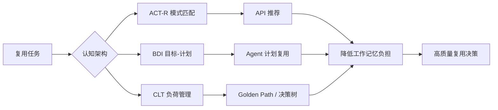

# 08 认知架构与复用决策

> **定位**：软件复用不仅是技术问题，更是认知问题。本主题研究人类开发者在复用决策中的信息处理过程，并据此设计降低认知负荷、提升决策质量的工具与流程。

---

## 1. 概念定义

**认知架构（Cognitive Architecture）** 是对人类或智能体信息处理结构（感知、记忆、决策、学习）的计算模型。在软件复用中，认知架构解释开发者如何搜索、理解、评估和适配可复用资产。

| 模型 | 核心概念 | 在复用中的映射 |
|------|----------|----------------|
| **ACT-R** | 声明性知识 + 产生式规则 + 工作记忆限制 | 开发者在 IDE 中检索与匹配复用模式 |
| **BDI** | 信念 Belief / 愿望 Desire / 意图 Intention | Agent 复用计划与目标驱动决策 |
| **认知负荷理论 CLT** | 内在 / 外在 / 相关认知负荷 | 文档、工具与流程对开发者心智资源的占用 |
| **双系统理论** | 系统 1（直觉）vs 系统 2（理性） | 复用决策中的现状偏差与过度自信 |

**认知负荷守恒原则**：开发者的认知资源有限；复用资产与工具的设计目标应是降低外在负荷、优化相关负荷，而非消除内在负荷。

---

## 2. 认知架构与复用关系图

---

## 3. 正向示例

### 示例 1：ACT-R 驱动的 API 推荐
某 IDE 插件嵌入 ACT-R 模型，根据开发者当前编辑上下文、注视点与历史行为预测下一步可能需要的复用 API，并按工作记忆容量限制每次仅展示 3-5 个最相关建议；实验显示复用 API 采纳率提升 35%。

### 示例 2：BDI 故障排查 Agent
在智能运维系统中，故障排查 Agent 复用标准化“诊断计划”意图库：信念为监控数据，愿望为恢复 SLO，意图为按优先级执行检查清单。当多个告警同时发生时，愿望优先级机制避免意图抖动。

### 示例 3：认知负荷理论优化 Golden Path
平台工程团队将服务创建流程拆分为“决策树 + 可运行模板 + 失败案例”三段式文档；新开发者可在 10 分钟内完成首次部署，支持工单量下降 50%。

### 示例 4：双系统偏差修正
某组织在复用评估清单中强制要求列出“不复用的理由”，并引入独立评审，显著降低了系统 1 导致的现状偏差与沉没成本谬误。

---

## 4. 反例 / 失败案例

### 反例 1：200 页架构手册
某公司强制所有团队阅读统一的 200 页架构手册，但未提供可搜索的示例与决策树；开发者因外在认知负荷过高，最终回到复制-粘贴旧代码。

### 反例 2：50 个 API 无排序
代码补全工具一次性展示 50 个相关 API 而无优先级排序，超出工作记忆容量；开发者反而花更多时间筛选，集成错误率上升。

### 反例 3：Agent 意图抖动
某 Agent 系统缺乏明确的愿望优先级与意图承诺机制，在多个目标冲突时反复切换计划；复用计划无法收敛，导致运维操作失控。

### 反例 4：忽视专家-新手差异
平台团队用面向资深工程师的抽象文档培训新人，未提供脚手架与渐进式示例；新手复用失败率高，形成“复用只适用于专家”的误解。

---

## 5. 认知设计决策矩阵

| 认知因素 | 设计建议 | 反模式 |
|----------|----------|--------|
| 工作记忆有限 | 每次展示 3-7 个选项，提供默认推荐 | 信息过载、无优先级 |
| 模式识别 | 提供可搜索的代码示例与相似场景 | 纯文字描述、无对照 |
| 内在负荷高 | 用决策树分解复杂选择 | 一次性呈现全部决策 |
| 元认知不足 | 显式展示复用假设与风险 | 隐藏依赖与约束 |
| 现状偏差 | 强制评估“不复用”理由 | 默认沿用旧实现 |

---

## 6. 关键公理

> **公理 C.1**（Cognitive Load Conservation）：开发者的认知资源是有限的。复用资产的设计目标应是**降低外在负荷**和**优化相关负荷**，而非消除内在负荷。

---

## 7. 权威来源

> **权威来源**：
>
> - [ACT-R Cognitive Architecture](https://act-r.psy.cmu.edu) — Carnegie Mellon University
> - [ACT-R Publications](https://act-r.psy.cmu.edu/publications) — Carnegie Mellon University
> - [BDI Agent Architecture - Michael Georgeff](https://www.cs.ox.ac.uk/people/michael.georgeff/) — University of Oxford
> - [AgentSpeak / Jason](http://jason.sourceforge.net/wp/) — Jason Agent Platform
> - [Cognitive Load Theory - ScienceDirect Topics](https://www.sciencedirect.com/topics/psychology/cognitive-load-theory)
> - [Sweller, J. (1988). Cognitive Load Theory. *Learning and Instruction*](https://link.springer.com/article/10.1007/s10648-010-9135-0)
> - Kahneman, D. (2011). *Thinking, Fast and Slow*. Farrar, Straus and Giroux.
> - 核查日期：2026-07-07

---

## 8. 当前状态与关联主题

- [x] 认知模型映射（ACT-R / BDI / 双系统）
- [x] 认知负荷量化模型 (`03-cognitive-load-theory/quantitative-model.md`)
- [x] AI 辅助复用决策原型 (`05-ai-cognitive-augmentation/`)
- [ ] 眼动追踪 / EEG 实验设计 (P2, 2027-Q1)

关联主题：

- `12-ai-native-reuse`（AI 增强开发者决策）
- `13-emerging-trends`（平台工程与开发者体验）
