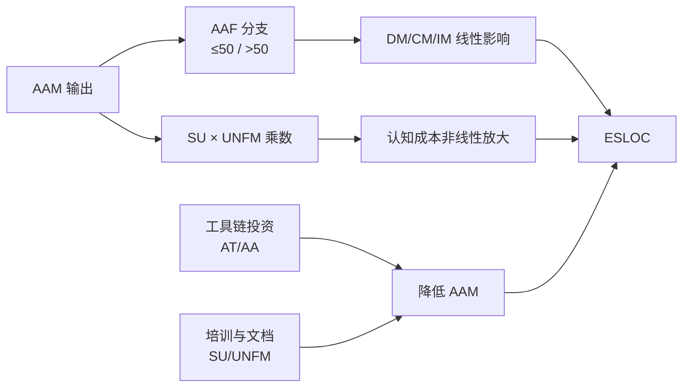

# COCOMO II 复用模型深度解析
>
> 版本: 2026-06-06
> 对齐来源: Boehm et al. (2000) COCOMO II Model Definition Manual, USC CSSE, COCOMO II.2000 校准数据

## 1. 核心概念定义

- **COCOMO II（Constructive Cost Model II）**：由 Barry Boehm 等人在 USC CSSE 提出的软件成本估算模型，通过规模、成本驱动器、规模因子与复用参数预测工作量与工期。
- **等价新代码量（ESLOC）**：将复用资产按适配度折算后，与全新开发代码等价的工作量规模。
- **适配调整乘数（AAM）**：综合自动化程度、结构修改、理解成本与熟悉度，将复用代码量转换为 ESLOC 的乘数。
- **复用经济性**：复用收益（避免新开发成本）与复用成本（评估、适配、集成、维护、机会成本）之间的权衡。

## 2. COCOMO II 子模型体系

| 子模型 | 适用阶段 | 输入 | 输出 |
|-------|---------|------|------|
| **Application Composition** | 原型/早期 | 对象点（Object Points）、复用比例 | 工作量（PM）|
| **Early Design** | 需求确认后、设计开始前 | 功能点 / SLOC、成本驱动器 | 工作量 + 工期 |
| **Reuse** | 复用组件集成时 | 适配代码量（ASLOC）、修改度参数 | 等价新代码量（ESLOC）|
| **Post-Architecture** | 架构设计完成后 | 模块 SLOC、17 个成本驱动器、5 个规模因子 | 精确工作量 + 工期 |
| **Maintenance** | 维护阶段 | 基线代码量、变更因子 | 维护工作量 |

## 3. 复用模型（Reuse Model）核心方程

### 3.1 等价源代码行（Equivalent KSLOC）

```text
ESLOC = ASLOC × (1 - AT/100) × AAM
```

| 符号 | 含义 |
|-----|------|
| **ASLOC** | 需适配的源代码千行数（Adapted KSLOC）|
| **AT** | 自动转换百分比（Assessment/Translation）|
| **AAM** | 适配调整因子（Adaptation Adjustment Multiplier）|

### 3.2 适配调整因子 AAM

```text
AAM = [AA + AAF × (1 + 0.02 × SU × UNFM)] / 100     (AAF ≤ 50)
AAM = [AA + AAF + (SU × UNFM)] / 100               (AAF > 50)
```

| 符号 | 含义 | 计算 |
|-----|------|------|
| **AA** | 评估与改编百分比（Assessment & Adaptation）| 自动评估+改编工具的效率 |
| **AAF** | 适配改编因子（Adaptation Adjustment Factor）| 0.4×DM + 0.3×CM + 0.3×IM |
| **DM** | 设计修改百分比（Design Modified）| 被复用组件的设计变更比例 |
| **CM** | 代码修改百分比（Code Modified）| 被复用组件的代码变更比例 |
| **IM** | 集成修改百分比（Integration Modified）| 集成测试重新做的比例 |
| **SU** | 软件理解增量（Software Understanding）| 10%–50%，取决于结构清晰度 |
| **UNFM** | 程序员不熟悉度（Unfamiliarity）| 1.0（熟悉）– 1.5（全新）|

### 3.3 软件理解增量 SU

| 评级 | 结构 | 应用清晰度 | 自描述性 | SU |
|-----|------|-----------|---------|-----|
| Very High | 优秀 | 优秀 | 优秀 | 10% |
| High | 良好 | 良好 | 良好 | 20% |
| Nominal | 一般 | 一般 | 一般 | 30% |
| Low | 差 | 差 | 差 | 40% |
| Very Low | 极差 | 极差 | 极差 | 50% |

## 4. 应用组合模型（Application Composition Model）

适用于原型项目和存在大量复用的场景：

```text
PM = (NAP × (1 - %reuse/100)) / PROD
```

| 符号 | 含义 |
|-----|------|
| **NAP** | 应用点（Application Points）/ 对象点数量 |
| **%reuse** | 复用比例 |
| **PROD** | 生产率（对象点/人月）|

**生产率参考**：

| 开发者经验 / CASE 工具成熟度 | 低 | 中 | 高 |
|---------------------------|----|----|----|
| 低 | 4–7 | 7–13 | 13–25 |
| 中 | 7–13 | 13–25 | 25–50 |
| 高 | 13–25 | 25–50 | 50–80 |

## 5. 早期设计模型（Early Design Model）

### 5.1 基础方程

```text
PM = A × Size^B × M

其中：
M = PERS × RCPX × RUSE × PDIF × PREX × FCIL × SCED
B = 1.01 + 0.01 × Σ(Wi × Si)
```

### 5.2 与复用直接相关的成本驱动器

| 驱动器 | 全称 | 作用 |
|-------|------|------|
| **RUSE** | Required Reuse | 开发可复用组件所需的额外工作量 |
| **RCPX** | Product Reliability & Complexity | 产品可靠性与复杂度 |
| **PDIF** | Platform Difficulty | 平台难度 |
| **PREX** | Personnel Experience | 人员经验 |
| **PERS** | Personnel Capability | 人员能力 |
| **FCIL** | Facilities | 工具与环境支持 |
| **SCED** | Required Development Schedule | 开发进度要求 |

**RUSE 评级影响**：

| RUSE 评级 | 含义 | 工作量乘数 |
|----------|------|-----------|
| Nominal | 无特殊复用要求 | 1.00 |
| High | 跨项目复用 | 1.07 |
| Very High | 跨产品线复用 | 1.15 |
| Extra High | 跨组织/多产品线复用 | 1.24 |

## 6. 维护模型（Maintenance Model）

### 6.1 维护规模方程

```text
Size_M = (Base Code Size × MCF) × MAF

或

Size_M = (Size Added + Size Modified) × MAF
```

| 符号 | 含义 |
|-----|------|
| **MCF** | 维护变更因子 = (新增 + 修改) / 基线代码量 |
| **MAF** | 维护调整因子 = 1 + (SU/100 × UNFM) |

> 注意：当基线代码变更 ≤ 新开发代码 20% 时使用复用模型；超过 20% 时使用维护规模模型。

## 7. 规模因子（Scale Factors）

五个规模因子影响指数 B（项目经济性）：

| 因子 | 全称 | 高值影响 |
|-----|------|---------|
| **PREC** | Precedentedness | 先例性低 → 成本高 |
| **FLEX** | Development Flexibility | 灵活性低 → 成本高 |
| **RESL** | Architecture/Risk Resolution | 风险化解低 → 成本高 |
| **TEAM** | Team Cohesion | 团队凝聚力低 → 成本高 |
| **PMAT** | Process Maturity | 过程成熟度低 → 成本高 |

PMAT 与 CMMI 的映射：

| CMMI 等级 | PMAT 评级 |
|----------|----------|
| 1 | Very Low |
| 2 | Low |
| 3 | Nominal |
| 4 | High |
| 5 | Very High |

## 8. NASA Reuse Readiness Levels (RRL) 与 COCOMO II 复用映射

NASA ESDS Software Reuse Working Group 提出的 Reuse Readiness Levels（RRL，NASA NTRS 20120010312）从 1（Limited reusability）到 9（Demonstrated extensive reusability）评估软件资产的可复用成熟度。RRL 可作为 COCOMO II 中 RUSE、SU、UNFM 等参数的快速标定输入。

| RRL 等级 | 摘要 | COCOMO II 映射建议 |
|:---|:---|:---|
| RRL 1 | 不建议复用 | 不进入复用模型，按新开发估算 |
| RRL 2 | 初始可复用，实际不可行 | RUSE 基准 1.00，SU=50%，UNFM=1.5 |
| RRL 3 | 基本可复用，高成本高风险 | RUSE=0.95，SU=40%，UNFM=1.4 |
| RRL 4 | 可复用，多数用户需一定努力 | RUSE=0.89，SU=30%，UNFM=1.3 |
| RRL 5 | 复用可行，合理成本风险 | RUSE=0.84，SU=25%，UNFM=1.2 |
| RRL 6 | 可复用，多数用户适用 | RUSE=0.78，SU=20%，UNFM=1.1 |
| RRL 7 | 高度可复用，最小成本风险 | RUSE=0.72，SU=15%，UNFM=1.0 |
| RRL 8 | 已本地验证复用 | RUSE=0.65，SU=10%，UNFM=1.0 |
| RRL 9 | 已广泛跨系统复用 | RUSE=0.56（2026 校准），SU=10%，UNFM=1.0 |

**使用建议**：

- 在资产目录中记录每个候选组件的 RRL 等级，作为资产成熟度评级。
- RRL ≥ 5 的组件才建议进入白盒/黑盒复用经济性评估；RRL < 5 按新开发或购买 COTS 处理。
- RRL 与 COCOMO II 参数映射应每半年用本地历史数据校准一次。

## 9. 本地校准方法

### 9.1 为什么要校准

> "COCOMO II 在针对组织本地环境校准时显著更准确。"

默认校准基于 161 个样本项目。本地校准只需调整常数 A：

```text
ln(A) = average[ln(PM_actual) - ln(PM_unadjusted)]
A = e^X
```

### 9.2 校准数据要求

- 至少 5 个已完成项目的数据点
- 记录实际工作量（从需求分析结束到集成测试结束）
- 记录最终产品规模、规模因子、成本驱动器评级

## 10. 复用经济学决策框架

### 10.1 自制 vs 复用 vs 购买决策

| 选项 | COCOMO II 输入 | 适用条件 |
|-----|---------------|---------|
| **新开发** | Size = 全新 KSLOC | 无合适现有组件 |
| **白盒复用** | ASLOC + DM/CM/IM + SU/UNFM | 需要修改集成 |
| **黑盒复用** | AA + AAF ≤ 50 | 接口兼容，无需修改 |
| **购买 COTS** | 采购成本 + 集成工作量估算 | 市场有成熟产品 |

### 10.2 投资回报计算

```text
复用 ROI = (避免的新开发成本 - 复用成本) / 复用成本 × 100%

其中：
复用成本 = 评估成本 + 改编成本 + 集成成本 + 理解成本 + 许可证成本
```

## 11. 局限性与现代演进

### 11.1 已知局限

- 基于 SLOC/功能点，对现代云原生/无服务器架构适配有限
- 默认校准数据偏传统项目（2000 年前）
- 未直接考虑开源组件的隐性成本（安全审计、许可证合规）

### 11.2 现代扩展方向

- **功能点 → 故事点 / 对象点**：敏捷环境适配
- **SLOC → 依赖复杂度**：开源时代的新规模度量
- **本地校准自动化**：基于历史项目数据的 ML 辅助校准

## 10. 参考索引

- Boehm, B. et al.: *Software Cost Estimation with COCOMO II* (Prentice Hall, 2000)
- USC CSSE: COCOMO II Model Definition Manual (2000)
- COCOMO II.2000 Calibration Data (161 projects)
- Jones, C.: *Applied Software Measurement* (SLOC/FP 转换表)
- IFPUG: Function Point Counting Practices Manual (1994+)

---

## 11. 形式化定义与属性体系

### 11.1 COCOMO II 复用模型定义

**定义**：COCOMO II 复用模型（Reuse Model）是 COCOMO II 成本估算框架的子模型之一，用于将既有软件资产通过适配、转换与集成纳入新项目时，把“复用代码量”折算为“等价新开发代码量（Equivalent New SLOC, ESLOC）”，从而与 Post-Architecture 模型统一计算工作量与工期。该模型由 Barry Boehm 等人在 *Software Cost Estimation with COCOMO II*（2000）中提出，其核心理念是：**复用不等于免费，其价值取决于适配度、理解成本与自动化水平**。

### 11.2 参数属性总表

| 参数 | 类型 | 取值范围 | 经济含义 | 可优化性 |
|------|------|---------|---------|---------|
| ASLOC | 输入 | >0 KSLOC | 待适配资产规模 | 低（由候选资产决定） |
| AT | 输入 | 0–100% | 自动转换/评估比例 | 高（工具链投资） |
| AA | 输入 | 0–100% | 评估与改编自动化程度 | 高（静态分析、重构工具） |
| AAF | 派生 | 0–100% | 设计/代码/集成修改综合因子 | 中（接口设计） |
| DM | 输入 | 0–100% | 设计修改比例 | 中（松耦合接口） |
| CM | 输入 | 0–100% | 代码修改比例 | 中（配置化程度） |
| IM | 输入 | 0–100% | 集成测试重做比例 | 中（契约测试、CI） |
| SU | 评级 | 10–50% | 软件理解增量 | 高（文档、命名、结构） |
| UNFM | 评级 | 1.0–1.5 | 程序员不熟悉度 | 中（培训、领域对齐） |
| AAM | 输出 | 0–1.5 | 适配调整乘数 | 综合结果 |
| ESLOC | 输出 | ≥0 KSLOC | 等价新代码量 | 决策依据 |

### 11.3 参数关系说明

AAM 是复用模型的中枢，它将四类成本整合为单一乘数：

1. **自动化成本（AA/AT）**：工具越成熟，人工评估与改编越少，AAM 越低。
2. **结构修改成本（AAF）**：DM/CM/IM 直接度量“复用资产与新上下文的不匹配程度”。当 AAF ≤ 50 时，理解与熟悉成本被 0.02 系数压缩；当 AAF > 50 时，理解与熟悉成本线性叠加，惩罚显著加大。
3. **认知成本（SU × UNFM）**：文档清晰、结构良好、团队熟悉可显著降低 SU 与 UNFM。

形式化关系：

```text
AAM ∝ (DM, CM, IM, SU, UNFM)
AAM ∝ 1/Automation
ESLOC ∝ ASLOC × AAM
PM ∝ ESLOC^B
```

因此，**复用的经济性 = 规模节省 × 适配惩罚 × 生产率折扣**。当 AAM > 0.7 时，复用的直接成本优势迅速衰减（参见本系列 ROI 框架中的定理 V.T1）。

## 13. 计算示例

### 示例 1：企业级消息中间件复用

某金融科技团队计划复用既有企业级消息中间件（Kafka 封装层），用于新的风控通知系统。已知：

- ASLOC = 120 KSLOC（待适配资产规模）
- AT = 30%（可通过 Schema Registry 自动完成 30% 的字段映射）
- DM = 20%（需要新增分区策略与副本因子配置）
- CM = 15%（Producer/Consumer 配置代码需要调整）
- IM = 25%（集成测试需要覆盖新的失败场景）
- SU = 20%（结构良好、文档清晰）
- UNFM = 1.2（团队对 Kafka 较熟悉，但对封装层部分高级特性不熟悉）

### 分步计算

**步骤 1：计算 AAF**

```text
AAF = 0.4×DM + 0.3×CM + 0.3×IM
    = 0.4×20 + 0.3×15 + 0.3×25
    = 8 + 4.5 + 7.5
    = 20%
```

**步骤 2：计算 AAM**

AAF = 20 ≤ 50，使用第一分支：

```text
AA 取 AT 的评估与改编综合值 = 30%
AAM = [AA + AAF × (1 + 0.02 × SU × UNFM)] / 100
    = [30 + 20 × (1 + 0.02 × 20 × 1.2)] / 100
    = [30 + 20 × (1 + 0.48)] / 100
    = [30 + 20 × 1.48] / 100
    = [30 + 29.6] / 100
    = 59.6 / 100
    = 0.596
```

**步骤 3：计算 ESLOC**

```text
ESLOC = ASLOC × (1 - AT/100) × AAM
      = 120 × (1 - 0.30) × 0.596
      = 120 × 0.70 × 0.596
      = 50.064 KSLOC
```

**步骤 4：与全新开发对比**

若全新开发该消息中间件封装层，估算为 120 KSLOC；复用折算后仅约 50 KSLOC，**规模节省约 58.3%**。进一步代入 Post-Architecture 模型（假设 A=2.94，B=1.1，M=1.0）：

```text
PM_new = 2.94 × 120^1.1 ≈ 2.94 × 174.6 ≈ 513 人月
PM_reuse = 2.94 × 50.064^1.1 ≈ 2.94 × 67.7 ≈ 199 人月
```

**工期节省约 61%**，但需额外计入评估、培训与许可证成本（约 30 人月），**净工作量节省约 55%**。

## 14. 2026 校准建议

COCOMO II 的默认校准数据来自 2000 年前后的项目，对现代软件工程的适用性需要主动修正。2026 年推荐以下校准策略：

| 校准维度 | 2000 默认假设 | 2026 修正建议 | 理由 |
|---------|-------------|--------------|------|
| 生产率基准 | 功能点/SLOC | 引入故事点、对象点、依赖复杂度 | 云原生、无服务器、低代码改变规模度量 |
| 复用率 | 20–40% | 40–70%（平台工程成熟组织） | 内部平台、Golden Path 显著提升复用 |
| AA 自动化 | 低 | 中高（AI 辅助代码理解、重构） | Copilot、静态分析、自动生成测试 |
| SU 理解增量 | 30% | 15–25%（文档与 IDE 集成改善） | 交互式文档、内联示例降低认知负荷 |
| 开源合规成本 | 未计入 | 单独成本项 | SBOM、许可证审计、供应链安全 |
| 远程协作因子 | 未计入 | 纳入 TEAM/PMAT | 分布式团队对沟通与流程成熟度更敏感 |

**本地校准步骤（2026 版）**：

1. 收集过去 12–24 个月至少 8–10 个复用项目的实际数据。
2. 记录：ASLOC、AT、DM/CM/IM、SU、UNFM、实际工作量、实际工期、缺陷数。
3. 用贝叶斯回归或最小二乘法重新估计 AAM 分支阈值（0.02 系数可微调为 0.015–0.025）。
4. 对 AI 辅助改编项目单独建立子模型，AA 可上浮 10–20%。
5. 每季度用新数据滚动更新校准参数。

## 15. Mermaid 决策树：复用经济性评估

```mermaid
graph TD
    A[识别候选复用资产] --> B{AAF < AAF_ECONOMIC_FLOOR (0.7)?}
    B -->|是| C{是否有成熟工具链?}
    B -->|否| D[倾向新开发或购买 COTS]
    C -->|是| E[高自动化复用: AT↑, SU↓]
    C -->|否| F[人工适配复用: 计入培训与理解成本]
    E --> G{ESLOC < 0.5 × 新开发规模?}
    F --> G
    G -->|是| H[进入复用实施: 估算 PM = A × ESLOC^B × M]
    G -->|否| I[重新审视接口设计: 降低 DM/CM/IM]
    H --> J[持续跟踪实际 vs 估算, 滚动校准]
    I --> B
```

## 16. 反例

### 反例 1：忽视理解成本

**反例**：某团队宣称“复用内部订单组件，代码复用率 80%，因此节省 80% 工作量”。

某团队宣称“复用内部订单组件，代码复用率 80%，因此节省 80% 工作量”。实际未计入：

- 新团队对该组件 unfamiliarity（UNFM=1.5）；
- 文档缺失导致 SU=50%；
- 接口与新业务场景不匹配，AAF = 0.65（COCOMO 原始百分比写法 65%，canonical 为 0.65）。

重新计算后 AAM ≈ 1.1，ESLOC 反而超过新开发规模，项目最终延期 40%。

### 反例 2：高 AAF 仍强行复用

**反例**：某项目复用 legacy 银行核心模块，DM=40, CM=35, IM=30，AAF=35.5。

某项目复用 legacy 银行核心模块，DM=40, CM=35, IM=30，AAF=35.5。虽然 AAF 未超过 50，但模块结构混乱（SU=50）、团队全新（UNFM=1.5）。AAM 计算：

```text
AAM = [10 + 35.5 × (1 + 0.02 × 50 × 1.5)] / 100
    = [10 + 35.5 × 2.5] / 100
    = 98.75 / 100
    = 0.9875
```

几乎无节省，且维护耦合严重，三年后替换成本远超当初新开发。

### 反例 3：未校准直接使用默认常数

**反例**：某初创公司直接套用 COCOMO II 默认 A=2.94，实际工作量为估算的 2.3 倍。

某初创公司直接套用 COCOMO II 默认 A=2.94，但其团队成熟度低、技术栈新、复用工具链不完善，实际工作量为估算的 2.3 倍。经本地校准后 A 调整为 4.1，后续项目估算误差降至 ±20%。

## 17. 权威来源与交叉引用

| 来源 | URL | 核查日期 |
|:---|:---|:---|
| USC COCOMO II | <https://cssed.usc.edu/research/research-sponsored-software/cocomo/cocomo-ii/> | 2026-07-09 |
| COCOMO II Model Definition Manual (PDF) | <https://athena.ecs.csus.edu/~buckley/CSc231_files/Cocomo_II_Manual.pdf> | 2026-07-09 |
| NASA Reuse Readiness Levels (RRL) | <https://ntrs.nasa.gov/api/citations/20120010312/downloads/20120010312.pdf> | 2026-07-09 |
| NASA SWEHB — Software Reuse Catalog | <https://swehb.nasa.gov/display/SWEHBVD/SWE-148+-+Contribute+to+Agency+Software+Catalog> | 2026-07-09 |
| CMMI Institute | <https://cmmiinstitute.com/> | 2026-07-09 |
| Wikipedia — COCOMO | <https://en.wikipedia.org/wiki/COCOMO> | 2026-07-09 |

### 交叉引用

- 与 [架构复用 ROI 框架](../02-roi-npv-models/roi-framework.md) 共同构成“成本估算 → 经济决策”闭环。
- 与 [软件复用的 ROI、实物期权与战略价值量化](../02-roi-npv-models/roi-real-options-strategic-value.md) 配合，可将 COCOMO II 估算结果输入 NPV/实物期权分析。
- 与 [认知负荷理论与架构复用](../../08-cognitive-architecture/03-cognitive-load-theory/cognitive-load-theory.md) 关联：SU 与 UNFM 本质上是开发者认知负荷的量化 proxy。
- 可运行工具：[`../tools/cocomo-calculator.py`](../tools/cocomo-calculator.py)、[`../tools/cocomo-streamlit.py`](../tools/cocomo-streamlit.py)、[`../tools/cocomo-scenario.yaml`](../tools/cocomo-scenario.yaml)

## 18. COCOMO II 复用模型的敏感性分析

### 18.1 形式化定义

**定义**：敏感性分析（Sensitivity Analysis）用于衡量 COCOMO II 复用模型输出（ESLOC、PM、AAM）对各输入参数变化的响应程度。在复用决策中，它帮助识别“关键杠杆参数”——即少量改善即可显著改变复用经济性的因子，从而指导投资优先级。

常用方法包括：

- **单因素敏感性分析**：固定其他参数，只改变一个参数，观察 ESLOC 变化。
- **龙卷风图（Tornado Diagram）**：按影响幅度从大到小排列参数，直观展示关键驱动因子。
- **情景分析**：组合多个参数的最优/最差情景，评估区间风险。

### 18.2 参数敏感性属性表

| 参数 | 基准值 | 变化 ±20% | AAM 变化方向 | 敏感性等级 | 管理含义 |
|------|--------|----------|-------------|-----------|---------|
| DM（设计修改）| 20% | ±4% | 同向 | 高 | 松耦合接口投资回报高 |
| CM（代码修改）| 15% | ±3% | 同向 | 高 | 配置化与参数化设计 |
| IM（集成修改）| 25% | ±5% | 同向 | 高 | 契约测试、CI 稳定性 |
| SU（软件理解增量）| 20% | ±10–20% | 同向 | 极高 | 文档与结构清晰度 |
| UNFM（不熟悉度）| 1.2 | ±0.24 | 同向 | 高 | 培训、领域对齐 |
| AT（自动转换）| 30% | ±6% | 反向 | 中 | 工具链自动化 |
| AA（评估改编自动化）| 30% | ±6% | 反向 | 中 | 静态分析、AI 辅助 |

> 注：SU 的敏感性等级为“极高”，因为它在 AAM 公式中以乘数形式与 UNFM 共同作用，且在 AAF ≤ 50 分支中被 0.02 系数放大的是 SU×UNFM 项。

### 19.3 关系说明

AAM 对 DM/CM/IM 的敏感性来自线性组合（AAF = 0.4DM + 0.3CM + 0.3IM），而对 SU/UNFM 的敏感性来自非线性交互。当 AAF 接近 50 时，AAM 出现明显的“分支切换”效应：从压缩理解成本切换到线性惩罚，导致 ESLOC 对参数变化极为敏感。因此，**将 AAF 控制在 50 以下不仅是经济性要求，也是稳健性要求**。



### 18.4 正例：敏感性分析指导接口重构

某团队计划复用 80 KSLOC 的订单中心组件。初始估算 AAF=48，接近 50 分支阈值，ESLOC 为 42 KSLOC。敏感性分析显示 DM 对 AAM 影响最大（弹性系数 0.42）。团队投资 2 人月将订单接口从同步 RPC 改为事件驱动，DM 降至 25%，AAF=37，ESLOC 降至 31 KSLOC，净节省 11 KSLOC 当量，ROI 提升 28%。

### 18.5 反例：忽视分支效应导致估算崩盘

某项目 AAF 初始评估为 45，团队认为“安全”。实际开发中需求变更使 DM 从 20% 升至 35%，AAF 超过 50 触发第二分支，SU×UNFM 项从压缩状态转为线性惩罚，AAM 从 0.55 飙升至 0.92，ESLOC 反超新开发规模，项目延期 6 个月。根本原因是对 AAF 临界值的敏感性缺乏监控。

## 19. 成本驱动因子对复用经济性的边际影响

### 19.1 定义

**定义**：边际影响分析衡量当某个成本驱动因子（如 RUSE、PERS、PREX）改善一个评级时，复用项目工作量乘数 M 的变化量。它补充了 AAM 的组件级分析，从项目级成本驱动器视角评估复用投资的可行性。

### 19.2 边际影响表

| 驱动因子 | Nominal→High 对 M 的影响 | 复用场景含义 |
|---------|-------------------------|-------------|
| RUSE | +7% | 跨项目复用要求增加设计通用性成本 |
| PERS | -12% ~ -15% | 人员能力强显著降低理解与适配成本 |
| PREX | -10% ~ -13% | 有相关经验可减少 UNFM 影响 |
| FCIL | -8% ~ -10% | 工具链完善降低 AA/AT 成本 |
| TEAM | -5% ~ -8% | 团队凝聚力高降低沟通与集成成本 |

### 18.3 关系说明

成本驱动因子通过 M 影响 PM，而 AAM 影响 Size（ESLOC）。两者共同决定：

```text
PM = A × (ASLOC × (1 - AT/100) × AAM)^B × M
```

因此，**复用经济性 = f(AAM, M, B)**。当 AAM 已较低时，投资 PERS/PREX 的边际收益递减；当 AAM 较高时，改善 PERS/PREX 的边际收益反而更高，因为高理解成本需要高素质人员消化。

| 来源 | URL | 核查日期 |
|:---|:---|:---|
| Wikipedia — COCOMO | <https://en.wikipedia.org/wiki/COCOMO> | 2026-07-09 |
| USC COCOMO II | <https://cssed.usc.edu/research/research-sponsored-software/cocomo/cocomo-ii/> | 2026-07-09 |
| NASA Reuse Readiness Levels (RRL) | <https://ntrs.nasa.gov/api/citations/20120010312/downloads/20120010312.pdf> | 2026-07-09 |
| NASA SWEHB — Software Reuse Catalog | <https://swehb.nasa.gov/display/SWEHBVD/SWE-148+-+Contribute+to+Agency+Software+Catalog> | 2026-07-09 |
| Sensitivity Analysis — Wikipedia | <https://en.wikipedia.org/wiki/Sensitivity_analysis> | 2026-07-09 |

### 交叉引用

- 与 [架构复用 ROI 框架](../02-roi-npv-models/roi-framework.md) 配合：敏感性分析结果是 ROI 情景分析的关键输入。
- 与 [软件复用的 ROI、实物期权与战略价值量化](../02-roi-npv-models/roi-real-options-strategic-value.md) 配合：关键参数的波动率 σ 可来自敏感性分析的历史数据。
- 与 [认知负荷理论与架构复用](../../08-cognitive-architecture/03-cognitive-load-theory/cognitive-load-theory.md) 关联：SU/UNFM 是认知负荷在成本模型中的量化 proxy。

> **版本记录**：2026-07-09 新增 NASA RRL 与 COCOMO II 复用映射、权威来源表格与可运行工具引用；删除机械重复段落。