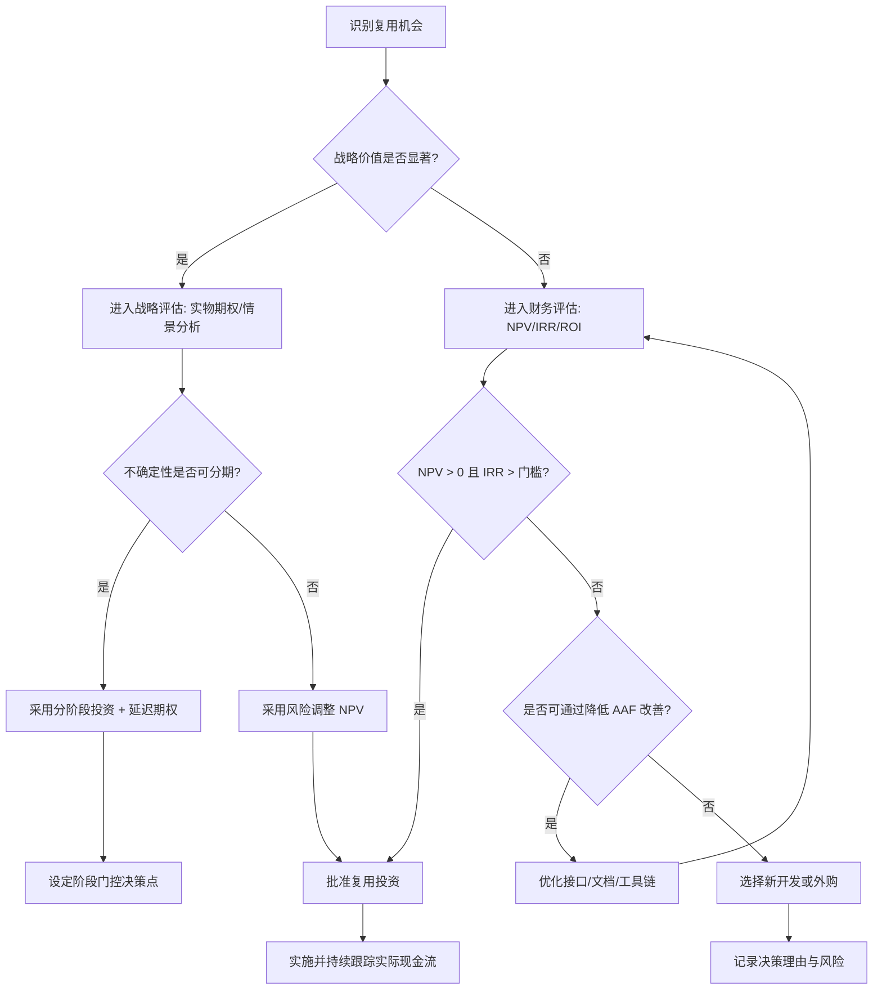

# 架构复用 ROI 框架

> **版本**: 2026-06-06
> **定位**: 建立评估架构复用投资回报率的系统方法

---

## 1. ROI 计算模型

```text
ROI = (Benefit_total - Cost_total) / Cost_total × 100%

Benefit_total = Benefit_direct + Benefit_indirect + Benefit_strategic
Cost_total = Cost_initial + Cost_maintain + Cost_adaptation
```

### 直接收益

| 收益项 | 计算方式 |
|--------|---------|
| 开发时间节约 | (自研人时 - 复用人时) × 人时成本 |
| 缺陷减少节约 | (自研缺陷数 - 复用缺陷数) × 平均修复成本 |
| 维护成本节约 | 年度维护人时节约 × 人时成本 |

### 间接收益

- 上市时间加速
- 技能杠杆
- 一致性提升

### 战略收益

- 生态系统建设
- 组织能力积累
- 合规优势

---

## 2. 成本构成

```text
复用总成本
├── 初始成本
│   ├── 资产评估
│   ├── 适配开发
│   ├── 集成测试
│   └── 培训
├── 维护成本
│   ├── 版本升级
│   ├── 兼容性维护
│   └── 文档更新
└── 隐性成本
    ├── 供应商锁定风险
    ├── 技术债务
    └── 机会成本
```

---

## 3. 关键定理

> **定理 V.T1** (ROI Threshold): 复用项目的 ROI 为正的必要条件是 AAF < 0.7。若 AAF ≥ 0.7，复用的直接经济价值消失，仅剩战略价值。
> **定理 V.T2** (Break-Even Point):
>
> ```text
> N* = C_initial / (S_build - S_reuse)
> ```
>
> 若预计使用次数 N < N*，则不值得投资于复用。

---

## 4. 实用评估模板

| 项目 | 自研方案 | 复用方案 | 差异 |
|------|---------|---------|------|
| 初始开发成本 | ¥____ | ¥____ | ¥____ |
| 年度维护成本 | ¥____ | ¥____ | ¥____ |
| 预期使用次数 | ____ | ____ | ____ |
| 上市时间 | ____ 月 | ____ 月 | ____ 月 |
| **3 年总成本** | **¥____** | **¥____** | **¥____** |
| **ROI** | — | — | **____%** |

---

## 5. 形式化定义与框架边界

### 5.1 ROI 框架定义

**定义**：架构复用 ROI 框架是一套将复用资产的全生命周期现金流（成本与收益）系统化识别、量化、贴现并比较的方法论。其目标不是追求单一指标的最大化，而是在给定风险偏好、时间 horizon 与战略约束下，选择使组织长期价值最大化的复用投资组合。

### 5.2 收益属性表

| 收益类型 | 属性 | 可量化性 | 典型折现处理 | 风险特征 |
|---------|------|---------|-------------|---------|
| 直接收益 | 人时、缺陷、维护节省 | 高 | 确定现金流 | 低 |
| 间接收益 | 上市时间、一致性、技能杠杆 | 中 | 概率加权 | 中 |
| 战略收益 | 生态、能力、合规、估值溢价 | 低 | 实物期权或情景分析 | 高 |

### 5.3 成本属性表

| 成本类型 | 属性 | 发生时间 | 可预测性 | 常见低估原因 |
|---------|------|---------|---------|-------------|
| 初始成本 | 评估、适配、集成、培训 | 项目早期 | 中 | 学习曲线、接口不匹配 |
| 维护成本 | 版本升级、兼容性、文档 | 持续 | 中 | 供应商变更、技术栈演进 |
| 隐性成本 | 锁定、债务、机会成本 | 未来 | 低 | 短期视角、缺乏治理 |

## 6. 核心计算公式体系

### 6.1 净现值（NPV）

```text
NPV = Σ(t=0..n) [CF_t / (1 + r)^t]

其中：
  CF_t = 第 t 期净现金流（收益 - 成本）
  r = 折现率（加权平均资本成本 WACC 或要求回报率）
  n = 项目生命周期（通常 3–5 年）
```

**决策规则**：NPV > 0 时项目创造价值；多个互斥方案选 NPV 最大者。

### 6.2 内部收益率（IRR）

```text
NPV = 0 = Σ(t=0..n) [CF_t / (1 + IRR)^t]
```

**决策规则**：IRR > 要求回报率时接受项目。IRR 对非常规现金流（符号多次变化）可能失效，需结合 NPV。

### 6.3 投资回收期（Payback Period）

```text
PP = min{T | Σ(t=0..T) CF_t ≥ 0}
```

**决策规则**：常用于风险较高的早期项目，但忽略回收期后的现金流。

### 6.4 收益成本比（BCR）

```text
BCR = PV(Benefits) / PV(Costs)
```

**决策规则**：BCR > 1 表示每投入 1 元可获得超过 1 元现值收益。

### 6.5 动态盈亏平衡使用次数

结合定理 V.T2，考虑时间价值后：

```text
N* = C_initial / [Σ(t=1..n) (S_build - S_reuse)_t / (1 + r)^t]
```

当预计复用次数的现值累计超过 N* 时，投资复用基础设施才经济。

## 7. NPV / IRR / 实物期权对比矩阵

| 维度 | NPV | IRR | 实物期权（Real Options） |
|------|-----|-----|------------------------|
| **核心思想** | 现金流贴现 | 使 NPV=0 的折现率 | 管理灵活性的价值 |
| **适用场景** | 现金流可预测 | 比较不同规模项目 | 高度不确定、可分阶段决策 |
| **对不确定性的处理** | 风险调整折现率 | 风险调整折现率 | 显式建模波动率与决策点 |
| **对管理灵活性的捕捉** | 弱 | 弱 | 强 |
| **计算复杂度** | 低 | 中 | 高 |
| **典型输入** | CF_t, r | CF_t | S, X, σ, T, r |
| **软件复用示例** | 平台工程 3 年现金流 | 平台工程收益率 | 是否等待新框架成熟再投资 |
| **主要局限** | 折现率主观 | 多解/无解风险 | 参数估计困难 |

## 8. 计算示例：平台工程 ROI 分析

### 8.1 场景设定

某企业投资平台工程团队，构建内部开发者平台（IDP），预计：

- 初始投资 C_initial = ¥2,000,000（平台开发、工具采购、培训）
- 折现率 r = 10%
- 项目周期 n = 5 年
- 各年净现金流（考虑维护成本后）：
  - Year 1: ¥600,000
  - Year 2: ¥900,000
  - Year 3: ¥1,200,000
  - Year 4: ¥1,100,000
  - Year 5: ¥1,000,000

### 8.2 NPV 计算

```text
NPV = -2,000,000 + 600,000/(1.1)^1 + 900,000/(1.1)^2 + 1,200,000/(1.1)^3 + 1,100,000/(1.1)^4 + 1,000,000/(1.1)^5
    = -2,000,000 + 545,455 + 743,802 + 901,578 + 751,315 + 620,921
    = 1,563,071
```

**NPV ≈ ¥156.3 万 > 0，项目创造价值。**

### 8.3 ROI 计算

```text
总收益现值 = 545,455 + 743,802 + 901,578 + 751,315 + 620,921 = 3,563,071
总成本现值 = 2,000,000
ROI = (3,563,071 - 2,000,000) / 2,000,000 × 100% = 78.15%
```

### 8.4 IRR 估算

通过迭代求解 NPV=0，可得 IRR ≈ 32.4%，远高于 10% 的要求回报率，项目吸引力强。

### 8.5 盈亏平衡分析

假设每年节省相同 S = ¥800,000：

```text
N* = C_initial / S = 2,000,000 / 800,000 = 2.5 年
```

若平台在第 2.5 年内累计节省超过初始投资，则回收期可接受。

## 9. Mermaid 流程图：复用投资决策流程



## 10. 反例与常见陷阱

### 10.1 反例一：只算一次性采购成本

某团队引入商业消息队列，只计算许可证费用 ¥50 万，宣称 ROI 为正。三年后实际：

- 版本升级费用 ¥30 万
- 集成测试二次开发 ¥80 万
- 供应商锁定导致迁移预研 ¥40 万
- 培训与认证 ¥20 万

总成本 ¥220 万，远超自研或开源替代方案，实际 ROI 为 -45%。

### 10.2 反例二：收益过度乐观

某平台工程团队假设“所有开发团队 100% 采用 Golden Path”，按此计算 3 年 ROI 为 150%。实际采用率仅 55%，且部分团队因定制化需求绕过平台，真实 ROI 为 -10%。

### 10.3 反例三：忽视机会成本

某企业将核心架构团队长期投入低价值组件库维护，错失了 AI 辅助开发工具的投资窗口。虽然该组件库 ROI 为正，但**战略机会成本**使组织整体竞争力下降。

### 10.4 反例四：IRR 误导

某小型复用项目 IRR 高达 80%，但 NPV 仅 ¥5 万；另一大型平台项目 IRR 25%，NPV ¥500 万。若仅按 IRR 排序，会错误选择小项目，忽视绝对价值创造。

## 11. 权威来源与交叉引用

> **权威来源**:
>
> - [Investopedia - NPV](https://www.investopedia.com/terms/n/npv.asp)
> - [Investopedia - IRR](https://www.investopedia.com/terms/i/irr.asp)
> - [Investopedia - ROI](https://www.investopedia.com/terms/r/returnoninvestment.asp)
> - [Wikipedia - Net Present Value](https://en.wikipedia.org/wiki/Net_present_value)
> - [Wikipedia - Internal Rate of Return](https://en.wikipedia.org/wiki/Internal_rate_of_return)
> - [FinOps Foundation](https://www.finops.org)
> - [Gartner - Total Cost of Ownership](https://www.gartner.com/en/information-technology/glossary/total-cost-of-ownership-tco)
> - 核查日期：2026-07-07

### 交叉引用

- 与 [COCOMO II 复用模型深度解析](../01-cocomo-ii-reuse/cocomo-ii-reuse-model-deep-dive.md) 配合：将 COCOMO II 估算的工作量与成本输入 ROI 框架。
- 与 [软件复用的 ROI、实物期权与战略价值量化](./roi-real-options-strategic-value.md) 配合：当项目具有高度不确定性时，用实物期权补充 NPV/IRR。
- 与 [认知负荷理论与架构复用](../../08-cognitive-architecture/03-cognitive-load-theory/cognitive-load-theory.md) 关联：培训与理解成本是 ROI 中常被低估的隐性成本。

---

> 最后更新: 2026-06-06


---

## 补充说明：架构复用 ROI 框架

## 概念定义

**定义**：ROI（投资回报率）与 NPV（净现值）将复用资产的现金流（节省、收入、维护成本、机会成本）贴现到当前，用于比较不同复用投资策略。

## 示例

**示例**：平台工程投资 200 万元，预计每年节省各团队 120 万元运维与重复开发成本，按 8% 折现率 NPV 为正，ROI 三年达 95%。

## 反例

**反例**：仅计算一次性采购成本，忽视后续版本升级、培训与耦合导致的迁移成本，项目三年后实际 ROI 为负。

## 权威来源

> **权威来源**:
>
> - [Investopedia NPV](https://www.investopedia.com/terms/n/npv.asp)
> - [FinOps Foundation](https://www.finops.org)
> - 核查日期：2026-07-07
