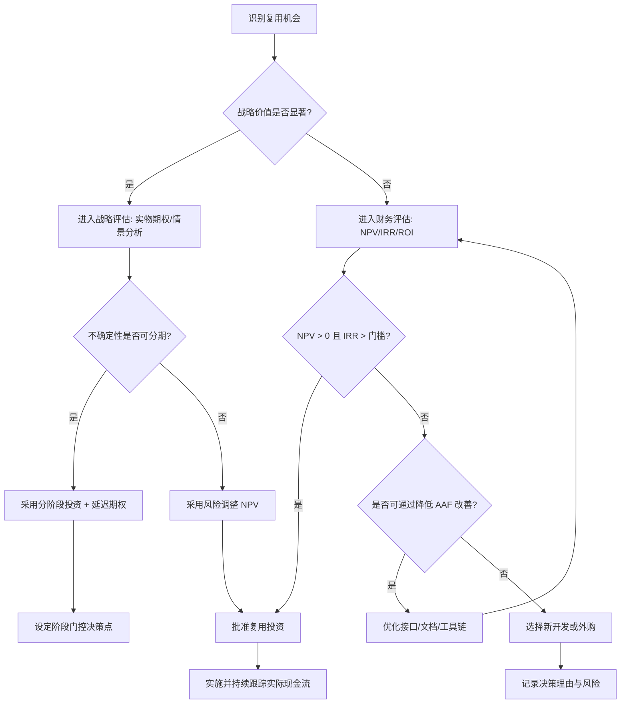
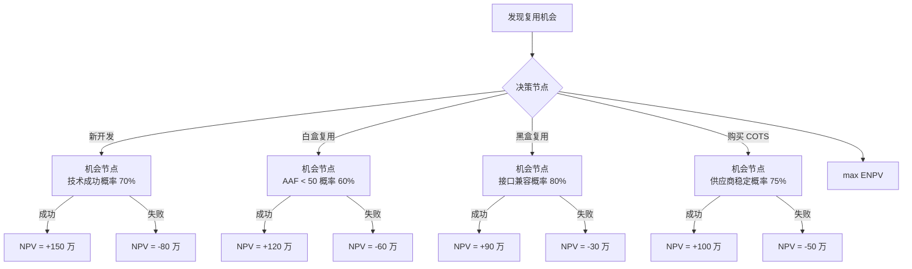
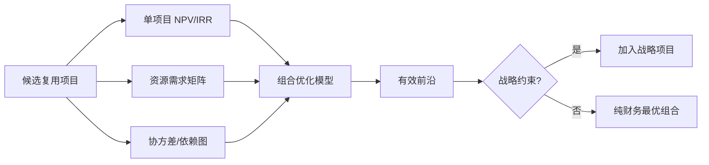

# 架构复用 ROI 框架

> **版本**: 2026-06-06
> **定位**: 建立评估架构复用投资回报率的系统方法

---

## 1. 核心概念定义

- **投资回报率（ROI）**：项目总收益与总成本之间的比率，衡量投资的相对盈利能力。
- **净现值（NPV）**：将未来现金流按折现率折算到当前时点的价值总和，用于判断项目是否创造价值。
- **内部收益率（IRR）**：使 NPV = 0 的折现率，用于比较不同规模项目的收益率。
- **总拥有成本（TCO）**：资产全生命周期内的所有直接和间接成本总和。
- **实物期权（Real Options）**：在高度不确定环境中，管理者拥有的延迟、扩展、缩减或转换投资的灵活性价值。
- **复用经济性**：将复用资产视为投资，评估其直接收益、间接收益、战略收益与全生命周期成本。

## 2. ROI 计算模型

```text
ROI = (Benefit_total - Cost_total) / Cost_total × 100%

Benefit_total = Benefit_direct + Benefit_indirect + Benefit_strategic
Cost_total = Cost_initial + Cost_maintain + Cost_adaptation
```

### 直接收益

| 收益项 | 计算方式 |
|--------|---------|
| 开发时间节约 | (自研人时 - 复用人时) × 人时成本 |
| 缺陷减少节约 | (自研缺陷数 - 复用缺陷数) × 平均修复成本 |
| 维护成本节约 | 年度维护人时节约 × 人时成本 |

### 间接收益

- 上市时间加速
- 技能杠杆
- 一致性提升

### 战略收益

- 生态系统建设
- 组织能力积累
- 合规优势

---

## 3. 成本构成

```text
复用总成本
├── 初始成本
│   ├── 资产评估
│   ├── 适配开发
│   ├── 集成测试
│   └── 培训
├── 维护成本
│   ├── 版本升级
│   ├── 兼容性维护
│   └── 文档更新
└── 隐性成本
    ├── 供应商锁定风险
    ├── 技术债务
    └── 机会成本
```

### 2.1 TCO 与 FinOps Unit Economics 映射

将复用投资与云财务运营（FinOps）对齐，可引入 Total Cost of Ownership（TCO）与 Unit Economics 两个视角：

| 视角 | 公式 | 作用 |
|:---|:---|:---|
| **TCO（3 年）** | `TCO = 初始投资 + Σ(年度运营成本_t) + 退役/迁移成本` | 比较自研、复用、COTS 的全生命周期总成本 |
| **单位经济** | `Unit Cost = 归因技术成本 / 业务产出单位` | 将云/平台成本映射到每次 API 调用、每用户、每交易 |
| **边际单位成本** | `MCU = Δ成本 / Δ产出单位` | 判断复用带来的规模经济是否改善 |

FinOps Foundation 将 Unit Economics 定义为“将技术支出与其创造的价值关联的度量体系”。在复用场景中，典型单位包括：

- **成本 per API call**：复用中间件每次调用的摊薄成本。
- **成本 per active user**：平台工程（IDP）每活跃用户的成本。
- **成本 per token**：AI 复用模型每次推理的 token 成本。

**计算示例（FinOps Unit Economics）**：

某内部消息中间件月运行云成本 ¥80,000，月处理 API 调用 2 亿次：

```text
Cost per API call = 80,000 / 200,000,000 = ¥0.0004/次
```

若通过复用优化使月成本降至 ¥60,000 且调用量升至 3 亿次：

```text
新 Cost per API call = 60,000 / 300,000,000 = ¥0.0002/次
单位成本下降 50%
```

---

## 4. 关键定理

> **定理 V.T1** (ROI Threshold): 复用项目的 ROI 为正的必要条件是 AAF < AAF_ECONOMIC_FLOOR（0.7，canonical [0.0, 1.0]）。若 AAF ≥ AAF_ECONOMIC_FLOOR，复用的直接经济价值消失，仅剩战略价值。
> **定理 V.T2** (Break-Even Point):
>
> ```text
> N* = C_initial / (S_build - S_reuse)
> ```
>
> 若预计使用次数 N < N*，则不值得投资于复用。

---

## 5. 实用评估模板

| 项目 | 自研方案 | 复用方案 | 差异 |
|------|---------|---------|------|
| 初始开发成本 | ¥____ | ¥____ | ¥____ |
| 年度维护成本 | ¥____ | ¥____ | ¥____ |
| 预期使用次数 | ____ | ____ | ____ |
| 上市时间 | ____ 月 | ____ 月 | ____ 月 |
| **3 年总成本** | **¥____** | **¥____** | **¥____** |
| **ROI** | — | — | **____%** |

---

## 6. 形式化定义与框架边界

### 6.1 ROI 框架定义

**定义**：架构复用 ROI 框架是一套将复用资产的全生命周期现金流（成本与收益）系统化识别、量化、贴现并比较的方法论。其目标不是追求单一指标的最大化，而是在给定风险偏好、时间 horizon 与战略约束下，选择使组织长期价值最大化的复用投资组合。

### 6.2 收益属性表

| 收益类型 | 属性 | 可量化性 | 典型折现处理 | 风险特征 |
|---------|------|---------|-------------|---------|
| 直接收益 | 人时、缺陷、维护节省 | 高 | 确定现金流 | 低 |
| 间接收益 | 上市时间、一致性、技能杠杆 | 中 | 概率加权 | 中 |
| 战略收益 | 生态、能力、合规、估值溢价 | 低 | 实物期权或情景分析 | 高 |

### 6.3 成本属性表

| 成本类型 | 属性 | 发生时间 | 可预测性 | 常见低估原因 |
|---------|------|---------|---------|-------------|
| 初始成本 | 评估、适配、集成、培训 | 项目早期 | 中 | 学习曲线、接口不匹配 |
| 维护成本 | 版本升级、兼容性、文档 | 持续 | 中 | 供应商变更、技术栈演进 |
| 隐性成本 | 锁定、债务、机会成本 | 未来 | 低 | 短期视角、缺乏治理 |

## 7. 核心计算公式体系

### 7.1 净现值（NPV）

```text
NPV = Σ(t=0..n) [CF_t / (1 + r)^t]

其中：
  CF_t = 第 t 期净现金流（收益 - 成本）
  r = 折现率（加权平均资本成本 WACC 或要求回报率）
  n = 项目生命周期（通常 3–5 年）
```

**决策规则**：NPV > 0 时项目创造价值；多个互斥方案选 NPV 最大者。

### 7.2 内部收益率（IRR）

```text
NPV = 0 = Σ(t=0..n) [CF_t / (1 + IRR)^t]
```

**决策规则**：IRR > 要求回报率时接受项目。IRR 对非常规现金流（符号多次变化）可能失效，需结合 NPV。

### 7.3 投资回收期（Payback Period）

```text
PP = min{T | Σ(t=0..T) CF_t ≥ 0}
```

**决策规则**：常用于风险较高的早期项目，但忽略回收期后的现金流。

### 7.4 收益成本比（BCR）

```text
BCR = PV(Benefits) / PV(Costs)
```

**决策规则**：BCR > 1 表示每投入 1 元可获得超过 1 元现值收益。

### 7.5 动态盈亏平衡使用次数

结合定理 V.T2，考虑时间价值后：

```text
N* = C_initial / [Σ(t=1..n) (S_build - S_reuse)_t / (1 + r)^t]
```

当预计复用次数的现值累计超过 N* 时，投资复用基础设施才经济。

## 8. NPV / IRR / 实物期权对比矩阵

| 维度 | NPV | IRR | 实物期权（Real Options） |
|------|-----|-----|------------------------|
| **核心思想** | 现金流贴现 | 使 NPV=0 的折现率 | 管理灵活性的价值 |
| **适用场景** | 现金流可预测 | 比较不同规模项目 | 高度不确定、可分阶段决策 |
| **对不确定性的处理** | 风险调整折现率 | 风险调整折现率 | 显式建模波动率与决策点 |
| **对管理灵活性的捕捉** | 弱 | 弱 | 强 |
| **计算复杂度** | 低 | 中 | 高 |
| **典型输入** | CF_t, r | CF_t | S, X, σ, T, r |
| **软件复用示例** | 平台工程 3 年现金流 | 平台工程收益率 | 是否等待新框架成熟再投资 |
| **主要局限** | 折现率主观 | 多解/无解风险 | 参数估计困难 |

## 9. 计算示例

### 示例 1：平台工程 ROI 分析

某企业投资平台工程团队，构建内部开发者平台（IDP），预计：

- 初始投资 C_initial = ¥2,000,000（平台开发、工具采购、培训）
- 折现率 r = 10%
- 项目周期 n = 5 年
- 各年净现金流（考虑维护成本后）：
  - Year 1: ¥600,000
  - Year 2: ¥900,000
  - Year 3: ¥1,200,000
  - Year 4: ¥1,100,000
  - Year 5: ¥1,000,000

### NPV 计算

```text
NPV = -2,000,000 + 600,000/(1.1)^1 + 900,000/(1.1)^2 + 1,200,000/(1.1)^3 + 1,100,000/(1.1)^4 + 1,000,000/(1.1)^5
    = -2,000,000 + 545,455 + 743,802 + 901,578 + 751,315 + 620,921
    = 1,563,071
```

**NPV ≈ ¥156.3 万 > 0，项目创造价值。**

### ROI 计算

```text
总收益现值 = 545,455 + 743,802 + 901,578 + 751,315 + 620,921 = 3,563,071
总成本现值 = 2,000,000
ROI = (3,563,071 - 2,000,000) / 2,000,000 × 100% = 78.15%
```

### IRR 估算

通过迭代求解 NPV=0，可得 IRR ≈ 32.4%，远高于 10% 的要求回报率，项目吸引力强。

### 盈亏平衡分析

假设每年节省相同 S = ¥800,000：

```text
N* = C_initial / S = 2,000,000 / 800,000 = 2.5 年
```

若平台在第 2.5 年内累计节省超过初始投资，则回收期可接受。

## 10. Mermaid 流程图：复用投资决策流程



## 11. 反例

### 反例 1：只算一次性采购成本

**反例**：某团队引入商业消息队列，只计算许可证费用 ¥50 万，宣称 ROI 为正。

某团队引入商业消息队列，只计算许可证费用 ¥50 万，宣称 ROI 为正。三年后实际：

- 版本升级费用 ¥30 万
- 集成测试二次开发 ¥80 万
- 供应商锁定导致迁移预研 ¥40 万
- 培训与认证 ¥20 万

总成本 ¥220 万，远超自研或开源替代方案，实际 ROI 为 -45%。

### 反例 2：收益过度乐观

**反例**：某平台工程团队假设“所有开发团队 100% 采用 Golden Path”。

某平台工程团队假设“所有开发团队 100% 采用 Golden Path”，按此计算 3 年 ROI 为 150%。实际采用率仅 55%，且部分团队因定制化需求绕过平台，真实 ROI 为 -10%。

### 反例 3：忽视机会成本

**反例**：某企业将核心架构团队长期投入低价值组件库维护。

某企业将核心架构团队长期投入低价值组件库维护，错失了 AI 辅助开发工具的投资窗口。虽然该组件库 ROI 为正，但**战略机会成本**使组织整体竞争力下降。

### 反例 4：IRR 误导

**反例**：某小型复用项目 IRR 高达 80%，但 NPV 仅 ¥5 万。

某小型复用项目 IRR 高达 80%，但 NPV 仅 ¥5 万；另一大型平台项目 IRR 25%，NPV ¥500 万。若仅按 IRR 排序，会错误选择小项目，忽视绝对价值创造。

## 12. 权威来源与交叉引用

| 来源 | URL | 核查日期 |
|:---|:---|:---|
| Investopedia — NPV | <https://www.investopedia.com/terms/n/npv.asp> | 2026-07-09 |
| Investopedia — IRR | <https://www.investopedia.com/terms/i/irr.asp> | 2026-07-09 |
| Investopedia — ROI | <https://www.investopedia.com/terms/r/returnoninvestment.asp> | 2026-07-09 |
| Wikipedia — Net Present Value | <https://en.wikipedia.org/wiki/Net_present_value> | 2026-07-09 |
| Wikipedia — Internal Rate of Return | <https://en.wikipedia.org/wiki/Internal_rate_of_return> | 2026-07-09 |
| FinOps Foundation — Framework | <https://www.finops.org/framework/> | 2026-07-09 |
| FinOps Foundation — Unit Economics | <https://www.finops.org/framework/capabilities/unit-economics/> | 2026-07-09 |
| FinOps Foundation — Cloud Unit Economics Intro | <https://www.finops.org/wg/introduction-cloud-unit-economics/> | 2026-07-09 |
| Gartner — Total Cost of Ownership | <https://www.gartner.com/en/information-technology/glossary/total-cost-of-ownership-tco> | 2026-07-09 |
| GSF — SCI for AI | <https://sci-for-ai.greensoftware.foundation/> | 2026-07-09 |

### 交叉引用

- 与 [COCOMO II 复用模型深度解析](../01-cocomo-ii-reuse/cocomo-ii-reuse-model-deep-dive.md) 配合：将 COCOMO II 估算的工作量与成本输入 ROI 框架。
- 与 [软件复用的 ROI、实物期权与战略价值量化](./roi-real-options-strategic-value.md) 配合：当项目具有高度不确定性时，用实物期权补充 NPV/IRR。
- 与 [认知负荷理论与架构复用](../../08-cognitive-architecture/03-cognitive-load-theory/cognitive-load-theory.md) 关联：培训与理解成本是 ROI 中常被低估的隐性成本。
- 可运行工具：[`../tools/cocomo-calculator.py`](../tools/cocomo-calculator.py) 提供 PM/成本估算输入，可结合本文件 NPV/IRR 计算使用。

---

## 13. 决策树在复用投资决策中的应用

### 14.1 形式化定义

**定义**：决策树（Decision Tree）是一种将复用投资决策中的决策节点（方框）、机会节点（圆圈）与结果节点（三角）按时间顺序展开的可视化分析工具。通过为每个机会分支赋予概率与现金流，可计算各策略的期望 NPV（ENPV），从而比较“新开发 / 白盒复用 / 黑盒复用 / 购买 COTS”等多路径方案。

决策树与 NPV/IRR 的关系：

- NPV/IRR 回答“是否值得做”；
- 决策树回答“在哪些条件下选择哪条路径”；
- 两者结合形成“动态 NPV”分析，即在不同信息状态下选择最优行动。

### 13.2 决策树节点属性表

| 节点类型 | 符号 | 含义 | 计算方式 |
|---------|------|------|---------|
| 决策节点 | □ | 管理者可主动选择的行动 | max(各分支 ENPV) |
| 机会节点 | ○ | 外部不确定性结果 | Σ(概率_i × NPV_i) |
| 结果节点 | △ | 最终现金流与收益 | 收益 - 成本（已折现） |
| 终止节点 | — | 不再继续 | 0 或残值 |

### 13.3 与新开发/复用/购买的对比关系

决策树将第 8 章的 ROI 计算扩展为多阶段动态结构：

1. 第一阶段：技术可行性评估（成功概率 p1）。
2. 第二阶段：市场/需求确认（成功概率 p2）。
3. 第三阶段：规模化收益实现。

在每个阶段门控，管理者可根据新信息调整行动，从而与实物期权方法互补。



### 13.4 计算示例：消息中间件获取决策

某企业需要消息中间件，面临四种选择：

| 方案 | 初始投资 | 成功概率 | 成功后 NPV | 失败后 NPV | ENPV |
|------|---------|---------|-----------|-----------|------|
| 新开发 | 100 万 | 70% | +250 万 | -80 万 | 0.7×250 + 0.3×(-80) - 100 = 51 万 |
| 白盒复用 | 60 万 | 60% | +200 万 | -60 万 | 0.6×200 + 0.4×(-60) - 60 = 36 万 |
| 黑盒复用 | 30 万 | 80% | +150 万 | -30 万 | 0.8×150 + 0.2×(-30) - 30 = 84 万 |
| 购买 COTS | 50 万 | 75% | +180 万 | -50 万 | 0.75×180 + 0.25×(-50) - 50 = 72.5 万 |

按 ENPV 排序：黑盒复用（84 万）> 购买 COTS（72.5 万）> 新开发（51 万）> 白盒复用（36 万）。因此，在接口兼容概率可信的前提下，优先选择黑盒复用。

### 13.5 反例：静态概率导致错误选择

某团队评估开源组件时，将“接口兼容概率”固定为 90%，未考虑该组件版本更新频繁、社区活跃度下降的风险。一年后兼容性失败，实际 ENPV 从估算的 +90 万变为 -40 万。问题根源在于决策树概率未随外部信息更新，也未设置阶段门控。

| 来源 | URL | 核查日期 |
|:---|:---|:---|
| Wikipedia — Return on Investment | <https://en.wikipedia.org/wiki/Return_on_investment> | 2026-07-09 |
| Wikipedia — Net Present Value | <https://en.wikipedia.org/wiki/Net_present_value> | 2026-07-09 |
| Wikipedia — Decision Tree | <https://en.wikipedia.org/wiki/Decision_tree> | 2026-07-09 |
| Investopedia — Decision Tree Analysis | <https://www.investopedia.com/terms/d/decision-tree.asp> | 2026-07-09 |
| FinOps Foundation — Unit Economics | <https://www.finops.org/framework/capabilities/unit-economics/> | 2026-07-09 |

### 交叉引用

- 与 [COCOMO II 复用模型深度解析](../01-cocomo-ii-reuse/cocomo-ii-reuse-model-deep-dive.md) 配合：COCOMO II 估算的成本与成功率是决策树概率输入。
- 与 [软件复用的 ROI、实物期权与战略价值量化](./roi-real-options-strategic-value.md) 配合：决策树是实物期权分析的离散化实现形式。
- 与 [认知负荷理论与架构复用](../../08-cognitive-architecture/03-cognitive-load-theory/cognitive-load-theory.md) 关联：决策树也可用于评估不同文档/培训策略对认知负荷的影响。

## 14. 多项目复用投资组合的 NPV 边界与机会成本

### 13.1 形式化定义

**定义**：复用投资组合 NPV 边界（Portfolio NPV Frontier）是在有限预算与战略约束下，由多个复用项目组成的有效前沿。它强调单个项目 NPV 为正并不足以保证组合价值最大，因为项目间可能存在资源竞争、依赖关系与机会成本。

### 14.2 组合属性表

| 组合维度 | 关注点 | 量化方法 | 管理启示 |
|---------|------|---------|---------|
| 资源约束 | 人力、预算上限 | 线性规划 / 整数规划 | 优先选择单位资源 NPV 高者 |
| 依赖关系 | 项目间先后/互补 | 网络图、关键路径 | 前置项目优先 |
| 风险分散 | 技术/市场相关性 | 组合方差、β 系数 | 避免过度集中同一技术栈 |
| 战略协同 | 平台生态、能力积累 | 实物期权、战略评分 | 允许战略项目短期 NPV 为负 |
| 机会成本 | 被放弃项目的最高 NPV | 影子价格 | 揭示真实稀缺资源 |

### 14.3 关系说明

组合边界由单个项目 NPV 与协方差共同决定。当两个复用项目高度相关时，合并投资的风险调整价值可能低于各自独立；当项目互补时，合并价值超过简单加总。机会成本通过线性规划的影子价格显式化：若某资源的影子价格为正，说明该资源是瓶颈，应优先配置给 NPV 边际贡献最高的项目。



### 14.4 正例：组合优化释放预算

某企业将 10 个候选复用项目输入组合优化模型，在 500 万预算约束下，选择 6 个项目，组合 NPV 从单独选优的 620 万提升至 780 万，原因是剔除了资源冲突且互补性低的项目。

### 14.5 反例：忽视机会成本导致资源错配

某团队坚持维护一个 NPV 为正但占用核心架构师 40% 时间的组件库，导致无法投入一个 NPV 更高的平台项目。三年后前者 ROI 仅 12%，后者被竞争对手抢先，市场损失远超前者收益。

| 来源 | URL | 核查日期 |
|:---|:---|:---|
| Wikipedia — Return on Investment | <https://en.wikipedia.org/wiki/Return_on_investment> | 2026-07-09 |
| Wikipedia — Net Present Value | <https://en.wikipedia.org/wiki/Net_present_value> | 2026-07-09 |
| Wikipedia — Modern Portfolio Theory | <https://en.wikipedia.org/wiki/Modern_portfolio_theory> | 2026-07-09 |
| Investopedia — Opportunity Cost | <https://www.investopedia.com/terms/o/opportunitycost.asp> | 2026-07-09 |
| FinOps Foundation — Cloud Unit Economics Intro | <https://www.finops.org/wg/introduction-cloud-unit-economics/> | 2026-07-09 |

### 交叉引用

- 与 [COCOMO II 复用模型深度解析](../01-cocomo-ii-reuse/cocomo-ii-reuse-model-deep-dive.md) 配合：各项目成本与工期输入组合优化模型。
- 与 [软件复用的 ROI、实物期权与战略价值量化](./roi-real-options-strategic-value.md) 配合：战略项目的价值可用实物期权补充。
- 与 [认知负荷理论与架构复用](../../08-cognitive-architecture/03-cognitive-load-theory/cognitive-load-theory.md) 关联：核心架构师的时间稀缺性是高认知负荷工作的机会成本来源。

> 最后更新: 2026-06-06


---

> **版本记录**：2026-07-09 新增 TCO 与 FinOps Unit Economics 映射、权威来源表格与可运行工具引用；删除机械重复段落。