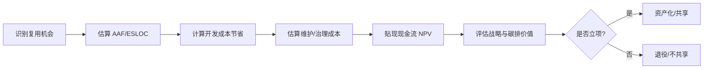

# 09 价值量化与 ROI 模型

> **定位**：将复用的价值从“定性认同”转化为“可度量的经济与环境证据”，支撑管理层在资产投资、共享范围与退役时机上的理性决策。

---

## 1. 概念定义

**复用价值量化** 是使用成本模型、财务指标与可持续性指标，对可复用资产的开发、维护、消费与退役收益进行系统评估的过程。其核心问题不是“能不能复用”，而是“复用是否值得”。

| 方法 | 关键指标 | 适用决策 |
|------|----------|----------|
| **COCOMO II** | ESLOC、AAF、RUSE、成本驱动因子 | 项目级或组织级复用成本估算 |
| **ROI / NPV** | 投资回报率、净现值、折现现金流 | 资产投资与平台工程立项 |
| **实物期权** | 延迟/扩展/放弃期权的价值 | 战略级技术投资决策 |
| **碳强度 SCI** | 单位功能碳排放量 | 绿色复用与可持续架构决策 |

**改编调整因子（AAF）** 是 COCOMO II 中衡量复用组件所需适配工作的关键参数；AAF 越高，复用的直接经济收益越低。

---

## 2. 价值量化流程图

---

## 3. 正向示例

### 示例 1：COCOMO II 评估统一支付服务

某企业评估“统一支付服务”复用价值：等效新代码行 80 KSLOC，按复用适配度 AAF=0.35 折算后 ESLOC=28 KSLOC；COCOMO II 估算节省约 2400 人月，NPV 三年为正，决策升级为组织级资产。

### 示例 2：平台工程 ROI 计算

某电商平台投资 200 万元建设内部开发者平台（IDP），预计每年节省各团队 120 万元重复开发与运维成本；按 8% 折现率计算，三年 NPV 为正，ROI 达 95%。

### 示例 3：绿色复用降低碳排

通过复用经能效优化的 Rust 数据解析库，某云服务 CPU 利用率从 45% 降至 22%；按绿色软件基金会 SCI 公式，单位请求碳排下降 48%。

### 示例 4：实物期权评估新技术

企业在评估是否投资 WASM 组件化时，使用实物期权模型量化“延迟投资”与“分阶段扩展”的价值，避免了在工具链不成熟时全面迁移的高昂沉没成本。

---

## 4. 反例 / 失败案例

### 反例 1：以代码行复用率为唯一 KPI

某团队仅统计“代码行复用率”作为绩效指标，导致大量复制低价值代码；维护成本上升，真实业务价值反而下降，且掩盖了高耦合风险。

### 反例 2：忽视维护与治理成本

某平台宣称复用节省 80% 开发成本，但未计入文档、测试、版本治理与升级协调成本；三年后实际总成本反超从头开发。

### 反例 3：绿色清洗式复用

为追求“绿色”标签，团队强行复用旧版本低能效组件，未考虑新硬件能效提升；整体碳排反而增加，且错失性能优化机会。

### 反例 4：未考虑耦合导致的迁移成本

某项目广泛复用耦合严重的遗留模块，后期业务变更时需要同步修改数十个消费方；迁移成本使 NPV 由正转负。

---

## 5. 价值量化关键公式

| 指标 | 公式 | 说明 |
|------|------|------|
| ESLOC | ASLOC × AAF | 等效新代码行 |
| AAF | 0.4×DM + 0.3×CM + 0.3×IM | 设计、代码、集成改编度 |
| ROI | (收益 - 成本) / 成本 × 100% | 投资回报率 |
| NPV | Σ(CF_t / (1+r)^t) | 折现现金流净现值 |
| SCI | (E × I) / R | 软件碳强度 |

> **定理 V.1**（ROI Threshold）：复用项目的 ROI 为正的必要条件是复用资产的改编调整因子 AAF < 0.7。若 AAF ≥ 0.7，复用的直接经济价值消失，仅剩战略或学习价值。

---

## 6. 权威来源

> **权威来源**：
>
> - [USC COCOMO II](https://cssed.usc.edu/research/research-sponsored-software/cocomo/cocomo-ii/) — Barry Boehm, USC CSSE
> - [FinOps Foundation Framework](https://www.finops.org/framework/)
> - [Investopedia - Net Present Value](https://www.investopedia.com/terms/n/npv.asp)
> - [Green Software Foundation - SCI](https://sci.greensoftware.foundation)
> - [GSF Principles of Green Software Engineering](https://learn.greensoftware.foundation/)
> - 核查日期：2026-07-07

---

## 7. 当前状态与关联主题

- [x] COCOMO II 公式与 2026 校准版 (`01-cocomo-ii-reuse/`)
- [x] ROI/NPV 完整模型 (`02-roi-npv-models/`)
- [x] 碳排维度扩展 (`03-carbon-dimension/`)
- [x] 可执行 Python 计算模板 (`tools/cocomo-calculator.py`)
- [ ] Excel 计算模板 (P1, 2026-Q4)

关联主题：

- `06-cross-layer-governance`（FinOps 成本治理）
- `13-emerging-trends`（绿色软件与平台工程投资）

## 8. 价值量化落地检查单

在将复用价值量化用于投资决策前，团队应完成以下检查：

- [ ] 是否识别了复用资产的直接收益、间接收益与战略收益？
- [ ] 是否估算改编调整因子 AAF，并验证其是否低于 0.7？
- [ ] 是否计入维护、治理、培训与升级协调等隐性成本？
- [ ] 是否使用 NPV 或 ROI 对多期现金流进行贴现比较？
- [ ] 是否评估了机会成本与实物期权价值？
- [ ] 是否将碳排、能耗等可持续性指标纳入量化模型？
- [ ] 是否建立历史数据校准机制，避免模型参数失真？
- [ ] 是否将度量结果与治理决策（升级/降级/退役）挂钩？

## 9. 价值量化指标对比

| 指标 | 优点 | 局限 | 适用阶段 |
|------|------|------|----------|
| 代码行复用率 | 易于计算 | 忽视质量与成本，易扭曲行为 | 初步观察 |
| COCOMO II ESLOC | 基于行业数据，可校准 | 需要准确的 AAF 与成本驱动因子 | 项目估算 |
| ROI | 直观比较投资回报 | 忽略时间价值与风险 | 快速决策 |
| NPV | 考虑现金流时间价值 | 折现率主观，长期预测不准 | 战略投资 |
| 实物期权 | 捕捉灵活性价值 | 模型复杂，参数难以估计 | 不确定环境 |
| SCI 碳强度 | 纳入可持续目标 | 需要精细的能耗与位置数据 | 绿色治理 |

## 10. 常见误区

- **误区 1：只看代码行复用率**。该指标容易被操纵，且掩盖高耦合与低价值复制。
- **误区 2：忽视维护成本**。复用的真实成本往往在上线后才显现。
- **误区 3：一次性估算不再更新**。AAF、成本驱动因子应随组织数据持续校准。
- **误区 4：忽略风险与机会成本**。不复用或延迟复用的价值同样需要评估。
- **误区 5：绿色指标流于形式**。碳排核算需覆盖全生命周期，避免绿色清洗。
- **误区 6：度量与决策脱节**。量化结果必须反馈到资产升级、降级与退役流程。
- **误区 7：过度追求精确**。在不确定性高时，区间估计比点估计更有价值。
- **误区 8：只算经济账**。战略价值、学习效应与生态网络效应同样重要。

## 11. 延伸阅读

1. Boehm, B. et al. *Software Cost Estimation with COCOMO II*。
2. Damodaran, A. *Investment Valuation* — NPV、实物期权与企业估值。
3. FinOps Foundation. *FinOps Framework* — 云成本与价值分摊。
4. Green Software Foundation. *Software Carbon Intensity Specification*。
5. Baldwin, C. Y. & Clark, K. B. *Design Rules* — 模块化与期权价值。

价值量化让复用从“经验倡导”走向“证据驱动”，是规模化复用不可或缺的治理基础。

## 12. 深度案例：某金融平台复用 ROI 误判

某金融企业决定建设统一客户身份认证服务，项目初期估算可节省 3000 人月开发成本。团队使用代码行复用率作为 KPI，并在上线后宣称项目成功。然而一年后审计发现：

1. **AAF 被低估**：实际适配度为 0.65，远高于最初估算的 0.35。
2. **维护成本遗漏**：多租户隔离、合规审计与版本协调每年消耗 800 人月。
3. **迁移耦合成本**：下游 40 个系统因接口变更被迫同步升级，产生大量隐性成本。
4. **战略价值未量化**：虽然直接 ROI 为负，但统一认证显著提升了安全合规与客户体验。

该企业随后引入 COCOMO II、NPV 与实物期权综合评估，并将碳排与客户体验纳入价值量化框架，复用决策质量显著提升。

## 13. 关键行动项

- 为每个候选复用资产建立包含 AAF、维护成本与迁移成本的估算模型。
- 将 ROI/NPV 计算与资产升级/降级决策流程绑定。
- 引入敏感性分析，识别对结果影响最大的参数。
- 将战略价值、学习效应与可持续性指标纳入综合评估。
- 每半年用实际数据校准 COCOMO II 参数与成本假设。

## 14. 版本记录

- 2026-07-07：补充 COCOMO II、ROI/NPV、实物期权与碳强度 SCI 的概念定义、示例、反例与权威来源。
- 2026-06-08：初始版本，梳理成本估算与 ROI 模型文件导航。

## 15. 一句话总结

> 复用价值量化回答的不是“能不能复用”，而是“复用是否值得”。只有将经济、战略与可持续价值统一度量，复用决策才能从经验走向证据。

## 16. 持续改进方向

- 与组织项目管理系统集成，自动采集实际成本与收益数据。
- 开发可交互的 ROI/NPV 计算器，支持实时敏感性分析。
- 探索将碳排数据从云账单与监控系统自动导入 SCI 计算。
- 将价值量化结果与资产目录的成熟度评级联动。

## 17. 持续改进方向

- 与组织项目管理系统集成，自动采集实际成本与收益数据。
- 开发可交互的 ROI/NPV 计算器，支持实时敏感性分析。
- 探索将碳排数据从云账单与监控系统自动导入 SCI 计算。
- 将价值量化结果与资产目录的成熟度评级联动。

## 18. 版本记录补充

- 持续跟踪 COCOMO II、FinOps 与绿色软件基金会的最新版本，并更新权威来源与核查日期。
