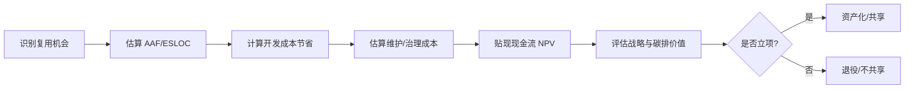

# 09 价值量化与 ROI 模型

> **定位**：将复用的价值从“定性认同”转化为“可度量的经济与环境证据”，支撑管理层在资产投资、共享范围与退役时机上的理性决策。

---

## 1. 概念定义

**复用价值量化** 是使用成本模型、财务指标与可持续性指标，对可复用资产的开发、维护、消费与退役收益进行系统评估的过程。其核心问题不是“能不能复用”，而是“复用是否值得”。

| 方法 | 关键指标 | 适用决策 |
|------|----------|----------|
| **COCOMO II** | ESLOC、AAF、RUSE、成本驱动因子 | 项目级或组织级复用成本估算 |
| **ROI / NPV** | 投资回报率、净现值、折现现金流 | 资产投资与平台工程立项 |
| **实物期权** | 延迟/扩展/放弃期权的价值 | 战略级技术投资决策 |
| **碳强度 SCI** | 单位功能碳排放量 | 绿色复用与可持续架构决策 |

**改编调整因子（AAF）** 是 COCOMO II 中衡量复用组件所需适配工作的关键参数；AAF 越高，复用的直接经济收益越低。

---

## 2. 价值量化流程图

---

## 3. 正向示例

### 示例 1：COCOMO II 评估统一支付服务
某企业评估“统一支付服务”复用价值：等效新代码行 80 KSLOC，按复用适配度 AAF=0.35 折算后 ESLOC=28 KSLOC；COCOMO II 估算节省约 2400 人月，NPV 三年为正，决策升级为组织级资产。

### 示例 2：平台工程 ROI 计算
某电商平台投资 200 万元建设内部开发者平台（IDP），预计每年节省各团队 120 万元重复开发与运维成本；按 8% 折现率计算，三年 NPV 为正，ROI 达 95%。

### 示例 3：绿色复用降低碳排
通过复用经能效优化的 Rust 数据解析库，某云服务 CPU 利用率从 45% 降至 22%；按绿色软件基金会 SCI 公式，单位请求碳排下降 48%。

### 示例 4：实物期权评估新技术
企业在评估是否投资 WASM 组件化时，使用实物期权模型量化“延迟投资”与“分阶段扩展”的价值，避免了在工具链不成熟时全面迁移的高昂沉没成本。

---

## 4. 反例 / 失败案例

### 反例 1：以代码行复用率为唯一 KPI
某团队仅统计“代码行复用率”作为绩效指标，导致大量复制低价值代码；维护成本上升，真实业务价值反而下降，且掩盖了高耦合风险。

### 反例 2：忽视维护与治理成本
某平台宣称复用节省 80% 开发成本，但未计入文档、测试、版本治理与升级协调成本；三年后实际总成本反超从头开发。

### 反例 3：绿色清洗式复用
为追求“绿色”标签，团队强行复用旧版本低能效组件，未考虑新硬件能效提升；整体碳排反而增加，且错失性能优化机会。

### 反例 4：未考虑耦合导致的迁移成本
某项目广泛复用耦合严重的遗留模块，后期业务变更时需要同步修改数十个消费方；迁移成本使 NPV 由正转负。

---

## 5. 价值量化关键公式

| 指标 | 公式 | 说明 |
|------|------|------|
| ESLOC | ASLOC × AAF | 等效新代码行 |
| AAF | 0.4×DM + 0.3×CM + 0.3×IM | 设计、代码、集成改编度 |
| ROI | (收益 - 成本) / 成本 × 100% | 投资回报率 |
| NPV | Σ(CF_t / (1+r)^t) | 折现现金流净现值 |
| SCI | (E × I) / R | 软件碳强度 |

> **定理 V.1**（ROI Threshold）：复用项目的 ROI 为正的必要条件是复用资产的改编调整因子 AAF < 0.7。若 AAF ≥ 0.7，复用的直接经济价值消失，仅剩战略或学习价值。

---

## 6. 权威来源

> **权威来源**：
>
> - [USC COCOMO II](https://cssed.usc.edu/research/research-sponsored-software/cocomo/cocomo-ii/) — Barry Boehm, USC CSSE
> - [FinOps Foundation Framework](https://www.finops.org/framework/)
> - [Investopedia - Net Present Value](https://www.investopedia.com/terms/n/npv.asp)
> - [Green Software Foundation - SCI](https://sci.greensoftware.foundation)
> - [GSF Principles of Green Software Engineering](https://learn.greensoftware.foundation/)
> - 核查日期：2026-07-07

---

## 7. 当前状态与关联主题

- [x] COCOMO II 公式与 2026 校准版 (`01-cocomo-ii-reuse/`)
- [x] ROI/NPV 完整模型 (`02-roi-npv-models/`)
- [x] 碳排维度扩展 (`03-carbon-dimension/`)
- [x] 可执行 Python 计算模板 (`tools/cocomo-calculator.py`)
- [ ] Excel 计算模板 (P1, 2026-Q4)

关联主题：

- `06-cross-layer-governance`（FinOps 成本治理）
- `13-emerging-trends`（绿色软件与平台工程投资）
