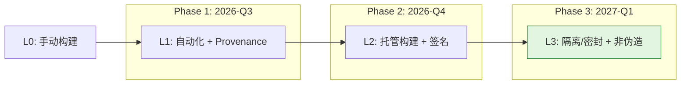

# SLSA 1.2 Multi-Track 深度解析

> **版本**: 2026-06-08
> **权威来源**: SLSA Specification v1.2 (slsa.dev), OpenSSF Active Workstreams
> **定位**: Phase 4（2027-Q2）供应链安全核心交付物，建立三轨道 × L1-L3 的复用信任矩阵
> **交叉引用**: `struct/10-supply-chain-security/01-slsa-framework/slsa-reuse-boundaries.md`

---

## 1. SLSA 演进概述

### 1.1 v1.0 → v1.1 → v1.2 的关键变化

| 版本 | 发布时间 | 状态 | 核心变化 |
|------|---------|------|----------|
| **SLSA v1.0** | 2023-04 | 正式版 | 引入 **Build Track**，将 Source 要求从单一等级中剥离，专注构建 provenance 的可信度 |
| **SLSA v1.1** | 2024 | 正式版 | 澄清性刷新；增强验证指南；VSA（Verification Summary Attestation）新增验证器元数据字段 |
| **SLSA v1.2** | 2025-11 | 正式版 | **Source Track** 从实验提升为正式轨道；引入 **Multi-Track** 架构；新增 **Build Environment Track**（草案） |

SLSA v1.2 的最大范式转变是从"单一 Build Track 覆盖全部"演进为"多轨道独立认证"。
在 v1.0 中，Build L3 的 provenance 无法回答"源码是否经过审查"或"构建环境是否可信"的问题；
v1.2 通过 Source Track 和 Build Environment Track 将这些问题显性化，使消费者能够按需验证供应链的不同环节。

### 1.2 Multi-Track 架构的引入

```text
SLSA v1.2 Multi-Track 架构
├── Build Track（构建轨道）— 已发布
│   L1: 自动化生成 Provenance
│   L2: 托管构建 + 签名 Provenance
│   L3: 隔离/密封/临时构建 + 非伪造性 Provenance
│   L4: 规划中（双人审查 + 可复现构建）
│
├── Source Track（源码轨道）— v1.2 正式化
│   L1: 版本控制（不可变标识符）
│   L2: 认证历史（提交签名 + 完整保留）
│   L3: 持续强制执行（分支保护 + 多重审查 + 状态检查）
│
├── Build Environment Track（构建环境轨道）— 开发中
│   L1: 基础环境记录（构建镜像 provenance）
│   L2: 环境验证（vTPM / Secure Boot 启动证明）
│   L3: 运行时完整性（TEE / AMD SEV-SNP / Intel TDX 硬件证明）
│
└── Dependency Track（依赖轨道）— 讨论中
    第三方依赖风险度量与控制（尚未发布等级定义）
```

> **核心洞察**: Multi-Track 架构意味着**复用组件的 SLSA 等级必须用向量表示** `(Build Lx, Source Ly, Env Lz)`，而非单一标量。`slsa-reuse-boundaries.md` 中基于 v1.0 的 L0–L4 标量模型需要据此扩展。

---

## 2. 三轨道 × L1-L3 要求矩阵

下表汇总 SLSA v1.2 正式定义的三轨道九个单元格的具体要求。每个单元格代表该轨道等级必须满足的**最小控制集**。

| 等级 | Build Track | Source Track | Build Environment Track |
|------|------------|--------------|------------------------|
| **L1** | 自动化构建 | 版本控制 | 基础环境记录 |
| **L2** | 签名构建 | 提交签名 | 环境验证 |
| **L3** | 隔离/密封构建 | 多重审查 | 完全可复现 |

### 2.1 Build Track 详解

| 等级 | 要求编号 | 具体要求 | 验证方法 |
|------|---------|---------|---------|
| **L1** | BT-L1-R1 | 构建过程完全脚本化/自动化，无手动步骤 | 存在 CI/CD 配置文件或构建脚本 |
| | BT-L1-R2 | 生成并发布符合 SLSA Provenance v1 格式的 provenance | 使用 `slsa-verifier` 验证 predicate 结构完整性 |
| **L2** | BT-L2-R1 | 源码来源于版本控制系统（Git/SVN 等） | provenance 中 `resolvedDependencies` 指向 commit SHA |
| | BT-L2-R2 | 使用托管构建服务（GitHub Actions, Cloud Build, GitLab CI） | `builder.id` 指向受信任的托管平台标识符 |
| | BT-L2-R3 | Provenance 经过密码学签名（Sigstore/cosign keyless, GPG, X.509） | `cosign verify` 或 `slsa-verifier` 验证签名链 |
| | BT-L2-R4 | Provenance 由构建服务生成，非人工创建 | 签名者身份为 CI 平台的 OIDC 身份，非个人密钥 |
| **L3** | BT-L3-R1 | 构建定义来源于版本控制中的源码文件 | `buildType` 指向仓库内文件路径，禁止外部动态配置 |
| | BT-L3-R2 | 构建环境是临时的（Ephemeral），每次构建后销毁 | 构建平台提供环境生命周期审计日志 |
| | BT-L3-R3 | 构建环境是隔离的（Isolated），构建间无共享状态 | 使用 `--network=none` 或等效策略，禁止任意网络调用 |
| | BT-L3-R4 | 构建平台满足安全基线并通过审计 | 平台具备 ISO 27001 / SOC 2 报告或公开透明架构 |
| | BT-L3-R5 | Provenance 非伪造性：仅构建平台可访问签名密钥 | 使用 OIDC 联邦身份，构建者无法直接操作签名凭证 |

### 2.2 Source Track 详解

Source Track 在 v1.2 中正式化，解决"源码在提交到构建之前发生了什么"的溯源问题。

| 等级 | 要求编号 | 具体要求 | 验证方法 |
|------|---------|---------|---------|
| **L1** | ST-L1-R1 | 源代码存储在版本控制系统中 | 仓库存在且可克隆 |
| | ST-L1-R2 | 每个变更关联到稳定、不可变的标识符（commit SHA/tag） | 标签为 annotated tag 或 commit SHA 可独立引用 |
| **L2** | ST-L2-R1 | 提交历史经过认证，无法伪造提交者身份 | 启用 GPG/SSH commit signing，拒绝未签名提交 |
| | ST-L2-R2 | 源码历史被无限期保留，不可篡改或删除 | 仓库存在不可变的镜像/备份策略 |
| | ST-L2-R3 | 生成 Source Provenance attestation | 使用 VSA（Verification Summary Attestation）声明 Source 等级 |
| **L3** | ST-L3-R1 | 主分支（或等价发布分支）强制分支保护 | 平台设置禁止直接推送，必须通过 PR/MR |
| | ST-L3-R2 | 所有变更经过至少两人审查（Two-person review） | PR/MR 合并前要求 ≥2 审批者，含自动化状态检查通过 |
| | ST-L3-R3 | 提交签名强制执行（Signed commits required） | 平台策略拒绝未签名或签名验证失败的提交 |
| | ST-L3-R4 | 状态检查（Status checks）强制通过方可合并 | CI 测试、SAST、许可证扫描等作为合并门控 |

### 2.3 Build Environment Track 详解

Build Environment Track 目前处于 OpenSSF 活跃工作流（Active Workstream）阶段，目标是证明"运行构建的物理/虚拟环境本身未被篡改"。

| 等级 | 要求编号 | 具体要求 | 验证方法 |
|------|---------|---------|---------|
| **L1** | BET-L1-R1 | 构建环境（容器镜像/VM 模板）具有 provenance | 镜像签名并附带 SBOM，记录基础镜像和安装的软件包 |
| | BET-L1-R2 | 构建环境版本被记录并与构建产物关联 | provenance 的 `internalParameters` 包含环境版本标识 |
| **L2** | BET-L2-R1 | 构建实例启动时生成启动证明（Boot attestation） | 使用 vTPM 测量启动链（Bootloader → Kernel → Initrd） |
| | BET-L2-R2 | 构建环境配置在启动后经验证，与预期基线一致 | 比较 TPM PCR 值与黄金测量值（Golden measurements） |
| | BET-L2-R3 | 构建服务提供环境实例化的审计记录 | 云平台提供实例创建日志与 IAM 授权链 |
| **L3** | BET-L3-R1 | 构建在硬件可信执行环境（TEE）中运行 | 使用 AMD SEV-SNP / Intel TDX / ARM CCA 证明 |
| | BET-L3-R2 | 运行时内存与执行状态受到硬件保护，外部无法观测/篡改 | TEE 远程证明（Remote attestation）报告验证 |
| | BET-L3-R3 | 构建环境完全可复现：从基础镜像到工具链的每一步均可独立重建 | 使用 Nix / Bazel 锁定环境定义，bit-for-bit 验证 |

> **定理 S.MT.1** (Multi-Track Monotonicity): 若组件 C 被复用于系统 S，则 S 在各轨道上的有效等级满足 `SLSA_track(S) ≤ SLSA_track(C)`。任一轨道的短板都将导致系统在该轨道的整体降级。

---

## 3. 与软件复用的关系

### 3.1 复用组件的 SLSA 等级要求

复用决策必须根据组件的**使用场景和风险暴露面**选择最低 SLSA 轨道等级要求，而非一刀切地追求 L3。

| 复用场景 | Build Track | Source Track | Build Env Track | 理由 |
|---------|------------|--------------|----------------|------|
| 内部原型 / POC | L1 | — | — | 仅需追溯来源，无需篡改保护 |
| 内部工具 / 后台管理 | L2 | L1 | — | 防止构建后篡改，源码在内部 VCS 即可 |
| 企业 SaaS 核心服务 | L3 | L2 | L1 | 生产级防篡改 + 认证源码历史 + 环境记录 |
| 金融/医疗高合规系统 | L3 | L3 | L2 | 强制双人审查 + 启动验证，满足 PCI-DSS / HIPAA |
| 关键基础设施 / 国防 | L3+ | L3 | L3 | TEE 硬件证明 + 源码永久保留，满足 NIS2 / CMMC |

**何时 L3 是必要的？**

- 组件进入**生产关键路径**，且其构建过程存在被供应链攻击利用的高价值动机（如加密库、身份认证中间件、支付网关 SDK）。
- 组件为**外部开源引入**，且源码来自公共互联网，需通过 Source Track L3 确保社区审查强度。

**何时 L1 足够？**

- 仅用于**内部开发/测试**的辅助工具（如日志收集器、监控探针）。
- 构建产物不进入最终交付包，或仅在隔离沙箱中运行。
- 组件已存在**运行时补偿控制**（如 WebAssembly 沙箱、gVisor 隔离），构建可信度的边际收益低于实施成本。

### 3.2 内部复用 vs 外部开源复用的 SLSA 策略差异

| 维度 | 内部复用 | 外部开源复用 |
|------|---------|-------------|
| **Build Track 控制** | 企业可直接升级 CI/CD 至 L3，掌控构建平台 | 依赖上游社区提供 provenance（npm provenance, crates.io Trusted Publishing） |
| **Source Track 控制** | 直接强制内部 Git 平台的 branch protection 和 signed commits | 通过 Scorecard probes 间接评估，无法强制上游流程 |
| **Build Env Track 控制** | 可部署私有 TEE 构建集群（AMD SEV-SNP VM） | 几乎不可控，仅能验证上游公开的 builder 信息 |
| **降级容忍度** | 低：内部组件广泛传播，单点污染影响大 | 高：可通过版本锁定和漏洞扫描进行运行时补偿 |
| **升级策略** | 集中式推进：平台团队统一升级 CI 模板 | 分布式推进：优先选择已提供 L3 provenance 的社区包，推动关键供应商升级 |

> **交叉引用**: `slsa-reuse-boundaries.md` §4 指出，系统有效 SLSA 等级为 `min(L₁, L₂, ..., Lₙ)`。对外部开源组件，若其仅提供 Build L2，则即使企业自身构建达到 L4，系统在该组件子树的有效等级仍为 L2。

### 3.3 SLSA 在 SBOM 中的嵌入方式

SLSA 证明应作为 SBOM 的**外部链接引用**或**内嵌字段**，而非独立文件散落。

**推荐嵌入模式（CycloneDX v1.7）**:

```json
{
  "components": [
    {
      "type": "library",
      "name": "example-lib",
      "version": "1.2.3",
      "hashes": [{"alg": "SHA-256", "content": "abc123..."}],
      "evidence": {
        "identity": {
          "field": "purl",
          "confidence": 1,
          "methods": [
            {
              "technique": "SLSA Provenance",
              "value": "https://registry.example.org/v2/example-lib/referrers/sha256:abc123..."
            }
          ]
        }
      },
      "properties": [
        {"name": "slsa:buildTrack", "value": "L3"},
        {"name": "slsa:sourceTrack", "value": "L2"},
        {"name": "slsa:builderId", "value": "https://github.com/actions/runner/github-hosted"}
      ]
    }
  ]
}
```

**OCI v1.1 Reference Types 模式**:

- 构建产物（镜像/包）digest 作为主体（subject）。
- SLSA provenance、SBOM、签名作为 referrers，通过 `GET /v2/<name>/referrers/<digest>` 检索。
- 优势：无需修改镜像本身即可追加信任元数据，支持注册表级统一查询。

---

## 4. 实施路线图

### 4.1 从 L1 到 L3 的渐进升级路径



| 阶段 | 目标 | Build Track 关键行动 | Source Track 关键行动 | Build Env Track 关键行动 |
|------|------|---------------------|----------------------|------------------------|
| **Phase 1**<br>2026 Q3 | L1 全覆盖 | 所有组件接入 CI/CD；使用 SLSA GitHub Generator 生成 provenance | 确保所有仓库纳入版本控制（Git） | 记录构建镜像版本于 provenance |
| **Phase 2**<br>2026 Q4 | L2 核心系统 | 托管 CI/CD + cosign keyless 签名；Sigstore Rekor 入日志 | 启用 GPG/SSH commit signing；配置不可变仓库镜像 | 启用 vTPM 启动证明（如 AWS Nitro TPM, GCP Shielded VM） |
| **Phase 3**<br>2027 Q1 | L3 生产基线 | 隔离构建（`--network=none`）；临时环境；分离构建者与签名者权限 | 强制分支保护 + PR 审查 + 状态检查；Source Provenance 发布 | 试点 TEE 构建（AMD SEV-SNP VM）用于金融/核心组件 |

### 4.2 每个级别的典型工具链

| 等级 | Build Track 工具链 | Source Track 工具链 | Build Env Track 工具链 |
|------|-------------------|--------------------|------------------------|
| **L1** | GitHub Actions, GitLab CI, Jenkins, SLSA GitHub Generator | Git, GitHub, GitLab | Docker image SBOM (`syft`, `trivy`) |
| **L2** | Sigstore/cosign keyless, SLSA GitHub Generator v2.0+, Rekor CLI | GPG/SSH commit signing, GitHub branch protection rules | vTPM tools (`tpm2-tools`), GCP Shielded VM, AWS Nitro Enclaves |
| **L3** | GitHub Actions (hardened runners), Google Cloud Build, GitLab native attestation, `slsa-verifier` | GitHub required reviewers + status checks, GitLab MR approvals, in-toto attestations | AMD SEV-SNP, Intel TDX, Nix (hermetic builds), Bazel (sandboxed) |

### 4.3 成本-收益分析

| 升级路径 | 一次性成本 | 持续运营成本 | 收益 | ROI 评估 |
|---------|-----------|-------------|------|---------|
| **L0 → L1** | 低（CI/CD 配置化） | 低（自动化运行） | 来源可追溯；满足 SBOM 最小元素要求 | ⭐⭐⭐⭐⭐ 立即实施 |
| **L1 → L2** | 中（Sigstore 集成、密钥管理迁移） | 低（keyless 无长期密钥） | 防止构建后篡改；满足 NIST 800-161 基础要求 | ⭐⭐⭐⭐⭐ 核心系统必做 |
| **L2 → L3** | 中高（隔离网络、临时环境、平台审计） | 中（构建时间增加 10-30%） | 防止构建中篡改；满足 EU CRA / FedRAMP | ⭐⭐⭐⭐ 生产系统推荐 |
| **Build Env L1 → L3** | 高（TEE 硬件、Nix/Bazel 迁移） | 高（专用硬件集群运维） | 硬件级环境可信；关键基础设施/国防必需 | ⭐⭐⭐ 仅限高价值目标 |

> **策略建议**: 对一般企业应用，**Build L3 + Source L2** 是 2027 年的最优性价比基线；Build Environment L3 仅用于金融核心、国防、关键基础设施等场景。`slsa-reuse-boundaries.md` §5 的 Phase 4 路线图与此一致。

---

## 5. 权威来源

| 标准/规范 | URL | 说明 |
|-----------|-----|------|
| SLSA Specification v1.2 | <https://slsa.dev/spec/v1.2/> | Multi-Track 架构、Build/Source/BuildEnv Track 正式定义 |
| SLSA Build Track | <https://slsa.dev/spec/v1.2/levels#build-track> | L1–L3 构建要求详细规范 |
| SLSA Source Track | <https://slsa.dev/spec/v1.2/levels#source-track> | v1.2 正式化的源码轨道要求 |
| SLSA BuildEnv Track (Draft) | <https://github.com/slsa-framework/slsa/issues> | OpenSSF Active Workstream，草案讨论 |
| OpenSSF SLSA GitHub | <https://github.com/slsa-framework/slsa> | 规范源码、社区讨论、路线图 |
| Sigstore | <https://sigstore.dev> | cosign keyless signing, Fulcio, Rekor |
| SLSA GitHub Generator | <https://github.com/slsa-framework/slsa-github-generator> | 自动生成 SLSA provenance 的 GitHub Actions |

---

> 最后更新: 2026-06-08
> 关联文件: `slsa-reuse-boundaries.md`, `slsa-1-1-1-2-update.md`, `slsa-1-2-multi-track-update.md`
