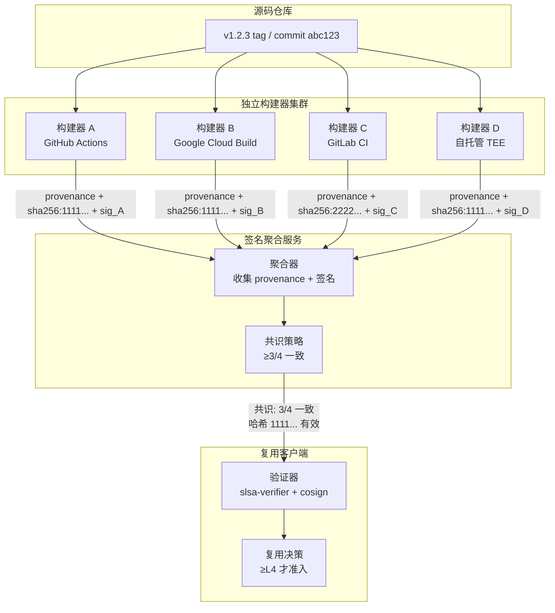
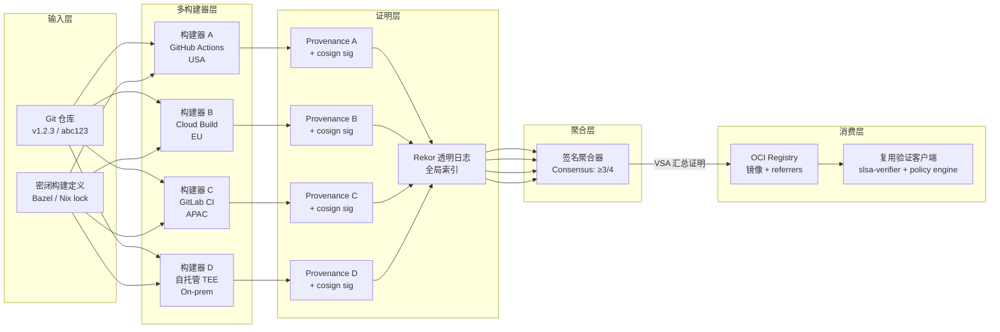

# SLSA L4 分布式构建验证实践

> **版本**: 2026-06-08
> **权威来源**: OpenSSF SLSA Active Workstreams, sigstore.dev, SLSA GitHub Community
> **定位**: Phase 4（2027-Q2）供应链安全前瞻交付物，探索 L4 分布式信任与复用验证的集成方案
> **交叉引用**: `struct/10-supply-chain-security/01-slsa-framework/slsa-reuse-boundaries.md`

---

## 1. SLSA L4 愿景

### 1.1 L4 与 L3 的核心差异

| 维度 | Build L3 | Build L4 |
|------|---------|----------------|
| **审查机制** | 构建过程隔离，但源码审查策略由平台自行决定 | **双因素审查**：所有源码变更强制经过双人审查 + 自动化安全扫描 |
| **构建可复现性** | 不强制要求（允许非确定性构建） | **完全可复现**：不同时间、不同构建器产生 bit-for-bit identical 产物 |
| **信任模型** | 依赖单一 CI/CD 平台（GitHub Actions, Cloud Build） | **分布式信任**：不依赖单一构建器，通过多独立构建器交叉验证建立共识 |
| **环境保证** | 隔离/临时环境 | **密闭（Hermetic）+ 硬件证明**：工具链和依赖完全锁定，环境状态可远程证明 |
| **当前状态** | 已发布，工具链成熟 | **开发中**：OpenSSF Build Level 4 Workstream 活跃讨论 |

L4 的本质是将"信任一个平台"转变为"信任一个协议"——即使单个构建器被攻破，多数诚实构建器仍能让消费者检测出异常。

### 1.2 L4 的当前状态

L4 目前处于 **OpenSSF Active Workstream** 阶段。关键事实：

- **无正式规范**: SLSA v1.2 Build Track 仅定义到 L3；L4 要求散见于社区讨论和 v0.1 遗留定义。
- **可复现构建社区**: Reproducible Builds 项目（Debian, Tor, Bitcoin）已积累十余年实践，但通用 CI 工具链的可复现性仍不足。
- **时间预期**: 业界预测 L4 正式规范将在 **2027–2028** 发布，企业应提前进行技术储备。

> **交叉引用**: `slsa-reuse-boundaries.md` §3.4 将 Build L4 定义为"最高可信复用"，给出 L3→L4 升级路径。本文扩展分布式验证视角。

---

## 2. 分布式构建验证概念

### 2.1 多签名构建（Multi-sig builds）

多签名构建要求 **N 个独立构建器** 使用相同源码和构建定义，各自生成产物和 provenance。当 ≥M 个构建器（通常 M = ⌈N/2⌉）的产物哈希一致时，该版本被视为可信。



**关键设计决策**:

- **独立性**: N 个构建器分属不同信任域（不同云厂商、组织、地理位置），防止协同攻击。
- **确定性输入**: 构建定义必须密闭，消除时间戳、随机数、路径等非确定性来源。
- **异步容忍**: 构建器异步提交结果，聚合器在窗口期（如 24h）后执行共识判定。

### 2.2 可复现构建（Reproducible builds）

可复现构建是 L4 的技术基石：给定相同源码和构建定义，任何时间、任何机器构建都应得到 **bit-for-bit identical** 产物。

**实现要点**:

| 非确定性来源 | 消除策略 | 工具/技术 |
|-------------|---------|----------|
| 时间戳嵌入 | 使用 `SOURCE_DATE_EPOCH` 规范化 | `strip-nondeterminism` |
| 文件系统路径 | 构建于固定 chroot 路径或使用 `-ffile-prefix-map` | Bazel, Nix |
| 随机数/UUID | 使用确定性伪随机种子 | 源码级修复 |
| 并行排序 | 稳定排序算法；避免依赖 `readdir` 顺序 | `sort` 显式排序依赖列表 |
| 压缩工具元数据 | 固定 `gzip -n`, `zip -X` | `deterministic-zip` |
| 编译器内置宏 | 使用 `__DATE__` / `__TIME__` 替代方案 | 编译器标志或预处理器 |

**验证方法**: 定期在不同构建器上执行可复现性验证 CI，比较 SHA-256 哈希；`diffoscope` 可定位字节级差异。

### 2.3 分布式信任模型

分布式信任模型将传统单一平台信任锚点替换为 **共识协议**：

- **不依赖单一 CI/CD**: 即使某一平台被攻破，其他构建器仍可提供独立视角。
- **透明日志（Rekor）**: 所有 provenance 和签名写入 Rekor，提供全局可审计的时间戳和非否认性。
- **可插拔验证策略**: 消费者可自定义共识阈值（金融系统 4/4，一般企业 2/3）。

---

## 3. sigstore/cosign 实践指南

### 3.1 使用 cosign 进行 OCI 镜像签名

**Keyless 签名（推荐）**:

```bash
# 构建镜像后，在 CI 中使用 OIDC 身份签名
cosign sign --yes \
  --oidc-issuer=https://token.actions.githubusercontent.com \
  --certificate-identity-regexp="https://github.com/myorg/.github/.github/workflows/build.yml@refs/tags/v.*" \
  myregistry.example.org/myapp:v1.2.3
```

**验证签名**:

```bash
cosign verify \
  --certificate-identity-regexp="https://github.com/myorg/.github/.github/workflows/build.yml@refs/tags/v.*" \
  --certificate-oidc-issuer=https://token.actions.githubusercontent.com \
  myregistry.example.org/myapp:v1.2.3
```

### 3.2 Fulcio（短寿命证书）+ Rekor（透明日志）

| 组件 | 功能 | 在分布式验证中的角色 |
|------|------|-------------------|
| **Fulcio** | OIDC 身份 → X.509 短寿命证书（默认 10 分钟） | 每个构建器的 CI 身份独立获得证书，无需长期密钥管理 |
| **Rekor** | 透明日志，记录所有签名和 provenance 的哈希 | 全局时间排序和不可篡改审计；检测回滚攻击和重签名攻击 |
| **Timestamp Authority** | RFC 3161 合规时间戳 | 为签名提供独立于构建器时钟的可信时间锚点 |

**多构建器场景的 Rekor 查询**:

```bash
# 检索特定镜像 digest 的所有公开签名记录
rekor-cli search --sha sha256:abc123...

# 获取特定 entry 的完整 provenance
rekor-cli get --uuid <entry-uuid> --format json | jq '.Body.HashedRekordObj.data.hash'
```

### 3.3 验证 SLSA Provenance Attestations

```bash
# 使用 slsa-verifier 验证 GitHub Actions 生成的 provenance
slsa-verifier verify-image \
  myregistry.example.org/myapp:v1.2.3 \
  --source-uri github.com/myorg/myapp \
  --builder-id https://github.com/slsa-framework/slsa-github-generator/.github/workflows/generator_container_slsa3.yml@refs/tags/v2.0.0 \
  --provenance-path provenance.att

# 在分布式场景中，验证多个 provenance 文件
for prov in provenance.{a,b,c,d}.att; do
  slsa-verifier verify-image ... --provenance-path "$prov" || exit 1
done
```

---

## 4. 概念验证设计（不实际搭建）

### 4.1 架构图：多构建器 → 签名聚合 → 验证客户端



**组件说明**:

- **输入层**: Git tag + commit 标识源码；Bazel/Nix lock 提供密闭定义。
- **多构建器层**: 4 个独立构建器各自生成 provenance。
- **证明层**: provenance 经 cosign keyless 签名并上传 Rekor；镜像 referrers 关联 provenance。
- **聚合层**: 独立聚合服务执行共识，生成 VSA。
- **消费层**: 复用系统引入组件前验证 VSA 和 provenance 签名链。

### 4.2 威胁模型：单一构建器被攻破的场景

| 威胁场景 | 攻击方式 | 检测机制 | 缓解措施 |
|---------|---------|---------|---------|
| **构建器 A 被植入后门** | 恶意 CI runner 注入 payload | 构建器 B/C/D 产物哈希与 A 不一致 | 拒绝 A 的 provenance；触发调查；临时提升阈值至 4/4 |
| **源码仓库被篡改** | 攻击者强制推送恶意 commit | 所有构建器基于 tampered 源码生成一致哈希；Source Track L3 审查日志可检测异常合并 | Source Track + 分支保护作为独立防线；Git 不可变引用辅助审计 |
| **聚合器本身被攻破** | 聚合器伪造 VSA 掩盖不一致 | VSA 也被签名并写入 Rekor；客户端可独立重验证 | 客户端不信任聚合器，仅作缓存；定期全量重验证 |
| **Rekor 日志分叉** | 攻击者运行恶意 Rekor 实例 | 客户端配置固定 Rekor 公钥；Witness/Monitors 监控一致性 | 多 Rekor monitor 独立运行；Gossip 检测分叉 |

### 4.3 回退策略：当签名不一致时的处理

```text
共识失败处理流程
├── 情况 1: 少数构建器不一致（如 1/4）
│   ├── 丢弃少数派产物和 provenance
│   ├── 向多数派哈希收敛，发布 VSA
│   └── 通知不一致构建器运营方调查
│
├── 情况 2: 无明确多数（如 2/4 vs 2/4）
│   ├── 拒绝发布该版本，标记为安全事件
│   ├── 触发人工安全审查
│   └── 暂停组件复用准入，直至调查完成
│
├── 情况 3: 全部一致但哈希非预期（全被攻破或源码污染）
│   ├── 灾难场景；依赖 Source Track L3 审查日志事后溯源
│   └── 启动紧急响应，回滚至上版本
│
└── 通用原则: "不信任，验证" — 客户端保留独立验证权
```

---

## 5. 与复用决策的集成

### 5.1 复用前验证：检查组件的 SLSA Provenance

组件进入企业制品注册表前，验证门控执行以下检查：

| 检查项 | 工具 | 失败行为 |
|-------|------|---------|
| Provenance 存在且格式合规 | `slsa-verifier` | 阻断，要求上游补充 |
| Build Track ≥ 目标等级 | `slsa-verifier --build-level` | 降级至更低信任区或阻断 |
| Source Track ≥ 目标等级 | 解析 Source Provenance / Scorecard | 标记为"未验证源码"，增加运行时监控 |
| 签名在 Rekor 中存在且无异常 | `rekor-cli verify` | 阻断，可能存在重签名攻击 |
| 镜像 digest 与 provenance 中的 subject 匹配 | `cosign verify` | 阻断，构建产物与声明不符 |
| L4 多构建器共识 VSA 有效 | 自定义 policy engine | 阻断，等待共识 |

### 5.2 升级策略：从 L3 到 L4 的迁移检查清单

```markdown
- [ ] Source Track L3 稳定运行 ≥6 个月（双人审查、分支保护、签名提交）
- [ ] 构建定义已密闭化（Nix / Bazel 锁定全部依赖和工具链）
- [ ] 可复现性验证 CI 已建立，连续 10 次构建哈希一致
- [ ] 至少 3 个独立构建器已部署，分属不同云厂商/组织
- [ ] Cosign keyless signing + Rekor 集成已完成
- [ ] 签名聚合器和共识策略已定义（N/M 阈值）
- [ ] 回退策略和灾难响应手册已编写并通过演练
- [ ] 下游验证客户端已升级支持多 provenance 验证
- [ ] 成本评估通过：L4 的构建和验证开销在预算范围内
- [ ] 合规团队确认 L4 满足目标监管框架（如 NIS2, CMMC）
```

> **交叉引用**: `slsa-reuse-boundaries.md` §3.4 的 L3 → L4 升级路径侧重单一组织内的技术升级；本文补充了跨组织分布式验证所需的运营和治理准备。

---

## 6. 权威来源

| 来源 | URL | 说明 |
|------|-----|------|
| SLSA Spec v1.2 | <https://slsa.dev/spec/v1.2/> | Build L3 正式规范；L4 社区讨论基础 |
| OpenSSF SLSA GitHub | <https://github.com/slsa-framework/slsa> | Active Workstreams、社区提案、路线图 |
| SLSA Build Level 4 Workstream | <https://github.com/slsa-framework/slsa/labels/build-level-4> | L4 定义的讨论 Issue 和 PR |
| Sigstore | <https://sigstore.dev> | cosign, Fulcio, Rekor 官方文档 |
| Cosign 文档 | <https://docs.sigstore.dev/cosign/> | OCI 镜像签名与验证指南 |
| Rekor 透明日志 | <https://docs.sigstore.dev/logging/> | 日志查询、监控、 witness 模式 |
| Reproducible Builds | <https://reproducible-builds.org/> | 可复现构建最佳实践和工具链 |
| SLSA GitHub Generator | <https://github.com/slsa-framework/slsa-github-generator> | 自动生成 SLSA provenance 的参考实现 |

---

> 最后更新: 2026-06-08
> 关联文件: `slsa-reuse-boundaries.md`, `slsa-1-2-multi-track.md`


---

## 补充章节
## 示例

**示例**：使用 Sigstore/cosign 对容器镜像进行签名，配合 GitHub Actions 隔离构建与可复现构建证明，达到 SLSA Build L3。

## 反例

**反例**：项目手动从个人仓库下载二进制依赖且无哈希校验，构建环境未隔离，无法达到 SLSA L1。

## 分析

**分析**：SLSA 将供应链安全分解为可升级、可审计的等级，是组织渐进式改进的路线图。