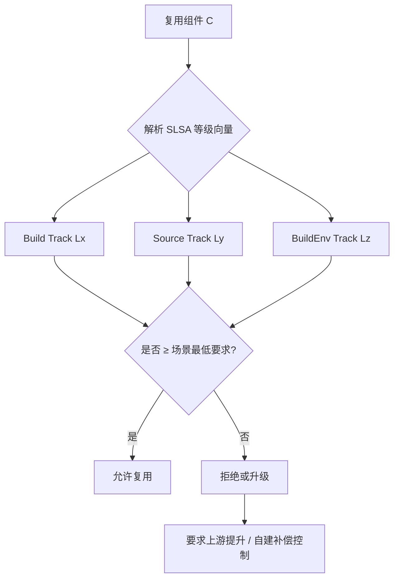
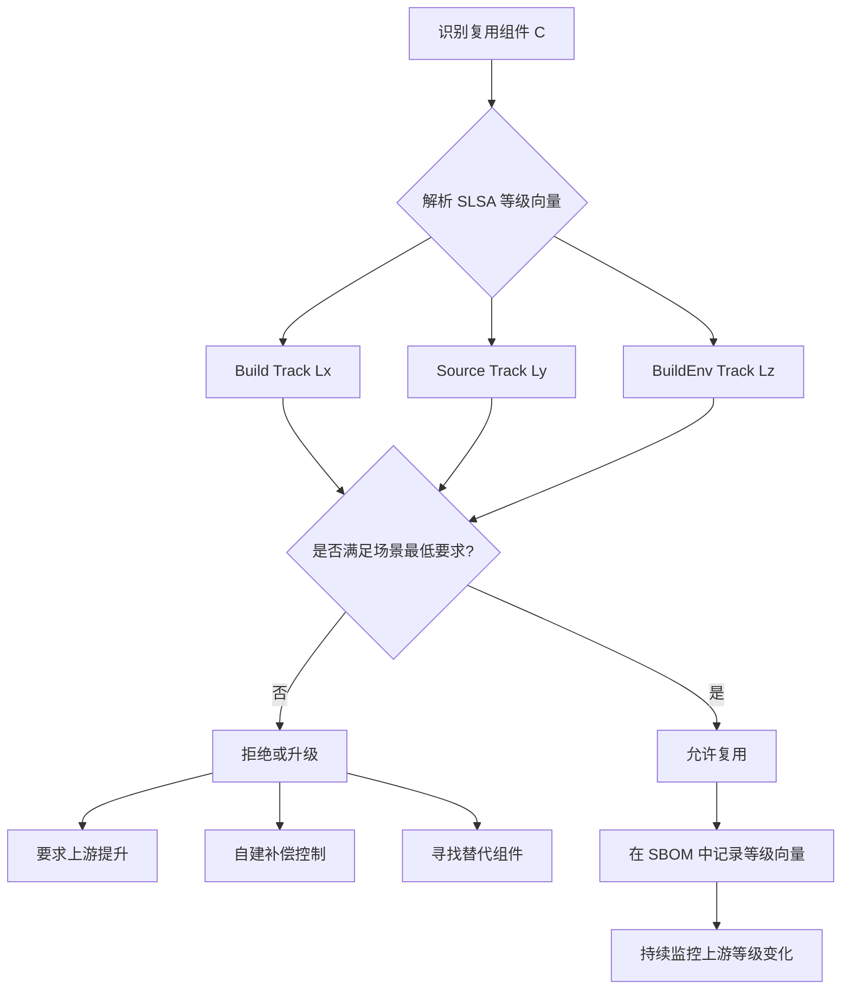
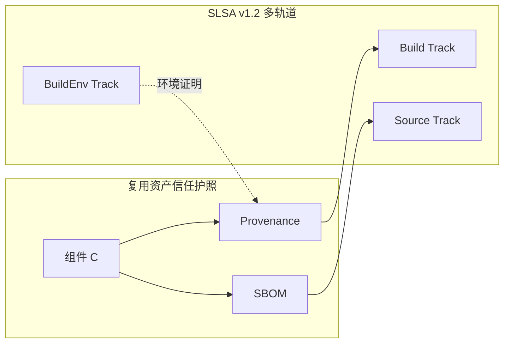

# SLSA v1.2 多轨道复用安全边界详解

> **版本**: 2026-07-07
> **权威来源**: SLSA Specification v1.2 (slsa.dev), OpenSSF Best Practices, Sigstore/cosign 2026 Stack
> **定位**: Track D 供应链安全工程深化内容，为 Phase 4（2027-Q2）预热
> **交叉引用**: `struct/04-component-architecture-reuse/07-language-ecosystems/open-source-supply-chain-reuse.md`

---

## 1. 引言：为什么复用需要 SLSA 边界

软件架构复用的核心悖论在于：**复用度越高，供应链攻击面越大**。
当一个系统 80–90% 的代码来自外部依赖（参见 Sonatype 2026 报告），任何上游组件的构建过程被篡改，都将直接传导至下游所有消费者。
SLSA（Supply-chain Levels for Software Artifacts）框架通过分级构建证明（Build Provenance）为这一悖论提供了形式化的安全边界。

> **定理 S.RB.1** (SLSA Reuse Boundary Monotonicity): 若组件 C 被复用于系统 S，则 S 在供应链安全维度的有效 SLSA 等级不超过 C 的 SLSA 等级。即 `SLSA(S) ≤ min{SLSA(Cᵢ)}`。

本文件将 SLSA v1.2 的 Multi-Track 等级（Build Track L1–L3、Source Track L1–L3、Build Environment Track L1–L3，L4 均处于规划/草案阶段）映射到架构复用决策中，明确"达到某轨道 Lx 的资产可在什么场景复用"，并提供可执行的升级路径。

---

## 2. SLSA 等级总览与复用安全边界

SLSA v1.2 采用**多轨道（Multi-Track）模型**：Build Track 正式定义 L1–L3；Source Track 于 v1.2 正式化；Build Environment Track 处于草案阶段。v1.0 中的单一 L4 标量描述（"可复现构建 + 双人审查"）已过时，其要求被拆分到 Source Track 与 BuildEnv Track。因此，复用边界应采用**轨道等级向量** `(Build Lx, Source Ly, Env Lz)` 表示。

| 等级 | Build Track 核心目标 | 复用安全边界含义 | 2026 工具链支持 |
|------|---------------------|-----------------|----------------|
| **L0** | 无保证 | 不可信资产，禁止复用于生产环境 | — |
| **L1** | 知道软件从何而来 | 可复用于内部原型、POC 阶段 | GitHub Actions, GitLab CI |
| **L2** | 防止构建后被篡改 | 可复用于非关键业务系统、内部工具 | Sigstore/cosign keyless, SLSA GitHub Generator |
| **L3** | 防止构建过程中被篡改 | 可复用于生产系统、金融/医疗等高合规场景 | GitHub Actions (hardened), Google Cloud Build, GitLab native attestation |

> **注意**：关键基础设施、国防、航空航天等场景不再简单要求"Build L4"，而应根据风险选择 **Build L3 + Source L3 + BuildEnv L3** 的多轨道组合。

> **引用**: SLSA.dev Spec v1.0 — "Build L3 provides robust protection against tampering and unauthorized access, ensuring a high level of trust and integrity in the software development process." [^1]

---

## 3. 各级别详细解析

### 3.1 Build L1: Provenance Generation — "可追溯复用"

#### 要求清单

| 要求编号 | 要求描述 | 验证方法 |
|---------|---------|---------|
| BL1-R1 | 构建过程完全脚本化/自动化 | 存在 `Makefile` / `build.sh` / CI 配置文件 |
| BL1-R2 | 生成并发布 Provenance（来源证明） | Provenance 文件随制品分发 |
| BL1-R3 | Provenance 包含构建定义和依赖信息 | 符合 SLSA Provenance v1 格式 |

#### 复用决策矩阵

| 复用场景 | 允许性 | 条件与限制 |
|---------|-------|-----------|
| 内部原型 / POC | ✅ 允许 | 需在 SBOM 中标记为 L1，明确无篡改保护 |
| 开发/测试环境 | ⚠️ 有条件 | 需配合依赖扫描（`npm audit`, `cargo audit`）使用 |
| 非关键生产系统 | ❌ 不建议 | 无签名保护，无法检测构建后篡改 |
| 关键生产系统 | ❌ 禁止 | 不满足最小篡改检测要求 |
| 开源组件再分发 | ⚠️ 有条件 | 需明确告知下游消费者无构建保证 |

#### 升级路径

```text
L0 → L1
├── 步骤 1: 将手动构建迁移至 CI/CD（GitHub Actions / GitLab CI / Jenkins）
├── 步骤 2: 使用 SLSA GitHub Generator 或自研脚本生成 Provenance
├── 步骤 3: 将 Provenance 作为 Release Artifact 附加
└── 验证: 检查 Provenance 中 buildType、externalParameters、resolvedDependencies 完整性
```

> **交叉引用**: `struct/04-component-architecture-reuse/07-language-ecosystems/open-source-supply-chain-reuse.md` §5.2 指出，L1 级别的 Provenance 是 SBOM 全生命周期的起点，但缺乏密码学保证的 Provenance 无法防御 Lockfile 注入攻击。

---

### 3.2 Build L2: Hosted Build + Authenticated Provenance — "防篡改复用"

#### 要求清单

| 要求编号 | 要求描述 | 验证方法 |
|---------|---------|---------|
| BL2-R1 | 使用版本控制系统（Git/SVN） | 源码来源可追溯至特定 commit |
| BL2-R2 | 使用托管构建服务 | 构建在 GitHub Actions / Cloud Build / GitLab CI 等托管平台执行 |
| BL2-R3 | Provenance 经过签名和认证 | 使用 Sigstore/cosign keyless signing 或 GPG/X.509 签名 |
| BL2-R4 | Provenance 由构建服务生成 | 非人工手动创建，防止伪造 |

#### 复用决策矩阵

| 复用场景 | 允许性 | 条件与限制 |
|---------|-------|-----------|
| 内部工具/后台管理 | ✅ 允许 | 适合非面向客户的业务支持系统 |
| SaaS 服务（非核心模块） | ✅ 允许 | 需配合运行时监控（Falco/Tetragon） |
| 金融服务（非交易核心） | ⚠️ 有条件 | 需叠加 SAST/SCA 扫描，并满足 Source Track L1 |
| 医疗系统（HIPAA 范围） | ❌ 不建议 | 需达到 L3 才能满足 HIPAA 安全规则 |
| 关键基础设施 | ❌ 禁止 | 不满足构建过程隔离要求 |

#### 升级路径

```text
L1 → L2
├── 步骤 1: 将构建迁移至托管 CI/CD（避免本地/自托管 runner）
├── 步骤 2: 集成 Sigstore/cosign keyless signing（推荐）
│   └── cosign sign --yes --oidc-issuer=https://token.actions.githubusercontent.com <image>
├── 步骤 3: 使用 SLSA GitHub Generator v2.0+ 自动生成签名 Provenance
├── 步骤 4: 在 registry 中存储签名和 Provenance（OCI 1.1 参考类型）
└── 验证: cosign verify --certificate-identity=ci@org.com --certificate-oidc-issuer=<issuer> <image>
```

> **2026 Sigstore/cosign 新特性**:
> Cosign v2.4.1 支持 Rekor v1.2 透明日志，提供非否认性证明。
> keyless signing 通过 OIDC 将短期签名密钥绑定至 CI 身份，彻底消除长期密钥管理风险 [^2]。

---

### 3.3 Build L3: Hardened Build Platform — "可信复用"

#### 要求清单

| 要求编号 | 要求描述 | 验证方法 |
|---------|---------|---------|
| BL3-R1 | 构建定义来源于版本控制中的源码 | `buildType` 指向仓库内文件，非外部配置 |
| BL3-R2 | 构建环境是临时的（Ephemeral） | 每次构建使用全新 VM/容器，构建后销毁 |
| BL3-R3 | 构建环境是隔离的（Isolated） | 构建间无共享状态、无网络访问（除必要依赖下载） |
| BL3-R4 | 构建平台满足安全基线 | 平台通过审计（如 ISO 27001, SOC 2）或公开透明 |
| BL3-R5 | Provenance 非伪造性 | 仅构建平台可访问签名密钥，构建者无法伪造 |

#### 复用决策矩阵

| 复用场景 | 允许性 | 条件与限制 |
|---------|-------|-----------|
| 企业级 SaaS 核心服务 | ✅ 允许 | 2026 年企业基线标准 |
| 金融服务（含交易核心） | ✅ 允许 | 满足 PCI-DSS、SOX 合规要求 |
| 医疗系统（HIPAA/CRA） | ✅ 允许 | 满足 EU CRA 网络安全要求 |
| 汽车软件（ISO 26262） | ⚠️ 有条件 | 需叠加 Source Track L2（认证提交历史） |
| 航空航天/国防（DO-178C） | ⚠️ 有条件 | 建议向 L4 演进，需形式化验证配合 |
| 开源组件再分发 | ✅ 允许 | npm provenance（SLSA L3）已成为社区信任标志 |

#### 升级路径

```text
L2 → L3
├── 步骤 1: 启用隔离构建环境
│   ├── GitHub Actions: 使用 hosted runners（非 self-hosted）
│   ├── Google Cloud Build: 使用默认 worker pool
│   └── 私有环境: 确保 VM 每次构建后重建（Ephemeral）
├── 步骤 2: 限制构建网络访问
│   ├── 禁用构建步骤中的任意网络调用（`curl`, `wget`）
│   ├── 依赖预下载至内部代理仓库（ Nexus / Artifactory ）
│   └── 使用 `--network=none` 或等价容器策略
├── 步骤 3: 分离构建者与签名者权限
│   └── 使用 OIDC 联邦身份，让 CI 平台（非用户）获取签名凭证
├── 步骤 4: 实施构建平台安全基线
│   ├── 定期轮换构建镜像
│   ├── 扫描构建环境中的 CVE
│   └── 记录构建平台审计日志
└── 验证: 使用 slsa-verifier 检查 Provenance 的 builder.id 和 buildLevel
```

> **交叉引用**: `struct/04-component-architecture-reuse/07-language-ecosystems/comparison-matrix-2026.md` §4.4 指出，
> Rust（Cargo）和 Node.js（npm）生态在 2026 年已原生支持 SLSA L3 provenance（npm provenance via Sigstore，crates.io Trusted Publishing），
> 而 JVM 生态仍需手动配置。

---

### 3.4 Build L4 的过时标量视角（v1.2 已转向多轨道）

SLSA v1.0 曾将 L4 描述为"最高可信复用"的标量等级，要求双人审查、可复现构建与密闭构建。SLSA v1.2 已将这些要求拆分到 **Source Track** 与 **Build Environment Track**，并以独立等级呈现。因此，**不再使用单一 L4 标量**指导复用决策。最高可信场景应使用向量 `(Build L3, Source L3, Env L3)` 表示。详细矩阵与反例见第 7 节。

---

## 4. SLSA 等级与依赖治理的交叉引用

`struct/04-component-architecture-reuse/07-language-ecosystems/open-source-supply-chain-reuse.md` 提出了分层防御策略。
本文件将其与 SLSA 等级映射如下：

| 防御层 | 依赖治理措施 | 对应 SLSA 等级 | 理由 |
|-------|-------------|---------------|------|
| Layer 1: Proxy Registry | 缓存公共 registry，自动漏洞扫描 | L1–L2 | 保证来源可追溯，但无构建保证 |
| Layer 2: 审批工作流 | 新包/新版本需安全团队审批，7天冷却期 | L2–L3 | 结合签名证明和托管构建信任 |
| Layer 3: Lockfile + 哈希 | 精确版本锁定，密码学哈希验证 | L3 | 需要硬化构建平台保证 lockfile 未被篡改 |
| Layer 4: Vendoring | 关键系统完全离线构建，源码级补丁 | L4 | 密闭构建与可复现性的终极形态 |

> **定理 S.RB.2** (Dependency-SLSA Composition): 若系统 S 依赖组件集合 {C₁, C₂, ..., Cₙ}，且各组件 SLSA 等级为 {L₁, L₂, ..., Lₙ}，则 S 的有效 SLSA 等级为 `min(L₁, L₂, ..., Lₙ)`，与 S 自身的构建等级无关。

这意味着：**即使你的构建达到 L4，但只要有一个依赖是 L1，整个系统的复用安全边界就降级为 L1**。
这正是 `struct/04-component-architecture-reuse/07-language-ecosystems/open-source-supply-chain-reuse.md` §6.3 强调"分层组合策略"的根本原因。

---

## 5. 2026–2027 实施路线图

| 阶段 | 时间 | 目标等级 | 关键行动 |
|------|------|---------|---------|
| **Phase 1** | 2026 Q3 | L1 全覆盖 | 所有组件生成 Provenance；CI/CD 全自动化 |
| **Phase 2** | 2026 Q4 | L2 核心系统 | 核心组件启用托管构建 + cosign keyless 签名 |
| **Phase 3** | 2027 Q1 | L3 生产基线 | 生产组件全部达到 Build L3；推动关键供应商提供 L3 证明 |
| **Phase 4** | 2027 Q2 | L4 关键系统 | 金融/国防/关键基础设施组件达到 L4 |

---

## 6. 参考索引

[^1]: SLSA.dev, "SLSA Specification v1.0 — Security Levels", <https://slsa.dev/spec/v1.0/levels>
[^2]: Sigstore Project, "Cosign v2.4.1 Release Notes — Rekor v1.2 Support", 2026; HAMS Tech, "Kubernetes Supply Chain Security in 2026", 2026-02

## 7. SLSA 1.2 多轨道复用边界矩阵与反例

### 7.1 从标量到向量：多轨道定义

SLSA v1.2 引入 Multi-Track 架构，将供应链信任从单一 Build Track 标量扩展为至少三条独立轨道。对复用者而言，这意味着组件的"信任护照"是一个等级向量，而非单一数字。

- **Build Track**：验证构建过程是否自动化、托管、隔离、不可伪造。
- **Source Track**：验证源码是否受版本控制、提交历史是否认证、是否强制审查与分支保护。
- **Build Environment Track（BuildEnv Track）**：验证构建运行环境本身是否可证明、可复现、是否在硬件可信执行环境（TEE）中执行。

> **定义 S.MT.1** (SLSA 多轨道复用边界)：组件 C 的复用安全等级为三元组 `(Build_C, Source_C, Env_C)`。若系统 S 复用 C，则 S 在各轨道上的有效等级满足 `SLSA_track(S) ≤ SLSA_track(C)`。

### 7.2 三轨道 × L1–L3 复用边界矩阵

下表给出不同轨道等级组合对应的复用边界与典型场景。

| Build | Source | BuildEnv | 复用边界 | 典型场景 |
|-------|--------|----------|---------|---------|
| L1 | — | — | 仅可追溯，无篡改防护 | 内部原型、POC |
| L2 | L1 | — | 防止构建后篡改，源码在版本控制中 | 内部工具、后台管理 |
| L3 | L2 | L1 | 防止构建中篡改，认证源码历史，记录环境版本 | 企业 SaaS 核心服务 |
| L3 | L3 | L2 | 强制双人审查 + 启动证明 | 金融/医疗高合规系统 |
| L3 | L3 | L3 | 硬件 TEE + 可复现环境 | 关键基础设施、国防、航空航天 |

### 7.3 Source Track 与 BuildEnv Track 对复用的影响

**Source Track 影响**：

- L1 保证源码有不可变标识符，解决"复用的代码是哪个版本"的问题。
- L2 通过提交签名与历史保留，防止 maintainer 身份伪造与历史重写。
- L3 强制分支保护与双人审查，显著降低上游代码植入（如 XZ Utils）的风险。

**BuildEnv Track 影响**：

- L1 要求构建镜像附带 provenance/SBOM，使环境版本可追踪。
- L2 要求启动证明（vTPM / Secure Boot），确保每次构建使用的环境实例与基线一致。
- L3 要求在 TEE 中运行构建，防止构建平台管理员或恶意进程篡改构建过程。

> **定理 S.MT.2** (短板定理)：系统 S 的复用安全边界等于其所有依赖在各轨道上等级的最小值。即使 Build 达到 L3，只要 Source 为 L0，攻击者仍可通过控制上游仓库注入后门。

### 7.4 正例

| 组件 | 等级向量 | 复用价值 |
|------|---------|---------|
| npm 包 with provenance | Build L3, Source L2 | 消费者可验证包由 npm 官方 CI 构建，提交历史经 GPG/SSH 签名 |
| GitHub Actions 构建的内部共享库 | Build L3, Source L3 | 主分支强制 PR 审查与状态检查，隔离构建环境 |
| 金融核心模块在 AMD SEV-SNP VM 中构建 | Build L3, Source L3, Env L3 | 硬件证明环境完整性，满足最高合规要求 |

### 7.5 反例

| 反例 | 风险说明 |
|------|---------|
| 仅宣称"Build L3"但 Source Track 未评估 | 源码仓库未启用分支保护，攻击者可直接推送恶意代码 |
| 使用自托管 runner 且未记录镜像 provenance（Env L0） | 构建环境可被持久化攻击，runner 镜像含后门 |
| 将 v1.0 的"L4"当作单一标量采购要求 | 忽略了 Source/Env 短板，合同条款无法覆盖多轨道验证 |
| 依赖仅提供 Build L1 provenance 却用于生产 | 无法检测构建后篡改，如 SolarWinds 式构建系统攻击 |

### 7.6 多轨道复用决策 Mermaid 图



### 7.7 权威来源与交叉引用

- SLSA Specification v1.2 — Multi-Track: <https://slsa.dev/spec/v1.2/>
- SLSA Source Track: <https://slsa.dev/spec/v1.2/levels#source-track>
- SLSA Build Environment Track (draft): <https://github.com/slsa-framework/slsa/issues>
- OpenSSF SLSA GitHub Generator: <https://github.com/slsa-framework/slsa-github-generator>
- Sigstore: <https://sigstore.dev>
- in-toto: <https://in-toto.io>
- 相关概念: [Supply chain attack](https://en.wikipedia.org/wiki/Supply_chain_attack)
- **交叉引用**: `struct/10-supply-chain-security/01-slsa-framework/slsa-1-2-multi-track.md` §3.1；`struct/04-component-architecture-reuse/07-language-ecosystems/open-source-supply-chain-reuse.md` §6.3

---

## 8. SLSA v1.2 Build Track 与 Source Track 对复用边界的独立影响

### 8.1 Build Track：复用边界的"完整性基线"

Build Track 解决的核心问题是：**复用者收到的二进制制品，是否真实地来自声明的源码，且在构建后未被篡改**。在复用场景中，Build Track 等级直接决定了组件可作为何种类型的"信任输入"进入下游系统。

| Build Track 等级 | 对复用边界的影响 | 可复用性结论 |
|-----------------|-----------------|-------------|
| **L0** | 无 provenance，无法验证来源或完整性 | **禁止**进入生产交付包；仅可作为本地实验代码 |
| **L1** | 知道构建脚本和依赖清单，但无密码学保证 | 可复用于内部原型、POC、开发工具；不得用于客户-facing 生产系统 |
| **L2** | 构建在托管环境执行，provenance 经签名认证 | 可复用于非关键生产系统、内部共享服务；需叠加依赖扫描 |
| **L3** | 隔离/临时/硬化构建平台，provenance 不可伪造 | 可复用于关键生产系统、金融/医疗/关键基础设施；是企业采购的推荐基线 |

> **定理 S.RB.3** (Build Track 复用单调性): 若系统 S 复用组件 C，则 S 在 Build Track 上的有效等级满足 `Build(S) ≤ Build(C)`。即：下游无法通过自身构建升级来弥补上游组件的 Build Track 短板。

**Build Track 对复用决策的启示**：

1. **采购合同条款**：在采购第三方闭源/开源组件时，应将 Build Track 等级写入安全 SLA。例如，要求核心依赖至少提供 Build L2 provenance，关键路径组件达到 Build L3。
2. **内部组件目录**：企业组件目录应自动标注每个组件的 Build Track 等级，并与 CI/CD 门禁联动。低于目标等级的组件在推送到生产 registry 时触发审批流程。
3. **传递依赖降级**：即使直接依赖达到 Build L3，其传递依赖若仅为 L1，则该子树的有效等级仍降级为 L1。因此，复用评估必须覆盖完整依赖树。

### 8.2 Source Track：复用边界的"上游治理基线"

Source Track 解决的核心问题是：**进入构建的源码是否经过适当的版本控制、身份认证和审查流程**。在复用场景中，Source Track 等级决定了上游仓库被恶意控制或历史被篡改的抵抗能力。

| Source Track 等级 | 对复用边界的影响 | 可复用性结论 |
|------------------|-----------------|-------------|
| **L0** | 源码未纳入版本控制或无法验证标识符 | **禁止**作为可复用组件；等同于不可追溯代码 |
| **L1** | 源码在版本控制中，每个变更有不可变标识符 | 可复用于内部工具、非关键模块；可回答"这是哪个版本" |
| **L2** | 提交历史经认证（GPG/SSH 签名）并永久保留 | 可复用于企业核心服务；防止 maintainer 身份伪造和历史重写 |
| **L3** | 强制分支保护、双人审查、状态检查、签名提交 | 可复用于高合规/高安全场景；显著降低上游代码植入风险（如 XZ Utils 式攻击） |

> **定理 S.RB.4** (Source Track 复用单调性): 若系统 S 复用组件 C，则 S 在 Source Track 上的有效等级满足 `Source(S) ≤ Source(C)`。Source Track 的短板无法通过更严格的构建环境弥补。

**Source Track 对复用决策的启示**：

1. **开源组件选型**：优先选择启用分支保护、要求 PR 审查、使用 signed commits 的项目。OpenSSF Scorecard 的"Branch Protection"和"Signed Commits"检查可作为快速筛选器。
2. **内部共享库治理**：强制主分支保护、双人审查和 CI 状态检查。将 Source L3 作为内部"黄金组件"的准入门槛。
3. **长期维护评估**：Source L2 要求历史永久保留。对于可能删除旧版本或重写历史的项目，应评估其 Source Track 等级并制定版本锁定策略。

### 8.3 BuildEnv Track：复用边界的"运行时信任基线"

Build Environment Track 解决的核心问题是：**执行构建的环境本身是否可信**。在最高安全场景下，即使 Build Track 和 Source Track 都达到 L3，构建环境若被持久化攻击（如 runner 镜像植入后门），仍可能污染产物。

| BuildEnv Track 等级 | 对复用边界的影响 | 可复用性结论 |
|--------------------|-----------------|-------------|
| **L0** | 未记录或验证构建环境 | 不适用于关键基础设施；无法证明环境一致性 |
| **L1** | 构建环境附带 provenance/SBOM | 可复用于企业 SaaS 核心服务；环境版本可追踪 |
| **L2** | 启动证明（vTPM/Secure Boot）验证环境 | 可复用于金融/医疗高合规系统；防止环境启动链篡改 |
| **L3** | 在硬件 TEE 中运行构建 | 可复用于关键基础设施、国防、航空航天；提供硬件级环境完整性 |

### 8.4 L4 状态澄清：所有轨道的 L4 均为"规划中/草案"

SLSA v1.0 曾将 L4 描述为 Build Track 的最高等级，要求"双人审查 + 可复现构建"。SLSA v1.2 已明确：

- **Build Track L4**：仍处于 OpenSSF 工作流讨论阶段，尚未发布正式要求。预计包含更严格的可复现性（bit-for-bit reproducible）和多方审计。
- **Source Track L4**：同样处于规划中，可能要求更高级别的身份认证、审查者独立性、或去中心化源码镜像。
- **Build Environment Track L4**：尚未定义，可能涉及形式化验证的构建环境或硬件安全模块。

> **定义 S.RB.5** (SLSA L4 草案状态): SLSA v1.2 中，任何轨道的 L4 均不应用于生产合规要求或采购合同的强制条款。组织应将 **Build L3 + Source L3 + BuildEnv L3** 作为 2027 年的实际最高基线，并跟踪 L4 草案进展。

### 8.5 多轨道复用边界正例与反例补强

#### 正例

| 场景 | 等级向量 | 复用决策说明 |
|------|---------|-------------|
| 内部 CRM 插件 | (Build L2, Source L1, Env L0) | 非关键业务，有签名 provenance 即可 |
| 支付网关 SDK | (Build L3, Source L3, Env L2) | 金融核心，需双人审查 + 启动证明 |
| 开源日志库（Log4j 类） | (Build L3, Source L2, Env L1) | 广泛使用的基础库，需高 Build/Source 等级 |
| 国防通信模块 | (Build L3, Source L3, Env L3) | 关键基础设施，需硬件 TEE 构建 |

#### 反例

| 反例 | 风险说明 |
|------|---------|
| 合同要求"SLSA L4"但无轨道限定 | L4 处于草案，无法验证；应改为明确的 `(Build L3, Source L3, Env L3)` |
| 仅关注 Build Track，忽略 Source Track | 源码仓库被攻破后，Build L3 无法阻止恶意代码进入构建 |
| 将 Source L3 误认为 Build L3 | 源码审查再严格，构建环境被篡改仍会产生恶意产物 |
| 依赖仅 Build L1 却用于生产 | 无法检测构建后篡改，如 SolarWinds 事件 |
| 自托管 runner 未记录 Env L1 | 环境镜像无 provenance，持久化后门难以发现 |

### 8.6 SLSA 多轨道复用边界决策 Mermaid 图



### 8.7 权威来源与交叉引用补强

- SLSA Specification v1.2 — Multi-Track: <https://slsa.dev/spec/v1.2/>
- SLSA Build Track: <https://slsa.dev/spec/v1.2/levels#build-track>
- SLSA Source Track: <https://slsa.dev/spec/v1.2/levels#source-track>
- SLSA Build Environment Track (draft): <https://github.com/slsa-framework/slsa/issues>
- OpenSSF SLSA GitHub Generator: <https://github.com/slsa-framework/slsa-github-generator>
- Sigstore: <https://sigstore.dev>
- in-toto: <https://in-toto.io>
- 相关概念: [Supply chain attack](https://en.wikipedia.org/wiki/Supply_chain_attack)
- **交叉引用**: `struct/10-supply-chain-security/01-slsa-framework/slsa-1-2-multi-track.md` §3.1；`struct/04-component-architecture-reuse/07-language-ecosystems/open-source-supply-chain-reuse.md` §6.3；`struct/10-supply-chain-security/03-attack-vectors/attack-tree.md` §7

## 9. SLSA v1.2 多轨道复用边界形式化定义与属性表

> **定义 S.RB.6** (SLSA v1.2 多轨道复用边界): 组件 C 的复用安全边界由三元组 `(Build(C), Source(C), Env(C))` 描述。Build Track 保证构建过程的完整性与不可伪造性；Source Track 保证源码来源、身份认证与审查强度；Build Environment Track 保证构建执行环境本身可证明、可复现、可隔离。系统 S 复用 C 时，各轨道有效等级满足 `SLSA_track(S) ≤ SLSA_track(C)`。

### 9.1 三轨道等级属性表

| Track | Level | 核心目标 | 信任假设 | 关键产物 | 复用边界 | 典型场景 |
|-------|-------|----------|----------|----------|----------|----------|
| Build Track | L1 | 知道软件从何而来 | 自动化构建脚本 | Provenance | 内部原型/POC | 实验性工具 |
| Build Track | L2 | 防止构建后被篡改 | 托管构建 + 签名 | Signed Provenance | 内部工具/非关键 SaaS | 后台服务 |
| Build Track | L3 | 防止构建过程中被篡改 | 隔离/硬化构建平台 | Hermetic Provenance | 生产/金融/医疗 | 核心交易服务 |
| Source Track | L1 | 源码有不可变标识 | 版本控制 | Commit SHA | 内部非关键模块 | 脚本库 |
| Source Track | L2 | 提交历史认证且不可重写 | 签名提交 | Signed commit history | 企业核心服务 | 共享库 |
| Source Track | L3 | 强制审查与分支保护 | 双人审查 + 状态检查 | PR + status checks | 高安全场景 | 密码学/基础设施 |
| BuildEnv Track | L1 | 构建环境可追溯 | 环境 SBOM | Image provenance | 企业 SaaS 核心 | 容器化构建 |
| BuildEnv Track | L2 | 启动证明验证环境 | vTPM/Secure Boot | Boot attestation | 金融/医疗高合规 | 硬化 runner |
| BuildEnv Track | L3 | 硬件 TEE 中运行构建 | 可信执行环境 | HW attestation | 国防/关键基础设施 | 机密计算 |

> **注意**：SLSA v1.2 中所有轨道的 L4 目前均为**规划中/草案**状态，不建议写入生产合规要求或采购合同。2027 年实际最高基线应为 `(Build L3, Source L3, Env L3)`。

### 9.2 与 SBOM、Provenance 的关系

SLSA Provenance 是 SBOM 的“构建过程视角”，两者共同构成复用资产的信任护照：

- **SBOM** 回答“复用了什么组件、什么版本、来自哪里”。
- **Provenance** 回答“该组件如何被构建、由谁构建、构建环境是否可信”。
- **SLSA 等级向量** 将两者上升为可验证的安全边界：只有 `(Build, Source, Env)` 均满足场景最低要求时，才允许进入对应复用域。

> **定理 S.RB.7** (Provenance-SBOM 组合定理): 若组件 C 的 SBOM 缺失或 Provenance 不可验证，则无论其 Build Track 等级如何，C 的复用边界均降级为 L0。

### 9.3 正例

| 场景 | 等级向量 | 复用决策说明 |
|------|----------|--------------|
| npm provenance 包 | (Build L3, Source L2, Env L1) | 消费者可验证包由 npm 官方 CI 构建，提交历史经签名保护 |
| GitHub Actions 内部共享库 | (Build L3, Source L3, Env L2) | 主分支强制 PR 审查，runner 启动经 vTPM 证明 |
| 国防通信模块 | (Build L3, Source L3, Env L3) | 在 AMD SEV-SNP VM 中构建，提供硬件级环境完整性证明 |

### 9.4 反例

| 反例 | 风险说明 |
|------|----------|
| 采购合同仅写“达到 SLSA L4” | L4 处于草案，无法验证，应改为明确的三轨道向量 |
| 只看 Build L3 忽略 Source Track | 源码仓库被攻破后，硬化构建平台仍会构建恶意代码 |
| 自托管 runner 未记录 Env 等级 | 环境镜像无 provenance，持久化后门难以发现 |
| 将 Provenance 与 SBOM 分离存储 | 审计时无法关联构建产物与依赖清单 |

### 9.5 多轨道信任护照 Mermaid 图



### 9.6 权威来源与交叉引用

- SLSA Specification v1.2 — Multi-Track: <https://slsa.dev/spec/v1.2/>
- SLSA Build Track: <https://slsa.dev/spec/v1.2/levels#build-track>
- SLSA Source Track: <https://slsa.dev/spec/v1.2/levels#source-track>
- SLSA Build Environment Track (draft): <https://github.com/slsa-framework/slsa/issues>
- OpenSSF: <https://openssf.org>
- Sigstore: <https://sigstore.dev>
- in-toto: <https://in-toto.io>
- 相关概念: [Supply chain attack](https://en.wikipedia.org/wiki/Supply_chain_attack)
- **交叉引用**: `struct/10-supply-chain-security/01-slsa-framework/slsa-1-2-multi-track.md` §3.1；`struct/10-supply-chain-security/03-attack-vectors/attack-tree.md` §7；`struct/04-component-architecture-reuse/07-language-ecosystems/open-source-supply-chain-reuse.md` §6.3


> 最后更新: 2026-07-07
> 关联文件: `slsa-1-2-multi-track.md`, `struct/04-component-architecture-reuse/07-language-ecosystems/open-source-supply-chain-reuse.md`
