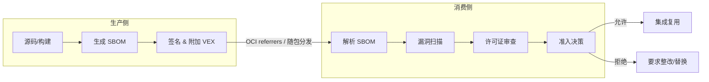

# SBOM 格式对比：SPDX vs CycloneDX vs SWID

> **版本**: 2026-06-06
> **定位**: 对比主流 SBOM 格式的特性、适用场景与复用策略

---

## 1. 三种格式概览

| 特性 | SPDX (ISO/IEC 5962) | CycloneDX (OWASP) | SWID (ISO/IEC 19770-2) |
|------|---------------------|-------------------|------------------------|
| **标准化组织** | Linux Foundation / ISO | OWASP | ISO/IEC / NIST |
| **主要用途** | 许可证合规 + 供应链安全 | 供应链安全 + 漏洞管理 | 软件资产管理 |
| **表达复杂度** | 高 | 中 | 低 |
| **嵌套依赖支持** | 优秀 | 优秀 | 有限 |
| **许可证信息** | 非常丰富 | 支持 | 有限 |
| **漏洞关联** | 通过 VEX 扩展 | 原生支持 | 较弱 |
| **适用场景** | 企业合规、法律咨询 | 安全运营、DevSecOps | 资产清单、ITAM |

---

## 2. SPDX 详解

SPDX (Software Package Data Exchange) 是 Linux Foundation 主导的开放标准，已被 ISO 接纳为 ISO/IEC 5962。

### 核心元素

```text
SPDX Document
├── SPDXID: SPDXRef-DOCUMENT
├── name
├── documentNamespace
├── creators
├── packages[]
│   ├── SPDXID, name, downloadLocation
│   ├── licenseConcluded, licenseDeclared
│   └── externalRefs
├── relationships[]
│   ├── DEPENDS_ON
│   ├── CONTAINS
│   └── DESCRIBES
└── files[], snippets[] (optional)
```

### 优势

- 丰富的许可证表达
- 强大的关系模型
- ISO 国际标准
- 生态工具丰富

### 局限

- 学习曲线陡峭
- 文档可能冗长
- 漏洞信息需要 VEX 扩展

---

## 3. CycloneDX 详解

CycloneDX 是 OWASP 主导的标准，专注于软件供应链安全。

### 核心元素

```text
bom.json
├── metadata
├── components[]
│   ├── type, name, version, purl
│   ├── licenses[], hashes[]
│   ├── pedigree, externalReferences
│   └── properties
├── dependencies[]
├── vulnerabilities[] (原生)
└── formulations[]
```

### 优势

- 原生漏洞支持
- DevSecOps 友好
- JSON 格式轻量
- 工具生态完善

### 局限

- 许可证表达不如 SPDX 精细
- 国际标准采纳程度较低

---

## 4. SWID 详解

SWID (Software Identification Tags) 是 ISO/IEC 19770-2 标准。

### 核心元素

```xml
<SoftwareIdentity name="MyApp" tagId="..." version="1.0.0">
    <Entity name="Example Inc." role="softwareCreator"/>
    <Payload>
        <File name="core.jar" SHA256:hash="..."/>
    </Payload>
</SoftwareIdentity>
```

### 优势

- NIST 要求对齐
- 软件资产管理原生支持
- 轻量级

### 局限

- 依赖关系表达弱
- 漏洞和许可证信息支持有限

---

## 5. 格式选择决策

```text
SBOM 格式选择
│
├── 主要目标？
│   ├── 许可证合规 → SPDX
│   ├── 安全漏洞管理 → CycloneDX
│   └── 软件资产盘点 → SWID
│
├── 输出格式偏好？
│   ├── JSON → CycloneDX
│   ├── RDF/Tag-Value → SPDX
│   └── XML → SWID/SPDX
│
└── 监管要求？
    ├── 美国联邦 → SWID + SPDX/CycloneDX
    └── 欧盟 CRA → SPDX 或 CycloneDX
```

---

## 6. 2026 趋势

| 需求 | 说明 |
|------|------|
| 运行时 SBOM | 记录实际加载的组件 |
| AI 模型 SBOM | 记录训练数据、依赖库、超参数 |
| VEX 自动化 | 自动化漏洞可利用性评估 |
| SBOM 签名 | 使用 cosign 签名 |
| SBOM 复用 | 组件级组合为系统级 |

## 7. 对比矩阵、示例与反例补强

### 7.1 定义：SBOM 作为复用契约

软件物料清单（SBOM）是描述软件组件及其依赖关系、许可证和漏洞信息的机器可读清单。在架构复用中，SBOM 不仅是技术元数据，更是供应商与复用者之间的**信任契约**。一个完整的 SBOM 应回答：组件由谁提供、包含什么、依赖什么、已知漏洞如何、是否可被再利用。

> **定义 SBOM.1** (SBOM Reuse Contract): 组件 C 的 SBOM 是复用者评估 C 的许可证兼容性、漏洞暴露面和供应链风险的最小可接受输入。缺少 SBOM 的组件应被视为"黑盒"，禁止进入高合规复用场景。

### 7.2 SPDX / CycloneDX / SWID 详细对比矩阵

| 属性 | SPDX (ISO/IEC 5962) | CycloneDX (OWASP/ECMA-424) | SWID (ISO/IEC 19770-2) |
|------|--------------------|---------------------------|------------------------|
| 标准化组织 | Linux Foundation / ISO | OWASP / ECMA | ISO/IEC / NIST |
| 主要目标 | 许可证合规 + 供应链安全 | 供应链安全 + 漏洞管理 | 软件资产管理 (ITAM) |
| 核心交换格式 | RDF/XML, JSON, Tag-Value, YAML, SPDX-Lite | JSON, XML, Protocol Buffers | XML |
| 嵌套依赖表达 | `relationships: DEPENDS_ON` | `dependencies: dependsOn` | 弱，依赖 `Link` 扩展 |
| 漏洞信息 | 通过 VEX / CSAF 外部扩展 | 原生 `vulnerabilities[]` | 弱 |
| 许可证表达 | 极其丰富，支持 `LicenseRef`、SPDX 标识符 | 支持 SPDX 标识符 | 有限 |
| 完整性哈希 | `PackageVerificationCode`, `checksums` | `hashes` | `File` 级哈希 |
| 签名机制 | 外部 GPG/cosign | 原生 `signature` + 外部 cosign | 外部 XML-DSig |
| 适用监管 | 欧盟 CRA、美国 FDA premarket | CISA、BSI TR-03183-2 | NIST、美国联邦 ITAM |
| 典型工具 | Syft, Tern, FOSSology, spdx-sbom-generator | CycloneDX CLI, Syft, Trivy, Dependency-Check | swidtag, NIST SWID Tools |
| 复用场景 | 企业合规、法律咨询、供应商合同 | DevSecOps、漏洞运营、CI/CD 门控 | 资产盘点、补丁管理、CMDB |

### 7.3 格式示例

**SPDX 2.3 Tag-Value 片段（许可证聚焦）**：

```text
SPDXVersion: SPDX-2.3
DataLicense: CC0-1.0
SPDXID: SPDXRef-DOCUMENT
DocumentName: example-app
Creator: Tool: syft-1.0.0

PackageName: log4j-core
SPDXID: SPDXRef-Package-log4j-core
PackageVersion: 2.17.1
PackageDownloadLocation: https://repo1.maven.org/maven2/org/apache/logging/log4j/log4j-core/2.17.1/
FilesAnalyzed: false
PackageLicenseConcluded: Apache-2.0
PackageLicenseDeclared: Apache-2.0
ExternalRef: PACKAGE-MANAGER purl pkg:maven/org.apache.logging.log4j/log4j-core@2.17.1
```

**CycloneDX 1.6 JSON 片段（漏洞聚焦）**：

```json
{
  "bomFormat": "CycloneDX",
  "specVersion": "1.6",
  "components": [
    {
      "type": "library",
      "name": "log4j-core",
      "version": "2.17.1",
      "purl": "pkg:maven/org.apache.logging.log4j/log4j-core@2.17.1",
      "hashes": [{"alg": "SHA-256", "content": "abc123..."}]
    }
  ],
  "vulnerabilities": [
    {
      "id": "CVE-2021-44228",
      "source": {"name": "NVD", "url": "https://nvd.nist.gov/vuln/detail/CVE-2021-44228"},
      "ratings": [{"source": {"name": "CVSSv3"}, "score": 10.0, "severity": "critical"}],
      "affects": [{"ref": "pkg:maven/org.apache.logging.log4j/log4j-core@2.17.1"}]
    }
  ]
}
```

**SWID 标签 XML 片段（资产聚焦）**：

```xml
<SoftwareIdentity name="example-app" tagId="example.com/example-app-1.0.0" version="1.0.0"
                  xmlns="http://standards.iso.org/iso/19770/-2/2015/schema.xsd">
  <Entity name="Example Inc." regid="example.com" role="softwareCreator softwareVendor"/>
  <Payload>
    <File name="app.jar" SHA256:hash="abc123..."/>
    <File name="lib/log4j-core-2.17.1.jar" SHA256:hash="def456..."/>
  </Payload>
</SoftwareIdentity>
```

### 7.4 正例

| 场景 | 推荐格式 | 价值 |
|------|---------|------|
| 向欧盟市场交付含数字元素的产品 | SPDX 或 CycloneDX | 满足 EU CRA 技术文档与 SBOM 要求 |
| 构建 DevSecOps 流水线 | CycloneDX | 原生漏洞字段与 CI/CD 工具集成 |
| 大规模企业软件资产盘点 | SWID + SPDX | SWID 与 CMDB 集成，SPDX 补充许可证 |
| 开源项目发布 | SPDX | 丰富的许可证表达，降低法律风险 |

### 7.5 反例

| 反例 | 后果 |
|------|------|
| 用 SWID 替代 CycloneDX 进行漏洞管理 | SWID 缺乏原生漏洞字段，无法直接关联 CVE |
| SBOM 仅列直接依赖，遗漏传递依赖 | 攻击面被低估，Log4j 类事件无法快速定位 |
| purl 使用不规范（大小写、命名空间缺失） | 自动化工具无法匹配漏洞数据库 |
| 用 CycloneDX 作为法律合同唯一依据 | 许可证结论字段不如 SPDX 的 `licenseConcluded`/`licenseDeclared` 精细 |
| SBOM 生成后未随版本更新 | 文档与实际软件不一致，合规审计失败 |

### 7.6 SBOM 复用生命周期 Mermaid 图



### 7.7 权威来源与交叉引用

- SPDX Specification: <https://spdx.dev/specifications/>
- CycloneDX Specification: <https://cyclonedx.org/specification/overview/>
- SWID / ISO/IEC 19770-2: <https://csrc.nist.gov/projects/Software-Identification-SWID>
- NTIA Minimum Elements for SBOM: <https://www.ntia.doc.gov/report/2021/minimum-elements-software-bill-materials-sbom>
- CISA SBOM: <https://www.cisa.gov/sbom>
- 相关概念: [Software bill of materials](https://en.wikipedia.org/wiki/Software_bill_of_materials), [Supply chain attack](https://en.wikipedia.org/wiki/Supply_chain_attack)
- **交叉引用**: `struct/10-supply-chain-security/06-case-studies/eu-cra-compliance.md` §4；`struct/10-supply-chain-security/02-sbom-standards/sbom-reuse-security.md`

---

> 最后更新: 2026-07-07


---

## 补充章节

## 示例

**示例**：在 CI 中为每个服务生成 CycloneDX SBOM，漏洞数据库匹配后自动生成影响范围报告，复用组件升级决策从数周缩短到数小时。

## 反例

**反例**：组织复用开源库多年却从未维护 SBOM，许可证冲突与安全漏洞只能在诉讼或事件爆发后被动发现。

## 权威来源

> **权威来源**:
>
> - [SPDX](https://spdx.dev)
> - [CycloneDX](https://cyclonedx.org)
> - [NTIA SBOM](https://www.ntia.gov/page/software-bill-materials)
> - 核查日期：2026-07-07

## 分析

**分析**：SBOM 将“黑盒依赖”变为可查询清单，是漏洞响应与许可证治理的前提。