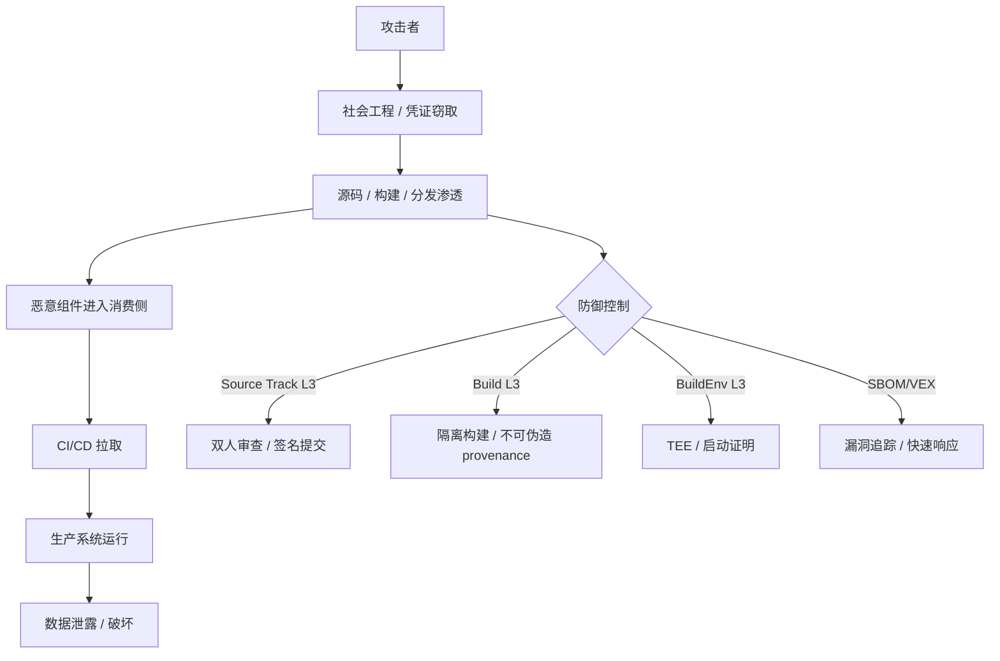

# 软件供应链攻击树（Attack Tree）

> **版本**: 2026-06-06
> **定位**: 供应链安全层——系统化分析软件供应链攻击路径，构建纵深防御的决策基础
> **权威来源**:
>
> - [SLSA Specification v1.0](https://slsa.dev/spec/v1.0/)
> - [OpenSSF](https://openssf.org) Supply Chain Security
> - [NIST SP 800-204D](https://csrc.nist.gov) Microservices Security
> - [OWASP SCVS](https://owasp.org/www-project-software-component-verification-standard/)
> - Sonatype State of the Software Supply Chain 2025/2026

---

## 目录

- [软件供应链攻击树（Attack Tree）](#软件供应链攻击树attack-tree)
  - [目录](#目录)
  - [1. 攻击树方法论](#1-攻击树方法论)
  - [2. 顶层攻击目标](#2-顶层攻击目标)
  - [3. 攻击路径详解](#3-攻击路径详解)
    - [3.1 开发环境渗透](#31-开发环境渗透)
    - [3.2 构建系统篡改](#32-构建系统篡改)
    - [3.3 包管理器投毒](#33-包管理器投毒)
    - [3.4 依赖混淆](#34-依赖混淆)
    - [3.5 上游代码植入](#35-上游代码植入)
    - [3.6 分发渠道劫持](#36-分发渠道劫持)
    - [3.7 运行时加载恶意组件](#37-运行时加载恶意组件)
  - [4. 典型案例映射](#4-典型案例映射)
  - [5. 防御策略矩阵](#5-防御策略矩阵)
    - [5.1 SLSA 防御映射](#51-slsa-防御映射)
  - [6. 检测信号与监控](#6-检测信号与监控)
    - [6.1 早期预警信号](#61-早期预警信号)
    - [6.2 监控架构](#62-监控架构)
  - [7. XZ Utils 后门深度案例与 MITRE ATT\&CK 映射](#7-xz-utils-后门深度案例与-mitre-attck-映射)
    - [7.1 案例时间线与攻击链](#71-案例时间线与攻击链)
    - [7.2 MITRE ATT\&CK 映射](#72-mitre-attck-映射)
    - [7.3 检测信号复盘](#73-检测信号复盘)
  - [8. 反例与缓解措施补强](#8-反例与缓解措施补强)
    - [8.1 常见反例（错误假设）](#81-常见反例错误假设)
    - [8.2 分层缓解措施](#82-分层缓解措施)
    - [8.3 供应链攻击生命周期 Mermaid 图](#83-供应链攻击生命周期-mermaid-图)
    - [8.4 权威来源与交叉引用](#84-权威来源与交叉引用)

---

## 1. 攻击树方法论

攻击树（Attack Tree）由 Bruce Schneier 于 1999 年提出，是一种系统化的安全分析方法：

- **根节点**: 攻击者的终极目标
- **叶节点**: 具体的攻击手段
- **AND 节点**: 必须同时满足多个子条件才能成功
- **OR 节点**: 满足任一子条件即可成功

```text
软件供应链攻击树符号约定
├── OR 节点  [OR]  —— 攻击者只需成功一条路径
├── AND 节点 [AND] —— 攻击者必须同时完成所有子步骤
└── 叶节点          —— 原子级攻击手段
```

---

## 2. 顶层攻击目标

```text
[OR]  compromise_software_supply_chain
├── [OR]  inject_malicious_code_into_final_product
│   ├── [OR]  compromise_development_environment
│   ├── [OR]  compromise_build_system
│   ├── [OR]  compromise_package_manager
│   ├── [OR]  compromise_upstream_source
│   └── [OR]  compromise_distribution_channel
│
├── [OR]  exfiltrate_sensitive_data_via_dependency
│   ├── [OR]  install_data_harvesting_package
│   └── [OR]  exploit_vulnerable_dependency
│
└── [OR]  deny_service_via_supply_chain
    ├── [OR]  introduce_destructive_update
    └── [OR]  trigger_cascading_failure
```

---

## 3. 攻击路径详解

### 3.1 开发环境渗透

```text
[OR] compromise_development_environment
├── [AND] steal_developer_credentials
│   ├── phishing_attack
│   ├── credential_stuffing
│   └── malware_keylogger
│
├── [AND] compromise_IDE_or_editor
│   ├── malicious_extension_plugin
│   ├── supply_chain_of_IDE_itself
│   └── compromised_LSP_server
│
└── [AND] poison_local_toolchain
    ├── tampered_compiler
    ├── malicious_linter_formatter
    └── compromised_debugger
```

**检测信号**:

- 开发者账户异常登录（地理位置、时间）
- IDE 插件请求过多权限
- 编译输出哈希与预期不符

---

### 3.2 构建系统篡改

```text
[OR] compromise_build_system
├── [AND] inject_malicious_build_step
│   ├── compromised_CI_CD_pipeline
│   ├── malicious_build_script
│   └── tampered_container_image
│
├── [AND] bypass_build_verification
│   ├── forge_build_provenance
│   ├── replay_old_valid_signature
│   └── exploit_RCE_in_build_tool
│
└── [AND] compromise_build_artifacts
    ├── replace_binary_after_build
    ├── inject_post_build_hook
    └── manipulate_artifact_repository
```

**典型案例**: SolarWinds Orion (2020)

- 攻击路径:  compromise CI/CD → inject backdoor during build → signed as legitimate
- 影响范围:  18,000+ 组织，包括美国政府机构
- 驻留时间:  9+ 个月未被发现

---

### 3.3 包管理器投毒

```text
[OR] compromise_package_manager
├── [OR] publish_malicious_package
│   ├── typosquatting ( popular_package → popu1ar_package )
│   ├── brandjacking ( claim_unclaimed_namespace )
│   └── dependency_confusion ( internal_package_name → public_registry )
│
├── [AND] compromise_existing_package
│   ├── steal_maintainer_credentials
│   ├── social_engineering_takeover
│   └── buy_abandoned_package
│
└── [AND] manipulate_registry_metadata
    ├── alter_download_statistics
    ├── fake_positive_reviews
    └── suppress_security_advisories
```

**典型案例**: PyTorch malicious dependency (2022)

- 攻击路径:  typosquatting `torchtriton` → exfiltrate env variables → upload to external server
- 影响范围:  PyPI 下载量在窗口期内激增

---

### 3.4 依赖混淆

```text
[OR] dependency_confusion_attack
├── [AND] identify_internal_package_names
│   ├── scan_public_repositories
│   ├── analyze_error_messages
│   └── social_engineering
│
└── [AND] publish_higher_version_to_public_registry
    ├── version_number_inflation ( 9999.0.0 )
    └── pre_release_manipulation ( 1.0.0-rc999 )
```

**典型案例**: Dependency Confusion by Alex Birsan (2021)

- 攻击路径:  discover internal package names → publish to public npm/PyPI → auto-pulled by CI/CD
- 影响范围:  35+ 科技公司（Apple, Microsoft, Tesla, Uber 等）
- 赏金收入:  $130,000+ bug bounties

**防御策略**:

- 使用私有注册表的命名空间隔离（如 `@company/package`）
- 显式指定注册源，禁止回退到公共注册表
- 实施包的哈希锁定（lockfile integrity checks）

---

### 3.5 上游代码植入

```text
[OR] compromise_upstream_source
├── [AND] submit_malicious_contribution
│   ├── benign_looking_PR_with_hidden_backdoor
│   ├── exploit_trust_in_maintainer
│   └── compromise_contributor_account
│
├── [AND] manipulate_source_repository
│   ├── force_push_to_rewrite_history
│   ├── compromise_Git_hosting_service
│   └── exploit_Git_vulnerability
│
└── [AND] subvert_code_review
    ├── reviewer_fatigue_attack (many trivial changes + one malicious)
    ├── compromised_reviewer_account
    └── exploit_race_condition_in_merge
```

**典型案例**: XZ Utils backdoor (2024)

- 攻击路径:  social engineering → gain maintainer trust → inject backdoor in test files → activate via glibc hook
- 驻留时间:  3+ 年 social engineering + 数月 code presence
- 发现者:  Andres Freund (Microsoft PostgreSQL developer)，通过性能异常发现

---

### 3.6 分发渠道劫持

```text
[OR] compromise_distribution_channel
├── [AND] DNS_hijacking
│   ├── compromise_DNS_registrar
│   ├── BGP_hijacking
│   └── poison_DNS_resolver
│
├── [AND] MITM_on_download
│   ├── compromise_CDN_edge_node
│   ├── rogue_WiFi_hotspot
│   └── compromise_certificate_authority
│
└── [AND] mirror_tampering
    ├── compromise_official_mirror
    ├── setup_rogue_mirror
    └── exploit_mirror_sync_lag
```

---

### 3.7 运行时加载恶意组件

```text
[OR] runtime_malicious_component_loading
├── [AND] dynamic_dependency_resolution
│   ├── runtime_download_without_verification
│   └── plugin_system_without_sandbox
│
├── [AND] supply_chain_of_runtime_itself
│   ├── compromised_JVM_runtime
│   ├── tampered_Node.js_binary
│   └── malicious_Python_interpreter
│
└── [AND] dependency_confusion_at_runtime
    └── dynamic_version_resolution_ambiguity
```

---

## 4. 典型案例映射

| 案例 | 时间 | 攻击路径 | 影响 | 发现方式 |
|------|------|---------|------|---------|
| **SolarWinds Orion** | 2020 | 构建系统篡改 (3.2) | 18,000+ 组织 | FireEye 内部安全调查 |
| **Codecov Bash Uploader** | 2021 | 分发渠道劫持 (3.6) | 29,000+ 组织 | 客户报告凭证泄露 |
| **Dependency Confusion** | 2021 | 包管理器投毒 (3.4) | 35+ 科技公司 | 研究者主动披露 |
| **Log4j/Log4Shell** | 2021 | 上游代码缺陷 (非恶意) | 全球 Java 应用 | 阿里云安全团队 |
| **PyTorch 恶意依赖** | 2022 | 包管理器投毒 (3.3) | PyPI 窗口期用户 | PyTorch 团队监控 |
| **3CX Desktop App** | 2023 | 上游代码植入 (3.5) | 600,000+ 企业用户 | 客户发现异常网络流量 |
| **XZ Utils Backdoor** | 2024 | 上游代码植入 (3.5) | 几乎渗透所有 Linux 发行版 | 性能异常分析 |

---

## 5. 防御策略矩阵

| 攻击路径 | SLSA 等级 | 技术控制 | 流程控制 | 检测机制 |
|---------|----------|---------|---------|---------|
| **3.1 开发环境渗透** | L1 | MFA、硬件密钥、开发者沙箱 | 最小权限原则、定期轮换 | UEBA、异常登录检测 |
| **3.2 构建系统篡改** | L2-L3 | Hermetic Build、隔离构建环境 | CI/CD 审批流程、双人复核 | 构建产物哈希对比 |
| **3.3 包管理器投毒** | L1-L2 | 私有注册表、命名空间隔离 | 包发布 MFA、维护者背景审查 | 包名相似度监控 |
| **3.4 依赖混淆** | L2 | 显式注册源、作用域包 | 内部包命名规范 | 依赖解析日志审计 |
| **3.5 上游代码植入** | L3-L4 | 代码签名、提交签名（GPG/SSH） | 多维护者审批、安全审查 | 代码差异异常检测 |
| **3.6 分发渠道劫持** | L3-L4 | HTTPS + 证书固定、CDN 安全 | DNSSEC、多源验证 | 下载哈希监控 |
| **3.7 运行时加载** | L3 | 运行时完整性校验、沙箱 | 禁止运行时下载 | 异常网络流量检测 |

### 5.1 SLSA 防御映射

```text
SLSA 等级与攻击路径覆盖
├── SLSA L1 (Provenance)
│   └── 防御: 3.2 部分、3.6 部分
│
├── SLSA L2 (Hosted Build)
│   └── 防御: 3.1 部分、3.2 大部分、3.3 部分
│
├── SLSA L3 (Hermetic / Reproducible)
│   └── 防御: 3.2 全面、3.5 大部分、3.6 大部分
│
└── SLSA L4 (Two-Person Review)
    └── 防御: 3.5 全面、3.1 全面、所有路径增强
```

---

## 6. 检测信号与监控

### 6.1 早期预警信号

| 信号 | 严重度 | 说明 |
|------|--------|------|
| **新包名与内部包高度相似** | 🔴 高 | 可能的 typosquatting 或依赖混淆 |
| **包版本号异常跳升** | 🔴 高 | 如从 1.2.3 跳到 999.0.0 |
| **维护者账户异地登录** | 🔴 高 | 可能的凭证泄露 |
| **构建产物哈希突变** | 🔴 高 | 源代码相同但输出不同 |
| **依赖树深度异常增加** | 🟡 中 | 可能的传递依赖投毒 |
| **包下载量异常激增** | 🟡 中 | 可能的自动化攻击 |
| **代码审查绕过事件** | 🟡 中 | 强制推送、管理员覆盖 |
| **已知漏洞利用尝试** | 🟡 中 | 扫描日志中的 exploit payload |

### 6.2 监控架构

```text
供应链安全监控体系
├── 源代码层
│   ├── 提交签名验证 (GPG/SSH)
│   ├── 代码差异异常检测 (ML-based)
│   └── 秘密扫描 (API keys, tokens)
│
├── 构建层
│   ├── 构建环境完整性校验
│   ├── 构建产物 reproducibility 测试
│   └── Provenance 签名验证 (Sigstore/cosign)
│
├── 依赖层
│   ├── SBOM 生成与校验 (SPDX/CycloneDX)
│   ├── 漏洞扫描 (OSV, Snyk, Dependabot)
│   └── 许可证合规检查 (FOSSA, Black Duck)
│
├── 分发层
│   ├── 包哈希监控
│   ├── 注册表异常行为检测
│   └── CDN 完整性校验
│
└── 运行时层
    ├── 异常网络流量检测
    ├── 进程行为基线 (eBPF)
    └── 文件系统完整性监控 (FIM)
```

---

## 7. XZ Utils 后门深度案例与 MITRE ATT&CK 映射

### 7.1 案例时间线与攻击链

XZ Utils 后门（CVE-2024-3094）是近年来最复杂的上游代码植入案例之一。攻击者 `Jia Tan` 通过数年社会工程学获得项目维护权限，最终在 `xz-utils` 5.6.0/5.6.1 的测试文件中植入后门，利用 `glibc` 的 `IFUNC` 机制在 SSH 守护进程加载 `liblzma` 时劫持 RSA 验证。

| 阶段 | 时间 | 关键动作 |
|------|------|---------|
| 潜伏 | 2021–2023 | 通过邮件列表贡献有效补丁，建立维护者信任 |
| 渗透 | 2023–2024 | 获得 commit 权限，开始修改测试文件与构建脚本 |
| 植入 | 2024-02 | 在 `tests/files/bad-3-corrupt.lzma` 等文件中隐藏恶意二进制 |
| 激活 | 2024-03 | 后门通过 `glibc IFUNC` 在特定条件下劫持 `RSA_public_decrypt` |
| 发现 | 2024-03-29 | Andres Freund 观察到 SSH 进程异常 CPU 占用，公开披露 |

### 7.2 MITRE ATT&CK 映射

将 XZ Utils 案例映射到 MITRE ATT&CK for Supply Chain（含 ICS/Enterprise）有助于统一威胁情报与防御设计。

| 攻击路径 | MITRE ATT&CK 技术 ID | 技术名称 |
|---------|---------------------|---------|
| 社会工程学获取维护者权限 | T1189 / T1566 | Drive-by Compromise / Phishing |
| 在源码中植入混淆后门 | T1195.001 | Supply Chain Compromise: Software Supply Chain |
| 修改构建/测试脚本以隐藏载荷 | T1547 | Boot or Logon Autostart Execution（IFUNC 劫持） |
| 利用 glibc IFUNC 实现运行时 Hook | T1574.001 | DLL Search Order Hijacking（类同机制） |
| 通过受信任发行版分发 | T1195.002 | Supply Chain Compromise: Compromise Software Dependencies and Development Tools |
| 后门通信隐蔽化 | T1071 | Application Layer Protocol |

> **映射关系说明**：MITRE ATT&CK 将供应链攻击归类于 **Initial Access (TA0001)** 与 **Defense Evasion (TA0005)**。本攻击树中的"上游代码植入"路径主要映射 T1195 系列技术。

### 7.3 检测信号复盘

- **性能异常**：SSH 登录时 CPU 占用显著升高（Andres Freund 发现线索）。
- **构建脚本异常**：`m4` 宏或测试文件大小、熵值异常。
- **提交行为异常**：节假日提交、非维护者常规时区提交。
- **依赖扩散**：后门仅影响特定发行版预发布包，可通过 SBOM 快速追踪。

## 8. 反例与缓解措施补强

### 8.1 常见反例（错误假设）

| 反例 | 错误假设 | 实际风险 |
|------|---------|---------|
| "我们只使用官方源，所以安全" | 官方源 = 可信 | XZ Utils 即来自官方 tarball 与 GitHub release |
| "有 SLSA Build L2 就够了" | Build L2 可防御所有攻击 | Build L2 不保证 Source Track，无法防止上游代码植入 |
| "依赖扫描每天跑一次即可" | 日扫描足够 | 主动利用漏洞需在 24 小时内响应（EU CRA） |
| "开源组件责任由社区承担" | 开源 = 免责 | 商业集成商承担 CRA 义务（参见 eu-cra-compliance.md §6） |

### 8.2 分层缓解措施

| 攻击树路径 | 缓解控制 | 验证指标 |
|-----------|---------|---------|
| 3.1 开发环境渗透 | MFA + 硬件密钥 + 开发者沙箱 | 100% 开发者启用 MFA，异常登录告警 |
| 3.2 构建系统篡改 | SLSA Build L3 + 隔离构建 | 所有产物附带 provenance，slsa-verifier 100% 通过 |
| 3.3 包管理器投毒 | 私有代理 + 命名空间隔离 | 无公共注册表直接依赖 |
| 3.4 依赖混淆 | lockfile 哈希 + 显式注册源 | CI 构建失败时无未命中依赖 |
| 3.5 上游代码植入 | Source Track L3 + 代码差异异常检测 | 主分支 100% PR，≥2 审批 |
| 3.6 分发渠道劫持 | HTTPS + 签名 + CDN 完整性 | 下载哈希与发布页一致 |
| 3.7 运行时加载 | 运行时完整性校验 + 沙箱 | 禁止未签名运行时下载 |

### 8.3 供应链攻击生命周期 Mermaid 图



### 8.4 权威来源与交叉引用

- MITRE ATT&CK for Supply Chain: <https://attack.mitre.org/techniques/T1195/>
- CISA Alert AA24-102A (XZ Utils): <https://www.cisa.gov/news-events/alerts/2024/03/29/reported-supply-chain-compromise-affecting-xz-utils-data-compression-library-cve-2024-3094>
- NIST SP 800-204D: <https://csrc.nist.gov/publications/detail/sp/800-204d/final>
- OpenSSF Supply Chain Security: <https://openssf.org/supply-chain/>
- SLSA Specification: <https://slsa.dev/spec/v1.2/>
- 相关概念: [Supply chain attack](https://en.wikipedia.org/wiki/Supply_chain_attack)
- **交叉引用**: `struct/10-supply-chain-security/03-attack-vectors/attack-tree-mitre-mapping.md`；`struct/10-supply-chain-security/01-slsa-framework/slsa-1-2-multi-track.md` §2.2；`struct/10-supply-chain-security/05-zero-trust-supply-chain/zero-trust-principles.md`

> **对齐验证**:
>
> - 攻击树结构对照 Schneier (1999) Attack Trees 方法论验证
> - SLSA 映射对照 [slsa.dev](https://slsa.dev) v1.2 官方规范验证
> - MITRE ATT&CK 映射对照 <https://attack.mitre.org> 验证
> - 案例对照 OpenSSF、NIST、CISA 官方公告验证
>
> 最后更新: 2026-07-07
