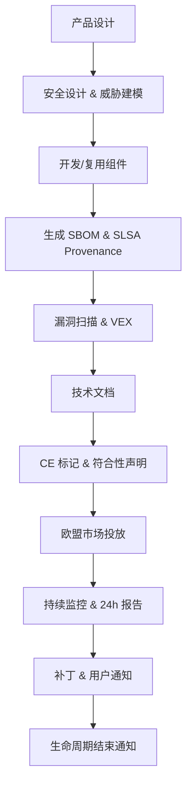

# 欧盟网络弹性法案 (EU CRA) 合规指南

> **版本**: 2026-06-06
> **权威来源**: Regulation (EU) 2024/2847, European Commission
> **定位**: 解读 EU CRA 对软件供应链复用的影响与合规路径

---

## 1. CRA 基本信息

| 项目 | 内容 |
|------|------|
| **法规编号** | Regulation (EU) 2024/2847 |
| **生效日期** | 2024-12-30 |
| **漏洞报告义务** | **2026-09-11** 起 |
| **主要义务全面适用** | **2027-12-11** 起 |
| **适用范围** | 在欧盟市场销售的所有含数字元素的产品 |

---

## 2. 适用范围

### 涵盖产品

- 软件产品（商业分发）
- 带数字元素的硬件产品
- 云服务 / SaaS
- 物联网 (IoT) 设备
- 工业自动化系统
- 关键基础设施组件

### 豁免

- 免费开源软件（有商业活动条件的除外）
- 仅供内部使用的软件
- 研发原型
- 已受其他 EU 法规监管的医疗器械

---

## 3. 制造商四大义务

```text
EU CRA Obligations
├── 1. 安全设计与默认 (Security by Design and Default)
│   ├── 最小化攻击面
│   ├── 默认安全配置
│   ├── 无默认凭证
│   └── 威胁建模和安全编码
│
├── 2. 漏洞管理 (Vulnerability Management)
│   ├── 持续监控漏洞
│   ├── 及时修复和补丁
│   ├── 生命周期结束通知
│   └── 协调披露
│
├── 3. 事件检测与响应 (Incident Detection & Response)
│   ├── 检测影响保密性/完整性/可用性的事件
│   ├── 记录升级和响应计划
│   └── 保留证据
│
└── 4. 软件透明度 (Software Transparency)
    ├── 维护 SBOM
    ├── 技术文档
    └── CE 标记
```

---

## 4. SBOM 具体要求

### 必须包含的信息

| 字段 | 说明 |
|------|------|
| 组件名称 | 所有软件组件 |
| 版本信息 | 精确版本号 |
| 供应商/来源 | 组件制造商 |
| 许可证详情 | 许可证类型 |
| 已知漏洞 | 持续更新 |
| 依赖关系 | 包括传递依赖 |

### 格式要求

- **机器可读格式**（SPDX 或 CycloneDX）
- 随软件修改更新
- 应市场监管机构要求提供
- 纳入技术文档

---

## 5. 漏洞报告时间线

| 事件 | 时间要求 | 报告对象 |
|------|---------|---------|
| 主动利用的漏洞 | **24 小时内** | CSIRT 或 ENISA |
| 其他未修复漏洞 | 无具体天数，但需"及时" | 按程序 |
| 补丁发布 | 合理时间内 | 用户/客户 |

> 关键日期: **2026-09-11** 起，制造商必须开始报告主动利用的漏洞。

---

## 6. 开源软件特殊规定

### 开源豁免

非商业活动的开源软件通常豁免 CRA 义务。

### 商业使用触发义务

当开源软件被集成到商业产品或服务时：

- 集成商承担漏洞处理义务
- 集成商承担更新和文档义务
- 开源管家（Stewards）可能有披露义务

---

## 7. 对架构复用的影响

> **定理 CRA.1** (Component Liability Transfer): CRA 将产品安全责任从最终用户转移到制造商。这意味着**复用第三方组件并不会转移安全责任**，最终产品制造商仍需对所有集成组件负责。

> **定理 CRA.2** (SBOM as Reuse Contract): 在 CRA 背景下，SBOM 不仅是技术文档，更是复用资产的**法律契约**。缺少 SBOM 的组件将面临市场准入障碍。

### 复用策略调整

1. **优先选择提供 SBOM 的组件**
2. **要求关键供应商提供 SLSA provenance**
3. **建立组件漏洞监控流程**
4. **准备 VEX 声明**
5. **评估供应商的 CRA 合规能力**

---

## 8. 合规检查表

- [ ] 识别所有在 EU 市场销售的产品
- [ ] 为每个产品生成并维护 SBOM
- [ ] 建立漏洞管理流程
- [ ] 建立 24 小时漏洞报告机制
- [ ] 实施安全设计和默认配置
- [ ] 准备 CE 标记所需的技术文档
- [ ] 评估第三方组件的 CRA 合规性
- [ ] 建立产品生命周期结束通知流程

## 9. EU CRA 合规义务清单、SBOM/漏洞管理/CE 标记实施步骤与反例

### 9.1 定义：CRA 合规义务

EU CRA 将"含数字元素的产品"（Products with Digital Elements, PDE）制造商定义为承担网络安全全生命周期责任的主体。复用第三方组件**不会**转移该责任；制造商必须对集成组件的安全状态负责。

> **定义 CRA.Comp.1** (PDE Manufacturer Obligation): 任何在欧盟市场投放 PDE 的制造商，必须实施安全设计、漏洞管理、事件响应与软件透明度四组义务，无论其自行开发或复用第三方组件。

### 9.2 义务清单矩阵

| 义务组 | 具体义务 | 适用对象 | 关键日期 | 违规风险 |
|--------|---------|---------|---------|---------|
| 安全设计与默认 | 最小攻击面、安全默认配置、无默认凭证 | 所有 PDE 制造商 | 2027-12-11 | 市场禁入、罚款 |
| 漏洞管理 | 识别、跟踪、修复漏洞；生命周期结束通知 | 所有 PDE 制造商 | 2026-09-11（报告义务） | 监管处罚 |
| 事件检测与响应 | 检测影响 CIA 的事件；24h 报告主动利用漏洞 | 所有 PDE 制造商 | 2026-09-11 | 罚款、声誉损失 |
| 软件透明度 | 维护 SBOM；提供技术文档；加贴 CE 标记 | 所有 PDE 制造商 | 2027-12-11 | 无法上市 |
| 开源 steward 义务 | 协调披露、维护漏洞政策（特定 steward） | 开源基金会 / 大型开源项目 | 2026-09-11 | 监管关注 |

### 9.3 SBOM 实施步骤

| 步骤 | 行动 | 输出物 | 工具示例 |
|------|------|--------|---------|
| 1. 工具选型 | 选择 SPDX/CycloneDX 生成工具 | 工具链决策记录 | Syft, Trivy, CycloneDX CLI |
| 2. CI/CD 集成 | 每次构建自动生成 SBOM | `sbom.spdx.json` / `bom.json` | GitHub Actions / GitLab CI |
| 3. 完整性校验 | 为 SBOM 附加哈希与签名 | 签名 SBOM | cosign |
| 4. 漏洞关联 | 将 SBOM 与 CVE/OSV 数据库关联 | 漏洞清单 | Grype, Snyk, OSV-Scanner |
| 5. VEX 生成 | 对不可利用 CVE 发布 VEX | `vex.json` | CycloneDX VEX, CSAF |
| 6. 归档交付 | 将 SBOM 纳入技术文档 | 技术文档包 | DOORS, Confluence, 文档仓库 |

### 9.4 漏洞管理实施步骤

| 步骤 | 行动 | 时间要求 |
|------|------|---------|
| 1. 持续监控 | 订阅 CVE/OSV/供应商安全通告 | 实时 |
| 2. 影响评估 | 根据 SBOM 判断受影响产品 | 48 小时内 |
| 3. 修复计划 | 制定补丁或缓解方案 | 合理时间内 |
| 4. 主动利用报告 | 向 CSIRT/ENISA 报告 | 24 小时内 |
| 5. 用户通知 | 向客户发布安全公告与补丁 | 补丁可用时 |
| 6. 生命周期结束通知 | 提前通知产品支持终止 | EOL 前至少 6 个月 |

### 9.5 CE 标记实施步骤

1. **符合性评估**：依据 CRA 附件 I（网络安全要求）与附件 II（漏洞处理要求）进行内部评估或第三方认证（高风险产品）。
2. **技术文档**：包含 SBOM、威胁模型、测试报告、漏洞管理流程、事件响应计划。
3. **欧盟代表**：非欧盟制造商需指定欧盟授权代表。
4. **加贴 CE 标记**：在产品或包装上清晰加贴 CE 标记并附带符合性声明（DoC）。
5. **市场监督**：保留技术文档至少 10 年，配合市场监管机构检查。

### 9.6 正例

| 实践 | 效果 |
|------|------|
| 在 CI/CD 中自动生成 CycloneDX SBOM 并签名 | 满足 CRA 软件透明度要求，构建可验证 |
| 建立 24 小时漏洞报告 SOP 并演练 | 满足主动利用漏洞报告义务 |
| 对关键组件要求 SLSA Build L3 + Source L2 provenance | 降低第三方组件引入后门风险 |
| 产品 EOL 前 12 个月通知客户 | 满足生命周期结束通知义务 |

### 9.7 反例

| 反例 | 后果 |
|------|------|
| 认为"我们是 SaaS，不需要 CE 标记" | 远程数据处理软件属于 PDE，仍需合规 |
| SBOM 缺失传递依赖或哈希 | 漏洞定位不完整，审计失败 |
| 将开源组件豁免误解为完全免责 | 商业集成仍需承担漏洞处理义务 |
| 24 小时报告流程未演练 | 真实事件时无法及时上报 |
| 技术文档以英文-only 存档 | 欧盟市场监管机构可能要求成员国语言版本 |

### 9.8 CRA 合规流程 Mermaid 图



### 9.9 权威来源与交叉引用

- Regulation (EU) 2024/2847 (Cyber Resilience Act): <https://eur-lex.europa.eu/legal-content/EN/TXT/?uri=CELEX:32024R2847>
- European Commission — Cyber Resilience Act: <https://digital-strategy.ec.europa.eu/en/policies/cyber-resilience-act>
- ENISA — Cyber Resilience Act: <https://www.enisa.europa.eu/topics/cyber-resilience-act>
- CEN/CENELEC standards for CRA: <https://www.cencenelec.eu/>
- 相关概念: [Cyber Resilience Act](https://en.wikipedia.org/wiki/Cyber_Resilience_Act)
- **交叉引用**: `struct/10-supply-chain-security/02-sbom-standards/sbom-comparison.md` §7；`struct/10-supply-chain-security/01-slsa-framework/slsa-1-2-multi-track.md` §3.1；`struct/10-supply-chain-security/06-case-studies/eu-cra-checklist.md`

---

> 最后更新: 2026-07-07
> 权威来源: <https://digital-strategy.ec.europa.eu/en/policies/cyber-resilience-act>
