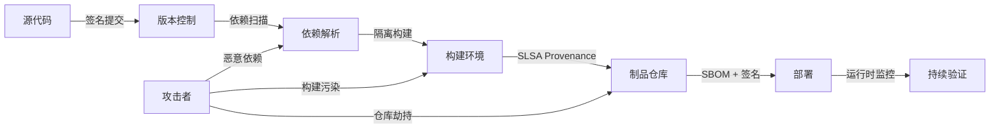

# 10 供应链安全工程

> **定位**：组件复用的关键风险领域。2026 年，软件供应链攻击已成为组织面临的最严峻安全威胁之一；本主题建立从源代码到部署的全链路信任机制。

---

## 1. 概念定义

**软件供应链安全** 关注在软件生命周期的源代码、依赖、构建、分发与部署各环节中，复用资产不被篡改、不引入已知漏洞、不违反许可证要求的能力。

| 机制 | 定义 | 作用 |
|------|------|------|
| **SLSA** | Supply-chain Levels for Software Artifacts，OpenSSF 提出的安全等级框架 | 定义 Source / Build / Provenance / Common 等 Track 的可验证等级 |
| **SBOM** | Software Bill of Materials | 以 SPDX / CycloneDX / SWID 枚举组件、版本、许可证与来源 |
| **Provenance** | 来源证明 | 记录谁、何时、如何构建出软件制品 |
| **Sigstore/cosign** | 签名与透明日志 | 验证构建产物与镜像的真实性 |
| **GUAC** | Graph for Understanding Artifact Composition | 将 SBOM、SLSA、漏洞数据关联为知识图谱 |

**信任传递崩塌**：软件供应链中的信任是传递的，但链越长、单段信任度越低，整体信任度呈指数衰减。

---

## 2. 供应链安全防御链路图

---

## 3. 正向示例

### 示例 1：SLSA L3 构建流程
某组织采用 GitHub Actions 隔离构建环境、Sigstore/cosign 签名容器镜像，并生成 SPDX SBOM；当 Log4j 类漏洞爆发时，2 小时内定位所有受影响服务并完成升级。

### 示例 2：SBOM 驱动的许可证治理
在 CI 中为每个服务生成 CycloneDX SBOM，与许可证数据库匹配后自动标记 GPL 传染性风险；法务团队在发布前即可干预，避免合规诉讼。

### 示例 3：零信任供应链架构
企业通过“源码签名 → 隔离构建 → 来源证明 → 部署准入”五层防御，将构建代理被入侵后的影响限制在单一构建实例，无法污染生产制品。

### 示例 4：GUAC 风险图谱
组织将 SBOM、SLSA 证明与漏洞公告导入 GUAC，形成 artifact 关系图；当某开源库披露高危漏洞时，可秒级查询所有直接和间接依赖该库的服务。

---

## 4. 反例 / 失败案例

### 反例 1：XZ Utils 后门
攻击者通过长期社会工程获得 XZ Utils 维护权限，在压缩库中植入后门；由于下游大量系统未验证来源与行为，恶意代码随复用传播数年。

### 反例 2：Log4j 应急响应迟缓
许多组织因缺乏完整 SBOM，无法快速判断哪些服务使用了 Log4j；漏洞响应从小时级延长到数周，暴露面持续扩大。

### 反例 3：Typosquat 包
攻击者在 npm 注册与 PyPI 上发布拼写错误的热门包名，诱导开发者安装并窃取环境变量；未启用私有仓库与依赖扫描的组织大量中招。

### 反例 4：CI/CD 凭证泄露
安全团队仅扫描自有代码漏洞，忽视 CI/CD 凭证与第三方构建代理安全；攻击者通过被入侵的构建代理向后端服务注入后门。

---

## 5. 纵深防御矩阵

| 层次 | 控制措施 | 对应标准/工具 |
|------|----------|---------------|
| 源码 | 签名提交、分支保护、代码审查 | Git, Gitsign |
| 依赖 | 漏洞扫描、私有仓库、typosquat 检测 | OSV, Dependabot, Snyk |
| 构建 | 隔离构建、可复现构建、来源证明 | SLSA, Sigstore |
| 制品 | 签名、SBOM、许可证扫描 | cosign, Syft, FOSSA |
| 部署 | 准入控制、运行时监控 | OPA, Falco |

---

## 6. 关键公理

> **公理 S.10**（Trust Transitivity Collapse）：软件供应链中的信任是传递的，但传递链的长度与信任度成指数反比。依赖层级越深，越需要可验证的来源与持续监控。

---

## 7. 权威来源

> **权威来源**：
>
> - [SLSA Framework](https://slsa.dev) — OpenSSF
> - [OpenSSF](https://openssf.org)
> - [Sigstore](https://www.sigstore.dev) — Linux Foundation
> - [SPDX Specification](https://spdx.dev/use/specifications/)
> - [CycloneDX Specification](https://cyclonedx.org/specification/overview/)
> - [NIST SSDF](https://csrc.nist.gov/projects/ssdf)
> - [OWASP SCVS](https://owasp.org/www-project-software-component-verification-standard/)
> - [MITRE ATT&CK - Supply Chain Compromise](https://attack.mitre.org/techniques/T1195/)
> - 核查日期：2026-07-07

---

## 8. 当前状态与关联主题

- [x] SLSA 1.0 / 1.2 深度解析 (`01-slsa-framework/`)
- [x] SBOM 标准对比 (`02-sbom-standards/`)
- [x] 供应链攻击树与 MITRE 映射 (`03-attack-vectors/`)
- [x] 零信任供应链模板 (`05-zero-trust-supply-chain/`)
- [x] EU CRA 合规检查清单 (`06-case-studies/`)

关联主题：

- `04-component-architecture-reuse`（依赖治理）
- `07-formal-verification`（Rust 安全形式化）
- `12-ai-native-reuse`（LLM / MCP 安全）
