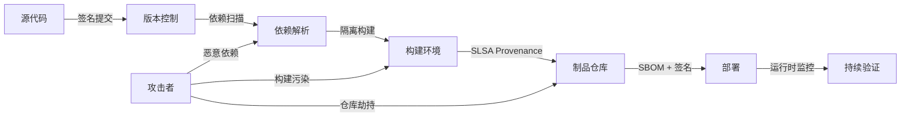

# 10 供应链安全工程

> **定位**：组件复用的关键风险领域。2026 年，软件供应链攻击已成为组织面临的最严峻安全威胁之一；本主题建立从源代码到部署的全链路信任机制。

---

## 1. 概念定义

**软件供应链安全** 关注在软件生命周期的源代码、依赖、构建、分发与部署各环节中，复用资产不被篡改、不引入已知漏洞、不违反许可证要求的能力。

| 机制 | 定义 | 作用 |
|------|------|------|
| **SLSA** | Supply-chain Levels for Software Artifacts，OpenSSF 提出的安全等级框架 | 定义 Source / Build / Provenance / Common 等 Track 的可验证等级 |
| **SBOM** | Software Bill of Materials | 以 SPDX / CycloneDX / SWID 枚举组件、版本、许可证与来源 |
| **Provenance** | 来源证明 | 记录谁、何时、如何构建出软件制品 |
| **Sigstore/cosign** | 签名与透明日志 | 验证构建产物与镜像的真实性 |
| **GUAC** | Graph for Understanding Artifact Composition | 将 SBOM、SLSA、漏洞数据关联为知识图谱 |

**信任传递崩塌**：软件供应链中的信任是传递的，但链越长、单段信任度越低，整体信任度呈指数衰减。

---

## 2. 供应链安全防御链路图

---

## 3. 正向示例

### 示例 1：SLSA L3 构建流程

某组织采用 GitHub Actions 隔离构建环境、Sigstore/cosign 签名容器镜像，并生成 SPDX SBOM；当 Log4j 类漏洞爆发时，2 小时内定位所有受影响服务并完成升级。

### 示例 2：SBOM 驱动的许可证治理

在 CI 中为每个服务生成 CycloneDX SBOM，与许可证数据库匹配后自动标记 GPL 传染性风险；法务团队在发布前即可干预，避免合规诉讼。

### 示例 3：零信任供应链架构

企业通过“源码签名 → 隔离构建 → 来源证明 → 部署准入”五层防御，将构建代理被入侵后的影响限制在单一构建实例，无法污染生产制品。

### 示例 4：GUAC 风险图谱

组织将 SBOM、SLSA 证明与漏洞公告导入 GUAC，形成 artifact 关系图；当某开源库披露高危漏洞时，可秒级查询所有直接和间接依赖该库的服务。

### 示例 5：GitHub Artifact Attestations 规模化落地

2024 年起 GitHub Actions 原生支持 `actions/attest-build-provenance`，为任意构建产物生成符合 SLSA v1.0 Build L2 的证明；结合可复用工作流可达 Build L3。npm Trusted Publishing 与 PyPI attestations（PEP 740）已使主流生态默认携带 provenance，显著降低开源消费者验证成本。

---

## 4. 反例 / 失败案例

### 反例 1：XZ Utils 后门

攻击者通过长期社会工程获得 XZ Utils 维护权限，在压缩库中植入后门；由于下游大量系统未验证来源与行为，恶意代码随复用传播数年。

### 反例 2：Log4j 应急响应迟缓

许多组织因缺乏完整 SBOM，无法快速判断哪些服务使用了 Log4j；漏洞响应从小时级延长到数周，暴露面持续扩大。

### 反例 3：Typosquat 包

攻击者在 npm 注册与 PyPI 上发布拼写错误的热门包名，诱导开发者安装并窃取环境变量；未启用私有仓库与依赖扫描的组织大量中招。

### 反例 4：CI/CD 凭证泄露

安全团队仅扫描自有代码漏洞，忽视 CI/CD 凭证与第三方构建代理安全；攻击者通过被入侵的构建代理向后端服务注入后门。

### 反例 5：Codecov Bash Uploader 供应链攻击（2021）

2021 年 1 月 31 日至 4 月 1 日，攻击者通过 Codecov Docker 镜像构建过程中的凭证泄露，修改其 Bash Uploader 脚本，在客户 CI 环境中窃取环境变量、源码仓库地址及大量密钥。约 29,000 个组织受影响，包括 HashiCorp、Twilio、Monday.com 等。该事件暴露出“curl | bash”执行未签名脚本、缺乏脚本完整性校验的严重风险（CVE-2021-32638）。

### 反例 6：SolarWinds Orion SUNBURST 攻击（2020）

攻击者入侵 SolarWinds 构建环境，在 Orion 更新包中植入 SUNBURST 后门。由于更新经过合法数字签名，约 18,000 家客户默认信任并安装。CISA 紧急指令 21-01 要求联邦机构立即断开受影响系统。该事件证明：仅验证发布者签名不足以保证构建过程未被污染，必须结合来源证明与构建环境隔离。

---

## 5. 纵深防御矩阵

| 层次 | 控制措施 | 对应标准/工具 |
|------|----------|---------------|
| 源码 | 签名提交、分支保护、代码审查 | Git, Gitsign |
| 依赖 | 漏洞扫描、私有仓库、typosquat 检测 | OSV, Dependabot, Snyk |
| 构建 | 隔离构建、可复现构建、来源证明 | SLSA, Sigstore |
| 制品 | 签名、SBOM、许可证扫描 | cosign, Syft, FOSSA |
| 部署 | 准入控制、运行时监控 | OPA, Falco |

---

## 6. 关键公理

> **公理 S.10**（Trust Transitivity Collapse）：软件供应链中的信任是传递的，但传递链的长度与信任度成指数反比。依赖层级越深，越需要可验证的来源与持续监控。

---

## 7. 权威来源

| 标准/规范 | URL | 说明 | 核查日期 |
|-----------|-----|------|----------|
| SLSA Specification v1.2 | <https://slsa.dev/spec/v1.2/> | Multi-Track 架构，Build/Source/BuildEnv Track 正式定义 | 2026-07-08 |
| OpenSSF Scorecard | <https://scorecard.dev/> | 开源项目安全健康度自动化评分 | 2026-07-08 |
| Sigstore / cosign | <https://docs.sigstore.dev/cosign/overview/> | 无密钥签名、Fulcio、Rekor 透明日志 | 2026-07-08 |
| SPDX Specification v2.3 / v3.0.1 | <https://spdx.github.io/spdx-spec/v2.3/> | ISO/IEC 5962 SBOM 标准 | 2026-07-08 |
| CycloneDX Specification v1.6 | <https://cyclonedx.org/specification/overview/> | OWASP/ECMA-424 供应链安全 SBOM 标准 | 2026-07-08 |
| NIST SP 800-161 Rev. 1 | <https://csrc.nist.gov/pubs/sp/800/161/r1/final> | 网络安全供应链风险管理实践 | 2026-07-08 |
| NIST SP 800-218 (SSDF) | <https://csrc.nist.gov/pubs/sp/800/218/final> | 安全软件开发框架 | 2026-07-08 |
| OWASP SCVS | <https://owasp.org/www-project-software-component-verification-standard/> | 软件组件验证标准 | 2026-07-08 |
| OpenSSF OSPS Baseline v2026.02.19 | <https://baseline.openssf.org/versions/2026-02-19.html> | 开源项目安全基线 | 2026-07-08 |
| EU CRA 2024/2847 | <https://eur-lex.europa.eu/eli/reg/2024/2847/oj> | 欧盟网络弹性法案 | 2026-07-08 |
| CISA SBOM 资源 | <https://www.cisa.gov/sbom> | 美国政府 SBOM 指南与 NTIA 最小要素 | 2026-07-08 |
| MITRE ATT&CK - Supply Chain Compromise | <https://attack.mitre.org/techniques/T1195/> | 供应链攻击战术技术映射 | 2026-07-08 |

---

## 8. 当前状态与关联主题

- [x] SLSA 1.0 / 1.2 深度解析 (`01-slsa-framework/`)
- [x] SBOM 标准对比 (`02-sbom-standards/`)
- [x] 供应链攻击树与 MITRE 映射 (`03-attack-vectors/`)
- [x] 零信任供应链模板 (`05-zero-trust-supply-chain/`)
- [x] SLSA Build Level 4 PoC (`05-slsa-l4-poc/`)
- [x] EU CRA 合规检查清单 (`06-case-studies/`)

关联主题：

- `04-component-architecture-reuse`（依赖治理）
- `07-formal-verification`（Rust 安全形式化）
- `12-ai-native-reuse`（LLM / MCP 安全）

## 9. 供应链安全落地检查单

在将复用资产投入生产前，团队应完成以下安全检查：

- [ ] 是否维护最新 SBOM，并覆盖直接依赖与传递依赖？
- [ ] 是否对关键依赖进行漏洞扫描与许可证审查？
- [ ] 是否使用私有仓库或可信注册中心，降低 typosquat 与劫持风险？
- [ ] 构建环境是否隔离，是否能生成 SLSA Provenance？
- [ ] 制品是否使用 Sigstore/cosign 等机制签名？
- [ ] 是否建立漏洞响应流程，能在 24 小时内定位受影响服务？
- [ ] CI/CD 凭证是否最小权限化并定期轮换？
- [ ] 是否对构建代理与第三方 Action 进行审计与准入控制？

## 10. 供应链安全能力矩阵

| 能力 | L1 起步 | L2 基础 | L3 成熟 | L4 领先 |
|------|---------|---------|---------|---------|
| SBOM | 手工清单 | CI 生成 | 全依赖覆盖 | 与运行时关联 |
| 漏洞响应 | 事件驱动 | 定期扫描 | 自动化影响分析 | 主动威胁情报 |
| 构建安全 | 未隔离 | 托管构建 | 隔离 + Provenance | 可复现构建 |
| 签名验证 | 无 | 部分签名 | 全制品签名 | 透明日志与密钥托管 |
| 合规治理 | 被动应对 | 检查清单 | 策略即代码 | 持续审计与量化 |

## 11. 常见误区

- **误区 1：只关注自有代码**。大部分现代漏洞来自第三方依赖。
- **误区 2：SBOM 一次性生成即可**。依赖版本持续变化，SBOM 需持续更新。
- **误区 3：签名只是可选**。没有签名就无法验证制品完整性与来源。
- **误区 4：忽视构建环境安全**。被入侵的 CI 是供应链攻击的主要入口。
- **误区 5：认为 SLSA L4 才值得做**。应从 L1/L2 开始渐进提升。
- **误区 6：漏洞披露后才行动**。应建立主动扫描与威胁情报机制。
- **误区 7：许可证与安全问题分离**。二者都应纳入 SBOM 治理。
- **误区 8：过度依赖单一工具**。纵深防御需要多工具、多层次协同。

## 12. 延伸阅读

1. OpenSSF. *SLSA Specification* — 供应链安全等级框架。
2. Linux Foundation. *Sigstore* — 软件签名与透明日志。
3. NTIA. *The Minimum Elements For a Software Bill of Materials*。
4. NIST. *Secure Software Development Framework (SSDF) SP 800-218*。
5. NIST. *Cybersecurity Supply Chain Risk Management Practices (SP 800-161 Rev. 1)*。
6. Subramanian, L. & Méndez, F. *Software Supply Chain Security* — 综合案例研究。

供应链安全是复用的信任底座；没有可追溯性与持续验证，复用将放大而非降低风险。

## 13. 深度案例：SolarWinds Orion 供应链攻击

2020 年披露的 SolarWinds Orion 攻击是供应链安全的标志性事件。攻击者入侵 SolarWinds 构建环境，在 Orion 软件更新中植入 SUNBURST 后门。由于 Orion 被大量政府与企业客户复用，后门随合法更新传播到约 18,000 个组织。

该事件的教训包括：

1. **构建环境是关键攻击面**：即使源码安全，被污染的构建代理也能注入恶意代码。
2. **来源证明缺失**：客户无法验证更新是否来自可信构建流程。
3. **响应依赖可见性**：缺乏完整 SBOM 与依赖图谱，导致影响范围排查缓慢。
4. **信任链过长**：Orion 的客户又向更多下游系统分发数据，放大了攻击影响。

该事件直接推动了 SLSA、Sigstore 与 SBOM 在产业界的快速采纳。

## 14. 关键行动项

- 对关键构建流程进行 SLSA 成熟度评估，并制定升级路线图。
- 在 CI 中强制生成并签名 SBOM，纳入制品仓库元数据。
- 建立依赖更新审批流程，限制恶意依赖与 typosquat 风险。
- 实施构建环境隔离与最小权限，定期轮换 CI/CD 凭证。
- 开展红队演练，模拟构建污染与仓库劫持场景。

## 15. 控制点映射：SLSA Build Track → 项目实现

| SLSA Build Track 要求 | 项目控制点 | 验证方式 |
|----------------------|-----------|---------|
| L1：自动化生成 Provenance | CI/CD 流水线统一配置，禁止本地手动构建 | 检查 `.github/workflows/` 存在构建工作流 |
| L2：托管构建 + 签名 Provenance | 使用 GitHub Actions + `actions/attest-build-provenance` 或 cosign keyless | `slsa-verifier` 验证 builder.id 与签名链 |
| L3：隔离/密封/临时构建 | 构建容器 `--network=none`，每次构建新 runner，签名密钥由 OIDC 联邦签发 | 审计 runner 网络策略与 provenance 中 `internalParameters` |
| L4（草案）：双人审查 + 可复现构建 | 主分支强制 ≥2 人审批，构建脚本与输入锁定 | 本主题 `05-slsa-l4-poc/` 提供最小可运行演示 |

## 16. 持续改进方向

- 将 SLSA Provenance 与 SBOM 生成集成到所有关键仓库的 CI。
- 建立内部依赖评分卡，量化依赖的健康度与安全风险。
- 与漏洞情报源联动，实现依赖漏洞的自动通知与影响分析。
- 定期演练供应链攻击响应流程，并更新纵深防御矩阵。

## 17. 一句话总结

> 软件供应链中的信任是传递的，但传递链越长、单段信任度越低，整体信任度越趋近于零。可追溯、可验证、可持续监控是复用信任的基石。