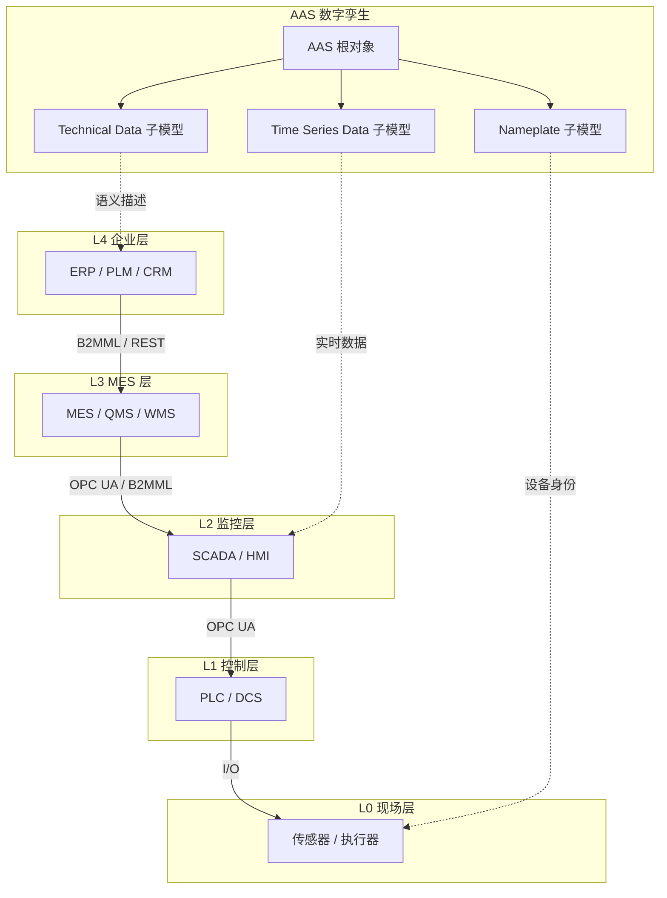

# ISA-95 资产目录深度清单
>
> 版本: 2026-06-06
> 对齐来源: ANSI/ISA-95.00.01-2010 (IEC 62264-1), ISA-95.00.02-2018 (IEC 62264-2), ISA-95.00.03-2013 (IEC 62264-3), MESA International, OMAC PackML State Model

## 1. ISA-95 五层模型资产分类

### 1.1 层级定义与资产范围

| 层级 | 名称 | 时间尺度 | 典型资产 | 管理域 |
|-----|------|---------|---------|--------|
| **L0** | 现场设备 (Field) | 毫秒–秒 | 传感器、执行器、驱动器 | 物理过程 |
| **L1** | 基本控制 (Control) | 秒–分 | PLC、DCS 控制器、RTU、CNC | 过程控制 |
| **L2** | 监控层 (Supervisory) | 分–小时 | SCADA、HMI、批处理管理器 | 区域监控 |
| **L3** | 制造运营 (MES) | 小时–天 | MES 系统、质量管理系统、WMS | 工厂运营 |
| **L4** | 企业层 (Enterprise) | 天–月 | ERP、PLM、CRM、SCM | 业务管理 |

### 1.2 L0 现场设备资产类型

| 资产类别 | 子类型 | 关键属性 | 语义模型 |
|---------|--------|---------|---------|
| **温度传感器** | RTD、热电偶、红外 | 量程、精度、响应时间、IEC 60584/60751 类型 | OPC UA DI 规范 |
| **压力传感器** | 压阻、电容、压电 | 量程、过载能力、介质兼容性 | OPC UA DI |
| **流量传感器** | 电磁、超声、科里奥利、涡街 | 口径、精度、雷诺数范围 | OPC UA DI |
| **物位传感器** | 雷达、超声、电容、导波雷达 | 量程、介电常数要求 | OPC UA DI |
| **分析仪表** | pH、电导率、溶解氧、气相色谱 | 校准周期、试剂需求、测量原理 | 特定厂商 EDDL |
| **执行器** | 电动、气动、液压阀门 | 行程时间、扭矩/推力、失电安全位 | OPC UA DI |
| **变频器 (VFD)** | 矢量控制、直接转矩控制 | 功率范围、载波频率、EMC 等级 | OPC UA DI |
| **电机** | 感应电机、伺服电机、步进电机 | 额定功率、转速、转矩曲线、效率等级 | IEC 61800-7 (Drive Profile) |

### 1.3 L1 控制器资产类型

| 资产类别 | 子类型 | 关键属性 | 编程标准 |
|---------|--------|---------|---------|
| **PLC** | 紧凑型、模块化、安全 PLC (SIL 3) | I/O 点数、扫描周期、冗余配置 | IEC 61131-3 |
| **DCS 控制器** | 过程控制器、混合控制器 | 控制回路数、算法块库、冗余 | IEC 61499 (分布式) |
| **CNC** | 铣床、车床、加工中心 | 轴数、插补精度、G-code 支持 | ISO 6983 / DIN 66025 |
| **运动控制器** | 单轴、多轴、机器人控制器 | 轴数、同步精度、PLCopen MC 支持 | PLCopen Motion Control |
| **机器人控制器** | 六轴、SCARA、协作机器人 | 负载、臂展、重复精度、安全等级 | ISO 10218 / ISO/TS 15066 |
| **RTU** | 远程终端单元 | 通信协议、I/O 容量、环境等级 | IEC 60870-5-101/104 |

### 1.4 L2 监控层资产类型

| 资产类别 | 功能 | 集成接口 | 数据流 |
|---------|------|---------|--------|
| **SCADA** | 实时数据采集、报警、历史趋势 | OPC UA / OPC Classic / DNP3 | L1 → L2 → L3 |
| **HMI/操作站** | 操作员界面、配方管理、报表 | 直接 PLC 连接 / OPC | L1 ↔ 操作员 |
| **批处理管理器** | ISA-88 批处理执行、电子批记录 | ISA-88 S88 接口 | L2 ↔ L3 |
| **历史数据库** | 时间序列数据存储、压缩 | OPC HDA / MQTT / REST | L1/L2 → 存储 |
| **报警管理系统** | 报警优先级、抑制、泛滥管理 | OPC A&E / ISA-18.2 | L1 → 操作员 |

### 1.5 L3 MES 资产类型

| 资产类别 | ISA-95 活动 | 功能模块 | 与 L4 集成 |
|---------|------------|---------|-----------|
| **生产调度** | 详细排程 | 订单分配、资源优化、甘特图 | ERP 工单 |
| **生产跟踪** | 分派生产、收集生产数据 | WIP 跟踪、在制品状态、良率 | ERP 完工报告 |
| **质量管理** | 收集测试数据、分析质量 | SPC、CAPA、不合格品管理 | PLM 规格 |
| **维护管理** | 设备维护、收集维护数据 | CMMS、预测性维护、备件 | ERP 资产模块 |
| **物料管理** | 管理物料、管理库存 | 批次追踪、库位管理、盘点 | ERP 库存 |
| **人员管理** | 管理人力资源 | 技能矩阵、考勤、培训记录 | HR 系统 |
| **文档管理** | 管理文档 | 电子工作指令、SOP 版本控制 | PLM 文档 |

## 2. ISA-95 资源模型（Resource Model）

### 2.1 四类资源

| 资源类型 | 定义 | 示例 | 复用模式 |
|---------|------|------|---------|
| **人员 (Personnel)** | 执行工作的人员 | 操作员、维护技师、质检员 | 技能矩阵模板、资质证书复用 |
| **设备 (Equipment)** | 执行工作的物理资产 | 机床、反应釜、测试台 | 设备模板、OEE 指标库 |
| **物料 (Material)** | 被加工或消耗的实体 | 原料、在制品、成品、耗材 | 物料主数据、BOM 模板 |
| **过程段 (Process Segment)** | 能力定义（做什么、需要什么资源）| 装配工序、测试流程、包装规范 | 过程段模板库、能力目录 |

### 2.2 设备能力属性清单

```text
Equipment Capability
├── Identification
│   ├── EquipmentID (全局唯一)
│   ├── EquipmentClass (设备类别，如 "CNC_Lathe_3Axis")
│   └── EquipmentLevel (Unit / Cell / Line / Site)
├── Operational Capability
│   ├── ProductionRate (单位时间产量)
│   ├── SetupTime (换型时间)
│   ├── CycleTime (节拍时间)
│   ├── Availability (可用性，OEE 组成)
│   ├── Performance (性能率，OEE 组成)
│   └── QualityRate (质量率，OEE 组成)
├── Physical Capability
│   ├── Dimensions (L×W×H，工作空间)
│   ├── WeightCapacity (最大负载)
│   ├── PowerRequirement (功耗)
│   └── EnvironmentalRequirements (温度、湿度、洁净度)
├── Control Capability
│   ├── SupportedProtocols (OPC UA, MQTT, Profinet, EtherCAT)
│   ├── ProgramStorageCapacity (程序存储容量)
│   └── DataCollectionFrequency (数据采集频率)
└── Maintenance Capability
    ├── MTBF (平均故障间隔)
    ├── MTTR (平均修复时间)
    ├── MaintenanceSchedule (预防性维护周期)
    └── SparePartsList (关键备件清单)
```

## 3. ISA-95 与 AAS 的映射

| ISA-95 概念 | AAS 对应 | 子模型模板 |
|------------|---------|-----------|
| Equipment | Asset (AssetKind = Instance) | Technical Data, Nameplate, Identification |
| EquipmentClass | Asset (AssetKind = Type) | Technical Data, Nameplate |
| Personnel | Asset (无形资产) | Contact Information, Qualifications |
| MaterialLot | Asset (Instance) | Identification, Carbon Footprint |
| ProcessSegment | Submodel (能力描述) | Custom Submodel |
| ProductionSchedule | Submodel (计划数据) | Time Series Data |
| MaintenanceRecord | Submodel (维护历史) | Handover Documentation |

## 4. OMAC PackML 状态机与 ISA-95 集成

### 4.1 PackML 单元模式状态

| 状态 | 说明 | ISA-95 活动映射 |
|-----|------|----------------|
| **Idle** | 等待命令 | 生产分派前 |
| **Starting** | 启动序列 | 资源分配 |
| **Execute** | 正常运行 | 执行生产 |
| **Completing** | 完成序列 | 收集生产数据 |
| **Complete** | 完成 | 生产跟踪更新 |
| **Resetting** | 复位 | 准备下一批次 |
| **Holding/Held** | 保持 | 异常处理 |
| **Unholding** | 解除保持 | 恢复执行 |
| **Suspending/Suspended** | 暂停 | 物料等待 |
| **Unsuspending** | 解除暂停 | 恢复执行 |
| **Stopping/Stopped** | 停止 | 安全停机 |
| **Aborting/Aborted** | 中止 | 紧急停机 |
| **Clearing** | 清除故障 | 维护介入 |

### 4.2 PackML 模式（Modes）

| 模式 | 用途 | 安全等级 |
|-----|------|---------|
| **Production** | 正常生产 | 最高安全约束 |
| **Maintenance** | 维护/调试 | 旁路部分安全互锁 |
| **Manual** | 手动操作 | 操作员直接控制 |
| **Recipe** | 配方管理 | 验证模式 |
| **User 1-4** | 厂商自定义 | 按需求定义 |

## 5. 语义模型与接口标准

### 5.1 设备描述技术对比

| 技术 | 标准化组织 | 用途 | 状态 |
|-----|-----------|------|------|
| **EDDL (Electronic Device Description Language)** | IEC 61804 | 现场设备参数描述 | 成熟，广泛使用 |
| **FDT/DTM (Field Device Tool)** | FDT Group | 设备参数化与诊断 | 成熟，向 FDT 3.0 演进 |
| **OPC UA DI (Device Integration)** | OPC Foundation | OPC UA 设备信息模型 | 主流，与 AAS 集成 |
| **PA-DIM (Process Automation Device Information Model)** | OPC Foundation / FieldComm | 过程自动化统一信息模型 | 开发中，对标 EDDL |
| **AAS 子模型模板** | IDTA | 资产标准化数字表示 | 发展中，生态建设 |

### 5.2 ISA-95 B2MML（Business To Manufacturing Markup Language）

- XML Schema 实现 ISA-95 数据交换
- 覆盖：人员、设备、物料、过程段、生产能力、生产调度、生产绩效
- 与 SOAP/Web Services 集成
- 现代替代：REST/JSON + OPC UA + AAS

## 6. 资产目录复用策略

### 6.1 模板化复用

| 模板层级 | 复用单元 | 实现方式 |
|---------|---------|---------|
| **设备类别模板** | 同类设备的通用属性集 | AAS 子模型模板 (IDTA-02003 Technical Data) |
| **OEE 指标模板** | 设备效率计算标准 | ISA-95 绩效数据 + PackML 计数器 |
| **维护策略模板** | 预防性/预测性维护规则 | ISA-95 维护请求 + AAS 维护子模型 |
| **技能矩阵模板** | 人员资质要求 | ISA-95 人员能力 + 培训记录子模型 |

### 6.2 跨层引用链

```text
L4 ERP
├── 物料主数据 (Material Master)
└── 工单 (Work Order)
    ↓ B2MML / REST / AAS
L3 MES
├── 生产调度 (Production Schedule)
├── 设备 OEE 实时计算
└── 质量批次追踪
    ↓ OPC UA / MQTT
L2 SCADA
├── 报警管理 (ISA-18.2)
├── 历史数据 (Time Series)
└── 配方管理 (ISA-88)
    ↓ OPC UA / Profinet / EtherCAT
L1 PLC
├── 控制逻辑 (IEC 61131-3)
├── 运动控制 (PLCopen)
└── 安全逻辑 (SIL 3)
    ↓ I/O 信号
L0 传感器/执行器
├── 模拟量 (4-20mA, 0-10V)
└── 数字量 (24V DC)
```

## 7. ISA-95 L0–L4 层级定义、属性与边界补强

### 7.1 层级定义与核心属性

ISA-95 的五层模型定义了从物理过程到企业业务管理的垂直集成边界。每一层具有独特的**时间尺度、控制范围、数据类型和安全要求**，这些属性决定了资产的可复用边界。

| 层级 | 名称 | 时间尺度 | 控制范围 | 主要数据类型 | 安全/可用性要求 | 复用边界 |
|-----|------|---------|---------|-------------|----------------|---------|
| **L0** | 现场设备 (Field) | 毫秒–秒 | 单一物理过程 | 模拟量、数字量、原始传感器数据 | 高可用性、功能安全 (SIL)、防爆 (ATEX) | 设备模板可复用，但具体安装位置必须按工艺定制 |
| **L1** | 基本控制 (Control) | 秒–分 | 单一设备/单元 | 控制回路、设定点、报警 | 实时性、确定性、安全完整性 | 控制逻辑模板可复用，I/O 映射需按项目配置 |
| **L2** | 监控层 (Supervisory) | 分–小时 | 产线/区域 | 批次、配方、历史趋势、报警 | 高可用性、数据完整性 | SCADA 模板、配方模板可跨产线复用 |
| **L3** | 制造运营 (MES) | 小时–天 | 工厂/车间 | 工单、质量、物料、人员 | 业务连续性、合规性 (GMP/FDA) | MES 模块、OEE 模板可在同类型工厂复用 |
| **L4** | 企业层 (Enterprise) | 天–月 | 企业/供应链 | ERP/PLM/CRM 数据、主数据 | 数据一致性、审计、合规 | 物料主数据、BOM 模板可在企业内复用 |

> **定义 ISA.1** (ISA-95 层级边界): ISA-95 层级边界是物理过程、实时控制、区域监控、工厂运营和企业业务之间的职责分隔。复用资产时，必须确保其在目标层级的实时性、安全性和语义一致性。

### 7.2 层级间数据流与控制流

| 方向 | 数据/控制流 | 典型接口 | 复用关注点 |
|------|------------|---------|-----------|
| L0 → L1 | 传感器数据、执行器状态 | 4-20mA, 0-10V, IO-Link, HART | 信号类型、量程、采样周期 |
| L1 → L2 | 过程值、报警、事件 | OPC UA, OPC Classic, MQTT | 通信协议、数据模型 |
| L2 → L3 | 批次记录、生产绩效、质量数据 | OPC UA, B2MML, REST | 数据结构、语义映射 |
| L3 → L4 | 工单完成、库存状态、质量报告 | B2MML, REST/JSON, AAS | 业务语义、主数据一致性 |
| L4 → L3 | 生产订单、排程、配方 | B2MML, REST/JSON | 版本控制、变更管理 |
| L3 → L2 | 工单分派、工艺参数 | OPC UA, B2MML | 实时性约束、参数验证 |
| L2 → L1 | 设定点、配方下载 | OPC UA, Profinet, EtherCAT | 确定性、安全联锁 |
| L1 → L0 | 控制信号、驱动命令 | 数字量、模拟量、现场总线 | 电气特性、安全等级 |

### 7.3 与 AAS 的映射补强

AAS（Asset Administration Shell，资产管理壳）为 ISA-95 各层资产提供了标准化的数字孪生表示。下表给出更详细的映射关系。

| ISA-95 概念 | AAS 对应 | 子模型模板 | 映射说明 |
|------------|---------|-----------|---------|
| Equipment (实例) | Asset (AssetKind = Instance) | Technical Data, Nameplate, Identification | 每台物理设备对应一个 AAS 实例 |
| EquipmentClass (类型) | Asset (AssetKind = Type) | Technical Data, Nameplate | 设备类别作为 AAS 类型模板 |
| Personnel | Asset (无形资产) | Contact Information, Qualifications | 人员能力与资质 |
| MaterialLot | Asset (Instance) | Identification, Carbon Footprint | 批次追踪与碳足迹 |
| ProcessSegment | Submodel (能力描述) | Custom Submodel | 工序能力定义 |
| ProductionSchedule | Submodel (计划数据) | Time Series Data | 生产计划与排程 |
| MaintenanceRecord | Submodel (维护历史) | Handover Documentation | 维护记录与文档 |
| QualityTestResult | Submodel (质量数据) | Technical Data, Time Series Data | 测试结果与 SPC 数据 |

> **定理 ISA.AAS.1** (AAS 复用单调性): 若 ISA-95 资产 A 被复用于系统 S，则 A 的 AAS 子模型必须在 S 的 AAS 中保持语义等价。任何子模型属性的丢失或语义漂移都会导致复用边界破坏。

### 7.4 与 OPC UA 的映射补强

OPC UA 是 ISA-95 层级间实时数据交换的主流协议。AAS 与 OPC UA 的映射使数字孪生能够同时承载语义描述和实时变量。

| ISA-95 层级 | OPC UA 角色 | 典型 NodeSet | 复用模式 |
|------------|------------|-------------|---------|
| L0 | 设备参数与诊断 | OPC UA DI, PA-DIM | 设备描述文件复用 |
| L1 | 控制器变量与方法 | PLCopen, OPC UA IEC 61131-3 | 控制逻辑变量模型复用 |
| L2 | 报警与事件、历史数据 | OPC UA A&E, HDA | SCADA 信息模型复用 |
| L3 | MES 对象模型 | ISA-95 B2MML, OPC UA ISA-95 | MES 数据模型复用 |
| L4 | 企业主数据 | AAS REST API, OPC UA Client/Server | 主数据同步 |

### 7.5 正例

| 场景 | 层级 | 复用资产 | 效果 |
|------|------|---------|------|
| 汽车总装线复制 | L2/L3 | PackML 状态机 + OEE 指标模板 | 新产线快速达到标准化生产模式 |
| 制药批次管理 | L2/L3 | ISA-88 批处理模板 + AAS 批次子模型 | 满足 GMP 审计要求，批次追溯完整 |
| 设备供应商交付 | L0/L1 | AAS Digital Nameplate + OPC UA DI NodeSet | 设备即插即用，工程调试时间缩短 50% |
| 集团 ERP-MES 集成 | L3/L4 | ISA-95 B2MML 工单与物料模型 | 跨工厂主数据一致性提升 |

### 7.6 反例

| 反例 | 风险说明 |
|------|---------|
| 将 L4 ERP 排程逻辑直接下放到 L1 PLC | 违反实时性约束，导致控制回路不稳定 |
| 在 L0/L1 使用通用 IT 网络协议而无确定性保证 | 通信抖动导致生产质量下降或安全事故 |
| AAS 子模型缺失实时数据映射 | 数字孪生与物理资产不同步，决策失误 |
| 跨层级复用 EquipmentClass 时忽略工艺差异 | 同一设备类型在不同工艺中的安全/性能要求不同 |
| 将 L2 SCADA 报警直接用于 L4 业务决策 | 报警泛滥与业务指标混淆，掩盖真实问题 |

### 7.7 ISA-95 × AAS × OPC UA 映射矩阵 Mermaid 图



### 7.8 权威来源与交叉引用补强

- IEC 62264-1:2013 *Enterprise-control system integration — Part 1: Models and terminology*：<https://standards.iteh.ai/catalog/standards/iec/57ebd369-7020-4c85-bb76-5890601d051d/iec-62264-1-2013>
- IEC 62264-3:2013 *Activity models of manufacturing operations management*：<https://webstore.iec.ch/publication/66912>
- IEC 63278-1:2023 *Asset Administration Shell structure*：<https://webstore.iec.ch/en/publication/65628>
- ISO/IEC 30141:2024 *Internet of Things reference architecture*：<https://www.iso.org/standard/88800.html>
- OPC UA for Devices (DI): <https://reference.opcfoundation.org/DI/v105/docs/>
- OPC UA for ISA-95 (B2MML): <https://www.mesa.org/en/B2MML.asp>
- IDTA Submodel Templates: <https://industrialdigitaltwin.org/en/content-hub/submodels>
- IDTA AAS Industry Use Cases: <https://industrialdigitaltwin.org/en/news-dates/use-cases-from-the-industry-with-the-asset-administration-shell-6226>
- DIN SPEC 91345 / RAMI 4.0 参考架构指南：<https://www.digitale-technologien.de/DT/Redaktion/DE/Downloads/Publikation/PAiCE_Leitfaden_Reference_Architecture.pdf>
- **交叉引用**: [`01-isa-95-model/cross-layer-matrix/data-flow-mapping.md`](./cross-layer-matrix/data-flow-mapping.md)；[`05-digital-twin-aas/aas-opcua-mapping.md`](../05-digital-twin-aas/aas-opcua-mapping.md)；[`02-opc-ua-fx/opc-ua-fx-reuse-hierarchy.md`](../02-opc-ua-fx/opc-ua-fx-reuse-hierarchy.md)

---

> 最后更新: 2026-07-08
