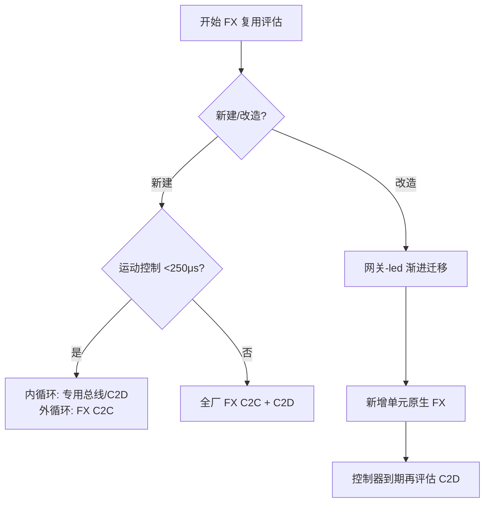

# OPC UA FX 现场级确定性通信复用

> **版本**: 2026-07-09
> **定位**: 基于 OPC UA Field eXchange（FX）的现场级确定性通信复用框架，覆盖 C2C/C2D/D2D 三种模式与 Offline Engineering 模板。
> **对齐标准**: OPC UA FX 1.00.03 (OPC 10000-80~84)、IEC/IEEE 60802 TSN Profile、IEC 62541 OPC UA

---

## 1. 概念定义

**OPC UA FX（Field eXchange）** 是 OPC Foundation 为现场级通信定义的扩展，基于 OPC UA PubSub over UDP（UADP）与 IEEE 802.1 TSN，实现跨厂商控制器与设备之间的确定性数据交换。其核心复用价值在于：用标准化信息模型替代私有现场总线，降低 vendor lock-in 与工程集成成本。

| 通信模式 | 全称 | 典型周期 | 适用层级 | 复用成熟度 |
|----------|------|---------|---------|-----------|
| **C2C** | Controller-to-Controller | 10–100 ms | L1-L2 协调 | 已量产（2025-2026） |
| **C2D** | Controller-to-Device | 500 μs – 10 ms | L0-L1 控制 | Phase 2 试点 |
| **D2D** | Device-to-Device | 250 μs – 1 ms | L0 设备直连 | 开发中 |

> **公理 FX.1** (Determinism Preservation): OPC UA FX 的复用必须保持端到端确定性。任何在复用过程中引入的额外协议转换（网关、代理）必须证明其时延上界小于应用容忍阈值。

---

## 2. OPC UA FX 技术栈与标准条款映射

```text
┌─────────────────────────────────────────┐
│  应用层：FX 通信配置文件（C2C/C2D/D2D）   │
├─────────────────────────────────────────┤
│  传输层：OPC UA PubSub over UDP (UADP)   │
├─────────────────────────────────────────┤
│  确定性层：IEEE 802.1AS / 802.1Qbv /     │
│           802.1CB / IEC/IEEE 60802     │
├─────────────────────────────────────────┤
│  物理层：标准以太网 / Ethernet-APL      │
└─────────────────────────────────────────┘
```

| FX 规范部分 | OPC 编号 | 内容 | 与 ISA-95 / AAS 的映射 |
|------------|---------|------|----------------------|
| **Part 80** | OPC 10000-80 | UAFX Overview and Concepts | 总体架构概念 |
| **Part 81** | OPC 10000-81 | Connecting Devices and Information Model | AutomationComponent ↔ AAS Submodel 概念对齐 |
| **Part 82** | OPC 10000-82 | Networking (TSN / topology / LLDP) | IEC/IEEE 60802 TSN 配置 |
| **Part 83** | OPC 10000-83 | Offline Engineering descriptors | AASX / AML 工程模板复用 |
| **Part 84** | OPC 10000-84 | Profiles and Conformance Units | 设备能力声明与互操作测试 |

| ISA-95 层级 | OPC UA FX 角色 | 复用关注点 |
|------------|---------------|-----------|
| L0 | C2D / D2D 现场设备数据接入 | 设备描述、I/O 映射、Companion Spec |
| L1 | C2C 控制器间协调 | 控制回路同步、安全联锁 |
| L2 | C2C + Client/Server 区域监控 | 报警、事件、历史数据 |
| L3 | C2C + OPC UA Client/Server + AAS | 工单、配方、质量数据 |
| L4 | AAS + OPC UA Client/Server | 主数据、业务语义 |

---

## 3. 正向示例

### 示例 1：多厂商汽车焊装线 C2C 复用

汽车焊装线集成 Siemens、Rockwell、B&R 三家 PLC，通过 OPC UA FX C2C 与 TSN 骨干网实现产线同步。工程团队复用 C2C 连接模板，调试周期从 6 周缩短到 2 周，网关数量减少 70%。

### 示例 2：制药灌装线 Offline Engineering 模板

工程团队在新灌装线部署前，使用 Part 83 Offline Engineering 描述符包完成 TSN 门控表、PubSub 数据集与 WriterGroup 配置。现场调试时间从 2 周降至 3 天。

### 示例 3：设备供应商 AAS + FX C2D 交付

伺服驱动器供应商提供 OPC UA FX C2D 描述与 AAS Digital Nameplate。客户工程工具可自动识别设备并生成 PLC 标签，实现“即插即用”集成。

---

## 4. 反例 / 失败案例

### 反例 1：将 C2C 模板用于运动控制

某团队将 C2C 配置模板直接用于 <250 μs 的运动控制场景。C2C 周期不满足实时性要求，导致机器人轨迹抖动。后改用专用现场总线或 C2D/D2D 配置。

### 反例 2：忽视 TSN 拓扑差异复制 GCL

某项目直接将模板中的 802.1Qbv 门控列表（GCL）复制到不同拓扑的棕地工厂，未考虑交换机延迟、电缆长度差异，导致时间槽冲突与通信丢包。

### 反例 3：强制 FX 替换所有棕地现场总线

某企业声称“最终消除网关”，计划一次性替换所有棕地 Profinet/EtherCAT。实际因设备生命周期未到，项目成本超支 3 倍且停产风险极高。棕地中协议网关应视为永久性架构组件。

---

## 5. 复用决策树



---

## 6. 权威来源

> **权威来源**:
>
> - OPC UA FX Part 80 (UAFX Overview and Concepts): <https://reference.opcfoundation.org/UAFX/Part80/v100/docs/> （核查日期：2026-07-09）
> - OPC UA FX Part 81 (Connecting Devices and Information Model): <https://reference.opcfoundation.org/UAFX/Part81/v100/docs/> （核查日期：2026-07-09）
> - OPC UA FX Part 82 (Networking): <https://reference.opcfoundation.org/UAFX/Part82/v100/docs/> （核查日期：2026-07-09）
> - OPC UA FX Part 83 (Offline Engineering): <https://reference.opcfoundation.org/UAFX/Part83/v100/docs/> （核查日期：2026-07-09）
> - OPC UA FX Part 84 (Profiles): <https://reference.opcfoundation.org/UAFX/Part84/v100/docs/> （核查日期：2026-07-09）
> - IEC/IEEE 60802 TSN Profile for Industrial Automation: <https://1.ieee802.org/tsn/iec-ieee-60802/> （核查日期：2026-07-09）
> - IEC 62541 OPC Unified Architecture: <https://webstore.iec.ch/publication/66912> （核查日期：2026-07-09）
> - OPC Foundation FLC Technical Paper – OPC UA FX C2C: <https://opcfoundation.org/wp-content/uploads/2023/11/OPCF-FLC-Technical-Paper-C2C-EN.pdf> （核查日期：2026-07-09）

---

## 7. 交叉引用

- 复用层次分析： [`opc-ua-fx-reuse-hierarchy.md`](./opc-ua-fx-reuse-hierarchy.md)
- UADP 帧结构分析： [`frame-structure/uadp-frame-analysis.md`](./frame-structure/uadp-frame-analysis.md)
- 棕地/绿地决策： [`deployment-scenarios/brownfield-greenfield-decision.md`](./deployment-scenarios/brownfield-greenfield-decision.md)
- AAS-OPC UA 映射： [`../05-digital-twin-aas/aas-opcua-mapping.md`](../05-digital-twin-aas/aas-opcua-mapping.md)

---

> 最后更新: 2026-07-09
