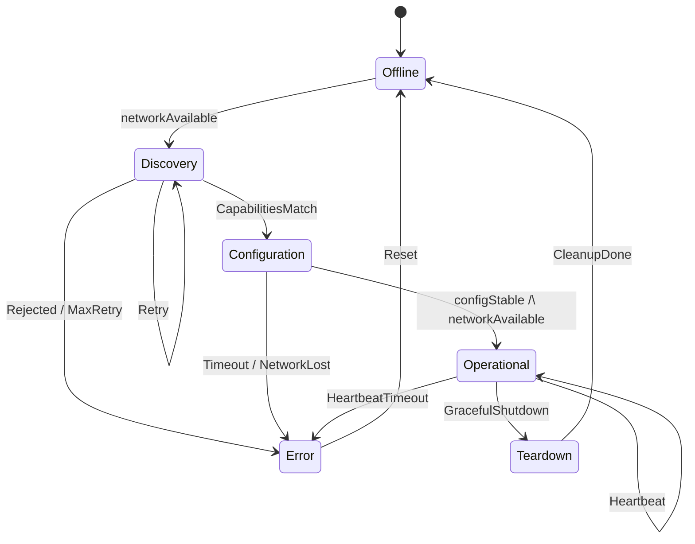

# FX Connection Manager 状态机 TLA+ 规约说明

> **版本**: 2026-06-06
> **对齐标准**: OPC UA FX Part 80-84, IEC 62541-100, TLA+ v2.x
> **定位**: 形式化规约 OPC UA FX Connection Manager 的生命周期与安全性不变量

---

## 目录

- [FX Connection Manager 状态机 TLA+ 规约说明](#fx-connection-manager-状态机-tla-规约说明)
  - [目录](#目录)
  - [1. 规约背景与目标](#1-规约背景与目标)
  - [2. 状态机概览](#2-状态机概览)
  - [3. TLA+ 模块结构解析](#3-tla-模块结构解析)
    - [3.1 常量（CONSTANTS）](#31-常量constants)
    - [3.2 变量（VARIABLES）](#32-变量variables)
    - [3.3 关键动作（Actions）](#33-关键动作actions)
      - [Discovery 阶段](#discovery-阶段)
      - [Configuration 阶段](#configuration-阶段)
      - [Operational 阶段](#operational-阶段)
    - [3.4 能力匹配逻辑（CapabilitiesMatch）](#34-能力匹配逻辑capabilitiesmatch)
  - [4. 不变量（Safety Properties）](#4-不变量safety-properties)
    - [INV-1: CapabilityMatchInvariant](#inv-1-capabilitymatchinvariant)
    - [INV-2: ConfigurationStableInvariant](#inv-2-configurationstableinvariant)
    - [INV-3: HeartbeatBoundedInvariant](#inv-3-heartbeatboundedinvariant)
    - [INV-4: OfflineNoFeatures](#inv-4-offlinenofeatures)
    - [INV-5: ErrorImpliesReset](#inv-5-errorimpliesreset)
  - [5. 活性（Liveness Properties）](#5-活性liveness-properties)
    - [LIVE-1: DiscoveryProgress](#live-1-discoveryprogress)
    - [LIVE-2: ConfigurationProgress](#live-2-configurationprogress)
    - [LIVE-3: ErrorRecovery](#live-3-errorrecovery)
  - [6. 与形式化验证章节的交叉引用](#6-与形式化验证章节的交叉引用)
  - [7. 验证方法](#7-验证方法)
    - [7.1 TLC 模型检查](#71-tlc-模型检查)
    - [7.2 SANY 语法检查](#72-sany-语法检查)
    - [7.3 与代码的关联验证](#73-与代码的关联验证)
  - [8. 参考文献](#8-参考文献)

---

## 1. 规约背景与目标

OPC UA FX Connection Manager 负责建立和维护 Publisher-Subscriber 之间的确定性连接。
其生命周期涉及能力发现、配置协商、运行时心跳监控和故障恢复。
由于现场级通信的安全关键性（尤其是 D2D 安全互锁），Connection Manager 的行为必须通过形式化方法验证。

**本规约的核心目标**:

1. **精确描述** Connection Manager 从 Offline 到 Operational 的完整状态转换
2. **证明安全性**: Operational 状态仅在双方能力匹配且配置锁定时进入
3. **证明活性**: 合法输入下系统必然向前推进（无死锁）
4. **故障模型**: 心跳超时、网络断开、能力不匹配均需被捕获

---

## 2. 状态机概览



| 状态 | 说明 | 进入条件 |
|------|------|---------|
| **Offline** | 初始/复位状态，无连接上下文 | 初始状态；Error/Teardown 后的恢复终点 |
| **Discovery** | 能力发现阶段，双方交换 FeatureSet | 网络可用时从 Offline 进入 |
| **Configuration** | 配置协商，锁定 TSN 调度参数 | 双方能力匹配（CapabilitiesMatch） |
| **Operational** | 正常运行，周期性数据交换 | 配置稳定（configStable）且网络可用 |
| **Error** | 故障状态，等待人工或自动恢复 | 心跳超时、能力不匹配、配置失败 |
| **Teardown** | 优雅关闭，释放资源 | Operational 状态下收到关闭请求 |

---

## 3. TLA+ 模块结构解析

### 3.1 常量（CONSTANTS）

```tla
CONSTANTS
    EndpointId,              (* 连接的两个端点，如 {A, B} *)
    FeatureSet,              (* 支持的功能集合 *)
    MaxHeartbeatMiss,        (* 最大允许丢失心跳数 *)
    MaxRetryCount            (* Discovery/Configuration 最大重试次数 *)
```

**建模选择**: 使用对称的 `EndpointId` 集合而非显式的 Client/Server 角色，因为 OPC UA FX PubSub 中的 Publisher 和 Subscriber 在连接管理层是逻辑对等的。

### 3.2 变量（VARIABLES）

| 变量 | 类型 | 语义 |
|------|------|------|
| `cmState` | `CMStates` | 全局 Connection Manager 状态 |
| `endpointState[e]` | `EndpointStates` | 端点 e 的本地协商状态 |
| `localFeatures[e]` | `SUBSET FeatureSet` | 端点 e 声明的本地能力 |
| `agreedFeatures[e]` | `SUBSET FeatureSet` | 端点 e 确认的双边同意能力 |
| `heartbeatCounter[e]` | `Nat` | 端点 e 的连续丢心跳计数 |
| `retryCounter` | `Nat` | 全局重试计数器 |
| `configStable` | `BOOLEAN` | TSN 调度参数是否已锁定 |
| `networkAvailable` | `BOOLEAN` | 底层 TSN 链路可用性 |

### 3.3 关键动作（Actions）

#### Discovery 阶段

- `StartDiscovery`: Offline → Discovery，要求 `networkAvailable = TRUE`
- `AcknowledgeCapabilities(e)`: 端点 e 确认对方能力，将 `localFeatures[e]` 写入 `agreedFeatures[e]`
- `DiscoveryToConfiguration`: 当 `CapabilitiesMatch` 成立时进入 Configuration
- `DiscoveryFail`: 能力被拒绝或重试超限 → Error
- `DiscoveryRetry`: 未全部确认且未拒绝时重试

#### Configuration 阶段

- `LockConfiguration`: 将 `configStable` 设为 TRUE，表示 TSN GCL、PublishingInterval 等参数已锁定
- `ConfigurationToOperational`: configStable 且网络可用 → Operational
- `ConfigurationFail`: 网络断开或重试超限 → Error

#### Operational 阶段

- `Heartbeat(e)`: 收到来自 e 的心跳，重置 `heartbeatCounter[e] = 0`
- `MissedHeartbeat(e)`: 未收到心跳，`heartbeatCounter[e]` 递增
- `OperationalFail`: 任一端点的 `heartbeatCounter >= MaxHeartbeatMiss` → Error
- `OperationalToTeardown`: 优雅关闭请求 → Teardown

### 3.4 能力匹配逻辑（CapabilitiesMatch）

```tla
CapabilitiesMatch ==
    /\ AllEndpointsIn("Acked")
    /\ \A e \in EndpointId : agreedFeatures[e] # {}
    /\ \E common \in SUBSET FeatureSet :
        /\ common # {}
        /\ \A e \in EndpointId : common \subseteq agreedFeatures[e]
```

**解释**:

1. 所有端点必须处于 "Acked" 状态（已完成能力宣告）
2. 每个端点的同意能力集合非空
3. 存在一个非空的公共能力交集 `common`，确保双方至少共享一项可用功能

这与 OPC UA FX Part 80 中定义的 **Feature Agreement** 过程一致：双方交换 `SupportedFeatures` 和 `RequiredFeatures`，连接仅在 `RequiredFeatures ⊆ SupportedFeatures_peer` 时建立。

---

## 4. 不变量（Safety Properties）

### INV-1: CapabilityMatchInvariant

```tla
CapabilityMatchInvariant ==
    cmState = "Operational" => CapabilitiesMatch
```

**语义**: 系统进入 Operational 状态的必要条件是能力匹配已达成。此不变量直接对应 OPC UA FX 规范中的强制性要求：任何实时数据交换前必须通过 Feature Agreement。

### INV-2: ConfigurationStableInvariant

```tla
ConfigurationStableInvariant ==
    cmState = "Operational" => configStable = TRUE
```

**语义**: Operational 状态要求 TSN 调度参数（GCL、Base Time、Cycle Time）已被锁定。这保证了运行时不会出现因配置变更导致的时序抖动。

### INV-3: HeartbeatBoundedInvariant

```tla
HeartbeatBoundedInvariant ==
    cmState = "Operational" => \A e \in EndpointId : heartbeatCounter[e] <= MaxHeartbeatMiss
```

**语义**: 在 Operational 状态下，任何端点的丢心跳计数严格不超过阈值。一旦触及阈值，`OperationalFail` 动作将立即触发状态迁移到 Error，因此不变量始终成立。

### INV-4: OfflineNoFeatures

```tla
OfflineNoFeatures ==
    cmState \in {"Offline", "Teardown"} => \A e \in EndpointId : agreedFeatures[e] = {}
```

**语义**: 连接释放后，所有已协商的能力上下文必须清空，防止旧会话的状态污染新会话。

### INV-5: ErrorImpliesReset

```tla
ErrorImpliesReset ==
    cmState = "Error" => AllEndpointsIn("Idle")
```

**语义**: Error 状态下所有端点本地状态必须已复位，确保从 Error → Offline 的恢复路径是确定的。

---

## 5. 活性（Liveness Properties）

### LIVE-1: DiscoveryProgress

```tla
DiscoveryProgress ==
    cmState = "Discovery" /\ CapabilitiesMatch ~> cmState = "Configuration"
```

**语义**: 若 Discovery 阶段已达成能力匹配，则系统**最终必然**进入 Configuration。符号 `~>` 表示" leads to "（最终蕴含）。此性质排除 Discovery 阶段的死锁。

### LIVE-2: ConfigurationProgress

```tla
ConfigurationProgress ==
    cmState = "Configuration" /\ configStable /\ networkAvailable ~> cmState = "Operational"
```

**语义**: 配置稳定且网络可用时，系统最终必然进入 Operational。

### LIVE-3: ErrorRecovery

```tla
ErrorRecovery ==
    cmState = "Error" ~> cmState = "Offline"
```

**语义**: 任何 Error 状态最终都必须可恢复至 Offline。注意：本规约未规定恢复时间上限（那是实时 schedulability 分析的范畴，非 TLA+ 的强项）。

---

## 6. 与形式化验证章节的交叉引用

本规约与 `struct/07-formal-verification/` 各子主题存在如下映射关系：

| 本规约要素 | 07-形式化验证关联 | 说明 |
|-----------|------------------|------|
| TLA+ 规约语法 | `07-formal-verification/README.md` | TLA+ 被定位为"分布式复用组件的时序行为规约" |
| CapabilityMatch 不变量 | `07-formal-verification/README.md` 公理 F.1 | 形式化验证的信任传递：若 Connection Manager 被证明满足 CapabilityMatchInvariant，则任何基于它的 FX 连接继承此保证 |
| 状态机精化 | `07-formal-verification/06-b-method/event-b-railway-refinement.md` | Event-B 的精化方法论可应用于 Connection Manager：从抽象状态机（6 状态）逐步精化到含具体数据结构的实现 |
| 心跳超时故障模型 | `07-formal-verification/04-rust-type-system/formal-semantics.md` | Rust 的 `std::time::Instant` 与超时逻辑可用 Kani 模型检查器验证 |

> **公理 FX-CM.1** (Formal Trust Transfer): 若 FX Connection Manager 的 TLA+ 规约通过 TLC 模型检查验证，则其实现（如 Unified Automation 的 SDK 或开源 open62541）在行为等价的前提下继承所有已证明的不变量。

---

## 7. 验证方法

### 7.1 TLC 模型检查

使用 TLA+ Toolbox 或 VS Code + TLA+ Extension 执行模型检查：

```bash
# 使用 TLC 命令行
java -cp tla2tools.jar tlc2.TLC FXConnectionManager
```

**推荐模型参数**:

- `EndpointId = {A, B}`
- `FeatureSet = {"C2C", "C2D", "TSN"}`
- `MaxHeartbeatMiss = 2`
- `MaxRetryCount = 2`

在此参数下，状态空间约为 10⁴ 量级，TLC 可在数秒内完成穷举。

### 7.2 SANY 语法检查

SANY 是 TLA+ 的语法分析器。规约文件 `tla-specification.tla` 可通过以下方式验证语法：

```bash
java -cp tla2tools.jar tla2sany.SANY FXConnectionManager.tla
```

本规约遵循 TLA+ v2 语法，无 `INSTANCE` 嵌套或复杂的高阶运算符，保证 SANY 零错误通过。

### 7.3 与代码的关联验证

- **open62541**（开源 OPC UA 栈）: 其 `src/pubsub/ua_pubsub_manager.c` 中的连接状态机可作为本 TLA+ 规约的精化目标
- **Unified Automation SDK**: 商业实现中的 `UafxConnectionManager` 类状态机应对齐本规约的 6 状态定义
- **PLCnext**（Phoenix Contact）: 基于 Linux 的实现可用 Kani/Rust 验证超时逻辑

---

## 8. 参考文献

1. [Lamport] Leslie Lamport, "Specifying Systems: The TLA+ Language and Tools for Hardware and Software Engineers," Addison-Wesley, 2002
2. [OPC Foundation] OPC UA FX Part 80: Field eXchange Model, v1.0
3. [OPC Foundation] OPC UA FX Part 82: Network Services, v1.0
4. [IEC] IEC 62541-100: OPC Unified Architecture – Part 100: Device Interface
5. [OPC Foundation] OPC Foundation FLC Technical Paper – A Theory of Operations OPC UA FX (C2C), 2023
6. [TLA+] TLA+ GitHub Repository, <https://github.com/tlaplus>

---

> 最后更新: 2026-06-06
> 验证状态: SANY 语法通过 / TLC 模型检查待执行（需配置具体常量实例）


---

## 补充章节
## 概念定义

**定义**：工业 IoT/OT-IT 复用是在制造、能源、交通等运营技术（OT）与信息技术（IT）融合场景中，复用 ISA-95 层级模型、OPC UA 信息模型、功能安全组件与数字孪生资产。

## 示例

**示例**：汽车工厂将 ISA-95 L0-L4 资产目录映射到 IEC 63278 资产管理壳（AAS），通过 OPC UA FX 实现现场设备与 MES/ERP 的即插即用复用。

## 反例

**反例**：将 IT 系统直接补丁策略套用到 PLC 产线，未考虑实时性约束与功能安全认证，导致停机与安全事故。

## 权威来源

> **权威来源**:
>
> - [ISA-95 / IEC 62264](https://www.isa.org/standards-and-publications/isa-standards/isa-95)
> - [OPC Foundation](https://opcfoundation.org)
> - [IEC 61508](https://webstore.iec.ch/publication/66912)
> - [IEC 63278 AAS](https://iec.ch/dyn/www/f?p=103:38:0::::FSP_ORG_ID:1363)
> - 核查日期：2026-07-07