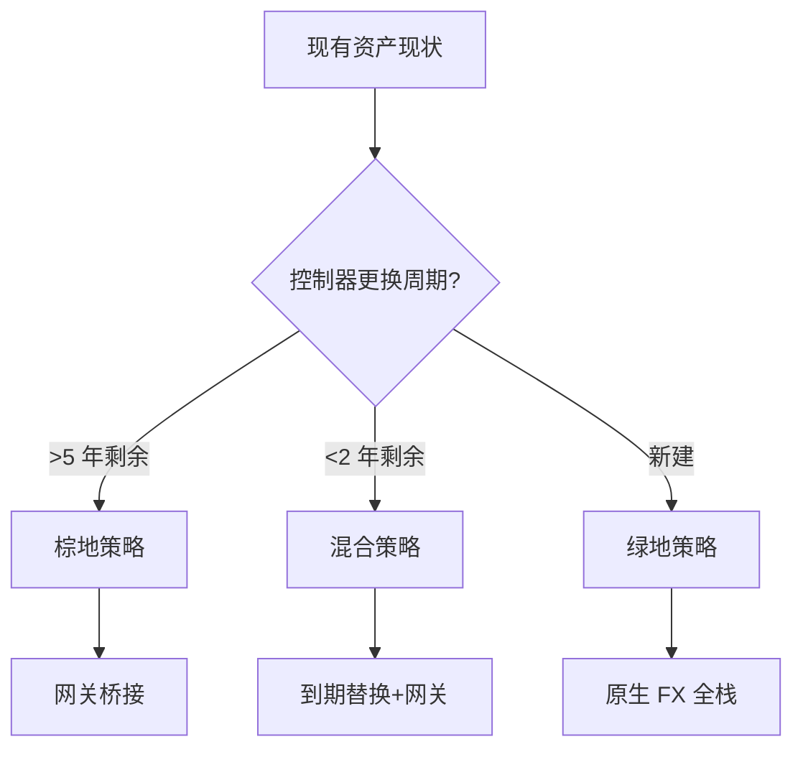
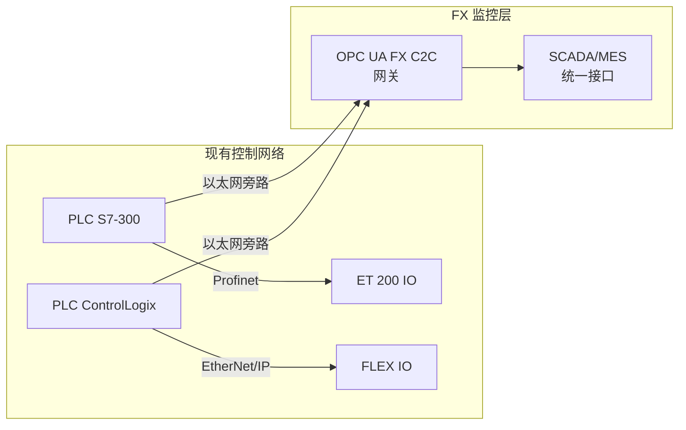
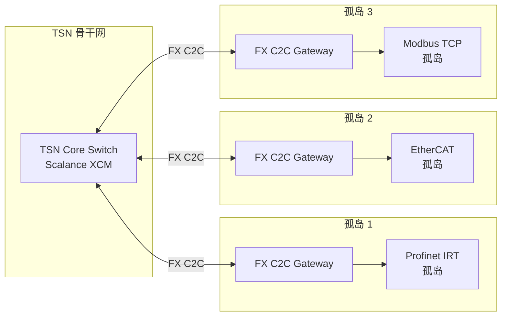
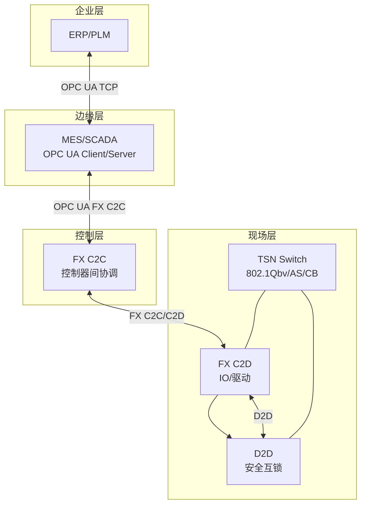
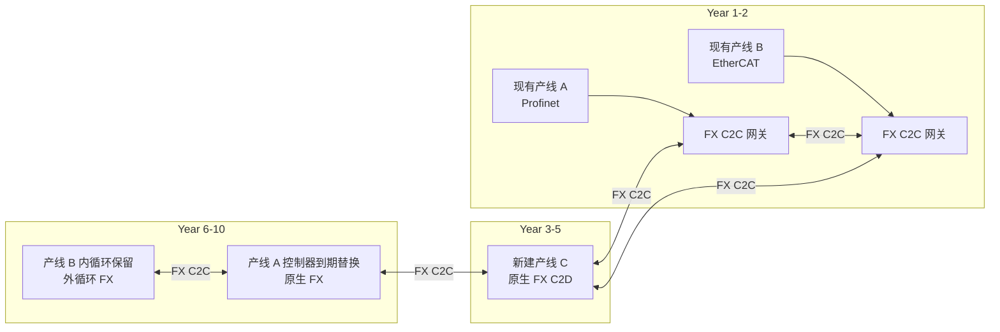

# 棕地 / 绿地 / 混合场景决策模板

> **版本**: 2026-06-06
> **对齐标准**: OPC UA FX Part 80-84, IEC/IEEE 60802, NAMUR NOA
> **定位**: 为工业自动化架构师提供 OPC UA FX 部署路径的结构化决策框架

---

## 目录

- [棕地 / 绿地 / 混合场景决策模板](#棕地--绿地--混合场景决策模板)
  - [目录](#目录)
  - [1. 场景定义](#1-场景定义)
  - [2. 棕地场景（Brownfield）](#2-棕地场景brownfield)
    - [2.1 核心挑战](#21-核心挑战)
    - [2.2 升级策略](#22-升级策略)
      - [策略 A：监控层 FX 化（非侵入式）](#策略-a监控层-fx-化非侵入式)
      - [策略 B：TSN 骨干 + 网关孤岛](#策略-btsn-骨干--网关孤岛)
      - [策略 C：控制器到期替换](#策略-c控制器到期替换)
    - [2.3 棕地风险矩阵](#23-棕地风险矩阵)
  - [3. 绿地场景（Greenfield）](#3-绿地场景greenfield)
    - [3.1 最优架构原则](#31-最优架构原则)
      - [原则 1：单一网络融合（One Network）](#原则-1单一网络融合one-network)
      - [原则 2：原生 FX 设备选型](#原则-2原生-fx-设备选型)
      - [原则 3：Companion Specification 先行](#原则-3companion-specification-先行)
    - [3.2 绿地实施路径](#32-绿地实施路径)
  - [4. 混合场景（Hybrid）](#4-混合场景hybrid)
    - [4.1 核心策略："网关-led 渐进迁移"](#41-核心策略网关-led-渐进迁移)
    - [4.2 共存策略](#42-共存策略)
      - [策略 H1：时间域分离](#策略-h1时间域分离)
      - [策略 H2：空间域分离](#策略-h2空间域分离)
      - [策略 H3：功能域分离](#策略-h3功能域分离)
    - [4.3 过渡期数据一致性保障](#43-过渡期数据一致性保障)
  - [5. 决策树](#5-决策树)
    - [决策矩阵速查表](#决策矩阵速查表)
  - [6. 数据一致性保障策略](#6-数据一致性保障策略)
  - [7. 迁移成本模型](#7-迁移成本模型)
  - [8. 参考文献](#8-参考文献)
  - [补充章节](#补充章节)
  - [示例](#示例)
  - [反例](#反例)
  - [权威来源](#权威来源)

---

## 1. 场景定义

| 场景 | 英文 | 定义 | 典型特征 |
|------|------|------|---------|
| **棕地** | Brownfield | 在现有工厂/设备基础上引入 OPC UA FX | 已有现场总线、控制器未到更换周期、产线不能停机 |
| **绿地** | Greenfield | 全新建设的工厂或产线，从零开始设计 | 无历史包袱、可选最新设备、预算相对充足 |
| **混合** | Hybrid | 棕地与绿地的组合，既有设备通过网关与新建 FX 网络共存 | 最常见现实场景、需要长期过渡策略 |



---

## 2. 棕地场景（Brownfield）

### 2.1 核心挑战

棕地工厂的核心矛盾是：**技术债务**与**互操作需求**之间的张力。典型棕地环境包含：

- 10–30 年生命周期的 PLC（Siemens S7-300/400、Rockwell SLC 500 等）
- 专用现场总线（Profibus DP、DeviceNet、Modbus RTU）
- 已验证的安全回路（硬接线安全继电器）
- 不能停产的连续流程（化工、制药、食品饮料）

### 2.2 升级策略

#### 策略 A：监控层 FX 化（非侵入式）



- **做法**: 在现有控制器以太网端口旁挂 FX 网关（如 Siemens IE/PB Link、Hilscher netTAP），将过程数据镜像到 FX C2C 网络
- **影响**: 零改动现有控制逻辑，零停机
- **局限**: 仅实现监控层统一，实时控制仍走原有总线
- **适用**: 预算极低、安全认证不允许变更、仅需 MES/SCADA 数据采集的场景

#### 策略 B：TSN 骨干 + 网关孤岛



- **做法**: 部署 TSN 骨干交换机，各现有控制岛通过 FX C2C 网关接入
- **影响**: 实现跨岛数据交换的统一语义（OPC UA 信息模型），岛内保留原有实时性
- **局限**: 网关引入额外时延（通常 1–5 ms），不适用于硬实时闭环
- **适用**: 多单元协调（如汽车总装线的不同工位）、跨厂商数据整合

#### 策略 C：控制器到期替换

- **做法**: 不主动更换未到期的控制器，但在自然生命周期结束时（通常 10–15 年）选择 FX 原生控制器
- **关键决策点**: 若控制器剩余寿命 < 3 年且维护成本上升，可提前规划替换
- **复用价值**: 棕地场景下的 FX 网关不是临时过渡，而是**永久性架构组件**（参见 `opc-ua-fx-reuse-hierarchy.md` 定理 FX.2: Gateway Eternity）

### 2.3 棕地风险矩阵

| 风险 | 概率 | 影响 | 缓解措施 |
|------|------|------|---------|
| 网关故障导致跨岛通信中断 | 中 | 高 | 网关冗余（802.1CB 帧复制）、双网关热备 |
| 现有控制器以太网端口性能不足 | 中 | 中 | 外接通信模块（如 CP 卡）而非依赖集成端口 |
| 安全认证失效（TÜV/SIL） | 低 | 极高 | 安全回路保持硬接线，FX 仅用于非安全数据 |
| 工程师技能缺口 | 高 | 中 | TSN/GCL 培训、利用厂商工程模板 |

---

## 3. 绿地场景（Greenfield）

### 3.1 最优架构原则

绿地场景是 OPC UA FX **价值最大化**的环境，因为没有历史包袱约束设计决策。

#### 原则 1：单一网络融合（One Network）



- **核心决策**: 从现场到云端统一使用 OPC UA 语义层，仅传输层根据实时性要求选择不同映射
  - 实时控制: UADP over TSN（C2C/C2D/D2D）
  - 配置/诊断: OPC UA TCP Client/Server
  - 云端上传: OPC UA over MQTT

#### 原则 2：原生 FX 设备选型

| 设备类型 | 推荐选型方向 | 关键规格 |
|---------|------------|---------|
| **PLC/控制器** | Siemens S7-1500 TM、B&R X20、Beckhoff CX7000 | 原生 FX C2C 支持、TIA Portal/TwinCAT/Automation Studio |
| **伺服驱动** | B&R ACOPOS M4、Siemens SINAMICS V90 PN FX | 原生 FX C2D、TSN 端口、SIL2/PLd |
| **IO 模块** | Siemens ET 200 FX、Beckhoff EK/EL TSN 耦合器 | 固定布局 UADP、<1 ms 响应 |
| **TSN 交换机** | Siemens Scalance XCM、Cisco IE-4000 TSN、MOXA TSN-G5000 | 802.1Qbv/AS/CB、CNC 接口 |
| **安全设备** | Pilz PSS4000 FX-ready、Sick Flexi Soft OPC UA Safety | SIL3/PLe、UADP 安全通道 |

#### 原则 3：Companion Specification 先行

绿地项目的成功依赖于信息模型的标准化：**在编写控制逻辑之前，先定义 Companion Specification**。

- 机器人: OPC Robotics Companion Specification
- 伺服: OPC UA for Motion Device (MDIS) / FX Motion Profile
- 仪表: OPC UA for Process Automation Devices (PA-DIM)
- 能源: OPC UA for EU Machine Directive / GreenBytes

### 3.2 绿地实施路径

```text
Phase 1 (设计月 1-2): 信息模型设计
  └── Companion Specification 选择/定制
  └── AML 离线工程模板开发
  └── TSN 网络拓扑与 GCL 设计（参见 ../03-tsn-deterministic/gcl-config/templates.md）

Phase 2 (设计月 3-4): 原型验证
  └── 单单元 FX C2C 互通测试
  └── TSN 时延/抖动测量
  └── 安全回路独立验证（FX Safety 或硬接线冗余）

Phase 3 (设计月 5-6): 产线部署
  └── 按单元滚动上线
  └── 网关仅用于外部系统（ERP/MES）接口
  └── 文档化 Golden Path 工程模板

Phase 4 (运维): 持续优化
  └── GCL 动态调整（基于实际流量模式）
  └── 设备固件 OTA（利用 FX 配置管理能力）
```

---

## 4. 混合场景（Hybrid）

### 4.1 核心策略："网关-led 渐进迁移"

混合场景是 2026–2035 年间工业自动化最普遍的现实。核心策略是**不推翻重建，而是分层渗透**。



### 4.2 共存策略

#### 策略 H1：时间域分离

- 现有现场总线保留其实时控制回路（内循环）
- FX C2C 承担单元间协调和上层数据采集（外循环）
- **关键**: 内循环周期 << 外循环周期（如 1 ms EtherCAT vs 10 ms FX C2C），避免控制回路的时序耦合

#### 策略 H2：空间域分离

- 物理上保留原有控制柜和总线电缆
- 新增 TSN 交换机作为 FX 骨干，与原有以太网物理隔离或通过 VLAN 逻辑隔离
- 网关位于两个域的边界，执行协议转换和语义映射

#### 策略 H3：功能域分离

| 功能域 | 保留现有技术 | 引入 FX |
|--------|------------|---------|
| 紧急停车（E-Stop） | 硬接线安全继电器 | 可选：OPC UA Safety 作为第二通道 |
| 伺服运动控制 | EtherCAT/Profinet IRT | FX C2D（仅当驱动器更换时） |
| 产线协调 | 专有协议 | FX C2C（优先迁移） |
| MES 数据采集 | OPC Classic / 专有驱动 | FX C2C + OPC UA Client/Server |
| 能源管理 | 无 / 手动 | FX + Companion Spec（GreenBytes）|

### 4.3 过渡期数据一致性保障

混合场景中最大的技术风险是**双写不一致**：同一过程变量在现有总线和 FX 网络中同时存在两个值。

| 风险场景 | 解决方案 |
|---------|---------|
| 网关缓存延迟导致 SCADA 显示值与实际 IO 不同步 | 网关时间戳标记 + SCADA 显示 Stale 告警 |
| FX 配置变更与现有 PLC 程序版本不匹配 | 统一工程变更管理（ECM），AML 版本控制 |
| 安全数据通过 FX 和硬接线双通道传输时出现分歧 | 安全 PLC 执行 2oo3 表决，FX Safety 作为第 3 通道 |
| 网络分区时 FX 网关与控制器失联 | 网关进入 Fail-Safe 模式，输出预定义安全值 |

---

## 5. 决策树

```text
OPC UA FX 部署场景决策树
│
├─ 1. 现有资产状态评估
│   ├─ 控制器平均剩余寿命 > 8 年？
│   │   ├─ 是 → 棕地策略（网关桥接）
│   │   └─ 否 → 继续评估
│   ├─ 产线是否允许 > 24 小时停机窗口？
│   │   ├─ 否 → 混合策略（滚动替换）
│   │   └─ 是 → 继续评估
│   └─ 新建工厂或完全重建产线？
│       ├─ 是 → 绿地策略（原生 FX）
│       └─ 否 → 混合策略（到期替换）
│
├─ 2. 预算约束评估
│   ├─ 每控制器 FX 升级预算 < €500？
│   │   ├─ 是 → 棕地策略（软件网关/旁路）
│   │   └─ 否 → 继续评估
│   ├─ 每控制器 FX 升级预算 €500–€3000？
│   │   ├─ 是 → 混合策略（通信模块升级）
│   │   └─ 否 → 绿地/全替换策略
│   └─ 网络基础设施预算是否覆盖 TSN 交换机？
│       ├─ 否 → 棕地/混合（分阶段采购交换机）
│       └─ 是 → 无限制
│
├─ 3. 时间线约束
│   ├─ 要求 < 6 个月上线？
│   │   ├─ 是 → 棕地策略（网关最快）
│   │   └─ 否 → 继续评估
│   ├─ 要求 6–18 个月上线？
│   │   ├─ 是 → 混合策略（试点单元 → 推广）
│   │   └─ 否 → 绿地策略（充分设计周期）
│   └─ 长期战略（> 3 年）？
│       └─ 是 → 绿地/混合（信息模型先行）
│
├─ 4. 风险容忍度
│   ├─ 安全认证（SIL/PL）不可重新验证？
│   │   ├─ 是 → 棕地策略（保留安全回路）
│   │   └─ 否 → 可引入 FX Safety
│   ├─ 多厂商环境（> 3 家控制器品牌）？
│   │   ├─ 是 → 优先 FX C2C（消除 vendor lock-in）
│   │   └─ 否 → 单一厂商总线仍可选
│   └─ 对网关单点故障零容忍？
│       ├─ 是 → 绿地策略（消除网关）
│       └─ 否 → 网关冗余可接受
│
└─ 5. 技术能力评估
    ├─ 团队熟悉 TSN/802.1Qbv？
    │   ├─ 否 → 混合策略（厂商工程服务支持）
    │   └─ 是 → 可自主实施绿地
    ├─ 已有 OPC UA 经验（Client/Server）？
    │   ├─ 是 → 学习曲线缓和，可加速迁移
    │   └─ 否 → 需增加培训预算
    └─ 需要 D2D 级实时（< 1 ms）？
        ├─ 是 → 绿地策略（D2D 无棕地路径）
        └─ 否 → C2C/C2D 满足大多数场景
```

### 决策矩阵速查表

| 评估维度 | 棕地 | 混合 | 绿地 |
|---------|------|------|------|
| 初始投资 | 低 | 中 | 高 |
| 长期 TCO | 高（网关维护） | 中 | 低（统一网络） |
| 实施周期 | 1–3 个月 | 6–18 个月 | 12–36 个月 |
| 技术风险 | 低 | 中 | 中 |
| 组织变革 | 低 | 中 | 高 |
| 互操作收益 | 中 | 高 | 极高 |
| 适用占比（2026 估计） | 30% | 55% | 15% |

---

## 6. 数据一致性保障策略

在混合和棕地场景中，数据一致性是架构复用的核心约束。

> **公理 HYBRID.1** (Source of Truth Uniqueness): 在任何混合架构中，每个过程变量的**单一事实来源（Single Source of Truth, SSOT）**必须被显式声明。
> 禁止同一变量在 FX 网络和原有总线中均被下游系统视为权威来源。

**推荐 SSOT 分配原则**:

| 变量类型 | 权威来源 | FX 网络角色 |
|---------|---------|------------|
| 实时控制值（设定点、反馈） | 原有 PLC / 现场总线 | 只读镜像（时间戳标记） |
| 产线状态（运行/停止/报警） | FX C2C 网关（聚合多源） | 读写主副本 |
| KPI / OEE 指标 | MES 计算层 | 消费端（只读） |
| 配方 / 参数 | FX 信息模型 / AML | 读写主副本（版本控制） |

---

## 7. 迁移成本模型

简化成本模型用于三种场景的快速估算（以单条产线、10 个控制器为基准）：

| 成本项 | 棕地 | 混合 | 绿地 |
|--------|------|------|------|
| FX 网关/模块 | €5,000 × 10 = €50,000 | €15,000 × 5 = €75,000 | €0（原生） |
| TSN 交换机 | €0（利用现有以太网） | €8,000 × 3 = €24,000 | €8,000 × 5 = €40,000 |
| 控制器/驱动更换 | €0 | €10,000 × 5 = €50,000 | €10,000 × 10 = €100,000 |
| 工程服务（设计/调试） | €20,000 | €60,000 | €80,000 |
| 培训 | €5,000 | €15,000 | €25,000 |
| 停机损失 | €0 | €30,000 | €50,000 |
| **总计（估算）** | **€75,000** | **€254,000** | **€295,000** |
| **10 年 TCO** | €180,000（网关维护） | €150,000 | €80,000 |

> **注**: 以上为示意性估算，实际成本因地域、厂商折扣、产线复杂度差异显著。关键洞察是：**棕地初始投资最低但长期 TCO 最高；绿地初始投资最高但长期 TCO 最低。**

---

## 8. 参考文献

1. [OPC Foundation] OPC Foundation FLC Technical Paper – A Theory of Operations OPC UA FX, 2023
2. [NAMUR] NAMUR Open Architecture (NOA) – OPC UA as Second Channel for Process Industry
3. [OPC Foundation] OPC UA FX Field Exchange Reference Architecture, 2026
4. [IoT Digital Twin PLM] "OPC UA FX Field Exchange: The Complete Reference Architecture," April 2026
5. [Control Engineering] "Moving Ethernet right down to the field," April 2025
6. [Siemens] S7-1500 TM NET Migration Guide
7. [Beckhoff] TwinCAT FX Migration White Paper
8. [Profibus/Profinet International] Migration Guidance: Profinet and OPC UA FX Coexistence

---

> 最后更新: 2026-06-06
> 下次更新时机: 新增棕地迁移案例研究 / D2D 量产产品发布后更新绿地选型


---

## 补充章节

## 示例

**示例**：汽车工厂将 ISA-95 L0-L4 资产目录映射到 IEC 63278 资产管理壳（AAS），通过 OPC UA FX 实现现场设备与 MES/ERP 的即插即用复用。

## 反例

**反例**：将 IT 系统直接补丁策略套用到 PLC 产线，未考虑实时性约束与功能安全认证，导致停机与安全事故。

## 权威来源

> **权威来源**:
>
> - [ISA-95 / IEC 62264](https://www.isa.org/standards-and-publications/isa-standards/isa-95)
> - [OPC Foundation](https://opcfoundation.org)
> - [IEC 61508-1:2010](https://webstore.iec.ch/en/publication/5515)
> - [IEC 63278 AAS](https://iec.ch/dyn/www/f?p=103:38:0::::FSP_ORG_ID:1363)
> - 核查日期：2026-07-07
