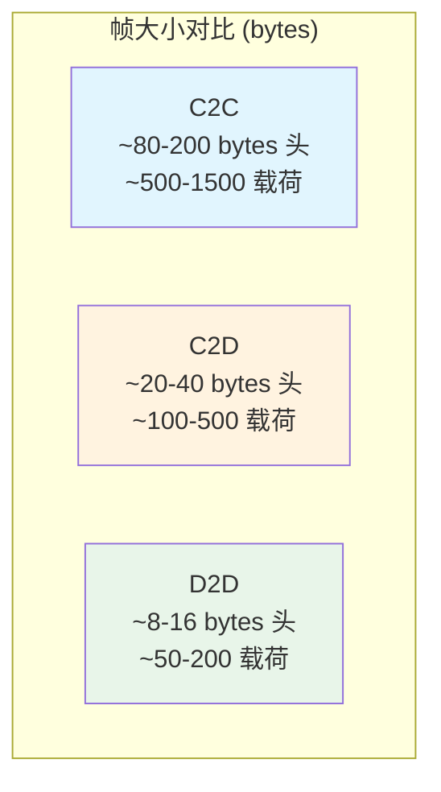

# UADP 帧结构详解：C2C / C2D / D2D 对比分析

> **版本**: 2026-06-06
> **对齐标准**: OPC UA Part 14 (PubSub) v1.05, OPC UA FX Part 80-84, IEC 62541-14
> **定位**: 从复用视角解构 UA Datagram Protocol (UADP) 的帧格式差异

---

## 目录

- [UADP 帧结构详解：C2C / C2D / D2D 对比分析](#uadp-帧结构详解c2c--c2d--d2d-对比分析)
  - [目录](#目录)
  - [1. UADP 协议概述](#1-uadp-协议概述)
  - [2. UADP NetworkMessage 帧头结构](#2-uadp-networkmessage-帧头结构)
    - [2.1 固定头（Fixed Header）](#21-固定头fixed-header)
    - [2.2 条件字段：PublisherId](#22-条件字段publisherid)
    - [2.3 GroupHeader 结构](#23-groupheader-结构)
    - [2.4 PayloadHeader 与 Payload](#24-payloadheader-与-payload)
  - [3. C2C / C2D / D2D 三种模式的帧差异](#3-c2c--c2d--d2d-三种模式的帧差异)
    - [3.1 帧头字段启用对比](#31-帧头字段启用对比)
    - [3.2 帧大小与周期](#32-帧大小与周期)
    - [3.3 C2C 帧实例解析](#33-c2c-帧实例解析)
    - [3.4 C2D 帧实例解析](#34-c2d-帧实例解析)
    - [3.5 D2D 极简帧解析](#35-d2d-极简帧解析)
  - [4. 与经典 OPC UA TCP 的对比](#4-与经典-opc-ua-tcp-的对比)
  - [5. 复用视角：跨场景可复用元素](#5-复用视角跨场景可复用元素)
    - [5.1 完全可复用元素](#51-完全可复用元素)
    - [5.2 参数化可复用元素](#52-参数化可复用元素)
    - [5.3 不可复用/需谨慎适配元素](#53-不可复用需谨慎适配元素)
  - [6. 形式化约束与验证要点](#6-形式化约束与验证要点)
    - [与形式化验证章节的交叉引用](#与形式化验证章节的交叉引用)
  - [7. 参考文献](#7-参考文献)
  - [补充章节](#补充章节)
  - [概念定义](#概念定义)
  - [示例](#示例)
  - [反例](#反例)
  - [权威来源](#权威来源)

---

## 1. UADP 协议概述

UADP（UA Datagram Protocol）是 OPC UA PubSub 的核心传输映射之一，定义于 OPC UA Part 14（IEC 62541-14）。
与面向连接的 OPC UA TCP（Client/Server 模式）不同，UADP 采用无连接的 UDP/IP 或原始以太网（Layer 2）传输，专为周期性、确定性的实时数据交换设计。

OPC UA FX 将 UADP 作为其底层传输协议，覆盖三种通信场景：

| 通信模式 | 全称 | 典型周期 | 适用层级 |
|---------|------|---------|---------|
| **C2C** | Controller-to-Controller | 10–100 ms | 单元间/产线间协调 |
| **C2D** | Controller-to-Device | 500 μs – 10 ms | 控制器到 IO/驱动 |
| **D2D** | Device-to-Device | 250 μs – 1 ms | 设备间直连 |

UADP 的核心设计目标是在保持 OPC UA 信息模型语义完整性的同时，将协议开销降至最低，以满足现场级通信的严苛时延要求。
[OPC Foundation, Part 14 v1.05]

---

## 2. UADP NetworkMessage 帧头结构

UADP NetworkMessage 的帧格式采用紧凑二进制编码，所有字段按网络字节序（Big-Endian）排列。
帧结构分为**固定头（Fixed Header）**、**扩展头（Extended Header）**和**载荷（Payload）**三部分。

### 2.1 固定头（Fixed Header）

```text
 0                   1                   2                   3
 0 1 2 3 4 5 6 7 8 9 0 1 2 3 4 5 6 7 8 9 0 1 2 3 4 5 6 7 8 9 0 1
+-+-+-+-+-+-+-+-+-+-+-+-+-+-+-+-+-+-+-+-+-+-+-+-+-+-+-+-+-+-+-+-+
|  Ver  |UADPFlg|  ExtendedFlags1 |  [PublisherId ...]            |
+-+-+-+-+-+-+-+-+-+-+-+-+-+-+-+-+-+-+-+-+-+-+-+-+-+-+-+-+-+-+-+-+
```

| 字段 | 类型 | 位宽 | 说明 |
|------|------|------|------|
| **UADPVersion** | Bit[0-3] | 4 bits | UADP 版本号，当前固定为 `1` |
| **UADPFlags** | Bit[4-7] | 4 bits | Bit 4: PublisherId 启用；Bit 5: GroupHeader 启用；Bit 6: PayloadHeader 启用；Bit 7: ExtendedFlags1 启用 |
| **ExtendedFlags1** | Byte | 8 bits | Bit 0-2: PublisherId 类型（`001`=UInt16, `011`=UInt64）；Bit 3: DataSetClassId 启用；Bit 4: SecurityHeader 启用；Bit 5: Timestamp 启用；Bit 6: PicoSeconds 启用；Bit 7: ExtendedFlags2 启用 |

### 2.2 条件字段：PublisherId

PublisherId 标识网络中的发布者节点，其类型由 ExtendedFlags1 的 Bit 0-2 决定：

| ExtendedFlags1[0-2] | PublisherId 类型 | 长度 | 典型使用场景 |
|--------------------|------------------|------|-------------|
| `000` | 无 PublisherId | 0 byte | 不推荐 |
| `001` | UInt16 | 2 bytes | C2D/D2D 小型网络 |
| `010` | Byte[1] | 1 byte | 遗留兼容 |
| `011` | UInt64 | 8 bytes | C2C 大型网络、跨域路由 |
| `100-111` | 保留 | — | 未来扩展 |

### 2.3 GroupHeader 结构

当 UADPFlags Bit 5 = 1 时，GroupHeader 存在：

| 字段 | 类型 | 条件 | 说明 |
|------|------|------|------|
| **GroupFlags** | Byte | 始终存在 | Bit 0: WriterGroupId 启用；Bit 1: GroupVersion 启用；Bit 2: NetworkMessageNumber 启用；Bit 3: SequenceNumber 启用 |
| **WriterGroupId** | UInt16 | GroupFlags Bit 0 = 1 | WriterGroup 在 Publisher 内的唯一标识 |
| **GroupVersion** | VersionTime | GroupFlags Bit 1 = 1 | 头与载荷布局配置的版本号 |
| **NetworkMessageNumber** | UInt16 | GroupFlags Bit 2 = 1 | 同一 PublishingInterval 内的消息分片编号 |
| **SequenceNumber** | UInt16 | GroupFlags Bit 3 = 1 | 单调递增序列号，用于丢包检测与重排序 |

> **VersionTime** 类型：64 位无符号整数，表示自 1601-01-01 00:00:00 UTC 以来的 100 纳秒间隔数，与 OPC UA DateTime 同构。

### 2.4 PayloadHeader 与 Payload

当 UADPFlags Bit 6 = 1 时，PayloadHeader 存在，用于描述 DataSetMessage 的排列方式。
在 OPC UA FX 的固定布局（Fixed Layout）配置中，为降低解析开销，通常将 PayloadHeader 禁用（Bit 6 = 0），订阅方通过离线工程（Offline Engineering）预先获知消息布局。
[OPC Foundation, Part 14 Annex A]

---

## 3. C2C / C2D / D2D 三种模式的帧差异

三种通信模式在 UADP 帧级别并非使用不同的协议，而是通过**头字段的启用组合**、**PublisherId 类型选择**和**载荷大小**来体现差异。

### 3.1 帧头字段启用对比

| 头字段 | C2C (10–100 ms) | C2D (500 μs–10 ms) | D2D (250 μs–1 ms) |
|--------|----------------|-------------------|------------------|
| **UADPVersion** | 1 | 1 | 1 |
| **PublisherId** | UInt64（跨域唯一） | UInt16（域内唯一） | UInt16 或 Byte |
| **GroupHeader** | 启用 | 启用 | 可选（极简模式禁用） |
| **WriterGroupId** | 启用 | 启用 | 可选 |
| **GroupVersion** | 启用（配置变更频繁） | 启用 | 禁用（设备固件固定） |
| **NetworkMessageNumber** | 启用（大数据集分片） | 可选 | 禁用 |
| **SequenceNumber** | 启用 | 启用 | 可选 |
| **PayloadHeader** | 启用（动态布局支持） | 禁用（固定布局） | 禁用（固定布局） |
| **Timestamp** | 启用 | 启用 | 禁用（纳秒级由 TSN 提供） |
| **SecurityHeader** | 签名+加密 | 签名（可选加密） | 仅签名（性能优先） |

### 3.2 帧大小与周期



| 指标 | C2C | C2D | D2D |
|------|-----|-----|-----|
| **典型帧大小** | 500 – 1500 bytes | 100 – 500 bytes | 50 – 200 bytes |
| **头开销占比** | ~10–20% | ~15–30% | ~10–25% |
| **Payload 结构** | 多 DataSet（复杂数据结构） | 单 DataSet（IO 数据） | 单 DataSet 或原始值 |
| **时间戳来源** | UADP Timestamp 字段 | UADP Timestamp 字段 | IEEE 802.1AS gPTP（硬件） |
| **同步精度要求** | ±1 μs | ±1 μs | ±100 ns |

### 3.3 C2C 帧实例解析

C2C 场景下，UADP 帧需要支持跨子网路由和复杂数据结构，因此头信息最为完整：

```text
[UADPVersion=1][UADPFlags=0xB9]  // PublisherId + GroupHeader + ExtendedFlags1 启用
[ExtendedFlags1=0x23]            // PublisherId=UInt64, SecurityHeader 启用
[PublisherId=0x000000000000000A] // 64-bit 全局唯一发布者 ID
[GroupFlags=0x0F]                // WriterGroupId + GroupVersion + NetworkMessageNumber + SequenceNumber
[WriterGroupId=0x0001]
[GroupVersion=0x...VersionTime...]
[NetworkMessageNumber=0x0001]
[SequenceNumber=0x00A3]
[SecurityHeader...]
[Payload: Multi-DataSet]
```

### 3.4 C2D 帧实例解析

C2D 场景下，控制器向 IO 模块或伺服驱动发送周期性数据，采用固定布局（Fixed Layout）以最小化解析开销：

```text
[UADPVersion=1][UADPFlags=0xB0]  // PublisherId + GroupHeader + ExtendedFlags1 启用
[ExtendedFlags1=0x01]            // PublisherId=UInt16
[PublisherId=0x000A]             // 16-bit 域内发布者 ID
[GroupFlags=0x0B]                // WriterGroupId + GroupVersion + SequenceNumber
[WriterGroupId=0x0001]
[GroupVersion=0x...VersionTime...]
[SequenceNumber=0x00A3]
[Payload: Single DataSet (Fixed Layout)]
```

根据 OPC UA Part 14 Annex A 的固定布局约定，C2D 帧省略 PayloadHeader、Timestamp 和 DataSetClassId，订阅方通过 AML（AutomationML）离线工程文件获知布局。
[OPC Foundation, Part 14 Annex A]

### 3.5 D2D 极简帧解析

D2D 场景（如视觉传感器直连伺服驱动）追求最低时延，允许使用极简头：

```text
[UADPVersion=1][UADPFlags=0x90]  // PublisherId + ExtendedFlags1 启用，GroupHeader 禁用
[ExtendedFlags1=0x01]            // PublisherId=UInt16
[PublisherId=0x000A]
[Payload: Raw Data + Status Byte]  // 无 PayloadHeader，预定义布局
```

在此模式下，**GroupHeader 完全省略**，意味着：

- 无 WriterGroupId 过滤（依赖物理网络隔离或 VLAN）
- 无 SequenceNumber（依赖 TSN 的确定性保证）
- 无 GroupVersion（设备固件固定，不支持在线重配置）

---

## 4. 与经典 OPC UA TCP 的对比

| 维度 | OPC UA TCP (Client/Server) | UADP (PubSub) |
|------|---------------------------|---------------|
| **传输层** | TCP/IP | UDP/IP 或 Ethernet Layer 2 |
| **连接模式** | 面向连接（会话/安全通道） | 无连接（发布/订阅） |
| **握手延迟** | TLS + UA Secure Channel 握手（>100 ms） | 无握手（预配置密钥） |
| **帧头大小** | ~60-100 bytes（含 TCP/IP 头） | ~8-40 bytes（UADP 头） |
| **编码方式** | UA Binary / XML / JSON | UADP 紧凑二进制 |
| **确定性** | 无（依赖 TCP 拥塞控制） | 有（TSN + 固定周期） |
| **语义 richness** | 高（完整节点服务） | 中（预配置 DataSet） |
| **适用场景** | 配置、诊断、历史数据 | 实时过程数据、安全数据 |

> **关键洞察**: OPC UA FX 采用**双栈策略**——C2C/C2D/D2D 实时数据走 UADP PubSub，配置与诊断走 OPC UA TCP Client/Server。
> 这种分层复用是 OPC UA FX 架构的核心设计决策。[OPC Foundation FLC Technical Paper]

---

## 5. 复用视角：跨场景可复用元素

### 5.1 完全可复用元素

以下 UADP 帧元素在所有三种通信模式中保持一致，可作为**协议栈库**的硬编码常量复用：

| 可复用元素 | 复用层级 | 说明 |
|-----------|---------|------|
| UADPVersion = 1 | 协议栈常量 | 所有 FX 帧固定 |
| 字节序（Big-Endian） | 编解码器 | 跨平台一致 |
| VersionTime 编码 | 时间戳库 | C2C/C2D 共用 |
| SecurityHeader 结构 | 安全模块 | 签名/加密算法标识 |
| CRC/校验机制 | 链路层 | 与具体模式无关 |

### 5.2 参数化可复用元素

以下元素需要**运行时配置**，但解析/编码逻辑可复用：

| 可复用元素 | 配置参数 | 复用策略 |
|-----------|---------|---------|
| PublisherId 类型 | `publisherIdType ∈ {UInt16, UInt64}` | 单一编解码器，按配置切换 |
| GroupFlags 启用位 | `groupHeaderEnabled`, `sequenceNumberEnabled` | 位掩码生成器复用 |
| Payload 布局 | `fixedLayoutURI` | 布局描述文件复用 |

### 5.3 不可复用/需谨慎适配元素

| 元素 | 不可复用原因 | 适配策略 |
|------|-------------|---------|
| GroupVersion 更新策略 | C2C 支持在线重配置，D2D 固件固定 | C2C 需版本协商状态机，D2D 省略 |
| Security 模式 | D2D 仅签名，C2C 签名+加密 | 安全配置文件按场景选择 |
| 时间戳精度 | D2D 依赖硬件 gPTP，不携带 Timestamp 字段 | D2D 需硬件时间戳 API |
| Payload 复杂度 | C2C 多 DataSet，D2D 原始值 | 代码生成器按 Companion Spec 生成 |

---

## 6. 形式化约束与验证要点

> **公理 UADP.1** (Header Integrity): UADP 帧头的 Version 字段必须为 1；任何 Version ≠ 1 的帧必须被静默丢弃。此约束保证协议演进的向后兼容性。
> **公理 UADP.2** (GroupVersion Monotonicity): GroupVersion 作为 VersionTime 类型，在 WriterGroup 生命周期内必须单调不减。配置更新时，新的 GroupVersion 必须严格大于当前值，否则订阅方将拒绝消息。
> **定理 UADP.1** (Fixed Layout Determinism): 若 Publisher 与 Subscriber 均使用 Annex A 固定布局（PayloadHeader 禁用），则帧的端到端解析时间为 O(1)，与 Payload 复杂度无关。证明：固定布局下，所有字段偏移量预先计算，无需运行时解析元数据。
> **定理 UADP.2** (D2D Minimal Header Bound): D2D 极简模式下，UADP 头最小长度为 4 bytes（Version/Flags + ExtendedFlags1 + UInt16 PublisherId）。此上界保证在 100 Mbps 链路上，头传输时间 < 0.32 μs，满足运动控制的纳秒级预算。

### 与形式化验证章节的交叉引用

UADP 帧解析器的正确性可通过 `struct/07-formal-verification/` 中的方法验证：

- **TLA+**: 验证 SequenceNumber 的单调性与丢包检测逻辑（参见 `07-formal-verification/README.md` 中 TLA+ 定位）
- **Rust 类型系统**: 使用 `nom` 或 `deku` 等解析器组合子库，利用 Rust 的所有权-借用机制在编译期排除缓冲区溢出（参见 `07-formal-verification/04-rust-type-system/formal-semantics.md`）
- **SPARK/Ada**: 对安全关键场景（SIL2+），可用 SPARK 证明 UADP 解码子程序的契约满足性

---

## 7. 参考文献

1. [OPC Foundation] OPC UA Part 14: PubSub, v1.05 – UADP Message Mapping, <https://reference.opcfoundation.org/Core/Part14/v105/docs/7.2.4>
2. [OPC Foundation] OPC UA Part 14 Annex A: Header Layouts for Periodic Data with Fixed Layout, <https://reference.opcfoundation.org/Core/Part14/v105/docs/A.2.1>
3. [OPC Foundation] OPC Foundation FLC Technical Paper – A Theory of Operations OPC UA FX (C2C), 2023, <https://opcfoundation.org/wp-content/uploads/2023/11/OPCF-FLC-Technical-Paper-C2C-EN.pdf>
4. [IEC] IEC 62541-14: OPC Unified Architecture – Part 14: PubSub
5. [IEEE] IEEE 802.1AS-Rev – Timing and Synchronization for Time-Sensitive Applications
6. [B&R] OPC UA FX Technology Overview, <https://www.br-automation.com/en/technologies/opc-ua-fx/>
7. [OPC Foundation] OPC UA FX Field Level Communications Status Update, 2025, <https://jp.opcfoundation.org/wp-content/uploads/sites/2/2023/12/2-4_OPC-UA_20-year_standardization_StatusUpdate.pdf>

---

> 最后更新: 2026-06-06
> 下次更新时机: OPC UA FX C2D/D2D 规范正式发布后修订帧实例


---

## 补充章节

## 概念定义

**定义**：工业 IoT/OT-IT 复用是在制造、能源、交通等运营技术（OT）与信息技术（IT）融合场景中，复用 ISA-95 层级模型、OPC UA 信息模型、功能安全组件与数字孪生资产。

## 示例

**示例**：汽车工厂将 ISA-95 L0-L4 资产目录映射到 IEC 63278 资产管理壳（AAS），通过 OPC UA FX 实现现场设备与 MES/ERP 的即插即用复用。

## 反例

**反例**：将 IT 系统直接补丁策略套用到 PLC 产线，未考虑实时性约束与功能安全认证，导致停机与安全事故。

## 权威来源

> **权威来源**:
>
> - [ISA-95 / IEC 62264](https://www.isa.org/standards-and-publications/isa-standards/isa-95)
> - [OPC Foundation](https://opcfoundation.org)
> - [IEC 61508](https://webstore.iec.ch/publication/66912)
> - [IEC 63278 AAS](https://iec.ch/dyn/www/f?p=103:38:0::::FSP_ORG_ID:1363)
> - 核查日期：2026-07-07
