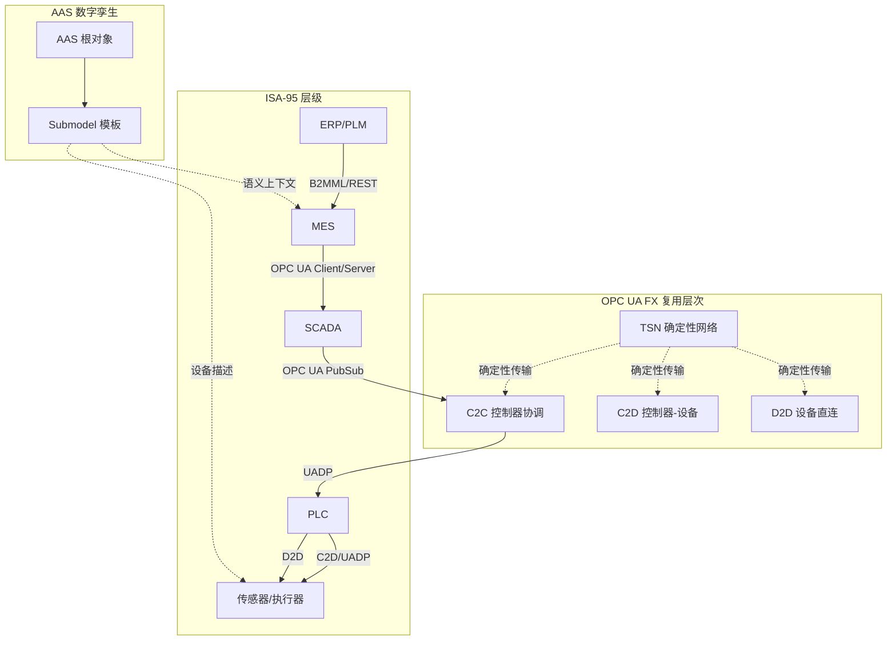
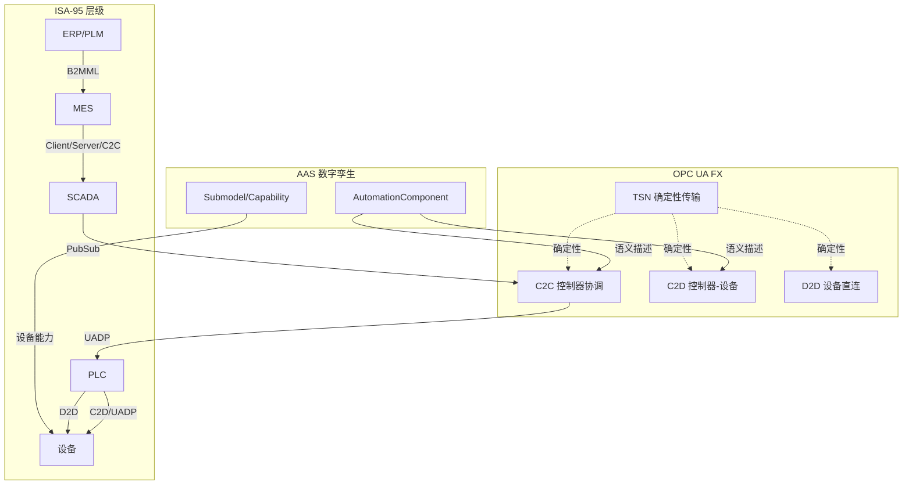

# OPC UA FX 复用层次分析

> **版本**: 2026-06-06
> **对齐标准**: OPC UA FX 1.0 (2026), IEC 62541-100, IEC/IEEE 60802 TSN
> **定位**: 分析 OPC UA FX 在现场级通信中的四层复用模型

---

## 目录

- [OPC UA FX 复用层次分析](#opc-ua-fx-复用层次分析)
  - [目录](#目录)
  - [1. OPC UA FX 的技术栈](#1-opc-ua-fx-的技术栈)
  - [2. 四层复用模型](#2-四层复用模型)
    - [Level 1: 物理硬件复用](#level-1-物理硬件复用)
    - [Level 2: 通信协议复用](#level-2-通信协议复用)
    - [Level 3: 信息模型复用](#level-3-信息模型复用)
    - [Level 4: 应用逻辑复用](#level-4-应用逻辑复用)
  - [3. C2C / C2D / D2D 的复用差异](#3-c2c--c2d--d2d-的复用差异)
  - [4. 2026 厂商支持矩阵](#4-2026-厂商支持矩阵)
  - [5. 现场层复用决策树](#5-现场层复用决策树)
  - [6. 形式化约束](#6-形式化约束)
  - [7. OPC UA FX 复用层次、C2C、Offline Engineering 与 ISA-95/AAS 映射补强](#7-opc-ua-fx-复用层次c2coffline-engineering-与-isa-95aas-映射补强)
    - [7.1 OPC UA FX 复用层次详细定义](#71-opc-ua-fx-复用层次详细定义)
    - [7.2 C2C (Controller-to-Controller) 详解](#72-c2c-controller-to-controller-详解)
    - [7.3 Offline Engineering（离线工程）](#73-offline-engineering离线工程)
    - [7.4 与 ISA-95 的映射](#74-与-isa-95-的映射)
    - [7.5 与 AAS 的映射](#75-与-aas-的映射)
    - [7.6 正例](#76-正例)
    - [7.7 反例](#77-反例)
    - [7.8 OPC UA FX 复用层次与映射 Mermaid 图](#78-opc-ua-fx-复用层次与映射-mermaid-图)
    - [7.9 权威来源与交叉引用补强](#79-权威来源与交叉引用补强)
  - [8. OPC UA FX 复用层次属性表、C2C/Offline Engineering 与 ISA-95/AAS 映射完整视图](#8-opc-ua-fx-复用层次属性表c2coffline-engineering-与-isa-95aas-映射完整视图)
    - [8.1 四层复用属性表](#81-四层复用属性表)
    - [8.2 C2C 关键属性表](#82-c2c-关键属性表)
    - [8.3 Offline Engineering 与复用的关系](#83-offline-engineering-与复用的关系)
    - [8.4 与 ISA-95/AAS 的映射关系](#84-与-isa-95aas-的映射关系)
    - [8.5 正例](#85-正例)
    - [8.6 反例](#86-反例)
    - [8.7 OPC UA FX 复用层次与 ISA-95/AAS 映射 Mermaid 图](#87-opc-ua-fx-复用层次与-isa-95aas-映射-mermaid-图)
    - [8.8 权威来源与交叉引用](#88-权威来源与交叉引用)

---

## 1. OPC UA FX 的技术栈

```text
OPC UA FX 技术栈
├── 物理层: 标准以太网 (1GbE/10GbE) + Single-Pair Ethernet (Ethernet-APL)
│   └── 复用: 商用现成以太网芯片，无需专用 ASIC
│
├── 确定性层: TSN (Time-Sensitive Networking) ──→ IEC/IEEE 60802
│   ├── 802.1AS-Rev: 亚微秒级时间同步 (gPTP)
│   ├── 802.1Qbv: 时间感知整形器 (Time-Aware Shaper)
│   ├── 802.1CB: 帧复制与消除 (冗余)
│   ├── 802.1Qcc: 集中式网络配置 (CNC)
│   └── 复用: TSN 配置文件的跨厂商标准化
│
├── 传输层: OPC UA PubSub over UDP
│   ├── UADP: 确定性二进制编码
│   ├── 安全模式: 确定性安全（无握手延迟）
│   └── 复用: OPC UA 信息模型跨层复用
│
└── 应用层: FX 通信配置文件
    ├── C2C (Controller-to-Controller): 控制器间协调，10-100ms 周期
    ├── C2D (Controller-to-Device): 控制器到 IO/驱动，500μs-10ms 周期
    └── D2D (Device-to-Device): 设备间直连，250μs-1ms 周期
```

---

## 2. 四层复用模型

### Level 1: 物理硬件复用

| 复用单元 | 标准组件 | 价值 |
|---------|---------|------|
| 标准以太网交换机 | TSN-capable 商用交换机 | 替代专用现场总线交换机 |
| 标准以太网电缆 | CAT6A, Single-Pair Ethernet (Ethernet-APL) | 降低布线成本和备件库存 |
| 标准以太网 PHY 芯片 | 1GbE/10GbE 商用芯片 | 无需厂商专用 ASIC |

**复用边界**: 硬件复用受 TSN 能力约束。非 TSN 交换机只能用于背景流量，不能用于时间触发通信。

### Level 2: 通信协议复用

| 复用单元 | 内容 | 价值 |
|---------|------|------|
| TSN 配置模板 | 802.1Qbv 门控表、802.1AS 时钟域 | 跨厂商网络规划复用 |
| OPC UA PubSub 配置 | 发布者/订阅者、数据集定义 | 一次配置，多设备部署 |
| UADP 协议栈库 | 编码/解码、序列号管理 | 跨平台软件复用 |

**复用边界**: TSN 配置必须与具体的网络拓扑、设备周期、流量特征绑定。模板需要参数化适配。

### Level 3: 信息模型复用

| 复用单元 | 内容 | 价值 |
|---------|------|------|
| Companion Specifications | 设备类型定义、语义互操作 | 跨厂商语义一致性 |
| FX Connection Manager | 连接配置、流预留、冗余模式 | 连接管理的工程模板 |
| 设备描述文件 | 类型库、配置向导 | 快速设备集成 |

**复用边界**: Companion Specification 的成熟度决定复用深度。新兴设备类型可能缺乏标准化信息模型。

### Level 4: 应用逻辑复用

| 复用单元 | 内容 | 价值 |
|---------|------|------|
| C2C/C2D/D2D 配置模板 | 连接配置文件 | 相同通信模式的快速复制 |
| 控制回路模板 | PID 参数集、运动控制轨迹 | 控制算法的参数化复用 |
| Golden Path | 工程模板、项目模板 | 从设计到部署的标准化路径 |

**复用边界**: 应用逻辑复用必须考虑具体工艺的安全约束和性能要求。模板复用不等于无审查部署。

---

## 3. C2C / C2D / D2D 的复用差异

| 维度 | C2C (Controller-to-Controller) | C2D (Controller-to-Device) | D2D (Device-to-Device) |
|------|--------------------------------|---------------------------|------------------------|
| **周期** | 10-100 ms | 500 μs - 10 ms | 250 μs - 1 ms |
| **帧大小** | 500-1500 bytes | 100-500 bytes | 50-200 bytes |
| **Publisher ID** | 控制器 NodeID | 控制器 NodeID | 设备 NodeID（直接发布） |
| **Group Version** | 高（配置变更频繁） | 中 | 低（设备配置固定） |
| **Timestamp 精度** | 微秒级 | 微秒级 | 纳秒级（运动控制） |
| **Payload** | 复杂数据结构（多个 DataSet） | 简单 IO 数据（单个 DataSet） | 极简（原始值+状态） |
| **Security** | 签名+加密 | 签名（可选加密） | 签名（性能优先） |
| **冗余** | 802.1CB 帧复制 | 802.1CB 帧复制 | 802.1CB 帧复制 |
| **复用成熟度** | 高（2026 已量产） | 中（2026 试点） | 低（规划中） |
| **典型场景** | PLC 间协调、产线同步 | 伺服驱动、IO 模块 | 视觉→机器人、安全扫描→驱动 |

---

## 4. 2026 厂商支持矩阵

| 厂商 | C2C 状态 | C2D 状态 | D2D 状态 | 代表产品 | 复用策略 |
|------|----------|----------|----------|----------|----------|
| **Siemens** | 已发布 (S7-1500 TM) | 2026 试点 (ET 200) | 规划中 | S7-1500, Scalance XCM | 原生 FX + Profinet 共存 |
| **Rockwell** | 2026 Q1 (ControlLogix) | 2026 H2 (FLEXHA 5000) | 规划中 | ControlLogix, Stratix | 固件升级现有平台 |
| **Beckhoff** | 已发布 (TwinCAT 3) | 已发布 (CX TSN 网关) | 规划中 | CX 系列, EK/EL 耦合器 | EtherCAT + FX 混合 |
| **Phoenix Contact** | 已发布 (PLCnext) | 试点 (Axioline F2) | 规划中 | PLCnext, FL SWITCH TSN | 开放多厂商策略 |
| **B&R (ABB)** | 已发布 (X20/X90) | 2026 (ACOPOS M4) | 规划中 | X20, ACOPOS M4 | 伺服驱动原生支持 |

**关键洞察**:

- C2C 在所有厂商中率先落地，因为周期要求宽松（10-100ms），政治价值高（跨厂商互操作）
- C2D 面临现有现场总线（EtherCAT/Profinet）的强竞争，仅在绿地或扩展场景中采用
- D2D 仍处于早期，依赖 Companion Specifications 的成熟度

---

## 5. 现场层复用决策树

```text
现场层通信复用决策树
│
├── 场景: 新建工厂 (Greenfield)
│   ├── 需要运动控制 (<250μs)?
│   │   ├── 是 → 内循环: EtherCAT/Profinet IRT; 外循环: OPC UA FX C2C
│   │   └── 否 → 全厂 OPC UA FX (C2C + C2D)
│   └── 多厂商环境?
│       ├── 是 → OPC UA FX 强制（避免 vendor lock-in）
│       └── 否 → 可选单一厂商总线或 FX
│
├── 场景: 现有工厂改造 (Brownfield)
│   ├── 保留现有现场总线?
│   │   ├── 是 → 网关模式: 现有总线 + FX 网关 + TSN 骨干网
│   │   └── 否 → 完全替换（仅当控制器到期更换时）
│   └── 新增产线/扩展?
│       ├── 是 → 新增单元用 FX，通过网关与现有系统集成
│       └── 否 → 维持现状，仅升级监控层
│
└── 场景: 混合场景 (Hybrid)
    ├── 核心策略: "网关-led 渐进迁移"
    ├── 第一步: FX C2C 连接各现有单元（通过网关）
    ├── 第二步: 新增单元原生 FX
    ├── 第三步: 控制器到期更换时，内循环评估 C2D 迁移
    └── 时间跨度: 10-15 年完整迁移
```

---

## 6. 形式化约束

> **公理 FX.1** (Determinism Preservation): OPC UA FX 的复用必须保持端到端确定性。任何在复用过程中引入的额外协议转换（网关、代理）必须证明其时延上界小于应用容忍阈值。
> **公理 FX.2** (Semantic Compatibility): 跨厂商复用的前提是 Companion Specification 的语义兼容性。仅语法兼容（相同 UADP 帧格式）不足以保证互操作；必须验证信息模型的语义等价性。
> **定理 FX.1** (C2C-C2D Migration Cost): 从 C2C 升级到 C2D 的迁移成本与现有现场总线的生命周期剩余时间成反比。形式化：MigrationCost(t) = K / RemainingLifetime(t)，其中 K 为设备更换和工程重做的固定成本。
> **定理 FX.2** (Gateway Eternity): 在棕地工厂中，协议网关不是临时过渡措施，而是**永久性架构组件**。声称"最终消除网关"的架构愿景违背工业现实。
> **定理 TSN.1** (GCL Cycle Consistency): 若网络中有 N 个设备参与时间触发通信，则所有设备的 GCL 周期 T 必须满足：T = k × T_base，其中 k ∈ ℕ⁺。且 |BaseTimeᵢ - BaseTimeⱼ| < ε，ε 为 gPTP 同步精度（通常 < 1μs）。违反此约束将导致时间槽重叠或空闲。
> **定理 TSN.2** (Guard Band Necessity): 保护带长度 G 必须满足：G ≥ MTU_max / LineRate + PropagationDelay_max + Jitter_max。

---

> 最后更新: 2026-06-06
> 下次更新时机: OPC UA FX C2D/D2D 正式发布 / 新厂商支持声明


## 7. OPC UA FX 复用层次、C2C、Offline Engineering 与 ISA-95/AAS 映射补强

### 7.1 OPC UA FX 复用层次详细定义

OPC UA FX 的复用不仅限于协议栈，而是覆盖从物理硬件到应用逻辑的多层抽象。每一层的复用边界由确定性、语义一致性和安全约束共同决定。

| 复用层次 | 复用单元 | 价值 | 边界条件 |
|---------|---------|------|---------|
| **L1: 物理硬件复用** | TSN 交换机、Ethernet-APL 电缆、标准 PHY | 降低硬件成本，避免专用 ASIC | 必须支持 IEC/IEEE 60802 TSN 配置文件 |
| **L2: 通信协议复用** | TSN 门控表、UADP 协议栈、PubSub 配置 | 跨厂商网络规划复用 | 配置必须按拓扑、周期、流量参数化 |
| **L3: 信息模型复用** | Companion Specifications、FX Connection Manager、设备类型库 | 跨厂商语义互操作 | Companion Spec 成熟度决定复用深度 |
| **L4: 应用逻辑复用** | C2C/C2D/D2D 配置模板、控制回路模板、Golden Path | 相同通信模式的快速复制 | 必须考虑工艺安全约束和性能要求 |

> **定义 FX.Reuse.1** (FX 复用边界): OPC UA FX 的复用边界是保持端到端确定性、语义兼容性和功能安全的前提下，可被复制到不同设备或产线的最大抽象单元。

### 7.2 C2C (Controller-to-Controller) 详解

C2C 是 OPC UA FX 中**最先量产、成熟度最高**的通信模式，主要用于 PLC 之间的协调与同步。

| 属性 | 说明 |
|------|------|
| **周期** | 10–100 ms |
| **Publisher ID** | 控制器 NodeID |
| **Payload** | 复杂数据结构，可包含多个 DataSet |
| **典型场景** | 产线同步、机器人协调、AGV 调度、跨单元物料跟踪 |
| **通信模式** | PubSub over UDP (UADP) |
| **冗余** | 802.1CB 帧复制与消除 |
| **安全** | 签名 + 加密（可选） |

**C2C 复用价值**：

- 不同厂商 PLC 可通过标准化 C2C 接口互操作，降低 vendor lock-in。
- C2C 配置模板可在相似产线间复制，减少工程时间。
- 与 ISA-95 L1/L2 的控制器协调场景天然对齐。

### 7.3 Offline Engineering（离线工程）

Offline Engineering 是 OPC UA FX 在部署前完成网络规划、设备配置和通信参数化的关键能力。它使工程团队能够在不影响生产的情况下设计、验证和复用 FX 配置。

| 阶段 | 活动 | 复用资产 |
|------|------|---------|
| 1. 网络设计 | TSN 拓扑规划、流量分析、GCL 计算 | TSN 配置模板、网络规划工具 |
| 2. 设备描述 | 导入 Companion Specifications、设备类型库 | 设备描述文件 (DDF)、类型库 |
| 3. 连接配置 | 配置 PubSub 连接、DataSet、WriterGroup/ReaderGroup | C2C/C2D 配置模板 |
| 4. 离线验证 | 仿真时序、检查 GCL 一致性、验证冗余 | 仿真模型、验证规则 |
| 5. 现场部署 | 将离线配置下载到现场设备 | 工程模板、Golden Path |

> **定理 FX.Offline.1** (Offline Engineering 复用定理): 若离线工程配置 C 在仿真环境中被证明满足时序约束，则 C 在现场部署时仅需验证物理网络参数（电缆长度、交换机延迟、设备固件版本）的一致性，无需重新设计控制逻辑。

### 7.4 与 ISA-95 的映射

OPC UA FX 主要承载 ISA-95 L0–L2 的实时通信，而 AAS 承载 L2–L4 的语义描述。

| ISA-95 层级 | OPC UA FX 角色 | FX 通信模式 | 复用关注点 |
|------------|---------------|------------|-----------|
| L0 | 现场设备数据接入 | C2D (Controller-to-Device) | 设备描述、I/O 映射 |
| L1 | 控制器间协调 | C2C (Controller-to-Controller) | 控制回路同步、安全联锁 |
| L2 | 区域监控与 SCADA | C2C + Client/Server | 报警、事件、历史数据 |
| L3 | MES 与控制器接口 | C2C + OPC UA Client/Server + AAS | 工单、配方、质量数据 |
| L4 | 企业系统与现场桥接 | AAS + OPC UA Client/Server | 主数据、业务语义 |

### 7.5 与 AAS 的映射

AAS 为 OPC UA FX 中的设备和系统提供语义上下文。FX 的 AutomationComponent 概念与 AAS Submodel 存在概念对齐。

| OPC UA FX 概念 | AAS 对应 | 说明 |
|---------------|---------|------|
| AutomationComponent | AssetAdministrationShell | FX 组件的数字代表 |
| Connection | RelationshipElement | 组件间的通信关系 |
| DataSet | SubmodelElement (Property/Blob) | 过程数据或配置数据 |
| Profile / Capability | Submodel (能力描述) | 组件能力声明 |
| Offline Engineering 配置 | File / Submodel | 工程文件与模板 |

### 7.6 正例

| 场景 | 复用资产 | 效果 |
|------|---------|------|
| 多厂商汽车焊装线 | C2C 配置模板 + Companion Spec | 不同品牌 PLC 实现产线同步，工程周期缩短 30% |
| 制药灌装线离线调试 | Offline Engineering 模板 + TSN 配置 | 现场调试时间从 2 周降至 3 天 |
| 设备供应商交付 | AAS Digital Nameplate + OPC UA FX C2D 描述 | 客户可自动识别设备并集成到现有网络 |
| 集团工厂复制 | ISA-95 L2/L3 映射 + FX C2C 模板 | 标准化产线快速复制到新工厂 |

### 7.7 反例

| 反例 | 风险说明 |
|------|---------|
| 将 C2C 配置模板直接用于运动控制 (<250μs) 场景 | C2C 周期不满足运动控制实时性要求，应使用 C2D/D2D 或专用现场总线 |
| 忽视 TSN 网络拓扑差异直接复制 GCL 配置 | 交换机延迟、电缆长度差异导致时间槽冲突 |
| 将 FX 作为唯一通信协议，强制替换所有棕地现场总线 | 棕地环境中协议网关将永久存在，强行替换成本过高 |
| Companion Spec 未覆盖的设备类型强行使用 FX | 语义不一致导致互操作失败 |
| Offline Engineering 配置未经验证直接下载到现场 | 时序或参数错误可能导致停产或安全事故 |

### 7.8 OPC UA FX 复用层次与映射 Mermaid 图



### 7.9 权威来源与交叉引用补强

- OPC UA FX Specification V1.00.03: <https://reference.opcfoundation.org/Core/Part80/>
- IEC/IEEE 60802 TSN Profile for Industrial Automation: <https://www.ieee802.org/1/files/public/docs2023/60802-rev-011.pdf>
- IEC 62541 OPC Unified Architecture: <https://webstore.iec.ch/publication/66912>
- ISA-95 / IEC 62264: <https://www.isa.org/standards-and-publications/isa-standards/isa-95>
- IDTA AAS Submodel Templates: <https://industrialdigitaltwin.org/en/content-hub/submodels>
- 相关概念: [OPC Unified Architecture](https://en.wikipedia.org/wiki/OPC_Unified_Architecture), [Industry 4.0](https://en.wikipedia.org/wiki/Fourth_Industrial_Revolution)
- **交叉引用**: `struct/11-industrial-iot-otit/02-opc-ua-fx/deployment-scenarios/brownfield-greenfield-decision.md`；`struct/11-industrial-iot-otit/02-opc-ua-fx/connection-manager/tla-specification.md`；`struct/11-industrial-iot-otit/05-digital-twin-aas/aas-opcua-mapping.md`；`struct/11-industrial-iot-otit/01-isa-95-model/isa-95-asset-catalog-deep-dive.md` §7

## 8. OPC UA FX 复用层次属性表、C2C/Offline Engineering 与 ISA-95/AAS 映射完整视图

> **定义 FX.Reuse.2** (OPC UA FX 复用边界): OPC UA FX 的复用边界是在保持端到端确定性、语义兼容性与功能安全的前提下，能够将物理硬件、通信协议、信息模型和应用逻辑等抽象单元从一处部署复制到另一处部署的最大范围。超出该边界将引入时序不确定、语义漂移或安全风险。

### 8.1 四层复用属性表

| 复用层次 | 复用单元 | 标准/产物 | 价值 | 边界条件 | Offline Engineering 产物 | AAS 映射 |
|----------|----------|-----------|------|----------|--------------------------|----------|
| L1 物理硬件 | TSN 交换机、Ethernet-APL、标准 PHY | IEC/IEEE 60802 | 降低硬件成本，避免专用 ASIC | 必须支持 TSN 配置文件 | 网络拓扑图、物料清单 | AssetInformation / Nameplate |
| L2 通信协议 | TSN GCL、UADP、PubSub 配置 | IEC 62541-100 | 跨厂商网络规划复用 | 需按拓扑/周期/流量参数化 | TSN 配置文件、仿真报告 | Technical Data |
| L3 信息模型 | Companion Specifications、设备类型库 | OPC UA Companion Spec | 跨厂商语义互操作 | Companion Spec 成熟度决定深度 | 设备描述文件、类型库 | Submodel / ConceptDescription |
| L4 应用逻辑 | C2C/C2D/D2D 模板、控制回路模板 | FX Connection Manager | 相同通信模式快速复制 | 必须考虑工艺安全与性能 | Golden Path、项目模板 | Capability / Submodel |

### 8.2 C2C 关键属性表

| 属性 | 取值/说明 |
|------|-----------|
| 周期 | 10–100 ms |
| 通信模式 | PubSub over UDP (UADP) |
| Publisher | Controller NodeID |
| Payload | 多 DataSet 复杂结构 |
| 安全 | 签名 + 加密（可选） |
| 冗余 | 802.1CB 帧复制与消除 |
| 典型场景 | 产线同步、机器人协调、AGV 调度、跨单元物料跟踪 |
| 复用边界 | 不适用于 <250μs 的运动控制或安全联锁 |

### 8.3 Offline Engineering 与复用的关系

Offline Engineering 是 OPC UA FX 部署前完成网络规划、设备配置和通信参数化的关键能力。其各阶段产物本身就是可复用资产：

| 阶段 | 活动 | 复用产物 |
|------|------|----------|
| 1. 网络设计 | TSN 拓扑规划、流量分析、GCL 计算 | TSN 配置模板、网络规划工具项目 |
| 2. 设备描述 | 导入 Companion Specifications、设备类型库 | 设备描述文件 (DDF)、类型库 |
| 3. 连接配置 | 配置 PubSub 连接、DataSet、WriterGroup/ReaderGroup | C2C/C2D 配置模板 |
| 4. 离线验证 | 仿真时序、检查 GCL 一致性、验证冗余 | 仿真模型、验证规则集 |
| 5. 现场部署 | 将离线配置下载到现场设备 | Golden Path、工程模板 |

### 8.4 与 ISA-95/AAS 的映射关系

| ISA-95 层级 | OPC UA FX 角色 | FX 模式 | AAS 子模型/元素 |
|-------------|----------------|---------|-----------------|
| L0 | 现场设备数据接入 | C2D / D2D | Nameplate、Technical Data |
| L1 | 控制器间协调 | C2C | Technical Data、Identification |
| L2 | 区域监控与 SCADA | C2C + Client/Server | Maintenance、Time Series Data |
| L3 | MES 与控制器接口 | C2C + OPC UA Client/Server | ProductionSchedule、Document |
| L4 | 企业系统与现场桥接 | AAS REST API + OPC UA Client | ProductCarbonFootprint、Document |

### 8.5 正例

| 场景 | 复用资产 | 效果 |
|------|----------|------|
| 多厂商汽车焊装线 | C2C 配置模板 + Companion Spec | 不同品牌 PLC 实现产线同步，工程周期缩短 30% |
| 制药灌装线离线调试 | Offline Engineering 模板 + TSN 配置 | 现场调试时间从 2 周降至 3 天 |
| 设备供应商交付 | AAS Digital Nameplate + OPC UA FX C2D 描述 | 客户可自动识别设备并集成到现有网络 |
| 集团工厂复制 | ISA-95 L2/L3 映射 + FX C2C 模板 | 标准化产线快速复制到新工厂 |

### 8.6 反例

| 反例 | 风险说明 |
|------|----------|
| 将 C2C 配置模板直接用于 <250μs 运动控制 | C2C 周期不满足实时性，应使用 C2D/D2D 或专用总线 |
| 忽视 TSN 网络拓扑差异直接复制 GCL 配置 | 交换机延迟、电缆长度差异导致时间槽冲突 |
| 将 FX 作为唯一通信协议，强制替换所有棕地现场总线 | 棕地环境中协议网关将永久存在，强行替换成本过高 |
| Companion Spec 未覆盖的设备类型强行使用 FX | 语义不一致导致互操作失败 |
| Offline Engineering 配置未经验证直接下载到现场 | 时序或参数错误可能导致停产或安全事故 |

### 8.7 OPC UA FX 复用层次与 ISA-95/AAS 映射 Mermaid 图



### 8.8 权威来源与交叉引用

- OPC UA FX Specification V1.00.03: <https://reference.opcfoundation.org/Core/Part80/>
- IEC/IEEE 60802 TSN Profile for Industrial Automation: <https://www.ieee802.org/1/files/public/docs2023/60802-rev-011.pdf>
- IEC 62541 OPC Unified Architecture: <https://webstore.iec.ch/publication/66912>
- ISA-95 / IEC 62264: <https://www.isa.org/standards-and-publications/isa-standards/isa-95>
- IDTA AAS Submodel Templates: <https://industrialdigitaltwin.org/en/content-hub/submodels>
- 相关概念: [OPC Unified Architecture](https://en.wikipedia.org/wiki/OPC_Unified_Architecture), [Industry 4.0](https://en.wikipedia.org/wiki/Fourth_Industrial_Revolution)
- **交叉引用**: `struct/11-industrial-iot-otit/02-opc-ua-fx/deployment-scenarios/brownfield-greenfield-decision.md`；`struct/11-industrial-iot-otit/02-opc-ua-fx/connection-manager/tla-specification.md`；`struct/11-industrial-iot-otit/05-digital-twin-aas/aas-opcua-mapping.md`；`struct/11-industrial-iot-otit/01-isa-95-model/isa-95-asset-catalog-deep-dive.md` §7


> 最后更新: 2026-07-07
> 下次更新时机: OPC UA FX C2D/D2D 正式发布 / 新厂商支持声明


---

## 补充章节
## 示例

**示例**：包装线集成不同厂商伺服驱动，通过 OPC UA FX 的 PubSub 帧与 PLCopen Motion 接口复用统一运动控制模型，减少 70% 的协议转换网关。

## 反例

**反例**：各设备使用私有现场总线，IT 系统需为每种协议开发适配器，信息模型无法复用，扩展成本高昂。

## 权威来源

> **权威来源**:
>
> - [OPC Foundation UA](https://opcfoundation.org/about/opc-technologies/opc-ua/)
> - [OPC UA FX](https://opcfoundation.org/opc-ua-field-exchange-opc-ua-fx/)
> - 核查日期：2026-07-07