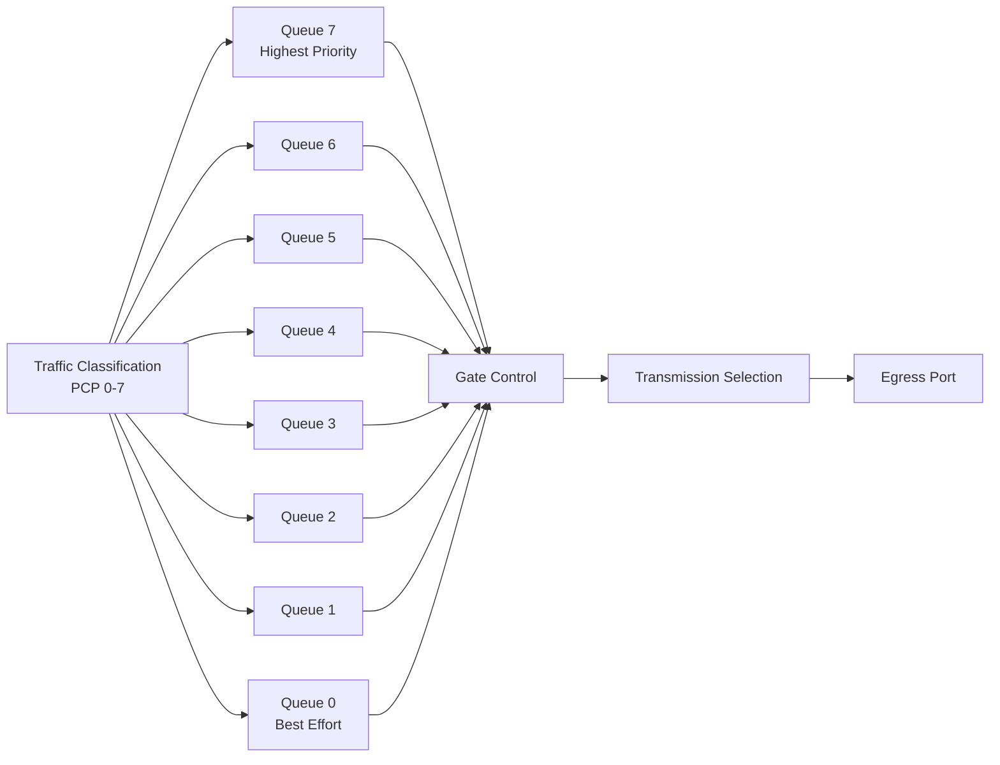

# TSN 门控表（GCL）配置模板

> **版本**: 2026-06-06
> **对齐标准**: IEEE 802.1Qbv-2021, IEEE 802.1AS-Rev, IEC/IEEE 60802 TSN Profile for Industrial Automation
> **定位**: 为 OPC UA FX 三种通信模式提供可直接参数化的 GCL 配置模板

---

## 目录

- [TSN 门控表（GCL）配置模板](#tsn-门控表gcl配置模板)
  - [目录](#目录)
  - [1. GCL 基础概念](#1-gcl-基础概念)
    - [1.1 Time-Aware Shaper (TAS) 架构](#11-time-aware-shaper-tas-架构)
    - [1.2 GCL 核心参数](#12-gcl-核心参数)
  - [2. GCL 配置语法](#2-gcl-配置语法)
    - [2.1 抽象语法（伪代码）](#21-抽象语法伪代码)
    - [2.2 队列优先级映射（IEEE 802.1Q + IEC/IEEE 60802）](#22-队列优先级映射ieee-8021q--iecieee-60802)
    - [2.3 关键约束](#23-关键约束)
  - [3. 工业场景模板](#3-工业场景模板)
    - [3.1 模板一：运动控制（Motion Control）](#31-模板一运动控制motion-control)
    - [3.2 模板二：过程控制（Process Control）](#32-模板二过程控制process-control)
    - [3.3 模板三：机器人协作（Collaborative Robotics）](#33-模板三机器人协作collaborative-robotics)
    - [3.4 模板对比总结](#34-模板对比总结)
  - [4. OPC UA FX 时隙对齐策略](#4-opc-ua-fx-时隙对齐策略)
    - [4.1 周期对齐原则](#41-周期对齐原则)
    - [4.2 时隙分配映射](#42-时隙分配映射)
    - [4.3 配置一致性验证清单](#43-配置一致性验证清单)
  - [5. 配置验证与工具链](#5-配置验证与工具链)
    - [5.1 厂商配置工具](#51-厂商配置工具)
    - [5.2 Linux 内核配置（tc-taprio）](#52-linux-内核配置tc-taprio)
  - [6. 参考文献](#6-参考文献)

---

## 1. GCL 基础概念

### 1.1 Time-Aware Shaper (TAS) 架构

IEEE 802.1Qbv 定义的时间感知整形器（TAS）是 TSN 实现确定性传输的核心机制。每个 TSN 交换机的出端口配备 8 个硬件队列（对应 IEEE 802.1p 优先级 0–7），每个队列由一个**门（Gate）**控制其开/关状态。



### 1.2 GCL 核心参数

| 参数 | 符号 | 说明 | 典型范围 |
|------|------|------|---------|
| **Base Time** | T₀ | GCL 循环开始基准时间 | IEEE 802.1AS 同步后的整数秒边界 |
| **Cycle Time** | T_c | GCL 重复周期 | 250 μs – 10 ms |
| **Gate States** | G_vec | 8 位门控位图 | 0x00 – 0xFF |
| **Time Interval** | Δt | 每个 GCL 条目的持续时间 | ≥ 传输时延 + Guard Band |
| **Guard Band** | G | 保护带，防止帧跨时隙 | ≥ MTU_max / LineRate + PropagationDelay |

> **门控位图编码**: 8 位二进制 `b7b6b5b4b3b2b1b0` 对应 Queue 7 到 Queue 0。`1` 表示开门（允许发送），`0` 表示关门（阻塞）。例如 `0x80` = `10000000` 仅启用最高优先级队列。[IEEE 802.1Qbv]

---

## 2. GCL 配置语法

### 2.1 抽象语法（伪代码）

```
GCL_Configuration := {
    base_time:        IEEE_802_1AS_Time,      // 64-bit nanoseconds since epoch
    cycle_time:       Duration_ns,            // 周期时长
    cycle_time_extension: Duration_ns,        // 配置切换容限
    entries: [                                // 有序列表
        {
            gate_states:   uint8,             // 8-bit 门控向量
            time_interval: Duration_ns        // 本条目持续时间
        },
        ...
    ]
}
```

### 2.2 队列优先级映射（IEEE 802.1Q + IEC/IEEE 60802）

IEC/IEEE 60802 为工业自动化定义了推荐的 PCP（Priority Code Point）到流量类型的映射：

| PCP | 队列 | 流量类型 | 典型应用 | OPC UA FX 映射 |
|-----|------|---------|---------|---------------|
| 7 | Queue 7 | 硬实时 / Network Control | 运动控制同步、安全信号 | D2D 安全数据 |
| 6 | Queue 6 | 硬实时 | 伺服驱动指令、高速 IO | D2D/C2D 周期数据 |
| 5 | Queue 5 | 软实时（视频/视觉） | 机器视觉、质检图像 | C2D 大块 DataSet |
| 4 | Queue 4 | 软实时（控制） | PLC I/O 扫描、过程控制 | C2C 协调数据 |
| 3 | Queue 3 | 预留 / 事件 | 报警、诊断事件 | OPC UA 事件 |
| 2 | Queue 2 | 网络管理 | TSN 配置、gPTP | 802.1Qcc SRP |
| 1 | Queue 1 | Best Effort（低优先级） | 文件传输、日志 | 配置下载 |
| 0 | Queue 0 | Best Effort（默认） | Web、通用 TCP/IP | 背景流量 |

### 2.3 关键约束

> **定理 GCL.1** (Cycle Consistency): 若网络中有 N 个设备参与时间触发通信，则所有设备的 GCL 周期 T_c 必须满足 T_c = k × T_base，其中 k ∈ ℕ⁺。且 |BaseTime_i – BaseTime_j| < ε，ε 为 gPTP 同步精度（通常 < 1 μs）。违反此约束将导致时间槽重叠或空闲。[参见 `struct/11-industrial-iot-otit/02-opc-ua-fx/opc-ua-fx-reuse-hierarchy.md` 定理 TSN.1]

> **定理 GCL.2** (Guard Band Necessity): 保护带长度 G 必须满足：
> G ≥ MTU_max / LineRate + PropagationDelay_max + Jitter_max
> 在 1 Gbps 链路上，MTU_max = 1542 bytes 时，G ≥ 12.34 μs + PD_max + Jitter_max。

---

## 3. 工业场景模板

### 3.1 模板一：运动控制（Motion Control）

**场景特征**: 多轴伺服同步，周期 250 μs–1 ms，抖动 < 1 μs，安全互锁。

**网络假设**: 1 Gbps，5 个伺服节点 + 1 运动控制器，线型拓扑。

**GCL 设计**: 周期 T_c = 1 ms = 1000 μs。划分为 4 个时隙：

| 条目 | 时间区间 (μs) | Gate States (Hex) | 启用队列 | 说明 |
|------|--------------|-------------------|---------|------|
| 0 | 0 – 100 | `0xC0` | Q7, Q6 | D2D 安全 + 运动同步（独占） |
| 1 | 100 – 120 | `0x00` | 全部关闭 | Guard Band（防止跨边界） |
| 2 | 120 – 500 | `0x30` | Q5, Q4 | 视觉数据 + C2C 协调 |
| 3 | 500 – 1000 | `0x0F` | Q3–Q0 | 事件 + 管理 + Best Effort |

**周期利用率**: 关键实时流量占用 50%（500 μs），Guard Band 2%（20 μs），剩余 48% 给非实时流量。

**YAML 配置片段**:

```yaml
# Template: Motion Control GCL (1 Gbps, 1 ms cycle)
gcl_config:
  base_time: "2026-01-01T00:00:00.000000000Z"  # 运行时由 gPTP 对齐
  cycle_time_ns: 1000000                        # 1 ms
  cycle_time_extension_ns: 100000               # 100 μs 切换容限
  entries:
    - gate_states: 0xC0      # 11000000: Q7+Q6
      time_interval_ns: 100000
    - gate_states: 0x00      # Guard Band
      time_interval_ns: 20000
    - gate_states: 0x30      # 00110000: Q5+Q4
      time_interval_ns: 380000
    - gate_states: 0x0F      # 00001111: Q3-Q0
      time_interval_ns: 500000
```

**OPC UA FX 对齐**: D2D 运动数据映射到 Queue 7（250 μs 周期），C2D 伺服指令映射到 Queue 6（1 ms 周期）。由于 1 ms 是 250 μs 的整数倍，满足谐波周期约束。[IEEE 802.1Qbv, Arest et al.]

---

### 3.2 模板二：过程控制（Process Control）

**场景特征**: 温度/压力/流量控制，周期 10–100 ms，高可靠性，允许少量抖动。

**网络假设**: 100 Mbps（Ethernet-APL），10 个现场仪表 + 2 个控制器，星型拓扑。

**GCL 设计**: 周期 T_c = 10 ms = 10000 μs。划分为 5 个时隙：

| 条目 | 时间区间 (μs) | Gate States (Hex) | 启用队列 | 说明 |
|------|--------------|-------------------|---------|------|
| 0 | 0 – 50 | `0x80` | Q7 | 安全仪表系统（SIS）数据 |
| 1 | 50 – 70 | `0x00` | 全部关闭 | Guard Band |
| 2 | 70 – 3070 | `0x70` | Q6, Q5, Q4 | C2D/C2C 过程数据（3 ms 批量） |
| 3 | 3070 – 3090 | `0x00` | 全部关闭 | Guard Band |
| 4 | 3090 – 10000 | `0x1F` | Q4–Q0 | 事件、诊断、Best Effort |

**关键计算**: 在 100 Mbps 链路上，MTU = 1522 bytes 的传输时间为 122 μs。Guard Band 取 20 μs > 122 μs 不成立，因此过程控制模板中需将最大帧长度限制为 256 bytes（传输时间 20.5 μs），或增大 Guard Band 至 150 μs。

```yaml
# Template: Process Control GCL (100 Mbps APL, 10 ms cycle)
gcl_config:
  base_time_ns: 0  # 由 CNC 统一分配
  cycle_time_ns: 10000000
  cycle_time_extension_ns: 1000000
  max_frame_size_bytes: 256        # 限制帧长以匹配 Guard Band
  entries:
    - gate_states: 0x80
      time_interval_ns: 50000
    - gate_states: 0x00           # Guard Band = 150 μs
      time_interval_ns: 150000
    - gate_states: 0x70
      time_interval_ns: 3000000
    - gate_states: 0x00
      time_interval_ns: 150000
    - gate_states: 0x1F
      time_interval_ns: 6680000
```

> **Ethernet-APL 注意**: Ethernet-APL（Advanced Physical Layer）运行在 10 Mbps，专为过程工业设计，支持长距离（最大 1000 m）和防爆环境。OPC UA FX 通过 Ethernet-APL 实现 C2D 通信时，GCL 周期需与 APL 的物理层延迟匹配。[OPC Foundation APL Initiative]

---

### 3.3 模板三：机器人协作（Collaborative Robotics）

**场景特征**: 3–6 台协作机器人 + 1 安全 PLC + 2 视觉系统，周期 1–4 ms，安全停机 < 10 ms。

**网络假设**: 1 Gbps，环型拓扑（冗余），TSN 交换机支持 802.1CB 帧复制。

**GCL 设计**: 周期 T_c = 4 ms = 4000 μs。采用**交替时隙（Alternating Slot）**策略以复用 GCL 条目：

| 条目 | 时间区间 (μs) | Gate States (Hex) | 启用队列 | 说明 |
|------|--------------|-------------------|---------|------|
| 0 | 0 – 200 | `0xC0` | Q7, Q6 | 机器人安全互锁 + 运动指令 |
| 1 | 200 – 250 | `0x00` | 全部关闭 | Guard Band |
| 2 | 250 – 650 | `0x20` | Q5 | 视觉系统数据爆发 |
| 3 | 650 – 700 | `0x00` | 全部关闭 | Guard Band |
| 4 | 700 – 1500 | `0x10` | Q4 | C2C 机器人协调 |
| 5 | 1500 – 1540 | `0x00` | 全部关闭 | Guard Band |
| 6 | 1540 – 4000 | `0x0F` | Q3–Q0 | 事件 + Best Effort |

**交替策略说明**: 在 4 ms 周期内，Queue 5（视觉）仅在 250–650 μs 开启，视觉系统需在此时隙内完成数据突发传输。若视觉帧过大，可采用 802.1Qbu 帧抢占，让 Q7/Q6 的紧急帧中断 Q5 的低优先级帧传输。[IEEE 802.1Qbu]

```yaml
# Template: Collaborative Robotics GCL (1 Gbps, 4 ms cycle, Ring)
gcl_config:
  cycle_time_ns: 4000000
  redundancy: 802.1CB             # 帧复制与消除
  entries:
    - gate_states: 0xC0
      time_interval_ns: 200000
    - gate_states: 0x00
      time_interval_ns: 50000
    - gate_states: 0x20
      time_interval_ns: 400000
    - gate_states: 0x00
      time_interval_ns: 50000
    - gate_states: 0x10
      time_interval_ns: 800000
    - gate_states: 0x00
      time_interval_ns: 40000
    - gate_states: 0x0F
      time_interval_ns: 2460000
```

**安全停机预算**: 安全信号通过 Q7（最高优先级）传输，端到端时延上界 = 200 μs（时隙长度）+ 交换机转发时延（< 5 μs/跳）× 3 跳 + Guard Band（50 μs）= 265 μs << 10 ms 安全要求。

---

### 3.4 模板对比总结

| 维度 | 运动控制 | 过程控制 | 机器人协作 |
|------|---------|---------|-----------|
| **周期 T_c** | 1 ms | 10 ms | 4 ms |
| **链路速率** | 1 Gbps | 100 Mbps (APL) | 1 Gbps |
| **关键队列** | Q7 + Q6 | Q7 + Q6-Q4 | Q7 + Q6 + Q5 |
| **Guard Band** | 20 μs | 150 μs | 40–50 μs |
| **实时带宽占比** | 50% | 30% | 35% |
| **冗余机制** | 802.1CB（可选） | 802.1CB（推荐） | 802.1CB（强制） |
| **FX 模式** | D2D + C2D | C2C + C2D | C2C + D2D |
| **拓扑** | 线型/星型 | 星型/总线 | 环型 |

---

## 4. OPC UA FX 时隙对齐策略

### 4.1 周期对齐原则

OPC UA FX 的 PublishingInterval 必须与 TSN GCL 的 Cycle Time 保持**谐波关系**：

```
PublishingInterval = n × GCL_CycleTime,  n ∈ ℕ⁺
```

典型对齐方案：

| FX 通信模式 | PublishingInterval | GCL Cycle Time | n |
|------------|-------------------|----------------|---|
| D2D | 250 μs | 250 μs | 1 |
| D2D | 500 μs | 250 μs | 2 |
| C2D | 1 ms | 1 ms | 1 |
| C2D | 2 ms | 1 ms | 2 |
| C2C | 10 ms | 1 ms | 10 |
| C2C | 100 ms | 10 ms | 10 |

### 4.2 时隙分配映射

```mermaid
gantt
    title GCL Cycle (1 ms) with OPC UA FX Traffic Mapping
    dateFormat X
    axisFormat %s ms
    section Queue 7
    D2D Safety          :0, 0.1
    section Queue 6
    D2D Motion          :0.12, 0.5
    section Queue 5
    C2D Vision          :0.52, 0.9
    section Queue 4
    C2C Coordination    :0.52, 0.9
    section Queues 0-3
    Background          :0.92, 1.0
```

### 4.3 配置一致性验证清单

- [ ] 所有交换机的 Base Time 通过 802.1AS gPTP 对齐，偏差 < 1 μs
- [ ] GCL Cycle Time 为所有 PublishingInterval 的最大公约数（GCD）
- [ ] Guard Band ≥ 最大帧传输时间 + 传播延迟 + 抖动
- [ ] 每个端口的 GCL 条目数 ≤ 硬件限制（通常 128–1024 条）
- [ ] 时间触发时隙之间无重叠（通过 GCL 合成工具验证）
- [ ] 802.1CB 冗余路径的 GCL 配置严格一致

---

## 5. 配置验证与工具链

### 5.1 厂商配置工具

| 工具 | 厂商 | 功能 | 支持标准 |
|------|------|------|---------|
| **TSN Configurator** | Siemens | GCL 可视化设计、时序验证 | 802.1Qbv, 802.1AS, 60802 |
| **Cisco TSN Toolkit** | Cisco | 网络演算、最坏情况延迟分析 | 802.1Qbv, 802.1CB |
| **TwinCAT TSN Engineering** | Beckhoff | GCL 生成、与 TwinCAT 项目集成 | 802.1Qbv, 60802 |
| **TSN-G5000 Web GUI** | MOXA | 交换机本地 GCL 配置 | 802.1Qbv, 802.1AS |
| **RENIX TSN Test** | 信而泰 | GCL 合规测试、时延抖动测量 | 802.1Qbv 全栈测试 |

### 5.2 Linux 内核配置（tc-taprio）

开源环境中，Linux `tc taprio` qdisc 可用于配置 802.1Qbv：

```bash
# 示例：eth0 端口的 GCL 配置（运动控制模板）
tc qdisc add dev eth0 parent root handle 100 taprio \
  num_tc 8 \
  map 0 1 2 3 4 5 6 7 \
  queues 1@0 1@1 1@2 1@3 1@4 1@5 1@6 1@7 \
  base-time 0 \
  sched-entry S 0xC0 100000 \
  sched-entry S 0x00 20000 \
  sched-entry S 0x30 380000 \
  sched-entry S 0x0F 500000 \
  flags 0x1 \
  txtime-delay 200 \
  clockid CLOCK_TAI
```

> `S` 表示 Set gate states；`0xC0` 为门控位图；后续数字为时间间隔（ns）。`CLOCK_TAI` 与 `CLOCK_REALTIME` 相差 leap seconds，工业场景推荐使用 TAI。[Linux Kernel Documentation]

---

## 6. 参考文献

1. [IEEE] IEEE Std 802.1Qbv-2021 – IEEE Standard for Local and Metropolitan Area Networks–Bridges and Bridged Networks–Amendment 25: Enhancements for Scheduled Traffic
2. [IEEE] IEEE Std 802.1AS-2020 – Timing and Synchronization for Time-Sensitive Applications
3. [IEC/IEEE] IEC/IEEE 60802 TSN Profile for Industrial Automation (Draft, 2025)
4. [OPC Foundation] OPC UA Part 14: PubSub, v1.05
5. [IEEE Access] Arest et al., "Optimization of Bandwidth Utilization and Gate Control List Configuration in 802.1Qbv Networks," IEEE Access, 2023
6. [IEEE] IEEE Std 802.1Qbu-2016 – Frame Preemption
7. [OPC Foundation] OPC Foundation FLC Initiative – Ethernet-APL, <https://opcfoundation.org/about/opc-technologies/opc-ua/apl/>
8. [Intel] Intel TSN Traffic Shaping Guide, <https://docs.openedgeplatform.intel.com/2026.0/edge-ai-suites/deterministic-threat-detection/how-to-guides/enable-tsn-traffic-shaping.html>
9. [Linux] Linux Kernel Documentation – tc-taprio, <https://www.kernel.org/doc/html/latest/networking/tc-taprio.html>
10. [B&R] OPC UA FX and TSN Technology Overview, <https://www.br-automation.com/en/technologies/opc-ua-fx/>

---

> 最后更新: 2026-06-06
> 下次更新时机: IEC/IEEE 60802 正式发布后更新默认参数
