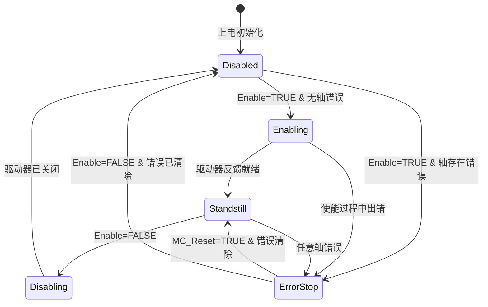
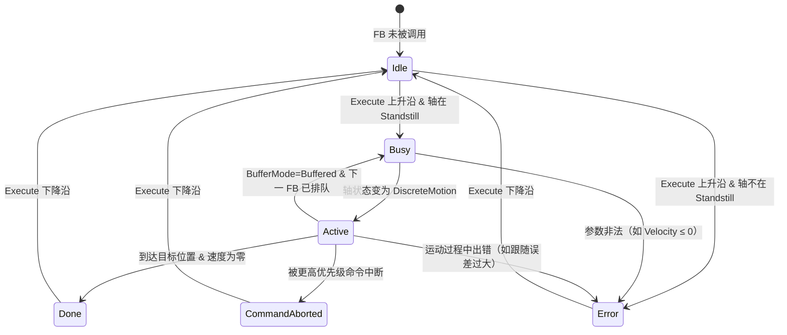
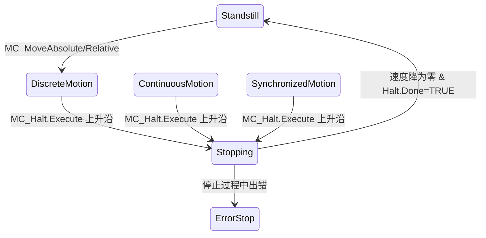

# PLCopen Motion Control V2.0 核心功能块接口定义

> **版本**: 2026-06-06
> **对齐标准**: PLCopen Motion Control Part 1 & 2 v2.0, IEC 61131-3 Ed3
> **定位**: 详细定义 MC_Power、MC_MoveAbsolute、MC_MoveRelative、MC_Halt、MC_Reset 等核心功能块的接口语义、状态机与跨厂商复用策略

---

## 1. 功能块接口设计原则

PLCopen Motion Control 规范的核心价值在于**接口标准化**（Interface Standardization）。
所有功能块遵循统一的接口模式：

- **Execute 触发模式**: 上升沿（rising edge）触发命令执行
- **AXIS_REF 轴引用**: `VAR_IN_OUT` 传递，隐藏底层驱动差异
- **标准输出集**: `Done` / `Busy` / `Active` / `CommandAborted` / `Error` / `ErrorID`
- **BufferMode 缓冲**: 支持 `Aborting`、`Buffered`、`BlendingLow`、`BlendingPrevious`、`BlendingNext`、`BlendingHigh`

```text
┌─────────────────────────────────────────────────────────────┐
│  复用分层:                                                   │
│  ┌─────────────┐  ┌─────────────┐  ┌─────────────┐         │
│  │ 应用层 (L3)  │  │ MES / SCADA │  │ 产线协调     │         │
│  ├─────────────┤  ├─────────────┤  ├─────────────┤         │
│  │ 控制层 (L1)  │  │ PLC / IPC   │  │ PLCopen FBs │         │
│  ├─────────────┤  ├─────────────┤  ├─────────────┤         │
│  │ 驱动层 (L0)  │  │ Servo Drive │  │ 厂商特定协议 │         │
│  └─────────────┘  └─────────────┘  └─────────────┘         │
│                                                             │
│  PLCopen FB 接口标准化消除了 L1→L0 的厂商锁定                │
└─────────────────────────────────────────────────────────────┘
```

---

## 2. MC_Power — 轴使能管理

### 2.1 功能语义

`MC_Power` 是轴控制的**总开关**。
在任意运动命令执行前，必须通过 `MC_Power` 将轴从 `Disabled` 状态切换至 `Standstill` 状态。
每个轴在同一时刻只能被一个 `MC_Power` 实例控制（后调用者优先）。

### 2.2 接口定义

| 参数类别 | 名称 | 数据类型 | 必要性 | 语义说明 |
|---------|------|---------|--------|---------|
| **VAR_IN_OUT** | `Axis` | `AXIS_REF` | B (基本) | 轴引用，包含实际位置、状态字、驱动器参数 |
| **VAR_INPUT** | `Enable` | `BOOL` | B | `TRUE`=请求使能；`FALSE`=请求关闭 |
| | `EnablePositive` | `BOOL` | E (扩展) | `TRUE`=允许正向运动 |
| | `EnableNegative` | `BOOL` | E | `TRUE`=允许负向运动 |
| | `StopMode` | `MC_StopMode` | E | 断电时的停止模式：`Default`、`QuickStop`、`SlowStop` |
| **VAR_OUTPUT** | `Status` | `BOOL` | B | `TRUE`=驱动器已使能且就绪 |
| | `Busy` | `BOOL` | E | `TRUE`=功能块正在执行使能/关闭过程 |
| | `Valid` | `BOOL` | E | `TRUE`=输出信号有效 |
| | `Error` | `BOOL` | B | `TRUE`=功能块内部发生错误 |
| | `ErrorID` | `WORD` | E | 错误识别码；`Error=TRUE` 时非零 |

### 2.3 状态机

`MC_Power` 内部维护一个**六状态机**，控制轴从物理断电到伺服就绪的完整生命周期：



| 状态 | 进入条件 | 退出条件 | 允许的运动命令 |
|------|---------|---------|--------------|
| **Disabled** | 初始化 / `Enable=FALSE` 完成 | `Enable=TRUE` | 无（仅 `MC_Power` 自身） |
| **Enabling** | `Enable=TRUE` 且驱动器未就绪 | 驱动器就绪反馈 | 无 |
| **Standstill** | 驱动器就绪且无错误 | `Enable=FALSE` 或轴错误 | 所有运动 FB |
| **ErrorStop** | 任意状态下检测到轴错误 | `MC_Reset` 且错误清除 | 仅 `MC_Reset` |
| **Disabling** | `Enable=FALSE` 从 Standstill | 驱动器关闭确认 | 无 |

### 2.4 时序图（文字描述）

**场景 A: 正常上电使能**

```text
t0:  Enable 上升沿 (FALSE→TRUE)
t1:  Busy = TRUE, Status = FALSE          (进入 Enabling)
t2:  驱动器反馈就绪
<t3: Busy = FALSE, Status = TRUE          (进入 Standstill)
t4:  Enable 下降沿 (TRUE→FALSE)
t5:  Busy = TRUE, Status = FALSE          (进入 Disabling)
t6:  驱动器关闭确认
<t7: Busy = FALSE                         (进入 Disabled)
```

**场景 B: 使能过程中出错**

```text
t0:  Enable 上升沿
t1:  Busy = TRUE                          (进入 Enabling)
t2:  驱动器报错（如编码器断线）
<t3: Busy = FALSE, Error = TRUE, ErrorID = 0x8A01
     Status = FALSE                       (进入 ErrorStop)
t4:  执行 MC_Reset
<t5: Error = FALSE, ErrorID = 0
     （若 Enable 仍为 TRUE，自动进入 Enabling→Standstill）
```

---

## 3. MC_MoveAbsolute — 绝对定位

### 3.1 功能语义

`MC_MoveAbsolute` 命令轴以受控运动方式移动到**绝对坐标系**中的指定位置。
旋转轴（modulo axis）支持通过 `Direction` 参数选择最短路径、正向或负向。
执行前轴必须已完成回零（Homed）。

### 3.2 接口定义

| 参数类别 | 名称 | 数据类型 | 必要性 | 语义说明 |
|---------|------|---------|--------|---------|
| **VAR_IN_OUT** | `Axis` | `AXIS_REF` | B | 轴引用 |
| **VAR_INPUT** | `Execute` | `BOOL` | B | 上升沿触发定位命令 |
| | `Position` | `REAL` | B | 目标位置 [技术单位 u] |
| | `Velocity` | `REAL` | E | 最大速度 [u/s]，恒为正 |
| | `Acceleration` | `REAL` | E | 加速度 [u/s²]，恒为正 |
| | `Deceleration` | `REAL` | E | 减速度 [u/s²]，恒为正 |
| | `Jerk` | `REAL` | E | 加加速度 [u/s³]，恒为正 |
| | `Direction` | `MC_Direction` | E | 方向策略：`shortest_way`、`positive_direction`、`negative_direction`、`current_direction` |
| | `BufferMode` | `MC_BufferMode` | E | 缓冲模式：`Aborting`、`Buffered`、`BlendingLow` 等 |
| **VAR_OUTPUT** | `Done` | `BOOL` | B | `TRUE`=目标位置已到达且速度为零 |
| | `Busy` | `BOOL` | E | `TRUE`=功能块正在执行 |
| | `Active` | `BOOL` | E | `TRUE`=功能块已取得轴控制权 |
| | `CommandAborted` | `BOOL` | E | `TRUE`=命令被其他命令中断 |
| | `Error` | `BOOL` | B | `TRUE`=执行过程中出错 |
| | `ErrorID` | `WORD` | E | 错误识别码 |

### 3.3 状态机

`MC_MoveAbsolute` 作为**运动生成型功能块**（Motion Generating FB），其内部状态机与轴状态机交互：



### 3.4 时序图（文字描述）

**场景 A: 正常绝对定位**

```text
t0:  Execute 上升沿, 轴处于 Standstill
t1:  Busy = TRUE, Active = FALSE            (进入 Busy)
t2:  轴状态变为 DiscreteMotion
<t3: Busy = TRUE, Active = TRUE             (进入 Active)
...  轴按规划曲线运动 ...
tn:  到达 Position, 速度降为零
<tn+1: Done = TRUE, Busy = FALSE, Active = FALSE
tn+2: Execute 下降沿
<tn+3: Done = FALSE                         (进入 Idle)
```

**场景 B: 运动中中断（Aborting 模式）**

```text
t0:  Execute 上升沿, MC_MoveAbsolute 进入 Active
t1:  另一 FB（如 MC_MoveRelative）以 Aborting 模式触发
<t2: CommandAborted = TRUE, Active = FALSE
     轴按新命令重新规划运动
t3:  原 Execute 下降沿
<t4: CommandAborted = FALSE, Busy = FALSE   (进入 Idle)
```

**场景 C: 旋转轴最短路径**

```text
当前位置: 350° (modulo 360°)
目标位置: 10°
Direction = shortest_way

计算: 正向距离 = (10 + 360) - 350 = 20°
      负向距离 = 10 - 350 = -340° (绝对值 340°)
选择: 正向（20° < 340°）
实际运动: 350° → 360°/0° → 10°
```

---

## 4. MC_MoveRelative — 相对定位

### 4.1 功能语义

`MC_MoveRelative` 命令轴从**当前实际位置**出发，移动指定的相对距离。
与 `MC_MoveAbsolute` 不同，相对定位不要求轴已完成回零，但存在累积误差风险。

### 4.2 接口定义

| 参数类别 | 名称 | 数据类型 | 必要性 | 语义说明 |
|---------|------|---------|--------|---------|
| **VAR_IN_OUT** | `Axis` | `AXIS_REF` | B | 轴引用 |
| **VAR_INPUT** | `Execute` | `BOOL` | B | 上升沿触发 |
| | `Distance` | `REAL` | B | 相对距离 [u]，可正可负 |
| | `Velocity` | `REAL` | E | 最大速度 [u/s] |
| | `Acceleration` | `REAL` | E | 加速度 [u/s²] |
| | `Deceleration` | `REAL` | E | 减速度 [u/s²] |
| | `Jerk` | `REAL` | E | 加加速度 [u/s³] |
| | `BufferMode` | `MC_BufferMode` | E | 缓冲模式 |
| **VAR_OUTPUT** | `Done` | `BOOL` | B | `TRUE`=相对距离已完成 |
| | `Busy` | `BOOL` | E | 执行中 |
| | `Active` | `BOOL` | E | 已取得轴控制权 |
| | `CommandAborted` | `BOOL` | E | 被中断 |
| | `Error` | `BOOL` | B | 出错 |
| | `ErrorID` | `WORD` | E | 错误码 |

### 4.3 与 MC_MoveAbsolute 的关键差异

| 特性 | MC_MoveAbsolute | MC_MoveRelative |
|------|----------------|-----------------|
| 参考系 | 绝对坐标系（机器零点） | 当前实际位置 |
| 回零要求 | **必须**（Mandatory） | **可选**（Optional） |
| 目标参数 | `Position`（绝对坐标） | `Distance`（相对偏移） |
| 误差特性 | 非累积 | 存在累积误差风险 |
| 旋转轴方向 | 支持 `Direction` 参数 | 方向由 `Distance` 符号决定 |
| 典型应用 | XY 工作台精确定位 | 索引传送带、步进给料 |

### 4.4 动态重触发（Re-triggering）

PLCopen v2.0 明确规定：当 `MC_MoveRelative` 已在 `Active` 状态时，新的 `Execute` 上升沿会将**新距离叠加到剩余距离**上：

```text
初始命令: Distance = 100mm
运动过程中再次触发: Distance = 50mm
实际执行总距离: 100mm + 50mm = 150mm（从原始起点）
```

> **注意**: 此行为与 `MC_MoveAdditive` 不同，后者在当前目标位置上累加。

---

## 5. MC_Halt — 受控停止

### 5.1 功能语义

`MC_Halt` 命令轴以配置的减速度斜坡停止当前运动，但**保持伺服使能**（Standstill 状态）。
与 `MC_Stop` 不同，`MC_Halt` 的 `Execute` 不需要持续为 `TRUE`；与 `MC_Power` 禁用也不同，`MC_Halt` 不关闭驱动器功率级。

### 5.2 接口定义

| 参数类别 | 名称 | 数据类型 | 必要性 | 语义说明 |
|---------|------|---------|--------|---------|
| **VAR_IN_OUT** | `Axis` | `AXIS_REF` | B | 轴引用 |
| **VAR_INPUT** | `Execute` | `BOOL` | B | 上升沿触发停止 |
| | `Deceleration` | `REAL` | E | 停止减速度 [u/s²]；若为零则使用默认值 |
| | `Jerk` | `REAL` | E | 停止加加速度 [u/s³] |
| | `BufferMode` | `MC_BufferMode` | E | 缓冲模式 |
| **VAR_OUTPUT** | `Done` | `BOOL` | B | `TRUE`=轴已完全停止 |
| | `Busy` | `BOOL` | E | 执行中 |
| | `Active` | `BOOL` | E | 已取得轴控制权 |
| | `CommandAborted` | `BOOL` | E | 被中断 |
| | `Error` | `BOOL` | B | 出错 |
| | `ErrorID` | `WORD` | E | 错误码 |

### 5.3 状态转移与轴状态机交互



---

## 6. MC_Reset — 错误复位

### 6.1 功能语义

`MC_Reset` 是错误恢复的唯一合法路径。当轴处于 `ErrorStop` 状态时，只有 `MC_Reset` 能将轴状态转移回 `Standstill`（前提是 `MC_Power.Enable` 仍为 `TRUE`）。

### 6.2 接口定义

| 参数类别 | 名称 | 数据类型 | 必要性 | 语义说明 |
|---------|------|---------|--------|---------|
| **VAR_IN_OUT** | `Axis` | `AXIS_REF` | B | 轴引用 |
| **VAR_INPUT** | `Execute` | `BOOL` | B | 上升沿触发复位 |
| **VAR_OUTPUT** | `Done` | `BOOL` | B | `TRUE`=错误已清除且轴就绪 |
| | `Busy` | `BOOL` | E | 复位执行中 |
| | `Error` | `BOOL` | B | `TRUE`=复位失败（如错误不可清除） |
| | `ErrorID` | `WORD` | E | 错误码 |

### 6.3 状态机与恢复流程

```text
ErrorStop 状态进入条件（任意状态均可转入）:
  - 驱动器硬件故障（过流、过压、编码器断线）
  - 软件限位触发
  - 跟随误差超限
  - MC_Power 使能时检测到既有错误

ErrorStop → Standstill 转移条件:
  1. MC_Reset.Execute 上升沿
  2. 轴错误已清除（驱动器反馈无错误）
  3. MC_Power.Enable = TRUE（否则转入 Disabled）
  4. MC_Power.Status = TRUE
```

---

## 7. MC_ReadStatus / MC_ReadActualPosition — 诊断型功能块

### 7.1 接口概览

| 功能块 | 核心输入 | 核心输出 | 复用价值 |
|-------|---------|---------|---------|
| `MC_ReadStatus` | `Enable` | `ErrorStop`, `Disabled`, `Standstill`, `Homing`, `DiscreteMotion`, `ContinuousMotion`, `SynchronizedMotion`, `Stopping` | HMI 状态面板复用 |
| `MC_ReadActualPosition` | `Enable` | `Position` | 闭环监控、位置记录 |
| `MC_ReadActualVelocity` | `Enable` | `Velocity` | 速度监控 |
| `MC_ReadActualTorque` | `Enable` | `Torque` | 力矩监控、负载检测 |
| `MC_ReadAxisError` | `Enable` | `AxisErrorID` | 故障诊断面板 |

### 7.2 诊断功能块的特殊语义

诊断型功能块**不引起轴状态转移**，可在任意轴状态下调用。
其 `Valid` 输出表示数据新鲜度：`Valid=TRUE` 时，`Position` / `Velocity` / `Torque` 等值反映最近一次伺服周期更新。

---

## 8. BufferMode 缓冲机制详解

### 8.1 缓冲模式定义

PLCopen v2.0 定义了 6 种缓冲模式，实现运动指令的**无缝衔接**（Blending）：

| BufferMode | 语义 | 速度衔接方式 | 典型应用 |
|-----------|------|------------|---------|
| **Aborting** | 立即中断当前运动 | 无衔接 | 急停、紧急避让 |
| **Buffered** | 当前运动完成后执行 | 速度降为零后启动 | 顺序定位 |
| **BlendingLow** | 混合，使用**较低**速度 | min(v₁, v₂) | 精密轨迹 |
| **BlendingPrevious** | 混合，保持前一速度 | v₁ | 连续高速 |
| **BlendingNext** | 混合，使用下一速度 | v₂ | 速度优化 |
| **BlendingHigh** | 混合，使用**较高**速度 | max(v₁, v₂) | 效率优先 |

### 8.2 支持缓冲的功能块矩阵

| 功能块 | 可作为缓冲命令 | 可被后续缓冲 | 激活信号 |
|-------|-------------|-----------|---------|
| `MC_MoveAbsolute` | ✅ | ✅ | `Done` |
| `MC_MoveRelative` | ✅ | ✅ | `Done` |
| `MC_MoveAdditive` | ✅ | ✅ | `Done` |
| `MC_MoveVelocity` | ✅ | ✅ | `InVelocity` |
| `MC_Home` | ✅ | ✅ | `Done` |
| `MC_Halt` | ✅ | ✅ | `Done` |
| `MC_Stop` | ❌ | ✅ | `Done` & `Execute=FALSE` |
| `MC_Power` | ❌ | ❌ | `Status` |
| `MC_MoveSuperimposed` | ❌ | ❌ | — |

---

## 9. 跨厂商复用策略：接口标准化如何降低厂商锁定

### 9.1 厂商锁定的根源

在传统运动控制中，厂商锁定来源于三个层面：

```text
┌─────────────────────────────────────────────────────────────┐
│  锁定层级        │  传统方案                    │  PLCopen   │
├─────────────────────────────────────────────────────────────┤
│  编程语言        │  厂商专用指令集 (如 S7-Move) │ IEC 61131-3│
│  功能块语义      │  厂商自定义状态机            │ PLCopen 标准│
│  通信协议        │  私有总线 (如 SERCOS I)      │ 基于标准以太网│
│  工程工具        │  厂商锁定 IDE                │ 多厂商兼容  │
└─────────────────────────────────────────────────────────────┘
```

### 9.2 PLCopen 的解耦机制

**机制 1: AXIS_REF 抽象**

`AXIS_REF` 是一个厂商提供的派生数据类型，但其内部结构对应用层透明。
应用代码通过统一的 `VAR_IN_OUT` 接口引用轴，不依赖具体的驱动器寄存器地址或 PDO 映射。

**机制 2: 状态机语义统一**

无论底层是步进电机、伺服电机还是直线电机，轴始终遵循 PLCopen 定义的八状态模型。
HMI 诊断面板、报警处理逻辑、安全联锁程序可以**跨项目复用**。

**机制 3: 错误码标准化**

PLCopen 定义了标准错误码范围（如 `0x8000`-`0x8FFF` 为轴错误，`0x9000`-`0x9FFF` 为功能块错误），使故障诊断知识库具备跨厂商适用性。

### 9.3 移植成本量化

| 复用层级 | 传统方案移植工作量 | PLCopen 方案移植工作量 | 成本降低 |
|---------|-----------------|---------------------|---------|
| 单轴定位程序 | 2-3 人天（重新适配驱动器参数） | 0.5 人天（仅调参） | **75%** |
| 多轴协调程序 | 1-2 周（重新同步时序） | 2-3 天（验证时序） | **70%** |
| HMI 诊断面板 | 1 周（重写状态解析逻辑） | 0 天（直接复用） | **100%** |
| 安全联锁逻辑 | 2 周（重新认证） | 3 天（差异分析） | **80%** |

---

## 10. 与 ISA-95 的层级映射（扩展）

| ISA-95 层级 | PLCopen 应用 | 典型功能块 | 复用模式 |
|------------|-------------|-----------|---------|
| L0 现场设备 | 伺服驱动器 | `MC_Power`, `MC_ReadActualPosition` | 驱动配置模板 |
| L1 控制 | PLC 运动控制 | `MC_MoveAbsolute`, `MC_Home` | 轴控制标准块 |
| L2  supervisory | 产线协调 | `MC_CamIn`, `MC_GearIn`, Motion Group | 凸轮表/齿轮比复用 |
| L3 MES | 订单驱动换型 | `MC_CamTblSelect`, `MC_SetOverride` | 配方参数化 |

---

## 11. 参考索引

- [PLCopen Motion Control Part 1 & 2 v2.0](https://www.plcopen.org) — 功能块接口与状态机规范
- [PLCopen Motion Control Part 3](https://www.plcopen.org) — 用户指南与工程实例
- [PLCopen Motion Control Part 4](https://www.plcopen.org) — 协调运动与机器人控制
- IEC 61131-3:2013 Ed3 — 可编程控制器编程语言
- IEC 61800-5-2:2016 — 可调速电气传动系统的安全要求
- Siemens TIA Portal Motion Control 文档 — MC_Power / MC_MoveAbsolute 实现参考
- Schneider Electric Lexium 系列 — PLCopen 功能块实现差异说明


---

## 补充章节

## 示例

**示例**：汽车工厂将 ISA-95 L0-L4 资产目录映射到 IEC 63278 资产管理壳（AAS），通过 OPC UA FX 实现现场设备与 MES/ERP 的即插即用复用。

## 反例

**反例**：将 IT 系统直接补丁策略套用到 PLC 产线，未考虑实时性约束与功能安全认证，导致停机与安全事故。

## 权威来源

> **权威来源**:
>
> - [ISA-95 / IEC 62264](https://www.isa.org/standards-and-publications/isa-standards/isa-95)
> - [OPC Foundation](https://opcfoundation.org)
> - [IEC 61508](https://webstore.iec.ch/publication/66912)
> - [IEC 63278 AAS](https://iec.ch/dyn/www/f?p=103:38:0::::FSP_ORG_ID:1363)
> - 核查日期：2026-07-07

## 分析

**分析**：OT-IT 复用需要在实时性、安全性与 IT 敏捷性之间取得平衡，标准信息模型是打破竖井的关键。
