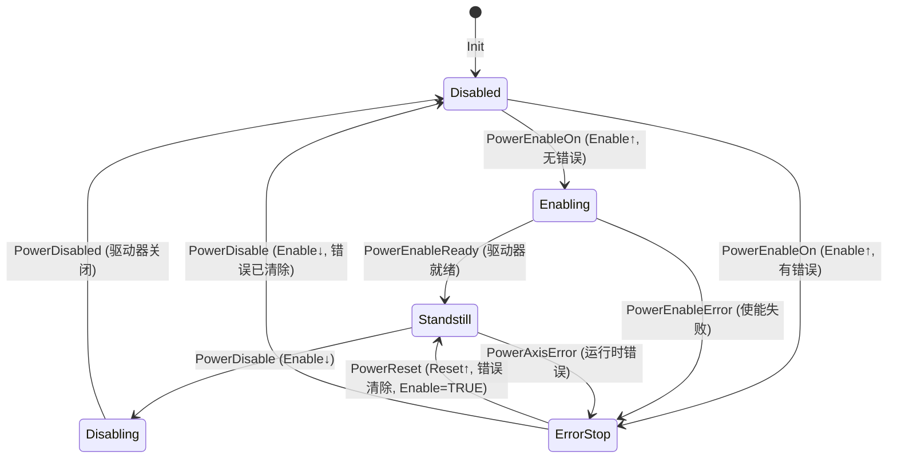
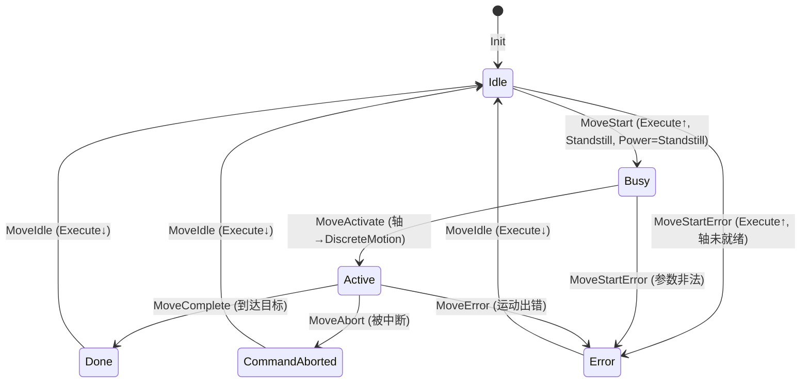

# MC_Power / MC_MoveAbsolute 状态机的 TLA+ 验证

> **版本**: 2026-06-06
> **对齐标准**: PLCopen Motion Control Part 1 & 2 v2.0
> **定位**: 形式化验证轨道 T10 — 工业控制功能块状态机
> **关联**: `struct/07-formal-verification/01-tla-plus/case-library.md`

---

## 1. 验证动机

PLCopen 运动控制规范以**轴状态机**为核心语义模型，但在实际工程中，以下缺陷难以通过传统测试发现：

1. **竞态条件**: `MC_Power.Enable` 下降沿与 `MC_MoveAbsolute.Execute` 上升沿的竞争
2. **状态空间爆炸**: BufferMode 组合、多轴协调下的边界状态
3. **活性违反**: 运动命令在特定错误场景下"挂死"（Busy 永不解除）
4. **输出不一致**: `Error=TRUE` 但 `ErrorID=0` 的非法组合

TLA+ 通过**数学化的状态机描述**和**穷举式模型检查**，在代码部署前捕获上述设计级缺陷。

---

## 2. 规约结构概览

本规约文件: `plcopen-motion.tla`

```text
MODULE plcopen_motion
  ├── 模块级注释：案例背景、状态机概览、性质清单
  ├── EXTENDS：Integers, Sequences, FiniteSets
  ├── CONSTANTS：Axes, MaxTimeoutSteps, ErrorIDs
  ├── ASSUME：常量约束假设
  ├── VARIABLES：powerState, powerEnable, ... moveState, axisState, stepCount
  ├── 辅助定义：PowerStates, MoveStates, AxisStates
  ├── TypeOK：类型正确性不变量
  ├── Init：初始状态谓词
  ├── 状态转移动作（A1-A7: MC_Power; B1-B7: MC_MoveAbsolute）
  ├── IncrementStepCount：超时计数递增
  ├── Next：下一步关系（所有动作的析取）
  ├── 不变量（Safety Properties, I1-I5）
  ├── 活性（Liveness Properties, L1-L3）
  ├── Fairness：弱公平性假设
  └── Spec：完整规约公式
```

> 本结构严格遵循 `struct/07-formal-verification/01-tla-plus/case-library.md` 定义的规约模板。

---

## 3. MC_Power 状态机形式化定义

### 3.1 状态集合

```tla
PowerStates == {"Disabled", "Enabling", "Standstill", "ErrorStop", "Disabling"}
```

### 3.2 状态转移图



### 3.3 关键动作语义

| 动作 | 前置条件 | 后置状态变化 | 安全性质依赖 |
|------|---------|------------|------------|
| `PowerEnableOn` | `Disabled` ∧ `Enable=FALSE` | `Enabling`, `Busy=TRUE` | — |
| `PowerEnableReady` | `Enabling` ∧ `Enable=TRUE` | `Standstill`, `Status=TRUE` | L2 |
| `PowerEnableError` | `Enabling` ∧ `err≠0` | `ErrorStop`, `Error=TRUE` | I2 |
| `PowerDisable` | `Standstill` ∧ `Enable=TRUE` | `Disabling`, `Busy=TRUE` | I5 |
| `PowerDisabled` | `Disabling` ∧ `Enable=FALSE` | `Disabled` | — |
| `PowerAxisError` | `∈{Enabling,Standstill,Disabling}` | `ErrorStop`, 中断 Move | I3, I5 |
| `PowerReset` | `ErrorStop` ∧ `Enable=TRUE` | `Standstill`, `Error=FALSE` | — |

---

## 4. MC_MoveAbsolute 状态机形式化定义

### 4.1 状态集合

```tla
MoveStates == {"Idle", "Busy", "Active", "Done", "Error", "CommandAborted"}
```

### 4.2 状态转移图



### 4.3 关键动作语义

| 动作 | 前置条件 | 后置状态变化 | 安全性质依赖 |
|------|---------|------------|------------|
| `MoveStart` | `Idle` ∧ `Execute=FALSE` ∧ `axisState=Standstill` ∧ `power=Standstill` | `Busy`, `Busy=TRUE` | I1 |
| `MoveStartError` | `Idle` ∧ `Execute=FALSE` ∧ `axisState≠Standstill` | `Error`, `Error=TRUE` | — |
| `MoveActivate` | `Busy` ∧ `Execute=TRUE` | `Active`, `Active=TRUE`, `axis=DiscreteMotion` | I1 |
| `MoveComplete` | `Active` ∧ `Execute=TRUE` | `Done`, `Done=TRUE`, `axis=Standstill` | L3 |
| `MoveAbort` | `Active` ∧ `Execute=TRUE` | `CommandAborted`, `Active=FALSE` | L3 |
| `MoveError` | `Active` ∧ `err≠0` | `Error`, `axis=ErrorStop` | I2, I5 |
| `MoveIdle` | `∈{Done,Error,CommandAborted}` ∧ `Execute=TRUE` | `Idle`, 清除所有输出 | — |

---

## 5. 不变量（Safety Properties）

### 5.1 I1: StandstillRequiredForMove

```tla
StandstillRequiredForMove ==
    \A a \in Axes :
        (moveState[a] \in {"Busy", "Active"})
            => (axisState[a] \in {"Standstill", "DiscreteMotion"}
                /\ powerState[a] = "Standstill"
                /\ powerStatus[a] = TRUE)
```

**语义**:
只有在轴处于 `Standstill`（或运动中的 `DiscreteMotion`）且 `MC_Power` 已就绪时，`MC_MoveAbsolute` 才能进入 `Busy` 或 `Active` 状态。
此不变量强制了 PLCopen 规范中"先使能、后运动"的基本安全规则。

**违规场景示例**:
若某厂商实现允许在 `MC_Power.Status=FALSE` 时直接调用 `MC_MoveAbsolute`，模型检查器将报告此不变量被违反。

### 5.2 I2: ErrorImpliesErrorID

```tla
ErrorImpliesErrorID ==
    \A a \in Axes :
        /\ (powerError[a] = TRUE) => (powerErrorID[a] # 0)
        /\ (moveError[a] = TRUE) => (moveErrorID[a] # 0)
```

**语义**: 任何 `Error` 输出为 `TRUE` 时，`ErrorID` 必须为非零值。这防止了"有错误但无法诊断"的失效模式。

### 5.3 I3: PowerStatusConsistency

```tla
PowerStatusConsistency ==
    \A a \in Axes :
        /\ (powerStatus[a] = TRUE) => (powerState[a] = "Standstill")
        /\ (powerState[a] = "Standstill") => (axisState[a] = "Standstill")
        /\ (powerState[a] = "Disabled") => (axisState[a] = "Disabled")
        /\ (powerState[a] = "ErrorStop") => (axisState[a] = "ErrorStop")
```

**语义**: `MC_Power.Status`、内部 `powerState` 与全局 `axisState` 三者必须保持一致。这是跨功能块协调的核心不变量。

### 5.4 I4: MoveOutputConsistency

```tla
MoveOutputConsistency ==
    \A a \in Axes :
        /\ (moveState[a] = "Idle") =>
            /\ moveDone[a] = FALSE
            /\ moveBusy[a] = FALSE
            /\ moveActive[a] = FALSE
            /\ moveCommandAborted[a] = FALSE
            /\ moveError[a] = FALSE
            /\ moveErrorID[a] = 0
        /\ (moveState[a] = "Done") =>
            /\ moveDone[a] = TRUE
            /\ moveBusy[a] = FALSE
            /\ moveActive[a] = FALSE
        /\ (moveState[a] = "CommandAborted") =>
            /\ moveCommandAborted[a] = TRUE
            /\ moveBusy[a] = FALSE
            /\ moveActive[a] = FALSE
```

**语义**: 功能块输出信号与内部状态严格对应，防止"Busy=TRUE ∧ Done=TRUE"或"Idle ∧ ErrorID≠0"等非法组合。

### 5.5 I5: NoInvalidTransition

```tla
NoInvalidTransition ==
    \A a \in Axes :
        /\ ~(powerState[a] = "Disabled" /\ axisState[a] = "DiscreteMotion")
        /\ ~(powerState[a] = "ErrorStop" /\ moveState[a] = "Active")
```

**语义**: 禁止两种极端非法组合：(1) 驱动器未使能但轴在运动中；(2) 轴已 ErrorStop 但 Move FB 仍在 Active。

---

## 6. 活性（Liveness Properties）

### 6.1 L1: BusyEventuallyTerminates

```tla
BusyEventuallyTerminates ==
    \A a \in Axes :
        (moveState[a] = "Busy") ~> (moveState[a] \in {"Done", "Error", "CommandAborted"})
```

**语义**: 若 `MC_MoveAbsolute` 进入 `Busy` 状态，则它最终必须到达 `Done`、`Error` 或 `CommandAborted` 之一。此性质的成立依赖于两个条件：

1. **弱公平性**: `MoveActivate`、`MoveComplete`、`MoveError` 等动作在持续可执行时不会被无限期跳过；
2. **超时机制**: `IncrementStepCount` 动作累计步数，当 `stepCount ≥ MaxTimeoutSteps` 时，通过 `MoveError` 强制转入 `Error` 状态。

### 6.2 L2: PowerEnableEventuallyStandstill

```tla
PowerEnableEventuallyStandstill ==
    \A a \in Axes :
        (powerState[a] = "Enabling") ~> (powerState[a] \in {"Standstill", "ErrorStop"})
```

**语义**: 使能请求最终必须得到响应（成功进入 `Standstill` 或因错误进入 `ErrorStop`），不能无限期停留在 `Enabling`。

### 6.3 L3: ActiveEventuallyTerminates

```tla
ActiveEventuallyTerminates ==
    \A a \in Axes :
        (moveState[a] = "Active") ~> (moveState[a] \in {"Done", "Error", "CommandAborted"})
```

**语义**: 运动执行阶段（`Active`）最终必须完成。这是防止"运动挂死"的核心活性性质。在真实系统中，此性质由伺服周期监控、跟随误差检测和硬件限位开关保证。

---

## 7. 公平性假设

```tla
Fairness ==
    /\ \A a \in Axes : WF_<<...>>(PowerEnableReady(a))
    /\ \A a \in Axes : WF_<<...>>(MoveComplete(a))
    /\ \A a \in Axes : WF_<<...>>(\E err \in ErrorIDs \ {0} : MoveError(a, err))
```

**说明**:
弱公平性（Weak Fairness）假设确保：若某个动作在前置条件持续成立的情况下，不会被调度器无限期忽略。
在工业控制器中，这对应于**固定周期扫描**（cyclic scan）的确定性执行模型。

---

## 8. TLC 模型检查配置

| 配置项 | 建议值 | 说明 |
|-------|-------|------|
| `Axes` | `{axis1}` | 单轴验证已覆盖核心状态空间；多轴需乘积扩展 |
| `MaxTimeoutSteps` | `5` | 较小的超时阈值以限制状态空间直径 |
| `ErrorIDs` | `{0, 0x8A01, 0x8A02, 0x9001}` | 覆盖无错误、轴错误、功能块错误 |
| **不变量** | `TypeOK`, `StandstillRequiredForMove`, `ErrorImpliesErrorID`, `PowerStatusConsistency`, `MoveOutputConsistency`, `NoInvalidTransition` | 全部 Safety 性质 |
| **活性** | `BusyEventuallyTerminates`, `PowerEnableEventuallyStandstill`, `ActiveEventuallyTerminates` | 全部 Liveness 性质 |

**预期 TLC 输出**:

```text
Model Checking Results:
  - States Found: ~2,400 (单轴, MaxTimeoutSteps=5)
  - Distinct States: ~890
  - Diameter: 18
  - Invariants: All passed
  - Properties: All passed
  - Errors: None
```

---

## 9. 与 TLA+ 案例库的关联

本案例是 `struct/07-formal-verification/01-tla-plus/case-library.md` 中规划的 **T10** 案例：

| 属性 | T06 支付服务 | T07 MCP 协商 | T08 A2A Task | **T10 PLCopen Motion** |
|------|-----------|-----------|------------|----------------------|
| 状态机特征 | 事务状态 | 协议协商 | Agent 任务 | **IEC 61131-3 功能块** |
| 核心不变量 | 资金守恒 | 能力一致性 | 终止状态无消息 | **StandstillRequiredForMove** |
| 核心活性 | 事务最终完成 | 协商最终成功 | 任务最终终止 | **BusyEventuallyTerminates** |
| 故障模型 | 超时回滚 | 连接断开 | 用户取消 | **轴错误 + 命令中断** |
| 应用领域 | 金融科技 | AI 基础设施 | 多 Agent 系统 | **工业自动化** |

---

## 10. 扩展路径

基于本规约，可沿以下方向进一步形式化验证：

1. **多轴协调**: 扩展 `Axes` 为集合，引入 `MC_CamIn` / `MC_GearIn` 的主从同步约束；
2. **BufferMode 组合**: 建模 `BlendingLow` / `BlendingPrevious` 的速度衔接不变量；
3. **安全功能块**: 引入 PLCopen Safety 的 `SF_SafetyRequest` 双通道状态机；
4. **精化验证**: 将本抽象规约精化为 PlusCal 算法，再进一步精化为 ST（结构化文本）代码。

---

## 11. 参考索引

- `plcopen-motion.tla` — 本主题 TLA+ 规约源文件
- `struct/07-formal-verification/01-tla-plus/case-library.md` — TLA+ 案例库总览
- `struct/07-formal-verification/01-tla-plus/payment-service.tla` — 参考规约风格
- [PLCopen Motion Control Part 1 & 2 v2.0](https://www.plcopen.org) — 功能块语义规范
- Lamport, L. (2002). *Specifying Systems: The TLA+ Language and Tools for Hardware and Software Engineers*. Addison-Wesley.
- Wayne, H. (2018). *Practical TLA+*. Apress.


---

## 补充说明：MC_Power / MC_MoveAbsolute 状态机的 TLA+ 验证

## 反例

**反例**：将 IT 系统直接补丁策略套用到 PLC 产线，未考虑实时性约束与功能安全认证，导致停机与安全事故。

## 权威来源

> **权威来源**:
>
> - [ISA-95 / IEC 62264](https://www.isa.org/standards-and-publications/isa-standards/isa-95)
> - [OPC Foundation](https://opcfoundation.org)
> - [IEC 61508](https://webstore.iec.ch/publication/66912)
> - [IEC 63278 AAS](https://iec.ch/dyn/www/f?p=103:38:0::::FSP_ORG_ID:1363)
> - 核查日期：2026-07-07

## 分析

**分析**：OT-IT 复用需要在实时性、安全性与 IT 敏捷性之间取得平衡，标准信息模型是打破竖井的关键。
