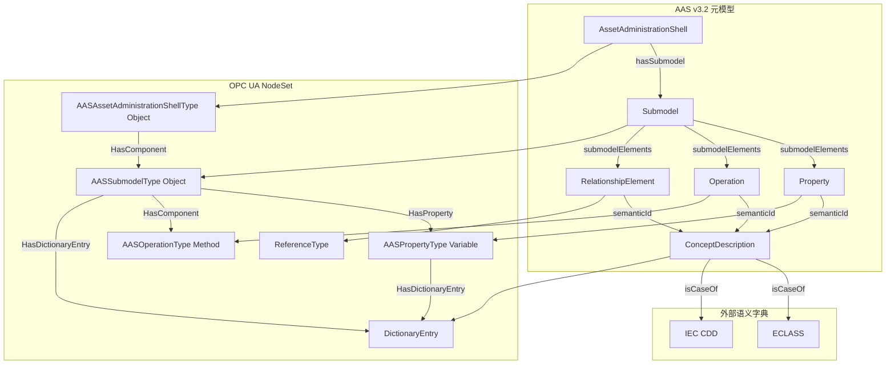
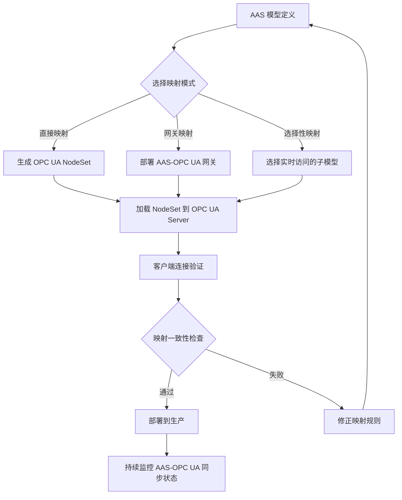
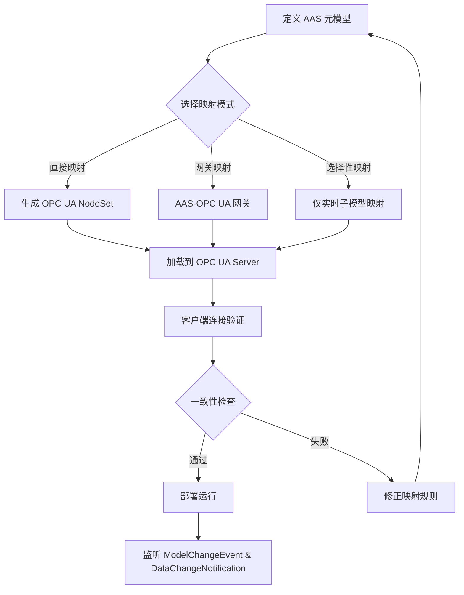

# AAS v3.2 到 OPC UA NodeSet 完整映射规范

> **版本**: 2026-06-08
> **对齐标准**: IDTA AAS Specification Part 1 v3.2, OPC UA for AAS Companion Specification (I4AAS), IEC 63278-1:2023, IEC 62541
> **定位**: 确立资产管理壳元模型与 OPC UA NodeSet 的逐元素映射规则、标识符转换与生命周期同步机制
> **状态**: ✅ 已完成
> **交叉引用**: [`aas-v32-opcua-fx-2026-alignment.md`](./aas-v32-opcua-fx-2026-alignment.md)

---

## 1. AAS v3.2 元模型概述

IDTA AAS Specification Part 1 v3.2 (2026-03) 定义了工业数字孪生的核心元模型。四个顶层元素构成可复用的语义资产：

| 元模型元素 | 语义 | 关键属性 |
|-----------|------|---------|
| **AssetAdministrationShell** | 资产的数字代表 | `id`, `idShort`, `assetInformation`, `submodels[]` |
| **Submodel** | 描述资产某方面的结构化数据 | `id`, `kind` (Instance/Template), `semanticId`, `submodelElements[]` |
| **ConceptDescription** | 语义定义与数据规范 | `id`, `embeddedDataSpecifications[]`, `isCaseOf[]` |
| **Identifiable** | 所有可独立标识元素的抽象基类 | `id` (IRI/IRDI/Custom), `administration` (版本/修订) |

核心关系：

- **hasSubmodel**: `AssetAdministrationShell → Submodel`，通过 `Reference` 实现一对多引用
- **hasSemanticId**: `Submodel` / `SubmodelElement → ConceptDescription`，通过 `semanticId` 指向外部语义字典（ECLASS / IEC CDD）
- **hasDataSpecification**: 任意 `HasDataSpecification` 元素 → `DataSpecification`，承载 IEC 61360 模板约束

---

## 2. OPC UA NodeSet 基础

OPC UA 信息模型以 **AddressSpace** 为全局命名图，节点通过 `NodeId` 唯一标识，引用通过 `ReferenceType` 标注语义。

### 2.1 NodeClass 体系

| NodeClass | 语义 | AAS 映射场景 |
|-----------|------|-------------|
| **Object** | 复合实体，可包含子节点 | AAS 根对象、Submodel、Entity、File |
| **Variable** | 数据值，含 `DataValue` (值/时间戳/质量) | Property、SubmodelElement 数值 |
| **Method** | 可调用操作，含输入/输出参数 | Operation |
| **ObjectType** | 对象类型定义 | AASType、SubmodelType、FileType |
| **VariableType** | 变量类型定义 | PropertyType、语义数据类型约束 |
| **ReferenceType** | 引用语义定义 | HasComponent、HasProperty、HasDictionaryEntry |
| **DataType** | 值域与结构约束 | xs:string → String, xs:double → Double |

### 2.2 AddressSpace 结构

```text
Objects (i=85)
└── AssetAdministrationShells (FolderType)
    └── <AAS> (AASAssetAdministrationShellType)
        ├── Identification
        ├── AssetInformation
        └── Submodels (FolderType)
            └── <Submodel> (AASSubmodelType)
                ├── SemanticId (HasDictionaryEntry)
                └── SubmodelElements...
```

---

## 3. AAS → OPC UA NodeSet 映射表

### 3.1 核心概念映射

| AAS 概念 | OPC UA 映射 | 说明 |
|----------|------------|------|
| AssetAdministrationShell | `Object` (AASAssetAdministrationShellType) | 根对象，Organizes 引用挂接于 AddressSpace |
| Submodel | `Object` (AASSubmodelType) | AAS 的组件，通过 `HasComponent` 关联到 AAS |
| SubmodelElement | `Variable` / `Object` | 根据具体类型映射（见下） |
| Property | `Variable` (AASPropertyType) | 具有 `DataValue`，`valueType` 映射为 `DataType` |
| Operation | `Method` (AASOperationType) | 可调用，`inputVariables` → `InputArguments` |
| File | `Object` + `HasComponent` → `FileType` | 文件引用，`value` 映射为 URL 字符串变量 |
| ReferenceElement | `Object` + `ReferenceType` | 外部引用，通过自定义 `ReferenceType` 表达语义 |
| Entity | `Object` | 复杂实体，`entityType` 映射为 `HasTypeDefinition` |
| RelationshipElement | `Reference` (语义化 ReferenceType) | `first`/`second` 映射为源/目标 `NodeId` |
| ConceptDescription | `ObjectType` / `VariableType` + `DictionaryEntry` | 语义定义，通过 `HasDictionaryEntry` 被引用 |
| Identifiable.id | `NodeId` | IRI/IRDI 映射为 `ns=<idx>;s=<id>` |

### 3.2 数据类型映射

| AAS `valueType` | OPC UA `DataType` |
|----------------|------------------|
| `xs:string` | `String` |
| `xs:integer` | `Int32` / `Int64` |
| `xs:double` | `Double` |
| `xs:boolean` | `Boolean` |
| `xs:dateTime` | `UtcTime` |
| `xs:base64Binary` | `ByteString` |

---

## 4. XML/JSON 示例：温度传感器资产

### 4.1 AAS JSON 示例（简化）

```json
{
  "assetAdministrationShells": [{
    "id": "https://example.com/aas/TempSensor_001",
    "idShort": "TempSensor_001",
    "assetInformation": {
      "assetKind": "Instance",
      "globalAssetId": "https://example.com/assets/TS-001"
    },
    "submodels": [{
      "keys": [{"type": "Submodel", "value": "https://example.com/sm/Measurement"}]
    }]
  }],
  "submodels": [{
    "id": "https://example.com/sm/Measurement",
    "idShort": "Measurement",
    "semanticId": {
      "keys": [{"type": "GlobalReference", "value": "https://admin-shell.io/idta/SubmodelTemplate/TechnicalData/1/2"}]
    },
    "submodelElements": [
      {
        "modelType": "Property",
        "idShort": "CurrentTemperature",
        "semanticId": {"keys": [{"type": "ConceptDescription", "value": "0173-1#02-BAA129#008"}]},
        "valueType": "xs:double",
        "value": "23.5"
      },
      {
        "modelType": "Property",
        "idShort": "Unit",
        "valueType": "xs:string",
        "value": "°C"
      },
      {
        "modelType": "Operation",
        "idShort": "Calibrate",
        "inputVariables": [{
          "value": {"idShort": "ReferenceValue", "valueType": "xs:double", "value": "25.0"}
        }],
        "outputVariables": [{
          "value": {"idShort": "Deviation", "valueType": "xs:double"}
        }]
      }
    ]
  }]
}
```

### 4.2 OPC UA NodeSet XML 片段

```xml
<?xml version="1.0" encoding="utf-8"?>
<UANodeSet xmlns="http://opcfoundation.org/UA/2008/02/Types.xsd"
           xmlns:aas="http://opcfoundation.org/UA/I4AAS/">
  <NamespaceUris>
    <Uri>http://opcfoundation.org/UA/I4AAS/</Uri>
    <Uri>https://example.com/aas/</Uri>
  </NamespaceUris>

  <UAObject NodeId="ns=2;s=https://example.com/aas/TempSensor_001"
            BrowseName="2:TempSensor_001" ParentNodeId="i=85">
    <DisplayName>TempSensor_001</DisplayName>
    <References>
      <Reference ReferenceType="HasTypeDefinition">aas:AASAssetAdministrationShellType</Reference>
      <Reference ReferenceType="Organizes" IsForward="false">i=85</Reference>
    </References>
  </UAObject>

  <UAObject NodeId="ns=2;s=https://example.com/sm/Measurement"
            BrowseName="2:Measurement"
            ParentNodeId="ns=2;s=https://example.com/aas/TempSensor_001">
    <DisplayName>Measurement</DisplayName>
    <References>
      <Reference ReferenceType="HasTypeDefinition">aas:AASSubmodelType</Reference>
      <Reference ReferenceType="HasComponent" IsForward="false">
        ns=2;s=https://example.com/aas/TempSensor_001
      </Reference>
    </References>
  </UAObject>

  <UAVariable NodeId="ns=2;s=https://example.com/sm/Measurement/CurrentTemperature"
              BrowseName="2:CurrentTemperature"
              ParentNodeId="ns=2;s=https://example.com/sm/Measurement"
              DataType="Double" ValueRank="-1">
    <DisplayName>CurrentTemperature</DisplayName>
    <References>
      <Reference ReferenceType="HasTypeDefinition">aas:AASPropertyType</Reference>
      <Reference ReferenceType="HasProperty" IsForward="false">
        ns=2;s=https://example.com/sm/Measurement
      </Reference>
      <Reference ReferenceType="HasDictionaryEntry">ns=3;s=0173-1#02-BAA129#008</Reference>
    </References>
    <Value><uax:Double>23.5</uax:Double></Value>
  </UAVariable>

  <UAMethod NodeId="ns=2;s=https://example.com/sm/Measurement/Calibrate"
            BrowseName="2:Calibrate"
            ParentNodeId="ns=2;s=https://example.com/sm/Measurement">
    <DisplayName>Calibrate</DisplayName>
    <References>
      <Reference ReferenceType="HasTypeDefinition">aas:AASOperationType</Reference>
      <Reference ReferenceType="HasComponent" IsForward="false">
        ns=2;s=https://example.com/sm/Measurement
      </Reference>
    </References>
  </UAMethod>
</UANodeSet>
```

---

## 5. 映射规则约束

### 5.1 标识符映射（IRI ↔ NodeId）

| AAS 标识类型 | OPC UA NodeId 格式 | 示例 |
|------------|------------------|------|
| IRI | `ns=<idx>;s=<IRI>` | `ns=2;s=https://example.com/aas/TS-001` |
| IRDI | `ns=<idx>;s=<IRDI>` | `ns=3;s=0173-1#02-BAA129#008` |
| Custom | `ns=<idx>;i=<localId>` | `ns=2;i=1001` |

规则：NamespaceUri 在 `NamespaceUris` 数组中的索引决定 `ns` 值。推荐为 AAS ID 空间分配独立 Namespace。

### 5.2 语义映射（semanticId ↔ ReferenceType / HasTypeDefinition）

- **Submodel.semanticId** → `HasTypeDefinition` 引用指向标准化的 `AASSubmodelType` 子类型
- **Property.semanticId** / **ConceptDescription** → `HasDictionaryEntry` 引用指向外部数据字典节点（ECLASS / IEC CDD）
- **RelationshipElement** → 自定义 `ReferenceType`（如 `HasPart`、`IsConnectedTo`）表达语义关系

### 5.3 生命周期同步（AAS 更新 → NodeSet 更新）

| AAS 变更类型 | OPC UA NodeSet 响应 | 机制 |
|-------------|-------------------|------|
| SubmodelElement 值变更 | Variable `Value` 属性更新 | `DataChangeNotification` (发布-订阅) |
| SubmodelElement 增删 | AddressSpace 节点增删 | `ModelChangeEvent` 通知客户端重建缓存 |
| AAS 元数据变更（版本/修订） | `administration` 变量更新 | 强制客户端重新读取 `NodeVersion` |
| AAS 整体删除 | 根 Object 删除 + `Reference` 清理 | `GeneralModelChangeEvent` |

> **公理 I.AAS.4** (Mapping Consistency): 若 AAS 实例发生状态变更 ΔS，则 OPC UA AddressSpace 必须在确定的时间边界 τ 内达到与 ΔS 语义等价的状态，其中 τ 由应用场景的实时性等级决定（OT 场景 τ ≤ 100 ms，IT 场景 τ ≤ 5 s）。

---

## 6. 权威来源

- IDTA. *Details of the Asset Administration Shell — Part 1: Metamodel*. v3.2, 2026-03.
- OPC Foundation. *OPC UA Companion Specification for I4AAS*. OPC 30270.
- IEC 63278-1:2023. *Asset Administration Shell for industrial applications — Part 1: Administration Shell structure*.
- IEC 62541 (OPC UA). *OPC Unified Architecture*.
- IEC 61360. *IEC Common Data Dictionary (CDD)*.
- Industrial Digital Twin Association (IDTA). [https://industrialdigitaltwin.org](https://industrialdigitaltwin.org)
- OPC Foundation I4AAS Working Group. [https://opcfoundation.org/markets-collaboration/I4AAS/](https://opcfoundation.org/markets-collaboration/I4AAS/)
- Eclipse BaSyx. [https://www.eclipse.org/basyx/](https://www.eclipse.org/basyx/)


## 7. AAS × OPC UA 映射表补强

### 7.1 元模型到 NodeSet 的完整映射

下表将 AAS v3.2 元模型的主要元素映射到 OPC UA NodeSet 的对应构造，并说明标识符、引用类型和生命周期语义。

| AAS 元模型元素 | OPC UA 映射 | NodeClass | 引用类型 | 映射说明 |
|---------------|------------|-----------|---------|---------|
| AssetAdministrationShell | `AASAssetAdministrationShellType` 的实例 | Object | Organizes (to Objects folder) | AAS 根对象，包含 Identification、AssetInformation、Submodels |
| Submodel | `AASSubmodelType` 的实例 | Object | HasComponent (from AAS) | AAS 的组件，承载特定方面的数据 |
| SubmodelElementCollection | `AASSubmodelElementCollectionType` 的实例 | Object | HasComponent (from Submodel) | 子模型元素集合 |
| Property | `AASPropertyType` 的实例 | Variable | HasProperty (from parent) | 具有 valueType 的标量值 |
| MultiLanguageProperty | `AASMultiLanguagePropertyType` 的实例 | Variable | HasProperty | 多语言字符串值 |
| Range | `AASRangeType` 的实例 | Variable | HasProperty | 最小/最大值范围 |
| File | `AASFileType` 的实例 | Object | HasComponent | 文件引用，value 为 URL |
| Blob | `AASBlobType` 的实例 | Variable | HasProperty | Base64 编码二进制数据 |
| ReferenceElement | `AASReferenceElementType` 的实例 | Object | HasComponent | 对外部元素的引用 |
| RelationshipElement | 自定义 ReferenceType 的实例 | Reference | 自定义 ReferenceType | first/second 映射为源/目标 NodeId |
| Operation | `AASOperationType` 的实例 | Method | HasComponent | 可调用操作 |
| Entity | `AASEntityType` 的实例 | Object | HasComponent | 复杂实体，含 entityType |
| ConceptDescription | `AASConceptDescriptionType` 的实例 或外部 DictionaryEntry | ObjectType / VariableType | HasDictionaryEntry | 语义定义 |
| Identifiable.id | `NodeId` | — | — | IRI/IRDI 映射为 `ns=<idx>;s=<id>` |
| idShort | `BrowseName` / `DisplayName` | — | — | 人类可读的短名称 |
| semanticId | `HasDictionaryEntry` 引用 | — | HasDictionaryEntry | 指向 ECLASS / IEC CDD |
| hasDataSpecification | `HasDictionaryEntry` 或自定义引用 | — | HasDictionaryEntry | 数据规范引用 |

### 7.2 数据类型映射补强

| AAS `valueType` | OPC UA `DataType` | 说明 |
|----------------|------------------|------|
| `xs:string` | `String` | Unicode 字符串 |
| `xs:integer` | `Int32` / `Int64` | 根据范围选择 |
| `xs:double` | `Double` | IEEE 754 双精度浮点 |
| `xs:float` | `Float` | IEEE 754 单精度浮点 |
| `xs:boolean` | `Boolean` | 布尔值 |
| `xs:dateTime` | `UtcTime` | UTC 时间戳 |
| `xs:base64Binary` | `ByteString` | 二进制数据 |
| `xs:hexBinary` | `ByteString` | 十六进制编码二进制 |
| `xs:anyURI` | `String` | URI 字符串 |
| `xs:decimal` | `Double` | 高精度小数（视实现） |

### 7.3 标识符映射规则补强

| AAS 标识类型 | OPC UA NodeId 格式 | 示例 |
|------------|------------------|------|
| IRI | `ns=<idx>;s=<IRI>` | `ns=2;s=https://example.com/aas/TS-001` |
| IRDI | `ns=<idx>;s=<IRDI>` | `ns=3;s=0173-1#02-BAA129#008` |
| Custom | `ns=<idx>;i=<localId>` | `ns=2;i=1001` |
| UUID | `ns=<idx>;g=<UUID>` | `ns=2;g=550e8400-e29b-41d4-a716-446655440000` |

规则：NamespaceUri 在 `NamespaceUris` 数组中的索引决定 `ns` 值。推荐为 AAS ID 空间、IEC CDD 空间和项目本地空间分别分配独立 Namespace。

### 7.4 语义映射规则补强

- **Submodel.semanticId** → 通过 `HasTypeDefinition` 引用指向标准化的 `AASSubmodelType` 子类型，或通过 `HasDictionaryEntry` 指向外部语义字典。
- **Property.semanticId** / **ConceptDescription** → `HasDictionaryEntry` 引用指向外部数据字典节点（ECLASS / IEC CDD / IEC CDD@idta）。
- **RelationshipElement** → 自定义 `ReferenceType`（如 `HasPart`、`IsConnectedTo`、`IsMountedOn`）表达语义关系。
- **Operation** → OPC UA `Method`，`inputVariables` 映射为 `InputArguments`，`outputVariables` 映射为 `OutputArguments`。

## 8. 完整示例：电机驱动器资产映射

### 8.1 AAS JSON 示例（简化）

```json
{
  "assetAdministrationShells": [{
    "id": "https://example.com/aas/MotorDrive_001",
    "idShort": "MotorDrive_001",
    "assetInformation": {
      "assetKind": "Instance",
      "globalAssetId": "https://example.com/assets/MD-001"
    },
    "submodels": [
      {"keys": [{"type": "Submodel", "value": "https://example.com/sm/TechnicalData"}]},
      {"keys": [{"type": "Submodel", "value": "https://example.com/sm/OperationalData"}]}
    ]
  }],
  "submodels": [
    {
      "id": "https://example.com/sm/TechnicalData",
      "idShort": "TechnicalData",
      "semanticId": {
        "keys": [{"type": "GlobalReference", "value": "https://admin-shell.io/idta/SubmodelTemplate/TechnicalData/1/2"}]
      },
      "submodelElements": [
        {
          "modelType": "Property",
          "idShort": "RatedPower",
          "semanticId": {"keys": [{"type": "ConceptDescription", "value": "0173-1#02-BAA129#008"}]},
          "valueType": "xs:double",
          "value": "7.5"
        },
        {
          "modelType": "Property",
          "idShort": "RatedVoltage",
          "valueType": "xs:double",
          "value": "400"
        }
      ]
    },
    {
      "id": "https://example.com/sm/OperationalData",
      "idShort": "OperationalData",
      "submodelElements": [
        {
          "modelType": "Property",
          "idShort": "ActualSpeed",
          "valueType": "xs:double",
          "value": "1450"
        },
        {
          "modelType": "Operation",
          "idShort": "Start",
          "inputVariables": [],
          "outputVariables": []
        }
      ]
    }
  ]
}
```

### 8.2 OPC UA NodeSet XML 片段

```xml
<UANodeSet xmlns="http://opcfoundation.org/UA/2008/02/Types.xsd"
           xmlns:aas="http://opcfoundation.org/UA/I4AAS/"
           xmlns:uax="http://opcfoundation.org/UA/2008/02/Types.xsd">
  <NamespaceUris>
    <Uri>http://opcfoundation.org/UA/I4AAS/</Uri>
    <Uri>https://example.com/aas/</Uri>
    <Uri>https://example.com/irdi/</Uri>
  </NamespaceUris>

  <UAObject NodeId="ns=2;s=https://example.com/aas/MotorDrive_001"
            BrowseName="2:MotorDrive_001" ParentNodeId="i=85">
    <DisplayName>MotorDrive_001</DisplayName>
    <References>
      <Reference ReferenceType="HasTypeDefinition">aas:AASAssetAdministrationShellType</Reference>
      <Reference ReferenceType="Organizes" IsForward="false">i=85</Reference>
    </References>
  </UAObject>

  <UAObject NodeId="ns=2;s=https://example.com/sm/TechnicalData"
            BrowseName="2:TechnicalData"
            ParentNodeId="ns=2;s=https://example.com/aas/MotorDrive_001">
    <DisplayName>TechnicalData</DisplayName>
    <References>
      <Reference ReferenceType="HasTypeDefinition">aas:AASSubmodelType</Reference>
      <Reference ReferenceType="HasComponent" IsForward="false">
        ns=2;s=https://example.com/aas/MotorDrive_001
      </Reference>
      <Reference ReferenceType="HasDictionaryEntry">
        ns=2;s=https://admin-shell.io/idta/SubmodelTemplate/TechnicalData/1/2
      </Reference>
    </References>
  </UAObject>

  <UAVariable NodeId="ns=2;s=https://example.com/sm/TechnicalData/RatedPower"
              BrowseName="2:RatedPower"
              ParentNodeId="ns=2;s=https://example.com/sm/TechnicalData"
              DataType="Double" ValueRank="-1">
    <DisplayName>RatedPower</DisplayName>
    <References>
      <Reference ReferenceType="HasTypeDefinition">aas:AASPropertyType</Reference>
      <Reference ReferenceType="HasProperty" IsForward="false">
        ns=2;s=https://example.com/sm/TechnicalData
      </Reference>
      <Reference ReferenceType="HasDictionaryEntry">ns=3;s=0173-1#02-BAA129#008</Reference>
    </References>
    <Value><uax:Double>7.5</uax:Double></Value>
  </UAVariable>

  <UAObject NodeId="ns=2;s=https://example.com/sm/OperationalData"
            BrowseName="2:OperationalData"
            ParentNodeId="ns=2;s=https://example.com/aas/MotorDrive_001">
    <DisplayName>OperationalData</DisplayName>
    <References>
      <Reference ReferenceType="HasTypeDefinition">aas:AASSubmodelType</Reference>
      <Reference ReferenceType="HasComponent" IsForward="false">
        ns=2;s=https://example.com/aas/MotorDrive_001
      </Reference>
    </References>
  </UAObject>

  <UAVariable NodeId="ns=2;s=https://example.com/sm/OperationalData/ActualSpeed"
              BrowseName="2:ActualSpeed"
              ParentNodeId="ns=2;s=https://example.com/sm/OperationalData"
              DataType="Double" ValueRank="-1">
    <DisplayName>ActualSpeed</DisplayName>
    <References>
      <Reference ReferenceType="HasTypeDefinition">aas:AASPropertyType</Reference>
      <Reference ReferenceType="HasProperty" IsForward="false">
        ns=2;s=https://example.com/sm/OperationalData
      </Reference>
    </References>
    <Value><uax:Double>1450</uax:Double></Value>
  </UAVariable>

  <UAMethod NodeId="ns=2;s=https://example.com/sm/OperationalData/Start"
            BrowseName="2:Start"
            ParentNodeId="ns=2;s=https://example.com/sm/OperationalData">
    <DisplayName>Start</DisplayName>
    <References>
      <Reference ReferenceType="HasTypeDefinition">aas:AASOperationType</Reference>
      <Reference ReferenceType="HasComponent" IsForward="false">
        ns=2;s=https://example.com/sm/OperationalData
      </Reference>
    </References>
  </UAMethod>
</UANodeSet>
```

## 9. 生命周期同步与映射一致性

### 9.1 AAS 变更到 OPC UA 的同步机制

| AAS 变更类型 | OPC UA NodeSet 响应 | 机制 |
|-------------|-------------------|------|
| SubmodelElement 值变更 | Variable `Value` 属性更新 | `DataChangeNotification` (发布-订阅) |
| SubmodelElement 增删 | AddressSpace 节点增删 | `ModelChangeEvent` 通知客户端重建缓存 |
| AAS 元数据变更（版本/修订） | `administration` 变量更新 | 强制客户端重新读取 `NodeVersion` |
| AAS 整体删除 | 根 Object 删除 + `Reference` 清理 | `GeneralModelChangeEvent` |
| Submodel 语义变更 | `HasDictionaryEntry` 引用更新 | 客户端重新解析语义 |

> **公理 I.AAS.5** (Mapping Consistency — 补强): 若 AAS 实例发生状态变更 ΔS，则 OPC UA AddressSpace 必须在确定的时间边界 τ 内达到与 ΔS 语义等价的状态。OT 场景 τ ≤ 100 ms，IT 场景 τ ≤ 5 s，数字护照归档场景 τ ≤ 1 小时。

### 9.2 映射一致性验证检查清单

- [ ] AAS `id` 与 OPC UA `NodeId` 一一对应，无重复或丢失。
- [ ] 所有 `Submodel` 都作为 `Object` 通过 `HasComponent` 正确挂接。
- [ ] 所有 `Property` 的 `valueType` 正确映射为 OPC UA `DataType`。
- [ ] 所有 `semanticId` 通过 `HasDictionaryEntry` 或 `HasTypeDefinition` 表达。
- [ ] `Operation` 的输入/输出参数完整映射为 `InputArguments` / `OutputArguments`。
- [ ] `ReferenceElement` 和 `RelationshipElement` 的引用方向正确。
- [ ] AAS 变更时 OPC UA 客户端能正确接收 `ModelChangeEvent` 或 `DataChangeNotification`。
- [ ] 多 Namespace 配置正确，`ns` 索引与 `NamespaceUris` 数组一致。

## 10. 正例与反例

### 10.1 正例

| 场景 | 映射实践 | 效果 |
|------|---------|------|
| 设备供应商交付 | AAS Digital Nameplate + OPC UA DI NodeSet | 设备信息自动可被 MES/ERP 消费 |
| 产线数字孪生 | AAS 承载静态技术数据，OPC UA 承载实时过程数据 | 数字孪生与物理资产同步 |
| 跨工厂复制 | AAS Submodel Template 定义标准电机模型，OPC UA NodeSet 定义标准接口 | 新工厂快速集成同类设备 |
| 预测性维护 | AAS 维护子模型与 OPC UA HDA 历史数据关联 | 维护计划基于完整资产历史 |

### 10.2 反例

| 反例 | 风险说明 |
|------|---------|
| 将 AAS `idShort` 直接作为 OPC UA `NodeId` | `idShort` 不保证全局唯一，会导致 NodeId 冲突 |
| 忽略 `valueType` 映射，统一使用 `String` | 丢失类型信息，OPC UA 客户端无法做类型检查 |
| 将 `semanticId` 映射为普通 `Property` | 语义引用关系丢失，无法利用 ECLASS/IEC CDD 字典 |
| AAS 与 OPC UA 由不同团队独立维护 | 两边模型不同步，数字孪生与物理资产脱节 |
| 在 OT 场景使用 IT 级的同步周期（>5s） | 实时控制决策基于过期数据，可能导致安全事故 |
| 将 AAS RelationshipElement 双向引用映射为单向引用 | 关系语义丢失，影响图遍历和依赖分析 |

## 11. AAS × OPC UA 映射架构 Mermaid 图



## 12. 权威来源与交叉引用补强

- IDTA. *Details of the Asset Administration Shell — Part 1: Metamodel*. v3.2, 2026-03.
- OPC Foundation. *OPC UA Companion Specification for I4AAS*. OPC 30270.
- IEC 63278-1:2023. *Asset Administration Shell for industrial applications — Part 1: Administration Shell structure*.
- IEC 62541 (OPC UA). *OPC Unified Architecture*.
- IEC 61360. *IEC Common Data Dictionary (CDD)*.
- Industrial Digital Twin Association (IDTA). <https://industrialdigitaltwin.org>
- OPC Foundation I4AAS Working Group. <https://opcfoundation.org/markets-collaboration/I4AAS/>
- Eclipse BaSyx. <https://www.eclipse.org/basyx/>
- ECLASS. <https://www.eclass.eu>
- IEC CDD. <https://cdd.iec.ch>
- 相关概念: [OPC Unified Architecture](https://en.wikipedia.org/wiki/OPC_Unified_Architecture), [Industry 4.0](https://en.wikipedia.org/wiki/Fourth_Industrial_Revolution)
- **交叉引用**: `struct/11-industrial-iot-otit/05-digital-twin-aas/aas-v32-opcua-fx-2026-alignment.md`；`struct/11-industrial-iot-otit/01-isa-95-model/isa-95-asset-catalog-deep-dive.md` §7；`struct/11-industrial-iot-otit/02-opc-ua-fx/opc-ua-fx-reuse-hierarchy.md` §7.5

> 最后更新: 2026-07-07
> 状态: ✅ 已完成


## 13. AAS × OPC UA 映射实施模式与工具链补强

### 13.1 映射实施模式

在实际工程中，AAS 到 OPC UA 的映射通常采用以下三种模式：

| 模式 | 描述 | 适用场景 | 优缺点 |
|------|------|---------|--------|
| **模式 A: 直接映射（Direct Mapping）** | AAS 元模型元素一对一映射到 OPC UA NodeSet | 新建系统、绿色地带项目 | 语义保真度高，但需要维护双向同步 |
| **模式 B: 网关映射（Gateway Mapping）** | AAS Server 与 OPC UA Server 并存，网关负责双向转换 | 棕地改造、异构系统并存 | 对现有系统影响小，但增加延迟和复杂度 |
| **模式 C: 子模型选择性映射（Selective Mapping）** | 仅将需要实时访问的 AAS Submodel 映射到 OPC UA | 大规模系统、带宽受限场景 | 减少 OPC UA AddressSpace 规模，但可能丢失部分语义 |

> **定理 AAS.UA.1** (映射模式选择): 当 OT 侧需要亚秒级实时访问 AAS 数据时，应采用模式 A 或模式 C；当 AAS 主要用于离线归档和跨企业交换时，模式 B 更为合适。

### 13.2 工具链与实现参考

| 工具/框架 | 用途 | 说明 |
|----------|------|------|
| Eclipse BaSyx | AAS Server / Repository | 提供 Java/Python/Go SDK，支持 AAS v3.0/v3.1 |
| OPC Foundation UA-.NET / open62541 | OPC UA Server / Client | 实现 OPC UA NodeSet 的加载与发布 |
| IDTA AASX Package Explorer | AASX 编辑与查看 | 可视化编辑 AAS 并导出 AASX |
| UA Modeler / SiOME | OPC UA 信息模型设计 | 设计 Companion Spec 和 NodeSet |
| aas-transformation-library | AAS ↔ OPC UA 转换 | 社区/项目中常用的转换工具 |

### 13.3 命名空间管理最佳实践

1. **独立 Namespace**：为 AAS ID 空间、IEC CDD IRDI 空间、项目本地空间分别分配独立 Namespace。
2. **版本控制**：NamespaceUri 中可包含版本信息，便于向后兼容。
3. **避免冲突**：`idShort` 仅作为 `BrowseName`，全局唯一标识必须使用 `id` 映射的 `NodeId`。
4. **文档化映射**：维护一张 AAS `id` 到 OPC UA `NodeId` 的映射表，便于调试和审计。

### 13.4 性能考虑

| 场景 | 建议 |
|------|------|
| 大规模 AddressSpace | 使用 OPC UA 分页浏览（BrowseNext）和缓存策略 |
| 高频实时数据 | 使用 OPC UA PubSub 而非 Client/Server 轮询 |
| 大文件/Blob | AAS `File` 映射为 URL，避免直接嵌入 OPC UA Variable |
| 大量历史数据 | AAS 子模型保留元数据，历史数据通过 OPC UA HDA 访问 |

### 13.5 更多反例

| 反例 | 风险说明 |
|------|---------|
| 所有 AAS 子模型都映射到 OPC UA | AddressSpace 过大，客户端性能下降 |
| 将 AAS 的 `administration` 元数据暴露为可写变量 | 版本/修订信息被误修改，破坏审计链 |
| 在 OPC UA 中直接暴露 AAS 的内部引用结构 | 破坏封装性，增加客户端耦合 |
| 未处理 AAS `Qualifier` 语义 | 单位、约束等元信息丢失 |
| 将 AAS `Entity` 的 `globalAssetId` 与 OPC UA NodeId 混用 | 标识符空间冲突，导致集成错误 |

### 13.6 映射验证 Mermaid 流程图



### 13.7 权威来源与交叉引用（再补强）

- OPC Foundation. *OPC UA Companion Specification for I4AAS*. OPC 30270.
- IDTA. *Details of the Asset Administration Shell — Part 1: Metamodel*. v3.2.
- IEC 63278-1:2023. *Asset Administration Shell for industrial applications*.
- IEC 62541. *OPC Unified Architecture*.
- Eclipse BaSyx GitHub: <https://github.com/eclipse-basyx>
- open62541: <https://open62541.org>
- 相关概念: [OPC Unified Architecture](https://en.wikipedia.org/wiki/OPC_Unified_Architecture), [Industry 4.0](https://en.wikipedia.org/wiki/Fourth_Industrial_Revolution)
- **交叉引用**: `struct/11-industrial-iot-otit/05-digital-twin-aas/aas-v32-opcua-fx-2026-alignment.md`；`struct/11-industrial-iot-otit/05-digital-twin-aas/submodel-templates/aas-submodel-templates-full-catalog.md`

> 最后更新: 2026-07-07
> 状态: ✅ 已完成


## 14. AAS × OPC UA 映射挑战与解决策略补强

### 14.1 常见映射挑战

| 挑战 | 根因 | 解决策略 |
|------|------|---------|
| 标识符冲突 | AAS `id` 与 OPC UA `NodeId` 命名空间不同 | 严格分离 Namespace，使用 IRI/IRDI/UUID 映射 |
| 语义漂移 | AAS `semanticId` 与 OPC UA `HasDictionaryEntry` 指向不同字典 | 建立统一语义注册表，使用 ECLASS/IEC CDD 作为单一事实来源 |
| 实时性不足 | AAS REST API 无法满足 OT 实时要求 | 将实时数据通过 OPC UA PubSub 暴露，AAS 保留静态语义 |
| 模型版本不一致 | AAS v3.2 与 I4AAS NodeSet 版本差异 | 明确映射规范版本，使用版本化的 NamespaceUri |
| 大文件传输 | AAS `Blob` 嵌入 OPC UA Variable 导致性能问题 | Blob 映射为 URL，客户端按需下载 |
| 复杂关系表达 | AAS `RelationshipElement` 的双向关系难以用 OPC UA 引用表达 | 定义自定义 ReferenceType，明确 first/second 方向 |

### 14.2 映射治理建议

1. **建立映射规范文档**：明确 AAS v3.2 到 OPC UA NodeSet 的映射规则、Namespace 分配、版本策略。
2. **自动化映射验证**：在 CI/CD 中集成映射一致性检查，确保 AAS 变更后 OPC UA NodeSet 同步更新。
3. **语义注册表**：建立企业级语义注册表，统一管理 ECLASS、IEC CDD 和自定义 ConceptDescription。
4. **跨团队协同**：AAS 建模团队与 OPC UA 工程团队必须共享模型变更计划，避免两边模型脱节。
5. **性能基线测试**：对大规模 AddressSpace 和高频实时数据场景进行性能测试，确定最优映射模式。

### 14.3 典型映射错误案例分析

**案例：某汽车制造商 AAS-OPC UA 集成项目**

| 问题 | 根因 | 纠正 |
|------|------|------|
| OPC UA 客户端无法找到设备参数 | AAS `idShort` 被直接用作 OPC UA `NodeId`，导致不同设备冲突 | 使用 AAS `id` 映射为全局唯一 `NodeId` |
| 实时温度数据延迟 > 2s | 所有 AAS 数据通过 REST API 暴露，未使用 OPC UA PubSub | 实时数据通过 OPC UA PubSub 暴露，AAS 保留静态技术数据 |
| 维护记录无法追溯 | AAS 与 OPC UA 由不同团队维护，版本不同步 | 建立统一模型变更流程和自动化同步工具 |
| 语义不一致导致 MES 误读 | `semanticId` 未映射到 OPC UA `HasDictionaryEntry` | 补全语义映射，统一使用 IEC CDD 标识符 |

### 14.4 映射成熟度评估检查清单

- [ ] 已建立书面的 AAS → OPC UA 映射规范。
- [ ] 所有 AAS `id` 都正确映射为 OPC UA `NodeId`。
- [ ] 所有 `Submodel` 都作为 `Object` 正确挂接。
- [ ] 所有 `Property` 的 `valueType` 正确映射为 OPC UA `DataType`。
- [ ] 所有 `semanticId` 都通过 `HasDictionaryEntry` 表达。
- [ ] `Operation` 输入/输出参数完整映射。
- [ ] AAS 变更能够自动同步到 OPC UA AddressSpace。
- [ ] 实时数据使用 OPC UA PubSub 而非轮询。
- [ ] 大文件/Blob 使用 URL 引用而非嵌入 Variable。
- [ ] 映射结果经过性能和一致性测试。

### 14.5 权威来源与交叉引用（再补强）

- IDTA. *Details of the Asset Administration Shell — Part 1: Metamodel*. v3.2, 2026-03.
- OPC Foundation. *OPC UA Companion Specification for I4AAS*. OPC 30270.
- IEC 63278-1:2023. *Asset Administration Shell for industrial applications — Part 1: Administration Shell structure*.
- IEC 62541 (OPC UA). *OPC Unified Architecture*.
- Industrial Digital Twin Association (IDTA). <https://industrialdigitaltwin.org>
- OPC Foundation I4AAS Working Group. <https://opcfoundation.org/markets-collaboration/I4AAS/>
- 相关概念: [OPC Unified Architecture](https://en.wikipedia.org/wiki/OPC_Unified_Architecture), [Industry 4.0](https://en.wikipedia.org/wiki/Fourth_Industrial_Revolution)
- **交叉引用**: `struct/11-industrial-iot-otit/05-digital-twin-aas/aas-v32-opcua-fx-2026-alignment.md`；`struct/11-industrial-iot-otit/01-isa-95-model/isa-95-asset-catalog-deep-dive.md` §7；`struct/11-industrial-iot-otit/02-opc-ua-fx/opc-ua-fx-reuse-hierarchy.md` §7.5

## 15. AAS × OPC UA 映射完整属性表、示例与反例索引

> **定义 AAS.UA.2** (AAS-OPC UA 映射一致性): AAS 元模型元素到 OPC UA NodeSet 的映射必须保持标识符一一对应、语义引用不丢失、数据类型可转换、生命周期事件可同步。违反任一属性均会导致数字孪生与物理资产或运行时不一致。

### 15.1 完整元素映射属性表

| AAS 元素 | OPC UA 映射 | NodeClass | 引用类型 | 示例 | 常见反例 |
|----------|-------------|-----------|----------|------|----------|
| AssetAdministrationShell | `AASAssetAdministrationShellType` 实例 | Object | Organizes | 温度传感器 AAS | 将 `idShort` 直接作为 `NodeId` |
| Submodel | `AASSubmodelType` 实例 | Object | HasComponent | Measurement 子模型 | 缺失 `semanticId` 映射 |
| SubmodelElementCollection | `AASSubmodelElementCollectionType` 实例 | Object | HasComponent | MotorParameters 集合 | 平铺为独立 Property |
| Property | `AASPropertyType` 实例 | Variable | HasProperty | CurrentTemperature=23.5 | `valueType` 统一映射为 String |
| MultiLanguageProperty | `AASMultiLanguagePropertyType` 实例 | Variable | HasProperty | 多语言名称 | 仅保留默认语言 |
| Range | `AASRangeType` 实例 | Variable | HasProperty | 温度范围 0..100°C | min/max 拆分为无关联节点 |
| File | `AASFileType` 实例 + `FileType` | Object | HasComponent | 手册 PDF URL | 将大文件嵌入 Variable |
| Blob | `AASBlobType` 实例 | Variable | HasProperty | Base64 固件镜像 | 超过 OPC UA Variable 大小限制 |
| ReferenceElement | `AASReferenceElementType` 实例 | Object | HasComponent | 指向外部文档 | 用普通字符串属性替代 |
| RelationshipElement | 自定义 `ReferenceType` | Reference | 自定义 | HasPart / IsConnectedTo | 双向关系映射为单向 |
| AnnotatedRelationshipElement | 自定义 `ReferenceType` + Annotation | Reference | 自定义 | 带说明的连接 | 丢失 annotation |
| Operation | `AASOperationType` 实例 | Method | HasComponent | Calibrate 方法 | 未映射输入/输出参数 |
| Entity | `AASEntityType` 实例 | Object | HasComponent | 协作机器人实体 | `globalAssetId` 与 `NodeId` 混用 |
| EventElement | Event notifier / Condition | Object | HasComponent | 报警事件 | 用普通 Property 模拟事件 |
| Capability | Capability Submodel | Object | HasComponent | 最大负载能力 | 未声明能力边界 |
| ConceptDescription | `AASConceptDescriptionType` 或外部 DictionaryEntry | ObjectType / VariableType | HasDictionaryEntry | ECLASS 0173-1#... | 语义指向不一致 |

### 15.2 映射关系说明

- **标识符**：AAS `id` 映射为 OPC UA `NodeId`（IRI/IRDI/UUID），`idShort` 仅作为 `BrowseName`/`DisplayName`。
- **语义引用**：所有 `semanticId` 应通过 `HasDictionaryEntry` 或 `HasTypeDefinition` 表达，指向 ECLASS / IEC CDD / IDTA 模板。
- **数据类型**：AAS `valueType` 必须精确映射到 OPC UA `DataType`，避免统一使用 String 导致类型检查失效。
- **生命周期**：AAS 值变更通过 `DataChangeNotification` 同步；结构变更通过 `ModelChangeEvent` 通知客户端重建缓存。

> **定理 AAS.UA.3** (映射完整性): 若 AAS 实例 A 映射到 OPC UA AddressSpace U，则 A 中每个可标识元素在 U 中必须有且仅有一个对应节点，且所有 `semanticId` 在 U 中必须可解析。

### 15.3 正例

| 场景 | 映射实践 | 效果 |
|------|----------|------|
| 设备供应商交付 | AAS Digital Nameplate + OPC UA DI NodeSet | 设备信息自动可被 MES/ERP 消费 |
| 产线数字孪生 | AAS 承载静态技术数据，OPC UA 承载实时过程数据 | 数字孪生与物理资产同步 |
| 跨工厂复制 | AAS Submodel Template 定义标准电机模型，OPC UA NodeSet 定义标准接口 | 新工厂快速集成同类设备 |
| 预测性维护 | AAS 维护子模型与 OPC UA HDA 历史数据关联 | 维护计划基于完整资产历史 |

### 15.4 反例

| 反例 | 风险说明 |
|------|----------|
| 将 AAS `idShort` 直接作为 OPC UA `NodeId` | `idShort` 不保证全局唯一，会导致 NodeId 冲突 |
| 忽略 `valueType` 映射，统一使用 `String` | 丢失类型信息，OPC UA 客户端无法做类型检查 |
| 将 `semanticId` 映射为普通 `Property` | 语义引用关系丢失，无法利用 ECLASS/IEC CDD 字典 |
| AAS 与 OPC UA 由不同团队独立维护 | 两边模型不同步，数字孪生与物理资产脱节 |
| 在 OT 场景使用 IT 级同步周期（>5s） | 实时控制决策基于过期数据，可能导致安全事故 |
| 将 AAS RelationshipElement 双向引用映射为单向引用 | 关系语义丢失，影响图遍历和依赖分析 |

### 15.5 AAS → OPC UA 映射流水线 Mermaid 图



### 15.6 权威来源与交叉引用

- IDTA. *Details of the Asset Administration Shell — Part 1: Metamodel*. v3.2, 2026-03.
- OPC Foundation. *OPC UA Companion Specification for I4AAS*. OPC 30270.
- IEC 63278-1:2023. *Asset Administration Shell for industrial applications — Part 1: Administration Shell structure*.
- IEC 62541. *OPC Unified Architecture*.
- Eclipse BaSyx: <https://github.com/eclipse-basyx>
- open62541: <https://open62541.org>
- 相关概念: [OPC Unified Architecture](https://en.wikipedia.org/wiki/OPC_Unified_Architecture), [Industry 4.0](https://en.wikipedia.org/wiki/Fourth_Industrial_Revolution)
- **交叉引用**: `struct/11-industrial-iot-otit/05-digital-twin-aas/aas-v32-opcua-fx-2026-alignment.md`；`struct/11-industrial-iot-otit/01-isa-95-model/isa-95-asset-catalog-deep-dive.md` §7；`struct/11-industrial-iot-otit/02-opc-ua-fx/opc-ua-fx-reuse-hierarchy.md` §7.5


> 最后更新: 2026-07-07
> 状态: ✅ 已完成


---

## 补充章节

## 反例

**反例**：将 IT 系统直接补丁策略套用到 PLC 产线，未考虑实时性约束与功能安全认证，导致停机与安全事故。

## 权威来源

> **权威来源**:
>
> - [ISA-95 / IEC 62264](https://www.isa.org/standards-and-publications/isa-standards/isa-95)
> - [OPC Foundation](https://opcfoundation.org)
> - [IEC 61508](https://webstore.iec.ch/publication/66912)
> - [IEC 63278 AAS](https://iec.ch/dyn/www/f?p=103:38:0::::FSP_ORG_ID:1363)
> - 核查日期：2026-07-07
