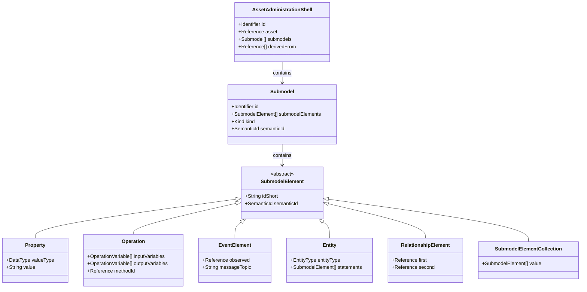

# AAS 元模型与 OPC UA 信息模型的完整映射

> **版本**: 2026-06-06
> **对齐标准**: IEC 63278-1:2023, OPC UA Companion Specification for AAS (I4AAS), IEC 61360, IDTA-01001-3-0
> **定位**: 详细说明资产管理壳 (AAS) 元模型与 OPC UA 信息模型的逐元素映射规则、复用策略与工程示例

---

## 1. 为什么需要 AAS-OPC UA 映射

AAS (Asset Administration Shell) 是工业 4.0 的数字孪生核心标准，IEC 63278-1:2023 定义了其元模型。OPC UA (IEC 62541) 是工业通信的事实标准。二者的映射实现了三层价值：

| 价值层级 | 说明 | 典型场景 |
|---------|------|---------|
| **物理资产 ↔ 数字孪生** | 通过 OPC UA 实时读写 AAS 中的动态数据 | 传感器温度写入 AAS Property |
| **跨厂商互操作** | 不同厂商的 OPC UA Server 统一暴露 AAS 结构 | 西门子 PLC 与 Beckhoff IPC 的 AAS 互通 |
| **IT/OT 桥接** | AAS 面向 IT 层的语义 richness，OPC UA 面向 OT 层的实时性 | MES 通过 OPC UA 订阅 AAS Event |

> **定理 I.AAS.1** (AAS-OPC UA Interoperability): 若 AAS 子模型严格遵循标准模板，且 OPC UA Server 正确实现 I4AAS Companion Specification，则不同厂商的工具可以无需适配即消费该 AAS 的内容。

---

## 2. AAS 元模型概览

IEC 63278-1:2023 定义的 AAS 元模型核心元素：



---

## 3. OPC UA 信息模型概览

OPC UA 信息模型以**节点（Node）**为核心，每个节点由 `NodeId` 全局唯一标识，通过**引用（Reference）**构成地址空间（Address Space）：

| OPC UA 节点类别 | 语义 | 典型用途 |
|---------------|------|---------|
| **Object** | 复合实体，可包含其他节点 | 设备、子模型、元素集合 |
| **Variable** | 数据值，含 DataValue 属性 | 传感器读数、配置参数 |
| **Method** | 可调用操作 | 启动服务、执行诊断 |
| **Event** | 异步通知 | 报警、状态变更 |
| **ObjectType** | 对象类型定义 | 子模型模板类型 |
| **VariableType** | 变量类型定义 | Property 的数据类型约束 |
| **DataType** | 数据结构定义 | 枚举、结构体 |
| **ReferenceType** | 引用类型定义 | HasComponent、HasProperty |

---

## 4. 逐元素映射表：AAS → OPC UA

### 4.1 核心概念映射

| AAS 元模型元素 | OPC UA 对应概念 | 映射策略 | 复用策略 |
|--------------|----------------|---------|---------|
| `AssetAdministrationShell` | `Object` (AASFolderType) | AAS 根节点映射为 OPC UA AddressSpace 中的顶层 Folder | 一个 Server 可暴露多个 AAS Object |
| `Submodel` | `Object` (AASSubmodelType) | 子模型映射为 Object，其 `semanticId` 映射为 `HasTypeDefinition` | 标准子模型映射为标准化 ObjectType |
| `Property` | `Variable` (AASPropertyType) | `valueType` → `DataType`，`value` → `Value` | 语义标识通过 `DictionaryEntry` 关联 ECLASS/IEC CDD |
| `Operation` | `Method` | `inputVariables` → `InputArguments`，`outputVariables` → `OutputArguments` | 标准操作映射为 Companion Spec 预定义 Method |
| `EventElement` | `EventType` + `EventNotifier` | `observed` → `EventNotifier` 属性，`messageTopic` → `EventType.BrowseName` | 使用 OPC UA Alarms & Conditions 框架 |
| `Entity` | `Object` | `entityType` → `ObjectType`，`statements` → `HasComponent` 引用 | 自描述设备映射为 `DeviceType` 实例 |
| `RelationshipElement` | `Reference` | `first`/`second` → 源/目标 `NodeId` | 使用语义化 ReferenceType（如 `HasPart`） |
| `SubmodelElementCollection` | `Object` (FolderType) | 集合元素映射为子节点，通过 `HasComponent` 组织 | 复用 `FolderType` 的层次结构语义 |
| `ConceptDescription` | `VariableType` / `DictionaryEntry` | 概念描述映射为数据字典条目 | ECLASS IRDI / IEC CDD 语义标识直接引用 |
| `Identifier` | `NodeId` | IRI → `NamespaceUri` + `Identifier` | 全局唯一标识保证跨 Server 一致性 |

### 4.2 数据类型映射

| AAS `valueType` | OPC UA `DataType` | 说明 |
|----------------|------------------|------|
| `xs:string` | `String` | UTF-8 编码字符串 |
| `xs:integer` | `Int32` / `Int64` | 根据值范围选择 |
| `xs:long` | `Int64` | 64 位有符号整数 |
| `xs:double` | `Double` | IEEE 754 双精度浮点 |
| `xs:boolean` | `Boolean` | 布尔值 |
| `xs:dateTime` | `UtcTime` | UTC 时间戳 |
| `xs:base64Binary` | `ByteString` | 二进制数据 |
| `xs:decimal` | `Decimal` | 高精度十进制数 |
| `xs:float` | `Float` | IEEE 754 单精度浮点 |
| `IEC 61360:Date` | `DateTime` | 日期类型 |

### 4.3 标识符映射

AAS 的 `Identifier`（IRI 或 IRDI 格式）映射到 OPC UA 的 `NodeId`：

```
AAS Identifier:  https://example.com/aas/MotorAAS_001
                 ↓
OPC UA NodeId:   ns=2;i=1001  或  ns=2;s=https://example.com/aas/MotorAAS_001
                 
其中 ns=2 对应 NamespaceUri "https://example.com/aas/"
```

---

## 5. AAS 子模型映射示例

### 5.1 输入：AAS JSON（Nameplate 子模型）

```json
{
  "assetAdministrationShells": [{
    "id": "https://example.com/aas/MotorAAS_001",
    "idShort": "MotorAAS_001",
    "asset": {
      "keys": [{"type": "Asset", "value": "https://example.com/assets/Motor001"}]
    },
    "submodels": [{
      "keys": [{"type": "Submodel", "value": "https://example.com/sm/Nameplate"}]
    }]
  }],
  "submodels": [{
    "id": "https://example.com/sm/Nameplate",
    "idShort": "Nameplate",
    "semanticId": {
      "keys": [{"type": "Submodel", "value": "https://admin-shell.io/idta/SubmodelTemplate/Nameplate/2/0"}]
    },
    "kind": "Instance",
    "submodelElements": [
      {
        "modelType": "Property",
        "idShort": "ManufacturerName",
        "semanticId": {"keys": [{"type": "ConceptDescription", "value": "0173-1#02-AAO677#002"}]},
        "valueType": "xs:string",
        "value": "Siemens AG"
      },
      {
        "modelType": "Property",
        "idShort": "SerialNumber",
        "semanticId": {"keys": [{"type": "ConceptDescription", "value": "0173-1#02-AAM556#002"}]},
        "valueType": "xs:string",
        "value": "SN-12345678"
      },
      {
        "modelType": "Property",
        "idShort": "YearOfConstruction",
        "semanticId": {"keys": [{"type": "ConceptDescription", "value": "0173-1#02-AAP906#001"}]},
        "valueType": "xs:string",
        "value": "2024"
      },
      {
        "modelType": "SubmodelElementCollection",
        "idShort": "ManufacturerProductDesignation",
        "semanticId": {"keys": [{"type": "ConceptDescription", "value": "0173-1#02-AAW338#001"}]},
        "value": [
          {
            "modelType": "Property",
            "idShort": "ManufacturerProductType",
            "valueType": "xs:string",
            "value": "SIMOTICS S-1FL6"
          }
        ]
      }
    ]
  }]
}
```

### 5.2 输出：OPC UA 地址空间（层次结构）

```
Objects
└── AssetAdministrationShells (FolderType)
    └── MotorAAS_001 (AASAssetAdministrationShellType)
        ├── Identification (AASIdentifierType)
        │   ├── Id: "https://example.com/aas/MotorAAS_001" [String]
        │   └── IdType: "IRI" [IdentifierType]
        ├── Asset (AASReferenceType)
        │   └── Keys
        │       └── [0]: Type=Asset, Value="https://example.com/assets/Motor001"
        └── Submodels (FolderType)
            └── Nameplate (AASSubmodelType)
                ├── SemanticId: "https://admin-shell.io/idta/SubmodelTemplate/Nameplate/2/0"
                ├── Kind: "Instance" [AASKindType]
                ├── ManufacturerName (AASPropertyType)
                │   ├── Value: "Siemens AG" [String]
                │   ├── ValueType: "xs:string"
                │   └── SemanticId: "0173-1#02-AAO677#002" [ConceptDescriptionRef]
                ├── SerialNumber (AASPropertyType)
                │   ├── Value: "SN-12345678" [String]
                │   ├── ValueType: "xs:string"
                │   └── SemanticId: "0173-1#02-AAM556#002"
                ├── YearOfConstruction (AASPropertyType)
                │   ├── Value: "2024" [String]
                │   ├── ValueType: "xs:string"
                │   └── SemanticId: "0173-1#02-AAP906#001"
                └── ManufacturerProductDesignation (AASSubmodelElementCollectionType)
                    ├── SemanticId: "0173-1#02-AAW338#001"
                    └── ManufacturerProductType (AASPropertyType)
                        ├── Value: "SIMOTICS S-1FL6" [String]
                        └── ValueType: "xs:string"
```

---

## 6. XML/JSON 示例：AASX 包中的 OPC UA NodeSet 映射

### 6.1 AASX 包结构

AASX（基于 Open Packaging Conventions / ZIP）可包含多种序列化：

```
MotorAAS_001.aasx
├── [Content_Types].xml
├── aas/
│   └── aas.json                 ← AAS JSON 序列化
├── opc_ua/
│   └── Opc.Ua.I4AAS.NodeSet2.xml ← OPC UA NodeSet（I4AAS Companion Spec）
├── docs/
│   └── datasheet.pdf
└── media/
    └── motor_3d.step
```

### 6.2 OPC UA NodeSet XML 片段

以下片段展示 AAS `Property` 到 OPC UA `UAVariable` 的映射：

```xml
<?xml version="1.0" encoding="utf-8"?>
<UANodeSet xmlns="http://opcfoundation.org/UA/2008/02/Types.xsd"
           xmlns:uax="http://opcfoundation.org/UA/2008/02/Types.xsd"
           xmlns:xsi="http://www.w3.org/2001/XMLSchema-instance"
           xmlns:xsd="http://www.w3.org/2001/XMLSchema"
           xmlns:aas="http://opcfoundation.org/UA/I4AAS/">

  <!-- 命名空间声明 -->
  <NamespaceUris>
    <Uri>http://opcfoundation.org/UA/I4AAS/</Uri>
    <Uri>https://example.com/aas/</Uri>
  </NamespaceUris>

  <!-- AAS AssetAdministrationShell 映射为 Object -->
  <UAObject NodeId="ns=2;s=https://example.com/aas/MotorAAS_001"
            BrowseName="2:MotorAAS_001"
            ParentNodeId="i=85">
    <DisplayName>MotorAAS_001</DisplayName>
    <Description>Asset Administration Shell for Motor001</Description>
    <References>
      <Reference ReferenceType="HasTypeDefinition">aas:AASAssetAdministrationShellType</Reference>
      <Reference ReferenceType="Organizes" IsForward="false">i=85</Reference>
    </References>
  </UAObject>

  <!-- Nameplate Submodel 映射为 Object -->
  <UAObject NodeId="ns=2;s=https://example.com/sm/Nameplate"
            BrowseName="2:Nameplate"
            ParentNodeId="ns=2;s=https://example.com/aas/MotorAAS_001">
    <DisplayName>Nameplate</DisplayName>
    <References>
      <Reference ReferenceType="HasTypeDefinition">aas:AASSubmodelType</Reference>
      <Reference ReferenceType="HasComponent" IsForward="false">
        ns=2;s=https://example.com/aas/MotorAAS_001
      </Reference>
    </References>
  </UAObject>

  <!-- ManufacturerName Property 映射为 Variable -->
  <UAVariable NodeId="ns=2;s=https://example.com/sm/Nameplate/ManufacturerName"
              BrowseName="2:ManufacturerName"
              ParentNodeId="ns=2;s=https://example.com/sm/Nameplate"
              DataType="String"
              ValueRank="-1">
    <DisplayName>ManufacturerName</DisplayName>
    <Description>Manufacturer name of the asset</Description>
    <References>
      <Reference ReferenceType="HasTypeDefinition">aas:AASPropertyType</Reference>
      <Reference ReferenceType="HasProperty" IsForward="false">
        ns=2;s=https://example.com/sm/Nameplate
      </Reference>
      <!-- SemanticId 映射为 HasDictionaryEntry 引用 -->
      <Reference ReferenceType="HasDictionaryEntry">
        ns=3;s=0173-1#02-AAO677#002
      </Reference>
    </References>
    <Value>
      <uax:String>Siemens AG</uax:String>
    </Value>
  </UAVariable>

  <!-- Operation 映射为 Method -->
  <UAMethod NodeId="ns=2;s=https://example.com/sm/Service/Restart"
            BrowseName="2:Restart"
            ParentNodeId="ns=2;s=https://example.com/sm/Service">
    <DisplayName>Restart</DisplayName>
    <Description>Restart the device</Description>
    <References>
      <Reference ReferenceType="HasTypeDefinition">aas:AASOperationType</Reference>
      <Reference ReferenceType="HasComponent" IsForward="false">
        ns=2;s=https://example.com/sm/Service
      </Reference>
    </References>
  </UAMethod>

</UANodeSet>
```

### 6.3 JSON 映射示例（REST API 场景）

当通过 AAS REST API（IDTA Part 2）访问时，OPC UA Server 可作为网关将 AAS JSON 动态映射为 OPC UA AddressSpace：

```json
{
  "endpoint": "opc.tcp://gateway.example.com:4840",
  "namespaceUri": "https://example.com/aas/",
  "aasId": "https://example.com/aas/MotorAAS_001",
  "mappings": [
    {
      "aasPath": "/submodels/Nameplate/submodelElements/ManufacturerName",
      "opcUaNodeId": "ns=2;s=https://example.com/sm/Nameplate/ManufacturerName",
      "opcUaAttribute": "Value",
      "updateMode": "subscribe"
    },
    {
      "aasPath": "/submodels/TechnicalData/submodelElements/RatedPower",
      "opcUaNodeId": "ns=2;s=https://example.com/sm/TechnicalData/RatedPower",
      "opcUaAttribute": "Value",
      "updateMode": "poll",
      "pollIntervalMs": 1000
    }
  ]
}
```

---

## 7. 映射规则详解

### 规则 1: 标识符处理

AAS 的 `identification.id`（IRI 格式）映射到 OPC UA 的 `NodeId`：

| AAS 标识类型 | OPC UA NodeId 格式 | 示例 |
|------------|------------------|------|
| IRI | `ns=<idx>;s=<IRI>` | `ns=2;s=https://example.com/aas/Motor001` |
| IRDI | `ns=<idx>;s=<IRDI>` | `ns=3;s=0173-1#02-AAO677#002` |
| Custom | `ns=<idx>;i=<localId>` | `ns=2;i=1001` |

### 规则 2: 语义标识（SemanticId）映射

AAS `semanticId` 映射到 OPC UA `HasDictionaryEntry` 引用，指向外部数据字典：

```
AAS Property.semanticId = "0173-1#02-AAO677#002" (ECLASS)
                ↓
OPC UA: ReferenceType = "HasDictionaryEntry"
        Target = 数据字典中的 ConceptDescription 节点
```

### 规则 3: 操作（Operation）映射

AAS `Operation` 映射为 OPC UA `Method`：

| AAS Operation | OPC UA Method | 说明 |
|--------------|--------------|------|
| `inputVariables[]` | `InputArguments[]` (Argument 数组) | 输入参数类型与名称 |
| `outputVariables[]` | `OutputArguments[]` (Argument 数组) | 输出参数类型与名称 |
| `inoutputVariables[]` | `InputArguments[]` + 返回值 | 双向参数 |
| 调用语义 | `Call` 服务 | OPC UA Session 上的方法调用 |

### 规则 4: 事件（EventElement）映射

AAS `EventElement` 映射为 OPC UA `EventType`：

```
AAS EventElement:
  - observed: 被观察的属性引用
  - messageTopic: 事件主题
  - direction: 方向（Input/Output）

OPC UA 映射:
  - observed → EventNotifier 属性（在源对象上）
  - messageTopic → EventType.BrowseName
  - payload → Event 字段（使用 SelectedFields 过滤）
```

---

## 8. 复用策略

### 8.1 子模型模板复用

同一类型的设备共享相同的子模型模板。例如所有电机都使用 `Nameplate` + `Technical Data` 子模型。OPC UA 中对应为**类型定义复用**：

```
AASSubmodelType (抽象类型)
  └── AASSubmodelNameplateType (具体类型，由 I4AAS 定义)
        └── 实例: Motor001/Nameplate
        └── 实例: Motor002/Nameplate
```

### 8.2 OPC UA Companion Specification 复用

设备厂商根据 I4AAS Companion Specification 实现 OPC UA Server，自动暴露 AAS 结构。认证流程：

1. 厂商实现 `AASAssetAdministrationShellType` 和 `AASSubmodelType`；
2. 通过 OPC Foundation 的 CTT（Compliance Test Tool）验证；
3. 获得 "OPC UA I4AAS Compatible" 认证标识。

### 8.3 AASX 包交换复用

AAS 配置以 AASX（ZIP + JSON/XML + 附件）格式交换，实现跨工具、跨厂商的复用。AASX 包中的 OPC UA NodeSet 文件可直接导入 UA Server：

```
工程工具 A (Siemens TIA Portal)
    ↓ 导出 AASX
AASX Package Explorer
    ↓ 验证并嵌入 Opc.Ua.I4AAS.NodeSet2.xml
OPC UA Server (Eclipse Milo / open62541)
    ↓ 加载 NodeSet
HMI / MES / Cloud Platform
```

---

## 9. 关键定理

> **定理 I.AAS.2** (Submodel Template Reuse): AAS 子模型模板的复用价值与其在行业中的采纳率成正比。单个企业的自定义模板复用价值有限；行业标准模板（如 IDTA 模板）复用价值最高。

> **定理 I.AAS.3** (OPC UA Mapping Completeness): 对于任意符合 IEC 63278-1 的 AAS 实例，存在一个与之语义等价的 OPC UA AddressSpace 表示，使得 AAS 的每个 SubmodelElement 都可在 OPC UA 中找到对应的节点或引用。

---

## 10. 与知识体系其他主题的关联

```
11-industrial-iot-otit/05-digital-twin-aas/
    ├── 向上关联: 02-opc-ua-fx/（OPC UA FX 的实时通信语义）
    ├── 横向关联: 04-plcopen-motion/（运动控制功能块作为 AAS Operation 暴露）
    ├── 向下关联: 07-edge-ai/（边缘 AI 推理结果写入 AAS Time Series 子模型）
    └── 方法关联: 07-formal-verification/（AAS-OPC UA 映射规则的 Alloy 约束验证）
```

---

## 11. 参考索引

- IEC 63278-1:2023 — *Asset Administration Shell for industrial applications — Part 1: Administration Shell structure*
- IEC 62541 (OPC UA) — *OPC Unified Architecture*
- OPC 30270 — *OPC UA Companion Specification for I4AAS*
- IDTA-01001-3-0 — *Details of the Asset Administration Shell Part 1 — V3.0*
- IDTA-01002-3-0 — *Part 2: Application Programming Interfaces*
- IEC 61360 — *IEC Common Data Dictionary (CDD)*
- [ECLASS](https://www.eclass.eu) — 工业分类标准与属性字典
- [OPC Foundation I4AAS Working Group](https://opcfoundation.org/markets-collaboration/I4AAS/)
- [Eclipse BaSyx](https://www.eclipse.org/basyx/) — AAS 开源运行时与 OPC UA 网关参考实现
