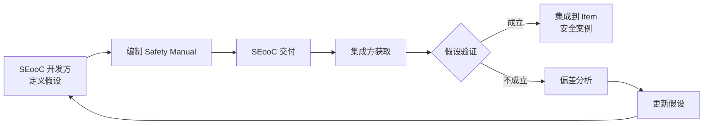
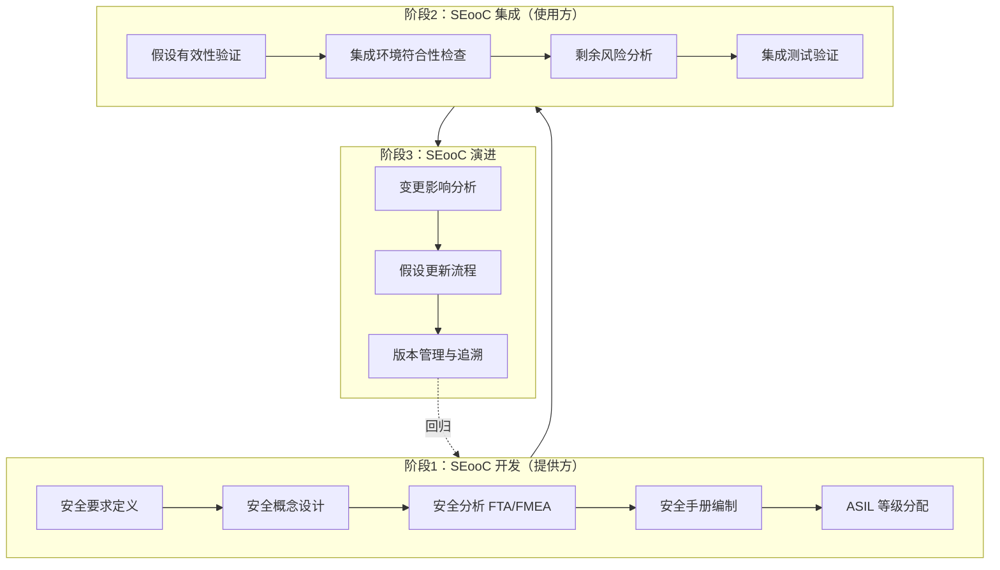

# ISO 26262-8 Clause 12 SEooC 复用流程与安全手册模板

> **版本**：2026-06-08 · v1.0
> **定位**：功能安全层软件复用的 SEooC 开发、集成与演进模板
> **对齐**：ISO 26262-8:2018 Clause 12 / ISO 26262-10:2018 / OEM SEooC 最佳实践
> **状态**：模板级，需按具体 item HARA 裁剪后使用
> **交叉引用**：[`iec-61508-iso-26262-sotif-alignment.md`](./iec-61508-iso-26262-sotif-alignment.md) §4 SEooC 概念、§7 复用组件安全案例

---

## 1. SEooC 核心概念

### 1.1 什么是 SEooC

SEooC（Safety Element out of Context）是在**没有具体项目上下文**的情况下开发的安全相关元素。与项目内开发元素的对比如下：

| 维度 | 项目内开发元素 (In-Context) | SEooC (Out-of-Context) |
|------|----------------------------|------------------------|
| 安全目标来源 | 具体 item HARA 导出 | 基于合理假设推导 |
| ASIL 分配 | 直接关联整车级安全目标 | 按假设 ASIL 开发，集成方验证 |
| 安全案例 | 嵌入整车安全案例 | 不可独立建立（ISO 26262-2, Note 4.5.7） |
| 可追溯性 | 需求→设计→实现→测试 闭环 | 假设→验证→集成 闭环 |

### 1.2 假设-验证闭环

SEooC 的本质是**假设驱动**：开发方对缺失的车辆级信息创建假设（Assumptions of Use / Environment），集成方验证假设成立。

> ⚠️ **关键限制**：SEooC **不是固有 "ASIL 认证"** —— 最终 ASIL 有效性取决于集成验证。多数集成失败源于 Safety Manual 假设被违反。

### 1.3 ASIL 分解与 SEooC

SEooC 可作为 ASIL 分解的独立元素接收分解后目标。例如整车级 ASIL D 分解为 SEooC-A（ASIL B(D)）+ SEooC-B（ASIL B(D)）+ 系统冗余。集成方须验证 SEooC 假设与 ASIL 分解的独立性兼容（无共因故障、充分的无干扰）。

---

## 2. SEooC 复用流程模板（ISO 26262-8 Clause 12）

### 2.1 总体流程

### 2.2 阶段1：SEooC 开发（提供方）

| 活动 | 输出物 | 关键要求 |
|------|--------|----------|
| **安全要求定义** | 假设驱动的 SRS | 假设覆盖功能、环境、接口、时序、诊断预算 |
| **安全概念设计** | TSC | 安全机制嵌入设计；明确外部交互边界 |
| **安全分析** | FTA / FMEA | 分析假设条件下故障模式；识别残余风险 |
| **安全手册编制** | Safety Manual | 含假设列表、限制条件、集成指南、验证方法 |
| **ASIL 等级分配** | ASIL 声明 | 仅在假设成立时有效；声明支持的分解模式 |

### 2.3 阶段2：SEooC 集成（使用方）

| 活动 | 输出物 | 关键要求 |
|------|--------|----------|
| **假设有效性验证** | 假设验证报告 | 逐条验证 AoU / AoE；映射到 item 安全概念 |
| **集成环境符合性检查** | 环境符合性声明 | 温度、EMC、供电、机械负载满足假设 |
| **剩余风险分析** | 残余风险评估 | 识别未覆盖故障；必要时增加系统级安全机制 |
| **集成测试验证** | 集成测试报告 | 功能测试、故障注入、接口测试、时序验证 |

### 2.4 阶段3：SEooC 演进

| 活动 | 触发条件 | 关键要求 |
|------|----------|----------|
| **变更影响分析** | 缺陷修复 / 功能增强 | 评估对假设、ASIL、接口、测试覆盖的影响 |
| **假设更新流程** | 新场景 / 假设被证伪 | 修订 Safety Manual；通知所有已集成项目 |
| **版本管理与追溯** | 任何变更 | 维护假设版本历史；集成方可追溯 SEooC 版本及假设集 |

> 维护场景参见 [`iec-61508-iso-26262-sotif-alignment.md`](./iec-61508-iso-26262-sotif-alignment.md) §4.4。

---

## 3. 安全手册模板（Safety Manual）

安全手册是 SEooC 复用的**核心交付物**，为集成方提供集成、配置和验证指导。

| 章节 | 内容 | 示例 |
|------|------|------|
| **功能描述** | 元素功能、性能指标、版本 | 电机控制算法 v2.1；PWM 频率 20 kHz |
| **安全功能** | 安全机制及对应安全目标 | 转矩监控（±2%）；过流保护（150 A，≤ 5 ms） |
| **ASIL 等级** | 分配的 ASIL 及适用条件 | ASIL D（假设供电稳定、-40~85°C、外部看门狗） |
| **假设列表 (AoU/AoE)** | 使用方必须满足的条件 | 供电 12 V ±5%；看门狗 ≤ 50 ms；CAN 周期 10 ms ±1 ms |
| **验证方法** | 如何验证假设成立 | 环境测试报告（IEC 60068-2）；系统级 HARA 映射表 |
| **限制条件** | 禁止场景、边界条件 | 不得用于线控制动主路径；不支持 OTA 更新期间运行 |
| **集成指南** | 步骤和检查项 | 见 §4 检查清单；配置参数表；初始化序列 |
| **已知缺陷与变通** | 未修复缺陷及临时措施 | v2.1 在 >125°C 偶发 ADC 异常；集成方需外部温度降额保护 |
| **追溯矩阵** | 需求→设计→测试→假设 | 需求 ID → 架构模块 → 单元测试 ID → 验证假设 ID |

---

## 4. 集成检查清单（20 项核心检查）

### 4.1 假设验证（5 项）

- [ ] **A1** 逐条核对 Safety Manual 中所有 AoU 与目标 item HARA 的一致性
- [ ] **A2** 逐条核对所有 AoE 与目标车辆/系统运行环境的符合性
- [ ] **A3** 验证 ASIL 分解假设：SEooC 参与的分解架构满足独立性要求（无共因故障）
- [ ] **A4** 验证诊断预算假设：SEooC 的故障检测时间 / 覆盖率被系统级安全机制满足
- [ ] **A5** 验证时序假设：SEooC 要求的响应时间、刷新周期、通信延迟在目标架构可实现

### 4.2 接口检查（5 项）

- [ ] **I1** 数据类型与范围：输入/输出信号的数据类型、量程、精度与 SEooC 规格一致
- [ ] **I2** 通信协议：总线类型（CAN/CAN-FD/Ethernet）、波特率、报文周期符合假设
- [ ] **I3** 错误处理接口：SEooC 的错误码 / 安全状态输出被系统级故障处理正确消费
- [ ] **I4** 初始化与关闭序列：启动时序、依赖关系、安全状态默认值符合集成指南
- [ ] **I5** 配置参数：所有可配置参数在允许范围内，且已基线化记录

### 4.3 环境符合（4 项）

- [ ] **E1** 电气环境：供电电压范围、纹波、瞬态脉冲（如 ISO 7637-2 Pulse 5）满足假设
- [ ] **E2** 温度与机械：工作温度、振动、冲击满足假设（参考 IEC 60068-2）
- [ ] **E3** EMC 与 ESD：辐射发射、抗扰度、ESD 满足假设（参考 CISPR 25 / ISO 11452）
- [ ] **E4** 共存分析：同一硬件上其他软件元素对 SEooC 的干扰已评估（无干扰 / 共存分析）

### 4.4 测试覆盖（4 项）

- [ ] **T1** 功能测试：SEooC 安全功能在集成环境中按预期工作
- [ ] **T2** 故障注入：对关键输入注入故障，验证安全机制正确进入安全状态
- [ ] **T3** 边界测试：在假设边界值（最小/最大/异常）下验证 SEooC 行为
- [ ] **T4** 回归测试：SEooC 版本升级后，执行完整集成级回归测试套件

### 4.5 文档完整（2 项）

- [ ] **D1** 安全手册版本：使用的 Safety Manual 版本与 SEooC 交付版本严格对应
- [ ] **D2** 集成证据归档：假设验证记录、测试报告、偏差分析已归档并可供审计

---

## 5. 与 IEC 61508 的对比

### 5.1 SEooC (ISO 26262) vs Proven-in-Use (IEC 61508)

| 维度 | SEooC (ISO 26262-8 Clause 12) | Proven-in-Use (IEC 61508 Route 2H) |
|------|------------------------------|-----------------------------------|
| **核心逻辑** | 假设驱动：基于假设开发，集成时验证 | 数据驱动：基于运行历史统计证明可靠性 |
| **适用对象** | 硬件 / 软件元素（特别是软件） | primarily 硬件（阀门、执行器、继电器等） |
| **开发阶段** | 可从头为复用开发 | 需先有大量现场运行数据 |
| **证据重点** | 安全手册、假设验证、分析记录 | 运行小时数、故障统计、χ² 置信区间 |
| **变更容忍** | 变更后经影响分析 + 回归验证更新 | 设计或固件变更即失效，需重新积累数据 |
| **ASIL/SIL 关系** | 按假设 ASIL 开发，集成方确认 | 仅替代随机硬件故障率论证；系统性能力要求不变 |

> PIU 详细要求参见 [`iec-61508/iec-61508-ed3-reuse.md`](./iec-61508/iec-61508-ed3-reuse.md)。

### 5.2 路径选择决策

| 场景 | 推荐路径 | 理由 |
|------|----------|------|
| 全新软件组件跨项目复用 | **SEooC** | 无历史数据；假设驱动是唯一可行路径 |
| 硬件已有 ≥10⁶ 小时现场记录 | **PIU** | 统计数据充分；PIU 反映真实老化性能 |
| 既有 ISO 26262 组件复用至新项目 | **SEooC** | 转换原项目证据为假设驱动安全手册 |
| 汽车传感器跨域复用至工业 | **SEooC → 映射** | 按 ISO 26262 开发后，映射至目标 SIL |
| 软件有运行历史但无安全证据 | **SEooC** | PIU 不适用于软件；需按 ISO 26262-6 补开发证据 |

---

## 6. 权威来源

| 文档 | 状态 | 用途 |
|------|------|------|
| **ISO 26262-8:2018 Clause 12** | 当前有效版 | SEooC 开发、集成、演进的规范性要求 |
| **ISO 26262-10:2018** | 当前有效版 | SEooC 指南与示例，含假设定义和安全手册指导 |
| **ISO 26262-2:2018** | 当前有效版 | 功能安全管理；Note 4.5.7 明确 SEooC 不能独立建立安全案例 |
| **IEC 61508-2:2010 / Ed.3 (预期)** | Ed.3 CDV 已完成 | PIU (Route 2H) 硬件随机故障率论证路径 |
| **IEC TR 61508-6-1** | 预期发布 | ISO 26262 组件向 IEC 61508 复用的映射框架 |
| **TÜV SÜD / Intertek OEM 指南** | 行业最佳实践 | SEooC 审计检查清单、Safety Manual 评审模板 |

---

> **使用提示**：本模板为 SEooC 复用提供框架。建议将 §3 安全手册模板和 §4 检查清单嵌入 ALM / 需求管理工具（如 Jama、DOORS、Polarion），实现假设到系统级需求的可追溯自动化。
