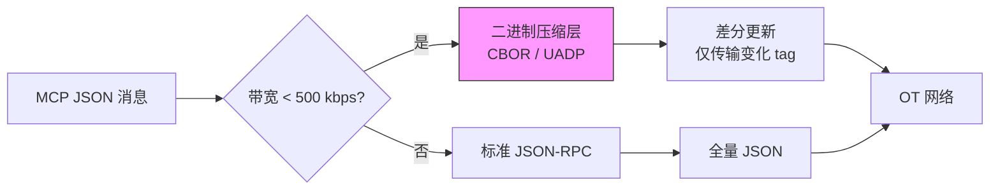
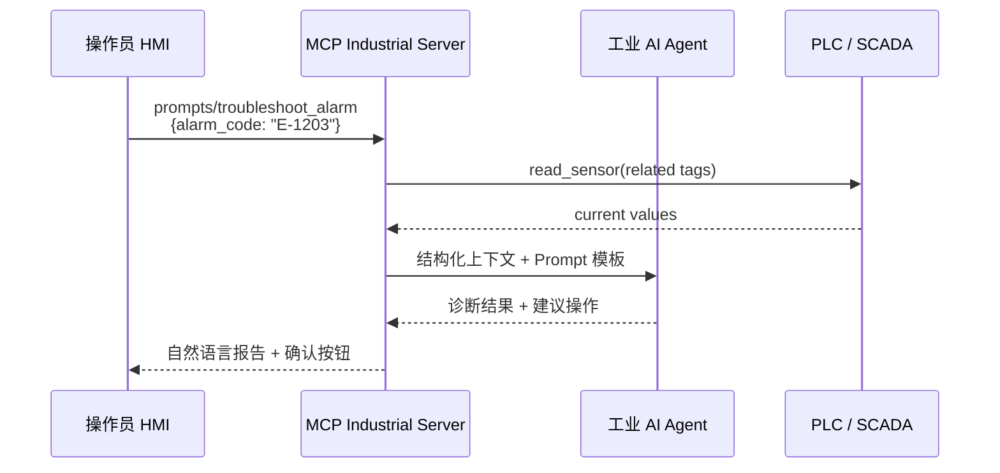
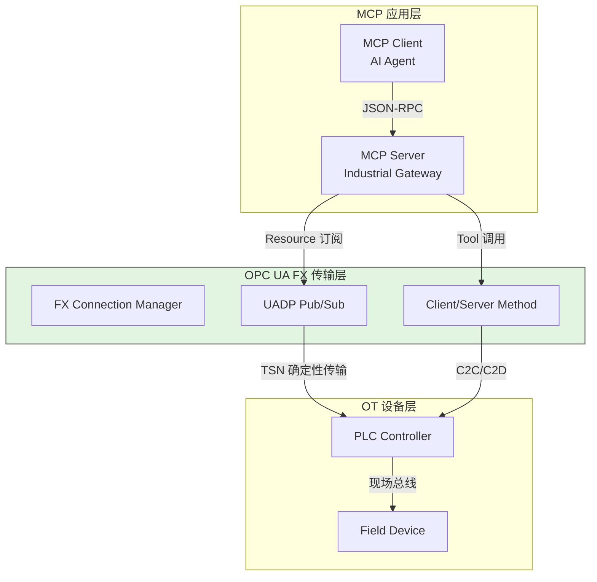

# MCP for Industrial AI 协议草案

> **版本**: 2026-06-08
> **对齐标准**: MCP 2025-11-25 规范草案, OPC UA FX 1.0, IEC 62443-3-3 / 62443-4-2
> **定位**: 将 Model Context Protocol (MCP) 扩展至工业 OT 场景，定义工业 AI Agent 与 PLC、SCADA、Historian 及边缘模型的确定性交互语义

---

## 1. 工业场景的特殊需求

MCP 默认面向云端异步 RPC，工业现场的四项核心约束要求对其进行扩展。

### 1.1 确定性通信

MCP 默认基于 JSON-RPC，不保证延迟上界。工业控制回路要求严格上界。

| 场景 | 允许最大延迟 | MCP 默认是否满足 | 必要扩展 |
|------|------------|----------------|---------|
| 运动控制指令 | < 1 ms | 否 | TSN 时间感知调度 |
| 安全停机信号 | < 10 ms | 否 | 冗余通道 + 硬实时传输 |
| 预测性维护推理 | < 100 ms | 边缘可满足 | 本地 MCP Server |
| 生产报表生成 | < 1 s | 是 | 无需扩展 |

> **公理 MIA.1** (Industrial Determinism): 穿越 OT 边界的 MCP 消息必须映射到确定性传输（OPC UA FX Pub/Sub over TSN），或声明非确定性并配套降级策略。

### 1.2 低带宽优化

工业现场网络（尤其棕地改造）可能仅提供 100 kbps–1 Mbps。



策略：CBOR 替代 JSON（省 40–60% 载荷）；UADP 帧直接嵌入采样值；Deadband 差分订阅；边缘批量聚合。

### 1.3 安全认证

IEC 62443 定义安全等级（SL），MCP 工业扩展必须对齐：

| SL | 威胁场景 | MCP 扩展要求 |
|---|---------|-------------|
| **SL 1** | 偶然误操作 | 基础 X.509 身份认证 |
| **SL 2** | 通用恶意攻击 | 双向 TLS + RBAC |
| **SL 3** | 复杂攻击者 | 命令数字签名 + 审计日志不可篡改 |
| **SL 4** | 国家级别 | 物理隔离 + 单向数据二极管 |

### 1.4 语义互操作性

工业 OT 协议（Modbus、OPC UA、Profinet 等）拥有数十年语义资产。MCP 工业适配必须复用这些语义，而非重建平行命名空间。

---

## 2. MCP 工业适配草案

### 2.1 Tools 规范

工业 AI Agent 可调用的工具集。每个工具声明 **WCET 估计**、**安全影响等级**及**RBAC 权限**。

| 工具名称 | 输入 | 输出 | WCET | 安全影响 | RBAC 权限 |
|---------|------|------|------|---------|----------|
| `read_sensor(tag)` | `{tag: "Line1.Press.AI1"}` | `{value, quality, ts}` | < 5 ms | 无 | `sensor:read` |
| `write_actuator(tag, val)` | `{tag, val}` | `{ack, exec_ts}` | < 10 ms | 中 | `actuator:write` |
| `predict_anomaly(model, window)` | `{model, samples[]}` | `{score, is_anomaly}` | < 50 ms | 低 | `model:infer` |
| `query_historian(t0, t1, tags)` | `{from, to, tags[]}` | `{records[]}` | < 1 s | 无 | `historian:read` |

> **定理 MIA.2** (Tool Safety Partition): 具有 `safety:*` 权限的 Tool 必须在独立安全运行时中执行，与常规 Tool 进程隔离。

### 2.2 Resources 规范

工业 AI Agent 可访问的资源采用 URI 方案，直接映射 OT 命名空间：

| Resource URI | 语义 | 协议映射 | 更新模式 |
|-------------|------|---------|---------|
| `asset://{line}/{device}/{prop}` | 实时资产属性 | OPC UA Variable Node | Pub/Sub 采样 |
| `model://{task}/{type}/{ver}` | 边缘 AI 模型文件 | HTTPS / OPC UA FileType | 手动 OTA |
| `doc://{cat}/{doc}/{rev}` | 维护 SOP | HTTPS / AAS Submodel | 按需拉取 |
| `alarm://{area}/{sev}/{code}` | 活动报警 | OPC UA Condition | Event 推送 |

示例：

```json
{
  "uri": "asset://line1/press/temperature",
  "mimeType": "application/vnd.opcua+json",
  "metadata": {
    "opcua_nodeid": "ns=2;i=1001",
    "sampling_rate_ms": 100,
    "engineering_unit": "°C"
  }
}
```

### 2.3 Prompts 规范

工业场景预设提示封装领域知识：

| Prompt ID | 描述 | 输入 | 典型输出 |
|----------|------|------|---------|
| `troubleshoot_alarm` | 报警诊断 | `alarm_code`, `context_tags[]` | 根因分析 + 建议操作 |
| `optimize_schedule` | 排程优化 | `orders[]`, `constraints{}` | Gantt 图 + 瓶颈分析 |
| `predict_maintenance` | 预测性维护 | `asset_id`, `horizon_days` | 维护窗口 + 备件清单 |



---

## 3. 与 OPC UA FX 的映射

OPC UA FX 1.0 是现场级确定性通信标准。MCP 工业扩展通过以下映射复用 FX 基础设施：

| MCP 原语 | OPC UA FX 对应物 | 映射说明 |
|---------|-----------------|---------|
| **MCP Resource** | **OPC UA Node (Variable / Object)** | Resource URI 映射至 NodeId；通过 FX Address Space 统一解析 |
| **MCP Tool** | **OPC UA Method** | Tool 调用映射为 Method Call；参数映射为 Method Argument DataType |
| **MCP Sampling** | **OPC UA Pub/Sub (UADP)** | 实时更新通过 FX Pub/Sub 组播；周期映射为 PublishingInterval |
| **MCP Prompt** | **OPC UA Program StateMachine** | 复杂 Prompt 工作流映射为 IEC 61131-3 兼容 Program 状态机 |



> **定理 MIA.3** (FX-MCP Interoperability): 若 FX Connection Manager 已建立 Pub/Sub 绑定，MCP Resource 的 `sampling_rate_ms` 必须为其整数倍，避免采样混叠。

---

## 4. 安全机制扩展

在 MCP 基础安全之上，工业扩展引入 IEC 62443 对齐的三层机制：

### 4.1 基于 IEC 62443 的安全等级认证

| SL 目标 | 机制 | MCP 实现 |
|--------|------|---------|
| SL-2 | mTLS + RBAC | 强制校验 Client X.509；权限声明于 Session 建立时 |
| SL-3 | 命令签名 + 审计日志 | Tool 调用附加 Ed25519 签名；日志写入 WORM 存储 |
| SL-4 | 物理隔离 + 单向二极管 | MCP 仅暴露 Read-Only Resource；Write/Tool 禁用 |

### 4.2 命令签名与审计日志

```text
MCP Tool 调用安全增强
├── 请求：Client 生成负载 → HSM 私钥签名 → 附加 timestamp, nonce, signature
├── 验证：Server 校验 timestamp（Δt < 1s）、nonce 唯一性、signature、RBAC
├── 执行：记录审计日志（who, what, when, result）→ 通过则执行 Tool
└── 响应：返回结果 + Server 签名；异步推送审计至 SIEM
```

### 4.3 安全上下文传递

多层 MCP Server 级联（边缘网关 → 区域控制器 → 现场设备）时：

- **上下文绑定**：原始 Client 身份、SL 等级作为不可变上下文附加
- **禁止特权提升**：下游权限必须是上游权限的子集
- **上下文 TTL**：超过有效期（如 5 分钟）自动失效，需重新认证

---

## 5. 与现有体系的交叉引用

| 本草案内容 | 关联文档 | 说明 |
|-----------|---------|------|
| ISA-95 层级数据访问 | [`01-isa-95-model`](../01-isa-95-model/isa-95-asset-catalog-deep-dive.md) | L1-L3 传感器、执行器、Historian 的 Resource URI 命名空间 |
| OPC UA FX 确定性传输 | [`02-opc-ua-fx`](../02-opc-ua-fx/opc-ua-fx-reuse-hierarchy.md) | UADP 帧结构、Connection Manager、Pub/Sub 配置 |
| TSN 网络保障 | [`03-tsn-deterministic`](../03-tsn-deterministic/iec-ieee-60802-profile.md) | 802.1Qbv 门控列表为 MCP 实时消息提供确定性时隙 |
| PLCopen 运动控制 | [`04-plcopen-motion`](../04-plcopen-motion/plcopen-motion-control.md) | `write_actuator` Tool 对 MC 功能块的调用映射 |
| 数字孪生与 AAS | [`05-digital-twin-aas`](../05-digital-twin-aas/aas-opcua-mapping.md) | `asset://` URI 与 AAS 子模型、OPC UA NodeSet 联合解析 |
| 功能安全与 SIL | [`06-functional-safety`](../06-functional-safety/iec-61508-iso-26262-sotif-alignment.md) | 安全相关 Tool 的 SIL 认证要求与 IEC 61508 Ed.3 对齐 |
| 边缘 AI 模型部署 | [`model-deployment-spec.md`](./model-deployment-spec.md) | `model://` Resource 的管理、版本控制与运行时兼容性 |

---

## 6. 参考索引

- Model Context Protocol (MCP) Specification: 2025-11-25 draft ([modelcontextprotocol.io](https://modelcontextprotocol.io/))
- OPC UA FX 1.0: OPC 10000-80 / 10000-81 / 10000-82
- IEC 62443-3-3: System security requirements and security levels
- IEC 62443-4-2: Technical security requirements for IACS components
- IEC 61508 Ed.3 (CDV): Functional safety of E/E/PE safety-related systems
- IEC 61131-3: Programmable controllers – Programming languages
- OPC UA Pub/Sub: IEC 62541-14
- TSN IEEE 802.1Qbv: Enhancements for Scheduled Traffic
- NAMUR Open Architecture (NOA): [namur.net](https://www.namur.net)


---

## 补充章节

## 概念定义

**定义**：工业 IoT/OT-IT 复用是在制造、能源、交通等运营技术（OT）与信息技术（IT）融合场景中，复用 ISA-95 层级模型、OPC UA 信息模型、功能安全组件与数字孪生资产。

## 示例

**示例**：汽车工厂将 ISA-95 L0-L4 资产目录映射到 IEC 63278 资产管理壳（AAS），通过 OPC UA FX 实现现场设备与 MES/ERP 的即插即用复用。

## 反例

**反例**：将 IT 系统直接补丁策略套用到 PLC 产线，未考虑实时性约束与功能安全认证，导致停机与安全事故。

## 权威来源

> **权威来源**:
>
> - [ISA-95 / IEC 62264](https://www.isa.org/standards-and-publications/isa-standards/isa-95)
> - [OPC Foundation](https://opcfoundation.org)
> - [IEC 61508-1:2010](https://webstore.iec.ch/en/publication/5515)
> - [IEC 63278 AAS](https://iec.ch/dyn/www/f?p=103:38:0::::FSP_ORG_ID:1363)
> - 核查日期：2026-07-07