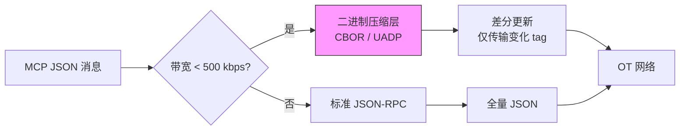
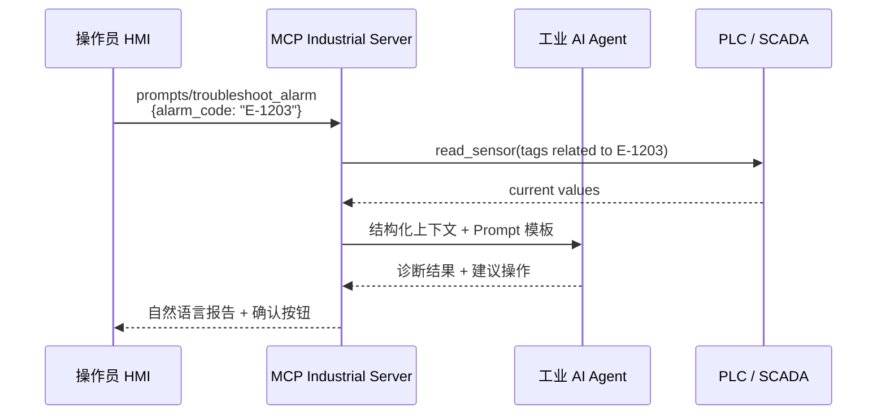
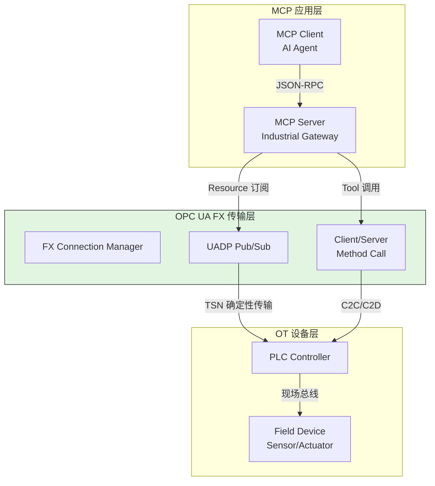

# MCP for Industrial AI 协议草案

> **版本**: 2026-06-08
> **对齐标准**: MCP 2025-11-25 规范草案, OPC UA FX 1.0, IEC 62443-3-3 / 62443-4-2
> **定位**: 将 Model Context Protocol (MCP) 扩展至工业 OT 场景，定义工业 AI Agent 与 PLC、SCADA、Historian 及边缘模型的确定性交互语义

---

## 目录

- [MCP for Industrial AI 协议草案](#mcp-for-industrial-ai-协议草案)
  - [1. 工业场景的特殊需求](#1-工业场景的特殊需求)
    - [1.1 确定性通信](#11-确定性通信)
    - [1.2 低带宽优化](#12-低带宽优化)
    - [1.3 安全认证](#13-安全认证)
    - [1.4 语义互操作性](#14-语义互操作性)
  - [2. MCP 工业适配草案](#2-mcp-工业适配草案)
    - [2.1 Tools 规范](#21-tools-规范)
    - [2.2 Resources 规范](#22-resources-规范)
    - [2.3 Prompts 规范](#23-prompts-规范)
  - [3. 与 OPC UA FX 的映射](#3-与-opc-ua-fx-的映射)
  - [4. 安全机制扩展](#4-安全机制扩展)
  - [5. 与现有体系的交叉引用](#5-与现有体系的交叉引用)
  - [6. 参考索引](#6-参考索引)

---

## 1. 工业场景的特殊需求

MCP 默认设计面向云端/企业 IT 的异步 RPC 环境（如 AI Assistant 调用本地文件系统或 SaaS API）。工业现场的物理与协议约束要求对 MCP 进行四项核心扩展。

### 1.1 确定性通信

MCP 默认基于 JSON-RPC over stdio/SSE，不保证延迟上界。工业控制回路要求通信延迟在**微秒至毫秒级**且有严格上界。

| 场景 | 允许最大延迟 | MCP 默认是否满足 | 必要扩展 |
|------|------------|----------------|---------|
| 运动控制指令 | < 1 ms | 否 | TSN 时间感知调度 + 优先级抢占 |
| 安全停机信号 | < 10 ms | 否 | 冗余通道 + 硬实时传输 |
| 预测性维护推理 | < 100 ms | 边缘可满足 | 本地 MCP Server，免云端往返 |
| 生产报表生成 | < 1 s | 是 | 无需扩展 |

> **公理 MIA.1** (Industrial Determinism): 任何穿越 OT 边界的 MCP 消息必须映射到底层确定性传输（OPC UA FX Pub/Sub over TSN），或明确声明为非确定性并配套降级策略。

### 1.2 低带宽优化

工业现场网络（尤其是棕地改造场景）可能仅提供 100 kbps–1 Mbps 的有效带宽，且存在高丢包率。



关键优化策略：
- **二进制序列化**：以 CBOR 替代 JSON，减少 40–60% 载荷
- **UADP 帧封装**：将 MCP Resource 采样值直接嵌入 OPC UA FX UADP 帧，避免应用层再封装
- **差分订阅**：MCP Client 仅订阅变化量（Deadband > 0.1% FS），而非全量轮询
- **边缘聚合**：现场网关聚合多个传感器采样后，以批量方式上报 MCP Server

### 1.3 安全认证

工业网络安全标准 IEC 62443 定义了**安全等级（SL, Security Level）**，MCP 工业扩展必须对齐该框架：

| IEC 62443 等级 | 威胁场景 | MCP 扩展要求 |
|---------------|---------|-------------|
| **SL 1** | 偶然误操作 | 基础身份认证（X.509 证书） |
| **SL 2** | 通用恶意攻击 | 双向 TLS + 基于角色的访问控制（RBAC） |
| **SL 3** | 复杂攻击者 | 命令数字签名 + 审计日志不可篡改 + 会话绑定硬件身份 |
| **SL 4** | 国家级别 | 物理隔离 + 单向数据二极管（MCP 仅只读） |

### 1.4 语义互操作性

工业 OT 协议（Modbus、OPC UA、Profinet、EtherNet/IP）拥有数十年积累的语义资产。MCP 工业适配必须复用这些语义，而非重建平行命名空间。

---

## 2. MCP 工业适配草案

以下规范扩展 MCP 的 Tools、Resources、Prompts 三大原语，使其可直接描述工业 AI Agent 的能力边界。

### 2.1 Tools 规范

工业 AI Agent 可调用的工具集。每个工具需声明**WCET 估计**、**安全影响等级**（SIL/无）及**所需 RBAC 权限**。

| 工具名称 | 输入 Schema | 输出 Schema | WCET | 安全影响 | RBAC 权限 |
|---------|------------|------------|------|---------|----------|
| `read_sensor(tag_name: string)` | `{tag: "Line1.Press.AI1"}` | `{value: float, quality: int, ts: ISO8601}` | < 5 ms | 无 | `sensor:read` |
| `write_actuator(tag_name: string, value: number)` | `{tag: "Line1.Press.AO1", val: 12.5}` | `{ack: bool, exec_ts: ISO8601}` | < 10 ms | 中（可影响物理过程） | `actuator:write` |
| `predict_anomaly(model_id: string, window: number[])` | `{model: "vib-anomaly-v2.1", samples: [...]}` | `{score: float, threshold: float, is_anomaly: bool}` | < 50 ms | 低（仅诊断，非直接控制） | `model:infer` |
| `query_historian(start: ISO8601, end: ISO8601, tags: string[])` | `{from: "2026-06-01T00:00:00Z", to: "...", tags: [...]}` | `{records: [{ts, tag, val}]}` | < 1 s | 无 | `historian:read` |
| `invoke_safety_action(action_id: string, params: object)` | `{action: "EMERGENCY_STOP", zone: "Line1"}` | `{status: "EXECUTED", fsi: int}` | < 5 ms | **高**（SIL 相关） | `safety:invoke` + 双签 |

> **定理 MIA.2** (Tool Safety Partition): 具有 `safety:*` 权限的 MCP Tool 必须在独立的安全认证运行时中执行，与常规诊断/优化 Tool 的进程空间隔离。

### 2.2 Resources 规范

工业 AI Agent 可访问的资源采用 URI 方案，直接映射到 OT 命名空间：

| Resource URI | 语义 | 协议映射 | 更新模式 |
|-------------|------|---------|---------|
| `asset://{line}/{device}/{property}` | 实时资产属性 | OPC UA Variable Node | Pub/Sub 采样 |
| `model://{task}/{type}/{version}` | 边缘 AI 模型文件 | HTTPS / OPC UA FileType | 手动 OTA |
| `doc://{cat}/{doc}/{rev}` | 维护 SOP / 图纸 | HTTPS / AAS File Submodel | 按需拉取 |
| `alarm://{area}/{severity}/{code}` | 活动报警列表 | OPC UA Condition / Alarm | Event 推送 |
| `recipe://{product}/{stage}/{param}` | 工艺配方参数 | OPC UA Method 调用结果 | 变更时推送 |

示例：
```json
{
  "uri": "asset://line1/press/temperature",
  "mimeType": "application/vnd.opcua+json",
  "metadata": {
    "opcua_nodeid": "ns=2;i=1001",
    "sampling_rate_ms": 100,
    "engineering_unit": "°C"
  }
}
```

### 2.3 Prompts 规范

工业场景预设提示（Prompts）封装领域知识，降低现场人员使用 AI 的门槛：

| Prompt ID | 描述 | 输入变量 | 典型输出 |
|----------|------|---------|---------|
| `troubleshoot_alarm` | 报警诊断专家 | `alarm_code`, `context_tags[]` | 根因分析 + 建议操作步骤 |
| `optimize_schedule` | 生产排程优化 | `orders[]`, `constraints{}` | 优化后的 Gantt 图 + 瓶颈分析 |
| `predict_maintenance` | 预测性维护建议 | `asset_id`, `horizon_days` | 维护窗口建议 + 备件清单 |
| `quality_root_cause` | 质量异常根因 | `defect_type`, `batch_id` | 工艺参数偏离分析 |



---

## 3. 与 OPC UA FX 的映射

OPC UA FX 1.0 是现场级确定性通信的标准载体。MCP 工业扩展通过以下映射复用 FX 基础设施：

| MCP 原语 | OPC UA FX 对应物 | 映射说明 |
|---------|-----------------|---------|
| **MCP Resource** | **OPC UA Node (Variable / Object)** | Resource URI `asset://line1/press/temp` 映射至 OPC UA NodeId；通过 FX Address Space 统一解析 |
| **MCP Tool** | **OPC UA Method** | Tool 调用映射为 Method Call；输入/输出参数映射为 Method Argument 的 Structured DataType |
| **MCP Sampling** | **OPC UA Pub/Sub (UADP)** | Resource 的实时更新通过 FX Pub/Sub 组播传输；Sampling 周期映射为 PublishingInterval |
| **MCP Prompt** | **OPC UA Program StateMachine** | 复杂 Prompt 工作流（如排程优化）映射为 IEC 61131-3 兼容的 Program 状态机 |



> **定理 MIA.3** (FX-MCP Interoperability): 若 FX Connection Manager 已建立 Publisher-Subscriber 绑定，则 MCP Resource 的 `sampling_rate_ms` 必须为其整数倍，以避免采样混叠与网络拥塞。

---

## 4. 安全机制扩展

在 MCP 基础安全（OAuth、TLS）之上，工业扩展引入 IEC 62443 对齐的三层安全机制：

### 4.1 基于 IEC 62443 的安全等级认证

| SL 目标 | 机制 | MCP 实现 |
|--------|------|---------|
| SL-2 | 双向 TLS (mTLS) + RBAC | MCP Server 强制校验 Client X.509；权限声明于 Session 建立时 |
| SL-3 | 命令签名 + 审计日志 | 每个 Tool 调用附加 Ed25519 签名；审计日志写入 WORM 存储 |
| SL-4 | 物理隔离 + 单向二极管 | MCP 仅暴露 Read-Only Resource；Write/Tool 完全禁用 |

### 4.2 命令签名与审计日志

```text
MCP Tool 调用安全增强
├── 请求阶段
│   ├── Client 生成请求负载
│   ├── 使用硬件安全模块 (HSM) 私钥签名
│   └── 附加：timestamp, nonce, client_id, signature
├── 验证阶段
│   ├── Server 校验 timestamp 防重放（Δt < 1 s）
│   ├── 校验 nonce 唯一性（24h 窗口内不重复）
│   ├── 校验 signature（HSM 公钥或 PKI 链）
│   └── 校验 RBAC 权限矩阵
├── 执行阶段
│   ├── 记录审计日志（who, what, when, result）
│   └── 仅当所有校验通过时执行 Tool
└── 响应阶段
    ├── 返回结果 + Server 签名（可选双向证明）
    └── 异步推送审计摘要至 SIEM
```

### 4.3 安全上下文传递

在多层 MCP Server 级联（边缘网关 → 区域控制器 → 现场设备）场景中，安全上下文必须透传且不可降级：

- **上下文绑定**：原始 Client 身份、SL 等级、时间窗口作为不可变上下文附加于每条消息
- **禁止特权提升**：下游 Server 的权限必须是上游权限的子集
- **安全上下文 TTL**：超过有效期（如 5 分钟）的上下文自动失效，需重新认证

---

## 5. 与现有体系的交叉引用

| 本草案内容 | 关联文档 | 说明 |
|-----------|---------|------|
| ISA-95 层级数据访问 | [`01-isa-95-model`](../01-isa-95-model/) | L1-L3 传感器、执行器、Historian 的 Resource URI 命名空间定义 |
| OPC UA FX 确定性传输 | [`02-opc-ua-fx`](../02-opc-ua-fx/) | UADP 帧结构、Connection Manager、Pub/Sub 配置 |
| TSN 网络保障 | [`03-tsn-deterministic`](../03-tsn-deterministic/) | 802.1Qbv 门控列表为 MCP 实时消息提供确定性时隙 |
| PLCopen 运动控制 | [`04-plcopen-motion`](../04-plcopen-motion/) | `write_actuator` Tool 对 MC 功能块的调用接口映射 |
| 数字孪生与 AAS | [`05-digital-twin-aas`](../05-digital-twin-aas/) | `asset://` Resource URI 与 AAS 子模型、OPC UA NodeSet 的联合解析 |
| 功能安全与 SIL | [`06-functional-safety`](../06-functional-safety/) | `invoke_safety_action` 的 SIL 认证要求与 IEC 61508 Ed.3 对齐 |
| 边缘 AI 模型部署 | [`model-deployment-spec.md`](./model-deployment-spec.md) | `model://` Resource 的管理、版本控制与运行时兼容性 |

---

## 6. 参考索引

- Model Context Protocol (MCP) Specification: 2025-11-25 draft ([modelcontextprotocol.io](https://modelcontextprotocol.io/))
- OPC UA FX 1.0: OPC 10000-80 / 10000-81 / 10000-82 (Field eXchange)
- IEC 62443-3-3: System security requirements and security levels
- IEC 62443-4-2: Technical security requirements for IACS components
- IEC 61508 Ed.3 (CDV): Functional safety of E/E/PE safety-related systems
- IEC 61131-3: Programmable controllers – Programming languages
- OPC UA Pub/Sub: IEC 62541-14
- TSN IEEE 802.1Qbv: Enhancements for Scheduled Traffic
- NAMUR Open Architecture (NOA): [namur.net](https://www.namur.net)
