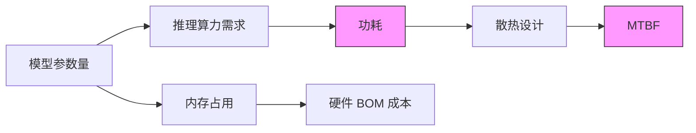
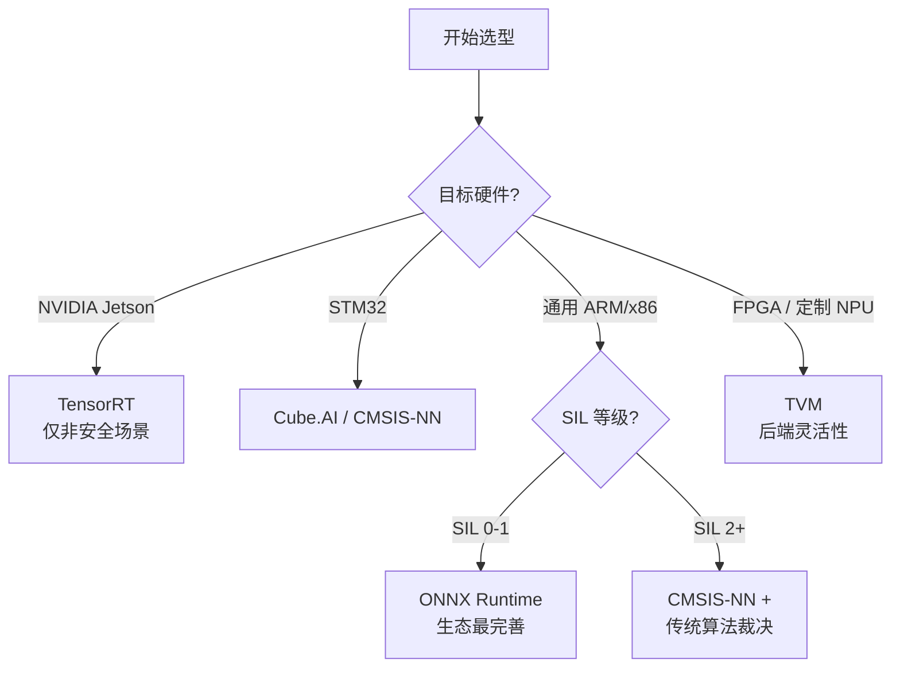
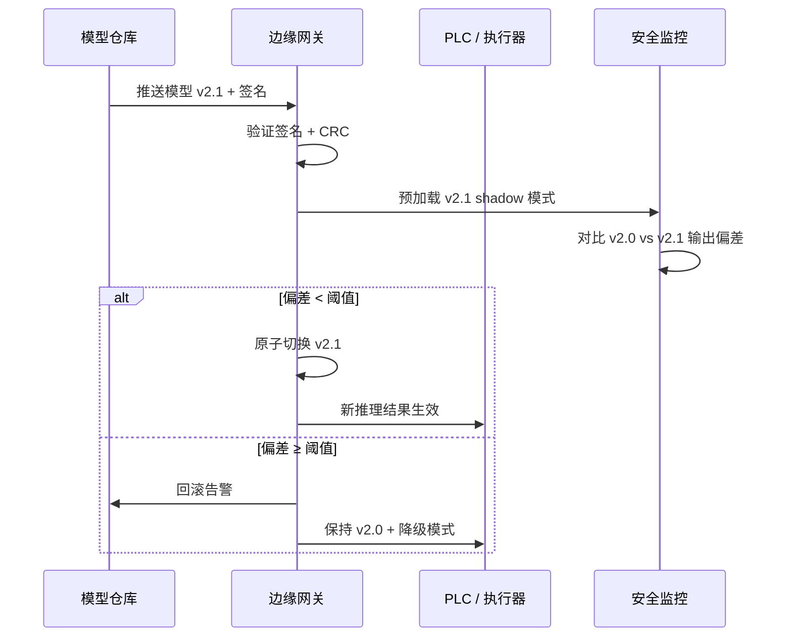

# 工业边缘 AI 模型部署规范

> **版本**: 2026-06-08
> **对齐标准**: IEC 61508 Ed.3 (CDV), IEC 62443-3-3, ONNX Runtime 1.19, TensorRT 10.0, TFLite 2.16
> **定位**: 定义工业 OT 场景下边缘 AI 模型从选型到运维的全生命周期部署规范，确保确定性、功能安全与复用性的统一

---

## 1. 工业边缘 AI 的特殊约束

工业边缘 AI 区别于消费级边缘推理的核心在于 OT 环境的不可妥协约束。

### 1.1 实时性：确定性延迟 vs 平均延迟

消费级 AI 以**平均延迟**为指标，工业控制回路要求**确定性延迟边界**（WCET）。

| 指标类型 | 消费级场景 | 工业 OT 场景 | 合规要求 |
|---------|-----------|-------------|---------|
| **p50 延迟** | 可接受 | 仅作参考 | — |
| **p99 延迟** | 关键指标 | 基础指标 | IEC 61784-3 |
| **WCET / 硬截止期** | 一般不保证 | **必须保证** | SIL 对应 FTTI |

> **公理 EAI.1** (Determinism over Throughput): 推理延迟上界必须小于控制回路最小采样周期。

实现手段：静态内存分配、算子融合、CPU 亲和性绑定、TSN 时间感知整形。

### 1.2 资源受限环境



| 资源维度 | 典型工业边缘节点 | 约束阈值 | 超约束后果 |
|---------|----------------|---------|----------|
| **内存** | 256 KB–4 GB | 模型+运行时 < 可用内存 × 0.8 | 堆溢出导致崩溃 |
| **算力** | 0.1–30 TOPS (INT8) | 单帧推理 < 控制周期 × 0.3 | 错过控制窗口 |
| **功耗** | 0.1 mW–15 W | 无风扇时 TDP 严格受限 | 热降频引发漂移 |
| **存储** | 1 MB–32 GB Flash | 模型体积 < 可用存储 × 0.5 | OTA 更新失败 |

### 1.3 严苛环境条件

工业现场环境应力远超数据中心基线：−40 °C ~ +125 °C、IEC 60068-2-6 振动、IEC 61000-4-x EMI（4 kV ESD / 10 V/m RF）。

对 AI 部署的直接影响：

1. **量化模型对 bit flip 敏感**：INT8 权重单 bit 翻转可致输出漂移，需 ECC 或 CRC 校验
2. **高温降频**：WCET 在高温下可能超出常温值 20–40%，需热应力重标定
3. **振动致存储失效**：优先选用工业级 eMMC / SLC NAND

### 1.4 功能安全与 SIL 等级

参考 [`06-functional-safety`](../06-functional-safety/) 的 IEC 61508 Ed.3 分析：

| SIL 等级 | 允许失效率 (PFH) | AI 部署隐含要求 |
|---------|-----------------|----------------|
| SIL 1 | 10⁻⁵ ~ 10⁻⁶ /h | 基础诊断，单通道推理 |
| SIL 2 | 10⁻⁶ ~ 10⁻⁷ /h | 冗余推理 + 传统算法对比，运行时监控 |
| SIL 3 | 10⁻⁷ ~ 10⁻⁸ /h | 异构双通道，强制降级策略 |
| SIL 4 | 10⁻⁸ ~ 10⁻⁹ /h | AI 仅允许作为非安全相关增强 |

> **定理 EAI.2** (AI Safety Degradation): 对于 SIL ≥ 2 的场景，AI 输出必须经过功能安全认证的**传统确定性算法**最终裁决。

---

## 2. 部署规范框架

| 阶段 | 任务 | 验收标准 | 负责角色 |
|------|------|---------|---------|
| **模型选择** | 选择适合边缘的轻量架构 | 参数量 < 10 M；推理时间 < 控制周期 × 0.3；支持静态图导出 | 算法工程师 |
| **模型优化** | 量化 / 剪枝 / 蒸馏 | INT8 精度损失 < 2%（vs FP32）；权重可 bit-precise 复现 | 部署工程师 |
| **运行时选择** | TFLite / ONNX Runtime / TensorRT / TVM | 支持目标硬件加速；提供 WCET 基准测试报告 | 系统工程师 |
| **部署验证** | 功能等效性 + 鲁棒性测试 | 与浮点输出差异 < 阈值；通过对抗样本 / 噪声注入测试 | 测试工程师 |
| **监控运维** | 漂移检测、性能降级监控、OTA | 实时准确率监控；输入漂移告警；回滚时间 < 30 s | 运维工程师 |

阶段间流转需通过**阶段评审门**，关键交付物：模型优化报告、运行时适配报告、安全案例分析（SIL ≥ 2）。

---

## 3. 技术栈对比与选型指南

| 运行时 | 适用硬件 | 量化支持 | 确定性 | 功能安全资质 | 工业评级 |
|--------|---------|----------|--------|-------------|---------|
| **TFLite** | ARM Cortex-M/A | INT8 / FP16 | 中 | 低 | ★★★☆☆ |
| **ONNX Runtime** | x86 / ARM / GPU | INT8 / FP16 | 中 | 中 | ★★★★☆ |
| **TensorRT** | NVIDIA Jetson | INT8 / FP16 / FP8 | 低 | 低 | ★★☆☆☆ |
| **TVM** | 多硬件后端 | 多种 | 中 | 低 | ★★★☆☆ |
| **STM32Cube.AI** | STM32 全系列 | INT8 | 高 | 中 | ★★★★☆ |
| **CMSIS-NN** | Cortex-M4/M7/M55 | INT8 | 高 | 中 | ★★★★★ |

**选型决策树**：



> **注**：TensorRT 因 GPU 调度非确定性，在硬实时 OT 场景中受限，更适合 L2/L3 supervisory 层视觉质检。

---

## 4. 复用模式

### 4.1 工业模型动物园适配

通用模型动物园需经**工业适配层**转换后方可部署：

```text
通用 Model Zoo
    ├── 预训练权重
    ├── 工业适配层
    │   ├── 输入重构：传感器时序 → 模型格式
    │   ├── 输出解码：模型输出 → 物理量 / 报警阈值
    │   └── 域校准：现场数据重标定量化参数
    └── 边缘就绪包
        ├── TFLite / ONNX 模型文件
        ├── 运行时配置（线程数、内存池）
        ├── 校准数据集指纹（SHA-256）
        └── 兼容性矩阵
```

### 4.2 预训练 + 领域微调流水线

| 步骤 | 复用资产 | 现场投入 | 产出 |
|------|---------|---------|------|
| 1. 通用预训练 | ImageNet / Kinetics 权重 | 无 | 基础特征提取器 |
| 2. 领域适配 | 同领域公开数据集 | 少量标注 | 领域特征对齐 |
| 3. 现场微调 | 步骤 2 产出 | 目标产线 100–1000 张样本 | 产线专用模型 |
| 4. 边缘优化 | 量化工具链、运行时库 | 校准集 100–500 张 | 可部署边缘包 |

> **定理 EAI.3** (Transfer Efficiency): 工业质检视觉任务中，ImageNet 预训练 EfficientNet-B0 经领域微调后，仅需 200 张目标样本即可达到 > 98% AUROC。

### 4.3 模型版本管理与回滚



版本命名：`{场景标识}-{架构}-{版本}.{子版本}`，如 `anomaly-vibration-effnet-b0-v2.1`。

---

## 5. 与现有体系的交叉引用

| 本规范内容 | 关联文档 | 说明 |
|-----------|---------|------|
| ISA-95 L0–L2 边缘 AI 映射 | [`01-isa-95-model`](../01-isa-95-model/) | L0 振动检测、L1 视觉质检、L2 预测性维护的部署位置 |
| OPC UA FX 实时数据供给 | [`02-opc-ua-fx`](../02-opc-ua-fx/) | 推理输入的确定性采集与结果 Pub/Sub 发布 |
| TSN 网络切片保障 | [`03-tsn-deterministic`](../03-tsn-deterministic/) | 为 AI 推理流量预留 802.1Qbv 门控时隙 |
| 功能安全与 SIL | [`06-functional-safety`](../06-functional-safety/) | IEC 61508 Ed.3 对 AI 组件的诊断覆盖率要求 |
| TinyML / ONNX 技术栈 | [`tinyml-onnx-edge-ai.md`](./tinyml-onnx-edge-ai.md) | 模型优化技术细节与运行时对比 |
| 形式化验证 | [`07-formal-verification`](../../07-formal-verification/) | 控制-AI 协同状态机 TLA+ 规约 |

---

## 6. 参考索引

- ONNX Runtime: [onnxruntime.ai](https://onnxruntime.ai/)
- TinyML 基金会: [tinyml.org](https://tinyml.org/)
- TensorRT: [docs.nvidia.com/tensorrt](https://docs.nvidia.com/deeplearning/tensorrt/)
- TensorFlow Lite: [tensorflow.org/lite](https://www.tensorflow.org/lite)
- IEC 62443-3-3: Industrial communication networks – Network and system security
- IEC 61508 Ed.3 (CDV): Functional safety of E/E/PE safety-related systems
- IEC 61784-3: Functional safety fieldbuses
- ISO 13849-1: Safety of machinery – Safety-related parts of control systems
- STM32Cube.AI: [st.com/stm32cubeai](https://stm32ai.st.com)
- CMSIS-NN: ARM-software/CMSIS-NN
