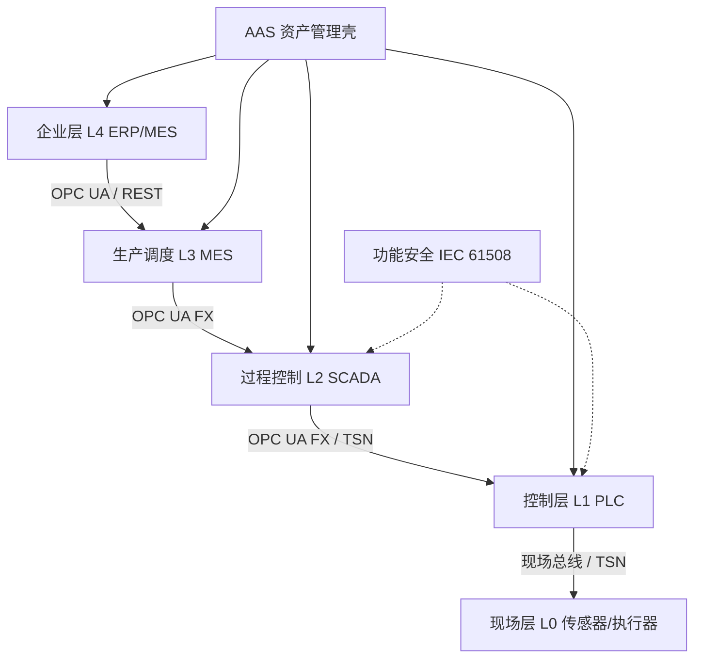

# 11 工业 IoT / OT-IT 融合复用

> **定位**：将通用软件复用框架扩展到工业自动化与 OT-IT 融合垂直领域，在确定性、功能安全与互操作性的强约束下实现资产复用。

---

## 1. 概念定义

**工业 IoT / OT-IT 融合复用** 是在制造、能源、交通等运营技术（OT）与信息技术（IT）融合场景中，复用 ISA-95 层级模型、OPC UA（OPC Unified Architecture）信息模型、PLCopen 功能块、资产管理壳（AAS）与功能安全组件。

| 概念 | 定义 | 复用价值 |
|------|------|----------|
| **ISA-95 / IEC 62264** | 企业（L4）到现场（L0）的五层集成模型 | 统一 OT-IT 语义，跨工厂复用模板 |
| **OPC UA FX** | OPC UA Field eXchange，现场级确定性通信 | 跨厂商设备即插即用互操作 |
| **TSN** | Time-Sensitive Networking，IEEE 802.1 时间敏感网络 | 确定性低延迟传输 |
| **PLCopen Motion** | 跨厂商运动控制功能块标准 | 复用 MC_Power、MC_MoveAbsolute 等接口 |
| **AAS** | Asset Administration Shell，IEC 63278 | 数字孪生与资产模型的标准化封装 |
| **功能安全** | IEC 61508 / ISO 26262 等 | 复用经认证的软件安全证据 |

**OT 确定性不可妥协原则**：工业 OT 组件的复用必须以确定性为首要约束，任何牺牲确定性换取灵活性或成本的策略在 OT 场景中不可接受。

---

## 2. OT-IT 融合复用架构图

---

## 3. 正向示例

### 示例 1：ISA-95 五层资产目录

制药企业依据 ISA-95 建立标准批次执行模型，新工厂复用相同 MES 接口、配方模板与 AAS 子模型；产线上线时间从 12 个月缩短到 6 个月。

### 示例 2：OPC UA FX 跨厂商运动控制

包装线集成不同厂商伺服驱动，通过 OPC UA FX 的 PubSub 帧与 PLCopen Motion 接口复用统一运动控制模型；协议转换网关减少 70%，调试周期减半。

### 示例 3：AAS 数字孪生复用

汽车工厂将 ISA-95 L0-L4 资产目录映射到 IEC 63278 资产管理壳，通过 OPC UA NodeSet 实现现场设备、MES 与 ERP 的信息模型复用；设备更换时只需替换 AAS 子模型实例。

### 示例 4：功能安全 SEooC 复用

某供应商将经 ISO 26262 ASIL-D 认证的制动控制软件作为 Safety Element out of Context（SEooC）复用到多款车型；安全手册明确假设与使用约束，OEM 只需验证集成环境。

### 示例 5：TSN 确定性网络复用

某汽车焊装车间采用 IEEE 802.1AS 时间同步与 802.1Qbv 门控列表，将视觉检测、机器人控制与 PLC 通信整合到同一网络；复用 TSN 配置模板后，新产线网络部署时间缩短 60%。

### 示例 6：AAS + OPC UA FX 规模化复用

- **Volkswagen Zwickau 电动车工厂**：将 ISA-95 L0–L4 资产映射到 IEC 63278 AAS，通过 OPC UA FX 实现焊装/总装设备跨厂商即插即用，工程调试周期显著缩短。
- **BMW / Siemens 线束项目**：基于 AAS 子模型标准化汽车线束数据，实现设计-制造-维护全链路信息复用（VWS4LS 研究项目）。
- **IDTA 行业用例汇总**：多家企业报告采用 AAS 后，设备集成与变更工程的时间和成本平均降低约 67%（IDTA, 2025）。

---

## 4. 反例 / 失败案例

### 反例 1：IT 补丁策略直接套用到 OT

某工厂将 IT 系统的“随时打补丁”策略套用到 PLC 产线，未考虑实时性约束与功能安全认证；补丁导致控制器时序异常，造成产线停机与安全事件。

### 反例 2：忽视 ISA-95 层级边界

某企业让 ERP 直接写入 PLC 标签，绕过 L2/L3 控制层；破坏了实时控制闭环，导致批次配方被错误覆盖，造成产品污染。

### 反例 3：复用未经安全认证的开源库

团队将开源运动控制库复用到医疗机器人，未评估其 SIL 符合性；认证阶段无法证明诊断覆盖率，项目被迫返工并推迟上市。

### 反例 4：私有现场总线锁定

各设备使用私有现场总线，IT 系统需为每种协议开发适配器；信息模型无法复用，扩展成本高昂且供应商锁定严重。

### 反例 5：忽视 OT 网络安全边界

某制造企业将工业交换机直接暴露于企业办公网，未部署 IEC 62443 安全区与管道；勒索软件横向移动导致产线停产一周。更典型的教训是 2021 年 Colonial Pipeline 事件：攻击者通过入侵 IT 网络横向移动风险迫使 OT  precautionary shutdown，造成美国东海岸燃油供应中断数天（CISA, 2021）。根因之一是 IT/OT 边界缺乏基于 IEC 62443 的安全区、管道与多因素认证。

---

## 5. OT-IT 复用约束矩阵

| 层级 | 关键约束 | 复用策略 | 风险 |
|------|----------|----------|------|
| L0 现场 | 实时、安全、物理环境 | 传感器/执行器模板 | 物理伤害 |
| L1 控制 | 确定性周期 < 1ms | PLCopen / IEC 61131-3 功能块 | 时序失效 |
| L2 监控 | 高可用、历史数据 | SCADA 模板、OPC UA 信息模型 | 数据丢失 |
| L3 制造执行 | 工作流、质量追溯 | MES 模板、ISA-95 接口 | 批次错误 |
| L4 企业 | 业务敏捷、集成 | ERP / 云平台 API | 信息孤岛 |

---

## 6. 标准条款映射

### 6.1 ISA-95 层级与 AAS 子模型对应

| ISA-95 层级 | IEC 62264 核心对象 | IEC 63278 AAS 子模型 | OPC UA 信息模型 |
|------------|-------------------|---------------------|----------------|
| L4 企业 | Enterprise / Site | —（业务系统主导） | ERP Connector / B2MML |
| L3 MES | Work Order / Schedule | Time Series Data / Identification | OPC UA ISA-95 CS |
| L2 监控 | Batch / Recipe / Alarm | Handover Documentation / Time Series | OPC UA A&C / HDA |
| L1 控制 | Equipment / Control Module | Technical Data / Nameplate | OPC UA DI / PLCopen |
| L0 现场 | Sensor / Actuator | Digital Nameplate / Technical Data | OPC UA DI / PA-DIM |

### 6.2 IEC 61508 生命周期与软件复用映射

| IEC 61508 阶段 | 关键条款 | 复用资产 | 验证要求 |
|---------------|---------|---------|---------|
| 概念阶段 | Part 1, 7.2 | 危险与风险分析 | 目标系统重新评估 |
| 系统安全需求 | Part 1, 7.3 | 安全需求规格书模板 | 假设追溯 |
| 软件安全需求 | Part 3, 7.2 | SEooC 假设清单 / Safety Manual | AoU/AoE 覆盖性验证 |
| 软件设计开发 | Part 3, 7.4 | 设计模式 / 编码规范 | 工具资质 TIL |
| 集成与验证 | Part 3, 7.5–7.7 | 测试用例库 / GSN 论证模式 | 集成环境匹配 |
| 运行修改 | Part 3, 7.8 | 变更影响分析模板 | 任何修改触发再评估 |

> **定理 I.2** (Standard Clause Traceability): OT-IT 复用资产必须能追溯到其来源标准的具体条款。无法追溯的复用会导致审计失败与认证风险。

---

## 7. 关键公理

> **公理 I.1**（OT Determinism Non-Negotiable）：工业 OT 组件的复用必须以**确定性**为首要约束。任何牺牲确定性以换取灵活性或成本的复用策略在 OT 场景中不可接受。

---

## 8. 权威来源

> **权威来源**：
>
> - IEC 62264-1:2013 *Enterprise-control system integration — Part 1: Models and terminology*：<https://webstore.iec.ch/en/publication/6675>（核查日期：2026-07-09）
> - OPC UA FX Part 80 (UAFX Overview and Concepts)：<https://reference.opcfoundation.org/UAFX/Part80/v100/docs/>（核查日期：2026-07-09）
> - OPC UA FX Part 81 (Connecting Devices and Information Model)：<https://reference.opcfoundation.org/UAFX/Part81/v100/docs/>（核查日期：2026-07-09）
> - OPC UA FX Part 82 (Networking)：<https://reference.opcfoundation.org/UAFX/Part82/v100/docs/>（核查日期：2026-07-09）
> - OPC UA FX Part 83 (Offline Engineering)：<https://reference.opcfoundation.org/UAFX/Part83/v100/docs/>（核查日期：2026-07-09）
> - OPC UA FX Part 84 (Profiles)：<https://reference.opcfoundation.org/UAFX/Part84/v100/docs/>（核查日期：2026-07-09）
> - IEC/IEEE 60802 TSN Profile for Industrial Automation：<https://1.ieee802.org/tsn/iec-ieee-60802/>（核查日期：2026-07-09）
> - IEC 63278-1:2023 *Asset Administration Shell structure*：<https://webstore.iec.ch/publication/65628>（核查日期：2026-07-09）
> - IEC 63278-2 ED1 *Information meta model* (DIS/CDV)：<https://iec.ch/dyn/www/f?p=103:23:::::FSP_ORG_ID:1363>（核查日期：2026-07-09）
> - IDTA AAS Specifications：<https://industrialdigitaltwin.org/en/content-hub/specifications>（核查日期：2026-07-09）
> - IDTA Submodel Templates：<https://industrialdigitaltwin.org/en/content-hub/submodels>（核查日期：2026-07-09）
> - IEC 61508-3:2010 *Software safety requirements*：<https://webstore.iec.ch/en/publication/5517>（核查日期：2026-07-09）
> - IEC TR 61508-3-3:2025 *Guidance on object-oriented software*：<https://webstore.iec.ch/en/publication/99554>（核查日期：2026-07-09）
> - ISO 21448:2022 *Safety of the intended functionality (SOTIF)*：<https://www.iso.org/standard/77490.html>（核查日期：2026-07-09）
> - ISA/IEC 62443 系列：<https://www.isa.org/standards-and-publications/isa-standards/isa-iec-62443-series-of-standards>（核查日期：2026-07-09）
> - ISO/IEC 30141:2024 *IoT Reference Architecture*：<https://www.iso.org/standard/88800.html>（核查日期：2026-07-09）
> - DIN SPEC 91345 / RAMI 4.0 参考架构指南：<https://www.digitale-technologien.de/DT/Redaktion/DE/Downloads/Publikation/PAiCE_Leitfaden_Reference_Architecture.pdf>（核查日期：2026-07-09）

---

## 9. 当前状态与关联主题

- [x] ISA-95 五层复用资产目录 ([`01-isa-95-model/`](./01-isa-95-model/README.md))
- [x] OPC UA FX 协议层次分析 ([`02-opc-ua-fx/`](./02-opc-ua-fx/README.md))
- [x] TSN 确定性网络配置 ([`03-tsn-deterministic/`](./03-tsn-deterministic/iec-ieee-60802-profile.md))
- [x] PLCopen 功能块接口 ([`04-plcopen-motion/`](./04-plcopen-motion/plcopen-motion-control.md))
- [x] AAS-OPC UA 映射 ([`05-digital-twin-aas/`](./05-digital-twin-aas/README.md))
- [x] IEC 61508 / ISO 26262 复用模板 ([`06-functional-safety/`](./06-functional-safety/README.md))
- [x] 工业边缘 AI 模型部署 ([`07-edge-ai/`](./07-edge-ai/model-deployment-spec.md))

关联主题：

- `07-formal-verification`（PLC 状态机 TLA+ 验证）
- `10-supply-chain-security`（工业软件供应链安全）
- `12-ai-native-reuse`（工业边缘 AI 模型复用）

## 10. 实施检查单

- [ ] 明确产线的确定性周期、安全完整性等级与网络边界。
- [ ] 建立 ISA-95 L0-L4 资产目录与 AAS 子模型映射。
- [ ] 优先采用 OPC UA FX 与 PLCopen 等开放标准，减少私有协议锁定。
- [ ] 对安全相关软件建立 SEooC / Proven-in-Use 证据包。
- [ ] 将 IEC 62443 安全区与管道纳入网络设计模板。
- [ ] 定期审计 OT-IT 接口的访问控制与补丁策略。

## 11. 一句话总结

> OT-IT 融合复用不是简单地将 IT 敏捷性搬到工厂，而是在确定性、功能安全与互操作性约束下，用标准化信息模型打通企业到现场的纵向价值链。

## 12. 深度案例：汽车工厂 AAS 与 OPC UA FX 融合复用

某全球汽车制造商在建设新电动车工厂时，决定将 ISA-95 五层模型与资产管理壳（AAS）结合，构建可复用的数字孪生底座。

实施要点：

1. **统一信息模型**：基于 ISA-95 定义 L0-L4 的资产层次，每个物理资产都对应一个 AAS，子模型包含标识、能力、状态与维护记录。
2. **OPC UA FX 现场通信**：在焊装与总装车间部署 OPC UA FX，实现不同厂商机器人、PLC 与视觉系统的 PubSub 通信，替代大量私有现场总线网关。
3. **功能安全证据复用**：制动与转向相关控制软件以 SEooC 形式从供应商处复用，OEM 仅验证集成环境与假设覆盖。
4. **模板化部署**：将网络配置、AAS 子模型模板与 OPC UA FX 路由策略打包为 Golden Path，新产线部署周期缩短 40%。

该项目验证了标准化信息模型与开放现场通信对 OT-IT 融合复用的决定性作用。

## 13. 常见误区

- **误区 1：将 IT 敏捷直接套用到 OT**。OT 变更需要考虑实时性、功能安全认证与停产窗口。
- **误区 2：忽视层级边界**。ERP 直接控制现场设备会破坏控制闭环与安全隔离。
- **误区 3：追求单一厂商封闭生态**。虽然短期集成简单，但长期被锁定且难以复用跨厂商资产。
- **误区 4：安全认证后置**。功能安全证据需要在设计阶段就开始积累，而非项目末期补做。
- **误区 5：低估棕地改造复杂度**。 legacy 设备往往需要协议转换与渐进式替换，而非一次性替换。

## 14. 延伸阅读

1. IEC 62264 *Enterprise-Control System Integration* — ISA-95 标准族核心。
2. OPC Foundation. *OPC Unified Architecture* 与 *OPC UA Field Exchange* 规范。
3. IDTA. *Asset Administration Shell Details of the Asset Administration Shell*。
4. IEC 61508 *Functional Safety of Electrical/Electronic/Programmable Electronic Safety-related Systems*。
5. IEC 62443 *Security for Industrial Automation and Control Systems*。

## 15. 持续改进方向

- 将 TLA+ / Event-B 形式化验证扩展到 PLCopen 功能块与 OPC UA FX 路由。
- 建立 AAS 子模型的组织级模板库与版本治理机制。
- 探索工业边缘 AI 模型与 MCP/A2A 协议的复用模式。
- 将碳排与能耗数据纳入 OT 资产运营评估。

## 16. 关键行动项

- 对现有产线进行 ISA-95 层级映射，识别信息模型复用机会。
- 制定 OPC UA FX 与 PLCopen 采用路线图，优先在新产线试点。
- 建立功能安全证据包模板，覆盖 SEooC、PIU 与诊断覆盖率。
- 将 IEC 62443 安全区设计纳入网络架构评审清单。
- 培养既懂 OT 工艺又懂软件工程的跨学科架构师团队。

## 17. 版本记录

- 2026-07-09：新增 ISA-95 × AAS × IEC 61508 标准条款映射；为每条权威来源补充独立核查日期；合并重复版本记录；增加子目录 README 交叉引用。
- 2026-07-07：补充 ISA-95、OPC UA FX、功能安全的概念定义、示例、反例、关系图与权威来源。
- 2026-06-08：初始版本，梳理工业 IoT/OT-IT 核心文件与状态。

---

## 18. 总结

工业 IoT/OT-IT 融合复用要求架构师同时理解企业业务流程、控制理论与安全标准。只有在标准化信息模型、确定性通信与功能安全证据之间建立统一框架，复用才能真正跨越 OT 与 IT 的鸿沟。