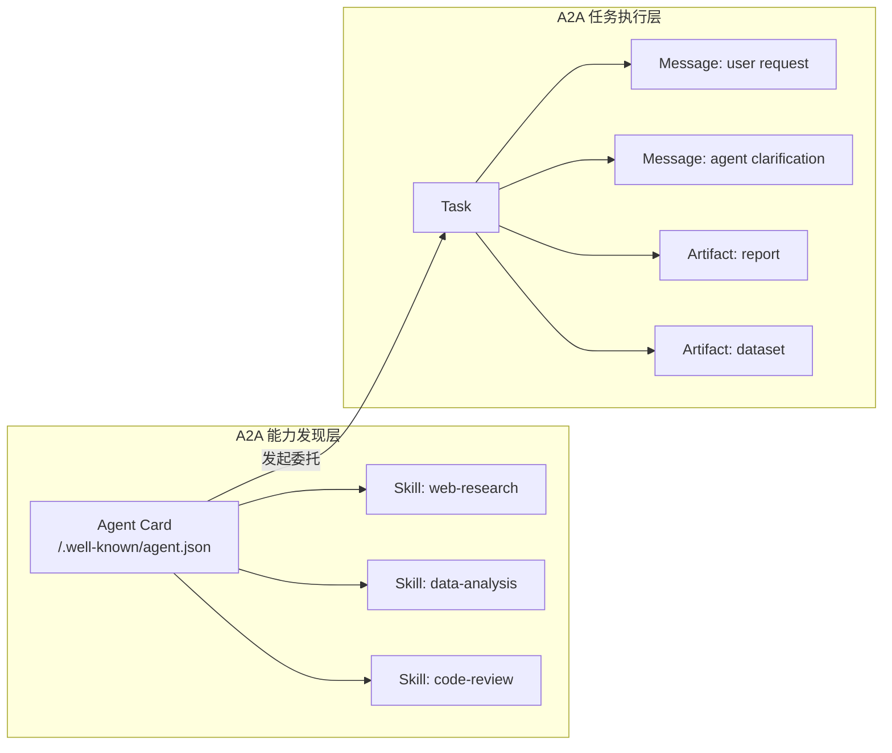
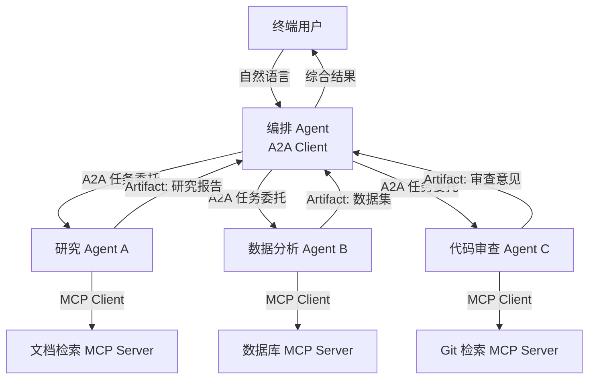
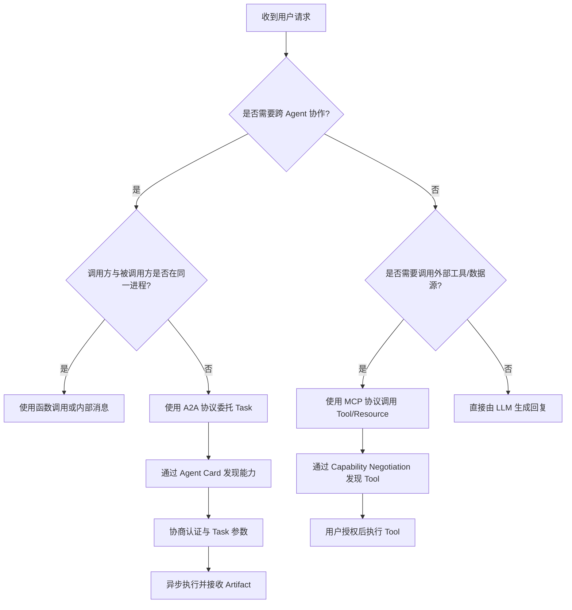

# A2A v1.0 权威规范解读

> **版本**: 2026-07-08
> **权威来源**: A2A Protocol v1.0.0, Agentic AI Foundation, Google A2A Project, Linux Foundation
> **定位**: 对齐 A2A v1.0.0.0.0.0.0 正式发布版本的核心概念与架构模式

---

## 1. A2A 发展历程

| 里程碑 | 时间 | 事件 |
|--------|------|------|
| 首次发布 | 2025-04 | Google 发布 A2A 协议，50+ 合作伙伴 |
| 捐赠 LF | 2025-12 | Anthropic 将 MCP 捐赠给 AAIF；A2A 生态同步纳入 Linux Foundation Agentic AI Foundation 治理 |
| v0.3 | 2026-03 | 增加 gRPC 支持、安全签名、多租户 |
| **v1.0.0** | **2026-03-12** | **A2A 协议官方正式发布** |

> **关键确认**: A2A v1.0.0.0.0.0.0.0 于 **2026-03-12** 正式发布（见 [A2A Protocol Specification](https://a2a-protocol.org/latest/specification/)）。此前文档中关于 2026-04 在 Google Cloud Next '26 发布的说法需要修正；A2A v1.0.0.0.0.0.0.0 的发布以官方规范页面为准。

---

## 2. A2A v1.0 核心对象

```text
A2A Protocol
├── Agent Card（代理卡片）
│   ├── 发布在: /.well-known/agent.json
│   ├── 包含: 能力、端点、认证方案、制造商信息
│   └── v1.0 新增: 签名 Agent Cards（加密身份验证）
│
├── Task（任务）
│   ├── 状态: submitted → working → input-required → completed / canceled / failed
│   ├── 支持: 多轮交互、流式更新
│   └── v1.0 新增: 多租户支持
│
├── Message（消息）
│   ├── Role: user / agent
│   └── Parts: text / file / data
│
├── Artifact（产物）
│   ├── 类型: text / file / structured data
│   └── 作为 Task 的结果返回
│
└── Security（安全）
    ├── OAuth 2.1 with PKCE（v1.0 默认）
    ├── API Keys
    ├── mTLS
    └── Signed Agent Cards
```

### 2.1 A2A 核心概念定义

**定义 2.1**（A2A Protocol）：Agent-to-Agent Protocol（A2A）是由 Google 提出并纳入 Agentic AI Foundation 治理的开放协议，旨在让不同框架、不同厂商、不同部署环境中的智能体（Agent）能够相互发现能力、协商任务并协作完成复杂工作流。

**定义 2.2**（Agent Card）：Agent Card 是描述 Agent 能力、端点、认证方案、制造商信息及技能的机器可读声明，通过 `/.well-known/agent.json` 发布。它是 A2A 生态中的“服务目录条目”，也是跨 Agent 信任协商的起点。

**定义 2.3**（Task）：Task 是 A2A 中的基本工作单元，表示一个 Agent 委托给另一个 Agent 的完整请求-响应周期。Task 具有生命周期状态机，支持多轮交互、流式更新与产物（Artifact）交付。

**定义 2.4**（Message）：Message 是 Task 中的通信单元，由 `role`（user/agent）和 `parts`（text/file/data）组成，支持多模态内容与结构化负载。

**定义 2.5**（Artifact）：Artifact 是 Task 完成后返回的产物，可以是文本、文件或结构化数据。一个 Task 可以产生多个 Artifact。

**定义 2.6**（Skill）：Skill 是 Agent Card 中声明的细粒度能力单元，包含 ID、名称、描述、标签与示例，用于能力发现与任务路由。

### 2.2 A2A 核心概念属性

| 概念 | 核心属性 | 属性说明 | 可观察/可验证 |
|------|---------|---------|--------------|
| Agent Card | 可发现性 | 通过 well-known URL 公开访问 | HTTP GET `/.well-known/agent.json` |
| Agent Card | 可验证性 | v1.0 支持数字签名 | 验证签名公钥与证书链 |
| Agent Card | 能力声明 | 明确列出 skills、输入/输出模式 | 解析 `capabilities` 与 `skills` |
| Task | 生命周期 | 具有 submitted → working → ... 状态机 | 跟踪 `tasks/send` 响应 |
| Task | 异步性 | 支持长时运行与轮询/流式更新 | SSE 或 gRPC streaming |
| Task | 产物性 | 返回 Artifact 作为结果 | 检查 `artifacts` 字段 |
| Message | 角色分离 | user / agent 角色明确 | 校验 `role` 字段 |
| Message | 多模态 | 支持 text / file / data parts | 解析 `parts` 数组 |
| Artifact | 结果化 | 是 Task 的可交付输出 | 检查 `artifact` 结构与 MIME |
| Skill | 语义化 | 通过描述与标签表达能力 | 自然语言匹配或嵌入检索 |

### 2.3 概念间关系

- **上位概念**：Agentic 系统、多智能体协作、企业 Agent 编排、服务目录
- **同层映射**：
  - Agent ↔ Agent Card：一个 Agent 发布一张 Agent Card
  - Agent Card ↔ Skill：一张 Agent Card 声明多个 Skill
  - Task ↔ Message：一个 Task 包含多条 Message
  - Task ↔ Artifact：一个 Task 产生零个或多个 Artifact
- **下位概念**：
  - Agent Card 的 `signature`、`rateLimits`、`multiTenant`、`pricing`
  - Task 的状态转换、push notification、streaming update
  - Message 的 parts、metadata、引用关系
- **依赖概念**：OAuth 2.1 with PKCE、mTLS、JSON over HTTP/JSON-RPC、gRPC、SSE、Digital Signature



### 2.4 为什么需要 A2A（解释）

A2A 的核心价值在于**跨厂商 Agent 互操作**。单一企业或团队内部可以使用专有框架（如 LangGraph、CrewAI、AutoGen）协调 Agent，但当需要跨组织、跨云平台协作时，专有协议会导致 N² 集成问题。A2A 通过标准化的 Agent Card、Task 与 Artifact 抽象，使不同厂商的 Agent 能够：

1. **自动发现**：通过 well-known URL 获取对方能力清单。
2. **能力协商**：基于 Skill 描述与认证方案决定是否建立合作。
3. **异步协作**：通过 Task 状态机与流式更新支持长时、多轮协作。
4. **结果交付**：以 Artifact 形式返回结构化产物。

核心矛盾在于**自主性与可控性的张力**：Agent 越自主，越能处理复杂任务；但自主也意味着行为不可完全预测，需要 Agent Card 签名、OAuth 授权、多租户隔离等机制来约束。

---

## 3. Agent Card 规范

```json
{
  "name": "research-agent",
  "description": "A research specialist agent",
  "url": "https://agent.example.com/",
  "provider": {
    "organization": "Example Inc."
  },
  "version": "1.0.0",
  "documentationUrl": "https://docs.example.com/agent",
  "capabilities": {
    "streaming": true,
    "pushNotifications": false,
    "stateTransitionHistory": true
  },
  "authentication": {
    "schemes": ["OAuth2", "ApiKey"]
  },
  "defaultInputModes": ["text"],
  "defaultOutputModes": ["text", "file"],
  "skills": [
    {
      "id": "web-research",
      "name": "Web Research",
      "description": "Performs deep web research on a topic",
      "tags": ["research", "web"],
      "examples": ["Research the latest AI safety guidelines"]
    }
  ]
}
```

### v1.0 新增字段

| 字段 | 说明 |
|------|------|
| `signature` | Agent Card 的数字签名 |
| `multiTenant` | 是否支持多租户 |
| `rateLimits` | 速率限制声明 |
| `pricing` | 服务定价信息 |

### 3.1 Agent Card 完整正例：多租户企业研究 Agent

以下是一个面向多租户 SaaS 场景、具备签名与速率限制声明的 Agent Card 示例：

```json
{
  "name": "enterprise-research-agent",
  "description": "Multi-tenant research agent for enterprise knowledge bases.",
  "url": "https://research.example.com/a2a",
  "provider": {
    "organization": "Example Cloud Inc.",
    "contactEmail": "a2a-support@example.com"
  },
  "version": "1.0.0",
  "documentationUrl": "https://docs.example.com/a2a",
  "capabilities": {
    "streaming": true,
    "pushNotifications": true,
    "stateTransitionHistory": true
  },
  "authentication": {
    "schemes": ["OAuth2"]
  },
  "defaultInputModes": ["text"],
  "defaultOutputModes": ["text", "file", "data"],
  "skills": [
    {
      "id": "kb-research",
      "name": "Knowledge Base Research",
      "description": "Search and synthesize answers across tenant-isolated knowledge bases.",
      "tags": ["research", "kb", "enterprise"],
      "examples": ["Summarize Q2 security incidents for tenant acme-corp"]
    },
    {
      "id": "regulatory-check",
      "name": "Regulatory Compliance Check",
      "description": "Check a document against published regulatory requirements.",
      "tags": ["compliance", "regulatory"],
      "examples": ["Does this privacy policy violate GDPR Article 13?"]
    }
  ],
  "multiTenant": true,
  "rateLimits": {
    "requestsPerMinute": 60,
    "concurrentTasks": 10
  },
  "signature": {
    "algorithm": "Ed25519",
    "publicKey": "-----BEGIN PUBLIC KEY-----\nMCow...\n-----END PUBLIC KEY-----",
    "signature": "base64(signature-of-canonicalized-agent-card)"
  }
}
```

**设计要点**：

- `multiTenant: true` 明确告知调用方该 Agent 支持租户隔离。
- `skills` 中每个示例都包含 `tenant` 占位，暗示调用时需要传入租户上下文。
- `signature` 使用 Ed25519 对规范化后的 Agent Card 进行签名，防止中间人篡改。
- `rateLimits` 声明了每分钟的请求上限与并发任务数，便于调用方做背压与预算规划。

---

## 4. Task 状态机

```text
Task Lifecycle
├── submitted（已提交）
├── working（处理中）
├── input-required（需要额外输入）
│   └── 可循环回到 working
├── completed（已完成）
├── canceled（已取消）
└── failed（失败）
```

### v1.0 增强

- **流式更新**: SSE 流式任务更新成为规范的一部分（而非扩展）
- **多租户**: 企业级隔离
- **gRPC 支持**: 高性能 Agent 通信
- **历史状态**: 可选的状态转换历史

---

## 5. A2A 与 MCP 的互补关系

```text
完整 Agent 架构
│
├── Agent ↔ Tools: MCP
│   └── 数据库查询、API 调用、文件读取
│
├── Agent ↔ Agent: A2A
│   └── 任务委托、能力协商、结果交付
│
└── Agent ↔ Humans: 自然语言界面
```

| 维度 | MCP | A2A |
|------|-----|-----|
| 范围 | Agent → Tool | Agent → Agent |
| 关系 | Client-Server | Peer-to-Peer |
| 发现 | Server lists capabilities | Agent Card at well-known URL |
| 会话 | 有状态连接 | 基于 Task 的异步 |
| 流式 | 支持 | SSE 原生支持 |
| 认证 | OAuth 2.1 | OAuth 2.1 with PKCE |
| 创建者 | Anthropic → AAIF | Google → AAIF |

### 5.1 A2A 与 MCP 互补架构（Mermaid 架构图）



### 5.2 互补架构解释

在上图中：

- **A2A 负责 Agent 之间的协作边界**：编排 Agent 不需要知道研究 Agent 内部如何工作，只需要通过 Agent Card 了解其 Skill、端点与认证方式。
- **MCP 负责 Agent 与工具之间的能力边界**：每个 Specialist Agent 通过 MCP 调用具体的工具（数据库、Git、文档检索），这些工具的细节对编排 Agent 不可见。
- **这种分层架构的价值**：当需要替换某个 Specialist Agent 时，只要其 Agent Card 保持兼容，编排 Agent 无需修改；当需要新增工具时，只需在对应 Specialist Agent 内部新增 MCP Server 连接，不影响 A2A 接口。

---

## 6. A2A v1.0 安全机制

### 6.1 Signed Agent Cards

v1.0 引入 Agent Card 签名：

```json
{
  "agent": { ... },
  "signature": {
    "algorithm": "Ed25519",
    "publicKey": "...",
    "signature": "..."
  }
}
```

**作用**:

- 防止 Agent Card 伪造
- 确保 Agent 身份可验证
- 支持 Agent-to-Agent 信任链

### 6.2 OAuth 2.1 with PKCE

v1.0 将 OAuth 2.1 with PKCE 设为默认认证方案，取代早期草案中的纯 Bearer Token。

### 6.3 Agent Payments Protocol (AP2)

v1.0 生态系统中出现 AP2（Agent Payments Protocol）：

- 支持 Agent 驱动的安全交易
- 60+ 组织支持
- 用于 Agent 服务的市场化支付

### 6.4 多租户安全反例：租户上下文泄漏

**场景**：某企业 A2A Agent 提供“租户隔离的知识库搜索”服务，Agent Card 声明 `multiTenant: true`，但其实现存在缺陷。

**攻击路径**：

1. 攻击者（tenant-a）向该 Agent 发送 Task：

```json
{
  "id": "task-001",
  "message": {
    "role": "user",
    "parts": [{ "type": "text", "text": "Summarize Q2 security incidents" }]
  }
}
```

1. Agent 的实现未在内部将 `tenant-a` 的访问令牌严格绑定到搜索索引，而是复用了全局管理员令牌。
2. 搜索结果返回了所有租户的安全事件，包括 `tenant-b` 和 `tenant-c` 的敏感数据。

**后果**：

- 跨租户数据泄漏，违反 GDPR、HIPAA 等合规要求。
- 即使 Agent Card 声明了多租户能力，实现层面的漏洞仍会导致安全事件。
- 攻击者可以进一步利用泄漏的数据构造更精确的社工或 prompt injection。

**避免建议**：

1. **强制租户上下文传递**：每个 Task 必须包含 `tenantId` 或等效上下文，并在每个内部调用中校验。
2. **最小权限令牌**：禁止在 Agent 内部使用全局管理员令牌，每个租户应使用仅对该租户资源有效的令牌。
3. **Agent Card 与实现一致性审计**：定期审计 Agent Card 声明的能力（如 `multiTenant`）是否与实际代码一致。
4. **隔离测试**：在 CI 中增加跨租户访问测试，确保租户 A 无法访问租户 B 的数据。
5. **结合概率契约监控**：对多租户场景的访问模式进行统计监控，异常访问触发告警（参见 [`../05-probabilistic-contracts/probabilistic-contract-framework.md`](../05-probabilistic-contracts/probabilistic-contract-framework.md)）。

---

## 示例：A2A + MCP 混合智能客服

某跨境电商构建多语言智能客服系统，采用 A2A 编排 + MCP 工具调用架构：

| 组件 | 协议/机制 | 职责 |
|------|----------|------|
| 客服编排 Agent | A2A Client | 接收用户问题，判断意图，委托子任务 |
| 订单查询 Agent | A2A Server + Agent Card | 通过订单号查询物流与退款状态 |
| 退换货 Agent | A2A Server + Agent Card | 处理退货政策解释与退货单创建 |
| 知识库工具 | MCP Server | 检索帮助文档与常见问题 |
| 订单 API 工具 | MCP Server | 调用内部订单系统 |
| 邮件工具 | MCP Server | 发送确认邮件 |

**关键收益**：

- 各业务域 Agent 可独立演进，只要 Agent Card 兼容，编排 Agent 无需修改。
- 订单查询 Agent 内部通过 MCP 连接多个后端系统，工具替换不影响 A2A 接口。
- 使用 OAuth 2.1 + PKCE 与 Signed Agent Cards，满足跨境数据合规要求。

---

## 反例：私有消息格式导致 N² 集成灾难

**场景**：某大型企业内部 6 个业务线各自开发 Agent，分别使用私有 HTTP/gRPC 消息格式、自定义认证与硬编码端点。

**问题**：

- 每新增一个 Agent，需要为它与现有 Agent 之间写双边适配器。
- 6 个 Agent 产生 15 对集成，20 个 Agent 将产生 190 对集成，维护成本指数级增长。
- 能力变更后，所有调用方需同步更新适配器，导致版本碎片与故障。

**后果**：项目延期 6 个月，集成 Bug 占所有生产事故的 40%。

**避免建议**：

1. **统一 Agent Card 目录**：所有 Agent 必须发布 `/.well-known/agent.json`，声明技能、端点与认证方式。
2. **A2A 作为默认互操作协议**：跨业务线/跨组织的 Agent 协作必须通过 A2A，内部专有框架仅用于团队内部。
3. **契约版本管理**：Agent Card 与 Task Schema 采用语义化版本，旧版本客户端获得向后兼容窗口。
4. **治理门禁**：未发布 Agent Card 的 Agent 不允许接入编排层。

---

## 9. 具体协议条款映射

| 业务需求 | A2A v1.0 机制 | 规范位置 |
|---------|--------------|---------|
| Agent 能力发现 | `/.well-known/agent.json`、Agent Card | Discovery |
| 任务委托 | `tasks/send`、`tasks/sendSubscribe` | Tasks |
| 任务状态查询 | `tasks/get` | Tasks |
| 任务取消 | `tasks/cancel` | Tasks |
| 流式更新 | SSE / gRPC streaming | Tasks / Transports |
| 结果交付 | `Artifact`（text/file/data） | Artifacts |
| 身份认证 | OAuth 2.1 with PKCE、mTLS、API Keys | Security |
| Agent Card 完整性 | Ed25519 / JWS 签名 | Agent Card |
| 多租户隔离 | `multiTenant` + 租户上下文传递 | Agent Card / Tasks |
| 支付/商业化 | Agent Payments Protocol (AP2) | Ecosystem |

---

## 10. 生态系统状态（2026-07）

| 指标 | 数值 |
|------|------|
| 正式发布版本 | v1.0.0（2026-03-12） |
| 支持组织 | 150+ |
| GitHub Stars | 22,000+ |
| SDK 语言 | Python, JS, Java, Go, .NET |
| 云平台 | GCP, Azure, AWS |

### 主要支持平台

- Google Vertex AI Agent Builder（原生）
- Microsoft Azure AI Foundry
- Amazon Bedrock AgentCore Runtime
- LangGraph
- CrewAI
- AutoGen
- Semantic Kernel

---

## 11. 生产部署建议

### 网络架构

```text
Kubernetes Deployment
├── Agent Pod
│   └── 暴露 /.well-known/agent.json
├── Service (ClusterIP)
├── Ingress (TLS)
│   └── 仅暴露 A2A Gateway
└── NetworkPolicy
    └── 限制 Agent 间流量
```

### 关键考虑

1. **可观测性**: 使用 OpenTelemetry GenAI 约定
2. **评估（Evals）**: 将评估作为 CI 门禁
3. **缓存**: 多层缓存降低延迟和成本
4. **模型选择**: 避免所有 Agent 默认调用最贵的模型

---

## 12. 对架构复用的影响

> **定理 A2A.2** (Agent Card Network Effect): A2A Agent 的复用价值与 A2A 生态中其他 Agent 的数量成正比。生态越大，单个 Agent 的价值越高。
> **定理 A2A.3** (Cross-Vendor Interoperability): A2A 的核心价值在于跨厂商 Agent 的互操作。单一厂商内部的 Agent 协调可以使用专有协议，但跨厂商必须使用开放标准。

---

## 13. 与 MCP 的集成模式

### 模式 1: A2A Agent 内部使用 MCP

```text
Orchestrator Agent (A2A)
    ├── Specialist Agent A (A2A)
    │   └── 内部使用 MCP → Database Server
    ├── Specialist Agent B (A2A)
    │   └── 内部使用 MCP → API Server
    └── Specialist Agent C (A2A)
        └── 内部使用 MCP → File System
```

### 模式 2: Gateway 统一路由

```text
User Request → A2A Gateway
    ├── MCP Tool Calls → MCP Servers
    └── A2A Task Delegation → Specialist Agents
```

### 13.1 集成决策树



---

## 14. 权威来源与交叉引用

### 14.1 权威来源

> **权威来源**（已核查 2026-07-08）：
>
> | 来源 | URL |
> |------|-----|
> | A2A Protocol Specification v1.0.0 | <https://a2a-protocol.org/latest/specification/> |
> | A2A Protocol 官方网站 | <https://a2a-protocol.org/latest/> |
> | A2A Project GitHub | <https://github.com/a2aproject/a2a> |
> | Agentic AI Foundation (AAIF) | <https://aaif.io/> |
> | OWASP Top 10 for Agentic Applications 2026 | <https://genai.owasp.org/resource/owasp-top-10-for-agentic-applications-for-2026/> |
> | OAuth 2.1 with PKCE | <https://datatracker.ietf.org/doc/html/draft-ietf-oauth-v2-1-11> |

### 14.2 交叉引用

- MCP 协议规范见 [`../01-mcp-protocol/mcp-2025-11-25-authoritative.md`](../01-mcp-protocol/mcp-2025-11-25-authoritative.md)
- Agent 组合模式见 [`../03-agentic-infrastructure/llm-agent-composition.md`](../03-agentic-infrastructure/llm-agent-composition.md)
- 概率契约与 SLA 见 [`../05-probabilistic-contracts/probabilistic-contract-framework.md`](../05-probabilistic-contracts/probabilistic-contract-framework.md)
- A2A+MCP 混合 PoC 见 [`../04-hybrid-a2a-mcp-poc/README.md`](../04-hybrid-a2a-mcp-poc/README.md)
- OWASP LLM 安全映射见 [`../05-probabilistic-contracts/owasp-llm-mcp-security.md`](../05-probabilistic-contracts/owasp-llm-mcp-security.md)

---

> 最后更新: 2026-07-08