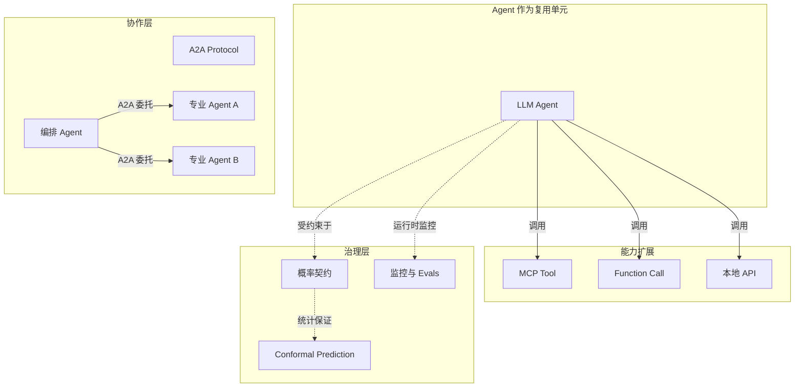
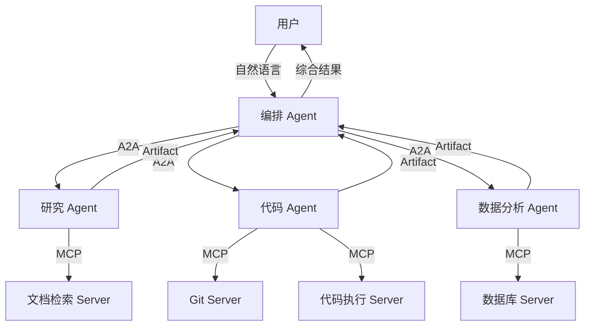

# LLM Agent 的复用与组合

> **版本**: 2026-07-07
> **定位**: 分析 LLM Agent 作为一种新型复用单元的架构模式

---

## 1. LLM Agent 作为复用单元

**定义 AI.1** (LLM Agent): LLM Agent 是一个由大语言模型驱动、具备感知-推理-行动循环的自主软件实体。其形式为：

```text
Agent := ⟨LLM, Memory, Tools, Planner, EnvironmentInterface⟩
```

其中：

- `LLM`: 核心推理引擎
- `Memory`: 短期/长期记忆
- `Tools`: 可调用的外部能力（MCP Tool / Function Call）
- `Planner`: 任务分解与执行规划
- `EnvironmentInterface`: 与外部世界的交互接口

> **公理 AI.1** (Probabilistic Contract Necessity): LLM Agent 的输出本质上是概率分布 P(output | input, context)。因此，其复用契约不能是确定性的，而必须是**概率性契约**：P(correct | task) ≥ θ。

### 1.1 LLM Agent 核心属性

| 属性 | 说明 | 可观察/可验证 | 重要性 |
|------|------|--------------|--------|
| 自主性 | 能在无显式逐步指令下完成任务 | 任务完成率、人工干预频率 | 高 |
| 感知能力 | 能读取环境状态、用户输入、工具返回 | 输入来源覆盖率 | 高 |
| 推理能力 | 能进行多步规划、反思与决策 | 规划合理性评估 | 高 |
| 行动能力 | 能调用工具、修改状态、产生输出 | 工具调用成功率 | 高 |
| 记忆能力 | 能利用短期与长期记忆保持上下文 | 长期任务一致性 | 中 |
| 可解释性 | 能输出思考链、决策依据 | 追踪日志完整度 | 中 |
| 可复用性 | 能在不同任务与系统中被复用 | 复用次数、适配成本 | 高 |
| 可控性 | 能在高风险场景中被约束或中断 | 熔断响应时间 | 高 |

### 1.2 概念间关系

- **上位概念**：AI 原生应用、Agentic 系统、智能体经济（Agent Economy）
- **同层映射**：
  - Agent ↔ Tool：Agent 调用 Tool，Tool 是 Agent 的能力扩展
  - Agent ↔ Agent：Agent 通过 A2A 协议协作
  - Agent ↔ Prompt：Prompt 模板是 Agent 行为的轻量复用单元
  - Agent ↔ Probabilistic Contract：概率契约约束 Agent 的输出质量边界
- **下位概念**：
  - Agent 内部的 Planner、Memory、Tool Use、Reflection
  - Agent 的角色定义、系统提示、Few-shot 示例
  - Agent 的评估指标、追踪链路、权限策略
- **依赖概念**：LLM、MCP、A2A、Function Calling、RAG、Conformal Prediction、Probabilistic Contract



---

## 2. Agent 复用的层次

### Level 1: Prompt 模板复用

复用经过验证的 Prompt 模板。最轻量的复用形式。

### Level 2: Tool 组合复用

复用一组相关的 MCP Tool / Function Call。

### Level 3: Agent 角色复用

复用预定义的 Agent 角色（如"代码审查员"、"需求分析师"）。

### Level 4: 多 Agent 系统复用

复用整个多 Agent 协作模式（如 A2A 编排、CrewAI 团队结构）。

---

## 3. Agent 组合模式

### 模式 1: 串行管道 (Sequential Pipeline)

```text
Input → Agent A → Agent B → Agent C → Output
```

**适用场景**：任务可分解为固定顺序的子任务，如“提取需求 → 生成代码 → 审查代码”。

**关键风险**：误差累积。若 Agent A 的输出错误率为 5%，Agent B 为 5%，Agent C 为 5%，则整体错误率可能高达 `1 − 0.95³ ≈ 14.3%`。

### 模式 2: 路由分发 (Router)

```text
        ┌→ Agent A
Input → Router →┼→ Agent B
        └→ Agent C
```

**适用场景**：输入可被分类到不同专业领域，如客服场景中的“退款、物流、技术支持”。

**关键风险**：Router 本身的错误会导致任务被分配给不合适的 Agent。

### 模式 3: 投票聚合 (Voting / Ensemble)

```text
        ┌→ Agent A ─┐
Input → ┼→ Agent B ─┼→ Aggregator → Output
        └→ Agent C ─┘
```

**适用场景**：需要提高输出稳定性或多样性的场景，如代码生成、创意写作。

**关键风险**：若多个 Agent 存在系统性偏见，投票无法纠正。

### 模式 4: 主从协作 (Manager-Worker)

```text
Manager Agent
├── 分解任务
├── 分配给 Worker Agent
├── 收集结果
└── 验证与整合
```

**适用场景**：复杂任务需要动态分解与协调，如软件架构设计、多步骤数据分析。

**关键风险**：Manager 的规划能力成为瓶颈；Worker 之间的依赖关系可能复杂化错误传播。

### 模式 5: A2A 跨 Agent 协作

A2A 协议支持不同框架、不同厂商的 Agent 之间协作：

```text
Agent A (Google ADK) --A2A--> Agent B (LangGraph) --A2A--> Agent C (AutoGen)
```

**适用场景**：跨组织、跨云平台的 Agent 协作。

**关键风险**：跨 Agent 的认证、授权、错误处理、结果语义对齐。

### 模式 6: 反思-执行循环 (Reflection-Act Loop)

```text
Input → Agent 执行 → 评估器评估 → {通过?} → 输出
                ↓ 否
              反思 → 重新执行
```

**适用场景**：对质量要求高的任务，如数学证明、复杂代码生成。

**关键风险**：无限循环或收敛缓慢；评估器本身的错误。

### 模式 7: 混合 MCP + A2A 分层架构



**说明**：编排 Agent 通过 A2A 协调各专业 Agent，各专业 Agent 通过 MCP 调用具体工具。这种分层架构实现了“Agent 协作”与“工具调用”的解耦。

---

## 4. Agent 复用的质量保障

> **公理 AI.2** (Uncertainty Composition): 多个 Agent 组合时，总体不确定性是各 Agent 不确定性的函数。若 Agent 间存在依赖，总体不确定性可能**超线性**增长。

### 4.1 不确定性组合公式

对于串行管道，若各 Agent 的错误率相互独立：

```text
U_total = 1 − Π(1 − U_i)
```

对于并联投票（k 个 Agent，多数决）：

```text
U_total ≤ Σ_{i=⌈k/2⌉}^{k} C(k,i) × U^i × (1−U)^{k−i}
```

对于主从协作，总体不确定性还取决于 Manager 的规划错误率 `U_manager` 与 Worker 的执行错误率 `U_worker`：

```text
U_total ≈ U_manager + (1 − U_manager) × U_worker
```

### 4.2 质量保障策略

| 策略 | 说明 |
|------|------|
| **一致性采样** | 多次采样，选择最一致的输出 |
| **人在回路** | 关键决策点引入人工确认 |
| **置信度阈值** | 低置信度输出触发降级策略 |
| **对抗验证** | 使用批评 Agent 验证主 Agent 的输出 |
| **结构化输出** | 强制 JSON schema / Pydantic 输出 |
| **追踪与可观测性** | 记录 Agent 的思考链和工具调用 |

---

## 5. 编排与协作反模式

### 反模式 1：过度分解（Over-Decomposition）

**症状**：将本可由一个 Agent 完成的任务拆分为 10 个以上串行 Agent，导致延迟剧增、上下文丢失。

**示例**：用户请求“总结这份报告”，系统却依次经过：

1. 提取 Agent
2. 分段 Agent
3. 摘要 Agent（每段一个）
4. 合并 Agent
5. 润色 Agent
6. 质量检查 Agent
7. 格式化 Agent

**后果**：

- 调用成本增加 5-10 倍。
- 每个 Agent 的上下文窗口被中间结果占满，丢失原始报告的深层语义。
- 任一 Agent 出错都会导致最终输出质量下降。

**避免建议**：

- 使用“任务复杂度”评估：简单任务直接由单个 Agent 完成，复杂任务才拆分。
- 设定 Agent 数量上限（如串行不超过 3 个，并行不超过 5 个）。
- 在拆分前评估预期收益是否大于协调成本。

### 反模式 2：循环依赖（Circular Dependency）

**症状**：Agent A 调用 Agent B，Agent B 又回过来调用 Agent A，形成无限循环或指数级调用爆炸。

**示例**：

```text
Agent A: "请 Agent B 检查我的计划"
Agent B: "我怀疑 Agent A 的输入有问题，需要 Agent A 重新评估"
Agent A: "请 Agent B 再次检查..."
```

**后果**：

- 调用费用失控。
- 响应时间无限延长。
- 系统进入不稳定状态。

**避免建议**：

- 使用有向无环图（DAG）建模 Agent 调用关系，禁止循环。
- 设置最大调用深度与预算上限。
- 在 A2A Task 中嵌入调用链与剩余预算信息。

### 反模式 3：隐式状态共享（Implicit State Sharing）

**症状**：多个 Agent 读写同一块全局状态，导致行为不可预测、难以调试。

**示例**：三个 Agent 同时修改同一个数据库表，没有事务隔离或版本控制。

**后果**：

- 竞态条件与数据不一致。
- 无法复现 Agent 的决策过程。
- 错误责任难以界定。

**避免建议**：

- 使用显式消息传递替代隐式状态共享。
- 为每个 Agent 分配清晰的职责边界与数据权限。
- 对共享状态使用版本控制与乐观锁。

### 反模式 4：单点智能体瓶颈（Single-Agent Bottleneck）

**症状**：所有任务都通过一个“超级 Agent”处理，该 Agent 承担了理解、规划、执行、验证所有职责。

**后果**：

- 提示词过于复杂，模型难以遵循所有约束。
- 一个错误会影响所有任务类型。
- 无法针对特定任务优化。

**避免建议**：

- 采用 Router + Specialist 模式，按任务类型分发给专业 Agent。
- 每个 Specialist Agent 的提示词聚焦单一职责。
- 使用概率契约为不同 Specialist 设置不同的质量阈值。

### 反模式 5：忽视工具边界（Tool Boundary Violation）

**症状**：Agent 直接执行本应由 MCP Tool 封装的能力，导致能力重复实现、安全边界混乱。

**示例**：多个 Agent 各自实现数据库查询逻辑，而不是调用统一的 MCP Database Server。

**后果**：

- N×M 集成债务重现。
- 权限控制碎片化。
- 工具行为变更时需要修改多个 Agent。

**避免建议**：

- 将通用能力抽象为 MCP Server，通过 Capability Negotiation 发现。
- 禁止 Agent 直接访问底层 API，除非该 API 是 Agent 专属。
- 维护企业级 MCP Tool 目录。

### 反模式 6：评估与监控缺失（Missing Evals & Observability）

**症状**：多 Agent 系统上线后没有持续评估，只在用户投诉后才发现问题。

**后果**：

- 错误模式长期存在。
- 无法量化 Agent 组合的价值。
- 难以进行迭代优化。

**避免建议**：

- 将 Agent Evals 作为 CI/CD 门禁。
- 使用 OpenTelemetry GenAI 语义约定记录调用链。
- 设置覆盖率、延迟、成本、正确率等多维监控。

---

## 6. 关键定理

> **定理 AI.1** (Calibration Ceiling): 若 Agent 在训练分布 D_train 上校准良好，但在部署分布 D_deploy 上存在显著漂移，则其复用可靠性存在上界。
> **定理 AI.2** (Human-in-the-Loop Optimality): 对于高风险的 Agent 决策，人在回路的成本低于完全自动化的期望错误成本，当且仅当 C_human < P(error) × C_error。

---

## 7. 权威来源与交叉引用

### 7.1 权威来源

> **权威来源**:
>
> - [Model Context Protocol Specification 2025-11-25](https://modelcontextprotocol.io/specification/2025-11-25/) — MCP 官方规范
> - [A2A Protocol](https://a2aproject.github.io/) — A2A 官方网站
> - [Multi-Agent Systems - Wikipedia](https://en.wikipedia.org/wiki/Multi-agent_system) — 多智能体系统百科
> - [OpenTelemetry Semantic Conventions for GenAI](https://opentelemetry.io/docs/specs/semconv/gen-ai/) — 可观测性标准
> - [OWASP LLM Top 10](https://genai.owasp.org/llm-top-10/) — LLM 安全威胁
>
> **核查日期**: 2026-07-07

### 7.2 交叉引用

- MCP 协议规范见 [`../01-mcp-protocol/mcp-2025-11-25-authoritative.md`](../01-mcp-protocol/mcp-2025-11-25-authoritative.md)
- A2A 协议规范见 [`../02-a2a-protocol/a2a-v1-authoritative.md`](../02-a2a-protocol/a2a-v1-authoritative.md)
- 概率契约框架见 [`../05-probabilistic-contracts/probabilistic-contract-framework.md`](../05-probabilistic-contracts/probabilistic-contract-framework.md)
- Conformal Prediction 见 [`../07-conformal-prediction/cp-formal-verification.md`](../07-conformal-prediction/cp-formal-verification.md)
- A2A+MCP 混合 PoC 见 [`../04-hybrid-a2a-mcp-poc/README.md`](../04-hybrid-a2a-mcp-poc/README.md)
- OWASP LLM 安全映射见 [`../05-probabilistic-contracts/owasp-llm-mcp-security.md`](../05-probabilistic-contracts/owasp-llm-mcp-security.md)

---

> 最后更新: 2026-07-07

---

## 补充说明：LLM Agent 的复用与组合

## 概念定义

**定义**：AI 原生复用是在大模型与 Agent 系统中，通过 MCP（Model Context Protocol）、A2A（Agent-to-Agent Protocol）与概率契约，将提示模板、RAG 管道、工具与 Agent 技能封装为可组合、可治理的资产。

## 示例

**正例**：企业构建 MCP 工具目录，把数据库查询、代码检索、文档解析发布为标准工具；客服 Agent 与运维 Agent 按统一协议调用，避免各自封装重复能力。

## 反例

**反例**：各团队在不同 Agent 中硬编码相同 Prompt 与 API 调用，无版本管理与输出契约，导致行为不一致、成本失控且难以审计。

## 权威来源

> **权威来源**:
>
> - [Model Context Protocol](https://modelcontextprotocol.io/specification/2025-11-25)
> - [A2A Protocol](https://a2aproject.github.io/)
> - [OWASP LLM Top 10](https://genai.owasp.org/llm-top-10/)
> - 核查日期：2026-07-07
