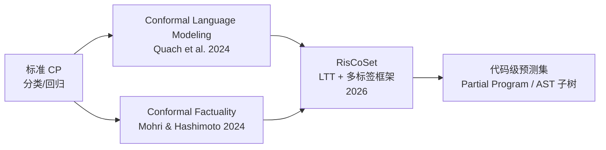
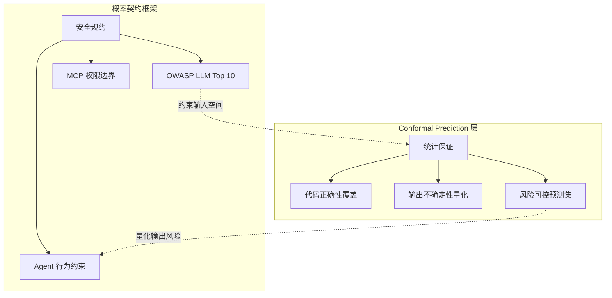

# Conformal Prediction 在代码生成中的统计保证应用

> **版本**: 2026-06-06
> **权威来源**: Vovk, Gammerman & Shafer (2005); Angelopoulos & Bates (2021); RisCoSet (arXiv:2605.12201, 2026); Conformal Language Modeling (Quach et al., 2024); Shafer & Vovk (2008)
> **定位**: 为 LLM 生成的代码提供分布无关的有限样本覆盖保证，与概率契约框架形成互补

---

## 1. 核心概念：边际覆盖保证的直观解释

### 1.1 什么是 Conformal Prediction？

**Conformal Prediction (CP)** 由 Vovk、Gammerman 和 Shafer 于 2005 年系统提出[^1]，是一种**模型无关、分布无关**的不确定性量化框架。它不假设数据服从任何特定分布，也不依赖于底层模型的正确性，仅要求数据满足**可交换性 (exchangeability)**。

### 1.2 边际覆盖保证 P(y ∈ C(x)) ≥ 1−α

对于给定的显著性水平 α ∈ (0,1)，CP 构造的预测集 C(x) 满足：

$$
\mathbb{P}\bigl(y_{\text{test}} \in C(x_{\text{test}})\bigr) \;\geq\; 1-\alpha
$$

**直观解释**：

> 想象一位代码审查员面对 LLM 生成的函数。传统方法是给出一个"是/否"判断（如"这段代码正确概率为 85%"），但这类点预测无法提供**可证明的统计保证**。CP 则说："我构造一个'候选代码集合'，这个集合以至少 95% 的概率包含真正正确的实现。"

关键特征：

| 特性 | 说明 |
|------|------|
| **有限样本保证** | 对任何样本量 n 均成立，无需渐近近似 |
| **分布无关** | 不假设数据服从高斯分布等特定分布 |
| **模型无关** | 适用于任何基础模型（GPT-4、Claude、Llama 等） |
| **覆盖 vs 效率权衡** | 1−α 越高，预测集越大（越不精确）；反之亦然 |

**类比**：气象预报中的"降水概率 70%"是点预测；而 CP 类似于"明天气温将以 95% 的概率落在 18°C 到 26°C 之间"——后者提供了**可校准的覆盖保证**。

---

## 2. 从分类到代码生成：CP 的结构化扩展

### 2.1 传统 CP 的局限

标准 CP 适用于分类或回归任务，其中输出空间是有限离散集合或实数轴。然而代码生成面临特殊挑战：

- **指数级输出空间**：程序语法的组合爆炸使穷举候选不可行
- **结构依赖性**：AST 节点之间存在系统性依赖，不满足组件独立性假设[^2]
- **多解等价性**：多种语法不同的程序可能语义等价（均正确）

### 2.2 面向代码生成的 CP 方法谱系



#### 2.2.1 Conformal Language Modeling (CLM)

Quach 等人 (2024)[^3] 将 CP 应用于开放式文本生成，校准**停止规则**和**拒绝规则**：

- **停止规则**：模型何时停止生成额外 token
- **拒绝规则**：生成的输出是否足够可靠

该方法保证：在指定覆盖水平下，预测集中至少包含一个正确完成的输出。

#### 2.2.2 RisCoSet：代码生成的风险控制预测集

2026 年的 RisCoSet 方法[^4]针对代码生成进行了专门优化：

> **核心思想**：将代码不确定性量化重构为**多标签分类问题**，利用 Learn Then Test (LTT) 框架消除传统 PAC 预测集的单调性约束。

**AST 级预测集**：给定 LLM 生成的代码，RisCoSet 输出一个**部分程序 (partial program)**——即 AST 的子树——该子树以高概率包含可扩展为正确程序的节点。

```
原始生成代码（含错误节点）          RisCoSet 预测集（AST 子树）
┌─────────────────────────┐        ┌─────────────────────────┐
│ def sort(arr):          │        │ def sort(arr):          │
│   for i in range(...):  │   →    │   for i in range(...):  │
│     [错误: 越界访问]      │        │     ...  # 保留，标记为不确定 │
│     [错误: 交换逻辑]      │        │     ...  # 保留，标记为不确定 │
│   return arr            │        │   return arr            │
└─────────────────────────┘        └─────────────────────────┘
              高亮节点 = 被移除的不确定 AST 节点
```

**选择性执行策略**：为降低校准阶段的测试执行成本，RisCoSet 引入阈值机制，仅对不确定性高于阈值的候选程序执行测试用例。

---

## 3. 应用框架：为 LLM 代码生成提供统计保证

### 3.1 系统架构

```mermaid
flowchart TB
    subgraph 训练与校准阶段
        A[LLM 基础模型] --> B[校准数据集<br/>带测试用例的代码对]
        B --> C[非共形分数计算<br/>s(x,y) = 1 − 测试通过率]
        C --> D[分位数估计<br/>q̂ = ⌈(n+1)(1−α)⌉ / n 分位数]
    end
    
    subgraph 推理阶段
        E[新需求 x_test] --> F[LLM 生成候选程序]
        F --> G{非共形分数 ≤ q̂?}
        G -->|是| H[纳入预测集 C(x)]
        G -->|否| I[丢弃]
        H --> J[输出：预测集 + 覆盖保证]
    end
    
    D -.->|传递阈值| G
```

### 3.2 非共形分数设计（代码域）

非共形分数 (nonconformity score) 衡量样本与训练分布的"异常程度"。在代码生成中，可采用的分数包括：

| 分数类型 | 定义 | 适用场景 |
|---------|------|---------|
| **测试通过率** | s(x,y) = 1 − (通过测试数 / 总测试数) | 有测试用例的编程任务（MBPP, HumanEval） |
| **语义熵** | s(x,y) = 基于执行轨迹的熵 | 需要语义等价性判断的场景 |
| **logit 差距** | s(x,y) = 1 − P(正确代码) / P(最可能代码) | API 级访问模型概率的场景 |
| **静态分析分数** | s(x,y) = lint 错误数 + 类型错误加权 | 无运行环境时的快速筛选 |

**关键洞察**：代码域的非共形分数应优先选择**执行验证**而非纯概率分数，因为 LLM 的 softmax 概率在代码生成中校准不良[^5]。

---

## 4. Python 示例：基于测试通过率的 CP 代码生成

以下示例展示如何使用 **Split Conformal Prediction**（归纳式 CP）为 LLM 生成的代码构造具有覆盖保证的预测集。

```python
"""
Conformal Prediction for LLM Code Generation
基于测试通过率的归纳式共形预测示例
"""

import numpy as np
from typing import List, Tuple, Callable
import openai  # 或任何 LLM API

# ------------------------------------------------------------
# 1. 数据结构与工具函数
# ------------------------------------------------------------

def generate_candidates(prompt: str, n: int = 10, temperature: float = 0.8) -> List[str]:
    """
    调用 LLM 生成 n 个候选代码实现。
    实际应用中应使用 beam search 或 diverse decoding。
    """
    # 伪代码：替换为实际 API 调用
    # completions = openai.ChatCompletion.create(
    #     model="gpt-4",
    #     messages=[{"role": "user", "content": prompt}],
    #     n=n,
    #     temperature=temperature
    # )
    # return [c.message.content for c in completions.choices]
    return [f"# candidate {i} for: {prompt}" for i in range(n)]


def run_tests(code: str, test_cases: List[Tuple]) -> float:
    """
    执行测试用例，返回通过率 [0.0, 1.0]。
    示例：对 HumanEval/MBPP 风格的测试用例执行。
    """
    # 实际实现需使用沙箱（如 Docker、gVisor）执行代码
    # 此处为演示返回模拟值
    import random
    random.seed(hash(code) % 2**32)
    return random.uniform(0.0, 1.0)


# ------------------------------------------------------------
# 2. 非共形分数函数
# ------------------------------------------------------------

def nonconformity_score(code: str, test_cases: List[Tuple]) -> float:
    """
    非共形分数：1 - 测试通过率
    分数越高，表示该代码实现越"异常"（越可能错误）。
    """
    pass_rate = run_tests(code, test_cases)
    return 1.0 - pass_rate


# ------------------------------------------------------------
# 3. Split Conformal Prediction 核心实现
# ------------------------------------------------------------

class CodeConformalPredictor:
    """
    为 LLM 代码生成提供边际覆盖保证的共形预测器。
    
    保证：在可交换性假设下，对于新样本 (x_test, y_test)，
          P(y_test ∈ C(x_test)) >= 1 - alpha
    """
    
    def __init__(self, alpha: float = 0.1):
        """
        Args:
            alpha: 显著性水平。默认 0.1 表示 90% 覆盖保证。
        """
        self.alpha = alpha
        self.quantile = None  # 校准分位数
        self.calibration_scores = []
    
    def calibrate(
        self,
        calibration_data: List[Tuple[str, str, List[Tuple]]]
    ) -> None:
        """
        校准阶段：使用标注数据集计算非共形分数分位数。
        
        Args:
            calibration_data: 列表元素为 (prompt, correct_code, test_cases)
        """
        scores = []
        for prompt, correct_code, tests in calibration_data:
            score = nonconformity_score(correct_code, tests)
            scores.append(score)
        
        self.calibration_scores = np.array(scores)
        n = len(scores)
        
        # 计算 ⌈(n+1)(1-alpha)⌉ / n 分位数
        # 这是保证有限样本覆盖的关键公式
        q_level = np.ceil((n + 1) * (1 - self.alpha)) / n
        q_level = min(q_level, 1.0)
        
        self.quantile = np.quantile(scores, q_level)
        
        print(f"[校准完成] 样本数: {n}, 分位数水平: {q_level:.4f}, "
              f"阈值 q̂: {self.quantile:.4f}")
    
    def predict_set(
        self,
        prompt: str,
        test_cases: List[Tuple],
        n_candidates: int = 20
    ) -> Tuple[List[str], float]:
        """
        预测阶段：为给定需求构造具有覆盖保证的代码预测集。
        
        Args:
            prompt: 代码需求描述
            test_cases: 用于筛选的测试用例
            n_candidates: 生成的候选数量
            
        Returns:
            (prediction_set, empirical_coverage_on_cal)
        """
        if self.quantile is None:
            raise ValueError("必须先调用 calibrate() 进行校准")
        
        # 生成候选代码
        candidates = generate_candidates(prompt, n=n_candidates)
        
        # 筛选满足覆盖条件的候选
        prediction_set = []
        for code in candidates:
            score = nonconformity_score(code, test_cases)
            if score <= self.quantile:
                prediction_set.append(code)
        
        # 报告校准集上的经验覆盖（诊断用）
        empirical_coverage = np.mean(
            self.calibration_scores <= self.quantile
        )
        
        return prediction_set, empirical_coverage
    
    def predict_set_with_llm_reranking(
        self,
        prompt: str,
        test_cases: List[Tuple],
        n_candidates: int = 50,
        top_k: int = 10
    ) -> Tuple[List[str], dict]:
        """
        增强版：先生成大量候选，用 LLM 概率做初步筛选，
        再用 CP 保证覆盖。平衡效率与保证。
        """
        # 第 1 步：生成候选并按模型概率排序（取 top_k）
        all_candidates = generate_candidates(prompt, n=n_candidates)
        # ... 按模型 log-prob 排序，保留 top_k ...
        shortlisted = all_candidates[:top_k]
        
        # 第 2 步：应用 CP 阈值
        prediction_set = []
        for code in shortlisted:
            score = nonconformity_score(code, test_cases)
            if score <= self.quantile:
                prediction_set.append(code)
        
        stats = {
            "candidates_generated": n_candidates,
            "shortlisted": top_k,
            "prediction_set_size": len(prediction_set),
            "quantile_threshold": self.quantile,
            "coverage_guarantee": 1 - self.alpha
        }
        
        return prediction_set, stats


# ------------------------------------------------------------
# 4. 使用示例
# ------------------------------------------------------------

def demo():
    """完整演示流程"""
    
    # 4.1 准备校准数据（实际应用中应使用数百条）
    calibration_data = [
        ("Write a function to reverse a string",
         "def reverse(s): return s[::-1]",
         [("hello", "olleh"), ("abc", "cba")]),
        ("Write a function to check palindrome",
         "def is_pal(s): return s == s[::-1]",
         [("radar", True), ("hello", False)]),
        # ... 更多校准样本
    ] * 50  # 模拟 100 条校准数据
    
    # 4.2 初始化并校准
    predictor = CodeConformalPredictor(alpha=0.1)  # 90% 覆盖保证
    predictor.calibrate(calibration_data)
    
    # 4.3 对新需求进行预测
    test_prompt = "Write a function to find the maximum element in a list"
    test_cases = [
        ([1, 3, 2], 3),
        ([-1, -5, -2], -1),
        ([5], 5)
    ]
    
    pred_set, stats = predictor.predict_set_with_llm_reranking(
        test_prompt,
        test_cases,
        n_candidates=50,
        top_k=10
    )
    
    print("\n=== 预测结果 ===")
    print(f"覆盖保证: {stats['coverage_guarantee']*100:.0f}%")
    print(f"预测集大小: {stats['prediction_set_size']}")
    print(f"候选生成数: {stats['candidates_generated']}")
    
    if pred_set:
        print("\n预测集中的代码示例（前 3 条）:")
        for i, code in enumerate(pred_set[:3], 1):
            print(f"\n--- 候选 {i} ---\n{code}")
    else:
        print("\n警告: 预测集为空！考虑：")
        print("  1. 增加 alpha（降低覆盖要求）")
        print("  2. 增加校准样本量")
        print("  3. 检查测试用例是否过严")


if __name__ == "__main__":
    demo()
```

### 4.1 关键代码解读

| 代码段 | 含义 |
|--------|------|
| `q_level = ceil((n+1)(1-alpha))/n` | 保证有限样本覆盖的核心公式，来源于 Vovk et al. (2005) |
| `score = 1 - pass_rate` | 非共形分数：通过率越低，分数越高，越"异常" |
| `score <= quantile` | 纳入预测集的条件：异常程度不超过校准阈值 |

---

## 5. 与概率契约框架的关联

本项目的 **概率契约框架**（`struct/12-ai-native-reuse/04-probabilistic-contracts/`）从**规约层面**定义了 AI 组件的行为边界（如 OWASP LLM/MCP 安全约束）。Conformal Prediction 从**统计层面**提供了量化工具，两者形成互补：



| 维度 | 概率契约 | Conformal Prediction |
|------|---------|---------------------|
| **保证类型** | 逻辑/规约保证 | 统计覆盖保证 |
| **形式** | "不得泄露密钥" | "正确代码以 95% 概率在预测集中" |
| **验证方式** | 静态分析、运行时检查 | 校准集 + 假设检验 |
| **与 LLM 关系** | 外部约束 | 后处理包装器 |
| **复用场景** | MCP Server 安全复用 | 代码生成组件可信度评估 |

**集成建议**：在 IDP 的 Golden Path 中，高 stakes 代码生成任务（如金融交易逻辑、医疗数据处理）应同时应用概率契约（输入过滤 + 权限限制）和 CP（输出统计保证），形成**双层防护**。

---

## 6. 前沿进展与 2026 展望

### 6.1 自适应覆盖 (Adaptive Conformal Prediction)

传统 CP 使用固定的全局阈值 q̂，导致简单样本的预测集过大、复杂样本的预测集过小。2025–2026 年的进展包括：

- **LTT 框架** (Angelopoulos et al., 2025)[^6]：允许样本特定的覆盖策略，通过正则化参数 λ 平衡集合大小与覆盖水平。
- **E-values 替代 P-values** (Shafer & Vovk, 2019; Vovk & Wang, 2021)：支持事后选择 α 而不破坏统计有效性。

### 6.2 多轮推理中的 CP

对于 ReAct 风格的多轮 Agent 推理，Rube-Tules 等人 (2025)[^7] 提出 **Conformal Language Model Reasoning with Coherent Factuality**，在多轮迭代中校准停止规则，确保最终答案以指定概率正确。

### 6.3 联邦场景下的 CP

2026 年的研究将 CP 扩展到联邦 LLM 训练[^8]，在带宽受限的多节点环境中保证聚合预测集的覆盖性。

---

## 7. 实施建议

| 场景 | 推荐方法 | 校准成本 | 覆盖保证 |
|------|---------|---------|---------|
| 单元级代码补全 | Split CP + 测试通过率 | 低（100–500 样本） | 边际覆盖 |
| 项目级需求实现 | RisCoSet (AST 预测集) | 高（需执行测试） | 边际覆盖 + 结构保证 |
| 高 stakes 安全代码 | CP + 形式化验证混合 | 极高 | 条件覆盖（近似） |
| 实时代码审查 | 在线 CP (Online CP) | 持续更新 | 序列覆盖保证 |

---

## 参考索引

[^1]: V. Vovk, A. Gammerman, and G. Shafer, *Algorithmic Learning in a Random World*. Springer, 2005.

[^2]: A. Casalnuovo et al., "On the temporal dynamics of code," in *Proc. MSR*, 2019.  // 代码组件系统性依赖的经典论证

[^3]: V. Quach et al., "Conformal language modeling," *arXiv preprint*, 2024.

[^4]: "Uncertainty Quantification for LLM-based Code Generation: RisCoSet," *arXiv:2605.12201*, 2026.

[^5]: S. Kadavath et al., "Language models (mostly) know what they know," *arXiv:2207.05221*, 2022.  // LLM 概率校准不良的经典研究

[^6]: A. Angelopoulos et al., "Learn then test: Calibrating predictive algorithms to achieve risk control," *arXiv:2110.01052*, 2025.

[^7]: M. Rubin-Toles et al., "Conformal language model reasoning with coherent factuality," *arXiv:2505.17126*, 2025.

[^8]: "Federated Language Models Under Bandwidth Budgets: Distillation Rates and Conformal Coverage," *arXiv:2605.09986*, 2026.

---

> **关联主题**:
> - `struct/12-ai-native-reuse/04-probabilistic-contracts/` — 概率契约与安全对齐
> - `struct/12-ai-native-reuse/03-llm-reuse-patterns/` — LLM 代码生成复用模式
> - `struct/07-formal-verification/` — 形式化验证与统计保证的融合路径
