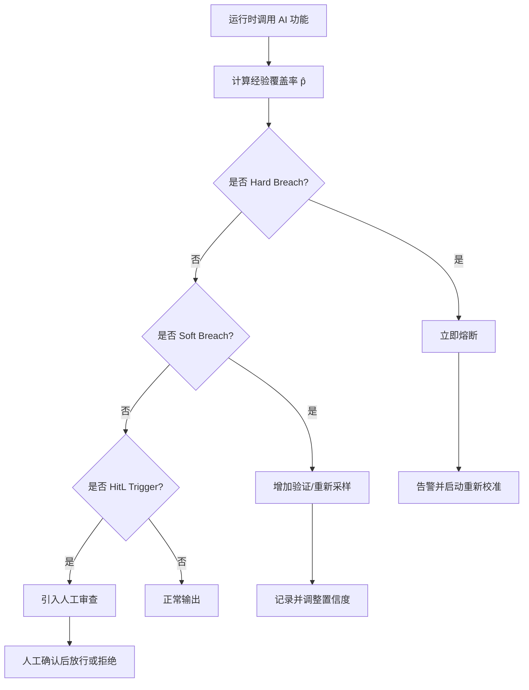

# AI 概率契约（Probabilistic Contract）框架

> **定位**：为 AI 原生复用提供可验证的统计信任边界，将 LLM/模型输出的不确定性纳入架构治理与 SLA。
> **版本**：2026-07-08
> **适用范围**：`struct/12-ai-native-reuse/05-probabilistic-contracts/`
> **权威来源**（已核查 2026-07-08）：
>
> | 来源 | URL |
> |------|-----|
> | Angelopoulos & Bates, *A Gentle Introduction to Conformal Prediction* | <https://arxiv.org/abs/2107.07511> |
> | Vovk et al., *Algorithmic Learning in a Random World* | Springer, 2005 |
> | NIST AI 600-1 Generative AI Profile | <https://nvlpubs.nist.gov/nistpubs/ai/nist.ai.600-1.pdf> |
> | NIST AI RMF 1.0 | <https://www.nist.gov/itl/ai-risk-management-framework> |
> | ISO/IEC/IEEE 42010:2022 | <https://www.iso.org/standard/74296.html> |

---

## 目录

- [AI 概率契约（Probabilistic Contract）框架](#ai-概率契约probabilistic-contract框架)
  - [目录](#目录)
  - [1. 形式化定义](#1-形式化定义)
    - [1.1 概率契约四元组 ⟨f, X, Y, γ⟩](#11-概率契约四元组-f-x-y-γ)
    - [1.2 契约满足条件](#12-契约满足条件)
    - [1.3 预测集合与 Conformal 边界](#13-预测集合与-conformal-边界)
    - [1.4 浓度不等式：Hoeffding 与 Bernstein 边界](#14-浓度不等式hoeffding-与-bernstein-边界)
      - [1.4.1 Hoeffding 边界](#141-hoeffding-边界)
      - [1.4.2 Bernstein 边界](#142-bernstein-边界)
      - [1.4.3 边界对比矩阵](#143-边界对比矩阵)
      - [1.4.4 样本量计算示例](#144-样本量计算示例)
    - [1.5 覆盖保证示例](#15-覆盖保证示例)
      - [Conformal Prediction 流程图](#conformal-prediction-流程图)
      - [示例 1：代码生成任务的预测集合](#示例-1代码生成任务的预测集合)
      - [示例 2：SQL 生成服务的覆盖率监控](#示例-2sql-生成服务的覆盖率监控)
    - [1.6 形式化约束（新增）](#16-形式化约束新增)
  - [2. 置信度函数 γ(x) 设计指南](#2-置信度函数-γx-设计指南)
    - [2.1 输入复杂度](#21-输入复杂度)
    - [2.2 领域熟悉度](#22-领域熟悉度)
    - [2.3 历史表现](#23-历史表现)
    - [2.4 综合置信度模型（示例）](#24-综合置信度模型示例)
  - [3. 采样与模型参数约束](#3-采样与模型参数约束)
    - [3.1 参数语义与约束](#31-参数语义与约束)
    - [3.2 推荐默认矩阵](#32-推荐默认矩阵)
  - [4. 违约阈值定义](#4-违约阈值定义)
    - [4.1 硬阈值（Hard Threshold）](#41-硬阈值hard-threshold)
    - [4.2 软阈值（Soft Threshold）](#42-软阈值soft-threshold)
    - [4.3 人在回路阈值（Human-in-the-Loop Threshold）](#43-人在回路阈值human-in-the-loop-threshold)
    - [4.4 违约处理决策树](#44-违约处理决策树)
  - [5. 与 SLA/SLO 的转换规则](#5-与-slaslo-的转换规则)
    - [5.1 转换公式](#51-转换公式)
    - [5.2 转换示例](#52-转换示例)
    - [5.3 SLA/SLO 设计模板（新增）](#53-slaslo-设计模板新增)
  - [6. 与布尔契约、Design-by-Contract 的区别](#6-与布尔契约design-by-contract-的区别)
  - [7. 相关公理与定理](#7-相关公理与定理)
  - [8. 误用反例](#8-误用反例)
    - [反例 1：将概率契约当作布尔契约使用](#反例-1将概率契约当作布尔契约使用)
    - [反例 2：忽略可交换性假设导致覆盖保证失效](#反例-2忽略可交换性假设导致覆盖保证失效)
    - [反例 3：样本量不足导致置信区间过宽](#反例-3样本量不足导致置信区间过宽)
    - [反例 4：概率契约与过度授权 Agent 结合导致放大损失（新增）](#反例-4概率契约与过度授权-agent-结合导致放大损失新增)
  - [9. 校准方法](#9-校准方法)
    - [9.1 离线校准流程](#91-离线校准流程)
    - [9.2 在线校准：Adaptive Conformal Inference (ACI)](#92-在线校准adaptive-conformal-inference-aci)
    - [9.3 校准评估指标](#93-校准评估指标)
    - [9.4 重新校准触发条件](#94-重新校准触发条件)
  - [10. 参考文献与权威来源](#10-参考文献与权威来源)
  - [11. 交叉引用](#11-交叉引用)

---

## 1. 形式化定义

### 1.1 概率契约四元组 ⟨f, X, Y, γ⟩

**定义 1.1**（概率契约）：AI 功能复用的概率契约 `C` 是一个四元组

```text
C = ⟨f, X, Y, γ⟩
```

其中：

| 符号 | 名称 | 说明 |
|------|------|------|
| `f` | AI 功能 | `f: X → Distribution(Y)`，从输入空间到输出分布的映射。对 LLM 而言，f 通常由 `model(prompt(x))` 实现。 |
| `X` | 输入空间 | 所有被契约覆盖的输入集合，包括 Prompt 模板、变量绑定、上下文窗口、用户角色等。 |
| `Y` | 输出空间 | 所有可能的输出集合，包括结构化输出、文本、代码、工具调用参数等。 |
| `γ` | 置信度函数 | `γ: X → [0, 1]`，对给定输入 `x ∈ X` 返回期望正确概率的下界。 |

**约束**：

```text
∀x ∈ X: 0 ≤ γ(x) ≤ 1
∃x₀ ∈ X: γ(x₀) < 1        # 不存在“绝对正确”的 AI 功能契约（公理 AI.1）
```

### 1.2 契约满足条件

**定义 1.2**（契约满足）：实现 `I` 满足概率契约 `C = ⟨f, X, Y, γ⟩`，当且仅当

```text
∀x ∈ X: P(I(x) ∈ Correct(y) | x) ≥ γ(x)
```

其中 `Correct(y)` 是输出 `y` 的正确性判定函数，可由人工评估、规则引擎、单元测试、形式化验证器或运行时检查器定义。

**经验满足**：当无法遍历整个 `X` 时，在独立同分布（或可交换）的校准集 `D_cal` 上验证

```text
(1 / |D_cal|) Σ_{(x, y) ∈ D_cal} 𝟙[I(x) ∈ Correct(y)] ≥ γ̄ - ε
```

其中 `γ̄` 为校准集上 `γ(x)` 的平均值，`ε` 为允许的统计误差。

### 1.3 预测集合与 Conformal 边界

基于 Split Conformal Prediction，为概率契约提供**边际覆盖保证**：

```text
P(y ∈ C(x)) ≥ 1 − α
```

其中 `α` 为目标错误率，`C(x)` 为预测集合。非一致性分数定义为

```text
s(x, y) = 1 − p(x)   若 y 正确
s(x, y) = p(x)       若 y 错误
```

`p(x)` 为模型输出的正确性概率。Conformal 阈值 `q` 取校准集非一致性分数的 `(1 − α)` 分位数，由此得到接受/拒绝/不确定三种决策。

### 1.4 浓度不等式：Hoeffding 与 Bernstein 边界

在实际部署中，我们只能基于有限样本 `n` 估计经验覆盖率 `p̂`。浓度不等式（Concentration Inequalities）提供了样本覆盖率与真实覆盖率之间偏差的概率上界，是概率契约可验证性的数学基础。

#### 1.4.1 Hoeffding 边界

设 `X₁, X₂, ..., Xₙ` 为独立同分布的伯努利随机变量，`P(Xᵢ = 1) = p`，经验均值为 `p̂ = (1/n)ΣXᵢ`。则对任意 `ε > 0`：

```text
P(|p̂ − p| ≥ ε) ≤ 2 exp(−2nε²)
```

等价地，置信水平 `1 − δ` 下的置信区间为：

```text
p ∈ [p̂ − √(ln(2/δ) / 2n), p̂ + √(ln(2/δ) / 2n)]
```

**适用场景**：对任何有界随机变量都成立，不依赖分布假设，是最保守但最通用的边界。

#### 1.4.2 Bernstein 边界

当已知随机变量的方差上界 `σ²` 时，Bernstein 边界可以给出更紧的估计：

```text
P(|p̂ − p| ≥ ε) ≤ 2 exp( − nε² / (2σ² + 2Mε/3) )
```

其中 `M` 是随机变量的绝对上界（对伯努利变量 `M = 1`）。

**适用场景**：当模型输出的置信度分布已知或可通过校准集估计方差时，Bernstein 边界通常比 Hoeffding 更紧，需要的样本量更少。

#### 1.4.3 边界对比矩阵

| 边界 | 分布假设 | 所需信息 | 样本效率 | 适用场景 |
|------|---------|---------|---------|---------|
| Hoeffding | 有界变量，无其他假设 | 上界 M | 保守 | 黑盒模型、无分布信息 |
| Bernstein | 有界变量 + 方差上界 | M 与 σ² | 较紧 | 白盒/灰盒模型、可估计方差 |
| Chernoff | 独立同分布伯努利 | 仅 p | 紧 | 二元正确性指标 |
| Clopper-Pearson | 二项分布 | 成功/失败次数 | 精确 | 小样本、高可信场景 |

#### 1.4.4 样本量计算示例

假设概率契约要求 `γ = 0.95`，允许的估计误差 `ε = 0.02`，置信水平 `1 − δ = 0.99`（即 `δ = 0.01`）。使用 Hoeffding 边界：

```text
n ≥ ln(2/δ) / (2ε²)
n ≥ ln(200) / (2 × 0.0004)
n ≥ 5.30 / 0.0008
n ≥ 6,625
```

因此，至少需要约 **6,625** 个独立样本，才能以 99% 的置信度确认经验覆盖率 `p̂` 与真实覆盖率 `p` 的偏差不超过 ±2%。

若使用 Bernstein 边界且估计方差 `σ² = 0.04`：

```text
n ≥ (2σ² + 2Mε/3) × ln(2/δ) / ε²
n ≥ (0.08 + 0.0133) × 5.30 / 0.0004
n ≥ 0.0933 × 13,250
n ≥ 1,236
```

在方差信息可用的情况下，样本量需求从 6,625 降至约 **1,236**，显著降低校准成本。

### 1.5 覆盖保证示例

#### Conformal Prediction 流程图

```mermaid
flowchart TD
    A[收集校准数据集 D_cal] --> B[训练模型或获取基础模型]
    B --> C[计算非一致性分数 s(x, y)]
    C --> D[确定目标错误率 α]
    D --> E[计算分位数阈值 q = quantile(1−α)]
    E --> F[对新输入 x 生成候选集合]
    F --> G{候选 y 的 s(x, y) ≤ q?}
    G -->|是| H[纳入预测集合 C(x)]
    G -->|否| I[排除]
    H --> J[输出 C(x) 并声明 P(y ∈ C(x)) ≥ 1−α]
```

#### 示例 1：代码生成任务的预测集合

**背景**：某 LLM 代码生成服务承诺为 Python 函数生成任务提供 `γ = 0.90` 的正确性保证。

**实现**：

1. 使用 Split Conformal Prediction，在 1,000 个校准样本上计算非一致性分数。
2. 选择 `α = 0.10`，得到 conformal 阈值 `q`。
3. 对于新输入 `x`，模型输出 5 个候选代码片段，每个候选的非一致性分数 `s(x, yᵢ)` 与 `q` 比较。
4. 最终预测集合 `C(x)` 包含所有分数 ≤ `q` 的候选。

**结果**：

- 若 `C(x)` 包含 1 个候选：直接输出。
- 若 `C(x)` 包含多个候选：返回候选列表，要求开发者选择或触发人在回路。
- 若 `C(x)` 为空：拒绝生成，触发模型重训或 Prompt 调整。

**保证**：在可交换性假设下，`P(y_true ∈ C(x)) ≥ 0.90`。

#### 示例 2：SQL 生成服务的覆盖率监控

**背景**：SQL 生成服务承诺语法与执行结果正确率 `γ = 0.95`。

**监控指标**：

```text
empirical_coverage = (# 正确调用) / (# 总调用)
confidence_interval = [p̂ − ε, p̂ + ε]   （使用 Hoeffding 或 Bernstein）
```

**决策规则**：

| 条件 | 动作 |
|------|------|
| `empirical_coverage ≥ 0.95` 且 CI 下限 ≥ 0.93 | 继续服务 |
| `0.93 ≤ empirical_coverage < 0.95` | 软违约：增加人在回路比例 |
| `empirical_coverage < 0.93` | 硬违约：熔断并重新校准 |

### 1.6 形式化约束（新增）

概率契约不仅是统计目标，更是一组可在运行时检查的**形式化约束**。建议将以下约束显式写入契约声明：

| 约束类别 | 形式化表达 | 运行时检查 |
|---------|-----------|-----------|
| **覆盖约束** | `∀x ∈ X: P(I(x) ∈ Correct(y) | x) ≥ γ(x)` | 滚动窗口经验覆盖率 |
| **单调性约束** | `x₁ 更简单 ⇒ γ(x₁) ≥ γ(x₂)` | 输入复杂度评分 |
| **漂移约束** | `D(P_deploy \|\| P_cal) ≤ δ_max` | PSI / KS 检验 |
| **校准约束** | `|ECE| ≤ ε_max` | 期望校准误差 |
| **样本约束** | `n ≥ ln(2/δ) / (2ε²)`（Hoeffding） | 校准集大小 |
| **组合约束** | `γ₁₂ ≥ max(γ₁, γ₂)`（不确定性不降级） | 多模型串联评估 |

**契约声明 YAML 片段示例**：

```yaml
contract:
  function: generate_sql
  input_space: X_sql
  output_space: Y_sql
  confidence:
    base: 0.95
    complexity_discount: "max(0.5, 1.0 - complexity_score * 0.1)"
    history_decay: "exp(-lambda * t)"
  formal_constraints:
    coverage: "P(correct | x) >= gamma(x)"
    drift_limit: "PSI(cal, deploy) <= 0.2"
    calibration_error: "ECE <= 0.05"
    min_calibration_samples: 6625
  sampling:
    temperature: "<= 0.1"
    top_p: "0.90-0.95"
```

---

## 2. 置信度函数 γ(x) 设计指南

置信度函数 `γ(x)` 是概率契约的核心，必须综合考虑输入复杂度、领域熟悉度和历史表现。

### 2.1 输入复杂度

输入复杂度越高，置信度应越低。建议从以下维度量化：

| 维度 | 低复杂度 | 中复杂度 | 高复杂度 |
|------|----------|----------|----------|
| 代码行数 | < 50 | 50–200 | > 200 |
| 控制流深度 | 顺序结构 | 条件/循环 | 递归/并发/分布式 |
| 依赖数量 | 0–2 | 3–8 | > 8 |
| Schema 字段数 | < 10 | 10–30 | > 30 |
| 自然语言歧义 | 低 | 中 | 高 |

复杂度折扣系数 `d_complexity`：

```text
d_complexity = max(0.5, 1.0 − complexity_score × 0.1)
```

### 2.2 领域熟悉度

领域熟悉度反映模型在特定领域的训练覆盖度与组织内已沉淀的资产密度：

| 熟悉度等级 | 条件 | 加成系数 `d_familiarity` |
|------------|------|--------------------------|
| 高 | 高频任务、组织已有标准模板、公开基准覆盖充分 | 1.0 |
| 中 | 中等频率、部分模板、领域数据有限 | 0.9 |
| 低 | 低频任务、新领域、无历史数据 | 0.7–0.8 |

### 2.3 历史表现

历史表现通过滚动窗口内的校准误差（ECE）和准确率动态调整置信度：

```text
γ_history(t) = γ_base × (1 − ECE_window(t)) × decay_factor(t)

decay_factor(t) = exp(−λ × t)
```

其中 `λ` 为模型漂移率，与模型更新频率成反比（公理 12.1 Model Drift Bound）。

### 2.4 综合置信度模型（示例）

```text
γ(x) = min(0.99, γ_base × d_complexity(x) × d_familiarity(x) × γ_history(x))
```

推荐基线 `γ_base`：

| 功能类型 | γ_base |
|----------|--------|
| SQL 生成 / 关键决策支持 | 0.95 |
| 代码生成 / 测试生成 | 0.90 |
| 代码审查 / 配置生成 | 0.85 |
| 文档生成 / 信息抽取 | 0.75 |
| 创意写作 / 头脑风暴 | 0.60 |

---

## 3. 采样与模型参数约束

### 3.1 参数语义与约束

| 参数 | 语义 | 取值范围 | 约束说明 |
|------|------|----------|----------|
| `temperature` | 采样温度，控制输出随机性 | [0, 2] | 越高多样性越强，确定性越低；关键任务建议 ≤ 0.2 |
| `top_p` | 核采样概率质量阈值 | [0, 1] | 越低输出越集中；与 temperature 联合约束 |
| `model_version` | 模型版本标识 | 字符串 | 版本变更必须重新校准 |
| `max_tokens` | 最大输出长度 | 正整数 | 影响输出完整性 |
| `seed` | 确定性种子 | 整数 | 复现实验与回归测试使用 |

**参数联合约束**：

```text
temperature ∈ [0, 2]
top_p ∈ [0, 1]
若 temperature > 1.0，则 top_p ≤ 0.9   # 防止过度随机
若任务 determinism_level = HIGH，则 temperature ≤ 0.2 且 top_p ≤ 0.95
```

### 3.2 推荐默认矩阵

| 功能类型 | 确定性需求 | 推荐 temperature | 推荐 top_p | 推荐 γ | 复用等级 |
|----------|-----------|------------------|-----------|--------|----------|
| SQL 生成 | 极高 | 0.0–0.1 | 0.90–0.95 | 0.95 | 严格复用 |
| 关键决策支持 | 极高 | 0.0–0.1 | 0.90–0.95 | 0.95 | 限制复用 |
| 代码生成 | 高 | 0.1–0.2 | 0.90–0.95 | 0.90 | 条件复用 |
| 测试生成 | 高 | 0.1–0.2 | 0.90–0.95 | 0.90 | 条件复用 |
| 配置生成 | 高 | 0.1–0.2 | 0.90–0.95 | 0.90 | 条件复用 |
| 代码审查 | 中 | 0.1–0.3 | 0.85–0.95 | 0.85 | 条件复用 |
| 文档生成 | 低 | 0.3–0.5 | 0.85–0.95 | 0.70 | 广泛复用 |
| 信息抽取 | 中 | 0.1–0.3 | 0.90–0.95 | 0.85 | 条件复用 |
| 创意写作 | 低 | 0.7–1.0 | 0.90–1.0 | 0.50 | 自由复用 |

---

## 4. 违约阈值定义

违约阈值（Breach Threshold）用于在运行时判定契约是否被违反，并触发相应治理动作。

### 4.1 硬阈值（Hard Threshold）

**定义**：当经验覆盖率或正确率低于该阈值时，系统自动拒绝复用该 AI 功能，并发出告警。

```text
Hard Breach:  empirical_coverage < γ(x) − α_hard
```

| 场景 | α_hard | 触发动作 |
|------|--------|----------|
| 生产环境关键路径 | 0.01 | 立即熔断、切换到人工或备用系统 |
| 生产环境非关键路径 | 0.03 | 拒绝当前输出并记录 |
| 开发/测试环境 | 0.05 | 标记高风险并通知责任人 |

### 4.2 软阈值（Soft Threshold）

**定义**：当经验覆盖率低于该阈值但未达到硬阈值时，系统降低置信度、增加采样次数或要求额外验证。

```text
Soft Breach:  γ(x) − α_soft ≤ empirical_coverage < γ(x) − α_hard
```

| 场景 | α_soft | 触发动作 |
|------|--------|----------|
| 生产环境 | 0.02 | 增加一次一致性检查或重新采样 |
| 非生产环境 | 0.04 | 记录并纳入下次校准周期 |

### 4.3 人在回路阈值（Human-in-the-Loop Threshold）

**定义**：当置信度低于该阈值，或输出处于预测集合的“不确定”区间时，必须引入人工审查。

```text
HitL Trigger:  γ(x) < θ_hitl  OR  C(x) = {0, 1}
```

最优人在回路阈值满足（定理 AI.2）：

```text
θ_hitl = C_review / C_error
```

其中 `C_review` 为人工审查成本，`C_error` 为错误成本。典型取值：

| 功能类型 | θ_hitl |
|----------|--------|
| SQL 生成 / 关键决策 | 0.90 |
| 代码生成 / 测试生成 | 0.80 |
| 代码审查 | 0.75 |
| 文档生成 | 0.60 |

### 4.4 违约处理决策树



---

## 5. 与 SLA/SLO 的转换规则

### 5.1 转换公式

概率契约可直接转换为服务等级目标（SLO）与服务等级协议（SLA）：

```text
SLO_correctness = γ(x)
SLO_availability  = 1 − α          # 由 conformal 覆盖保证推导
SLO_latency       = f(temperature, top_p, model_version, input_size)
Error Budget      = 1 − γ(x)        # 在给定观测窗口内允许的错误比例
MTBF_AI           = 1 / (1 − γ(x))  # 平均无故障调用次数（近似）
```

**SLA 违约条件**：

```text
在一个结算周期 T 内，若
  (错误调用数 / 总调用数) > 1 − γ(x) + ε
则视为 SLA 违约。
```

其中 `ε` 为允许的统计波动，通常取 `ε = 1.5 × sqrt(γ(x)(1−γ(x)) / N)`。

### 5.2 转换示例

**示例 1：SQL 生成功能**

```text
概率契约：C = ⟨generate_sql, X_sql, Y_sql, 0.95⟩ 在 temperature=0.1, top_p=0.95, model=llm-v2.0

转换为 SLO：
  - 语法正确率 ≥ 95%
  - 执行结果正确率 ≥ 95%（在沙箱验证后）
  - 平均 latency ≤ 500 ms @ p99

转换为 SLA：
  - 月度错误率 ≤ 5%，超出部分按调用量 10% 折算服务积分
  - 版本升级后需在 7 天内重新校准并更新 SLO 基线
  - 硬违约触发自动回退到上一稳定模型版本
  - 错误预算耗尽前 20% 触发黄色告警，耗尽触发红色告警
```

### 5.3 SLA/SLO 设计模板（新增）

| 维度 | SLO 指标 | 测量方法 | SLA 违约条件 |
|------|---------|---------|-------------|
| 正确性 | `correctness ≥ γ(x)` | 沙箱/规则/人工标注 | 结算周期错误率 > `1 − γ(x) + ε` |
| 可用性 | `availability ≥ 99.9%` | 健康检查 | 月度停机 > 43 分钟 |
| 延迟 | `p99_latency ≤ T` | OpenTelemetry | 连续 5 分钟 p99 > T |
| 成本 | `cost_per_call ≤ C` | 计费监控 | 月度单均成本 > C × 1.2 |
| 校准 | `|ECE| ≤ 0.05` | 校准报告 | 连续 2 周 ECE > 0.05 |
| 人在回路 | `hitl_rate ≤ H` | 审批日志 | 因置信度过低导致 HitL 率 > H × 1.5 |

**错误预算分配示例**：

```text
月度 SLO_correctness = 0.95  ⇒  错误预算 = 5%
  - 前 60%（3%）消耗：黄色告警，增加采样频率
  - 前 80%（4%）消耗：橙色告警，禁止新版本上线
  - 100%（5%）消耗：红色告警，自动熔断并启动根因分析
```

**示例 2：代码审查功能**

```text
概率契约：C = ⟨code_review, X_review, Y_review, 0.85⟩ 在 temperature=0.2, top_p=0.9

转换为 SLO：
  - 关键问题召回率 ≥ 85%
  - 误报率 ≤ 15%
  - 人在回路复核比例 ≥ 20%（当 γ(x) < 0.80 时）

转换为 SLA：
  - 每季度召回率不低于 85%，否则启动模型重训或版本回退
```

---

## 6. 与布尔契约、Design-by-Contract 的区别

| 维度 | 布尔契约 / DbC | 概率契约 |
|------|----------------|----------|
| 真值 | 二值：满足 / 不满足 | 连续：[0, 1] 置信度 |
| 适用对象 | 确定性软件组件 | AI/LLM 等随机性组件 |
| 前置条件 | 严格：必须满足 | 统计：以概率满足 |
| 后置条件 | 若前置成立，后置必然成立 | 若前置成立，后置以 `≥ γ` 概率成立 |
| 违约处理 | 抛出异常 / 回滚 | 熔断、降级、人在回路、重新采样 |
| 验证方法 | 单元测试、形式化证明 | 校准、Conformal Prediction、运行时监控 |
| 可组合性 | 前提/后置逻辑组合 | 不确定性单调递增：U₁₂ ≥ max(U₁, U₂)（公理 AI.2） |

**关键差异**：布尔契约承诺“如果前提满足，后置条件一定成立”；概率契约承诺“如果输入落在 `X` 内，输出正确的概率不低于 `γ(x)`”。后者不承诺绝对正确，但提供可量化的统计保证。

---

## 7. 相关公理与定理

本框架依赖以下已在 `struct/99-reference/glossary/axiom-theorem-tree.md` 中确立的公理与定理：

- **公理 AI.1**（Probabilistic Contract Necessity）：AI 功能的复用契约必须是概率型的，而非布尔型的。
- **公理 AI.2**（Uncertainty Composition）：组合功能的不确定性满足 `U₁₂ ≥ max(U₁, U₂)`。
- **定理 AI.1**（Calibration Ceiling）：当模型分布与真实分布的 KL 散度超过阈值时，校准误差存在下界。
- **定理 AI.2**（Human-in-the-Loop Optimality）：最优人在回路阈值 `θ = C_review / C_error`。
- **公理 12.1**（Model Drift Bound）：AI 功能复用的有效性随时间指数衰减，衰减率与更新频率成反比。
- **公理 S.1**（Interface Substitution）：可替换性取决于外部可观察行为在给定约束下等价。
- **公理 4.1**（Interface Contract Completeness）：组件可复用性取决于接口契约的完备性。

---

## 8. 误用反例

### 反例 1：将概率契约当作布尔契约使用

**场景**：某金融系统将 LLM 信用评分模型输出的“通过/拒绝”二值结果直接接入自动审批流程，并宣称“模型准确率 95%”。

**问题**：

1. 95% 准确率意味着每 20 个决策中仍有 1 个可能错误，在高风险金融场景中不可接受。
2. 没有为剩余的 5% 错误设计熔断、人在回路或降级路径。
3. 当输入分布发生漂移（如经济周期变化）时，95% 的准确率假设可能迅速失效。

**后果**：错误审批导致坏账、合规罚款、声誉损失。

**避免建议**：

- 将自动审批仅限制在置信度 `γ(x) ≥ θ_hitl` 且预测集合大小为 1 的场景。
- 对 `γ(x)` 较低或预测集合包含多个候选的场景，强制人工复核。
- 使用 Hoeffding/Bernstein 边界持续监控真实准确率，并在置信区间下界跌破阈值时熔断。

### 反例 2：忽略可交换性假设导致覆盖保证失效

**场景**：某医疗影像诊断系统使用 Split Conformal Prediction 构建预测集合，并承诺 `1 − α = 0.95` 的覆盖保证。但该系统将训练集、校准集、测试集按时间顺序切分，而未检查时间漂移。

**问题**：

1. Conformal Prediction 的边际覆盖保证依赖于样本的可交换性（exchangeability）。
2. 医疗设备升级、患者群体变化、季节性疾病分布变化都会破坏可交换性。
3. 系统在部署后 6 个月未重新校准，实际覆盖率跌至 0.82，但团队仍按 0.95 报告。

**后果**：漏诊率上升，患者安全风险增加，监管机构介入。

**避免建议**：

- 在应用 Conformal Prediction 前，使用统计检验（如 KS 检验、PSI）验证训练/校准/部署分布的可交换性。
- 对非交换场景使用 **Adaptive Conformal Inference（ACI）** 或 **Conformal Prediction under Distribution Shift** 方法进行在线校正。
- 设定重新校准周期（如每月或每 1,000 次调用），并监控经验覆盖率的趋势。

### 反例 3：样本量不足导致置信区间过宽

**场景**：某团队为新上线的代码补全功能声明 `γ = 0.90`，但仅使用 50 个样本进行校准。

**问题**：

- 使用 Hoeffding 边界计算 99% 置信区间：`ε = √(ln(2/0.01) / (2×50)) ≈ 0.24`。
- 即真实覆盖率可能在 `[0.66, 0.90]` 之间，区间过宽无法证明契约满足。
- 但团队仅报告点估计 `p̂ = 0.90`，误导下游系统认为契约已被满足。

**后果**：下游系统基于不可靠的契约进行自动化决策，导致错误累积。

**避免建议**：

- 在声明契约前，先使用 Hoeffding 或 Bernstein 边界计算所需最小样本量。
- 在监控仪表板中同时展示点估计、置信区间、样本量与可交换性假设状态。
- 当置信区间宽度超过业务容忍度时，增加样本量或降低声明的 `γ`。

### 反例 4：概率契约与过度授权 Agent 结合导致放大损失（新增）

**场景**：某运维 Agent 被授权根据 LLM 输出自动重启服务。该输出由概率契约 `γ=0.85` 的分类器生成，但团队未将概率契约与操作审批策略关联。

**问题**：

1. 分类器以 15% 的概率将正常服务误判为异常，Agent 在没有人类确认的情况下执行重启。
2. 概率契约的置信度低于关键操作阈值（应 `γ ≥ 0.99` 且预测集合大小为 1），但未触发 HitL。
3. 缺乏模型漂移监控，输入分布变化后误判率升至 30%。

**后果**：生产服务被频繁误重启，导致可用性下降与客户投诉。

**避免建议**：

- 关键自动化操作（重启、删除、转账）仅允许在 `γ(x) ≥ 0.99`、预测集合大小为 1 且近期校准误差合格时执行。
- 将概率契约状态接入 Agent OS 策略引擎，低置信度输出强制进入 L1 人类审批。
- 对关键分类服务实施在线校准（Adaptive Conformal Inference），降低分布漂移影响。

---

## 9. 校准方法

### 9.1 离线校准流程

```text
1. 收集标注数据集 D = {(xᵢ, yᵢ)}ₙ
2. 划分训练集 D_train / 校准集 D_cal（建议 80/20）
3. 在 D_train 上训练或固定基础模型
4. 在 D_cal 上计算非一致性分数 s(x, y)
5. 选择目标错误率 α
6. 计算分位数阈值 q = quantile(1−α, {s(x, y)})
7. 部署模型与阈值 q
8. 持续监控经验覆盖率与 ECE
```

### 9.2 在线校准：Adaptive Conformal Inference (ACI)

当部署分布随时间漂移时，静态阈值 `q` 无法保持覆盖保证。ACI 通过在线更新阈值 `q_t` 适应分布变化：

```text
q_{t+1} = q_t + η × (α − 𝟙[y_t ∈ C_t(x_t)])
```

其中 `η` 为学习率，`α` 为目标错误率。ACI 在分布漂移场景下仍能保持渐近覆盖保证。

### 9.3 校准评估指标

| 指标 | 定义 | 目标 |
|------|------|------|
| **ECE (Expected Calibration Error)** | 分箱后平均 `|准确率 − 置信度|` | ≤ 0.05 |
| **MCE (Maximum Calibration Error)** | 分箱后最大 `|准确率 − 置信度|` | ≤ 0.10 |
| **Empirical Coverage** | `(# 正确调用) / (# 总调用)` | ≥ γ(x) − ε |
| **Prediction Set Size** | 平均预测集合大小 | 尽量小，避免无效空集合 |
| **PSI / KS** | 分布漂移度量 | PSI ≤ 0.2；KS p-value ≥ 0.05 |

### 9.4 重新校准触发条件

| 条件 | 动作 |
|------|------|
| 经验覆盖率连续 7 天低于 γ(x) − ε | 触发软违约，增加 HitL 比例 |
| ECE 连续 2 周 > 0.05 | 触发重新校准 |
| PSI > 0.2 或 KS 检验显著 | 使用 ACI 或收集新校准集 |
| 模型版本升级 | 必须在 7 天内重新校准 |
| 错误预算耗尽 | 硬违约，熔断并启动根因分析 |

---

## 10. 参考文献与权威来源

1. Vovk, V., Gammerman, A., & Shafer, G. (2005). *Algorithmic Learning in a Random World*. Springer.
2. Angelopoulos, A. N., & Bates, S. (2021). A Gentle Introduction to Conformal Prediction and Distribution-Free Uncertainty Quantification. *arXiv:2107.07511*. <https://arxiv.org/abs/2107.07511>
3. Angelopoulos, A. N., et al. (2021). Learn then Test: Calibrating Predictive Algorithms to Achieve Risk Control. *arXiv:2110.01052*.
4. Barber, R. F., et al. (2023). Conformal Prediction Beyond Exchangeability. *Annals of Statistics*. <https://arxiv.org/abs/2202.13415>
5. Meyer, B. (1988). Object-Oriented Software Construction. Prentice Hall. (Design-by-Contract)
6. MCP Specification 2025-11-25. <https://modelcontextprotocol.io/specification/2025-11-25/>
7. NIST AI 600-1, *Generative Artificial Intelligence Profile*. <https://nvlpubs.nist.gov/nistpubs/ai/nist.ai.600-1.pdf>
8. NIST AI RMF 1.0. <https://www.nist.gov/itl/ai-risk-management-framework>
9. ISO/IEC/IEEE 42010:2022, *Systems and software engineering — Architecture description*. <https://www.iso.org/standard/74296.html>

> **权威来源**（已核查 2026-07-08）：
>
> | 来源 | URL |
> |------|-----|
> | Conformal Prediction: A Gentle Introduction | <https://arxiv.org/abs/2107.07511> |
> | Conformal Prediction Beyond Exchangeability | <https://arxiv.org/abs/2202.13415> |
> | Hoeffding's Inequality | <https://en.wikipedia.org/wiki/Hoeffding%27s_inequality> |
> | Bernstein Inequalities | <https://en.wikipedia.org/wiki/Bernstein_inequalities> |
> | Model Context Protocol Specification 2025-11-25 | <https://modelcontextprotocol.io/specification/2025-11-25/> |
> | NIST AI 600-1 Generative AI Profile | <https://nvlpubs.nist.gov/nistpubs/ai/nist.ai.600-1.pdf> |
> | NIST AI RMF 1.0 | <https://www.nist.gov/itl/ai-risk-management-framework> |
> | ISO/IEC/IEEE 42010:2022 | <https://www.iso.org/standard/74296.html> |
>
> **核查日期**: 2026-07-08

---

## 11. 交叉引用

- Conformal Prediction 与形式化验证的交叉见 [`../07-conformal-prediction/cp-formal-verification.md`](../07-conformal-prediction/cp-formal-verification.md)
- MCP 协议规范见 [`../01-mcp-protocol/mcp-2025-11-25-authoritative.md`](../01-mcp-protocol/mcp-2025-11-25-authoritative.md)
- A2A 协议规范见 [`../02-a2a-protocol/a2a-v1-authoritative.md`](../02-a2a-protocol/a2a-v1-authoritative.md)
- Agent 组合与不确定性组合见 [`../03-agentic-infrastructure/llm-agent-composition.md`](../03-agentic-infrastructure/llm-agent-composition.md)
- 监控指标与运行时验证见 [`./monitoring-metrics.md`](./monitoring-metrics.md)
- OWASP LLM 安全映射见 [`./owasp-llm-mcp-security.md`](./owasp-llm-mcp-security.md)
- AI SLA 模板见 [`./templates/ai-sla-template.md`](./templates/ai-sla-template.md)
- 校准报告模板见 [`./templates/calibration-report-template.md`](./templates/calibration-report-template.md)

---

> 最后更新：2026-07-08
