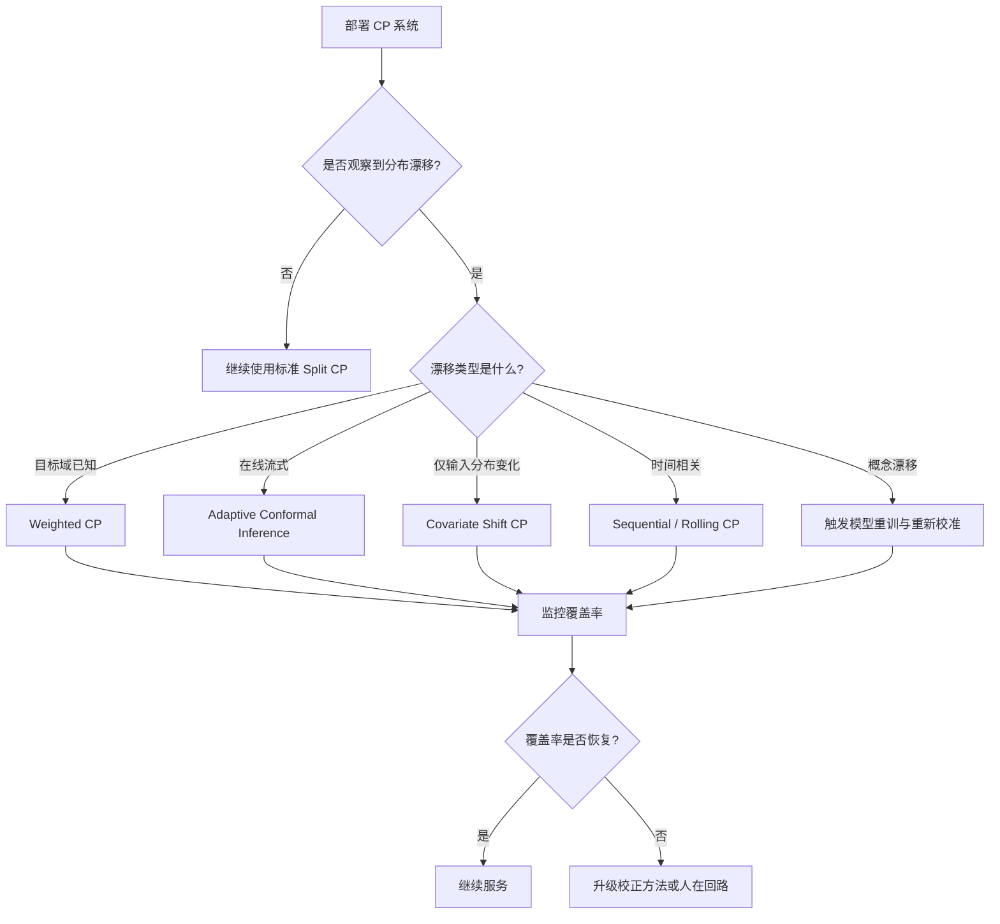

# CP + 形式化验证融合框架（研究探索方向）

> **研究空白 / 探索性框架**
> 本文档明确标注为研究探索方向，所述架构、方法及交叉点均为前瞻性提案，不代表已有成熟实现或经过验证的技术路径。

---

## 1. 研究现状声明：一个尚未被开垦的交叉地带

Conformal Prediction（CP，保形预测）与交互式定理证明（Lean、Coq、Isabelle/HOL）之间的直接结合，目前属于**研究空白**。
形式化验证社区长期依赖确定性内核（trusted computing base），追求数学意义上的绝对正确性；
而 CP 社区的核心关切是统计不确定性下的边际覆盖保证（marginal coverage guarantee）。
两个社区在问题定义、验证标准和工具链上存在根本性差异，迄今为止尚未出现成熟的融合框架。

具体而言：

- **形式化验证侧**：Lean 4、Coq、Isabelle 等系统以极小内核为基础，通过 Curry-Howard 同构将证明转化为类型检查，确保结论的确定性正确。
  其验证成本高昂——复杂定理的证明搜索可能需要数小时乃至数天的计算资源。
- **CP 侧**：以 Vovk、Gammerman & Shafer（2005）为理论基石，CP 为机器学习预测提供有限样本下的覆盖保证，但其保证是统计性的（如 1−α 的边际覆盖），而非逻辑上的绝对真值。

这种"确定性内核 vs 统计不确定性"的张力，使得两者的直接融合在技术上极具挑战性，在哲学层面亦存在深刻分歧。

---

## 2. Conformal Prediction 形式化定义

### 2.1 核心定义

**定义 2.1**（Conformal Predictor）：给定训练集 `D_train = {(X₁, Y₁), ..., Xₙ, Yₙ)}` 与校准集 `D_cal = {(Xₙ₊₁, Yₙ₊₁), ..., Xₙ₊ₘ, Yₙ₊ₘ)}`，一个 conformal predictor 是一个映射 `C: X × [0, 1] → 2^Y`，对每个输入 `x` 和显著性水平 `α` 输出一个预测集合 `C_α(x) ⊆ Y`，使得在可交换性假设下：

```text
P(Y ∈ C_α(X)) ≥ 1 − α
```

其中 `(X, Y)` 与校准集同分布。该保证称为**边际覆盖保证（marginal coverage guarantee）**。

**定义 2.2**（非一致性分数，Nonconformity Score）：非一致性函数 `s: X × Y → ℝ` 衡量样本 `(x, y)` 与训练分布的“不一致程度”。常见选择包括：

- 分类任务：`s(x, y) = 1 − p(y | x)`，即模型对真实标签的置信度负值
- 回归任务：`s(x, y) = |y − μ(x)|`，即预测值与真实值的绝对偏差
- 代码生成：`s(x, y) = 1 − p(correct | x, y)`，即代码片段正确的概率负值

**定义 2.3**（Split Conformal Prediction）：

1. 在 `D_train` 上训练模型 `μ`。
2. 在 `D_cal` 上计算非一致性分数 `S = {s(Xᵢ, Yᵢ) : (Xᵢ, Yᵢ) ∈ D_cal}`。
3. 计算阈值 `q = ceil((1 − α)(m + 1)) / m` 分位数。
4. 对测试样本 `x`，预测集合为 `C_α(x) = {y : s(x, y) ≤ q}`。

### 2.2 条件覆盖与边际覆盖

| 覆盖类型 | 定义 | 保证强度 | 实现难度 |
|---------|------|---------|---------|
| 边际覆盖（Marginal） | `P(Y ∈ C_α(X)) ≥ 1 − α` | 较弱 | 容易 |
| 条件覆盖（Conditional） | `P(Y ∈ C_α(X) | X = x) ≥ 1 − α` | 较强 | 理论上不可能无分布实现 |
| 近似条件覆盖 | 对特定子群或分层成立 | 中等 | 可通过分层 CP 实现 |

**关键洞察**：CP 的核心优势在于**无分布性**（distribution-free）与**有限样本保证**，但代价是只能提供边际覆盖而非实例级条件覆盖。

---

## 3. 非交换性校正

### 3.1 可交换性假设的失效场景

CP 的边际覆盖保证依赖于**可交换性假设**（exchangeability）：校准集与测试集应从同一分布中独立同分布（或至少可交换）抽取。实际部署中，以下因素会破坏该假设：

| 场景 | 破坏机制 | 影响 |
|------|---------|------|
| 模型更新 | 部署后模型权重变化 | 校准分数分布漂移 |
| 用户分布变化 | 新用户群体、新需求模式 | 输入分布漂移 |
| 时间序列数据 | 季节、趋势、事件驱动 | 时间相关性 |
| 对抗输入 | 攻击者构造特殊输入 | 测试分布偏离 |
| 概念漂移 | P(Y | X) 发生变化 | 真实标签条件变化 |

### 3.2 非交换性校正方法

当可交换性假设不成立时，可采用以下校正方法：

#### 方法 1：Weighted Conformal Prediction

若已知训练/校准分布与测试分布之间的似然比 `w(x) = P_test(x) / P_cal(x)`，可加权校准分数：

```text
q = weighted_quantile({sᵢ}, weights = {w(xᵢ)}, level = 1 − α)
```

**适用场景**：目标域已知，且可估计密度比（如通过重要性采样）。

#### 方法 2：Adaptive Conformal Inference (ACI)

ACI 在线调整显著性水平 `α_t`，以维持经验覆盖率：

```text
α_{t+1} = α_t + η × (coverage_target − 𝟙[y_t ∈ C_{α_t}(x_t)])
```

其中 `η` 为学习率。ACI 在分布漂移下仍能保证长期覆盖率。

**适用场景**：在线学习、流式数据、实时系统。

#### 方法 3：Conformal Prediction under Covariate Shift

当仅输入分布 `P(X)` 变化而条件分布 `P(Y | X)` 不变时，可使用 covariate shift 校正：

```text
w(x, y) = P_test(x) / P_cal(x)   # 仅依赖 x
```

#### 方法 4：时间序列 Conformal Prediction

对时间相关数据，使用**滚动校准窗口**（rolling calibration window）或**序列 CP**（sequential CP）：

```text
D_cal(t) = {(x_{t−m}, y_{t−m}), ..., (x_{t−1}, y_{t−1})}
```

### 3.3 非交换性校正决策矩阵



---

## 4. 与概率契约的结合示例

### 4.1 三层融合架构

概率契约（Probabilistic Contract）为 AI 服务提供业务层面的统计信任边界，而 Conformal Prediction 为该边界提供数学上的覆盖保证。两者结合形成“业务契约 → 统计保证 → 运行时监控”的闭环：

```mermaid
graph TB
    subgraph "业务层"
        PC[概率契约 C = ⟨f, X, Y, γ⟩]
    end
    subgraph "统计保证层"
        CP[Conformal Prediction<br/>C_α(x), P(y ∈ C_α(x)) ≥ 1−α]
        BI[Hoeffding/Bernstein 边界<br/>置信区间与样本量]
    end
    subgraph "运行时层"
        MON[覆盖率监控]
        HitL[人在回路触发]
        CB[熔断与降级]
    end
    PC -->|γ ↔ 1−α| CP
    CP -->|预测集合大小/覆盖信号| MON
    BI -->|置信区间宽度| MON
    MON -->|Soft Breach| HitL
    MON -->|Hard Breach| CB
```

### 4.2 结合示例：智能代码审查 Agent

**背景**：某团队构建了一个智能代码审查 Agent，承诺在关键问题上的召回率 ≥ 85%（即概率契约 `γ = 0.85`）。

**实现步骤**：

1. **定义概率契约**：

```text
C = ⟨code_review, X_review, Y_review, 0.85⟩
```

1. **构建 Conformal Predictor**：
   - 使用 2,000 个 PR 审查记录作为校准集。
   - 对每个代码片段，模型输出“是否存在关键问题”的概率 `p`。
   - 非一致性分数 `s(x, y) = 1 − p`（若真实存在关键问题）或 `s(x, y) = p`（若真实不存在）。
   - 选择 `α = 0.15`，计算 conformal 阈值 `q`。

2. **运行时决策**：
   - 对新 PR，模型输出概率 `p(x)`。
   - 若 `p(x) > q`：预测集合为 {存在关键问题}，触发审查建议。
   - 若 `p(x) ≤ q`：预测集合为 {不存在关键问题}，通过。
   - 若 `p(x)` 接近 `q`：预测集合包含两个标签，触发人在回路。

3. **监控与校正**：
   - 每周使用 Hoeffding 边界计算经验覆盖率的 99% 置信区间。
   - 若置信区间下界跌破 0.83，触发软违约，增加人在回路比例。
   - 若跌破 0.80，触发硬违约，熔断并重新校准。

**效果**：

- 业务层面：以 85% 的召回率承诺服务内部开发团队。
- 统计层面：Conformal Prediction 提供有限样本下的覆盖保证。
- 运营层面：通过 Hoeffding/Bernstein 边界量化监控可信度，避免点估计误导。

### 4.3 与 MCP/A2A 的结合点

- **MCP Tool 输出**：当 MCP Server 提供的 Tool 返回统计性结果时，可通过 CP 输出预测集合而非单一值，Host 据此决定是否授权后续操作。
- **A2A Artifact 交付**：A2A Agent 返回的 Artifact 可附带置信度与预测集合信息，调用方 Agent 根据概率契约决定是否接受结果或委托给其他 Agent。

---

## 5. 潜在交叉方向（探索性，非结论性）

尽管直接融合尚未实现，以下三个交叉方向值得探索性研究：

### 5.1 CP 用于"证明尝试成功率预测"

在调用昂贵的自动化定理证明器（SMT solver、hammer、tactic search）之前，可使用 CP 构建预测集合，评估候选证明策略的成功概率。
若 CP 预测集表明某条证明路径的成功概率极低，系统可提前剪枝，从而显著降低验证成本。此方向的本质是**用统计筛选替代部分盲目搜索**。

### 5.2 CP 用于"证明搜索预算分配"

基于证明目标的不确定性估计，动态分配计算资源。
对于 CP 不确定性较高的子目标，分配更多搜索预算；对于不确定性较低的子目标，则快速通过。
该思路类似于强化学习中的置信度上界（UCB）策略，但以 CP 的有效覆盖保证为基础。

### 5.3 CP 用于"代码生成正确性预测集"

为 AI 生成的代码（如 LLM 生成的函数实现）提供统计保证的预测集合：不仅输出单一候选代码，而是输出一个包含正确实现的代码集合，并附带该集合覆盖真实正确实现的统计保证。
此方向可视为对传统形式化综合（formal synthesis）的统计松弛。

---

## 6. 三层保证架构（探索性提案）

> **明确声明**：以下架构为探索性提案，尚无成熟实现，亦未经大规模实验验证。

```text
┌─────────────────────────────────────────────────────────────┐
│  Layer 1: AI 生成层 (LLM / CodeGen / Neural Synthesizer)   │
│  ─ 输出候选代码、证明策略或形式化规约草案                      │
├─────────────────────────────────────────────────────────────┤
│  Layer 2: CP 筛选层 (Conformal Prediction，统计保证)         │
│  ─ 对 Layer 1 输出进行统计筛选与不确定性量化                   │
│  ─ 提供边际覆盖保证（marginal coverage）的候选集合            │
├─────────────────────────────────────────────────────────────┤
│  Layer 3: 定理证明层 (Lean / Coq / Verus，确定性保证)        │
│  ─ 对通过 CP 筛选的候选进行严格的确定性验证                    │
│  ─ 输出形式化证明对象（proof object）或反例                   │
└─────────────────────────────────────────────────────────────┘
```

在此架构中，CP 不替代形式化验证，而是作为**前置过滤层**，减少进入昂贵确定性验证的候选数量。
Layer 2 的统计保证与 Layer 3 的确定性保证之间存在本质差异，不可混为一谈。

---

## 7. 前沿研究引用

### 7.1 自动化形式化验证的现有范式

当前自动化形式化验证工具——如 **Verina**（神经定理证明）、**AlphaProof**（DeepMind）、**AutoVerus**（自动化 Rust 验证）——均依赖确定性验证器作为最终仲裁。
这些系统使用神经网络生成证明策略或不变式，但最终正确性仍由 Lean/Coq/SMT solver 的确定性内核确认。CP 尚未被纳入这些工具链。

### 7.2 CP 在 LLM 验证中的新兴应用

- **Cherian & Candès (NeurIPS 2024)**：提出通过增强型 CP 方法验证 LLM 输出的有效性（validity），为语言模型的可靠性提供有限样本统计保证。这是 CP 与 AI 系统验证交叉的重要信号，但其方法尚未扩展至形式化证明领域。
- **Angelopoulos & Bates (2021)**：《A Gentle Introduction to Conformal Prediction and Distribution-Free Uncertainty Quantification》提供了 CP 的现代教程，为探索上述交叉方向奠定了理论基础。

---

## 8. 批判性评价：必须正视的本质差异与风险

### 8.1 边际覆盖保证 vs 绝对正确性

CP 的核心保证是：在交换性假设下，预测集合以概率 1−α 包含真实标签。
此保证是**边际的**（marginal）、**平均的**（over calibration set），且可能因分布漂移而失效。
形式化验证则提供**绝对的**、**实例化的**正确性保证。两者的差距不可通过简单包装消除。

### 8.2 将 CP 用于形式化验证的风险

最大的风险在于**范畴错误**（category mistake）：将统计保证误作数学证明。若 CP 预测集以 95% 覆盖保证断言某代码片段正确，但形式化验证器恰好发现其属于剩余的 5% 错误案例，则系统可能发布未经严格验证的结论。
在高可信场景（航空航天、医疗、密码学）中，此类风险不可接受。

### 8.3 最有前景的方向：降本，非替代

审慎的结论是：CP 最有前景的应用并非替代形式化验证，而是**降低验证成本**。
通过统计预筛选减少无效证明尝试、优化搜索预算分配、为代码生成提供候选排序，CP 可在不削弱最终确定性保证的前提下，提升形式化验证工具链的可用性与效率。

### 8.4 反例：将 CP 覆盖率误解为实例正确率

**场景**：某自动驾驶团队使用 CP 对感知模型输出构建预测集合，并声称“系统对 95% 的场景给出正确预测集合”。他们将该保证直接等同于“每 100 帧中有 95 帧被正确识别”。

**问题**：

1. 95% 是**边际**覆盖率，而非**每帧条件**覆盖率。某些罕见但危险的场景（如夜间施工标志）可能被系统性地低估。
2. 没有识别哪些场景属于覆盖不足的 5%，也未对这些场景引入人在回路。
3. 当分布漂移（如新增道路标志类型）时，边际覆盖率可能迅速下降。

**后果**：在关键场景中发生误判，导致安全事故。

**避免建议**：

- 在业务层面明确区分“边际覆盖率”与“条件覆盖率”。
- 对高影响场景（如障碍物检测）使用分层 CP 或加权 CP，确保子群覆盖。
- 结合概率契约的 HitL 阈值，对预测集合过大或置信度过低的实例强制人工复核。
- 持续监控并校正非交换性，使用 ACI 或滚动校准窗口。

### 8.5 反例：用 CP 替代形式化验证发布安全关键代码

**场景**：某密码学库维护者使用 LLM 生成实现，并通过 CP 输出“95% 的生成代码在测试集上行为正确”，随后直接将代码发布到生产环境。

**问题**：

1. CP 的 95% 覆盖保证基于校准集，而密码学代码的正确性要求 100%。
2. 剩余 5% 的错误可能包含可被利用的安全漏洞。
3. 未经过形式化验证或严格的单元测试覆盖。

**后果**：密码学实现存在漏洞，被攻击者利用，导致数据泄露。

**避免建议**：

- 在发布安全关键代码前，必须通过确定性验证（形式化证明、穷尽测试、密码学审计）。
- CP 仅可用于**候选排序**或**早期过滤**，不能作为最终正确性仲裁。
- 将 CP 与概率契约结合，明确区分“统计候选集合”与“确定性验证通过集合”。

---

## 9. 权威来源与交叉引用

### 9.1 权威来源

| 来源 | 说明 |
|------|------|
| Vovk, Gammerman & Shafer (2005) | 《Algorithmic Learning in a Random World》——CP 理论奠基著作 |
| Angelopoulos & Bates (2021) | CP 现代教程与分布无关不确定性量化 |
| Cherian & Candès (NeurIPS 2024) | LLM validity via enhanced conformal prediction |
| Verina / AlphaProof / AutoVerus 论文 | 当前自动化形式化验证的神经-符号范式 |

> **权威来源**:
>
> - [Conformal Prediction - Wikipedia](https://en.wikipedia.org/wiki/Conformal_prediction) — 百科定义
> - [A Gentle Introduction to Conformal Prediction](https://arxiv.org/abs/2107.07511) — Angelopoulos & Bates (2021)
> - [Algorithmic Learning in a Random World](https://link.springer.com/book/10.1007/978-3-031-06579-9) — Vovk, Gammerman & Shafer (2005)
> - [Adaptive Conformal Inference](https://arxiv.org/abs/2106.00170) — Gibbs & Candès (2021)
> - [Weighted Conformal Prediction under Distribution Shift](https://arxiv.org/abs/1903.04661) — Tibshirani et al. (2019)
> - [Lean Theorem Prover](https://lean-lang.org/) — 形式化验证工具
> - [Coq Proof Assistant](https://coq.inria.fr/) — 形式化验证工具
> - [Isabelle/HOL](https://isabelle.in.tum.de/) — 形式化验证工具
>
> **核查日期**: 2026-07-07

### 9.2 交叉引用

- 概率契约框架见 [`../05-probabilistic-contracts/probabilistic-contract-framework.md`](../05-probabilistic-contracts/probabilistic-contract-framework.md)
- MCP 协议规范见 [`../01-mcp-protocol/mcp-2025-11-25-authoritative.md`](../01-mcp-protocol/mcp-2025-11-25-authoritative.md)
- A2A 协议规范见 [`../02-a2a-protocol/a2a-v1-authoritative.md`](../02-a2a-protocol/a2a-v1-authoritative.md)
- Agent 组合与不确定性见 [`../03-agentic-infrastructure/llm-agent-composition.md`](../03-agentic-infrastructure/llm-agent-composition.md)
- 监控指标见 [`../05-probabilistic-contracts/monitoring-metrics.md`](../05-probabilistic-contracts/monitoring-metrics.md)

---

> **结语**
> CP 与形式化验证的融合是一个充满张力但潜力巨大的前沿方向。
> 任何严肃的研究都必须首先承认两者的本质差异：统计保证不能替代数学证明，但可以作为降低验证成本的有力工具。
> 在探索此交叉地带时，保持批判性审慎比技术乐观更为重要。

---

## 补充说明：CP + 形式化验证融合框架（研究探索方向）

## 概念定义

**定义**：概率契约（Probabilistic Contract）为 AI 服务定义输出质量边界（如准确率、延迟、成本）的概率承诺，并通过监测与校准保证契约可信度。

## 示例

**正例**：某 LLM 分类服务承诺 P(准确率>0.92)≥0.95，使用 conformal prediction 计算预测集，并在运行时监控漂移触发重新校准。

## 反例

**反例**：将 LLM 输出直接接入关键业务规则而无置信度边界，错误分类导致合规罚款。

## 权威来源

> **权威来源**:
>
> - [Conformal Prediction](https://en.wikipedia.org/wiki/Conformal_prediction)
> - [Model Context Protocol](https://modelcontextprotocol.io/specification/2025-11-25)
> - 核查日期：2026-07-07