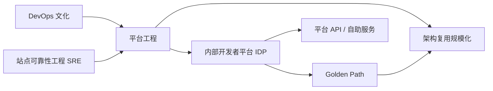

# 平台工程深化：CNCF 毕业项目与 IDP AI 集成

> **版本**: 2026-06-10
> **定位**: 新兴趋势层 —— 平台工程成熟度演进与内部开发者平台（IDP）作为架构复用载体
> **对齐标准**: CNCF Platform Engineering Maturity Model, DORA 2025, Backstage/Port/Cortex, Crossplane (Graduated 2025-11), Knative (Graduated 2025-10), Dragonfly (Graduated 2026-01)
> **状态**: ✅ 已完成

---

## 目录

- [平台工程深化：CNCF 毕业项目与 IDP AI 集成](#平台工程深化cncf-毕业项目与-idp-ai-集成)
  - [目录](#目录)
  - [1. 平台工程概述](#1-平台工程概述)
    - [1.1 定义与演进](#11-定义与演进)
    - [1.2 2026 年平台工程关键数据](#12-2026-年平台工程关键数据)
  - [2. CNCF 毕业项目分析](#2-cncf-毕业项目分析)
    - [2.1 Crossplane（2025-11 毕业）](#21-crossplane2025-11-毕业)
    - [2.2 Knative（2025-10 毕业）](#22-knative2025-10-毕业)
    - [2.3 Dragonfly（2026-01 毕业）](#23-dragonfly2026-01-毕业)
  - [3. IDP AI 集成趋势](#3-idp-ai-集成趋势)
    - [3.1 AI/ML IDP 参考架构 v0.1](#31-aiml-idp-参考架构-v01)
    - [3.2 IDP 中的 AI 功能复用模式](#32-idp-中的-ai-功能复用模式)
  - [4. 平台工程成熟度模型与复用能力](#4-平台工程成熟度模型与复用能力)
    - [4.1 CNCF 五维度成熟度模型](#41-cncf-五维度成熟度模型)
    - [4.2 成熟度与复用能力的对应关系](#42-成熟度与复用能力的对应关系)
  - [5. 平台工程作为架构复用的主要交付机制](#5-平台工程作为架构复用的主要交付机制)
    - [5.1 Golden Path 与架构复用](#51-golden-path-与架构复用)
    - [5.2 平台工程成熟度直接决定架构复用规模化能力](#52-平台工程成熟度直接决定架构复用规模化能力)
  - [6. 权威来源](#6-权威来源)
  - [7. 平台工程知识体系补强](#7-平台工程知识体系补强)
    - [7.1 定义](#71-定义)
    - [7.2 关键属性](#72-关键属性)
    - [7.3 与相关概念的关系](#73-与相关概念的关系)
    - [7.4 CNCF 五维度成熟度模型详解](#74-cncf-五维度成熟度模型详解)
    - [7.5 Golden Path](#75-golden-path)
    - [7.6 正例与反例](#76-正例与反例)
    - [7.7 权威来源与交叉引用](#77-权威来源与交叉引用)

---

## 1. 平台工程概述

### 1.1 定义与演进

平台工程（Platform Engineering）是构建和运营**内部开发者平台（Internal Developer Platform, IDP）**的学科，旨在通过提供标准化的自助服务基础设施，提升开发团队的效率和体验。

**演进历程**:

- 2010s: DevOps 运动兴起，团队自主运维
- 2020: "You Build It, You Run It" 的复杂性凸显
- 2022: 平台工程作为独立学科确立（Gartner 列入战略技术趋势）
- 2024-2025: IDP 工具链成熟（Backstage、Port、Cortex 等）
- **2026: AI 集成成为平台工程的非 negotiable 要求**

### 1.2 2026 年平台工程关键数据

| 指标 | 数值 | 来源 |
|:---|:---|:---|
| 有平台工程预算的团队 | 45.5% | CNCF / Platform Engineering Survey 2025 |
| 达到优化级的团队 | 13.1% | 同上 |
| 将 AI 视为平台工程关键的团队 | 94% | Platform Engineering Survey 2026 |
| 正在/准备托管 AI 工作负载的团队 | 75% | 同上 |
| 新兴角色：AI Platform Engineer | 新出现 | 2026 |

---

## 2. CNCF 毕业项目分析

### 2.1 Crossplane（2025-11 毕业）

**定位**: 控制平面构建框架，使用 Kubernetes API 统一管理多云基础设施。

**复用价值**:

- 将基础设施抽象为可复用的"平台 API"
- 通过 Composition 实现基础设施模板复用
- 支持多云策略的标准化表达

**与架构复用的映射**:

```
Crossplane Composition → 可复用基础设施模板
├── 定义标准化资源（数据库、缓存、存储）
├── 封装最佳实践（备份、监控、安全基线）
├── 提供自助服务（开发者通过 YAML 申请资源）
└── 实现策略即代码（成本、合规、安全策略）
```

### 2.2 Knative（2025-10 毕业）

**定位**: Kubernetes 上的无服务器和事件驱动应用层。

**复用价值**:

- 标准化 FaaS 实现（Serving + Eventing）
- 容器自动伸缩（从零到多）
- 多云无服务器工作负载的可移植性

**与功能架构复用的映射**:

```
Knative Service → 可复用函数运行时
├── 标准化函数部署接口
├── 自动伸缩和流量管理
├── 蓝绿部署和灰度发布
└── 事件驱动的函数触发
```

### 2.3 Dragonfly（2026-01 毕业）

**定位**: 云原生 P2P 镜像和文件分发系统。

**复用价值**:

- 大规模集群的容器镜像快速分发
- 提升可复用容器资产的交付效率
- 降低镜像拉取对中心仓库的依赖

---

## 3. IDP AI 集成趋势

### 3.1 AI/ML IDP 参考架构 v0.1

2026 年发布的 AI/ML IDP 参考架构定义了两大核心平面：

```
┌─────────────────────────────────────────────────────┐
│           开发者控制平面 (Developer Control Plane)   │
├─────────────────────────────────────────────────────┤
│  • AI 自助服务门户                                    │
│  • 模型目录与发现                                     │
│  • Prompt 管理与版本控制                              │
│  • AI 应用模板（Golden Path for AI）                  │
│  • AI 成本追踪与配额管理                              │
└─────────────────────────────────────────────────────┘
                           ↓
┌─────────────────────────────────────────────────────┐
│         数据与模型管理平面 (Data & Model Plane)       │
├─────────────────────────────────────────────────────┤
│  • 特征存储（Feature Store）                          │
│  • 模型注册中心（Model Registry）                     │
│  • 实验追踪（Experiment Tracking）                    │
│  • 数据血缘与质量监控                                 │
│  • 模型服务与 A/B 测试                                │
└─────────────────────────────────────────────────────┘
```

### 3.2 IDP 中的 AI 功能复用模式

| 模式 | 描述 | 复用单元 |
|:---|:---|:---|
| **Prompt 模板复用** | 标准化 Prompt 模板库 | Prompt 模板 + 变量绑定 |
| **模型服务复用** | 共享模型推理端点 | 模型 API + SLA 保证 |
| **RAG 流水线复用** | 标准化检索增强生成流水线 | 向量存储 + 检索策略 + 生成配置 |
| **AI Agent 复用** | 可复用的 Agent 模板 | Agent 定义 + 工具集 + 行为约束 |
| **评估框架复用** | 标准化 AI 系统评估工具 | 评估指标 + 测试数据集 + 报告模板 |

---

## 4. 平台工程成熟度模型与复用能力

### 4.1 CNCF 五维度成熟度模型

| 维度 | Level 1 | Level 2 | Level 3 | Level 4 | Level 5 |
|:---|:---|:---|:---|:---|:---|
| **投资** | 无预算 | 实验性预算 | 正式预算 | 战略投资 | 行业领先 |
| **采用** | 少数团队 | 多个团队 | 组织标准 | 生态扩展 | 行业影响力 |
| **接口** | 文档 | 自助门户 | 标准化 API | 可组合平台 | 生态系统 |
| **运营** | 手动 | 半自动 | 全自动 | 智能运营 | 自治 |
| **度量** | 无 | 基础度量 | 价值度量 | 业务影响 | 预测性分析 |

### 4.2 成熟度与复用能力的对应关系

| 成熟度等级 | 复用能力 | 特征 |
|:---|:---|:---|
| Level 1-2 | 文档级复用 | 团队间通过文档分享最佳实践 |
| Level 3 | 模板级复用 | Golden Path、自服务模板、标准化流水线 |
| Level 4 | API 级复用 | 平台 API、可组合服务、内部市场 |
| Level 5 | 生态级复用 | 跨组织复用、行业标准贡献、开源平台 |

---

## 5. 平台工程作为架构复用的主要交付机制

### 5.1 Golden Path 与架构复用

**Golden Path** 是平台工程中预定义的、经过验证的、受支持的技术路径。它是架构复用在组织内的**主要交付机制**。

```
Golden Path 作为复用载体
├── 技术栈选择（已验证的组合）
│   ├── 前端: React + TypeScript + Vite
│   ├── 后端: Spring Boot / Node.js + PostgreSQL
│   ├── 部署: Kubernetes + Helm + ArgoCD
│   └── 监控: Prometheus + Grafana + Jaeger
├── 安全基线（内置的最佳实践）
│   ├── 认证: OIDC + OAuth 2.1
│   ├── 加密: TLS 1.3 + 密钥管理
│   └── 审计: 结构化日志 + SIEM 集成
├── 运维标准（默认配置）
│   ├── 自动伸缩策略
│   ├── 备份和恢复流程
│   └── 灾难恢复计划
└── 合规模板（预设的检查项）
    ├── SOC2 控制映射
    ├── GDPR 数据流图
    └── 行业特定合规要求
```

### 5.2 平台工程成熟度直接决定架构复用规模化能力

```
平台工程成熟度 → 架构复用规模化能力

Level 1: 无平台 → 复用依赖个人关系和经验分享
Level 2: 实验平台 → 少数团队可复用标准化模板
Level 3: 标准平台 → 全组织可复用 Golden Path
Level 4: 可组合平台 → 团队可组合复用平台能力
Level 5: 生态系统 → 跨组织复用，贡献行业标准
```

---

## 6. 权威来源

| 来源 | URL | 核查日期 |
|:---|:---|:---|
| CNCF Crossplane | <https://www.cncf.io/projects/crossplane/> | 2026-06-10 |
| CNCF Knative | <https://www.cncf.io/projects/knative/> | 2026-06-10 |
| CNCF Dragonfly | <https://www.cncf.io/projects/dragonfly/> | 2026-06-10 |
| Platform Engineering Maturity Model | <https://platformengineering.org/blog/platform-engineering-maturity-in-2026> | 2026-06-10 |
| DORA 2025 Report | <https://cloud.google.com/blog/products/devops-sre/dora-2025-report> | 2026-06-10 |
| Backstage | <https://backstage.io/> | 2026-06-10 |

---

## 7. 平台工程知识体系补强

### 7.1 定义

根据 Wikipedia，**平台工程（Platform Engineering）**是软件工程中的一个学科，专注于设计和构建工具链、工作流以及自助式内部开发者平台（Internal Developer Platform, IDP），以提升开发效率、降低认知负荷并改善开发者体验。[[Platform engineering](https://en.wikipedia.org/wiki/Platform_engineering)] 它介于底层基础设施与上层应用开发之间，将基础设施、安全、可观测性、交付流程等能力以产品化方式交付给开发团队。

平台工程不是简单的“运维自动化”或“DevOps 改名”，而是把平台视为**产品**，由专职的平台工程师（Platform Engineer）负责其生命周期：需求调研、路线图、治理、运营和度量。

### 7.2 关键属性

| 属性 | 说明 | 复用含义 |
|:---|:---|:---|
| **目标用户** | 内部开发团队、数据工程师、AI 研究员 | 以用户旅程为中心设计复用接口 |
| **交付物** | 内部开发者平台（IDP）、Golden Path、API、模板 | 复用单元的产品化封装 |
| **核心能力** | 自助服务、抽象、自动化、治理、可观测性 | 将架构最佳实践固化为可复用能力 |
| **组织模式** | 平台团队、卓越中心（CoE）、联邦式平台 | 决定复用资产的治理范围与演进速度 |
| **成功指标** | 开发者满意度、部署频率、恢复时间、平台采用率 | 量化复用带来的工程效能提升 |

### 7.3 与相关概念的关系



- **DevOps**：强调开发与运维协作；平台工程通过产品化平台将这种协作沉淀为自助服务。
- **SRE**：关注可靠性工程；平台工程将 SLO、混沌工程、可观测性等可靠性能力内置于 Golden Path。
- **IDP**：平台工程的产物，是架构复用的主要载体。
- **Golden Path**：IDP 中的“paved road”，将可复用的技术栈、安全基线、运维标准打包为推荐路径。

### 7.4 CNCF 五维度成熟度模型详解

CNCF 平台工程成熟度模型从五个维度评估组织平台工程能力：

| 维度 | 含义 | Level 1（起步） | Level 3（标准） | Level 5（领先） |
|:---|:---|:---|:---|:---|
| **Investment（投资）** | 预算与资源投入 | 无专门预算 | 正式预算与专职团队 | 行业领先投资，平台即战略 |
| **Adoption（采用）** | 平台在组织内的覆盖度 | 少数团队试点 | 组织标准，广泛采用 | 跨组织生态，行业影响力 |
| **Interfaces（接口）** | 开发者与平台交互方式 | 文档与工单 | 标准化 API 与自助门户 | 可组合平台与生态系统 |
| **Operations（运营）** | 平台的运行与治理模式 | 手动运维 | 全自动运营 | 智能/自治运营 |
| **Measurement（度量）** | 平台价值衡量 | 无度量 | 价值度量与业务影响 | 预测性分析与持续优化 |

这五维度相互依赖：**接口标准化**是复用规模化前提，**度量**驱动持续优化，**投资与采用**共同决定平台生态成熟度。

### 7.5 Golden Path

**Golden Path** 是平台工程中经过验证、受支持、可自助使用的技术路径。它不是唯一路径，而是“默认的、安全的、快速的道路”。其属性如下：

| 属性 | 说明 | 示例 |
|:---|:---|:---|
| **范围** | 覆盖应用全生命周期 | 从脚手架到生产可观测 |
| **技术栈** | 已验证的组合 | React + Spring Boot + PostgreSQL + Kubernetes |
| **安全基线** | 内置合规与控制 | OIDC、TLS 1.3、密钥管理、漏洞扫描 |
| **运维契约** | 默认 SLA 与可观测性 | 自动伸缩、SLO、日志/指标/链路追踪 |
| **治理边界** | 允许偏离，但需审批 | 例外流程、技术雷达审查 |

### 7.6 正例与反例

**正例**：某金融科技公司建立 IDP，基于 Backstage 提供“AI 微服务 Golden Path”，包含 LangChain 模板、向量数据库自助申请、模型服务注册、成本配额管理。结果新 AI 服务上线时间从 6 周降至 3 天，80% 基础设施配置通过复用平台模板完成。

**反例**：某企业在没有平台治理的情况下，让各业务团队分别采购 CI/CD、Secret Management、可观测性工具，形成“影子平台（Shadow Platforms）”。虽然短期满足团队偏好，但导致工具碎片化、合规成本激增、架构资产无法跨团队复用，最终认知负荷不降反升。

### 7.7 权威来源与交叉引用

| 来源 | URL | 说明 |
|:---|:---|:---|
| Wikipedia - Platform engineering | <https://en.wikipedia.org/wiki/Platform_engineering> | 定义与学科背景 |
| CNCF Platform Engineering Maturity Model | <https://platformengineering.org/> | 五维度成熟度模型 |
| Gartner Top Strategic Technology Trends | <https://www.gartner.com/> | 平台工程进入战略技术趋势 |
| Backstage | <https://backstage.io/> | 开源 IDP 框架 |
| platformengineering.org | <https://platformengineering.org/> | 社区与最佳实践 |

**交叉引用**：

- 平台成熟度模型详见 [`platform-maturity-model.md`](./platform-maturity-model.md)
- IDP 复用模式详见 [`idp-reuse.md`](./idp-reuse.md)
- CNCF 毕业项目分析详见 [`platform-engineering-cncf-2026.md`](./platform-engineering-cncf-2026.md)
- 治理与标准化参见 [`../../06-cross-layer-governance/`](../06-cross-layer-governance/)
