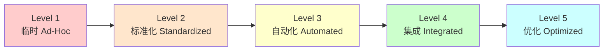
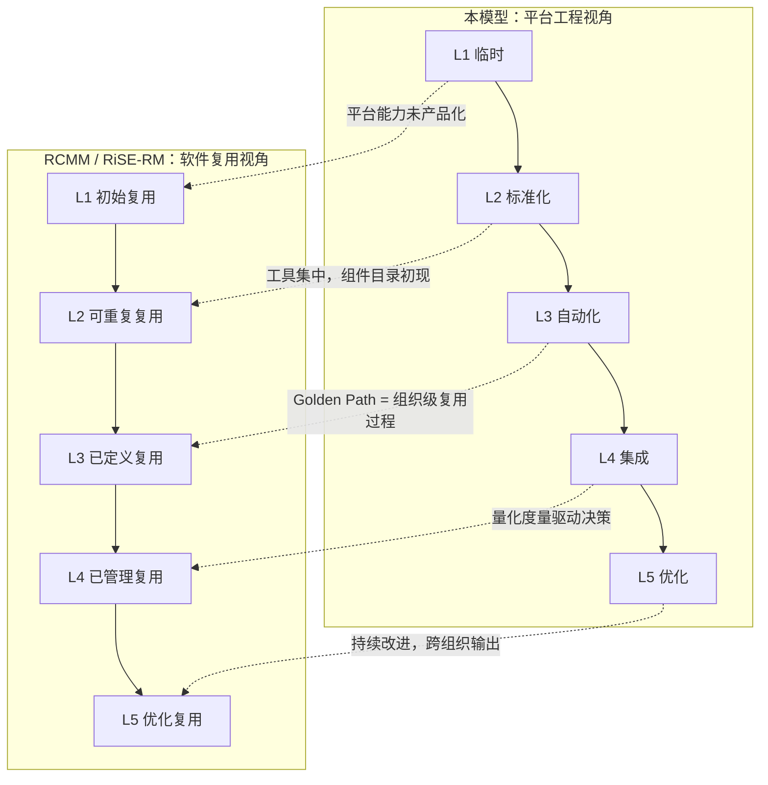

# 平台工程成熟度模型（Platform Engineering Maturity Model）

> **版本**: 2026-06-06
> **权威来源**: CNCF TAG App Delivery "Platform Engineering Maturity Model" (2024); Gartner "Market Guide for Internal Developer Portals 2026"; Humanitec "State of IDP 2025"; DORA Report 2025; Team Topologies (Skelton & Pais, 2019/2022)
> **定位**: 将平台工程演进路径映射为可度量的五级模型，与跨层治理成熟度框架及云原生架构复用矩阵对齐

---

## 1. 模型总览

平台工程成熟度模型描述组织从**临时脚本**到**认知负荷消除**的演进路径。2026 年数据显示：45.5% 的团队拥有 dedicated platform budget，但仅 13.1% 达到 Optimized 阶段[^1]。大多数企业聚集在 Automated → Integrated 过渡期——架构与组织复杂度在此达到峰值。



---

## 2. 五级成熟度详解

### Level 1: 临时 (Ad-Hoc) — "个人英雄主义"

| 维度 | 内容 |
|------|------|
| **特征** | 无专职平台团队；资深工程师非正式承担基础设施；每个团队有独立的部署脚本、CI 配置和环境管理方式；新服务创建依赖口头传承和过时的 Confluence 页面 |
| **关键指标** | 新开发者入职时间 > 3 天；服务创建无标准化模板；部署失败率 > 20%；无平台预算 |
| **技术栈** | 散落的 Shell 脚本、个人 Makefile、团队自管 Jenkins 实例、手动云控制台操作 |
| **组织设计** | 无平台团队；DevOps 责任分散在各产品团队；"你构建，你运行"但缺乏共享抽象 |
| **常见陷阱** | ❌ 以为购买商业工具就自动升级成熟度；❌ 忽视文档债务；❌ 将运维支持等同于平台工程 |

> **诊断信号**："How do I deploy X?" 的答案是 "Ask Senior Engineer Y"。

---

### Level 2: 标准化 (Standardized) — "中心化工具集"

| 维度 | 内容 |
|------|------|
| **特征** | 出现小型平台团队（2–4 FTE）；工具开始集中管理；共享 CI/CD 模板（GitHub Actions / GitLab CI）；Terraform / CloudFormation 模板出现但未强制；集中日志归集 |
| **关键指标** | 平台团队响应工单 < 2 天；标准模板使用率 30–50%；环境一致性评分（手动审计）60% |
| **技术栈** | GitHub Actions / GitLab CI、Terraform Modules（初版）、Helm Charts（初版）、集中 Prometheus / Loki |
| **组织设计** | 专职平台团队成立，但主要角色是"工具管理员"和"工单响应者"；与产品团队关系为服务提供者而非合作伙伴 |
| **常见陷阱** | ❌ 平台团队成为瓶颈（所有请求流经平台团队）；❌ 模板灵活性不足导致团队绕过标准；❌ 缺乏采用度量，无法证明 ROI |

> **跃迁关键**：从"我们提供工具"转向"我们提供 paved road"。

---

### Level 3: 自动化 (Automated) — "自助铺好的路"

| 维度 | 内容 |
|------|------|
| **特征** | 自助服务能力覆盖常见工作流；Golden Path 模板存在且文档化；开发者可独立创建服务、申请数据库、配置流水线；Backstage / Port 等门户上线；新服务创建时间 < 2 小时 |
| **关键指标** | Golden Path 采用率 > 50%；自助服务完成率 > 70%；开发者入职时间 < 1 天；平台工单量下降 40% |
| **技术栈** | Backstage / Port / Cortex、Crossplane / Terraform Self-Service、ArgoCD / Flux (GitOps)、Policy-as-Code (OPA / Kyverno)、DORA 指标采集 |
| **组织设计** | 平台团队引入产品经理角色；开始定期用户调研；建立内部社区（如 Platform Office Hours）；采用"最薄可行平台 (TVP)"理念[^2] |
| **常见陷阱** | ❌ Golden Path 过于僵化，无法适应边缘需求；❌ 门户沦为纯目录（Catalog），缺乏操作能力；❌ 安全与合规仍依赖人工审查 |

**Golden Path 示例（Level 3 典型输出）**[^3]：

```yaml
# platform create service my-api
apiVersion: platform.company.com/v1
kind: Service
metadata:
  name: my-api
  team: payments
spec:
  runtime: nodejs-20
  replicas:
    min: 2
    max: 20
  resources:
    preset: standard  # 映射到组织的 CPU/memory 标准
  dependencies:
    - type: postgres
      name: my-api-db
      tier: standard
    - type: redis
      name: my-api-cache
      size: small
  observability:
    dashboards: true
    alerts: standard
  compliance:
    soc2: enforced
    encryption: at-rest+in-transit
```

---

### Level 4: 集成 (Integrated) — "产品化平台"

| 维度 | 内容 |
|------|------|
| **特征** | IDP 成为统一生态系统；治理下沉（shift-left）：安全、成本、合规检查嵌入开发工作流；每个 PR 自动创建预览环境（Ephemeral Environment）；平台作为内部产品管理：路线图、SLA、用户研究 |
| **关键指标** | Golden Path 采用率 > 70%；PR 预览环境覆盖率 > 80%；安全漏洞在 CI 阶段拦截率 > 85%；开发者 NPS > 30；平台自身 SLO > 99.5% |
| **技术栈** | 开发者门户 + Operator 模式（Kubernetes CRDs）、FinOps 成本归因（OpenCost / Vantage）、混沌工程（Litmus / Gremlin）、AI 辅助代码审查（安全漏洞预检） |
| **组织设计** | 平台团队 = 内部产品团队；有专职 PM、UX 研究员、Developer Advocate；平台能力按内部 chargeback 计价；跨职能平台治理委员会成立 |
| **常见陷阱** | ❌ 平台自身成为单点故障（平台宕机 = 全部阻塞）；❌ 过度工程化平台抽象；❌ 忽视平台团队自身的认知负荷 |

**Level 4 工作流示例**[^4]：

```
git push origin feature/new-checkout-flow

# 平台自动执行：
# 1. 构建容器镜像
# 2. 部署：checkout-service + cart-service + payment-service
# 3. 在种子数据快照上运行数据库迁移
# 4. 向 PR 发布预览 URL: https://pr-1234.preview.company.com
# 5. 运行冒烟测试，将结果发布到 PR
# 6. 设计师直接在预览环境验证，在 PR 中留言
```

---

### Level 5: 优化 (Optimized) — "认知负荷消除"

| 维度 | 内容 |
|------|------|
| **特征** | 平台吸收绝大多数 toil，开发者无需思考基础设施；AI 原生运维：平台观察生产行为并主动建议优化；成本/安全/合规成为自动反馈循环；新 hire 可在入职首日部署到生产环境 |
| **关键指标** | 开发者基础设施耗时 < 5%；变更失败率 < 1%；部署频率 > 每日多次/开发者；平台团队以开发者 NPS 为核心 KPI；成本优化建议自动采纳率 > 60% |
| **技术栈** | AI 驱动的 Right-sizing 建议、自动 Runbook 生成、预测性告警（因果推断）、自修复系统（自动回滚 + 自动扩缩容）、内部 LLM 辅助平台交互 |
| **组织设计** | 平台团队与产品团队边界模糊（嵌入式平台工程师）；平台能力输出到开源社区；组织设立 "Platform CTO" 或等效角色；平台成为招聘竞争优势 |
| **常见陷阱** | ❌ 将 "AI 写 YAML" 误认为 AI 原生平台（真正的价值在主动建议与自修复）；❌ 忽视长尾边缘案例的自动化；❌ 平台团队脱离一线需求 |

**AI 原生平台示例**[^5]：

> "Your service is using 40% of its memory limit. I've created a PR to reduce the limit and save $380/month. Review?"
>
> "Your error rate spiked 3× when dependency `user-service` deployed v2.1.4. Here's a rollback option."
>
> "Based on your traffic patterns, autoscaling would trigger 20% more efficiently with these settings."

---

## 3. 成熟度演进总表

| 维度 | Level 1 临时 | Level 2 标准化 | Level 3 自动化 | Level 4 集成 | Level 5 优化 |
|------|:-----------:|:-------------:|:-------------:|:-----------:|:-----------:|
| **平台团队** | 无 | 2–4 FTE 工具管理 | 4–8 FTE + PM | 8–15 FTE 产品团队 | 15+ FTE + 社区运营 |
| **服务创建时间** | 数天 | 1–2 天 | < 2 小时 | < 15 分钟 | < 5 分钟 |
| **Golden Path 采用率** | 0% | 10–30% | 50–70% | 70–85% | > 85% |
| **部署频率** | 每周 | 每周多次 | 每日 | 每日多次 | 持续 |
| **变更失败率** | > 20% | 15–20% | 10–15% | 5–10% | < 5% |
| **安全拦截阶段** | 生产后 | 预发布 | CI 阶段 | 编码阶段 | 设计阶段（默认安全）|
| **成本可见性** | 无 | 月度账单 | 团队级归因 | PR 级成本反馈 | 自动优化建议 |
| **开发者 NPS** | N/A | 0–10 | 10–25 | 25–40 | > 40 |

---

## 4. 与跨层治理成熟度模型的交叉引用

本模型与 `struct/06-cross-layer-governance/03-maturity-models/reuse-maturity-models-rcmm-rise.md` 中的 RCMM / RiSE-RM 形成垂直映射：



| 平台工程级别 | 对应 RCMM 级别 | 映射逻辑 |
|:-----------:|:-------------:|---------|
| Level 1 | RCMM L1 (初始复用) | 复用偶然发生，依赖个人 |
| Level 2 | RCMM L2 (可重复复用) | 项目内识别可复用组件，基本版本控制 |
| Level 3 | RCMM L3 (已定义复用) | 组织级复用过程标准化，Golden Path = 组件库 |
| Level 4 | RCMM L4 (已管理复用) | 量化复用指标，投资回报跟踪 |
| Level 5 | RCMM L5 (优化复用) | 持续改进复用过程，创新技术引入 |

**关键差异**：RCMM 关注**软件组件复用**的组织过程，而平台工程成熟度模型关注**基础设施能力复用**的产品化路径。两者在 Level 3 之后高度同构，因为成熟的平台工程本质上就是将基础设施复用过程制度化。

---

## 5. 与云原生架构复用矩阵的对齐

本模型与 `struct/03-application-architecture-reuse/05-cloud-native-patterns/reusability-matrix-2026.md` 中的架构模式选择形成互补：

| 平台成熟度 | 推荐架构模式 | 理由 |
|:---------:|-------------|------|
| Level 1–2 | 模块化单体 (Modulith) | 团队自治度低，单体减少协调成本 |
| Level 3 | 模块化宏服务 | 平台开始提供标准化部署能力，域级拆分可行 |
| Level 4 | 微服务 + 服务网格 + EDA | 平台提供统一通信、安全、可观测性基座 |
| Level 5 | Serverless / WASM 组件 + 自服务平台 | 平台自动化程度足以支持极高部署独立性 |

> **定理 PE.2** (平台-架构协同): 组织选择的架构模式不应超越其平台成熟度。在 Level 2 组织强行推行微服务，将导致每个团队重复解决相同的基础设施问题，产生 "你构建，你运行" 的规模化灾难。

---

## 6. 实施路线图与检查清单

### 6.1 按级别的"本季度行动"

| 当前级别 | 首要行动 | 预期时间 | 成功信号 |
|:-------:|---------|:-------:|---------|
| Level 1 | 选择 1 个最痛的部署流水线，标准化为共享模板 | 2–4 周 | 新服务使用该模板 |
| Level 2 | 为 Top 3 痛点构建自助服务（数据库申请、证书配置、监控开通） | 1–3 月 | 平台工单量下降 |
| Level 3 | 构建 PR 预览环境，从最高流量服务开始 | 2–4 月 | QA 在 merge 前完成测试 |
| Level 4 | 集成成本归因到 PR 级别；AI 辅助安全审查 | 3–6 月 | 开发者可在 PR 中看到成本影响 |
| Level 5 | 引入预测性告警和自动优化建议 | 持续 | 新 hire 首日部署 |

### 6.2 成熟度评估问卷（简化版）

**战略与治理** (权重 15%)

- [ ] 是否有 dedicated platform budget？
- [ ] 平台团队是否有产品经理？
- [ ] 是否有平台能力路线图（6–12 个月）？

**自助服务能力** (权重 25%)

- [ ] 开发者能否在 1 小时内创建新服务？
- [ ] 基础设施申请是否无需人工审批？
- [ ] 是否有统一的开发者门户？

**度量与反馈** (权重 20%)

- [ ] 是否追踪 DORA 指标？
- [ ] 是否定期调查开发者满意度？
- [ ] 平台团队 KPI 是否与开发者体验挂钩？

**安全与合规** (权重 20%)

- [ ] 安全策略是否以 Policy-as-Code 执行？
- [ ] 合规检查是否在 CI 阶段自动完成？
- [ ] 是否有 secrets 自动轮换机制？

**AI 与自动化** (权重 20%)

- [ ] 是否有 AI 辅助的代码审查？
- [ ] 是否有自动成本优化建议？
- [ ] 告警系统是否提供根因分析？

---

## 7. 2026 关键趋势对成熟度模型的影响

### 7.1 AI 加速跃迁

Gartner 预测：到 2026 年底，80% 的大型软件工程组织将拥有平台团队[^6]。AI 正在压缩级别跃迁的时间：

- **Level 3 → Level 4**：AI 辅助的 Golden Path 生成使模板库建设速度提升 3×
- **Level 4 → Level 5**：LLM 驱动的 Runbook 生成和根因分析降低认知负荷

### 7.2 IDP 工具格局 2026

| 工具 | 类别 | 适用规模 | 与成熟度对应 |
|------|------|---------|:-----------:|
| Backstage | 门户 / 目录 | 1000+ 工程师 | Level 3–5 |
| Port | 低代码门户 | 200–2000 工程师 | Level 3–4 |
| Humanitec | 编排平台 | 中型到大型 | Level 3–5 |
| Kratix | 可组合 Promise | 大型 | Level 4–5 |
| Score | 工作负载规范 | 通用 | Level 3+ |

### 7.3 认知负荷作为正式指标

Google DORA 2025 Report 首次将**认知负荷 (Cognitive Load)** 作为正式工程绩效指标[^7]。数据显示：高认知负荷团队的交付频率约为低认知负荷团队的一半。这一发现使 Level 5 的"认知负荷消除"目标获得了量化支撑。

---

## 参考索引

[^1]: CNCF TAG App Delivery, "Platform Engineering Maturity Model" (2024); Gart Solutions, "Enterprise platform engineering in 2026" (2026-04-27).

[^2]: M. Skelton & M. Pais, *Team Topologies*, 2nd ed., IT Revolution Press, 2022.  // TVP 概念来源

[^3]: DevStarSJ, "Platform Engineering in 2026: The Internal Developer Platform Maturity Model" (2026-03-09).

[^4]: Fortem.dev, "Internal Developer Platform Guide" (2026-04-29); Humanitec, "State of IDP 2025".

[^5]: HubKub, "Platform Engineering 2026: Why 80% of Orgs Are Adopting It" (2026-04-02); KubernetesGuru, "Internal Developer Platform Tools 2026" (2026-04-24).

[^6]: Gartner, "Market Guide for Internal Developer Portals 2026"; TechStoriess, "Platform Engineering vs DevOps: What Wins in 2026?" (2026-05-14).

[^7]: Google / DORA, "2025 State of DevOps Report" — 认知负荷作为正式工程绩效指标。

---

> **关联主题**:
>
> - `struct/06-cross-layer-governance/03-maturity-models/reuse-maturity-models-rcmm-rise.md` — RCMM / RiSE-RM 软件复用成熟度
> - `struct/03-application-architecture-reuse/05-cloud-native-patterns/reusability-matrix-2026.md` — 云原生架构模式复用性矩阵
> - `struct/13-emerging-trends/01-platform-engineering/idp-reuse.md` — IDP 复用金字塔与度量
> - `struct/13-emerging-trends/01-platform-engineering/platform-engineering-cncf-2026.md` — CNCF 平台工程 2026 全景
