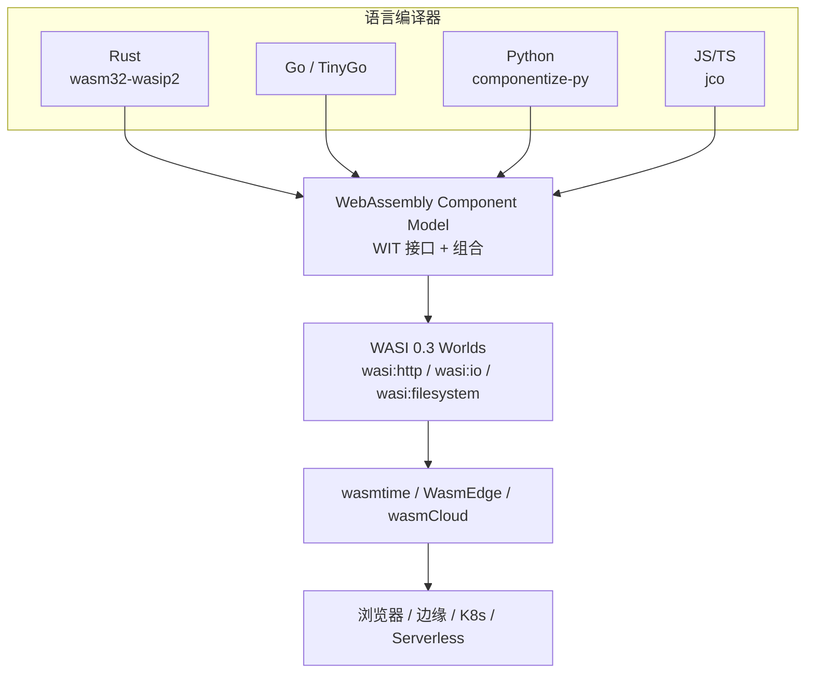

# WebAssembly 组件模型与 WASI 复用生态
>
> 版本: 2026-06-06
> 对齐来源: Bytecode Alliance、W3C WebAssembly CG、wasmCloud CNCF、WASI 路线图、Platform.Uno 2026 状态报告

## 1. 技术里程碑（2025–2026）

### 1.1 标准化完成（Phase 5）

| 特性 | 状态 | 意义 |
|-----|------|------|
| Exception Handling (exnref) | 已完成 | 所有主流浏览器支持 |
| JavaScript String Builtins | 已完成 | 跨语言字符串互操作 |
| Memory64 | 已完成 | 突破 4GB 内存限制（浏览器上限 16GB）|

### 1.2 进展中的关键提案

| 提案 | 阶段 | 说明 |
|-----|------|------|
| **Stack Switching** | Phase 3 | 允许多执行栈并发管理，支持 async/await、协程、生成器 |
| **Wide Arithmetic** | Phase 3 | 128-bit 整数运算加速（当前慢 2–7 倍）|
| **WebAssembly CSP** | 推进中 | `wasm-unsafe-eval` 关键词标准化，浏览器 CSP 支持 |

### 1.3 WebAssembly 3.0

- 2025 年宣布，将多项新特性纳入主规范
- 浏览器采用率：Chrome Platform Status 显示 5.5% 网站使用 Wasm（持续增长）
- 前 25 种编程语言中几乎全部支持 Wasm 编译目标

## 2. WASI 演进路线图

### 2.1 WASI 0.2（2024 早期）

- 引入 **Component Model** 支持多模块链接
- 定义 **Worlds** 概念：模块可访问的标准接口集合
- 支持 `wasi-http` 等高级世界

### 2.2 WASI 0.3（Preview 已发布，Wasmtime 37+ 默认支持）

> **最新实践详见**：[`wasm-wasi-03-boundaries.md`](./wasm-wasi-03-boundaries.md)

- **原生异步支持**：`stream<T,E>` / `future<T,E>` 类型，Component Model 内置 async/await
- **状态**：WASI 0.3 Preview 已于 2025 年发布，Wasmtime 37+ 默认启用
- **效果**：HTTP、文件系统、时钟等世界全面异步化
- **目标场景**：
  - 边缘设备
  - 异步与事件驱动架构
  - Serverless 环境
  - MCP / A2A Agent 工具沙箱

### 2.3 WASI 1.0（目标 2026 末发布）

- WASI 的完整稳定版
- WASI 0.2 将进入维护模式，0.3 成为推荐主线
- Component Model 规范有望在 1.0 后进入下一阶段

## 3. 组件模型（Component Model）

### 3.1 核心概念

组件模型是 WebAssembly 的**模块化与互操作层**：

- **语言无关**：不同语言编译的模块可通过标准接口互操作
- **接口类型（Interface Types, WIT）**：定义组件间契约
- **组合（Composition）**：将多个小组件组合为复杂应用

### 3.2 复用架构

```text
Application Component
├── import "wasi:cli/stdout"
├── import "wasi:http/incoming-handler"
├── import "my:domain/payment-service"
└── export "my:domain/order-api"

Payment Service Component
├── import "wasi:io/streams"
└── export "my:domain/payment-service"
```

### 3.3 引用类型（Reference Types）

- 组件可暴露有意义的 API，开发者无需理解 Wasm 内部机制
- 大幅降低使用门槛，推动跨语言库复用

## 4. wasmCloud（CNCF 项目）

### 4.1 定位

> "wasmCloud is an open source CNCF project that enables teams to build, manage, and scale polyglot Wasm apps across any cloud, K8s, or edge."

### 4.2 关键版本

| 版本 | 时间 | 特性 |
|-----|------|------|
| 1.0 | 2024-05 | 稳定运行时、组件支持 |
| 2.0 | 2026-03-23 | 下一代运行时、性能提升 |
| WASI P3 | 2026-04 | 异步组件支持 |

### 4.3 核心能力

- **多语言应用**：Go、Rust、Python、C 等编译为 Wasm 组件，统一部署
- **分布式 ML/AI 工作负载**：模型推理组件在边缘/云端弹性调度
- **SPIFFE 工作负载身份**：2025-03 采用 SPIFFE 实现 WebAssembly 负载身份安全
- **平台工程集成**：Platform Harness 模式，将 Wasm 作为平台能力交付

### 4.4 企业采用

- Adobe：将 C 代码编译为 WebAssembly 组件运行于 wasmCloud
- 各类云原生/边缘场景的渐进采用

## 5. 语言与框架支持（2026）

| 语言 | Wasm 支持状态 | 组件模型支持 |
|-----|-------------|-------------|
| Rust | 原生一级支持 | `wasm32-wasip2` 目标 |
| Go | TinyGo + 官方支持 | wasmCloud Go SDK |
| Python | Componentize-py | 实验性 |
| C/C++ | Emscripten / WASI SDK | 成熟 |
| .NET | .NET 10 | 与 Uno Platform 协作多线程 |
| Kotlin | Beta Wasm 编译器 | Compose Multiplatform |
| JavaScript/TypeScript | JCO 工具链 | 组件封装与调用 |

## 6. 复用模式

### 6.1 跨语言库复用

- **场景**：Rust 编写的加密库被 Go、Python、JS 应用调用
- **机制**：WIT 接口定义 + 组件组合
- **优势**：无需 FFI 绑定，沙箱隔离保证安全

### 6.2 边缘-云协同复用

```text
Cloud
├── 大型推理模型（LLM）
└── 训练与模型更新

Edge
├── 小型 Wasm 组件（预处理/过滤）
├── TinyML 推理组件
└── 本地决策逻辑
```

### 6.3 平台能力复用

| 能力 | Wasm 组件形式 | 运行时 |
|-----|-------------|--------|
| HTTP 网关 | `wasi:http` 处理器 | wasmCloud / WasmEdge |
| 密钥管理 | `wasi:keyvalue` | 任何 WASI 运行时 |
| 消息处理 | `wasi:messaging` | NATS + wasmCloud |
| AI 推理 | ONNX Runtime Wasm | wasmCloud ML 组件 |

## 7. 调试与工具链成熟

- **DWARF 支持**：LLDB 调试器支持独立运行时调试
- **VS Code 集成**：部分 IDE 集成浏览器调试，无需 DevTools
- **.NET 性能分析**：Wasm 性能剖析与诊断数据提取

## 8. 参考索引

- W3C WebAssembly Community Group: [webassembly.org](https://webassembly.org)
- Bytecode Alliance: [bytecodealliance.org](https://bytecodealliance.org)
- wasmCloud: [wasmcloud.com](https://wasmcloud.com)
- WasmEdge: [wasmedge.org](https://wasmedge.org)
- WASI Roadmap: [github.com/WebAssembly/WASI](https://github.com/WebAssembly/WASI)
- Platform.Uno: "The State of WebAssembly – 2025 and 2026" (2026-01-27)
- InfoQ / The New Stack: "WASI 1.0: WebAssembly 可能在 2026 悄然普及" (2026-01)


---

## 9. WASM Component Model 知识体系补强

### 9.1 定义与核心属性

**WebAssembly Component Model** 是 WebAssembly 的模块化和互操作层，它将单个 Wasm 模块提升为**组件（Component）**：一种具有显式、类型化导入（import）与导出（export）接口的可组合单元。组件之间通过 **WebAssembly Interface Types（WIT）** 定义契约，实现跨语言、跨运行时的二进制复用。[[WebAssembly](https://en.wikipedia.org/wiki/WebAssembly)]

| 属性 | 说明 | 复用价值 |
|:---|:---|:---|
| **语言无关** | Rust、Go、Python、C#、JS 等均可编译为组件 | 打破语言孤岛 |
| **接口类型化** | WIT 强类型接口，编译期与运行期均可校验 | 明确契约，降低集成风险 |
| **沙箱隔离** | 基于 capability-based security，默认最小权限 | 安全复用不可信第三方组件 |
| **可组合性** | 多个小组件可组合为复杂应用 | 支持平台能力模块化交付 |
| **可移植性** | 一次编译，可在浏览器、边缘、云原生运行时运行 | 资产跨环境复用 |

### 9.2 WIT：组件的接口契约语言

**WIT（WebAssembly Interface Types）**是 Component Model 的接口定义语言（IDL）。一个 WIT 文件描述包（package）、接口（interface）和世界（world）：

```wit
package my:domain;

interface image-processor {
    resize: func(input: list<u8>, width: u32, height: u32) -> result<list<u8>, string>;
    detect-format: func(input: list<u8>) -> string;
}

world image-api {
    export image-processor;
    import wasi:io/streams@0.2.0;
}
```

- **package**：命名空间与版本管理单元。
- **interface**：一组类型化函数，可被 import 或 export。
- **world**：组件可见能力集合，定义可使用的标准接口与暴露的自定义接口。

### 9.3 与 WASI 0.3 的关系

WASI（WebAssembly System Interface）是组件访问操作系统能力的标准接口集合。WASI 0.3 基于 Component Model 构建，原生引入 `stream<T,E>` / `future<T,E>` 类型以支持异步 I/O。二者关系如下：



- **Component Model** 提供“如何定义和组合接口”的元模型；
- **WASI 0.3** 是在该元模型上定义的“世界”，提供 HTTP、文件系统、时钟等系统能力；
- **运行时**实现 WASI 0.3 世界，使组件可在不同宿主环境中复用。

### 9.4 跨语言复用示例

**场景**：用 Rust 实现图像处理组件，被 Node.js、Python 和 Go 复用。

**步骤**：

1. 定义 `my:domain/image-processor` WIT 接口（见 9.2）。
2. 用 Rust 实现并导出：

```rust
wit_bindgen::generate!({ world: "image-api", exports: { "my:domain/image-processor": ImageProcessor } });

struct ImageProcessor;
impl exports::my::domain::image_processor::Guest for ImageProcessor {
    fn resize(input: Vec<u8>, w: u32, h: u32) -> Result<Vec<u8>, String> { /* ... */ }
    fn detect_format(input: Vec<u8>) -> String { /* ... */ }
}
```

1. 编译为 `image-processor.wasm` 组件。
2. 消费方绑定：
   - **Node.js**：使用 `@bytecodealliance/jco` 生成 TypeScript 存根。
   - **Python**：使用 `componentize-py` 生成 Python 绑定。
   - **Go**：使用 TinyGo + `wit-bindgen-go` 生成客户端。

结果：同一二进制组件在三种语言运行时中复用，无需手写 FFI。

### 9.5 正例与反例

**正例**：某电商平台将图片压缩、格式转换、水印生成实现为独立的 WASM 组件，通过 WIT 接口暴露给 Node.js 前端、Python 批处理服务以及 Go 边缘网关复用，组件更新时所有消费方自动获得一致行为。

**反例**：某团队将大量阻塞式文件 I/O 逻辑直接迁移到 WASM，未使用 WASI 0.3 的异步 `stream`/`future` 能力，也未通过 WIT 暴露接口，导致运行时阻塞、延迟飙升，且难以跨语言调用，最终回退为原生动态库。

### 9.6 权威来源与交叉引用

| 来源 | URL |
|:---|:---|
| Wikipedia - WebAssembly | <https://en.wikipedia.org/wiki/WebAssembly> |
| Wikipedia - WebAssembly System Interface | <https://en.wikipedia.org/wiki/WebAssembly_System_Interface> |
| Component Model 官方文档 | <https://component-model.bytecodealliance.org> |
| WASI Roadmap | <https://github.com/WebAssembly/WASI> |
| Bytecode Alliance | <https://bytecodealliance.org> |
| wasmCloud | <https://wasmcloud.com> |

**交叉引用**：

- WASI 0.3 边界分析详见 [`wasm-wasi-03-boundaries.md`](./wasm-wasi-03-boundaries.md)
- WASM 复用决策树详见 [`wasm-reuse-decision-tree.md`](./wasm-reuse-decision-tree.md)
- Rust/WASM 形式化验证详见 [`../05-rust-ecosystem/rust-wasm-formal-verification.md`](../05-rust-ecosystem/rust-wasm-formal-verification.md)

---

## 补充说明：WebAssembly 组件模型与 WASI 复用生态

## 示例

**示例**：使用 Rust 实现图像处理组件，编译为 WIT 接口的 WASM 组件，在 Node.js、Python 与边缘运行时中复用同一二进制。

## 反例

**反例**：将 I/O 密集型服务盲目迁移到 WASM，WASI 能力不支持所需系统调用，性能与可维护性反而下降。

## 权威来源

> **权威来源**:
>
> - [WebAssembly Component Model](https://component-model.bytecodealliance.org)
> - [WASI Preview 2](https://wasi.dev)
> - 核查日期：2026-07-07

## 分析

**分析**：WASM 组件模型提供了真正的语言无关二进制复用，但生态与工具链仍在快速演进。
