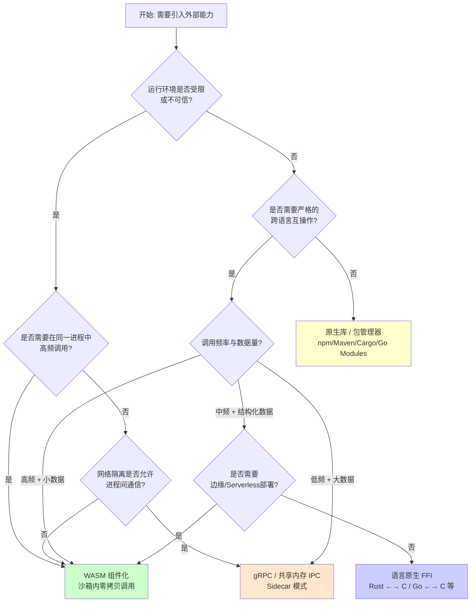
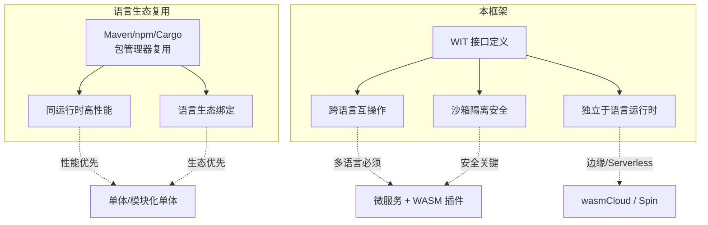

# WebAssembly Component Model 复用决策树

> **版本**: 2026-06-06
> **权威来源**: W3C WebAssembly CG "WebAssembly 3.0" (2025-09); Bytecode Alliance "Component Model" & WASI Roadmap; wasmCloud 2.0 (2026-03); Platform.Uno "State of WebAssembly 2025 and 2026" (2026-01)
> **定位**: 为架构师提供何时选择 WASM 组件化、何时坚持原生库或 gRPC 服务的结构化决策框架

---

## 1. 核心问题：何时选择 WASM 组件化？

WebAssembly Component Model 3.0（2025-12 发布）与 WASI 0.3（2026-02 发布）使 WASM 从浏览器实验走向云原生核心。但并非所有复用场景都适合 WASM。本决策树提供系统化的选型框架。

---

## 2. 决策树：WASM vs 原生库 vs gRPC 服务

### 2.1 顶层决策流程



### 2.2 场景速查表

| 场景 | 推荐方案 | 理由 |
|------|---------|------|
| **插件系统**（如 VS Code 扩展、数据库 UDF） | ✅ WASM 组件 | 沙箱隔离不可信代码；宿主控制资源配额 |
| **加密/压缩算法库跨语言复用** | ✅ WASM 组件 | 一次编译，Rust/C 实现 → 多语言调用；无 FFI 绑定成本 |
| **微服务核心业务逻辑** | ⚠️ gRPC 服务 | WASM 尚未完全成熟于通用后端微服务（线程支持待完善） |
| **AI 推理函数（边缘/Serverless）** | ✅ WASM 组件 | 冷启动 < 1ms；WASI 0.3 原生 async 支持并发推理 |
| **同语言项目内部工具函数** | ❌ 原生库 | 引入 WASM 边界调用开销无意义 |
| **需要直接硬件访问（GPU/TPU）** | ❌ 原生库 / gRPC | WASM 的 capability-based 安全模型限制直接硬件访问 |
| **遗留系统集成（大型机/专用协议）** | ❌ 传统适配器 | WASM 生态尚未覆盖此类 niche 协议 |

---

## 3. WIT 接口定义示例

WIT（WebAssembly Interface Types）是 Component Model 的接口定义语言。它桥接不同语言的类型系统，成为跨语言复用的**契约层**。

### 3.1 基础接口：计算器服务

```wit
// calculator.wit
package example:calc@1.0.0;

interface operations {
    /// 执行二元数学运算
    enum op {
        add,
        subtract,
        multiply,
        divide,
    }

    /// 计算结果，包含溢出保护
    variant calc-result {
        success(f64),
        error(calc-error),
    }

    record calc-error {
        code: u32,
        message: string,
    }

    /// 主计算函数
    evaluate: func(a: f64, b: f64, operation: op) -> calc-result;
}

/// 导出接口，供宿主或其他组件调用
world calculator {
    export operations;
}

/// 导入标准输出，用于调试
world calculator-with-logging {
    import wasi:cli/stdout@0.2.0;
    export operations;
}
```

### 3.2 跨组件组合：订单处理流水线

```wit
// ecommerce.wit
package ecommerce:order-pipeline@2.1.0;

/// 支付服务接口（由支付团队维护）
interface payment-service {
    record payment-request {
        order-id: string,
        amount: f64,
        currency: string,
        method: payment-method,
    }

    variant payment-method {
        credit-card(card-info),
        digital-wallet(wallet-type),
    }

    record card-info {
        token: string,
        expiry-month: u8,
        expiry-year: u16,
    }

    enum wallet-type {
        paypal,
        alipay,
        stripe,
    }

    record payment-result {
        transaction-id: string,
        status: payment-status,
        timestamp: u64,
    }

    enum payment-status {
        approved,
        declined,
        pending,
    }

    process-payment: func(req: payment-request) -> result<payment-result, string>;
}

/// 库存服务接口（由仓储团队维护）
interface inventory-service {
    record inventory-check {
        sku: string,
        quantity: u32,
        warehouse-id: string,
    }

    check-availability: func(items: list<inventory-check>) -> result<list<bool>, string>;
    reserve-items: func(items: list<inventory-check>) -> result<string, string>;
}

/// 订单编排世界：组合支付与库存能力
world order-orchestrator {
    import ecommerce:payment-service;
    import ecommerce:inventory-service;
    import wasi:http/incoming-handler@0.2.0;
    
    export ecommerce:order-api;
}

interface order-api {
    record order-request {
        customer-id: string,
        items: list<order-item>,
        shipping-address: address,
    }

    record order-item {
        sku: string,
        quantity: u32,
        unit-price: f64,
    }

    record address {
        street: string,
        city: string,
        country: string,
        postal-code: string,
    }

    submit-order: func(req: order-request) -> result<string, order-error>;

    record order-error {
        code: u16,
        message: string,
        retryable: bool,
    }
}
```

### 3.3 WIT 关键类型映射

| WIT 类型 | Rust | Go (TinyGo) | Python | JavaScript/TypeScript | C/C++ |
|---------|------|------------|--------|----------------------|-------|
| `string` | `String` | `string` | `str` | `string` | `char*` |
| `list<T>` | `Vec<T>` | `[]T` | `list[T]` | `T[]` | `T*` + len |
| `option<T>` | `Option<T>` | `*T` (nilable) | `T \| None` | `T \| undefined` | `T*` (nullable) |
| `result<T,E>` | `Result<T,E>` | `(T, error)` | `T` or raise | `T` or throw | `T` + errno |
| `variant` | `enum` | `interface{}` + type switch | `Union` (3.10+) | `type` alias | `union` |
| `record` | `struct` | `struct` | `@dataclass` | `interface` / `type` | `struct` |
| `resource` | 智能指针/RAII | 接口 | 上下文管理器 | `class` / `Symbol.dispose` | 句柄模式 |

---

## 4. 跨语言复用边界分析

### 4.1 语言 WASM 支持度矩阵（2026）

| 语言 | 编译目标 | 组件模型支持 | WASI 0.2 | WASI 0.3 | 生产就绪度 | 典型场景 |
|------|---------|:-----------:|:--------:|:--------:|:---------:|---------|
| **Rust** | `wasm32-wasip2` | ⭐⭐⭐ 原生一级 | ✅ 完整 | ✅ 实验性 | **生产就绪** | 算法库、系统组件 |
| **C/C++** | WASI SDK / Emscripten | ⭐⭐⭐ 成熟 | ✅ 完整 | ✅ 部分 | **生产就绪** | 遗留代码复用、游戏引擎 |
| **Go** | `GOOS=wasip2` (官方) / TinyGo | ⭐⭐☆ 良好 | ✅ 完整 | ✅ 实验性 | **生产就绪** | 云原生工具、微服务 |
| **Python** | `componentize-py` / CPython-WASI | ⭐☆☆ 实验性 | ⚠️ 有限 | ⚠️ 待完善 | **原型/评估** | 数据科学脚本复用 |
| **JavaScript/TS** | JCO 工具链 / `wasm32` | ⭐⭐☆ 良好 | ✅ 完整 | ✅ 实验性 | **生产就绪** | 前端组件、边缘函数 |
| **Java/Kotlin** | TeaVM / Kotlin/Wasm (Beta) | ⭐⭐☆ 进步中 | ⚠️ 有限 | ⚠️ 待完善 | **浏览器可用** | 企业应用跨平台 |
| **C#/.NET** | .NET 10 WASM Target | ⭐⭐☆ 良好 | ✅ 部分 | ⚠️ 待完善 | **浏览器可用** | 企业级 WASM 应用 |
| **Swift** | SwiftWasm | ⭐☆☆ 早期 | ❌ 无 | ❌ 无 | **实验性** | iOS 工具链复用 |

> **注意**："生产就绪" 指 WASI 运行时（Wasmtime、wasmCloud、WasmEdge）中的稳定性，而非浏览器内运行。

### 4.2 边界调用开销对比

```mermaid
xychart-beta
    title "跨边界调用延迟对比（微秒，对数轴）"
    x-axis ["同语言函数", "语言内 FFI", "WASM 组件", "gRPC (本地)", "gRPC (跨节点)"]
    y-axis "延迟 (μs)" 0.001 --> 10000 logarithmic
    bar [0.01, 0.1, 1, 500, 2000]
```

| 调用方式 | 典型延迟 | 数据拷贝 | 安全性 | 适用频率 |
|---------|:-------:|:-------:|:------:|:-------:|
| 同语言函数调用 | < 0.1 μs | 无（栈传递） | 依赖语言 | 任意 |
| 语言内 FFI (C ABI) | 0.1–1 μs | 指针传递 | 无沙箱 | 高 |
| WASM 组件调用 (Canonical ABI) | 1–10 μs | 线性内存拷贝 | **沙箱隔离** | 中–高 |
| gRPC (localhost) | 0.5–2 ms | 序列化/反序列化 | 进程隔离 | 中 |
| gRPC (跨网络) | 2–20 ms | + 网络传输 | TLS + 认证 | 低 |

**关键洞察**：WASM 组件调用的开销约为原生 FFI 的 10–100 倍，但比任何网络调用快 2–3 个数量级。它填补了 "需要隔离但无法承受网络延迟" 的空白。

---

## 5. 与语言生态对比的交叉引用

本决策树与 `struct/04-component-architecture-reuse/07-language-ecosystems/comparison-matrix-2026.md` 形成互补：



| 维度 | 原生库复用 (Maven/npm) | WASM 组件复用 | 优势方 |
|------|----------------------|--------------|:------:|
| **性能** | ⭐⭐⭐ 零边界开销 | ⭐⭐ 线性内存拷贝 | 原生 |
| **跨语言** | ⭐ 需 FFI / 绑定 | ⭐⭐⭐ WIT 标准接口 | WASM |
| **安全性** | ⭐ 依赖语言运行时 | ⭐⭐⭐ 沙箱 + capability | WASM |
| **生态规模** | ⭐⭐⭐ 千万级包 | ⭐ 新兴生态 | 原生 |
| **部署灵活性** | ⭐ 绑定运行时版本 | ⭐⭐⭐ 一次编译，任意运行时 | WASM |
| **调试体验** | ⭐⭐⭐ IDE 原生支持 | ⭐ 工具链正在成熟 | 原生 |
| **供应链安全** | ⭐⭐ SBOM + 签名 | ⭐⭐⭐ 能力模型天然最小权限 | WASM |

**选型原则**：

1. **同语言、同信任域** → 原生库（Cargo crate、npm package）
2. **跨语言、高频率、需隔离** → WASM 组件（Rust 实现 → JS/Go/Python 调用）
3. **跨网络、独立生命周期** → gRPC / HTTP 服务
4. **边缘/Serverless/插件** → WASM 组件（冷启动优势 + 沙箱）

---

## 6. 架构模式映射

### 6.1 WASM 组件在云原生架构中的位置

结合 `struct/03-application-architecture-reuse/05-cloud-native-patterns/reusability-matrix-2026.md`：

| 架构模式 | WASM 角色 | 示例 |
|---------|----------|------|
| **模块化单体** | 内嵌 WASM 运行时作为插件引擎 | Spring Boot + wasmtime 执行用户自定义校验规则 |
| **微服务** | Sidecar 中的 WASM 过滤器（替代部分 Envoy WASM） | Istio Ambient + WASM HTTP 过滤器 |
| **Serverless / FaaS** | 函数运行时直接执行 WASM | Spin / wasmCloud 组件作为函数 |
| **边缘计算** | 轻量级组件在 CDN 节点运行 | Cloudflare Workers / Fastly Compute |
| **插件/扩展架构** | 宿主应用加载第三方 WASM 组件 | 数据库 UDF、代码编辑器扩展 |

### 6.2 反模式：何时不应使用 WASM

| 反模式 | 说明 | 替代方案 |
|--------|------|---------|
| **WASM 所有微服务** | 强行将独立服务编译为 WASM，丧失服务边界独立部署优势 | 保留 gRPC/HTTP 服务，仅在服务内部用 WASM 处理算法 |
| **忽视调试成本** | 团队无 WASM 调试经验即投入生产 | 先从浏览器 WASM 或边缘函数积累经验 |
| **大内存共享数据** | WASM 线性内存目前限制 4GB（Memory64 扩展到 16GB） | 大数据处理保留在原生进程，WASM 负责协调 |
| **高频 GC 语言直接编译** | Python/Go 的 GC 在 WASM 中仍有性能损耗（WasmGC 改善中） | Rust/C/C++ 实现计算密集型 WASM 组件 |

---

## 7. WASI 0.3 与 1.0 路线图对决策的影响

### 7.1 WASI 演进关键节点

| 版本 | 时间 | 核心特性 | 对复用决策的影响 |
|------|------|---------|---------------|
| **WASI 0.2** | 2024-01 | Component Model + HTTP/网络 | 当前生产基线；推荐所有新项目 |
| **WASI 0.3** | 2026-02 | 原生 async I/O；stream/future 类型 | Serverless 和事件驱动场景正式就绪 |
| **WASI 0.3.x** | 2026 全年 | 取消令牌、线程、流优化 | 通用后端微服务可行性提升 |
| **WASI 1.0** | 2026 底–2027 初 | 稳定长期标准 | 企业大规模采用的信号 |

### 7.2 2026 行动建议

| 组织成熟度 | 建议 |
|:---------:|------|
| 已采用 WASM | 升级到 WASI 0.3 获取原生 async 支持；评估线程预览版 |
| 评估中 | 从边缘函数/插件场景切入；使用 Rust/Go 作为首语言 |
| 观望中 | 跟踪 WASI 1.0 进展；培训团队 WIT 接口设计能力 |

---

## 8. 参考索引

- W3C WebAssembly Community Group: [webassembly.org](https://webassembly.org) — WebAssembly 3.0 规范 (2025-09)
- Bytecode Alliance: [bytecodealliance.org](https://bytecodealliance.org) — Component Model 与 WASI 路线图
- WASI Roadmap: [github.com/WebAssembly/WASI](https://github.com/WebAssembly/WASI) — WASI 0.3 发布列车
- wasmCloud: [wasmcloud.com](https://wasmcloud.com) — wasmCloud 2.0 (2026-03-23)
- Platform.Uno, "The State of WebAssembly – 2025 and 2026" (2026-01-27)
- DevNewsletter, "State of WebAssembly 2026" (2026-02-02) — Wasm 3.0 回顾与 2026 观察清单
- JavaCodeGeeks, "The WASM Component Model: Software from LEGO Bricks" (2026-02-25)
- JavaCodeGeeks, "WebAssembly in 2026: Where It Has Landed" (2026-04-27) — JVM 语言 WASM 现状
- Eunomia.dev, "WASI and the WebAssembly Component Model: Current Status" (2025-02-28)

---

## 9. 实际案例分析

### 案例 1：Figma 的 WASM 渲染引擎

Figma 是 WASM 在浏览器内大规模复用的标杆案例。其核心渲染引擎使用 C++ 编写，编译为 WASM 后在浏览器中运行：

| 维度 | 决策分析 |
|------|---------|
| **为何选择 WASM** | 需要在浏览器中运行接近原生性能的图形渲染；C++ 代码库庞大，无法重写为 JavaScript |
| **为何不选原生 JS** | 性能差距 5–10 倍；C++ 生态已有成熟的 Skia 图形库 |
| **为何不选 gRPC** | 渲染需要 60fps 本地计算，网络调用不可接受 |
| **接口设计** | WIT 风格的 C ABI 导出：渲染命令缓冲区、纹理上传、事件回调 |

### 案例 2：wasmCloud 上的多语言订单系统

某电商平台使用 wasmCloud 构建订单服务，团队技术栈混合 Rust（核心算法）、Go（业务逻辑）、Python（数据分析）：

```
订单服务 (wasmCloud Host)
├── payment-processor (Rust 组件)
│   └── 导出: process-payment
├── inventory-check (Go 组件)
│   └── 导出: check-availability
├── fraud-detection (Python 组件)
│   └── 导出: assess-risk
└── order-api-gateway (Rust 组件)
    └── 导入: payment, inventory, fraud
```

**决策理由**：
- 各团队使用最擅长的语言，通过 WIT 接口协作
- 组件在 wasmCloud 运行时中统一调度，共享事件总线 (NATS)
- 欺诈检测模型需要 Python ML 生态，但无需独立部署为微服务

### 案例 3：云服务商的边缘函数（反模式警示）

某团队尝试将完整的用户认证服务编译为 WASM 部署到边缘节点：

| 问题 | 根因 | 纠正 |
|------|------|------|
| 冷启动延迟反而增加 | 认证服务依赖大量外部配置，WASM 模块体积膨胀至 15MB | 将 JWT 校验逻辑提取为轻量 WASM 组件；完整认证保留在中心服务 |
| 调试困难 | 边缘节点无交互式调试能力，WASI 调试信息不足 | 在 CI 中完善组件测试；边缘仅运行通过测试的制品 |
| 状态管理混乱 | 边缘节点无持久存储，WASI KV 接口语义不匹配 | 明确无状态设计；状态同步回中心数据库 |

---

## 10. 决策检查清单

在最终确定使用 WASM 组件化之前，逐项确认：

**必要性检查**
- [ ] 运行环境是否不可信（用户上传插件、第三方扩展）？
- [ ] 是否需要在同一进程内调用，且网络隔离不允许？
- [ ] 是否存在多语言复用的硬性要求（如 Rust 算法被 Python 服务调用）？
- [ ] 是否面向边缘/Serverless 场景，冷启动是关键指标？

**可行性检查**
- [ ] 主要实现语言是否支持 `wasm32-wasip2` 目标（Rust/C/Go/JS）？
- [ ] 模块体积是否在可接受范围（< 5MB 为优，< 20MB 可接受）？
- [ ] 是否避免了直接硬件访问（GPU、专用加速器）需求？
- [ ] 团队是否具备 WIT 接口设计和 WASM 调试经验？

**成本检查**
- [ ] WASM 边界调用开销是否可接受（调用频率 < 10K次/秒 通常无感）？
- [ ] 与原生方案相比，维护成本增加是否被复用收益覆盖？
- [ ] 调试和性能分析工具链是否满足 SLA 要求？

---

> **关联主题**:
> - `struct/04-component-architecture-reuse/07-language-ecosystems/comparison-matrix-2026.md` — 六大语言生态组件复用成熟度对比
> - `struct/03-application-architecture-reuse/05-cloud-native-patterns/reusability-matrix-2026.md` — 云原生架构模式复用性矩阵
> - `struct/13-emerging-trends/03-webassembly-components/wasm-component-model-2026.md` — WASM 组件模型技术全景
> - `struct/13-emerging-trends/03-webassembly-components/wasm-reuse.md` — WASM 复用场景与挑战
