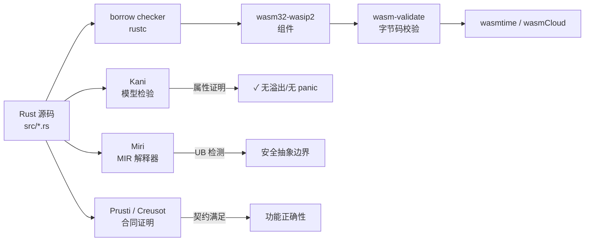

# Rust 生态：类型安全、WASM 目标与形式化验证
>
> 版本: 2026-07-09
> 对齐来源: Rust Project、Kani/Miri/Creusot/Prusti 形式化验证工具链、Bytecode Alliance Wasmtime、Rust WASM 工作组、RustBelt / Aeneas 研究项目

## 1. Rust 类型系统的形式化基础

### 1.1 所有权、借用与生命周期

Rust 的核心创新是将内存安全规则编码进类型系统：

- **所有权规则**：每个值有且只有一个所有者；所有者离开作用域时值被释放。
- **借用规则**：任意时刻，要么一个可变引用，要么任意数量的不可变引用。
- **生命周期（Lifetimes）**：编译时验证引用始终有效。

这些规则由 `rustc` 的 borrow checker 在编译期强制执行，消除了空指针、悬垂指针、数据竞争等一大类 C/C++ 常见缺陷。

### 1.2 形式化研究

| 研究项目 | 机构 | 目标 |
|---------|------|------|
| **RustBelt** | MPI-SWS / IMDEA | 在 Iris 分离逻辑框架下为 Rust 核心语言建立形式化语义 |
| **Aeneas** | EPFL | 从 Safe Rust 提取纯函数式等价物用于交互式证明 |
| **Creusot** | Inria | 基于 Why3 的 Rust 演绎验证 |
| **Prusti** | ETH Zurich / Viper Project | 基于 Viper 的 Rust 自动合同验证 |

这些项目共同为 Rust 的安全承诺提供了学术层面的数学基础。

## 2. 工业级验证工具链

### 2.1 Kani（AWS 开源模型检验器）

- **定位**：Rust 代码的**模型检验器**，基于 CBMC 后端。
- **能力**：
  - 验证 `unsafe` 代码块的内存安全；
  - 检查并发原语的正确性；
  - 证明属性在所有可能输入下成立。
- **应用**：AWS 用于验证 Firecracker microVM、Bottlerocket 等关键组件。
- **典型用法**：

```rust
#[kani::proof]
fn safe_abs_proof() {
    let x: i32 = kani::any();
    kani::assume(x != i32::MIN);
    let r = x.checked_abs().unwrap();
    kani::assert(r >= 0);
}
```

### 2.2 Miri（Rust 官方 MIR 解释器）

- **定位**：Rust 的**未定义行为检测器**。
- **能力**：
  - 解释执行 Rust 中间表示（MIR）；
  - 检测未对齐访问、数据竞争、无效内存使用；
  - 验证 `unsafe` 代码与 safe 抽象边界的正确性。
- **适用场景**：手动触发、CI 回归检测、调试 `unsafe` 块。

### 2.3 Prusti 与 Creusot

| 工具 | 方法 | 自动化 | 适用场景 |
|-----|------|--------|---------|
| Kani | 模型检验 | 高 | 不安全代码、并发、协议 |
| Miri | 动态解释 | 手动运行 | UB 检测、调试 |
| Prusti | 演绎验证 | 中高 | 合同驱动设计、算法正确性 |
| Creusot | 演绎验证 | 中 | 提取证明、功能验证 |

Prusti 示例：

```rust
#[requires(n >= 0)]
#[ensures(result >= n)]
fn double_nonnegative(n: i32) -> i32 { n * 2 }
```

## 3. Rust 与 WebAssembly

### 3.1 WASM 作为 Rust 的一级目标

Rust 原生支持以下 Wasm 目标：

| 目标 | 说明 | 状态 |
|-----|------|------|
| `wasm32-unknown-unknown` | 浏览器场景，配合 `wasm-bindgen` | 稳定 |
| `wasm32-wasip1` | WASI 0.1（类 POSIX） | Tier 2 |
| `wasm32-wasip2` | WASI 0.2 + Component Model | Tier 3 |

> **注意**：自 Rust 1.84（2025-01）起，旧的 `wasm32-wasi` 目标被移除，需迁移到 `wasm32-wasip1` 或 `wasm32-wasip2`。

### 3.2 组件模型开发

```rust
// WIT 接口定义
// package my:domain;
// interface calculator { add: func(a: u32, b: u32) -> u32; }

// Rust 实现（wasm32-wasip2 目标）
wit_bindgen::generate!({
    world: "calculator-world",
    exports: { "my:domain/calculator": Calculator },
});

struct Calculator;
impl exports::my::domain::calculator::Guest for Calculator {
    fn add(a: u32, b: u32) -> u32 {
        a.checked_add(b).expect("overflow") // 安全边界
    }
}
```

### 3.3 wasmCloud Rust SDK

- `wasmcloud-component` crate：预生成接口与惯用包装器。
- 支持通过 `wasm32-wasip2` 目标构建组件。
- 月下载量持续增长，是 Rust 在 Wasm 平台工程中的主要入口之一。

## 4. Rust/WASM 形式化验证方法

### 4.1 定义

**Rust/WASM 形式化验证**是指运用形式化方法对 Rust 源代码或其编译后的 WebAssembly 组件进行数学化分析，以证明关键属性（内存安全、无未定义行为、函数契约满足、并发正确性）在所有可能输入和执行路径下成立。它为安全关键、供应链关键和高可信架构复用组件提供超越单元测试的强保证。

### 4.2 验证证据链

对安全关键的 Rust/WASM 组件，建议采用三层证据链：



### 4.3 验证边界与成本效益分析

| 验证对象 | 可证明属性 | 不可覆盖的假设 |
|:---|:---|:---|
| Rust 源码 + Kani | 内存安全、无溢出、无 panic、函数契约 | 编译器正确性、Kani/CBMC 本身可信计算基（TCB） |
| Miri | `unsafe` 块无未定义行为 | 仅覆盖实际执行路径；不会自动覆盖所有输入 |
| 编译后的 WASM 字节码 | 字节码合法性、WIT 接口一致性 | 源码到字节码的编译过程未被篡改 |
| 运行时（Wasmtime） | 沙箱隔离、能力模型正确执行 | Host 函数实现、操作系统内核 |

**实践建议**：避免"编译通过即安全"的错觉。对安全关键组件，必须组合源码验证、构建来源证明（SLSA provenance）与字节码校验。

## 5. Cargo 与依赖治理

### 5.1 依赖解析的确定性

- `Cargo.lock` 保证跨构建的依赖图一致性。
- 与 SLSA 供应链安全天然契合：可复现构建基础。

### 5.2 SBOM 生成

- `cargo-cyclonedx` / `cargo-spdx`：自动生成符合标准的 SBOM。
- 与 EU CRA、NIST SSDF 合规要求对齐。

### 5.3 不安全代码边界管理

| 策略 | 实现 | 复用保证 |
|-----|------|---------|
| `unsafe` 封装 | 最小化 `unsafe` 块，用 safe API 封装 | 调用方无需关心内部 unsafe |
| Miri CI | 持续集成中运行 Miri 检测 | 捕获回归的 UB |
| Kani 证明 | 对核心不安全代码进行模型检验 | 数学保证安全边界 |
| 审计 | `cargo-geiger` 统计 unsafe 使用量 | 透明度与风险评估 |

## 6. 跨领域复用案例

### 6.1 嵌入式（Embedded）

- `embedded-hal`：硬件抽象层 trait，跨 MCU 厂商复用驱动。
- `defmt`：高效的调试格式化，替代 `println!`。
- `rtic` / `embassy`：异步嵌入式框架。

### 6.2 系统编程

- Linux 内核模块（Rust for Linux）：逐步替代 C 驱动。
- 操作系统（Redox OS）：纯 Rust 微内核。
- 虚拟化（Firecracker）：AWS 的 microVM，Kani 验证关键路径。

### 6.3 区块链与密码学

- `ring`、`rustls`：经形式化审查的密码学库。
- Substrate / Polkadot：Wasm 运行时 + Rust 实现。

## 7. 与功能安全的关系

Rust 尚未获得 IEC 61508 / ISO 26262 的工具资格认证，但正在向该方向演进：

- 内存安全保证减少系统性故障来源；
- Kani/Miri 提供自动化验证证据；
- 需要标准化机构评估 borrow checker 作为"技术"的资格。

## 8. 正向示例

### 示例：AWS 使用 Kani 验证 Firecracker 关键路径

AWS 使用 Kani 验证 Firecracker microVM 和 Bottlerocket 中的关键 `unsafe` 代码块。在将 Rust 代码编译为 WASM 组件供多租户边缘平台复用时：

- 对核心数据平面组件运行 Kani，证明无溢出、无 panic；
- 对 `unsafe` 内存操作运行 Miri，确认无未定义行为；
- 生成 SLSA provenance，记录构建来源；
- 使用 `wasm-tools validate` 校验编译后的字节码。

形式化验证报告成为安全审计的核心证据，使该组件可被其他团队在高风险场景中复用。

## 9. 反例 / 反模式

### 反例："编译通过即安全"

某团队认为"Rust 编译通过就安全"，未对 `unsafe` 块进行 Miri 检测或 Kani 证明。结果在 WASM 运行时中因未对齐内存访问触发未定义行为，导致：

- 边缘节点偶发崩溃，故障定位耗时数周；
- 安全审计要求回退到经过验证的旧版本；
- 团队被迫补做形式化验证，延误发布 2 个月。

### 反模式：只验证源码，不验证字节码

另一团队仅对 Rust 源码运行测试和少量 Kani 证明，未检查编译后的 WASM 字节码是否被篡改。供应链攻击者通过污染 CI 缓存植入了恶意字节码，导致：

- 源码层面"安全"，但运行时行为偏离契约；
- 攻击面未被审计覆盖；
- 事件后引入 SLSA provenance 和字节码校验机制。

## 10. 权威来源

| 来源 | URL | 核查日期 |
|:---|:---|:---|
| The Rust Programming Language | <https://www.rust-lang.org> | 2026-07-09 |
| Rust Blog (wasm32-wasip2 Tier 2) | <https://blog.rust-lang.org/2024/11/26/wasm32-wasip2-tier-2.html> | 2026-07-09 |
| Kani Rust Verifier | <https://github.com/model-checking/kani> | 2026-07-09 |
| Miri (Rust MIR Interpreter) | <https://github.com/rust-lang/miri> | 2026-07-09 |
| Creusot (Rust Verification) | <https://github.com/creusot-rs/creusot> | 2026-07-09 |
| Prusti | <https://github.com/viperproject/prusti> | 2026-07-09 |
| Wasmtime | <https://github.com/bytecodealliance/wasmtime> | 2026-07-09 |
| RustBelt Paper (POPL 2018) | <https://iris-project.org/pdfs/2018-jung-rustbelt.pdf> | 2026-07-09 |

> **关键引用**：RustBelt（Jung et al., POPL 2018）在 Iris 框架下为 Rust 核心类型系统与不安全代码建立了形式化模型；AWS Kani 已被用于验证 Firecracker 和 Bottlerocket 的关键路径；Rust `wasm32-wasip2` 目标于 2024-11-26 晋升 Tier 2，成为 Component Model 生产开发的首选目标。

## 11. 交叉引用

- WASM Component Model 详见 [`../03-webassembly-components/wasm-component-model-2026.md`](../03-webassembly-components/wasm-component-model-2026.md)
- WASI 0.3 边界详见 [`../03-webassembly-components/wasm-wasi-03-boundaries.md`](../03-webassembly-components/wasm-wasi-03-boundaries.md)
- 形式化验证专题参见 [`../../07-formal-verification/README.md`](../../07-formal-verification/README.md)
