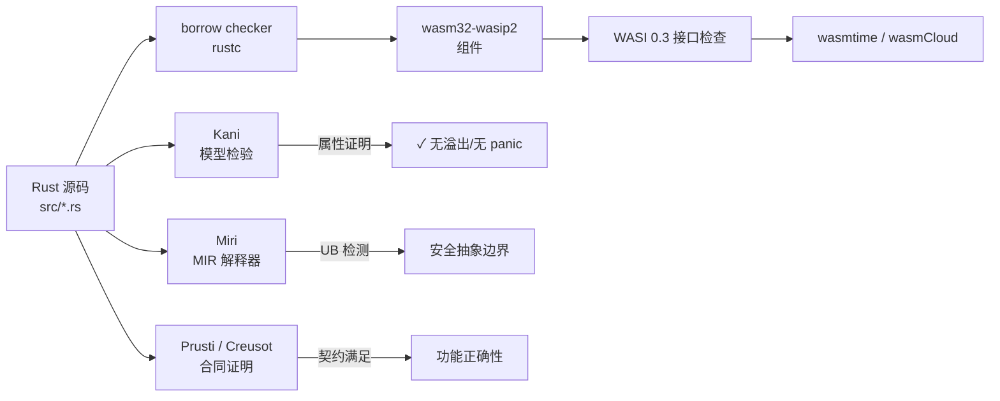

# Rust 生态：类型安全、WASM 目标与形式化验证
>
> 版本: 2026-06-06
> 对齐来源: Rust Project、Rust Formal Methods 社区、Kani/Miri/Prusti 项目、Rust WASM 工作组

## 1. Rust 类型系统的形式化基础

### 1.1 所有权（Ownership）与借用（Borrowing）

Rust 的核心创新是将内存安全规则编码进类型系统：

- **所有权规则**：每个值有且只有一个所有者；所有者离开作用域时值被释放
- **借用规则**：任意时刻，要么一个可变引用，要么任意数量的不可变引用
- **生命周期（Lifetimes）**：编译时验证引用始终有效

### 1.2 形式化研究

| 研究项目 | 机构 | 目标 |
|---------|------|------|
| **RustBelt** | MPI-SWS / IMDEA | Iris 框架下 Rust 核心语言的形式化语义 |
| **Aeneas** | EPFL | 从 Rust 提取纯函数式等价物用于证明 |
| **Creusot** | Inria | 基于 Why3 的 Rust 演绎验证 |
| **Prusti** | ETH Zurich / Viper Project | 基于 Viper 的 Rust 自动验证 |

## 2. 工业级验证工具链

### 2.1 Kani（AWS 开源）

- **定位**：Rust 代码的**模型检验器**
- **能力**：
  - 验证不安全（unsafe）代码块的内存安全
  - 检查并发原语的正确性
  - 证明属性在所有可能输入下成立
- **应用**：AWS 用于验证 Firecracker microVM、Bottlerocket 等关键组件

### 2.2 Miri（Rust 官方）

- **定位**：Rust 的**未定义行为检测器**
- **能力**：
  - 解释执行 Rust 中间表示（MIR）
  - 检测未对齐访问、数据竞争、无效内存使用
  - 验证不安全代码与 safe 抽象边界的正确性

### 2.3 Prusti

- **定位**：基于合同的 Rust 程序验证
- **能力**：
  - `#[requires(...)]` / `#[ensures(...)]` 合同注解
  - 纯函数（pure functions）与谓词（predicates）
  - 自动证明内存安全与功能正确性
- **状态**：研究原型，向工业可用性演进

### 2.4 工具对比

| 工具 | 方法 | 自动化 | 适用场景 |
|-----|------|--------|---------|
| Kani | 模型检验 | 高 | 不安全代码、并发、协议 |
| Miri | 动态解释 | 手动运行 | UB 检测、调试 |
| Prusti | 演绎验证 | 中高 | 合同驱动设计、算法正确性 |
| Creusot | 演绎验证 | 中 | 提取证明、功能验证 |

## 3. Rust 与 WebAssembly

### 3.1 WASM 作为 Rust 的一级目标

- Rust 原生支持 `wasm32-unknown-unknown` 和 `wasm32-wasip2` 目标
- `wasm32-wasip2`：支持 WASI 预览 2 和组件模型
- `wasm-bindgen`：Rust 与 JavaScript 的无缝互操作

### 3.2 组件模型开发

```rust
// WIT 接口定义
// package my:domain;
// interface calculator { add: func(a: u32, b: u32) -> u32; }

// Rust 实现（wasm32-wasip2 目标）
wit_bindgen::generate!({
    world: "calculator-world",
    exports: {
        "my:domain/calculator": Calculator,
    },
});

struct Calculator;
impl exports::my::domain::calculator::Guest for Calculator {
    fn add(a: u32, b: u32) -> u32 { a + b }
}
```

### 3.3 wasmCloud Rust SDK

- `wasmcloud-component` crate：预生成接口与惯用包装器
- 支持通过 `wasm32-wasip2` 目标构建组件
- 月下载量 1,700+（2026 初），增长迅速

## 4. Cargo 与依赖治理

### 4.1 依赖解析的确定性

- Cargo.lock 保证跨构建的依赖图一致性
- 与 SLSA 供应链安全天然契合：可复现构建基础

### 4.2 SBOM 生成

- `cargo-cyclonedx` / `cargo-spdx`：自动生成符合标准的 SBOM
- 与 EU CRA、NIST SSDF 合规要求对齐

### 4.3 不安全代码边界管理

| 策略 | 实现 | 复用保证 |
|-----|------|---------|
| `unsafe` 封装 | 最小化 `unsafe` 块，用 safe API 封装 | 调用方无需关心内部 unsafe |
| Miri CI | 持续集成中运行 Miri 检测 | 捕获回归的 UB |
| Kani 证明 | 对核心不安全代码进行模型检验 | 数学保证安全边界 |
| 审计 | `cargo-geiger` 统计 unsafe 使用量 | 透明度与风险评估 |

## 5. 跨领域复用案例

### 5.1 嵌入式（Embedded）

- `embedded-hal`：硬件抽象层trait，跨 MCU 厂商复用驱动
- `defmt`：高效的调试格式化，替代 `println!`
- `rtic` / `embassy`：异步嵌入式框架

### 5.2 系统编程

- Linux 内核模块（Rust for Linux）：逐步替代 C 驱动
- 操作系统（Redox OS）：纯 Rust 微内核
- 虚拟化（Firecracker）：AWS 的 microVM，Kani 验证关键路径

### 5.3 区块链与密码学

- `ring`、`rustls`：经形式化审查的密码学库
- Substrate / Polkadot：Wasm 运行时 + Rust 实现

## 6. 与功能安全的关系

Rust 尚未获得 IEC 61508 / ISO 26262 的工具资格认证，但正在向该方向演进：

- 内存安全保证减少系统性故障来源
- Kani/Miri 提供自动化验证证据
- 需要标准化机构评估 borrow checker 作为"技术"的资格

## 7. 参考索引

- Rust Project: [rust-lang.org](https://www.rust-lang.org)
- Kani Verifier: [github.com/model-checking/kani](https://github.com/model-checking/kani)
- Miri: [github.com/rust-lang/miri](https://github.com/rust-lang/miri)
- Prusti: [github.com/viperproject/prusti](https://github.com/viperproject/prusti)
- Creusot: [github.com/creusot-rs/creusot](https://github.com/creusot-rs/creusot)
- Rust for Linux: [rust-for-linux.com](https://rust-for-linux.com)
- wasmCloud Rust SDK: [crates.io/crates/wasmcloud-component](https://crates.io/crates/wasmcloud-component)
- Jung et al.: "RustBelt: Securing the Foundations of the Rust Programming Language" (POPL 2018)


---

## 8. Rust/WASM 形式化验证方法补强

### 8.1 定义

**Rust/WASM 形式化验证**是指运用形式化方法对 Rust 源代码或其编译后的 WebAssembly 组件进行数学化分析，以证明关键属性（如内存安全、无未定义行为、函数契约满足、并发正确性）在所有可能输入和执行路径下成立。它在安全关键、供应链关键和高可信架构复用场景中，为可复用组件提供超越单元测试的强保证。[[Rust (programming language)](https://en.wikipedia.org/wiki/Rust_(programming_language))]

### 8.2 形式化验证方法分类

| 方法 | 原理 | 典型工具 | 证明目标 | 自动化程度 |
|:---|:---|:---|:---|:---|
| **类型系统验证** | 所有权、借用、生命周期在编译期消除数据竞争和悬垂指针 | `rustc` borrow checker | 内存安全、无数据竞争 | 全自动 |
| **模型检验** | 对状态空间进行符号化或显式遍历 | Kani | 属性在所有输入下成立 | 高 |
| **演绎验证** | 基于霍尔逻辑与 SMT 求解器证明前置/后置条件 | Prusti、Creusot | 功能正确性、契约 | 中 |
| **动态解释检测** | 解释执行 MIR，捕获未定义行为 | Miri | 不安全代码 UB | 手动触发 |
| **二进制验证** | 对 WASM 字节码进行静态分析 | wasm-validate、WASI 合规测试 | 字节码合法性与接口一致性 | 全自动 |

### 8.3 工具链与位置



### 8.4 验证示例

**示例 1：使用 Kani 证明无溢出**

```rust
#[kani::proof]
fn safe_abs_proof() {
    let x: i32 = kani::any();
    kani::assume(x != i32::MIN);
    let r = x.checked_abs().unwrap();
    kani::assert(r >= 0);
}
```

**示例 2：组件接口契约**

```rust
wit_bindgen::generate!({ world: "calculator-world", exports: { "my:domain/calculator": Calculator } });

struct Calculator;
impl exports::my::domain::calculator::Guest for Calculator {
    fn add(a: u32, b: u32) -> u32 {
        a.checked_add(b).expect("overflow") // 安全边界
    }
}
```

通过 Kani 验证 `add` 不会溢出，再编译为 WASM 组件，消费方即可在假设“返回值为两数之和”的前提下安全复用。

### 8.5 正例与反例

**正例**：AWS 使用 Kani 验证 Firecracker microVM 和 Bottlerocket 中的关键不安全代码块；在将 Rust 代码编译为 WASM 组件供多租户边缘平台复用时，形式化验证报告成为安全审计的核心证据。

**反例**：某团队认为“Rust 编译通过就安全”，未对 `unsafe` 块进行 Miri 检测或 Kani 证明，结果在 WASM 运行时中因未对齐内存访问触发未定义行为；另一团队仅验证 Rust 源码，未检查编译后的 WASM 字节码是否被篡改，导致供应链攻击面未被覆盖。

### 8.6 权威来源与交叉引用

| 来源 | URL |
|:---|:---|
| Wikipedia - Rust | <https://en.wikipedia.org/wiki/Rust_(programming_language)> |
| Kani Verifier | <https://github.com/model-checking/kani> |
| Miri | <https://github.com/rust-lang/miri> |
| Prusti | <https://github.com/viperproject/prusti> |
| Creusot | <https://github.com/creusot-rs/creusot> |
| wasmtime | <https://github.com/bytecodealliance/wasmtime> |

**交叉引用**：

- WASM Component Model 详见 [`../03-webassembly-components/wasm-component-model-2026.md`](../03-webassembly-components/wasm-component-model-2026.md)
- WASI 0.3 边界详见 [`../03-webassembly-components/wasm-wasi-03-boundaries.md`](../03-webassembly-components/wasm-wasi-03-boundaries.md)
- 形式化验证专题参见 [`../../07-formal-verification/README.md`](../../07-formal-verification/README.md)

---

## 补充说明：Rust 生态：类型安全、WASM 目标与形式化验证

## 概念定义

**定义**：WebAssembly Component Model 将 WASM 模块升级为具有显式接口、类型化导入导出的可组合组件，支持跨语言、跨运行时复用。

## 反例

**反例**：将 I/O 密集型服务盲目迁移到 WASM，WASI 能力不支持所需系统调用，性能与可维护性反而下降。

## 权威来源

> **权威来源**:
>
> - [WebAssembly Component Model](https://component-model.bytecodealliance.org)
> - [WASI Preview 2](https://wasi.dev)
> - 核查日期：2026-07-07

## 分析

**分析**：WASM 组件模型提供了真正的语言无关二进制复用，但生态与工具链仍在快速演进。
