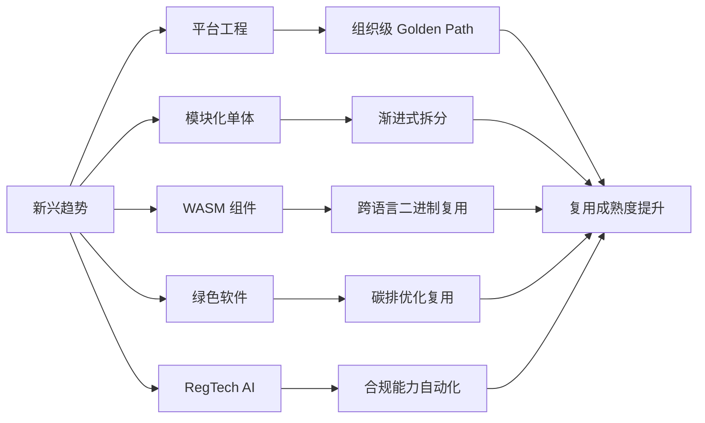

# 13 新兴趋势

> **定位**：2026 年及以后的软件复用前沿方向，关注平台工程、模块化单体、WebAssembly 组件、绿色软件与 RegTech AI 等新范式对复用边界、形式与治理的影响。

---

## 1. 概念定义

**新兴趋势复用** 指在快速演进的技术范式中，通过新抽象层或新约束推动复用资产的可移植性、可持续性与治理自动化的实践集合。

| 趋势 | 定义 | 复用影响 |
|------|------|----------|
| **平台工程** | 构建内部开发者平台（IDP）与 Golden Path，将基础设施能力产品化 | 组织级复用的规模化载体 |
| **模块化单体** | 在单体部署单元内保持模块边界与显式接口 | 降低分布式复杂度的渐进式复用 |
| **WASM 组件模型** | 跨语言、跨运行时的类型化组件标准 | 真正的二进制级跨语言复用 |
| **绿色软件** | 以减少全生命周期环境影响为目标的软件工程 | 将碳排纳入复用决策 |
| **RegTech AI** | 用 AI 自动化合规感知、认知、决策与学习 | 合规规则与审计能力的复用 |
| **Rust 生态** | 以所有权系统保障内存安全的系统语言生态 | 高安全系统组件复用 |

**技术成熟度匹配原则**：新兴技术的采纳必须匹配组织成熟度、工具链 readiness 与真实业务痛点，避免为技术而技术。

---

## 2. 新兴趋势对复用的影响图

---

## 3. 正向示例

### 示例 1：平台工程 IDP

某电商企业构建内部开发者平台，提供一键创建服务仓库、CI/CD、监控与密钥管理；产品团队上线时间从 2 周缩短到 2 小时，平台使用率达到 90%。

### 示例 2：模块化单体渐进拆分

一个 50 人团队的产品从 Spring Modulith 模块化单体起步，在业务增长后按模块边界平滑拆分为微服务；早期复用模块边界，避免了一次性微服务治理成本。

### 示例 3：WASM 跨语言组件

使用 Rust 实现图像处理组件，编译为 WIT 接口的 WASM 组件；同一二进制在 Node.js、Python 与边缘运行时中复用，无需为每种语言重写核心算法。

### 示例 4：绿色复用降低碳排

复用支持 ARM graceful degradation 的压缩库，在闲时降低 CPU 频率；云账单与碳排同时下降 20%，满足企业 SBTi 目标。

### 示例 5：RegTech AI 合规复用

金融机构将反洗钱规则引擎升级为 RegTech AI 框架，合规检查能力以 Agent 形式被多个业务线复用，审计日志自动生成，合规响应时间从天级降至分钟级。

---

## 4. 反例 / 失败案例

### 反例 1：追逐 WASM 全面重写

某团队将所有服务重写为 WASM 组件，忽视工具链成熟度与团队调试能力；交付延期、故障定位困难，最终回退部分服务。

### 反例 2：平台团队闭门造车

平台团队强制所有团队使用不灵活的模板，忽视开发者反馈；开发者绕过平台自行部署，形成影子基础设施与安全漏洞。

### 反例 3：为微服务而微服务

为追求“弹性”将单体拆分为 200 个微服务，每个服务常驻空闲实例；整体能耗与运维复杂度翻倍，复用收益被稀释。

### 反例 4：绿色清洗式复用

选择旧版本低能效组件冠以“复用减少开发”之名，未评估新硬件与算法能效；碳排不降反升。

### 反例 5：RegTech AI 黑盒化

合规 Agent 的决策过程不可解释，审计无法复现；监管机构要求回退到规则引擎，项目被迫重构。

---

## 5. 趋势适用性矩阵与采纳分析

| 趋势 | 适用组织 | 不适用场景 | 关键成功因素 |
|------|----------|------------|--------------|
| 平台工程 | 多团队、规模化组织 | 团队 < 10 人、无重复需求 | 产品化运营、开发者体验 |
| 模块化单体 | 中小团队、演进式架构 | 已成熟的大规模分布式系统 | 模块边界清晰、编译期隔离 |
| WASM 组件 | 多语言栈、边缘/插件场景 | I/O 密集型、强 OS 依赖 | 工具链、WASI 能力匹配 |
| 绿色软件 | 有 SBTi/ESG 目标的企业 | 无碳排数据基础 | 度量、硬件、算法协同 |
| RegTech AI | 强监管行业 | 规则稳定、低变化场景 | 可解释性、审计、人工复核 |

---

## 6. 权威来源

> **权威来源**（按主题分组，核查日期：2026-07-09）：
>
> **平台工程**
>
> - [CNCF Platform Engineering Maturity Model](https://tag-app-delivery.cncf.io/whitepapers/platform-eng-maturity-model/) — CNCF TAG App Delivery
> - [CNCF Platforms White Paper](https://tag-app-delivery.cncf.io/whitepapers/platforms/) — CNCF TAG App Delivery
> - [Team Topologies](https://teamtopologies.com/) — Matthew Skelton & Manuel Pais
> - [DORA State of DevOps Report 2024](https://dora.dev/research/2024/dora-report/) — Google Cloud / DORA
>
> **WebAssembly 与组件模型**
>
> - [WebAssembly Component Model](https://component-model.bytecodealliance.org/) — Bytecode Alliance
> - [WASI — WebAssembly System Interface](https://wasi.dev/) — W3C WebAssembly CG / Bytecode Alliance
> - [Wasmtime Runtime](https://github.com/bytecodealliance/wasmtime) — Bytecode Alliance
>
> **Rust 与形式化验证**
>
> - [The Rust Programming Language](https://www.rust-lang.org/) — Rust Project
> - [Kani Rust Verifier](https://github.com/model-checking/kani) — AWS / Model Checking Research
> - [Miri (Rust MIR Interpreter)](https://github.com/rust-lang/miri) — Rust Project
>
> **绿色软件与 SCI**
>
> - [SCI Specification v1.1 / ISO/IEC 21031:2024](https://sci.greensoftware.foundation/) — Green Software Foundation
> - [ISO/IEC 21031:2024](https://www.iso.org/standard/86612.html) — ISO/IEC JTC 1/SC 42
> - [SCI for AI Specification](https://greensoftware.foundation/standards/sci-ai/) — Green Software Foundation
> - [SCI for AI Ratified](https://greensoftware.foundation/articles/sci-ai-specification-ratified-standard-for-measuring-ai-emissions-across-the/) — Green Software Foundation
> - [Green Software Patterns](https://patterns.greensoftware.foundation/) — Green Software Foundation
>
> **模块化单体**
>
> - [Spring Modulith](https://spring.io/projects/spring-modulith) — VMware / Spring

---

## 7. 当前状态与关联主题

- [x] 平台工程成熟度模型 (`01-platform-engineering/`)
- [x] 模块化单体复用分析 (`02-modular-monolith/`)
- [x] WASM Component Model 复用决策树 (`03-webassembly-components/`)
- [x] 绿色软件碳排模型 (`07-green-software/`)
- [x] RegTech AI 复用框架 (`06-regtech-ai/`)
- [ ] RegTech Agentic 架构案例验证 (P2, 2027-Q3)

关联主题：

- `03-application-architecture-reuse`（模块化单体与云原生）
- `04-component-architecture-reuse`（Rust 生态、WASM）
- `09-value-quantification`（平台工程 ROI、绿色 SCI）
- `12-ai-native-reuse`（Agentic Infrastructure、RegTech AI）

## 8. 实施检查单

- [ ] 评估组织成熟度，避免为技术而技术。
- [ ] 选择 1-2 个与真实痛点匹配的新兴趋势进行试点。
- [ ] 建立度量体系，跟踪采纳率、成本、风险与业务价值。
- [ ] 为每个趋势制定退出策略，防止技术锁定。
- [ ] 将可持续性指标纳入复用资产的准入与退役标准。

## 9. 常见误区

- **误区 1：追逐最新技术**。技术应与业务痛点与组织能力匹配。
- **误区 2：平台即控制**。平台应以开发者体验为导向，而非强制。
- **误区 3：模块化单体是倒退**。它是演进式架构的理性选择。
- **误区 4：WASM 适合所有场景**。I/O 密集与强 OS 依赖场景仍需谨慎。
- **误区 5：绿色软件只是采购绿电**。代码效率、架构设计与硬件选择同样关键。

## 10. 一句话总结

> 新兴技术扩展了复用的边界，但技术采纳必须匹配组织成熟度与真实业务痛点；平台工程、模块化、WASM 与绿色软件共同构成 2026 年复用演进的主线。

## 11. 深度案例：从单体到模块化单体再到微服务的渐进复用

某 SaaS 公司在创业初期采用单体架构快速验证市场。随着团队扩大到 80 人，部署冲突与代码耦合开始影响交付效率。

演进路径：

1. **模块化单体阶段**：引入 Spring Modulith，将订单、库存、用户等模块在编译期隔离，保持单体部署；团队先复用模块边界与接口契约。
2. **选择性拆分阶段**：当订单模块的变更频率与团队规模超过阈值后，将其拆分为独立服务；由于模块边界已清晰，拆分成本低。
3. **平台工程阶段**：建立 IDP，将部署、监控与安全策略封装为 Golden Path；新服务创建从 2 周缩短到 2 小时。

该案例说明，模块化单体不是微服务的对立面，而是降低演进风险的中间状态。

## 13. 延伸阅读

1. CNCF. *Platforms White Paper* — 平台工程方法论。
2. Martin Fowler. *MonolithFirst* 与 *Platform Engineering* 系列文章。
3. Bytecode Alliance. *WebAssembly Component Model* 规范。
4. Green Software Foundation. *Principles of Green Software Engineering*。
5. Rust Foundation. *The Rust Programming Language* 与 *Rust for Linux* 项目。

## 14. 持续改进方向

- **CNCF 平台工程成熟度**：按 CNCF Platform Engineering Maturity Model 的 4 级 × 5 维度定期评估，重点关注 Level 3 的"内在牵引"与 Level 4 的"参与式生态"。
- **WASM 组件复用边界**：跟踪 WASI 0.3 RC/Preview 与 Wasmtime LTS 策略，明确 I/O 密集型、有状态长运行服务、强 OS 依赖场景为当前边界外。
- **Rust/WASM 形式化验证**：对安全关键组件建立"源码验证（Kani/Miri）+ 构建来源证明（SLSA）+ 字节码校验"的证据链。
- **绿色软件碳模型**：将 SCI 从通用软件扩展到 AI 负载（SCI for AI），把 provider/consumer score 纳入第三方模型/API 的复用评估。
- **新兴标准前沿**：每季度更新 `99-reference/frontier-tracking/` 中的标准状态，避免引用过期或错误版本。

## 15. 关键行动项

- 对当前架构进行模块化评估，识别可作为模块化单体试点的边界。
- 制定平台工程 ROI 模型，明确 IDP 的服务对象与成功指标。
- 在多语言栈场景中评估 WASM 组件的适用性，优先选择 WIT `interface` 粒度。
- 将碳排指标（含 SCI for AI）纳入新建服务的非功能性需求。
- 每季度运行 link-checker 与 quality-gate，确保参考来源有效。

## 16. 总结

新兴趋势不是对现有复用框架的替代，而是对其边界与形式的扩展。理性采纳、持续度量与渐进演进，是将趋势转化为可持续复用能力的关键。

## 12. 版本记录

- 2026-07-09：对齐 CNCF Platform Engineering Maturity Model、WASI 0.3 / Wasm 组件复用边界、Rust/WASM 形式化验证、SCI for AI 等权威来源；删除重复版本记录；更新权威来源 URL 与核查日期。
- 2026-07-07：补充平台工程、模块化单体、WASM、绿色软件与 RegTech AI 的概念定义、示例、反例、关系图与权威来源。
- 2026-06-08：初始版本，梳理新兴趋势核心文件与状态。