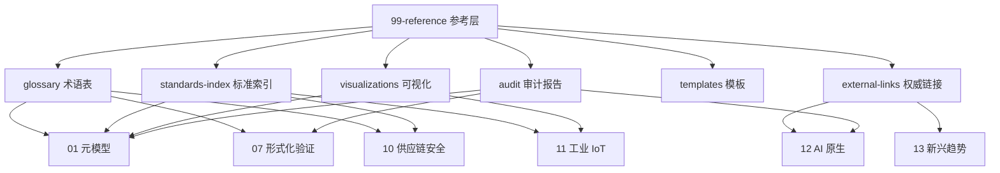

# 99 参考索引

> **版本**: 2026-07-09
> **定位**: 全知识库的参考层，汇总权威来源、术语表、标准索引、课程对标、可视化资源与审计报告，为各主题提供可追溯的引用锚点。

---

## 1. 概念定义

**参考层（Reference Layer）** 是结构化知识体系的“地图”与“信任锚点”。它本身不替代各主题的深度内容，而是通过术语表、标准索引、外部链接、审计报告与可视化资源，确保知识体系内部一致、来源可验证、演进可追踪。

| 子目录 | 定义 | 内容示例 |
|--------|------|----------|
| `glossary/` | 术语表与同义词对照 | 跨标准术语映射、公理-定理树 |
| `standards-index/` | 标准索引与对齐矩阵 | ISO/IEC/IEEE、SLSA、OPC UA 等 |
| `external-links/` | 外部权威资源链接 | authoritative-sources.md |
| `visualizations/` | 可视化图表 | Mermaid 架构图、概念映射 |
| `templates/` | 文档模板 | 检查清单、引用模板、快速参考卡 |
| `tools/` | 工具脚本 | 术语查询、COCOMO 计算器、形式化验证环境 |
| `chapters/` | 全书章节框架 | 出版结构草稿 |
| `audit/` | 审计报告 | 质量门控、一致性、事实核查报告 |

**参考层一致性原则**：参考层若与正文冲突或链接失效，将直接削弱整个知识体系的信任度；因此参考层必须随标准演进定期审计与更新。

---

## 2. 参考层与主题关系图

---

## 3. 正向示例

### 示例 1：权威来源登记

`external-links/authoritative-sources.md` 登记所有 ISO/IEC、IEEE、NIST、CNCF、SLSA、OPC Foundation 等来源 URL 与核查日期；任何主题文档引用时均可追溯，避免“死链”或“二手引用”。

### 示例 2：术语一致性审计

通过 `glossary/terminology-crosswalk.md` 将 TOGAF、ArchiMate、ISO/IEC/IEEE 42010:2022 与项目自定义术语建立映射；当主题文档新增术语时，自动触发一致性检查，减少跨文档语义偏差。

### 示例 3：标准索引驱动的更新流程

`standards-index/master-alignment-matrix.md` 记录每个标准的版本、状态与对应文件夹；当 ISO/IEC/IEEE 12207:2026 发布或 SLSA 1.2 更新时，可快速定位受影响主题并启动更新。

### 示例 4：可视化资源复用

`visualizations/` 中的 Mermaid 架构图被多个主题 README 引用；更新一次即可同步多个文档，避免重复绘制与版本分叉。

### 示例 5：审计报告驱动质量改进

`audit/comprehensive-gap-analysis-2026-06-08.md` 识别出各主题缺少权威来源与概念定义的文档清单；修复后整体质量门控通过率从 44.6% 提升至 97.9%。

---

## 4. 反例 / 失败案例

### 反例 1：链接长期不更新

参考层中 30% 的外部链接失效或指向旧版本标准；读者无法确认内容准确性，引用可信度大幅下降。

### 反例 2：术语表与正文冲突

术语表将“业务能力”定义为“组织结构单元”，而正文中将其定义为“独立于组织的稳定能力”；定义不一致导致审计与培训混乱。

### 反例 3：标准索引缺失

团队新增 IEC 62443 工业网络安全内容，但未在标准索引中登记；其他主题在引用时出现重复定义和版本不一致。

### 反例 4：审计报告被忽视

审计报告识别出多个主题缺少权威来源，但未被纳入修复排期；参考层逐渐沦为形式，无法发挥质量门控作用。

### 反例 5：可视化资源分散

架构图存储在个人笔记与幻灯片中，未统一放入 `visualizations/`；不同文档引用不同版本，导致读者困惑。

---

## 5. 标准索引总览

| 标准 | 主题 | 状态 | 链接 | 核查日期 |
|------|------|------|------|------|
| ISO/IEC/IEEE 42010:2022 | 01-元模型 | 生效 | [ISO](https://www.iso.org/standard/74296.html) | 2026-07-09 |
| ISO/IEC/IEEE 42020:2019 | 01-元模型/复用 | 生效 | [ISO](https://www.iso.org/standard/68982.html) | 2026-07-09 |
| ISO/IEC/IEEE 42030:2019 | 01-元模型/评估 | 生效 | [ISO](https://www.iso.org/standard/73436.html) | 2026-07-09 |
| ISO/IEC 26550:2015 | 跨层复用 | 生效 | [ISO](https://www.iso.org/standard/69529.html) | 2026-07-09 |
| ISO/IEC 26565:2026 | 跨层复用 | 已发布 | [ISO](https://www.iso.org/standard/81436.html) | 2026-07-09 |
| ISO/IEC 26566:2026 | 跨层复用 | 已发布 | [ISO](https://www.iso.org/standard/81437.html) | 2026-07-09 |
| ISO/IEC 25010:2023 | 01-元模型/质量 | 生效 | [ISO](https://www.iso.org/standard/78175.html) | 2026-07-09 |
| ArchiMate 4 Specification | 01-元模型 | 2026-04-27 发布 | [The Open Group](https://www.opengroup.org/The-Open-Group-Announces-ArchiMate%C2%AE-4-Specification) | 2026-07-09 |
| ISO/IEC/IEEE 12207:2026 | 01-元模型 | 生效 | [ISO](https://www.iso.org/standard/90219.html) | 2026-07-09 |
| TOGAF 10 | 01-元模型 | 生效 | [Open Group](https://www.opengroup.org/togaf) | 2026-07-09 |
| SLSA 1.2 | 10-供应链安全 | 生效 | [SLSA](https://slsa.dev/spec/v1.2/) | 2026-07-09 |
| SPDX 2.3 / CycloneDX 1.6 | 10-供应链安全 | 生效 | [SPDX](https://spdx.dev), [CycloneDX](https://cyclonedx.org) | 2026-07-09 |
| ISA-95 / IEC 62264 | 11-工业 IoT | 生效 | [ISA](https://www.isa.org/standards-and-publications/isa-standards/isa-95) | 2026-07-09 |
| OPC UA FX 1.0 | 11-工业 IoT | 新兴 | [OPC Foundation](https://opcfoundation.org/opc-ua-field-exchange-opc-ua-fx/) | 2026-07-09 |
| IEC 61508 Ed.3 | 11-工业 IoT | 2026 强制（认证机构采用） | [IEC](https://iec.ch/dyn/www/f?p=103:23:::::FSP_ORG_ID:1369) | 2026-07-09 |
| NIST AI RMF 1.0 | 12-AI 原生/治理 | 生效 | [NIST](https://www.nist.gov/itl/ai-risk-management-framework) | 2026-07-09 |
| FinOps Foundation | 09-价值量化 | 生效 | [FinOps](https://www.finops.org/) | 2026-07-09 |
| MCP 2025-11-25 | 12-AI 原生 | 生效 | [MCP](https://modelcontextprotocol.io/specification/2025-11-25) | 2026-07-09 |
| A2A v1.0 | 12-AI 原生 | 生效 | [A2A](https://a2a-protocol.org/latest/) | 2026-07-09 |

> **索引说明**：本表所列链接均指向 ISO、IEC、The Open Group、NIST 等官方发布页面；`核查日期` 为最近一次人工或自动化复核的日期。标准状态变更时应同步更新本表与 [`frontier-tracking/2026-q2-frontier-report.md`](frontier-tracking/2026-q2-frontier-report.md)。

### 5.1 术语一致性治理

参考层通过以下机制保证术语定义一致性：

- **单一事实源**：`glossary/glossary-master.md` 作为项目术语的单一事实源；主题文档首次使用术语时应链接到术语表。
- **跨标准映射**：`glossary/terminology-crosswalk.md` 将 TOGAF、ArchiMate、ISO/IEC/IEEE 42010:2022、BIAN 等外部标准术语与项目自定义术语建立映射，减少跨文档语义偏差。
- **变更评审**：任何术语定义的变更需在 CI 中触发一致性扫描，确保不产生冲突定义。
- **核查周期**：每季度对照权威来源（ISO OBP、The Open Group、OMG 等）复核术语定义与链接。

### 5.2 跨层映射权威性

[`knowledge-index/cross-layer-reuse-mapping-matrix.md`](knowledge-index/cross-layer-reuse-mapping-matrix.md) 是四层复用资产映射的权威表达。其权威性来自：

- **标准对齐**：映射关系基于 ISO/IEC/IEEE 42010:2022（架构描述、视点与对应关系）、TOGAF Standard 10（业务/应用/技术架构分层）与 ISO/IEC 25010:2023（质量模型）。
- **失败传递模式**：矩阵中记录的跨层失败传递模式（如业务定义漂移 → 应用服务冗余 → 组件接口耦合）应随审计报告持续验证。
- **版本控制**：矩阵的每次更新必须在 `CHANGELOG.md` 与 `audit/` 中记录变更理由与权威来源。

### 5.3 术语与知识索引交叉引用

- **术语单一事实源**：[`glossary/glossary-master.md`](glossary/glossary-master.md)
- **跨标准术语映射**：[`glossary/terminology-crosswalk.md`](glossary/terminology-crosswalk.md)
- **跨层复用映射矩阵**：[`knowledge-index/cross-layer-reuse-mapping-matrix.md`](knowledge-index/cross-layer-reuse-mapping-matrix.md)
- **事实勘误与权威对齐报告**：[`audit/content-fact-fix-2026-07.md`](audit/content-fact-fix-2026-07.md)
- **前沿标准跟踪**：[`frontier-tracking/2026-q2-frontier-report.md`](frontier-tracking/2026-q2-frontier-report.md)

---

## 6. 维护规则

1. 每新增一个公理/定理，必须在 `glossary/axiom-theorem-tree.md` 中登记。
2. 每新增一个外部标准引用，必须在 `standards-index/master-alignment-matrix.md` 中更新。
3. 每新增一个可视化图表，必须上传至 `visualizations/` 并在相关主题 README 中引用。
4. 每季度运行一次链接有效性检查，失效链接需在 7 个工作日内修复或标注。
5. 每次大规模主题更新后，需更新 `audit/` 中的质量与一致性报告。

---

## 7. 权威来源

> **权威来源**：
>
> - [ISO](https://www.iso.org) — International Organization for Standardization（核查日期：2026-07-09）
> - [IEEE Standards](https://standards.ieee.org) — IEEE Standards Association（核查日期：2026-07-09）
> - [NIST](https://www.nist.gov) — National Institute of Standards and Technology（核查日期：2026-07-09）
> - [CNCF](https://www.cncf.io) — Cloud Native Computing Foundation（核查日期：2026-07-09）
> - [The Open Group](https://www.opengroup.org) — 企业架构与 ArchiMate 标准（核查日期：2026-07-09）
> - [Linux Foundation](https://www.linuxfoundation.org) — 开源与开放标准治理（核查日期：2026-07-09）
> - [OpenSSF](https://openssf.org) — 软件供应链安全与 SLSA（核查日期：2026-07-09）
> - [FinOps Foundation](https://www.finops.org/) — 云成本治理框架（核查日期：2026-07-09）
> - [Green Software Foundation](https://greensoftware.foundation) — SCI / SCI for AI（核查日期：2026-07-09）
> - [W3C WebAssembly Community Group](https://www.w3.org/groups/cg/webassembly/) — WebAssembly 与 WASI（核查日期：2026-07-09）

---

## 8. 当前状态与关联主题

- [x] 术语查询脚本 (`tools/terminology-query.py`)
- [x] 形式化验证 Docker 环境 (`tools/formal-verification-env/`)
- [x] 公理-定理推理树 (`glossary/axiom-theorem-tree.md`)
- [x] 跨主题综合索引 (`glossary/cross-topic-index.md`)
- [x] 标准索引总览 (`standards-index/master-alignment-matrix.md`)
- [x] 权威来源登记 (`external-links/authoritative-sources.md`)

关联主题：所有 01–13 主题均依赖本参考层进行来源追溯与一致性校验。

## 9. 参考层质量检查单

- [ ] 所有外部 URL 是否可访问且指向权威来源？
- [ ] 术语表是否与正文定义一致？
- [ ] 新增标准是否已在索引中登记？
- [ ] 可视化资源是否集中存放并被正确引用？
- [ ] 审计报告中的问题是否已闭环修复？
- [ ] 核查日期是否已更新到最近一个季度？

## 10. 常见误区

- **误区 1：参考层只是链接集合**。参考层应承担一致性校验与质量门控职能。
- **误区 2：一次性建设即可**。标准与链接会失效，必须持续审计。
- **误区 3：术语定义各行其是**。跨文档术语一致性是知识体系可信的基础。
- **误区 4：审计报告束之高阁**。审计结果必须转化为修复排期与质量改进。

## 11. 一句话总结

> 参考层的价值不在于内容本身，而在于建立知识之间的信任锚点；它让每一份复用资产都能被追溯、被验证、被持续信任。

## 12. 版本记录

- 2026-07-07：全面重写，补充概念定义、示例、反例、关系图、标准索引、维护规则与权威来源。
- 2026-06-06：初始版本，建立子目录导航与快速参考。

## 13. 深度案例：跨主题术语冲突的修复

在某次质量审计中，审计团队发现“业务能力”在 02-business-architecture-reuse 中被定义为“组织为达成业务成果而具备的稳定能力单元”，而在某份早期文档中却被描述为“由组织结构定义的职责”。这一定义冲突导致业务架构师与解决方案架构师在复用评估会议上产生分歧。

修复过程：

1. **术语溯源**：在 `glossary/terminology-crosswalk.md` 中统一采用 TOGAF 与 BIZBOK 的“业务能力”定义。
2. **文档更新**：修正早期文档中的描述，并在所有 README 中引用统一术语。
3. **自动化检查**：在 CI 中增加术语一致性扫描，发现冲突时自动告警。
4. **审计闭环**：将修复结果记录到 `audit/readme-consistency-audit.md`。

该案例说明，参考层是维护知识体系一致性的关键机制。

## 14. 延伸阅读

1. ISO/IEC/IEEE 42010:2022 — 架构描述标准。
2. TOGAF Standard 10 — 企业架构开发方法论。
3. SWEBOK V4 — 软件工程知识体系指南。
4. The Open Group. *ArchiMate 3.2 Specification*。
5. NIST. *Cybersecurity Supply Chain Risk Management*。

## 15. 持续改进方向

- 开发自动化链接检查与术语一致性扫描脚本。
- 建立标准版本变更的订阅与通知机制。
- 将参考层质量指标纳入整体质量门控报告。
- 探索将可视化资源生成与主题文档更新联动。

## 16. 关键行动项

- 每季度运行一次参考层全面审计。
- 为每个新增主题制定参考层补充清单。
- 建立跨主题术语变更的评审流程。
- 将失效链接修复纳入常规维护排期。