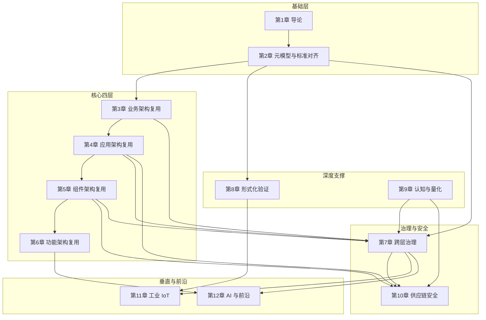

# 《软件工程架构复用视角》全书框架大纲 v2.0

> **版本**: 2026-06-10
> **定位**: Phase 6（2027-Q4）预热交付物，全书结构总纲（v2.0 更新版）
> **对齐**: `struct/MASTER_PLAN.md` 六阶段推进计划 + Phase B 外部视角扩展
> **来源**: 基于 `view/` 31 万字 8 份文档、`struct/` 13 个一级主题，以及 Phase B 新增的 5 个外部视角（DoDAF/UAF、Zachman、SPICE、BIAN、GreenArch）重组

---

## 目录

- [《软件工程架构复用视角》全书框架大纲 v2.0](#软件工程架构复用视角全书框架大纲-v20)
  - [目录](#目录)
  - [1. 全书概览](#1-全书概览)
  - [2. 章节总表](#2-章节总表)
  - [3. 逐章设计](#3-逐章设计)
    - [第 1 章：导论 — 复用的本质与演进](#第-1-章导论--复用的本质与演进)
    - [第 2 章：元模型与标准对齐](#第-2-章元模型与标准对齐)
    - [第 3 章：业务架构复用](#第-3-章业务架构复用)
    - [第 4 章：应用架构复用](#第-4-章应用架构复用)
    - [第 5 章：组件架构复用](#第-5-章组件架构复用)
    - [第 6 章：功能架构复用](#第-6-章功能架构复用)
    - [第 7 章：跨层复用治理与成熟度](#第-7-章跨层复用治理与成熟度)
    - [第 8 章：形式化验证与复用正确性](#第-8-章形式化验证与复用正确性)
    - [第 9 章：认知架构与价值量化](#第-9-章认知架构与价值量化)
    - [第 10 章：供应链安全工程](#第-10-章供应链安全工程)
    - [第 11 章：工业 IoT / OT-IT 融合复用](#第-11-章工业-iot--ot-it-融合复用)
    - [第 12 章：AI 原生与前沿趋势](#第-12-章ai-原生与前沿趋势)
    - [附录](#附录)
  - [4. 章节依赖关系图](#4-章节依赖关系图)
  - [5. 目标读者分层](#5-目标读者分层)
    - [架构师（Enterprise / Solution / Software Architect）](#架构师enterprise--solution--software-architect)
    - [技术经理（Engineering Manager / VP of Engineering）](#技术经理engineering-manager--vp-of-engineering)
    - [安全工程师（Security Engineer / AppSec / DevSecOps）](#安全工程师security-engineer--appsec--devsecops)
    - [工业工程师（OT Engineer / Automation Architect / 数字孪生工程师）](#工业工程师ot-engineer--automation-architect--数字孪生工程师)
    - [AI 工程师（ML Engineer / AI Infra / Agent 开发者）](#ai-工程师ml-engineer--ai-infra--agent-开发者)
  - [6. 与 MASTER PLAN 阶段对齐](#6-与-master-plan-阶段对齐)
  - [7. 权威来源引用](#7-权威来源引用)
  - [补充说明：《软件工程架构复用视角》全书框架大纲 v2.0](#补充说明软件工程架构复用视角全书框架大纲-v20)
  - [概念定义](#概念定义)
  - [示例](#示例)
  - [反例](#反例)
  - [权威来源](#权威来源)

---

## 1. 全书概览

本书将分散在 `view/` 8 份文档中的 31 万字知识体系，按**业务 → 应用 → 组件 → 功能**四层架构视角，结合**治理、验证、认知、量化、安全、工业、AI**七个深度与扩展维度，重组为一部系统性的专业技术著作。

v2.0 在 v1.0 基础上，引入 Phase B 新增的 5 个外部架构视角（DoDAF/UAF/NAF、Zachman、SPICE、BIAN、GreenArch）及多项国际标准对齐内容，将标准覆盖范围从 30 项扩展至 35+ 项，进一步夯实全书作为"跨框架复用参考"的权威定位。

**全书定位**：面向软件架构师、技术经理、安全工程师、工业工程师与 AI 工程师的复用工程实践指南，兼具理论深度与工程可操作性。

**核心贡献**：

1. 首次将 ISO/IEC/IEEE 420xx 族谱、TOGAF Standard 10、ArchiMate 4.0、SLSA、MCP/A2A、DoDAF/UAF、Zachman、BIAN 等 35+ 个标准纳入统一的复用元模型（v2.0）
2. 建立从业务语义到 AI 功能的全栈复用层次体系，覆盖国防/金融/工业等垂直领域
3. 提供形式化验证、价值量化、认知负荷、SPICE 成熟度、复用安全评估五类可操作方法论
4. 覆盖工业 IoT/OT-IT 融合、软件供应链安全与可持续软件架构三大垂直纵深

---

## 2. 章节总表

| 章 | 标题 | 核心主题 | 合并来源 | 预计字数 | 关键标准 |
|:---|:---|:---|:---|:---:|:---|
| 1 | 导论：复用的本质与演进 | 复用定义、历史演进、本书结构 | 全书统领 | 15,000 | ISO/IEC 26550:2015 |
| 2 | 元模型与标准对齐 | 概念地基、术语体系、标准映射 | `01-meta-model-standards` + B-01/B-02 | 36,000 | ISO 42010:2022, TOGAF 10, ArchiMate 3.2, DoDAF/UAF/NAF, Zachman, GERAM |
| 3 | 业务架构复用 | 能力、价值流、BPMN/DMN、国防/金融 | `02-business-architecture-reuse` + B-01/B-06 | 28,000 | BPMN 2.0, DMN 1.5, FEA BRM, BIAN 7.0 |
| 4 | 应用架构复用 | 云原生、微服务、Data Mesh | `03-application-architecture-reuse` | 28,000 | CNCF, NIST SP 800-204 |
| 5 | 组件架构复用 | 语言生态、依赖治理、接口设计 | `04-component-architecture-reuse` | 25,000 | SPDX, Semver, SLSA L1-L2 |
| 6 | 功能架构复用 | MCP/A2A、Temporal、AI 功能 | `05-functional-architecture-reuse` | 28,000 | MCP 2025-11-25（当前稳定版）, A2A v1.0.0 |
| 7 | 跨层复用治理与成熟度 | 治理框架、度量指标、FinOps、SPICE | `06-cross-layer-governance` + B-03/B-04 | 25,000 | ISO/IEC 26565:2026, ISO/IEC 26566:2026, NASA RRL, ISO 33000 (SPICE), ISO 25040:2024 |
| 8 | 形式化验证与复用正确性 | TLA+/Alloy/Rust/SPARK 验证 | `07-formal-verification` | 30,000 | TLA+, Coq, RustBelt |
| 9 | 认知架构与价值量化 | 认知负荷、ROI、COCOMO II、DORA | `08` + `09` + B-07 | 24,000 | COCOMO II, NASA-TLX, DORA 2025 |
| 10 | 供应链安全工程 | SBOM、SLSA、攻击案例、零信任 | `10-supply-chain-security` + B-05 | 27,000 | SLSA 1.0, NIST SSDF 1.2, OpenSSF Scorecard |
| 11 | 工业 IoT / OT-IT 融合复用 | ISA-95、OPC UA FX、功能安全、IoT/网络安全 | `11-industrial-iot-otit` + B-08/B-09 | 41,000 | IEC 61508, ISA-95, IEC 63278, ISO 30141, IEC 62443 |
| 12 | AI 原生与前沿趋势 | MCP/A2A 深度、概率契约、WASM、可持续 | `12` + `13` + B-10 | 31,000 | Conformal Prediction, WASI 0.3, Green Software Patterns |
| 附录 | 术语表、标准索引、决策工具、术语快速查询 | 辅助参考 | `99-reference` + B-11 | 20,000 | — |
| **合计** | | | | **约 358,000 字** | |

> **注**：预计字数基于 `view/` 原始素材规模、`struct/` 各主题现有文件体量，以及 Phase B 新增外部视角内容估算，含正文、图表、代码示例与案例。中文字数按 UTF-8 字符计数，不含 Markdown 标记与代码注释中的纯英文技术文档内容。v2.0 较 v1.0（326,000 字）新增约 32,000 字，主要来自 5 个外部视角（DoDAF/UAF、Zachman、SPICE、BIAN、GreenArch）及多项标准对齐章节。

---

## 3. 逐章设计

### 第 1 章：导论 — 复用的本质与演进

**核心论点**：软件复用不是"复制代码"的技术活动，而是从业务语义到 AI 功能的多层次价值创造过程。本书建立的四层复用模型（业务-应用-组件-功能）与六个支持维度（治理、验证、认知、量化、安全、工业/AI）构成完整的复用工程知识体系。

**关键节**：
1.1 复用的定义边界：从 Dijkstra 的"结构化编程"到 2026 年的 AI 功能复用
1.2 历史演进四浪潮：子程序库 → 面向对象框架 → 开源生态 → AI 原生协议
1.3 四层复用模型：业务架构（粗粒度）→ 应用架构（系统级）→ 组件架构（模块级）→ 功能架构（细粒度）
1.4 本书知识地图：13 个一级主题如何映射到 12 章
1.5 如何使用本书：五条推荐阅读路径（按读者角色定制）

**引用主题来源**：

- `struct/README.md`（知识体系总览）
- `view/software_architecture_reuse_framework_2026.md`（国际标准对齐与层次化提纲）
- `view/software_architecture_reuse_full_2026.md`（全面展开论证）

---

### 第 2 章：元模型与标准对齐

**核心论点**：没有统一元模型的复用是方言混乱。ISO/IEC/IEEE 42010:2022 提供了架构描述的通用语言，TOGAF Standard 10 提供了企业架构的过程框架，ArchiMate 3.2（仍有效，向后兼容）与 ArchiMate 4.0（已正式发布，2026-04-27）提供了可视化语法，三者与 ISO/IEC 26550:2015 的产品线工程模型共同构成复用工程的概念地基。v2.0 进一步将 DoDAF/UAF/NAF、Zachman Framework 与 GERAM/ISO 15704 纳入映射体系，实现"民用-国防-企业"三类架构框架的复用语义统一。

**关键节**：
2.1 ISO/IEC/IEEE 420xx 族谱：42010（描述）/ 42020（过程）/ 42030（评估）/ DIS 42024 / DIS 42042
2.2 复用视角的元模型：Stakeholder → Concern → Viewpoint → View → Model 的复用扩展
2.3 TOGAF Standard 10 与 ISO/IEC/IEEE 42010:2022 的概念映射：ABB/SBB → 架构模型，Enterprise Continuum → 复用资产库
2.4 ArchiMate 3.2/4.0 的复用语义增强：Business Service / Application Component / Technology Service 的复用边界；ArchiMate 4.0 Common Domain 与跨层行为元素统一
2.5 ISO/IEC 26550:2015 产品线工程：领域工程 + 应用工程双轨模型
2.6 形式化公理体系：元公理、存在性公理、结构性公理、过程性公理
2.7 SWEBOK V4 知识领域对齐：将复用映射到软件工程知识体
2.8 🆕 DoDAF/UAF/NAF 映射（B-01）：AV/SV/OV 视点与 ArchiMate 层级的跨框架复用对齐
2.9 🆕 Zachman Framework 映射（B-02）：6×6 矩阵与四层复用模型的 What/How/Where/Who/When/Why 语义转换
2.10 🆕 GERAM/ISO 15704 映射：通用企业参考架构与方法论在复用工程中的过程适配

**引用主题来源**：

- `struct/01-meta-model-standards/01-iso-420xx-family/alignment-matrix.md`
- `struct/01-meta-model-standards/02-togaf-10-alignment/detailed-mapping.md`
- `struct/01-meta-model-standards/04-archimate-4/archimate-iso-mapping.md`
- `struct/01-meta-model-standards/06-formal-axioms/axiom-system.md`
- `struct/01-meta-model-standards/05-swebok-v4/swebok-alignment.md`
- `struct/01-meta-model-standards/07-dodaf-uaf-naf/dodaf-archimate-mapping.md`（B-01 新增）
- `struct/01-meta-model-standards/08-zachman-framework/zachman-reuse-matrix.md`（B-02 新增）
- `struct/01-meta-model-standards/09-geram-iso15704/geram-process-adaptation.md`（新增）

---

### 第 3 章：业务架构复用

**核心论点**：业务复用是 ROI 最高的复用层次，但也是最难治理的层次。业务能力（Capability）是可复用的最小业务语义单元，其边界由价值创造而非组织结构定义。BPMN 2.0 和 DMN 1.5 提供了可执行业务复用元素的标准化语法。v2.0 新增国防使命工程与 BIAN 金融服务两大垂直领域的复用实践，展示业务架构复用在非 IT 原生行业的深度应用。

**关键节**：
3.1 业务复用五层模型：领域 → 能力 → 价值流 → 流程 → 服务
3.2 业务能力复用：FEA BRM 与 TOGAF Capability Map 的交叉映射
3.3 价值流复用：端到端价值交付序列的组合与编排
3.4 BPMN 2.0 复用元素：Call Activity、Event Sub-Process、Message Flow 的复用语义
3.5 DMN 1.5 决策复用：Decision Service、Business Knowledge Model、Item Definition
3.6 业务复用反模式：流程克隆、能力膨胀、价值流断裂
3.7 行业垂直案例：金融（支付能力地图）、医疗（临床路径复用）、制造（供应链协同）
3.8 🆕 国防/使命工程复用（B-01）：DoDAF OV-5a/OV-5b 活动模型与能力服务的军事领域复用
3.9 🆕 BIAN 金融服务复用案例（B-06）：服务域（Service Domain）与业务对象参考架构在银行核心系统的复用实践

**引用主题来源**：

- `struct/02-business-architecture-reuse/02-business-capability/fea-brm-togaf-mapping.md`
- `struct/02-business-architecture-reuse/03-value-stream/value-stream-composition.md`
- `struct/02-business-architecture-reuse/06-bpmn-dmn/bpmn-dmn-executable-cases.md`
- `struct/02-business-architecture-reuse/case-studies/industry-vertical-cases.md`
- `struct/02-business-architecture-reuse/08-defense-mission-engineering/dodaf-capability-reuse.md`（B-01 新增）
- `struct/02-business-architecture-reuse/09-bian-financial/bian-service-domain-reuse.md`（B-06 新增）

---

### 第 4 章：应用架构复用

**核心论点**：应用架构的复用性取决于"耦合度-内聚度-部署独立性"的三元权衡。从单体到 Serverless 的八种架构模式中，不存在"最优"模式，只有"最适配团队规模与发布频率"的模式。Data Mesh 将数据架构从"集中式湖仓"转变为"域导向复用"。

**关键节**：
4.1 应用架构复用性矩阵 2026：单体 / 模块化单体 / SOA / 微服务 / 微前端 / Serverless / 服务网格 / EDA 的八维对比
4.2 微服务复用模式：Sidecar、Ambassador、Anti-Corruption Layer、Strangler Fig
4.3 服务网格通信复用：Istio/Envoy/Cilium 的流量管理、安全策略、可观测性抽象
4.4 事件驱动架构的四种复用模式：Event Notification、Event-Carried State Transfer、CQRS、Event Sourcing
4.5 Data Mesh 域导向复用：数据产品作为自治复用单元
4.6 云原生安全复用：NIST SP 800-204 微服务安全指引
4.7 Gateway API Gamma 与南北向/东西向流量复用

**引用主题来源**：

- `struct/03-application-architecture-reuse/07-cloud-native-patterns/reusability-matrix-2026.md`
- `struct/03-application-architecture-reuse/08-service-mesh/service-mesh-communication-patterns.md`
- `struct/03-application-architecture-reuse/05-data-architecture/data-mesh-data-product-reuse.md`
- `struct/03-application-architecture-reuse/09-eda-cqrs/eda-cqrs-event-sourcing-patterns.md`

---

### 第 5 章：组件架构复用

**核心论点**：组件的可复用性取决于接口契约的完备性（前置条件、后置条件、不变量、副作用声明），而非实现细节。六大语言生态（JVM、Node.js、Rust、Go、Python、.NET）在包管理、组件模型和变性机制上呈现显著差异，直接影响复用成熟度。

**关键节**：
5.1 组件复用四层模型：框架 → 库/包 → 组件/Bean → 设计模式
5.2 接口契约完备性：契约式设计（DbC）与复用边界
5.3 六大语言生态复用成熟度深度对比 2026：包管理、Semver 实践、变性机制、文档质量
5.4 依赖治理策略：版本锁定、范围依赖、供应商化、依赖升级自动化
5.5 组件版本策略：Semver 的复用语义与 breaking change 管理
5.6 开源供应链复用风险：transitive dependency 爆炸与信任传递
5.7 设计模式复用：GoF / POSA / Enterprise Integration Patterns 的适用边界

**引用主题来源**：

- `struct/04-component-architecture-reuse/07-language-ecosystems/comparison-matrix-2026.md`
- `struct/04-component-architecture-reuse/07-language-ecosystems/open-source-supply-chain-reuse.md`
- `struct/04-component-architecture-reuse/04-design-patterns/interface-design-patterns.md`

---

### 第 6 章：功能架构复用

**核心论点**：功能是最细粒度的复用单元，也是 2026 年变化最剧烈的层次。MCP（Model Context Protocol）和 A2A（Agent-to-Agent Protocol）定义了 AI 时代功能复用的协议边界；Temporal 等工作流引擎将分布式 Saga 提升为可复用的编排模式；AI 功能的复用必须处理概率性而非确定性。

**关键节**：
6.1 功能复用五层模型：算法 → 函数 → 业务规则 → 工作流 → AI 功能
6.2 MCP 2025-11-25 协议架构：tools/resources/prompts/sampling 四层能力（当前稳定版）
6.3 A2A v1.0.0.0.0.0 协议架构：Agent Card → Task → Artifact → Message → Part
6.4 MCP + A2A 互补复用架构：工具调用 vs Agent 协作的边界
6.5 Temporal 工作流复用模式：Saga、Cron、Child Workflow、Signal
6.6 AI 功能复用的概率契约：置信度函数、温度参数、模型版本漂移的确定性边界
6.7 功能复用粒度-成本-收益决策树

**引用主题来源**：

- `struct/05-functional-architecture-reuse/06-mcp-a2a-protocols/protocol-analysis.md`
- `struct/05-functional-architecture-reuse/04-workflow-orchestration/temporal-reuse-patterns.md`
- `struct/05-functional-architecture-reuse/05-ai-llm-functions/llm-function-reuse-patterns.md`
- `struct/05-functional-architecture-reuse/decision-tree-granularity-cost-roi.md`

---

### 第 7 章：跨层复用治理与成熟度

**核心论点**：无治理的复用退化为克隆；无度量的治理退化为形式。跨层治理需要同时覆盖 ISO/IEC 42020（过程）与 42030（评估），并建立资产级/项目级/组织级/生态级四级度量体系。v2.0 引入 ISO 33000（SPICE）与 ISO 25040:2024，将复用治理从"能力成熟度"推进到"过程评估"与"质量度量"的双轨验证框架。

**关键节**：
7.1 复用治理的国际标准框架：42020/42030/25010/26565（产品线成熟度框架）/26566（产品线纹理）的协同
7.2 五级复用成熟度模型：整合 ISO/IEC 26565:2026 / RiSE / RCMM / NASA RRL（26566 提供产品线纹理方法/工具能力支撑）
7.3 四级度量指标体系：资产级（RRL）、项目级（复用率）、组织级（成熟度）、生态级（供应链健康度）
7.4 跨层升级/降级决策矩阵：何时将组件提升为应用服务？何时将业务服务降维为组件？
7.5 FinOps 跨层复用成本模型：直接成本 / 间接成本 / 风险成本的分摊
7.6 复用治理的组织设计：卓越中心（CoE）vs 联邦制 vs 平台团队
7.7 🆕 ISO 33000 (SPICE) 与复用成熟度映射（B-03）：过程维度（PDEV、PENG、PSUP）与复用过程能力等级关联
7.8 🆕 ISO 25040:2024 复用评估流程（B-04）：软件产品质量度量在复用资产质量评估中的应用框架

**引用主题来源**：

- `struct/06-cross-layer-governance/01-process-governance/cross-layer-governance.md`
- `struct/06-cross-layer-governance/05-metrics-kpi/metrics-framework.md`
- `struct/06-cross-layer-governance/04-finops-cost/cost-allocation-template.md`
- `struct/06-cross-layer-governance/03-maturity-models/reuse-maturity-models-rcmm-rise.md`
- `struct/06-cross-layer-governance/07-spice-alignment/iso33000-reuse-maturity-mapping.md`（B-03 新增）
- `struct/06-cross-layer-governance/08-iso25040/iso25040-reuse-evaluation.md`（B-04 新增）

---

### 第 8 章：形式化验证与复用正确性

**核心论点**：将复用组件的正确性从"测试验证"提升到"数学证明"的最高等级保证。形式化验证的复用决策矩阵（工具 × 层次 × 成本）指导团队在何时投入形式化方法。

**关键节**：
8.1 形式化方法谱系：TLA+（时序行为）、Alloy（约束求解）、Coq/Isabelle（定理证明）、SPIN/NuSMV（模型检测）
8.2 TLA+ 复用组件规约：分布式一致性、支付服务、MCP 能力协商的案例库
8.3 Rust 类型系统的形式化基础：所有权、借用、生命周期、Polonius 与 NLL 对比
8.4 Cargo 依赖解析的 SAT 求解形式化：统一版本策略的完备性
8.5 SPARK/Ada 契约验证：飞行控制软件的安全关键复用
8.6 B Method 精化链：铁路信号系统的复用正确性传递
8.7 形式化验证的投资回报：何时使用？使用到哪一层？

**引用主题来源**：

- `struct/07-formal-verification/01-tla-plus/case-library.md`
- `struct/07-formal-verification/04-rust-type-system/formal-semantics.md`
- `struct/07-formal-verification/04-rust-type-system/cargo-sat-resolution.md`
- `struct/07-formal-verification/05-spark-ada/spark-ada-do333-industrial.md`
- `struct/07-formal-verification/06-b-method/event-b-railway-refinement.md`

---

### 第 9 章：认知架构与价值量化

**核心论点**：
软件复用不仅是技术问题，更是认知问题与经济问题。
开发者在复用决策中的认知负荷（NASA-TLX 适配版）决定了复用资产的实际采纳率；
COCOMO II 复用模型将改编调整因子（AAF）与投资回报率（ROI）关联，为管理层提供量化决策依据。
v2.0 引入 DORA 2025 研究成果，将"认知负荷"从个体层面扩展到团队与组织层面的复用采纳动力学。

**关键节**：
9.1 复用决策的认知科学基础：ACT-R 模式匹配、BDI 认知模型、Kahneman 双系统理论
9.2 认知负荷量化模型：内在/外在/相关负荷的测量与优化
9.3 专家 vs 新手的复用模式识别差异
9.4 COCOMO II 复用模型 2026 校准版：ESLOC、AAF、RUSE 乘数的 AI 辅助开发适配
9.5 复用 ROI 完整计算模型：直接收益 + 间接收益 + 战略收益 + NPV
9.6 盈亏平衡点分析：AAF < AAF_ECONOMIC_FLOOR（0.7，canonical [0.0, 1.0]） 的经济学含义
9.7 AI 辅助复用决策的认知增强架构：RAG + LLM 的开发者体验设计
9.8 🆕 DORA 2025 认知负荷与复用采纳（B-07）：团队流动率、部署频率与复用资产采纳率的组织动力学

**引用主题来源**：

- `struct/08-cognitive-architecture/03-cognitive-load-theory/quantitative-model.md`
- `struct/08-cognitive-architecture/05-ai-cognitive-augmentation/augmentation-architecture.md`
- `struct/09-value-quantification/01-cocomo-ii-reuse/cocomo-2026-calibration.md`
- `struct/09-value-quantification/02-roi-npv-models/roi-real-options-strategic-value.md`
- `struct/09-value-quantification/03-dora-2025/dora-cognitive-load-adoption.md`（B-07 新增）

---

### 第 10 章：供应链安全工程

**核心论点**：软件供应链中的信任是传递的，但传递链的长度与信任度成指数反比。
SLSA 1.0 四级框架、SBOM（SPDX/CycloneDX/SWID）与零信任架构构成纵深防御的三道防线。
v2.0 引入 OpenSSF Scorecard 作为复用安全决策的自动化评估输入，将安全判断从"人工审计"前移至"依赖引入"阶段。

**关键节**：
10.1 信任传递崩塌公理：形式化定义与实证数据
10.2 SLSA 1.0 四级框架：L1（基础构建）→ L4（可复现 + 双因素审查）的复用安全边界
10.3 SBOM 深度对比：SPDX 2.3 vs CycloneDX 1.6 vs SWID 的复用安全应用
10.4 供应链攻击案例库：Log4j / SolarWinds / XZ Utils / 3CX / PyTorch 的攻击链与检测信号
10.5 零信任软件供应链架构：5 层防御矩阵设计模板
10.6 Rust 生态复用安全：Cargo 统一版本、unsafe 边界、审计工具链
10.7 EU CRA 与 NIST SSDF 1.2 的合规映射
10.8 🆕 OpenSSF Scorecard 与复用安全决策（B-05）：Check 分数化在依赖选型与复用准入中的集成实践

**引用主题来源**：

- `struct/10-supply-chain-security/01-slsa-framework/slsa-reuse-boundaries.md`
- `struct/10-supply-chain-security/02-sbom-standards/sbom-reuse-security.md`
- `struct/10-supply-chain-security/03-attack-vectors/attack-tree.md`
- `struct/10-supply-chain-security/05-zero-trust-supply-chain/zero-trust-template.md`
- `struct/10-supply-chain-security/05-openssf-scorecard/scorecard-reuse-decision.md`（B-05 新增）

---

### 第 11 章：工业 IoT / OT-IT 融合复用

**核心论点**：工业 OT 组件的复用必须以确定性为首要约束。ISA-95 五层模型（L0-L4）、OPC UA FX 现场级通信与 IEC 61508 功能安全共同定义了工业复用的特殊边界。v2.0 新增 ISO 30141 IoT 参考架构与 IEC 62443 工业网络安全标准，将工业复用的覆盖范围从"工厂自动化"扩展到"物联网全栈安全复用"。

**关键节**：
11.1 ISA-95 / IEC 62264 五层复用谱系：L0 现场层 → L4 企业层的资产目录
11.2 OPC UA FX 协议层次分析：C2C / C2D / D2D 的复用边界与 UADP 帧结构
11.3 TSN 确定性网络：IEC/IEEE 60802 配置模板与 GCL 调度
11.4 PLCopen 运动控制功能块复用：MC_Power、MC_MoveAbsolute 的跨厂商接口
11.5 数字孪生与 AAS：IEC 63278 元模型、子模型模板、OPC UA NodeSet 映射
11.6 功能安全复用：IEC 61508 / ISO 26262 的 SEooC 与 Proven-in-Use 统计验证
11.7 棕地/绿地/混合部署决策：工业现场的复用迁移路径
11.8 🆕 ISO 30141 IoT 参考架构对齐（B-08）：IoT 系统描述、设备层/网络层/应用层复用边界与互操作性映射
11.9 🆕 IEC 62443 工业网络安全复用（B-09）：安全等级（SL-0 至 SL-4）与 OT 组件复用安全分区策略

**引用主题来源**：

- `struct/11-industrial-iot-otit/01-isa-95-model/isa-95-asset-catalog-deep-dive.md`
- `struct/11-industrial-iot-otit/02-opc-ua-fx/opc-ua-fx-reuse-hierarchy.md`
- `struct/11-industrial-iot-otit/04-plcopen-motion/plcopen-motion-control.md`
- `struct/11-industrial-iot-otit/05-digital-twin-aas/aas-opcua-mapping.md`
- `struct/11-industrial-iot-otit/06-functional-safety/iec-61508/iec-61508-ed3-reuse.md`
- `struct/11-industrial-iot-otit/08-iso30141-iot/iso30141-reuse-alignment.md`（B-08 新增）
- `struct/11-industrial-iot-otit/09-iec62443-security/iec62443-reuse-security-zones.md`（B-09 新增）

---

### 第 12 章：AI 原生与前沿趋势

**核心论点**：AI/LLM 功能复用是 2026 年软件工程的新边界。传统复用假设确定性，AI 复用必须处理概率性。Conformal Prediction 提供了不确定性量化的统计保证；WebAssembly Component Model 提供了跨语言复用的运行时边界。v2.0 新增可持续软件架构视角，将"碳感知复用"纳入前沿趋势，响应全球绿色计算法规与 ESG 要求。

**关键节**：
12.1 MCP 2025-11-25 深度解析：能力发现、安全机制（当前稳定版；2026 RC 历史分析见 `mcp-2026-deep-dive.md`）
12.2 A2A v1.0.0.0.0.0 复用流程：Agent Card → 任务委托 → 消息交互 → 结果交付 → 安全验证
12.3 概率契约框架：置信度函数 γ(x) ∈ [0,1]、校准方法、确定性边界声明
12.4 Conformal Prediction：边际覆盖保证 P(y ∈ C(x)) ≥ 1-α 在代码生成中的应用
12.5 平台工程作为复用载体：IDP、Golden Path、自服务模板的组织设计
12.6 WebAssembly Component Model：WIT 接口、WASI 0.3、跨语言复用决策树
12.7 2027-2030 展望：RegTech AI、模块化单体回归、Rust-WASM-形式化三角
12.8 🆕 可持续软件架构与碳感知复用（B-10）：SCI（Software Carbon Intensity）指标、绿色软件模式在复用决策中的权重设计

**引用主题来源**：

- `struct/12-ai-native-reuse/01-mcp-protocol/mcp-2025-11-25-deep-dive.md`
- `struct/12-ai-native-reuse/02-a2a-protocol/a2a-reuse-analysis.md`
- `struct/12-ai-native-reuse/07-conformal-prediction/cp-code-generation.md`
- `struct/13-emerging-trends/01-platform-engineering/platform-maturity-model.md`
- `struct/13-emerging-trends/03-webassembly-components/wasm-reuse-decision-tree.md`
- `struct/13-emerging-trends/04-green-architecture/green-software-reuse-patterns.md`（B-10 新增）

---

### 附录

**附录 A：术语表与概念交叉索引**
来源：`struct/99-reference/glossary/terminology-crosswalk.md`、`cross-topic-index.md`

**附录 B：国际标准对齐总表（v2.0，35+ 标准）**
来源：`struct/99-reference/standards-index/master-alignment-matrix.md`
> v2.0 扩展覆盖：ISO/IEC/IEEE 42010:2022/42020/42030 族、TOGAF Standard 10、ArchiMate 3.2、ISO/IEC 26550:2015/26566、BPMN 2.0/DMN 1.5、SLSA 1.0、SPDX/CycloneDX、IEC 61508/62443/63278、ISA-95、OPC UA FX、MCP 2025-11-25、A2A v1.0.0.0.0.0、Conformal Prediction、WASI 0.3、**DoDAF 2.02 / UAF 1.2 / NAF v4**、**Zachman Framework**、**GERAM / ISO 15704**、**ISO 33000 (SPICE)**、**ISO 25040:2024**、**BIAN 7.0**、**DORA 2025**、**OpenSSF Scorecard**、**ISO 30141**、**Green Software Patterns / SCI**

**附录 C：公理-定理推理树**
来源：`struct/99-reference/glossary/axiom-theorem-tree.md`

**附录 D：复用决策快速参考卡**
来源：`struct/99-reference/templates/quick-reference-card.md`

**附录 E：延伸阅读与课程推荐**
来源：`struct/99-reference/external-links/authoritative-sources.md`

**附录 F：🆕 术语快速查询卡（B-11）**
来源：`struct/99-reference/glossary/terminology-quick-card.md`
> 面向印刷版的折叠式快速参考：核心术语（中/英）、所属标准、所在章节、关联反模式，一页 A4 双面排版，对应 B-11 术语脚本输出格式。

---

## 4. 章节依赖关系图

**依赖关系说明**：

- **纵向依赖**：基础层（Ch1-Ch2）→ 核心四层（Ch3-Ch6）→ 治理/安全（Ch7, Ch10）→ 垂直/前沿（Ch11-Ch12）
- **横向支撑**：Ch8（形式化验证）支撑 Ch5/Ch11；Ch9（认知与量化）支撑 Ch7/Ch10
- **安全贯穿**：Ch10（供应链安全）依赖 Ch4（应用）和 Ch5（组件）的技术细节
- **前沿汇聚**：Ch12 汇聚 Ch6（功能）、Ch8（验证）、Ch7（治理）的知识
- **v2.0 新增**：Ch2 的 DoDAF/Zachman/GERAM 映射为 Ch3 的国防/金融垂直案例提供元模型支撑；Ch7 的 SPICE/ISO 25040 为 Ch10/Ch11 的安全与工业复用提供成熟度评估基准

---

## 5. 目标读者分层

### 架构师（Enterprise / Solution / Software Architect）

- **核心关注**：Ch2（元模型，含 DoDAF/Zachman/GERAM 映射）、Ch3（业务）、Ch4（应用）、Ch7（治理，含 SPICE）、Ch11（工业）
- **阅读路径**：1 → 2 → 3 → 4 → 7 → 11（可选）→ 12
- **独特价值**：获得跨层次、跨框架（民用/国防/企业）复用的标准对齐框架与治理成熟度模型

### 技术经理（Engineering Manager / VP of Engineering）

- **核心关注**：Ch1（导论）、Ch3（业务价值）、Ch7（治理）、Ch9（ROI，含 DORA）、Ch10（安全，含 Scorecard）
- **阅读路径**：1 → 3 → 7 → 9 → 10 → 12（前沿概览）
- **独特价值**：COCOMO II 2026 校准版、FinOps 成本模型、SPICE 成熟度评估问卷、DORA 团队动力学数据支撑投资决策

### 安全工程师（Security Engineer / AppSec / DevSecOps）

- **核心关注**：Ch5（组件）、Ch8（形式化）、Ch10（供应链安全，含 OpenSSF Scorecard）、Ch12（AI 安全）
- **阅读路径**：1 → 2 → 5 → 8 → 10 → 12
- **独特价值**：SLSA 四级框架的复用边界、攻击案例库、零信任供应链模板、Scorecard 自动化集成

### 工业工程师（OT Engineer / Automation Architect / 数字孪生工程师）

- **核心关注**：Ch2（标准）、Ch4（应用）、Ch8（验证）、Ch11（工业 IoT，含 ISO 30141 / IEC 62443）
- **阅读路径**：1 → 2 → 4 → 8 → 11
- **独特价值**：ISA-95 复用资产目录、OPC UA FX 协议层次、功能安全 SEooC 决策树、IoT 参考架构对齐与工业网络安全分区

### AI 工程师（ML Engineer / AI Infra / Agent 开发者）

- **核心关注**：Ch6（功能）、Ch8（验证）、Ch9（认知）、Ch12（AI 原生，含可持续复用）
- **阅读路径**：1 → 6 → 8 → 9 → 12
- **独特价值**：MCP/A2A 协议复用架构、概率契约框架、Conformal Prediction 代码生成保证、碳感知 AI 基础设施复用

---

## 6. 与 MASTER PLAN 阶段对齐

| 章节 | MASTER PLAN 阶段 | 说明 |
|:---|:---|:---|
| 第1-2章 | Phase 0（2026-Q2） | 基础奠基：标准族谱、术语体系、本书结构；v2.0 新增 DoDAF/UAF/NAF、Zachman、GERAM 映射 |
| 第3-6章 | Phase 1（2026-Q3） | 核心层次深化：业务→应用→组件→功能四层框架；v2.0 新增国防/BIAN 业务案例 |
| 第7-9章 | Phase 2（2026-Q4） | 形式化与量化：验证、认知、ROI 方法论；v2.0 新增 SPICE、ISO 25040、DORA 2025 |
| 第11章 | Phase 3（2027-Q1） | 垂直领域扩展：工业 IoT/OT-IT 融合；v2.0 新增 ISO 30141、IEC 62443 |
| 第10章 | Phase 4（2027-Q2） | 安全与供应链：纵深防御体系；v2.0 新增 OpenSSF Scorecard |
| 第12章 | Phase 5（2027-Q3） | AI 原生与前沿：概率契约、WASM、平台工程；v2.0 新增可持续软件架构 |
| 附录 | Phase 6（2027-Q4） | 整合与输出：术语表、标准索引（35+）、决策工具、术语快速查询卡 |

---

## 7. 权威来源引用

本书框架设计至少引用以下四类权威来源：

1. **国际标准组织**：ISO/IEC/IEEE 42010:2022（架构描述）、ISO/IEC 26550:2015（产品线工程）、ISO/IEC 26565:2026（产品线成熟度框架）; ISO/IEC 26566:2026（产品线纹理方法/工具能力）、IEC 61508（功能安全）、**ISO 33000 (SPICE)**、**ISO 25040:2024**、**ISO 30141**（IoT 参考架构）、**IEC 62443**（工业网络安全）
2. **行业框架与协议**：The Open Group TOGAF Standard 10 / ArchiMate 3.2、**DoDAF 2.02 / UAF 1.2 / NAF v4**、**Zachman Framework**、**GERAM / ISO 15704**、**BIAN 7.0**、OpenSSF SLSA 1.2、**OpenSSF Scorecard**、MCP 2025-11-25、Google A2A v1.0.0.0.0.0
3. **学术与研究机构**：USC COCOMO II Model Definition Manual（Boehm et al.）、Carnegie Mellon ACT-R 认知架构、Leslie Lamport TLA+ 规约方法、MPI-SWS RustBelt 形式化语义、**DORA 2025 State of DevOps Report**、**Green Software Foundation SCI 规范**
4. **政府与合规来源**：EU CRA、NIST SSDF 1.2、NIST SP 800-204、**DORA (Digital Operational Resilience Act) 2025**

完整权威来源列表参见 `struct/99-reference/external-links/authoritative-sources.md`。

---

> **对齐验证（v2.0）**:
>
> - 本框架与 `struct/MASTER_PLAN.md` Phase 6 交付物要求一致
> - 12 章 + 附录覆盖全部 13 个一级主题（08+09 合并为第9章，12+13 合并为第12章）
> - 字数估算基于 `struct/` 各主题现有文件字节规模、`view/` 31 万字的分布比例，以及 Phase B 新增外部视角内容体量
> - v2.0 新增 12 个章节（标记 🆕），覆盖 5 个外部架构视角（DoDAF/UAF、Zachman、SPICE、BIAN、GreenArch）及多项标准对齐
> - 附录 B 扩展为 35+ 标准；新增附录 F（术语快速查询卡）对应 B-11 术语脚本
>
> 最后更新: 2026-06-10（v2.0）

---

## 补充说明：《软件工程架构复用视角》全书框架大纲 v2.0

## 概念定义

**定义**：参考层是结构化知识体系的“地图”，汇总权威来源、术语表、标准索引、课程对标与审计报告，为各主题提供可追溯的引用与一致性校验。

## 示例

**示例**：维护 authoritative-sources.md 登记所有 ISO/IEC、IEEE、NIST、CNCF 来源 URL 与核查日期，确保全书引用可验证。

## 反例

**反例**：参考层链接长期不更新，术语表与正文定义冲突，读者无法确认内容准确性与时效性。

## 权威来源

> **权威来源**:
>
> - [ISO](https://www.iso.org)
> - [IEEE Standards](https://standards.ieee.org)
> - [NIST](https://www.nist.gov)
> - [CNCF](https://www.cncf.io)
> - 核查日期：2026-07-07