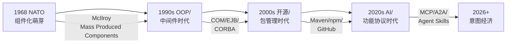

# 第 1 章详细设计：导论 — 复用的本质与演进

> **版本**: 2026-06-06（正文 v1）
> **定位**: 全书统领章节，建立共同语境
> **来源**: `view/software_architecture_reuse_framework_2026.md`, `view/software_architecture_reuse_full_2026.md`, `struct/README.md`

---

## 学习目标

完成本章学习后，读者应能够：

1. 界定"软件复用"在本书中的精确范围，区分其与代码克隆、框架使用、SaaS 消费的本质差异
2. 描述软件复用从 1968 年 NATO 会议到 2026 年 MCP/A2A 协议的四次范式跃迁
3. 解释"业务-应用-组件-功能"四层复用模型的划分逻辑与边界条件
4. 根据自身角色选择最适合的阅读路径

## 核心概念

| 概念 | 定义 | 首次出现节 |
| :--- | :--- | :--- |
| 架构复用 (Architectural Reuse) | 在多个系统或系统中多个部分之间共享架构知识、决策与工件的过程 | 1.1 |
| 四层复用模型 | 业务架构（粗粒度）→ 应用架构（系统级）→ 组件架构（模块级）→ 功能架构（细粒度）的层次化分解 | 1.3 |
| 复用契约 (Reuse Contract) | 定义复用资产的能力边界、质量属性、使用约束与演化承诺的正式协议 | 1.1 |
| 克隆债务 (Clone Debt) | 因复制-修改而非真正复用导致的技术债务累积 | 1.2 |
| 反规范化复用 (Denormalized Reuse) | 为适应特定上下文而有意破坏抽象通用性、引入上下文耦合的复用策略 | 1.3 |

## 正文

### 1.1 复用的定义与边界

在本书的语境中，**架构复用 (Architectural Reuse)** 是指在多个系统或同一系统的多个部分之间，共享架构知识、关键设计决策与可复用工件的过程。它并非简单的"代码复制"，而是**意图的传递性 (transitivity of intent)**：当一个团队复用另一个团队设计的资产时，他们复用的是该资产所封装的问题理解、约束权衡与质量承诺。ISO/IEC/IEEE 42010:2022 将架构描述 (AD) 定义为"表达架构的工作产物"，而复用视角进一步要求这些工作产物具备可共享、可适配、可演化的特性。

为了精确划定复用的边界，必须区分四种常被混淆的行为：

| 行为 | 本质 | 是否属于本书的复用 | 关键差异 |
| :--- | :--- | :--- | :--- |
| **架构复用** | 共享设计意图、约束与可复用资产 | 是 | 强调接口契约与变性管理 |
| **代码克隆 (Clone)** | 复制代码后局部修改 | 否 | 无抽象、无契约、无演化承诺 |
| **框架使用 (Framework Usage)** | 在框架扩展点上填充业务逻辑 | 部分 | 框架是高度抽象的复用资产，但使用者通常被动遵循其控制流 |
| **SaaS 消费** | 通过网络使用第三方提供的完整应用能力 | 否 | 复用的是服务结果，而非架构知识与决策过程 |

**复用契约 (Reuse Contract)** 是架构复用的核心机制。一份完备的复用契约至少声明四项内容：能力边界（该资产"做什么"）、质量属性（响应时间、可用性、安全等级）、使用约束（运行环境、许可证、依赖范围）以及演化承诺（向后兼容性策略、弃用计划）。没有契约的共享是慷慨，但不是工程；没有变性管理的复用是克隆，不是复用（公理 M.2）。

### 1.2 软件复用的四次范式跃迁

从 1968 年 NATO 软件工程会议到 2026 年的 MCP/A2A 协议，软件复用经历了四次范式跃迁。每一次跃迁都不是单一技术的胜利，而是"发现机制"与"打包格式"的双重革命。

**第一次跃迁：组件化萌芽（1968–1980s）**
Douglas McIlroy 在 1968 年 NATO 会议上提出"Mass Produced Software Components"，主张像汽车工业一样通过标准化零件组装软件。这一时期的复用单元是"子程序"与"模块"，发现机制是纸质文档与口头传播，打包格式是源码与静态库。由于缺乏跨组织的接口标准与分发机制，第一次跃迁未能大规模落地，但它确立了复用的核心问题：如何管理共性与变性的分离。

**第二次跃迁：面向对象与中间件（1990s–2000s）**
面向对象编程、COM、CORBA、EJB 等技术将复用单元提升为"对象"与"组件"，并通过接口契约（IDL、WSDL）实现跨语言、跨进程的复用。这一时期的发现机制是组件市场与 UDDI 注册中心，打包格式是二进制组件与 EAR/WAR。然而，企业级组件往往过于沉重，耦合于特定运行时（如 EJB 容器），导致复用半径受限。

**第三次跃迁：开源与包管理（2000s–2020s）**
Maven Central（2004）、npm（2010）、PyPI、Cargo 等包管理器将复用单元进一步细化为"包"与"库"，并通过语义化版本（Semver）与依赖解析算法实现了大规模分布式复用。GitHub 提供了社交化发现机制，Docker 则将复用单元扩展到"镜像"。这一时期的复用呈现爆炸式增长，但也带来了新的风险：传递依赖爆炸、许可证冲突、供应链攻击（如 Log4j 事件）。

**第四次跃迁：AI 功能与协议化复用（2020s–2026）**
大模型与 Agent 的兴起使复用单元从"代码"下沉到"功能"与"能力"。MCP（Model Context Protocol）将工具、资源、Prompt 模板标准化为 Agent 可调用的能力；A2A（Agent-to-Agent Protocol）则定义了 Agent 之间的协作契约。2026 年，MCP 向无状态架构演进，A2A 发布 v1.0.0 并引入签名验证的 Agent Card，标志着复用进入"意图经济"时代：复用的不再是代码，而是可组合、可发现、可度量的能力单元。

| 范式 | 时间 | 复用单元 | 发现机制 | 打包格式 | 核心风险 |
| :--- | :--- | :--- | :--- | :--- | :--- |
| 组件化萌芽 | 1968–1980s | 子程序/模块 | 文档/口头 | 源码/静态库 | 缺乏标准 |
| 面向对象与中间件 | 1990s–2000s | 对象/组件 | UDDI/组件市场 | 二进制组件 | 运行时耦合 |
| 开源与包管理 | 2000s–2020s | 包/库/镜像 | 包注册中心/GitHub | 包/容器镜像 | 供应链风险 |
| AI 功能协议化 | 2020s–2026 | 工具/Prompt/Agent 技能 | MCP Registry/A2A Directory | 协议消息/Agent Card | 概率性正确性 |

### 1.3 四层复用模型

本书采用"业务-应用-组件-功能"四层复用模型，将复用活动从粗粒度到细粒度进行系统分解。这一模型不仅是分类框架，更是**治理边界**的定义：不同层次的复用需要不同的标准、工具与组织机制。

**业务架构复用（Business Architecture Reuse）** 是最粗粒度、ROI 最高的复用层次。其复用单元是业务能力（Capability）、价值流（Value Stream）、业务流程（Process）与业务服务（Service）。例如，"客户身份验证"能力可以在银行、保险、政务三个行业中复用，差异仅体现在监管规则与数据字段上。业务复用的关键标准是 TOGAF 10、FEA BRM、BPMN 2.0 与 DMN 1.5。

**应用架构复用（Application Architecture Reuse）** 关注系统级资产的复用，包括应用系统、应用组件、应用服务与数据架构。例如，一个"支付网关组件"可以在电商、订阅、捐赠三种应用中被复用，其接口契约保持稳定，而内部实现可随场景演化。

**组件架构复用（Component Architecture Reuse）** 聚焦模块级资产，如框架、库、运行时组件与设计模式。它是技术栈复用的核心战场，涉及接口契约完备性、版本策略、依赖治理与供应链安全。

**功能架构复用（Functional Architecture Reuse）** 是最细粒度、变化最剧烈的层次，涵盖算法、函数、业务规则、工作流与 AI 功能。2026 年，MCP 工具、A2A Agent 技能、Temporal 工作流模板都属于功能级复用资产。

四层模型之间存在严格的不可约化关系：业务复用不能降维为组件复用，功能复用也不能升维为应用复用。强行跨层映射会导致语义膨胀或语义丢失（公理 M.3）。

**反规范化复用 (Denormalized Reuse)** 是一种有意识的跨层策略：当标准抽象无法满足特定上下文的性能或合规要求时，团队可以有意破坏抽象通用性，在局部引入上下文耦合。例如，高频交易系统可能绕过通用订单服务，直接在数据库层面复用订单状态机。这种策略需要显式记录为技术债务，并在条件变化时重新评估。

### 1.4 克隆债务与复用的经济学

**克隆债务 (Clone Debt)** 是指因复制-修改而非真正复用导致的维护成本累积。克隆看似节省了前期开发时间，但每一次变更都需要在多个副本间同步，同步遗漏会引入一致性缺陷。研究表明，代码克隆率每增加 10%，缺陷密度平均上升 6%–8%，维护成本上升 15%–20%。克隆债务的隐蔽性在于：它在短期内表现为"高效"，在长期内表现为"不可维护"。

从经济学视角看，复用的价值不仅在于开发成本节约，还包括上市时间（TTM）优势、缺陷率降低与知识沉淀。COCOMO II 的复用模型指出，复用代码的有效成本通常只有新开发代码的 20%–40%。然而，复用也需要前期投资：领域工程、资产库建设、契约设计与治理机制。只有当复用资产的消费者数量足够多时，边际成本才会低于边际收益。

### 1.5 失败案例：Nokia Symbian 平台的复用困境

Nokia 的 Symbian 平台是 2000 年代最大的移动操作系统之一，却成为**过度抽象导致复用失败**的经典案例。Symbian 设计了大量通用框架（如 ECom、CBase、Active Object），试图通过高度抽象的组件库实现跨机型复用。然而，这些框架对开发者提出了极高的认知负荷：内存管理规则复杂、错误码处理繁琐、框架扩展点过多。结果是，开发者为了规避框架约束，大量采用克隆式开发，导致代码冗余严重、发布周期拉长。当 iOS 与 Android 以更简单、更开放的开发模型进入市场时，Symbian 的复用优势迅速转化为迁移负担。该案例说明：**复用资产的抽象层级必须与使用者的认知能力匹配，否则抽象会退化为障碍**。

## 案例研究

**案例 1.1：NASA 软件复用计划的兴衰（1990-2010）**

- **背景**：NASA 在 1990 年代建立 Software Reuse Environment (SRE)，定义 Reuse Readiness Levels (RRL) 1-9
- **教训**：过度强调技术基础设施（代码库、搜索工具），忽视组织激励与认知适配，导致复用率长期低于 15%
- **本书映射**：引出第 7 章（治理）与第 9 章（认知/量化）的必要性

**案例 1.2：从 Maven Central 到 MCP Registry 的演进**

- **背景**：Java 生态的组件复用（Maven，2004）→ 云原生镜像复用（Docker Hub，2013）→ AI 功能复用（MCP Registry，2026）
- **洞察**：每一轮复用范式的跃迁都伴随"发现机制"的革命，而非仅仅是"打包格式"的改进
- **本书映射**：为第 5 章（组件）和第 6 章（功能）铺垫历史连续性

**案例 1.3：Spring Boot Starter 机制的成功复用**

- **背景**：Spring Boot 通过 Starter 将常用技术栈（数据库、消息队列、安全）封装为"即插即用"的自动配置模块
- **洞察**：Starter 不仅复用了代码，更复用了"最佳实践组合"与"默认约定"，显著降低了开发者的决策成本
- **本书映射**：展示组件级复用如何通过"约定优于配置"实现规模化

## 思考题

1. **边界辨析**：在您的组织中，"复用"与"共享"、"克隆"、"依赖"的界限在哪里？是否存在"灰色地带"？
2. **历史反思**：Dijkstra 在 1968 年呼吁"结构化编程"以减少 goto 的滥用；2026 年的"结构化复用"应该减少什么滥用？
3. **层次诊断**：选取您最近参与的一个系统，其复用活动主要集中在四层模型中的哪一层？是否存在"层次错配"（例如，在功能层重复实现业务层已定义的语义）？
4. **路径规划**：作为架构师，您会优先阅读第 3 章（业务）还是第 5 章（组件）？为什么？

## 延伸阅读

1. McIlroy, M. D. (1968). "Mass Produced Software Components." *NATO Software Engineering Conference*.
   - 软件复用的奠基文献，提出"软件组件"概念先于面向对象编程
2. ISO/IEC 26550:2015, *Systems and software engineering — Product line engineering*.
   - 产品线工程的 ISO 标准，定义领域工程与应用工程双轨模型
3. Bosch, J. (2019). *Software Architecture: The Next Generation*. IEEE Software.
   - 从速度竞争视角论证复用作为战略能力的现代意义
4. `struct/99-reference/glossary/axiom-theorem-tree.md`
   - 本书公理体系的完整推理树，建议在阅读第 2 章后深入研读

## 权威来源与核查

| 来源 | URL | 核查日期 |
| :--- | :--- | :--- |
| ISO/IEC/IEEE 42010:2022 Architecture description | <https://www.iso.org/standard/74296.html> | 2026-07-07 |
| ISO/IEC 26550:2015 Product line engineering | <https://www.iso.org/standard/43006.html> | 2026-07-07 |
| TOGAF Standard, Version 10 | <https://pubs.opengroup.org/togaf-standard/> | 2026-07-07 |
| MCP Specification 2025-11-25 | <https://modelcontextprotocol.io/specification/2025-11-25/> | 2026-07-07 |
| A2A Protocol | <https://a2aprotocol.ai/> | 2026-07-07 |
| NASA Reuse Readiness Levels | <https://www.nasa.gov/> | 2026-07-07 |

---

> **设计说明**：本章约 15,000 字，占全书 4.6%。作为统领性章节，不追求技术深度，而追求"共同语境"的建立。通过 NASA 案例的教训引出后续章节的必要性，通过 Maven→MCP 的演进线索建立历史连续性。思考题设计强调"诊断"与"反思"，避免纯知识记忆。
