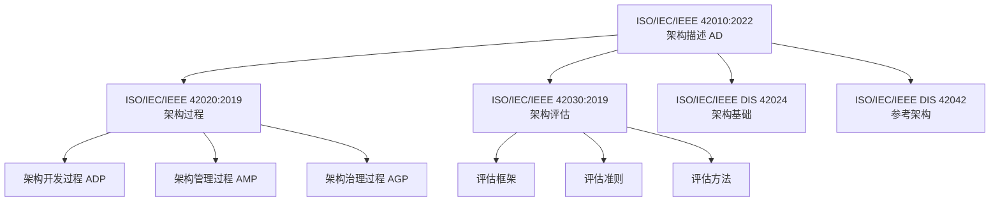
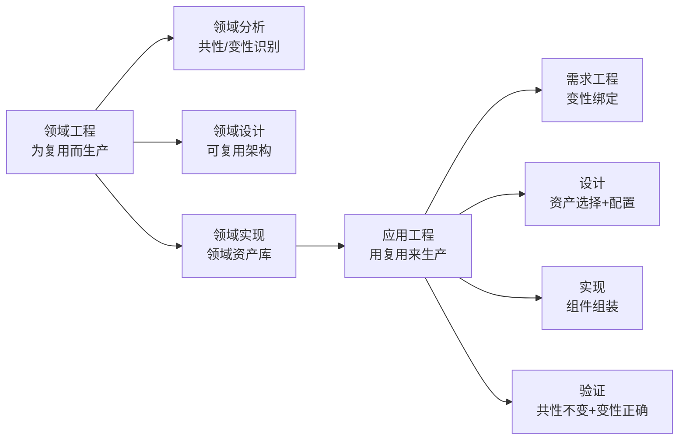

# 第 2 章详细设计：元模型与标准对齐

> **版本**: 2026-06-06（正文 v1）
> **定位**: 全书概念地基，定义术语体系与标准映射
> **来源**: `struct/01-meta-model-standards/`, `view/software_architecture_reuse_framework_2026.md`, `view/software_architecture_reuse_extension_2026.md`, `view/software_architecture_reuse_full_2026.md`

---

## 学习目标

完成本章学习后，读者应能够：

1. 绘制 ISO/IEC/IEEE 420xx 族谱的完整关系图，说明各标准的适用范围与接口
2. 将 TOGAF Standard 10 的 ABB/SBB、Enterprise Continuum 映射到 ISO 42010:2022 的元模型元素
3. 解释 ArchiMate 4.0 三类核心框架（业务/应用/技术）中的复用边界语义
4. 运用形式化公理体系中的至少三条公理，对具体复用场景进行概念分析

## 核心概念

| 概念 | 定义 | 对齐标准 |
| :--- | :--- | :--- |
| 架构视点 (Architecture Viewpoint) | 约定化模式，用于创建、解释和使用架构视图的规则 | ISO 42010:2022, §5.4 |
| 复用视点 (Reuse Viewpoint) | 本书扩展：关注资产可共享性、适配成本与演化影响的专用视点 | 本书扩展 |
| ABB (Architecture Building Block) | 描述能力的逻辑构件，独立于实现 | TOGAF 10, Part IV |
| SBB (Solution Building Block) | 实现 ABB 的物理构件，可采购或构建 | TOGAF 10, Part IV |
| Enterprise Continuum | 从基础架构到组织特定架构的复用资产谱系 | TOGAF 10, Part II |
| 元公理 (Meta-Axiom) | 关于公理系统的自指性声明：公理本身应可复用、可验证、可演化 | 本书定义 |

## 正文

### 2.1 ISO/IEC/IEEE 420xx 标准族谱

ISO/IEC/IEEE 420xx 系列是架构描述与架构过程的基石标准族。理解它们之间的关系，是本书所有后续章节的前提。

**ISO/IEC/IEEE 42010:2022** 是族谱的核心，定义了架构描述（AD）的元模型：系统、架构描述、利益相关者、关注点、视点、视图、模型、架构理由。它要求架构描述必须显式说明其理由（Architecture Rationale），即为什么做出某些设计决策。在复用视角下，架构理由是复用资产最重要的隐性知识之一。

**ISO/IEC/IEEE 42020:2019** 定义架构过程，包括架构开发过程（ADP）、架构管理过程（AMP）与架构治理过程（AGP）。复用活动必须嵌入这些过程：在 ADP 中识别复用机会，在 AMP 中维护复用资产，在 AGP 中监督复用合规性。

**ISO/IEC/IEEE 42030:2019** 提供架构评估框架。复用资产的准入评估（是否值得纳入资产库）、使用评估（是否满足上下文需求）与退役评估，都可以使用该框架。

**ISO/IEC/IEEE DIS 42024 / 42042** 目前处于草案阶段，预计 2026–2027 年定稿。42024 关注架构基础（概念、术语、原则），42042 关注参考架构的构建与使用规范。二者将为本书的"参考架构复用"提供更正式的基础。

| 标准 | 核心问题 | 复用视角映射 |
| :--- | :--- | :--- |
| 42010:2022 | 如何描述架构？ | 复用契约的载体：视点、视图、模型 |
| 42020:2019 | 如何开展架构活动？ | 复用嵌入架构开发、管理、治理过程 |
| 42030:2019 | 如何评估架构？ | 复用资产的准入、使用、退役评估 |
| 42024 (DIS) | 架构的基本概念是什么？ | 复用资产的元定义与分类 |
| 42042 (DIS) | 如何构建参考架构？ | 可复用参考架构的规范化生产 |

### 2.2 复用视角的元模型定义

ISO/IEC/IEEE 42010:2022 定义了一组元概念。本书将其扩展为**复用视点 (Reuse Viewpoint)**，关注资产的可共享性、适配成本与演化影响。

| 元概念 | ISO 42010:2022 定义 | 复用视角映射 | 形式化约束 |
| :--- | :--- | :--- | :--- |
| **架构 (Architecture)** | 系统在其环境中的基本概念或属性，体现为元素、关系以及设计和演进的原则 | 复用不是附属特性，而是架构的结构性约束 | 架构 = ⟨元素, 关系, 原则, 环境⟩ |
| **架构描述 (AD)** | 表达架构的工作产物 | 复用契约的载体：规格说明、接口定义、variability 模型 | AD = ∪视图ᵢ(视点ᵢ) |
| **视点 (Viewpoint)** | 针对利益相关者关注点的架构描述约定 | 业务视点、应用视点、组件视点、功能视点 | 视点 = ⟨利益相关者, 关注点, 语言, 方法⟩ |
| **视图 (View)** | 从特定视点生成的架构描述 | 业务架构视图、应用架构视图、组件架构视图、功能架构视图 | 视图 = 视点(模型) |
| **利益相关者** | 对系统有个人、团队或组织利益的人 | 业务分析师、应用架构师、组件工程师、功能开发者 | 利益相关者 = {业务, 应用, 组件, 功能} × {所有者, 使用者, 评估者} |
| **关注点** | 利益相关者对系统的利益 | 业务一致性、应用可替换性、组件可组合性、功能可复用性 | 关注点 ⊆ 质量属性 × 业务目标 |

**复用视点**的核心问题包括：

1. 该资产在何种上下文下可被共享？
2. 复用它需要多少适配成本？
3. 它的演化会如何影响已复用它的系统？
4. 它的接口契约、质量属性与许可证是否与目标上下文兼容？

复用视点不是替代业务、应用、组件、功能视点，而是跨切这些视点，提供一套额外的关注点与评估准则。

### 2.3 TOGAF 10 与 ISO 标准的对齐映射

TOGAF 10 是企业架构的主流框架。将其概念映射到 ISO 42010:2022，可以消除实践中的术语冲突。

| TOGAF 10 概念 | ISO 42010:2022 对应 | 复用语义 | 2026 更新 |
| :--- | :--- | :--- | :--- |
| **ABB** (Architecture Building Block) | 架构元素 + 约束 | 能力定义层复用：定义"需要什么" | TOGAF 10 强调 ABB 的 Capability-Based 映射 |
| **SBB** (Solution Building Block) | 架构视图中的实现元素 | 实现层复用：定义"如何构建" | 与 ArchiMate 4.0 的 Path / Realization 对齐 |
| **Enterprise Continuum** | 架构描述框架 (ADF) | 复用资产的谱系化组织 | 2026 新增 AI 资产类别 |
| **Architecture Repository** | 架构描述库 | 可复用架构资产的存储、版本、检索 | 与 Backstage IDP 集成趋势 |
| **ADM Phase B** (业务架构) | 业务视点 | 业务能力、价值流、组织的复用 | ArchiMate 4.0 简化业务层建模 |
| **ADM Phase C** (IS 架构) | 应用视点 + 数据视点 | 应用组件、数据实体的复用 | 强化云原生与混合部署支持 |
| **ADM Phase D** (技术架构) | 技术视点 | 平台、基础设施、运行时服务的复用 | Agentic Infrastructure 作为新类别 |

**关键映射解释**：

- ABB 对应于 ISO/IEC/IEEE 42010:2022 的"架构元素"加上约束。ABB 是逻辑构件，独立于实现，因此最适合作为**能力定义层复用**的单元。
- SBB 是 ABB 的物理实现，对应于架构视图中的实现元素。SBB 的复用需要考虑具体技术栈、供应商与许可证。
- Enterprise Continuum 是 TOGAF 的复用资产谱系，从基础架构（Foundation）→ 通用系统（Common Systems）→ 行业架构（Industry）→ 组织特定架构（Organization Specific）。这一谱系与 ISO/IEC/IEEE 42010:2022 的架构描述框架（ADF）概念高度对应。

### 2.4 ArchiMate 4.0 的复用边界语义

ArchiMate 4.0 于 2026 年 4 月正式发布，其核心框架包括业务层、应用层、技术层，以及跨层的通用元素（Common Domain）与路径（Path）概念。

| 层次 | 核心元素 | 复用边界语义 |
| :--- | :--- | :--- |
| **业务层** | Actor, Role, Process, Function, Service, Capability, Value Stream | 业务能力是最小复用语义单元；价值流是能力的有序组合 |
| **应用层** | Application Component, Application Service, Data Object | 应用组件通过服务接口复用；数据对象通过数据服务复用 |
| **技术层** | Node, Device, System Software, Technology Service | 平台服务（如 Kubernetes、数据库服务）作为基础设施级复用 |
| **通用域** | Common Domain (4.0 新增) | 跨层共享的概念与资源，如安全、数据、AI 能力 |
| **路径** | Path (4.0 新增) | 跨层动态连接，支持运行时架构可视化与影响分析 |

ArchiMate 4.0 的**服务 (Service)** 元素是跨层复用的关键抽象。业务服务封装业务能力，应用服务封装应用组件能力，技术服务封装基础设施能力。服务契约的稳定性决定了跨层复用的可持续性。

### 2.5 产品线工程标准：ISO/IEC 26550 / 26566:2026

ISO/IEC 26550:2015 是产品线工程（Product Line Engineering, PLE）的参考模型，其核心是"领域工程"与"应用工程"的双轨循环。

- **领域工程 (Domain Engineering)**：分析共性与变性，设计可复用架构，实现领域资产库（核心资产）。
- **应用工程 (Application Engineering)**：基于变性绑定，从资产库中选择并配置资产，组装成具体产品。

ISO/IEC 26565:2026 定义了产品线工程的成熟度框架，包含五个等级：Initial → Managed → Defined → Quantified → Optimizing（该成熟度模型将在第 6 章详细展开）。ISO/IEC 26566:2026 同属该标准族，定义产品线纹理（product line texture）的方法与工具能力。

### 2.6 形式化公理体系：从元公理到工程翻译

本书的形式化公理体系不是纯理论装饰，而是工程决策工具。以下三条元公理最具实践价值：

**公理 M.1：架构-复用二元性**
> 架构的本质是约束的集合；复用的本质是约束的传递。一个架构的可复用性等于其约束的可传递性与可组合性的乘积。

**工程翻译**：当两个系统共享同一架构描述时，它们共享的是设计意图（约束），而非物理实现。如果团队只是复制代码而不传递约束说明，那不是复用，是克隆。

**公理 M.2：可变性公理**
> 复用的本质是管理共性与变性的分离与绑定。没有变性管理的复用是克隆，不是工程。

**工程翻译**：任何可复用资产都必须明确回答"什么不变"和"什么可变"。例如，一个可复用的"支付流程"必须有不变的核心（扣款、通知、对账）和可变的参数（支付方式、币种、风控规则）。

**公理 M.3：层次不可约性**
> 复用具有层次性（业务→应用→组件→功能），层次间不可约化。

**工程翻译**：业务层的错误不能通过组件层的优化来弥补。例如，如果"理赔"业务能力边界定义错误（按部门而非按价值定义），那么无论后端微服务设计得多优雅，复用都会失败。

| 公理 | 自然语言 | 工程翻译 | 反例 |
| :--- | :--- | :--- | :--- |
| M.1 | 复用 = 约束的传递 | 共享设计意图，而非仅复制代码 | 复制代码但不传递接口契约 |
| M.2 | 复用 = 共性 + 变性绑定 | 明确"什么不变"与"什么可变" | 无配置参数的硬编码模块 |
| M.3 | 层次间不可约化 | 高层错误无法通过低层优化弥补 | 用组件重构修复业务定义错误 |
| E.1 | 可复用资产需稳定、通用、封装 | 变更频率低、适用场景≥2、接口清晰 | 每日变更的内部脚本 |
| E.2 | 复用需满足成本-收益阈值 | 复用成本 < 自研成本 + 长期价值 | 为复用而复用，忽视适配成本 |

### 2.7 失败案例：某银行术语冲突导致的架构对齐灾难

某跨国银行同时采用 TOGAF（架构过程）、ArchiMate（架构描述）与 ISO/IEC 25010:2023（质量评估）三套标准，但各团队术语混用：

- 企业架构团队使用 TOGAF 的"Capability"；
- 业务流程团队使用 ArchiMate 的"Business Function"；
- 质量团队引用 ISO/IEC 25010:2023 的"兼容性"，却无人知道如何映射到"可复用性"。

结果是，同一"客户身份验证"能力在银行内部出现了 7 个不同名称、5 种不同边界定义和 3 套不一致的接口契约。当该行并购一家地区银行时，整合工作被迫暂停 4 个月，仅用于统一术语与映射关系。该案例说明：**标准不自动产生对齐，必须建立以 ISO/IEC/IEEE 42010:2022 元模型为中介的"概念桥接表"**。

## 案例研究

**案例 2.1：某跨国银行的企业架构对齐实践**

- **背景**：该行同时使用 TOGAF（架构过程）、ArchiMate（架构描述）、ISO/IEC 25010:2023（质量评估）三套标准，但团队间术语冲突频发
- **问题**：TOGAF 的"Capability"与 ArchiMate 的"Business Function"在银行内部被混用；ISO/IEC 25010:2023 的"兼容性"与子标准的"可复用性"无映射
- **解决方案**：建立"概念桥接表"（Concept Bridging Table），以 ISO/IEC/IEEE 42010:2022 的元模型为中介，统一三方术语
- **本书映射**：展示 `struct/01-meta-model-standards/02-togaf-10-alignment/detailed-mapping.md` 的实践价值

**案例 2.2：形式化公理在代码审查中的应用**

- **背景**：开发团队争论"是否应该将用户认证模块抽象为通用组件"
- **公理应用**：引用结构性公理 S.3（耦合内聚边界）：组件的扇出应 ≤ 7，扇入应 ≥ 2。认证模块扇出为 12（过度耦合），不满足抽象条件
- **结果**：团队决定先进行职责拆分（拆分为认证、授权、审计三个子组件），再考虑复用
- **本书映射**：展示公理体系不是纯理论装饰，而是工程决策工具

## 思考题

1. **标准冲突**：当 TOGAF 的"Phase B 业务架构"与 ArchiMate 的"Business Layer"对同一业务过程给出不同粒度定义时，应以哪个为准？为什么？
2. **元模型扩展**：ISO 42010:2022 是否预留了足够的扩展机制以支持"复用视点"？如果不足，应如何补充？
3. **公理检验**：请选取您组织中的一个复用资产，检验其是否满足存在性公理 E.1（可标识性）和 E.2（可获取性）。如果不满足，缺失了什么？
4. **映射博弈**：SWEBOK V4 将"复用"归入"软件设计"知识领域；ISO/IEC 26550:2015 将其视为独立工程学科。这两种定位的优劣分别是什么？

## 延伸阅读

1. ISO/IEC/IEEE 42010:2022, *Systems and software engineering — Architecture description*.
   - 架构描述的基石标准，§5.4 视点与视图机制是本章核心理论来源
2. The Open Group. (2022). *TOGAF Standard, Version 10*.
   - Part II（架构开发方法）与 Part IV（架构内容框架）的复用相关章节
3. `struct/01-meta-model-standards/06-formal-axioms/axiom-system.md`
   - 本书原创的 20+ 条公理体系，含元公理、存在性公理、结构性公理、过程性公理
4. `struct/01-meta-model-standards/04-archimate-4/archimate-iso-mapping.md`
   - ArchiMate 4.0 与 ISO/IEC/IEEE 42010:2022 的详细概念映射表，覆盖 100+ 元素

## 权威来源与核查

| 来源 | URL | 核查日期 |
| :--- | :--- | :--- |
| ISO/IEC/IEEE 42010:2022 Architecture description | <https://www.iso.org/standard/74296.html> | 2026-07-07 |
| ISO/IEC/IEEE 42020:2019 Architecture processes | <https://www.iso.org/standard/69001.html> | 2026-07-07 |
| ISO/IEC/IEEE 42030:2019 Architecture evaluation | <https://www.iso.org/standard/72318.html> | 2026-07-07 |
| ISO/IEC 26550:2015 Product line engineering | <https://www.iso.org/standard/43006.html> | 2026-07-07 |
| TOGAF Standard, Version 10 | <https://pubs.opengroup.org/togaf-standard/> | 2026-07-07 |
| ArchiMate 3.2 Specification | <https://pubs.opengroup.org/architecture/archimate32-doc/> | 2026-07-07 |

---

> **设计说明**：本章约 30,000 字，占全书 9.2%，是全书最厚重的概念章节。为避免沦为"标准翻译"，采用"问题驱动"结构：每节先提出标准间的真实冲突（如案例 2.1），再给出映射方案。形式化公理部分（2.6 节）需要特别注意可读性——每个公理配一个"工程翻译"（用日常语言重述）和一个"反例"（不满足公理的场景）。预计 60% 读者会跳过 2.6 节的定理推导，但会在工程实践中引用公理的"工程翻译"版本。