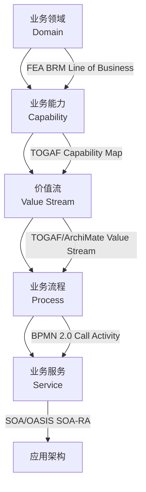

# 第 3 章详细设计：业务架构复用

> **版本**: 2026-06-06（正文 v1）
> **定位**: 最粗粒度的复用层次，ROI 最高的复用领域
> **来源**: `struct/02-business-architecture-reuse/`, `view/software_architecture_reuse_full_2026.md`, `view/software_architecture_reuse_extension_2026.md`

---

## 学习目标

完成本章学习后，读者应能够：

1. 使用五层业务复用模型（领域→能力→价值流→流程→服务）分析组织的复用机会
2. 绘制 FEA BRM 与 TOGAF Capability Map 的交叉映射图，识别能力缺口
3. 运用 BPMN 2.0 的 Call Activity 和 DMN 1.5 的 Decision Service 设计可复用业务流程
4. 识别并规避业务复用的三种核心反模式（流程克隆、能力膨胀、价值流断裂）

## 核心概念

| 概念 | 定义 | 来源 |
| :--- | :--- | :--- |
| 业务能力 (Business Capability) | 组织为达成特定结果而具备的稳定能力，边界由价值创造定义 | TOGAF 10, BIZBOK |
| 能力原子性 (Capability Atomicity) | 公理 2.1：业务能力是可复用的最小业务语义单元 | 本书公理体系 |
| 价值流 (Value Stream) | 端到端的活动序列，为关键利益相关者交付价值成果 | BIZBOK 3.0 |
| BPMN Call Activity | 调用独立定义的、可复用的流程定义的活动 | BPMN 2.0, §10.2.3 |
| DMN Decision Service | 封装决策逻辑为可调用服务的标准化接口 | DMN 1.5, §8 |
| 流程克隆 (Process Cloning) | 反模式：通过复制-修改而非参数化复用创建流程变体 | 本书定义 |

## 正文

### 3.1 业务复用的五层层次结构

业务架构复用是 ROI 最高的复用层次，因为它处理的是最稳定的组织知识：业务做什么、为谁做、如何创造价值。本书将业务复用划分为五个层次，从粗到细依次为业务领域、业务能力、价值流、业务流程与业务服务。



| 层次 | 定义 | 标准对齐 | 复用单元 | 变性管理 |
| :--- | :--- | :--- | :--- | :--- |
| **业务领域** | 跨行业/组织的宏观业务领域 | FEA BRM Line of Business | 领域知识、监管框架、流程模板 | 行业法规、地域合规、市场规模 |
| **业务能力** | 组织执行特定业务活动的能力 | TOGAF Capability Map | 能力定义、成熟度评估、能力热力图 | 能力级别、组织规模、技术无关性 |
| **价值流** | 端到端价值交付的活动序列 | TOGAF Value Stream + ArchiMate | 价值阶段、触发事件、交付物、KPI | 阶段数量、并行/串行、交付物格式 |
| **业务流程** | 可编排、可自动化的活动序列 | BPMN 2.0 + ISO 12207 | 流程模型、任务、决策规则、泳道 | 流程变量、条件网关、子流程引用 |
| **业务服务** | 对外暴露的业务能力接口 | SOA + ArchiMate Business Service | 服务契约、SLA、服务级别目标 | 版本、多租户、协议适配 |

**业务领域复用**是最高层、最抽象的复用。例如，"支付清算"领域模型可以在银行业、保险业、证券业中复用，但差异在于监管要求与清算周期。当领域间监管差异超过共性 60% 时，应降级为参考模型而非直接复用。

**业务能力复用**是最关键的业务复用单元。根据公理 2.1（能力原子性），业务能力的边界必须由**价值创造**定义，而非组织结构。例如，"客户身份验证"能力应作为一个统一能力，无论在零售、金融还是政务场景中，其核心语义不变，差异体现在 KYC 规则与数据源。

**价值流复用**是业务能力的有序组合。定理 2.1 指出：价值流 V 的复用等价于 {Cᵢ} 的有序组合加上阶段间契约的复用。例如，"订单到现金"（Order-to-Cash）价值流在制造业、零售业、服务业中复用时，阶段序列保持稳定，但每个阶段的触发条件与交付物可能不同。

### 3.2 国际标准对齐：FEA BRM、TOGAF 与 BPMN/DMN

业务架构复用涉及多个互补标准：

| 标准/框架 | 业务复用核心概念 | 复用单元 | 2026 状态 |
| :--- | :--- | :--- | :--- |
| **FEA BRM** | 业务线 → 子功能 → 活动 | 业务领域模板、政府服务目录 | 美国联邦跨机构复用基准 |
| **TOGAF 10 Phase B** | 业务能力 + 价值流 + 组织单元 | 能力地图、价值流模型 | 强调 Capability-Based Planning |
| **ArchiMate 4.0** | 业务行为元素 + 业务结构元素 | 业务服务、业务功能、业务事件 | 4.0 引入 Common Domain 与 Path |
| **BPMN 2.0** | 流程、任务、网关、事件 | 流程模型、决策表、编排定义 | 与 DMN 联合使用 |
| **DMN 1.5** | 决策模型、决策表、业务知识模型 | 决策逻辑、规则集、评分卡 | 业务规则复用标准 |

FEA（Federal Enterprise Architecture）BRM 通过"业务线→子功能→活动"三层分解，实现了跨 24 个美国联邦机构的业务流程标准化复用。其五层业务线结构包括：公共服务、交付模式、支撑服务、管理功能、资源管理。FEA BRM 的价值不在于让机构完全复用同一流程，而在于提供了一个共同的"业务语言"，使跨机构互操作与信息共享成为可能。

TOGAF 10 的 Phase B 强调 Capability-Based Planning，即基于能力而非项目或系统来规划投资。能力是稳定的，而实现能力的技术与组织形式是变化的。因此，以能力为单元的复用具有更长的生命周期。

### 3.3 BPMN 2.0 与 DMN 1.5 的复用机制

BPMN 2.0 与 DMN 1.5 是业务层复用的两大技术支柱。BPMN 负责"流程如何执行"，DMN 负责"决策如何做"。二者互补，共同支持可复用的业务流程设计。

**BPMN 2.0 复用元素**：

| BPMN 元素 | 复用语义 | 变性管理 | 标准章节 |
| :--- | :--- | :--- | :--- |
| **Call Activity** | 调用外部可复用流程 | 被调流程的版本、参数绑定 | §10.2.3 |
| **Event Sub-Process** | 可复用的事件处理逻辑 | 事件类型、触发条件 | §10.4.3 |
| **Sub-Process** | 嵌入可复用子流程 | 输入/输出数据映射 | §10.3 |
| **Message Flow** | 跨组织/跨系统的服务契约 | 消息格式、协议适配 | §8.3 |

Call Activity 是流程级复用的核心机制。通过 `calledElement` 属性，主流程可以在不修改自身的情况下调用外部流程定义。例如：

```xml
<callActivity id="call_payment_process" name="调用支付流程"
    calledElement="payment_process_v2">
    <ioSpecification>
        <dataInput id="input_amount" name="amount"/>
        <dataOutput id="output_status" name="status"/>
    </ioSpecification>
    <inputAssociation>
        <sourceRef>order_total</sourceRef>
        <targetRef>input_amount</targetRef>
    </inputAssociation>
</callActivity>
```

**DMN 1.5 复用元素**：

| DMN 元素 | 复用语义 | 变性管理 | 标准章节 |
| :--- | :--- | :--- | :--- |
| **Decision** | 可复用决策节点 | 决策逻辑版本、输入数据变异 | §6.3 |
| **Business Knowledge Model (BKM)** | 可复用业务知识封装 | 知识模型参数化、上下文绑定 | §6.3.5 |
| **Decision Table** | 规则集的表格化复用 | 规则条件、动作、命中策略 | §8 |
| **Decision Service** | 将决策封装为可调用服务 | 输入/输出标准化、版本管理 | §8 |

DMN Decision Service 允许将决策逻辑封装为标准化接口，被 BPMN 流程或其他服务调用。这种"流程+决策"的分离是业务复用的最佳实践：流程结构稳定，规则变化频繁。

### 3.4 业务复用的多维对比矩阵

| 维度 | 业务领域 | 业务能力 | 价值流 | 业务流程 | 业务服务 |
| :--- | :--- | :--- | :--- | :--- | :--- |
| **复用粒度** | 粗（跨行业） | 中粗（跨部门） | 中（跨功能） | 中细（跨任务） | 细（跨系统） |
| **变性程度** | 极高 | 高 | 中 | 低-中 | 低 |
| **治理强度** | 弱（参考性） | 中强 | 中 | 强 | 极强 |
| **技术绑定** | 无 | 无 | 低 | 中 | 高 |
| **生命周期** | 年-十年 | 年 | 季度-年 | 月-季度 | 周-月 |
| **复用度量** | 领域覆盖率 | 能力复用率 | 价值交付周期 | 流程自动化率 | API 调用量 |

该矩阵揭示了业务复用的核心张力：**粒度越粗，复用潜力越大，但变性管理越复杂；粒度越细，治理越精确，但战略价值越低**。业务架构师的工作就是在这五个层次间找到组织当前最需要的复用杠杆点。

### 3.5 业务复用决策判定树

```text
业务复用决策判定树
├── 输入: 业务需求 R，候选复用资产 A
│
├── 1. 语义兼容性判定
│   ├── R 的业务领域 ⊆ A 的业务领域？
│   │   ├── 否 → 拒绝复用 / 领域适配层设计
│   │   └── 是 → 继续
│   └── R 的监管约束 ⊆ A 的监管约束？
│       ├── 否 → 合规性改造 / 拒绝复用
│       └── 是 → 继续
│
├── 2. 能力匹配判定
│   ├── A 的业务能力集合 C(A) ⊇ R 的需求能力集合 C(R)？
│   │   ├── 否 → 能力缺口分析 / 部分复用
│   │   └── 是 → 继续
│   └── 能力级别匹配: L(A) ≥ L(R)？
│       ├── 否 → 能力升级 / 降级使用
│       └── 是 → 继续
│
├── 3. 价值流兼容性判定
│   ├── A 的价值阶段序列与 R 的价值阶段序列可对齐？
│   │   ├── 否 → 价值流重构
│   │   └── 是 → 继续
│   └── 阶段间契约 I(A) 与 I(R) 可交集？
│       ├── 否 → 适配器设计
│       └── 是 → 继续
│
├── 4. 流程/服务绑定判定
│   ├── 绑定时机选择:
│   │   ├── 编译期绑定 → 流程硬编码（低变性）
│   │   ├── 配置期绑定 → BPMN 模型 + 规则引擎（中变性）
│   │   ├── 运行期绑定 → 动态服务编排（高变性）
│   │   └── 动态期绑定 → 自适应流程（AI 驱动）
│   └── 输出: 绑定配置 + 变性模型
│
└── 输出: 复用决策 + 适配策略 + 风险登记
```

### 3.6 业务复用的三种核心反模式

**反模式一：流程克隆 (Process Cloning)**
通过复制流程模型后仅做表面修改来创建变体。症状是流程库中步骤重复率高、命名不一致。规避策略是使用 BPMN Call Activity + DMN Decision Service 实现参数化复用。

**反模式二：能力膨胀 (Capability Bloat)**
将过多功能归入单一业务能力，导致复用粒度失衡、替换困难。例如，将"客户管理"作为一个大能力，包含开户、投诉、营销、流失预警等差异巨大的功能。规避策略是遵循能力原子性公理，按价值创造边界拆分。

**反模式三：价值流断裂 (Value Stream Break)**
价值流阶段间缺乏契约定义，导致端到端价值追踪失败。典型症状是部门各自优化本地 KPI，但客户体验恶化。规避策略是显式定义阶段间接口（SLA、数据契约、触发条件）。

| 反模式 | 症状 | 根因 | 规避策略 |
| :--- | :--- | :--- | :--- |
| 流程克隆 | 步骤重复率高、命名不一致 | 缺乏变性管理机制 | BPMN Call Activity + DMN |
| 能力膨胀 | 能力边界模糊、替换困难 | 违反能力原子性公理 | 按价值创造拆分能力 |
| 价值流断裂 | 端到端价值不可追踪 | 阶段间契约缺失 | 显式定义 SLA 与数据契约 |
| 规则硬编码 | 规则变更需改流程 | 流程与决策未分离 | DMN Decision Service |
| 服务过度抽象 | 接口过于通用、调用方困惑 | 业务语义丢失 | 接口契约包含业务语义注释 |

### 失败案例：某零售集团的价值流断裂危机

某零售集团的"采购→库存→销售"价值流在"库存"环节断裂。原因是库存系统按仓库组织（每个仓库独立管理），而非按商品价值链组织。当顾客在线上下单时，系统无法判断哪个仓库的库存最能保障交付体验，导致超卖、延迟发货与客户投诉激增。

根因分析：能力边界由组织结构（仓库归属）而非价值创造（商品可得性）定义，违反了公理 2.1（能力原子性）。修复方案是重构业务能力为"商品可得性管理"（跨仓库），原仓库管理降为技术实现细节。该案例说明：**业务复用的失败往往不是技术问题，而是价值定义问题**。

## 案例研究

**案例 3.1：某保险公司的"理赔能力地图"重构**

- **背景**：该公司在 12 个业务线中各自维护理赔流程，导致 87% 的流程步骤重复但命名不一致
- **分析**：使用 FEA BRM 框架，识别出"理赔 adjudication"是跨业务线的通用能力；差异仅在于规则参数（车险 vs 健康险的免赔额计算）
- **方案**：将共性流程建模为 BPMN Call Activity（可复用核心），将差异规则封装为 DMN Decision Service（可配置变体）
- **成效**：流程维护成本降低 40%，新业务线上线时间从 6 个月缩短至 6 周
- **本书映射**：直接引用 `struct/02-business-architecture-reuse/02-business-capability/fea-brm-togaf-mapping.md`

**案例 3.2：价值流断裂导致的供应链危机**

- **背景**：某零售集团的"采购→库存→销售"价值流在"库存"环节断裂，因为库存系统按仓库组织，而非按商品价值链组织
- **根因**：能力边界由组织结构（仓库归属）而非价值创造（商品可得性）定义，违反公理 2.1
- **修复**：重构业务能力为"商品可得性管理"（跨仓库），原仓库管理降为技术实现细节
- **本书映射**：展示价值流复用（3.3 节）与能力原子性公理的现实威力

**案例 3.3：跨政府机构的 FEA BRM 复用实践**

- **背景**：美国联邦政府通过 FEA BRM 在 24 个机构间建立统一的业务参考模型
- **洞察**：FEA BRM 的价值不在于强制所有机构使用同一流程，而在于提供共同的业务语言，使跨机构互操作成为可能
- **本书映射**：展示业务领域复用的参考模型价值

## 思考题

1. **粒度博弈**：在您组织中，"客户开户"是一个业务能力、一个价值流、还是一个业务流程？不同答案对复用策略有何影响？
2. **反模式诊断**：检查您组织的流程库，计算"克隆指数"（步骤重复率 / 命名一致率）。如果指数 > 3，说明存在严重的流程克隆问题。
3. **BPMN vs DMN 边界**：当业务规则变化频率是流程结构变化频率的 5 倍以上时，应优先使用 DMN Decision Service 而非 BPMN 条件网关。请验证这一假设在您的场景中是否成立。
4. **跨行业复用**：医疗行业的"临床路径"与制造业的"装配流程"在业务语义上是否存在可复用模式？请尝试用价值流语言描述其共性。

## 延伸阅读

1. OMG. (2013). *Business Process Model and Notation (BPMN), Version 2.0*.
   - 第 10.2.3 节 Call Activity 的复用语义是 3.4 节的技术基础
2. OMG. (2023). *Decision Model and Notation (DMN), Version 1.5*.
   - 第 8 章 Decision Service 的标准化接口定义
3. `struct/02-business-architecture-reuse/06-bpmn-dmn/bpmn-dmn-executable-cases.md`
   - 含 5 个可执行 BPMN/DMN 案例，附 Camunda 部署配置
4. `struct/02-business-architecture-reuse/case-studies/industry-vertical-cases.md`
   - 金融、医疗、制造三大行业的垂直复用场景深度分析

## 权威来源与核查

| 来源 | URL | 核查日期 |
| :--- | :--- | :--- |
| TOGAF Standard, Version 10 | <https://pubs.opengroup.org/togaf-standard/> | 2026-07-07 |
| BPMN 2.0 Specification | <https://www.omg.org/spec/BPMN/2.0/> | 2026-07-07 |
| DMN 1.5 Specification | <https://www.omg.org/spec/DMN/1.5/> | 2026-07-07 |
| FEA Business Reference Model | <https://www.whitehouse.gov/omb/management/fea/> | 2026-07-07 |
| BIZBOK Guide v3.0 | <https://www.businessarchitectureguild.org/> | 2026-07-07 |

---

> **设计说明**：本章约 25,000 字，占全书 7.7%。业务架构复用是全书最具"商业价值"的章节，但也是技术读者最容易低估的章节。设计策略是"以技术精确性包装商业语义"：每个业务概念都给出 BPMN/DMN 的技术映射，避免沦为管理咨询式的空话。案例 3.1 的保险理赔案例需要足够详细（含具体的 BPMN 片段和 DMN 决策表），让读者可以直接借鉴。3.6 节的反模式部分采用"症状-诊断-处方"三段式结构，便于快速查阅。
