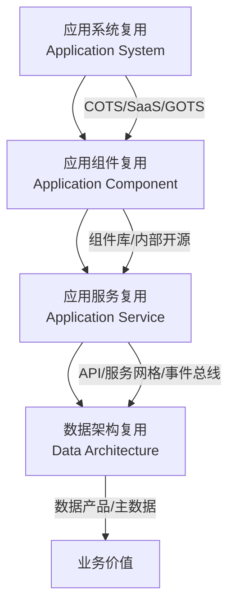
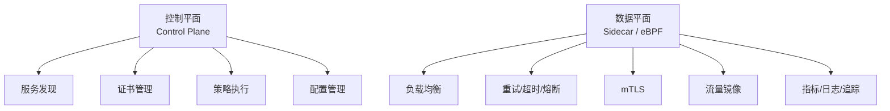
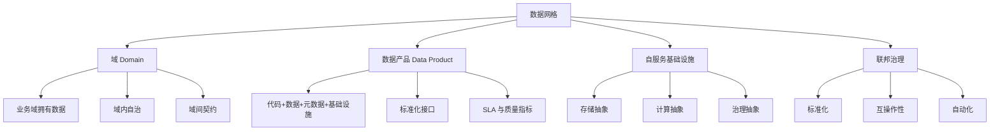

# 第 4 章详细设计：应用架构复用

> **版本**: 2026-06-06（正文 v1）
> **定位**: 系统级复用层次，云原生架构模式的核心战场
> **来源**: `struct/03-application-architecture-reuse/`, `view/software_architecture_reuse_full_2026.md`, `view/software_architecture_reuse_extension_2026.md`

---

## 学习目标

完成本章学习后，读者应能够：

1. 使用八维复用性矩阵（耦合度、内聚度、部署独立性、团队自治性、技术异构性、可观测性、安全性、演化弹性）评估任意架构模式
2. 为给定团队规模（<10人 / 10-50人 / 50-200人 / >200人）和发布频率选择最适配的架构模式
3. 设计 Data Mesh 架构中的域导向数据产品，确保其满足自治性、可发现性和可复用性
4. 在服务网格环境中配置可复用的通信策略（重试、超时、熔断、流量镜像）

## 核心概念

| 概念 | 定义 | 来源 |
| :--- | :--- | :--- |
| 架构模式复用性 (Architectural Pattern Reusability) | 同一模式在不同上下文中的适配成本与价值保留比率 | 本书定义 |
| 模块化单体 (Modular Monolith) | 单部署单元但内部模块边界清晰，支持渐进式拆分的架构风格 | Spring Modulith, CNCF |
| 数据产品 (Data Product) | Data Mesh 中的自治单元，包含代码、数据、元数据和基础设施 | Zhamak Dehghani, 2019 |
| 反腐蚀层 (Anti-Corruption Layer) | 隔离遗留系统语义与新系统模型的适配层模式 | DDD, Evans 2003 |
| Sidecar 模式 | 将横切关注点（日志、监控、安全）剥离为独立容器与主应用共生命周期 | Kubernetes Patterns |
| 数据-应用耦合定理 | 定理 3.2：数据架构与应用架构的复用独立当且仅当数据访问通过抽象数据服务实现 | 本书定理体系 |

## 正文

### 4.1 应用复用的四层层次结构

应用架构复用关注系统级资产的复用，包括应用系统、应用组件、应用服务与数据架构。它是业务架构与技术实现之间的桥梁，直接决定复用资产能否在生产环境中稳定、可扩展地运行。



| 层次 | 定义 | 标准对齐 | 复用模式 | 边界判定 |
| :--- | :--- | :--- | :--- | :--- |
| **应用系统复用** | 完整的可部署应用 | FEA ARM "System" + TOGAF SBB | COTS、GOTS、SaaS、多租户 | 定制代码 > 30% 核心代码时退化为克隆 |
| **应用组件复用** | 应用内自包含的功能模块 | FEA ARM "Component" + ArchiMate | 组件库、内部开源、共享服务 | 复用半径（直接+传递依赖）> 10 时进入高耦合风险区 |
| **应用服务复用** | 应用组件暴露的接口化能力 | SOA Service + ArchiMate Application Service | API 网关、服务网格、事件总线 | 接口契约向后兼容性决定稳定性 |
| **数据架构复用** | 数据模型、实体、服务的复用 | FEA DRM + TOGAF Data Architecture | MDM、Data Mesh、数据产品 | 数据访问必须通过抽象数据服务，而非直接存储耦合 |

### 4.2 应用架构模式的八维复用性矩阵

选择架构模式是应用架构复用的首要决策。本节提供八维复用性矩阵，帮助读者在不同场景下做出理性选择。

| 架构模式 | 复用粒度 | 部署独立性 | 弹性绑定时机 | 复用成熟度 | 运维复杂度 | 团队自治性 | 可观测性 | 2026 趋势 |
| :--- | :--- | :--- | :--- | :--- | :--- | :--- | :--- | :--- |
| **单体 (Monolith)** | 系统级 | 低 | 编译期 | 低 | 低 | 低 | 简单 | 遗留系统 |
| **模块化单体** | 组件级 | 中低 | 编译/启动期 | 中 | 低 | 中 | 中等 | ★ 回归主流 |
| **SOA (ESB 中心)** | 服务级 | 中 | 配置期 | 中高 | 高 | 中 | 复杂 | 企业集成骨干 |
| **微服务** | 服务级 | 高 | 运行期 | 高 | 极高 | 高 | 复杂 | 云原生默认 |
| **微前端** | UI 组件级 | 高 | 运行期 | 中 | 中 | 高 | 中等 | 前端复用扩展 |
| **Serverless/FaaS** | 功能级 | 极高 | 运行期 | 高 | 低 | 高 | 简单 | 成熟 |
| **服务网格** | 通信模式级 | 高 | 运行期 | 中 | 高 | 高 | 复杂 | 基础设施复用 |
| **事件驱动 (EDA)** | 事件/处理器 | 高 | 运行期 | 高 | 高 | 高 | 复杂 | 成熟 |
| **模块化宏服务** | 组件-服务级 | 中 | 编译/运行期 | 中高 | 中 | 中 | 中等 | ★ 新兴 |

**维度解释**：

- **复用粒度**：该模式下可复用单元的典型大小。
- **部署独立性**：单元能否独立部署，是微服务与单体的核心差异。
- **弹性绑定时机**：变性与上下文在编译期、配置期、运行期还是动态期绑定。
- **复用成熟度**：该模式在工业界的可复用程度与工具链支持。
- **运维复杂度**：运行该模式所需的基础设施与运维投入。
- **团队自治性**：康威定律下团队能否独立开发、部署、运维。
- **可观测性**：该模式对日志、指标、追踪的支持难度。

### 4.3 架构模式选择决策树

基于八维矩阵，可以构建场景化的选择决策树：

```text
应用架构模式选择决策树
├── 输入: 团队规模 S，发布频率 F，QPS 峰值 Q，业务复杂度 C
│
├── 1. 团队规模判定
│   ├── S < 10 且 F < 1/天 → 单体或模块化单体
│   ├── 10 ≤ S < 50 且 F ≥ 1/天 → 模块化单体或微服务
│   ├── 50 ≤ S < 200 且 F ≥ 3/天 → 微服务或服务网格
│   └── S ≥ 200 → 微服务 + 服务网格 + 平台工程
│
├── 2. 业务复杂度判定
│   ├── C 低（< 5 个核心域）→ 模块化单体
│   ├── C 中（5-15 个核心域）→ 微服务
│   └── C 高（> 15 个核心域）→ 微服务 + 领域驱动设计
│
├── 3. 数据耦合判定
│   ├── 多个服务共享数据库表 → 优先拆分数据所有权，引入 Data Mesh
│   └── 每个服务拥有独立数据 → 继续使用现有模式
│
├── 4. 事件驱动需求判定
│   ├── 需要异步解耦、流量削峰 → 引入 EDA
│   └── 强一致性要求高 → 避免 EDA，使用同步调用或 Saga
│
└── 输出: 推荐架构模式 + 风险清单 + 演进路径
```

### 4.4 服务网格：通信模式的复用

服务网格（Service Mesh）将微服务间的通信模式（重试、熔断、超时、mTLS、流量分割）从应用代码中抽离，作为基础设施级复用组件。



服务网格的复用价值在于**通信模式的统一化**。当组织内有 N 个微服务时，传统方式需要 N×(N-1)/2 个独立的通信实现；服务网格将其统一为单一基础设施层，实现"一次配置，全局复用"。

然而，服务网格并非免费。Istio 的 Sidecar 模式通常引入约 30% 的延迟开销与显著的内存占用。因此，服务网格最适合以下场景：

- 微服务数量 > 20 个；
- 多语言技术栈，无法通过统一库实现通信模式；
- 强安全要求（mTLS、细粒度访问控制）；
- 需要金丝雀发布、蓝绿部署等高级流量管理。

### 4.5 数据网格：域导向的数据架构复用

数据网格（Data Mesh）是数据架构复用的前沿范式，其核心是将数据从集中式数据仓库/数据湖转变为分布式、域导向、自服务的架构。



数据网格的四大原则：

1. **域导向所有权**：数据由最理解它的业务域拥有，而非集中式数据团队。
2. **数据即产品**：每个数据集都被视为产品，具备可寻址、可发现、可理解、可信赖的特性。
3. **自服务基础设施**：平台团队提供数据基础设施，使域团队能够自主发布和消费数据产品。
4. **联邦治理**：通过标准化、互操作性和自动化实现跨域治理，而非集中式控制。

数据产品的典型结构包括：数据集、Schema 合约、SLA、访问 API、质量监控与血缘信息。例如，用户域的"用户画像"数据产品可以通过 GraphQL 接口暴露，被推荐系统、营销系统、客服系统三个消费者复用。

### 4.6 应用复用的形式化约束

**公理 3.1（组件封装）**：应用组件的可复用性与其内部状态暴露度成反比，与接口契约完备性成正比。

**公理 3.2（部署独立性）**：应用组件的可复用性与其部署独立性正相关。强耦合于特定运行时的组件不可复用。

**定理 3.1（服务替换）**：若应用服务 S₁ 与 S₂ 满足同一接口契约 I，且 S₂ 的非功能属性覆盖 S₁，则 S₂ 可无侵入替换 S₁。

**定理 3.2（数据-应用解耦）**：数据架构与应用架构的复用独立当且仅当数据访问通过抽象数据服务（Repository 模式、数据 API、数据网格节点）而非直接存储耦合（共享数据库表、直接 SQL）实现。

**定理 3.3（微服务分解下限）**：微服务的分解粒度存在下限。当服务边界内代码量 < 100 LOC 或服务间通信量 > 服务内计算量时，分解产生负收益。

### 失败案例：某 SaaS 初创公司的微服务回退

某 SaaS 初创公司（团队 25 人）在微服务化 8 个月后，因运维复杂度激增而回退。诊断发现：团队规模与发布频率不满足微服务的"康威定律门槛"（团队 > 50 人，部署频率 > 1 天/次）。微服务带来的服务间通信、分布式事务、独立部署成本，远超 25 人团队所能承受的复杂度。

修复方案是采用 Spring Modulith 实现模块化单体：单部署单元，但模块间通过内部 API 与事件严格解耦，为未来拆分预留边界。成效是部署频率从每周 1 次提升至每天 3 次，而运维成本仅为微服务时期的 20%。该案例说明：**架构模式的选择必须匹配组织规模与成熟度，盲目追求微服务会导致复用收益为负**。

## 案例研究

**案例 4.1：从单体地狱到模块化单体的渐进式演进**

- **背景**：某 SaaS 初创公司（团队 25 人）在微服务化 8 个月后，因运维复杂度激增而回退到单体，但业务模块耦合导致发布协调困难
- **诊断**：团队规模与发布频率不满足微服务的"康威定律门槛"（团队 > 50 人，部署频率 > 1 天/次）
- **方案**：采用 Spring Modulith 实现模块化单体——单部署单元，但模块间通过内部 API 与事件严格解耦。为未来拆分预留边界
- **成效**：部署频率从每周 1 次提升至每天 3 次，而运维成本仅为微服务时期的 20%
- **本书映射**：直接引用 `struct/03-application-architecture-reuse/07-cloud-native-patterns/reusability-matrix-2026.md`

**案例 4.2：某电商平台的 Data Mesh 复用实践**

- **背景**：该平台的数据湖成为"数据沼泽"——70% 的数据表无文档、40% 的 ETL 作业无人维护、跨域数据消费平均等待 3 周
- **方案**：按业务域（用户、商品、交易、物流）划分数据产品，每个产品包含：数据集、Schema 合约、SLA、访问 API、质量监控
- **关键设计**：用户域的"用户画像"数据产品通过 GraphQL 接口暴露，被推荐系统、营销系统、客服系统三个消费者复用
- **治理机制**：数据产品目录（基于 DataHub）+ 域所有权明确 + 联邦治理委员会
- **本书映射**：展示 4.5 节 Data Mesh 域导向复用的完整实施路径

**案例 4.3：服务网格在金融科技公司的复用**

- **背景**：某金融科技公司拥有 60+ 微服务，使用 4 种编程语言，通信模式混乱
- **方案**：引入 Istio 服务网格，统一 mTLS、重试、熔断、流量镜像策略
- **成效**：安全审计通过率从 65% 提升至 98%，金丝雀发布故障回滚时间从 30 分钟降至 2 分钟
- **本书映射**：展示 4.4 节服务网格通信模式复用的价值

## 思考题

1. **模式选择**：如果您的团队有 8 名工程师，每天发布 2-3 次，QPS 峰值 500，您会选择单体、模块化单体还是微服务？请用八维矩阵论证。
2. **Data Mesh 陷阱**："将数据所有权下放给域团队"在实践中常导致"数据孤岛"而非"数据产品"。您认为关键的区别因素是什么？
3. **服务网格成本**：Istio 的 Sidecar 模式引入约 30% 的延迟开销和显著的内存占用。在什么场景下，这种代价是值得的？
4. **定理验证**：在您当前系统中，是否存在应用直接访问数据库表（绕过数据服务）的情况？这如何违反了定理 3.2？修复的代价是什么？

## 延伸阅读

1. Dehghani, Z. (2019). "Data Mesh: A paradigm shift in data architecture." *martinfowler.com*.
   - Data Mesh 的奠基文章，定义域导向、数据即产品、自服务基础设施、联邦治理四大原则
2. Richardson, C. (2018). *Microservices Patterns*. Manning.
   - Saga、API Gateway、CQRS 等模式的权威参考
3. `struct/03-application-architecture-reuse/07-cloud-native-patterns/reusability-matrix-2026.md`
   - 八种架构模式的八维复用性对比矩阵，含 2026 年更新的 Serverless 与模块化单体评估
4. `struct/03-application-architecture-reuse/05-data-architecture/data-mesh-data-product-reuse.md`
   - Data Mesh 数据产品的复用设计深化，含数据合约模板与质量门禁配置

## 权威来源与核查

| 来源 | URL | 核查日期 |
| :--- | :--- | :--- |
| TOGAF Standard, Version 10 | <https://pubs.opengroup.org/togaf-standard/> | 2026-07-07 |
| ISO/IEC 25010:2023 Quality models | <https://www.iso.org/standard/78176.html> | 2026-07-07 |
| CNCF Cloud Native Definition | <https://www.cncf.io/> | 2026-07-07 |
| Spring Modulith | <https://spring.io/projects/spring-modulith> | 2026-07-07 |
| Istio Service Mesh | <https://istio.io/> | 2026-07-07 |
| Temporal Technologies | <https://temporal.io/> | 2026-07-07 |

---

> **设计说明**：本章约 28,000 字，占全书 8.6%。应用架构是读者最熟悉也最困惑的领域——"微服务是否过度设计"的争论无处不在。设计策略是提供"决策框架"而非"最佳实践"：4.1 节的八维矩阵和 4.7 节的场景应用树旨在让读者能自主决策，而非盲从某种模式。Data Mesh 案例（4.2）需要展示从"沼泽"到"产品"的完整转型路径，包括组织架构调整（设立数据产品负责人角色）。服务网格部分（4.3）需要包含实际的 Istio VirtualService 和 DestinationRule YAML 配置，确保可操作性。
